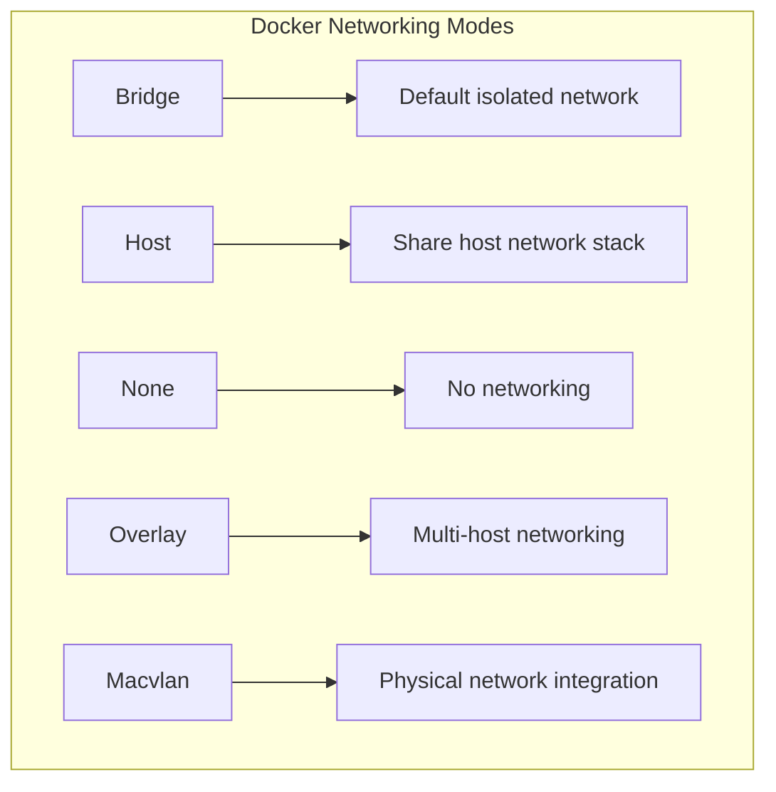
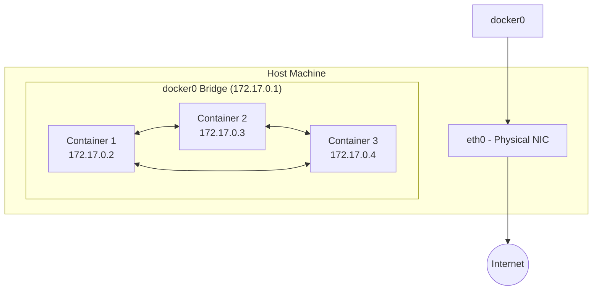
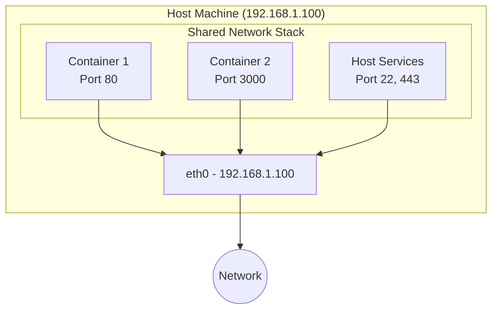
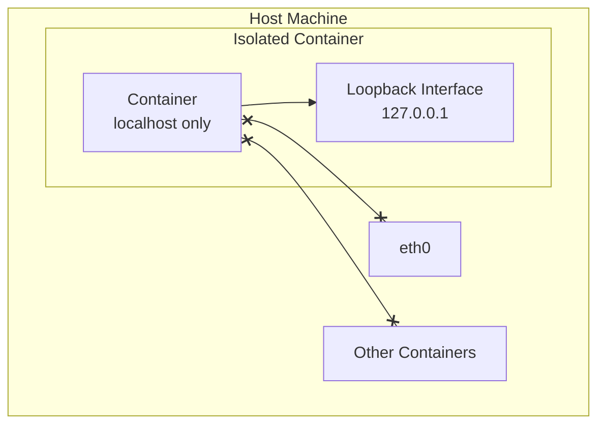
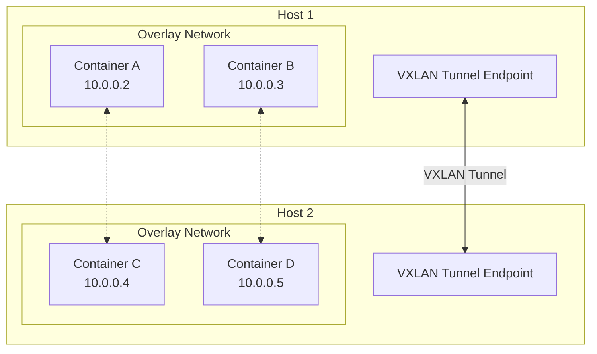
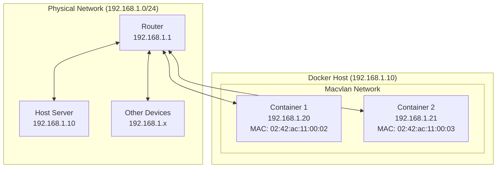
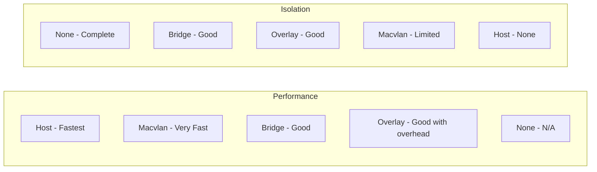

# How to Implement Docker Container Networking Modes

Author: [nawazdhandala](https://github.com/nawazdhandala)

Tags: Docker, Networking, Container Networking, Network Modes

Description: Learn to implement Docker networking modes including bridge, host, none, and overlay for different connectivity requirements.

---

Docker networking is a fundamental concept that determines how containers communicate with each other, the host system, and external networks. Understanding the different networking modes available in Docker allows you to design robust, secure, and performant container architectures. In this guide, we will explore each networking mode, understand when to use them, and implement practical examples.

## Overview of Docker Networking Modes

Docker provides several networking drivers out of the box, each designed for specific use cases:



Let us dive into each mode and understand how to implement them effectively.

---

## 1. Bridge Network Mode

The bridge network is the default networking mode in Docker. When you start a container without specifying a network, it connects to a default bridge network. Containers on the same bridge network can communicate with each other using IP addresses.

### How Bridge Networking Works



### Creating a Custom Bridge Network

While the default bridge network works, creating custom bridge networks provides better isolation and enables DNS-based container discovery.

```bash
# Create a custom bridge network
docker network create --driver bridge my-bridge-network

# Verify the network was created
docker network ls

# Inspect the network details
docker network inspect my-bridge-network
```

### Running Containers on a Bridge Network

```bash
# Start a container on the custom bridge network
docker run -d --name web-server --network my-bridge-network nginx:latest

# Start another container on the same network
docker run -d --name api-server --network my-bridge-network node:18-alpine

# Containers can now communicate using container names as hostnames
docker exec api-server ping web-server
```

### Advanced Bridge Network Configuration

You can customize your bridge network with specific subnet ranges and gateway addresses:

```bash
# Create a bridge network with custom subnet and gateway
docker network create \
  --driver bridge \
  --subnet 192.168.100.0/24 \
  --gateway 192.168.100.1 \
  --ip-range 192.168.100.128/25 \
  custom-bridge

# Run a container with a specific IP address
docker run -d \
  --name fixed-ip-container \
  --network custom-bridge \
  --ip 192.168.100.150 \
  nginx:latest
```

### Use Cases for Bridge Networks

- Development environments where containers need to communicate
- Microservices running on a single host
- Isolated application stacks
- Testing environments

---

## 2. Host Network Mode

In host network mode, the container shares the host machine's network namespace. This means the container does not get its own IP address - it uses the host's IP address and network interfaces directly.

### How Host Networking Works



### Implementing Host Network Mode

```bash
# Run a container with host networking
docker run -d --name host-nginx --network host nginx:latest

# The nginx server is now accessible directly on the host's IP at port 80
# No port mapping is needed or possible

# Verify the container is using host networking
docker inspect host-nginx --format '{{.HostConfig.NetworkMode}}'
```

### Practical Example - High Performance Web Server

```bash
# Running a high-performance web application with host networking
docker run -d \
  --name high-perf-app \
  --network host \
  -e PORT=8080 \
  my-web-application:latest

# The application is now accessible at http://<host-ip>:8080
```

### Use Cases for Host Networks

- Applications requiring maximum network performance
- Services that need to bind to specific host interfaces
- Legacy applications that expect to run directly on the host
- Network monitoring and debugging tools
- When you need to avoid NAT overhead

### Important Considerations

```bash
# Check for port conflicts before using host networking
netstat -tlnp | grep :80

# Host networking is only available on Linux
# On macOS and Windows, Docker runs in a VM, so host mode has limitations
```

---

## 3. None Network Mode

The none network mode completely disables networking for the container. The container only has a loopback interface and cannot communicate with other containers or external networks.

### How None Networking Works



### Implementing None Network Mode

```bash
# Run a container with no networking
docker run -d --name isolated-container --network none alpine:latest sleep infinity

# Verify the container has no external network access
docker exec isolated-container ip addr
# Output shows only the loopback interface (lo)

# Attempting to reach external networks will fail
docker exec isolated-container ping -c 1 8.8.8.8
# ping: sendto: Network is unreachable
```

### Practical Example - Secure Data Processing

```bash
# Run a sensitive data processing container with no network access
docker run -d \
  --name secure-processor \
  --network none \
  -v /data/input:/input:ro \
  -v /data/output:/output \
  data-processor:latest

# The container can only read from input and write to output volumes
# No data can be exfiltrated over the network
```

### Use Cases for None Networks

- Security-sensitive workloads that should never access the network
- Batch processing jobs that only work with local files
- Compliance requirements that mandate network isolation
- Testing container behavior without network dependencies

---

## 4. Overlay Network Mode

Overlay networks enable communication between containers running on different Docker hosts. This is essential for Docker Swarm deployments and multi-host container orchestration.

### How Overlay Networking Works



### Setting Up an Overlay Network with Docker Swarm

```bash
# Initialize Docker Swarm on the manager node
docker swarm init --advertise-addr <manager-ip>

# Join worker nodes to the swarm (run on worker nodes)
docker swarm join --token <token> <manager-ip>:2377

# Create an overlay network
docker network create \
  --driver overlay \
  --subnet 10.0.0.0/24 \
  --gateway 10.0.0.1 \
  my-overlay-network

# Verify the overlay network
docker network ls
```

### Deploying Services on Overlay Networks

```bash
# Create a service that uses the overlay network
docker service create \
  --name web-service \
  --network my-overlay-network \
  --replicas 3 \
  nginx:latest

# Create another service on the same network
docker service create \
  --name api-service \
  --network my-overlay-network \
  --replicas 2 \
  node:18-alpine

# Services can communicate using service names
# web-service can reach api-service at http://api-service:<port>
```

### Encrypted Overlay Networks

For sensitive communications, you can enable encryption on overlay networks:

```bash
# Create an encrypted overlay network
docker network create \
  --driver overlay \
  --opt encrypted \
  --subnet 10.0.1.0/24 \
  secure-overlay

# All traffic between containers on this network is encrypted using IPsec
```

### Attachable Overlay Networks

By default, overlay networks can only be used by Swarm services. To allow standalone containers to connect:

```bash
# Create an attachable overlay network
docker network create \
  --driver overlay \
  --attachable \
  attachable-overlay

# Now standalone containers can join this network
docker run -d --name standalone-container --network attachable-overlay nginx:latest
```

### Use Cases for Overlay Networks

- Multi-host Docker Swarm deployments
- Microservices spanning multiple servers
- High availability configurations
- Geographically distributed applications

---

## 5. Macvlan Network Mode

Macvlan networks allow containers to appear as physical devices on your network. Each container gets its own MAC address and can be assigned an IP address from your physical network's subnet.

### How Macvlan Networking Works



### Creating a Macvlan Network

```bash
# First, identify your host's network interface
ip link show
# Look for your primary interface, e.g., eth0, ens33, enp0s3

# Create a macvlan network
docker network create \
  --driver macvlan \
  --subnet 192.168.1.0/24 \
  --gateway 192.168.1.1 \
  -o parent=eth0 \
  my-macvlan

# Verify the network
docker network inspect my-macvlan
```

### Running Containers with Macvlan

```bash
# Run a container with a specific IP from your physical network
docker run -d \
  --name macvlan-container \
  --network my-macvlan \
  --ip 192.168.1.100 \
  nginx:latest

# The container is now accessible from other devices on the network
# at 192.168.1.100
```

### Macvlan with 802.1Q Trunk Bridge Mode

For VLAN-aware configurations:

```bash
# Create a macvlan network on a specific VLAN
docker network create \
  --driver macvlan \
  --subnet 192.168.10.0/24 \
  --gateway 192.168.10.1 \
  -o parent=eth0.10 \
  vlan10-macvlan

# Create another network on a different VLAN
docker network create \
  --driver macvlan \
  --subnet 192.168.20.0/24 \
  --gateway 192.168.20.1 \
  -o parent=eth0.20 \
  vlan20-macvlan
```

### Enabling Host-to-Container Communication

By default, the host cannot communicate with macvlan containers. To enable this:

```bash
# Create a macvlan interface on the host
ip link add macvlan-host link eth0 type macvlan mode bridge
ip addr add 192.168.1.200/24 dev macvlan-host
ip link set macvlan-host up

# Add a route to reach containers
ip route add 192.168.1.100/32 dev macvlan-host
```

### Use Cases for Macvlan Networks

- Legacy applications that expect direct network access
- Containers that need to be addressable from the physical network
- Network appliances and monitoring tools
- Applications requiring Layer 2 network features
- Integration with existing VLAN infrastructure

---

## Comparing Network Modes

Here is a comprehensive comparison of all Docker networking modes:



| Feature | Bridge | Host | None | Overlay | Macvlan |
|---------|--------|------|------|---------|---------|
| Container-to-container | Yes | Yes (same ports) | No | Yes (multi-host) | Yes |
| External access | NAT/Port mapping | Direct | No | NAT/Port mapping | Direct |
| Performance | Good | Best | N/A | Good | Very Good |
| Isolation | Good | Poor | Complete | Good | Limited |
| Multi-host | No | No | No | Yes | No |
| Custom IP | Yes | No | No | Yes | Yes |

---

## Best Practices for Docker Networking

### 1. Use Custom Bridge Networks

```bash
# Always create custom networks instead of using the default bridge
docker network create --driver bridge app-network

# This enables DNS resolution between containers
docker run -d --name db --network app-network postgres:15
docker run -d --name app --network app-network -e DB_HOST=db my-app:latest
```

### 2. Implement Network Segmentation

```bash
# Create separate networks for different tiers
docker network create frontend-net
docker network create backend-net
docker network create db-net

# Connect containers to appropriate networks
docker run -d --name nginx --network frontend-net nginx:latest
docker run -d --name api --network frontend-net --network backend-net api:latest
docker run -d --name db --network db-net postgres:15

# Connect the api container to the db network as well
docker network connect db-net api
```

### 3. Secure Overlay Networks

```bash
# Always use encryption for sensitive workloads
docker network create --driver overlay --opt encrypted production-network

# Limit which services can access the network
docker service create \
  --name secure-service \
  --network production-network \
  --constraint 'node.labels.security==high' \
  secure-app:latest
```

### 4. Monitor Network Performance

```bash
# Use built-in Docker stats
docker stats --format "table {{.Name}}\t{{.NetIO}}"

# Inspect network details
docker network inspect bridge --format '{{json .Containers}}' | jq

# Check container network configuration
docker inspect <container-id> --format '{{json .NetworkSettings.Networks}}' | jq
```

---

## Troubleshooting Common Networking Issues

### Container Cannot Reach External Network

```bash
# Check if IP forwarding is enabled
sysctl net.ipv4.ip_forward

# Enable IP forwarding if disabled
sudo sysctl -w net.ipv4.ip_forward=1

# Check iptables rules
sudo iptables -L -n -t nat
```

### Containers Cannot Communicate

```bash
# Verify both containers are on the same network
docker network inspect <network-name>

# Check container IP addresses
docker inspect -f '{{range .NetworkSettings.Networks}}{{.IPAddress}}{{end}}' <container-name>

# Test connectivity from inside a container
docker exec <container> ping <other-container-ip>
```

### DNS Resolution Not Working

```bash
# Custom bridge networks have built-in DNS
# Ensure you are using a custom network, not the default bridge
docker run -d --name test --network my-custom-network alpine:latest

# Check DNS configuration inside container
docker exec test cat /etc/resolv.conf
```

---

## Conclusion

Docker networking modes provide flexible options for different deployment scenarios. Understanding when to use each mode is crucial for building secure, performant, and maintainable container architectures:

- Use **bridge networks** for most single-host deployments and development environments
- Use **host networking** when you need maximum performance or direct host network access
- Use **none networking** for security-sensitive workloads that must be isolated
- Use **overlay networks** for multi-host deployments and Docker Swarm
- Use **macvlan networks** when containers need to appear as physical devices on your network

By mastering these networking modes, you can design Docker deployments that meet your specific requirements for connectivity, security, and performance.

## Further Reading

- [Docker Official Networking Documentation](https://docs.docker.com/network/)
- [Docker Swarm Networking Guide](https://docs.docker.com/engine/swarm/networking/)
- [Container Networking Best Practices](https://docs.docker.com/network/network-tutorial-standalone/)
