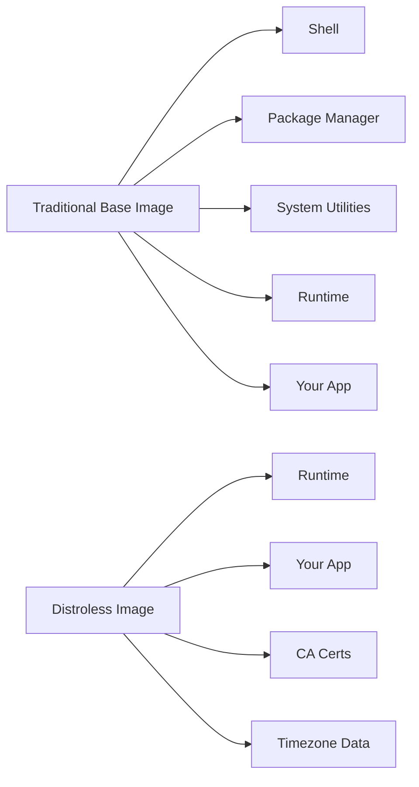
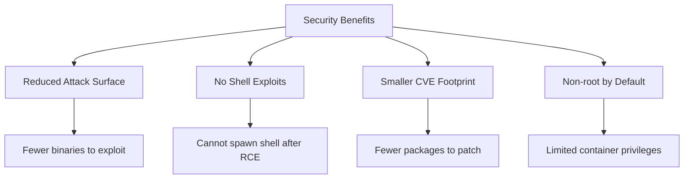

# How to Build Minimal Docker Images with Distroless

Author: [nawazdhandala](https://www.github.com/nawazdhandala)

Tags: Docker, Distroless, Security, Container, DevOps

Description: Build minimal and secure Docker images using Google's distroless base images for reduced attack surface and smaller image sizes.

---

When you deploy containers to production, every megabyte matters and every unnecessary binary is a potential security risk. Google's distroless images offer a compelling solution: base images that contain only your application and its runtime dependencies, nothing else. No shell, no package manager, no unnecessary utilities that could be exploited.

In this guide, we will explore how to build production-ready Docker images using distroless bases, covering multiple languages and real-world scenarios.

## What Are Distroless Images?

Distroless images are Docker base images published by Google that contain only the essential runtime components. Unlike traditional base images such as Ubuntu or Alpine, distroless images strip away everything that is not strictly necessary for running your application.

Here is what a distroless image includes:

- The application runtime (if needed)
- CA certificates for HTTPS connections
- Timezone data
- A non-root user

Here is what it excludes:

- Shell (bash, sh)
- Package managers (apt, apk)
- Common utilities (curl, wget, ls)
- Any unnecessary system libraries



## Available Distroless Image Variants

Google provides several distroless variants for different use cases. Each variant is optimized for specific runtimes.

| Image | Size | Use Case |
|-------|------|----------|
| `gcr.io/distroless/static` | ~2 MB | Statically compiled binaries (Go, Rust) |
| `gcr.io/distroless/base` | ~20 MB | Dynamically linked binaries |
| `gcr.io/distroless/cc` | ~21 MB | C/C++ applications with libgcc |
| `gcr.io/distroless/java17` | ~230 MB | Java 17 applications |
| `gcr.io/distroless/nodejs20` | ~130 MB | Node.js 20 applications |
| `gcr.io/distroless/python3` | ~50 MB | Python 3 applications |

Each image also comes with a `:nonroot` tag that runs as a non-root user by default.

## Building a Go Application with Distroless

Go applications are perfect candidates for distroless images because they can be compiled into static binaries with no external dependencies.

First, here is a simple Go application that serves HTTP requests:

```go
// main.go
package main

import (
    "fmt"
    "log"
    "net/http"
    "os"
)

func main() {
    // Get port from environment or default to 8080
    port := os.Getenv("PORT")
    if port == "" {
        port = "8080"
    }

    // Simple health check endpoint
    http.HandleFunc("/health", func(w http.ResponseWriter, r *http.Request) {
        w.WriteHeader(http.StatusOK)
        fmt.Fprintln(w, "OK")
    })

    // Main application endpoint
    http.HandleFunc("/", func(w http.ResponseWriter, r *http.Request) {
        fmt.Fprintln(w, "Hello from distroless!")
    })

    log.Printf("Server starting on port %s", port)
    log.Fatal(http.ListenAndServe(":"+port, nil))
}
```

Now, create a multi-stage Dockerfile that builds the Go binary and packages it with distroless:

```dockerfile
# Dockerfile for Go with distroless
# Stage 1: Build the Go binary
FROM golang:1.22-alpine AS builder

# Set working directory
WORKDIR /app

# Copy go mod files first for better layer caching
COPY go.mod go.sum ./
RUN go mod download

# Copy source code
COPY . .

# Build a static binary with CGO disabled
# This ensures the binary has no external dependencies
RUN CGO_ENABLED=0 GOOS=linux GOARCH=amd64 go build \
    -ldflags="-w -s" \
    -o /app/server \
    ./main.go

# Stage 2: Create minimal runtime image
FROM gcr.io/distroless/static:nonroot

# Copy the compiled binary from builder stage
COPY --from=builder /app/server /server

# Expose the application port
EXPOSE 8080

# Run as non-root user (UID 65532 is the nonroot user in distroless)
USER nonroot:nonroot

# Set the entrypoint
ENTRYPOINT ["/server"]
```

Build and run the image to verify everything works:

```bash
# Build the image
docker build -t myapp:distroless .

# Check the image size
docker images myapp:distroless
# REPOSITORY   TAG          SIZE
# myapp        distroless   8.2MB

# Run the container
docker run -p 8080:8080 myapp:distroless

# Test the endpoint
curl http://localhost:8080/health
```

## Building a Node.js Application with Distroless

Node.js applications require a JavaScript runtime, so we use the `distroless/nodejs` image variant.

Here is an Express.js application:

```javascript
// app.js
const express = require('express');
const app = express();

// Parse JSON request bodies
app.use(express.json());

// Health check endpoint for container orchestration
app.get('/health', (req, res) => {
    res.status(200).json({ status: 'healthy' });
});

// Main API endpoint
app.get('/api/greeting', (req, res) => {
    const name = req.query.name || 'World';
    res.json({ message: `Hello, ${name}!` });
});

// Start server on configured port
const PORT = process.env.PORT || 3000;
app.listen(PORT, () => {
    console.log(`Server running on port ${PORT}`);
});
```

The Dockerfile for Node.js requires copying node_modules since distroless does not include npm:

```dockerfile
# Dockerfile for Node.js with distroless
# Stage 1: Install dependencies and prepare application
FROM node:20-alpine AS builder

WORKDIR /app

# Copy package files for dependency installation
COPY package*.json ./

# Install production dependencies only
RUN npm ci --only=production

# Copy application source code
COPY . .

# Stage 2: Create minimal runtime image
FROM gcr.io/distroless/nodejs20:nonroot

WORKDIR /app

# Copy node_modules and application code from builder
COPY --from=builder /app/node_modules ./node_modules
COPY --from=builder /app/app.js ./

# Expose application port
EXPOSE 3000

# Run the application
# Note: distroless nodejs images use node as the entrypoint
CMD ["app.js"]
```

## Building a Python Application with Distroless

Python applications can also use distroless, though they require copying the virtual environment with all dependencies.

```python
# app.py
from flask import Flask, jsonify
import os

app = Flask(__name__)

@app.route('/health')
def health():
    """Health check endpoint for load balancers and orchestrators."""
    return jsonify({'status': 'healthy'}), 200

@app.route('/')
def home():
    """Main application endpoint."""
    return jsonify({
        'message': 'Hello from Python distroless!',
        'version': '1.0.0'
    })

if __name__ == '__main__':
    port = int(os.environ.get('PORT', 5000))
    app.run(host='0.0.0.0', port=port)
```

Here is the multi-stage Dockerfile for Python:

```dockerfile
# Dockerfile for Python with distroless
# Stage 1: Build virtual environment with dependencies
FROM python:3.11-slim AS builder

WORKDIR /app

# Create virtual environment
RUN python -m venv /opt/venv
ENV PATH="/opt/venv/bin:$PATH"

# Install dependencies in the virtual environment
COPY requirements.txt .
RUN pip install --no-cache-dir -r requirements.txt

# Stage 2: Create minimal runtime image
FROM gcr.io/distroless/python3

WORKDIR /app

# Copy virtual environment from builder
COPY --from=builder /opt/venv /opt/venv

# Copy application code
COPY app.py .

# Set environment variables for Python
ENV PATH="/opt/venv/bin:$PATH"
ENV PYTHONUNBUFFERED=1

# Expose application port
EXPOSE 5000

# Run the application
CMD ["app.py"]
```

## Debugging Distroless Containers

One challenge with distroless images is debugging. Without a shell, you cannot exec into the container to troubleshoot issues. Here are several strategies to work around this limitation.

### Use Debug Images During Development

Google provides debug variants of distroless images that include BusyBox:

```dockerfile
# Use debug image during development
FROM gcr.io/distroless/static:debug

# This image includes a shell at /busybox/sh
```

You can exec into the debug container:

```bash
# Run with debug image
docker run -it --entrypoint /busybox/sh myapp:debug
```

### Add Structured Logging

Since you cannot inspect the container manually, ensure your application logs everything necessary:

```go
// Use structured logging for better observability
log.Printf(`{"level":"info","event":"request","path":"%s","method":"%s","status":%d}`,
    r.URL.Path, r.Method, statusCode)
```

### Use Ephemeral Debug Containers in Kubernetes

Kubernetes supports ephemeral debug containers that attach to running pods:

```bash
# Attach a debug container to a running pod
kubectl debug -it myapp-pod --image=busybox:latest --target=myapp
```

## Security Benefits of Distroless

Using distroless images significantly improves your container security posture.



### CVE Comparison

Running a vulnerability scan on different base images reveals the security advantage:

```bash
# Scan Ubuntu-based image
trivy image myapp:ubuntu
# Total: 142 vulnerabilities (32 HIGH, 5 CRITICAL)

# Scan Alpine-based image
trivy image myapp:alpine
# Total: 12 vulnerabilities (2 HIGH, 0 CRITICAL)

# Scan Distroless image
trivy image myapp:distroless
# Total: 0 vulnerabilities
```

## Best Practices

When working with distroless images, follow these guidelines for the best results:

1. **Always use multi-stage builds** to keep your final image minimal
2. **Use the :nonroot tag** to run containers as non-root by default
3. **Include health checks** in your application since you cannot rely on external health check scripts
4. **Implement comprehensive logging** since you cannot debug interactively
5. **Pin image digests in production** for reproducible builds
6. **Use debug images only in development** and never deploy them to production

## Conclusion

Distroless images represent the next evolution in container security and efficiency. By stripping away everything except what your application needs, you get smaller images that deploy faster, have fewer vulnerabilities, and present a minimal attack surface.

The tradeoff is reduced debuggability, but with proper logging, monitoring, and the occasional use of debug images during development, this becomes a manageable challenge. For production workloads where security matters, distroless images should be your default choice.

Start with the language-specific distroless image that matches your runtime, use multi-stage builds to keep things clean, and enjoy the benefits of truly minimal containers.
