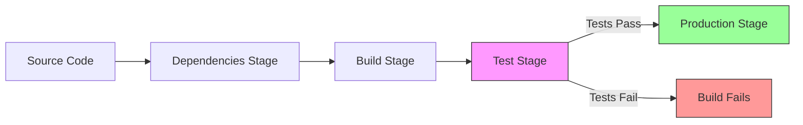
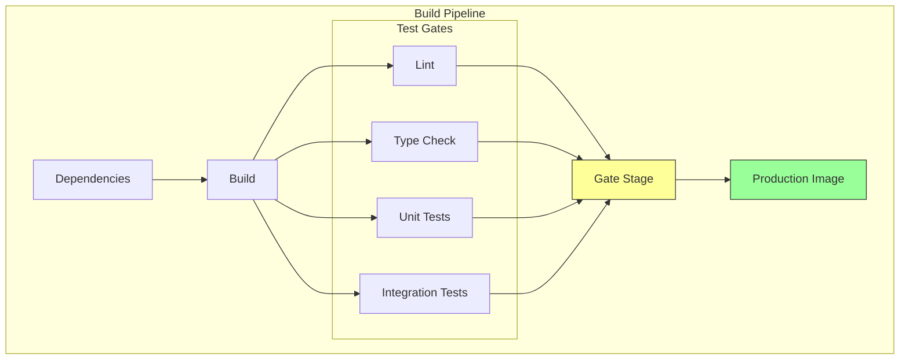

# How to Build Docker Images with Test Stages

Author: [nawazdhandala](https://github.com/nawazdhandala)

Tags: Docker, Testing, CI/CD, DevOps

Description: Learn how to integrate testing directly into your Docker builds using multi-stage Dockerfiles to catch bugs before images reach production.

---

Running tests inside Docker builds ensures your application works in the exact environment where it will run in production. Instead of hoping your local test results translate to container behavior, you verify everything in context. Here is how to structure Dockerfiles with dedicated test stages.

## Why Test Inside Docker Builds

Traditional CI pipelines run tests on the host machine, then build a Docker image separately. This creates a gap: tests pass on Ubuntu runners but fail in Alpine containers due to missing libraries or different Node versions.

Testing inside Docker solves this by:

- Running tests in the same base image as production
- Catching dependency issues before deployment
- Failing the build early if tests fail
- Creating a single source of truth for "does this code work"

## The Build Pipeline Flow

This diagram shows how code flows through a multi-stage Docker build with integrated testing.



## Basic Test Stage Pattern

The key insight is that Docker stops building when any stage fails. By placing tests in a stage that must complete before the production stage, failing tests abort the entire build.

```dockerfile
# syntax=docker/dockerfile:1

# Stage 1: Install dependencies
FROM node:20-alpine AS deps
WORKDIR /app
COPY package.json package-lock.json ./
RUN npm ci

# Stage 2: Build the application
FROM deps AS build
COPY . .
RUN npm run build

# Stage 3: Run tests (this stage must succeed for the build to continue)
FROM build AS test
# Run the full test suite
# If any test fails, this stage fails and the build stops here
RUN npm run test

# Stage 4: Production image (only built if tests pass)
FROM node:20-alpine AS production
WORKDIR /app

# Create non-root user for security
RUN addgroup --system --gid 1001 nodejs && \
    adduser --system --uid 1001 nodejs

# Copy only production artifacts
COPY --from=deps /app/node_modules ./node_modules
COPY --from=build /app/dist ./dist
COPY package.json ./

USER nodejs
EXPOSE 3000
CMD ["node", "dist/index.js"]
```

## Separating Unit and Integration Tests

Different test types have different requirements. Unit tests need only the build output. Integration tests may need database connections, external services, or test fixtures. Separating them into distinct stages gives you control over what runs and when.

```dockerfile
# syntax=docker/dockerfile:1

FROM node:20-alpine AS base
WORKDIR /app

# Dependencies stage
FROM base AS deps
COPY package.json package-lock.json ./
RUN npm ci

# Build stage
FROM deps AS build
COPY . .
RUN npm run build

# Unit tests - fast, no external dependencies
# These run in isolation with mocked dependencies
FROM build AS unit-test
ENV NODE_ENV=test
# Unit tests should complete in seconds
RUN npm run test:unit

# Integration test base - includes test utilities and fixtures
FROM build AS integration-base
# Install test dependencies that may include database clients
RUN npm install --save-dev testcontainers supertest
COPY tests/fixtures ./tests/fixtures

# Integration tests - may need external services
# These verify your app works with real databases, APIs, etc.
FROM integration-base AS integration-test
ENV NODE_ENV=test
# Integration tests take longer but catch more issues
RUN npm run test:integration

# Production image - only reached if all tests pass
FROM base AS production
ENV NODE_ENV=production

RUN addgroup --system --gid 1001 nodejs && \
    adduser --system --uid 1001 nodejs

COPY --from=deps /app/node_modules ./node_modules
COPY --from=build /app/dist ./dist

USER nodejs
CMD ["node", "dist/index.js"]
```

## Test Stage with Coverage Reports

Generating coverage reports during the build lets you extract them as artifacts. The coverage stage produces HTML and JSON reports that can be copied out of the build context.

```dockerfile
# syntax=docker/dockerfile:1

FROM node:20-alpine AS deps
WORKDIR /app
COPY package.json package-lock.json ./
RUN npm ci

FROM deps AS build
COPY . .
RUN npm run build

# Test with coverage - generates reports you can extract
FROM build AS test-coverage
ENV NODE_ENV=test

# Run tests with coverage enabled
# Jest outputs to /app/coverage by default
RUN npm run test -- --coverage --coverageDirectory=/app/coverage

# The coverage reports now exist at /app/coverage
# Extract them with: docker build --target test-coverage --output type=local,dest=./coverage .

# Production stage
FROM node:20-alpine AS production
WORKDIR /app

RUN addgroup --system --gid 1001 nodejs && \
    adduser --system --uid 1001 nodejs

COPY --from=deps /app/node_modules ./node_modules
COPY --from=build /app/dist ./dist

USER nodejs
CMD ["node", "dist/index.js"]
```

Extract coverage reports using the output flag:

```bash
# Build only the test-coverage stage and export results to local filesystem
# This runs tests and copies the coverage directory to your host machine
docker build --target test-coverage --output type=local,dest=./coverage-report .

# View the HTML coverage report
open coverage-report/coverage/lcov-report/index.html
```

## Conditional Test Execution

Sometimes you want to skip tests for quick iteration during development. Build arguments let you control whether test stages execute.

```dockerfile
# syntax=docker/dockerfile:1

# Build argument to control test execution (default: run tests)
ARG RUN_TESTS=true

FROM node:20-alpine AS deps
WORKDIR /app
COPY package.json package-lock.json ./
RUN npm ci

FROM deps AS build
COPY . .
RUN npm run build

# Test stage - conditionally execute tests based on build arg
FROM build AS test
ARG RUN_TESTS
# This conditional runs tests only if RUN_TESTS is "true"
# The ":" command is a no-op that always succeeds
RUN if [ "$RUN_TESTS" = "true" ]; then npm run test; else echo "Tests skipped"; fi

FROM node:20-alpine AS production
WORKDIR /app

RUN addgroup --system --gid 1001 nodejs && \
    adduser --system --uid 1001 nodejs

COPY --from=deps /app/node_modules ./node_modules
COPY --from=build /app/dist ./dist

USER nodejs
CMD ["node", "dist/index.js"]
```

Control test execution from the command line:

```bash
# Full build with tests (default, for CI/CD)
docker build -t myapp:latest .

# Skip tests for local development iteration
docker build --build-arg RUN_TESTS=false -t myapp:dev .
```

## Testing with External Services

Integration tests often need databases or other services. Docker Compose can orchestrate these dependencies during the test stage.

```yaml
# docker-compose.test.yml
# This file defines the test environment with all required services

services:
  # The application under test
  app:
    build:
      context: .
      target: integration-base  # Stop at the stage before running tests
    command: npm run test:integration
    environment:
      - DATABASE_URL=postgres://test:test@db:5432/testdb
      - REDIS_URL=redis://cache:6379
    depends_on:
      db:
        condition: service_healthy  # Wait for database to be ready
      cache:
        condition: service_started

  # Test database
  db:
    image: postgres:16-alpine
    environment:
      POSTGRES_USER: test
      POSTGRES_PASSWORD: test
      POSTGRES_DB: testdb
    healthcheck:
      test: ["CMD-SHELL", "pg_isready -U test -d testdb"]
      interval: 5s
      timeout: 5s
      retries: 5

  # Test cache
  cache:
    image: redis:7-alpine
```

Run the integration test suite:

```bash
# Start services, run tests, then tear everything down
# --abort-on-container-exit stops all services when the app container exits
# --exit-code-from app returns the test exit code to the shell
docker compose -f docker-compose.test.yml up \
  --build \
  --abort-on-container-exit \
  --exit-code-from app

# Clean up volumes to ensure fresh state on next run
docker compose -f docker-compose.test.yml down -v
```

## GitHub Actions Integration

This workflow runs tests as part of the Docker build and only pushes images if tests pass. The test stage acts as a gate.

```yaml
name: Build and Test

on:
  push:
    branches: [main]
  pull_request:
    branches: [main]

jobs:
  test-and-build:
    runs-on: ubuntu-latest
    steps:
      # Check out the repository
      - uses: actions/checkout@v4

      # Set up Docker buildx for advanced build features
      - uses: docker/setup-buildx-action@v3

      # Run the test stage explicitly
      # This builds up through the test stage but stops there
      - name: Run tests in Docker
        uses: docker/build-push-action@v5
        with:
          context: .
          target: test  # Build only up to the test stage
          push: false
          # Cache layers to speed up subsequent builds
          cache-from: type=gha
          cache-to: type=gha,mode=max

      # Only build production image if tests passed
      # This step only runs if the previous step succeeded
      - name: Build production image
        uses: docker/build-push-action@v5
        with:
          context: .
          target: production
          push: ${{ github.event_name == 'push' }}  # Push only on merge to main
          tags: ghcr.io/${{ github.repository }}:${{ github.sha }}
          cache-from: type=gha
          cache-to: type=gha,mode=max
```

## Parallel Test Execution

Large test suites benefit from parallelization. This pattern runs different test categories in parallel stages, then gates the production build on all of them passing.

```dockerfile
# syntax=docker/dockerfile:1

FROM node:20-alpine AS deps
WORKDIR /app
COPY package.json package-lock.json ./
RUN npm ci

FROM deps AS build
COPY . .
RUN npm run build

# Parallel test stages - these can run concurrently in CI

# Lint check
FROM build AS lint
RUN npm run lint

# Type check
FROM build AS typecheck
RUN npm run typecheck

# Unit tests
FROM build AS unit-test
RUN npm run test:unit

# End-to-end tests
FROM build AS e2e-test
RUN npx playwright install --with-deps chromium
RUN npm run test:e2e

# Gate stage - depends on all test stages
# This stage copies from each test stage, forcing them all to complete
FROM node:20-alpine AS gate
COPY --from=lint /app/package.json /tmp/lint-passed
COPY --from=typecheck /app/package.json /tmp/typecheck-passed
COPY --from=unit-test /app/package.json /tmp/unit-passed
COPY --from=e2e-test /app/package.json /tmp/e2e-passed

# Production image - only built if gate stage succeeds
FROM node:20-alpine AS production
WORKDIR /app

RUN addgroup --system --gid 1001 nodejs && \
    adduser --system --uid 1001 nodejs

COPY --from=deps /app/node_modules ./node_modules
COPY --from=build /app/dist ./dist
# This COPY forces the gate stage to complete, which forces all tests to pass
COPY --from=gate /tmp/lint-passed /tmp/.gate

USER nodejs
CMD ["node", "dist/index.js"]
```

## Test Stage Debugging

When tests fail, you need to investigate. Building to a specific stage and running interactively gives you access to the test environment.

```bash
# Build up to the test stage but do not run the test command
docker build --target build -t myapp:debug .

# Run an interactive shell in the test environment
# This drops you into the container where you can run tests manually
docker run -it --rm myapp:debug sh

# Inside the container, you can:
# - Run individual tests: npm run test -- --testPathPattern="auth"
# - Debug failing tests: npm run test -- --verbose
# - Inspect the built output: ls dist/
```

## Python Example

The same pattern works for Python applications. This example shows pytest integration with coverage.

```dockerfile
# syntax=docker/dockerfile:1

FROM python:3.12-slim AS base
WORKDIR /app
ENV PYTHONDONTWRITEBYTECODE=1
ENV PYTHONUNBUFFERED=1

# Install dependencies
FROM base AS deps
COPY requirements.txt requirements-dev.txt ./
# Install both production and dev dependencies for testing
RUN pip install --no-cache-dir -r requirements.txt -r requirements-dev.txt

# Copy application code
FROM deps AS build
COPY . .

# Run tests with pytest
FROM build AS test
# Run pytest with coverage and fail on any test failure
# --cov generates coverage report, --cov-fail-under enforces minimum coverage
RUN pytest --cov=app --cov-report=html --cov-fail-under=80 tests/

# Production image - minimal runtime
FROM python:3.12-slim AS production
WORKDIR /app

# Create non-root user
RUN useradd --create-home --shell /bin/bash appuser

# Install only production dependencies
COPY requirements.txt ./
RUN pip install --no-cache-dir -r requirements.txt

# Copy application code
COPY --chown=appuser:appuser app ./app

USER appuser
CMD ["python", "-m", "app.main"]
```

## Go Example

Go applications can compile tests into the build and run them before producing the final binary.

```dockerfile
# syntax=docker/dockerfile:1

FROM golang:1.22-alpine AS build
WORKDIR /src

# Download dependencies (cached if go.mod unchanged)
COPY go.mod go.sum ./
RUN go mod download

# Copy source code
COPY . .

# Run tests before building
# -v for verbose output, -race to detect race conditions
# go test returns non-zero exit code on failure, stopping the build
FROM build AS test
RUN go test -v -race ./...

# Build the production binary
# Only reached if tests pass
FROM build AS compile
# CGO_ENABLED=0 creates a static binary
# -ldflags="-s -w" strips debug info for smaller binary
RUN CGO_ENABLED=0 go build -ldflags="-s -w" -o /app ./cmd/server

# Minimal production image
FROM gcr.io/distroless/static-debian12 AS production
COPY --from=compile /app /app
USER 65532:65532
ENTRYPOINT ["/app"]
```

## Stage Dependencies Diagram

This diagram illustrates how test stages gate the production build.



## Summary

| Pattern | Use Case |
|---------|----------|
| Basic test stage | Simple applications with fast tests |
| Separated unit/integration | Different test requirements per type |
| Coverage extraction | CI/CD reporting and enforcement |
| Conditional tests | Development vs production builds |
| External services | Database or API integration tests |
| Parallel stages | Large test suites needing speed |
| Gate stage | Enforcing all tests pass before production |

Test stages in Docker builds shift testing left in your pipeline. Tests run in the exact environment your code will run in production, and failing tests prevent broken images from ever being created. This is the foundation of reliable container deployments.
