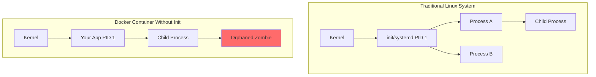
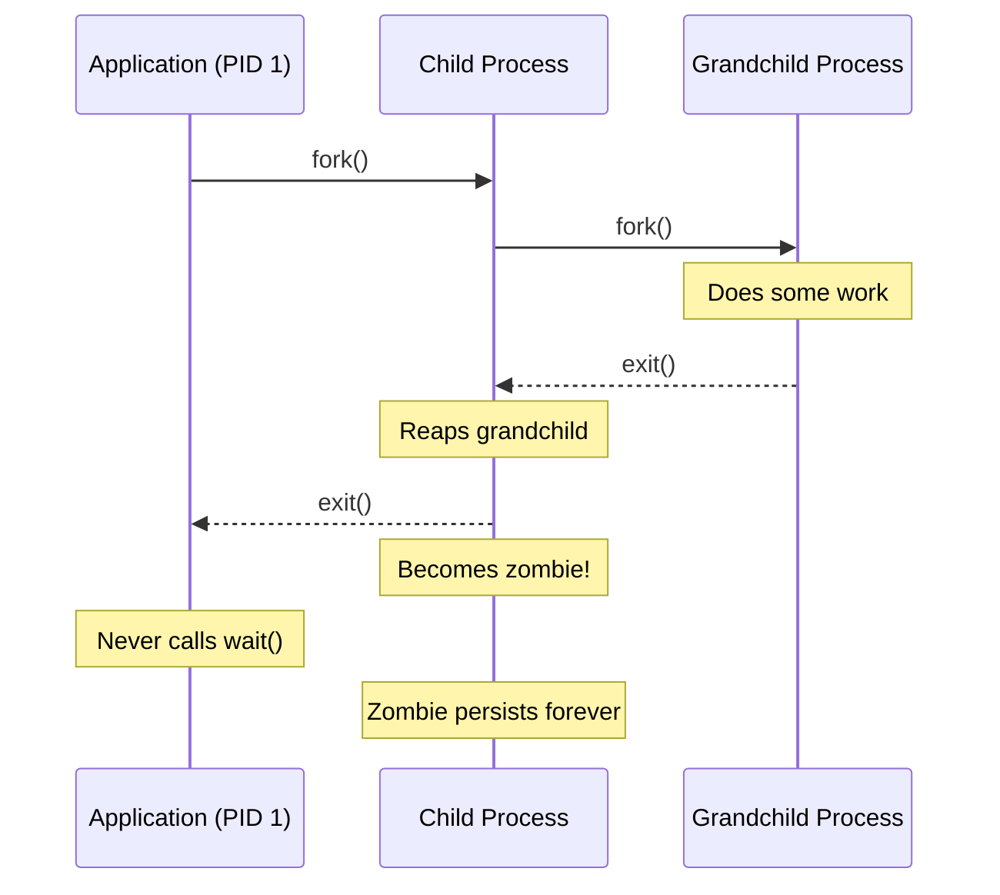
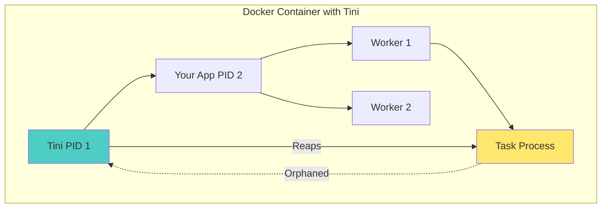
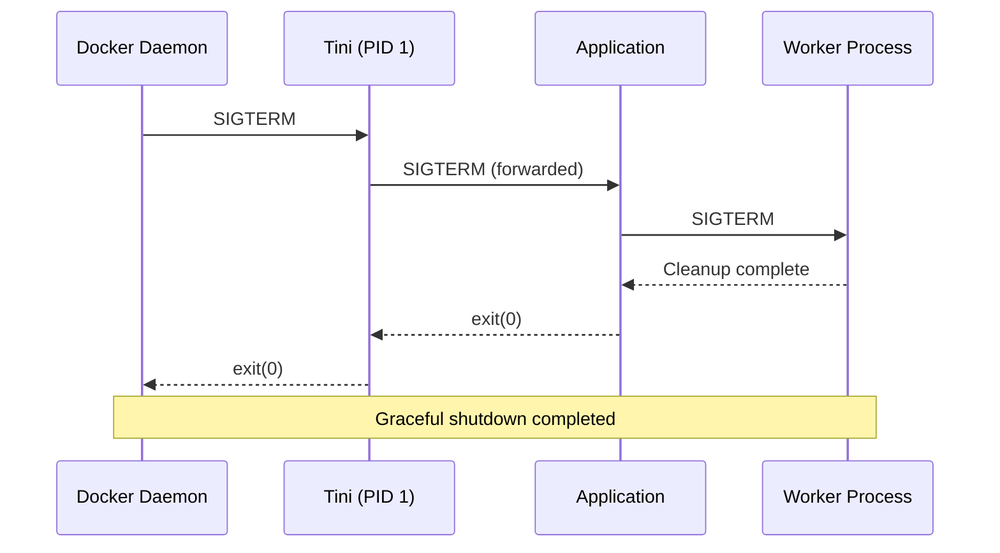
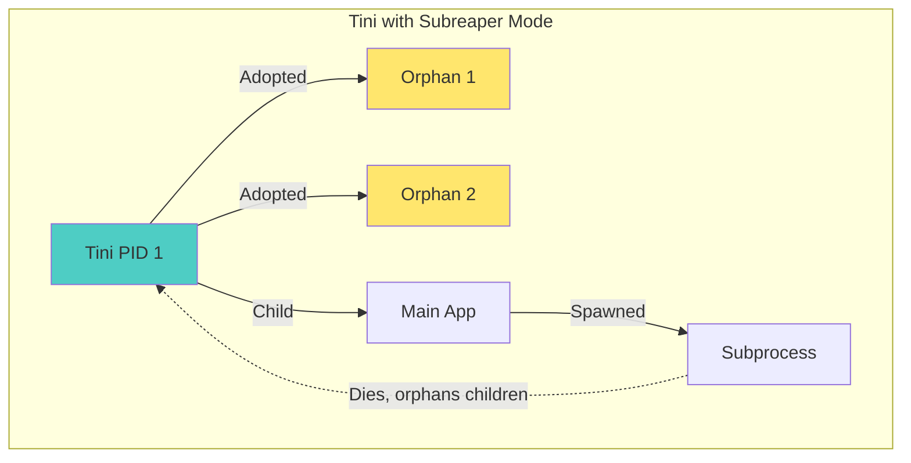

# How to Implement Docker Container Init Process

Author: [nawazdhandala](https://github.com/nawazdhandala)

Tags: Docker, Init Process, Tini, Signal Handling

Description: Learn to implement proper init processes in Docker containers with tini, signal forwarding, and zombie process reaping for reliable container operation.

---

When running applications inside Docker containers, many developers overlook a critical aspect of process management - the init process. Without a proper init process, your containers may fail to handle signals correctly, accumulate zombie processes, and behave unpredictably during shutdown. This guide will walk you through implementing robust init processes in your Docker containers.

## Understanding the PID 1 Problem

In Linux systems, the process with PID 1 (the init process) has special responsibilities:

1. **Signal Handling**: PID 1 does not receive default signal handlers from the kernel
2. **Zombie Reaping**: It must reap orphaned child processes (zombies)
3. **System Lifecycle**: It manages the lifecycle of all other processes

When you run a container without an init process, your application becomes PID 1 and inherits these responsibilities - responsibilities most applications are not designed to handle.



### What Happens Without an Init Process?

Consider this scenario:

```dockerfile
FROM node:20-alpine
COPY app.js /app/
CMD ["node", "/app/app.js"]
```

When your Node.js application runs as PID 1:

1. **SIGTERM is ignored**: By default, signals like SIGTERM have no default action for PID 1, meaning your container may not stop gracefully
2. **Zombies accumulate**: If your app spawns child processes that create their own children, orphaned processes become zombies
3. **Resource leaks**: Zombie processes consume PIDs and can eventually exhaust the PID namespace

## The Zombie Process Problem

Zombie processes occur when a child process terminates but its parent does not call `wait()` to collect its exit status. In a normal system, init adopts and reaps these orphans. In a container without init, they accumulate.



## Solutions: Tini and Dumb-Init

Two popular lightweight init systems solve these problems:

### Tini

[Tini](https://github.com/krallin/tini) is a minimal init system specifically designed for containers. It:

- Spawns a single child process
- Forwards all signals to the child
- Reaps zombie processes
- Exits with the child's exit code

### Dumb-Init

[Dumb-init](https://github.com/Yelp/dumb-init) provides similar functionality with some additional features for signal rewriting.

## Implementing Tini in Your Containers

### Method 1: Docker's Built-in Init

Docker has Tini built in. Simply add the `--init` flag:

```bash
docker run --init my-application
```

This is the simplest approach and works for most use cases.

### Method 2: Installing Tini in Your Dockerfile

For more control, install Tini directly in your image:

```dockerfile
FROM node:20-alpine

# Install tini
RUN apk add --no-cache tini

# Set tini as the entrypoint
ENTRYPOINT ["/sbin/tini", "--"]

# Your application command
CMD ["node", "/app/app.js"]
```

### Method 3: Using Tini with Docker Compose

```yaml
version: '3.8'
services:
  web:
    image: my-application
    init: true
    # Other configuration...
```

### Method 4: Multi-stage Build with Tini

For minimal image size:

```dockerfile
FROM alpine:3.19 AS tini
RUN apk add --no-cache tini

FROM node:20-alpine
COPY --from=tini /sbin/tini /sbin/tini
ENTRYPOINT ["/sbin/tini", "--"]
CMD ["node", "/app/app.js"]
```

## Process Architecture with Tini

Here is how the process hierarchy looks with Tini:



## Signal Handling Deep Dive

Understanding signal flow is crucial for graceful shutdowns:



### Implementing Signal Handlers

Your application should handle signals properly:

**Node.js Example:**

```javascript
// app.js
const http = require('http');

const server = http.createServer((req, res) => {
  res.writeHead(200);
  res.end('Hello World\n');
});

// Graceful shutdown handler
const shutdown = (signal) => {
  console.log(`Received ${signal}, shutting down gracefully...`);

  server.close(() => {
    console.log('HTTP server closed');
    process.exit(0);
  });

  // Force exit after timeout
  setTimeout(() => {
    console.error('Forced shutdown after timeout');
    process.exit(1);
  }, 10000);
};

// Register signal handlers
process.on('SIGTERM', () => shutdown('SIGTERM'));
process.on('SIGINT', () => shutdown('SIGINT'));

server.listen(3000, () => {
  console.log('Server running on port 3000');
});
```

**Python Example:**

```python
import signal
import sys
import time
from http.server import HTTPServer, SimpleHTTPRequestHandler

server = None

def shutdown_handler(signum, frame):
    signal_name = signal.Signals(signum).name
    print(f"Received {signal_name}, shutting down gracefully...")

    if server:
        server.shutdown()

    sys.exit(0)

def main():
    global server

    # Register signal handlers
    signal.signal(signal.SIGTERM, shutdown_handler)
    signal.signal(signal.SIGINT, shutdown_handler)

    server = HTTPServer(('0.0.0.0', 8000), SimpleHTTPRequestHandler)
    print("Server running on port 8000")
    server.serve_forever()

if __name__ == '__main__':
    main()
```

**Go Example:**

```go
package main

import (
    "context"
    "fmt"
    "net/http"
    "os"
    "os/signal"
    "syscall"
    "time"
)

func main() {
    server := &http.Server{Addr: ":8080"}

    http.HandleFunc("/", func(w http.ResponseWriter, r *http.Request) {
        fmt.Fprintf(w, "Hello World\n")
    })

    // Channel to listen for signals
    stop := make(chan os.Signal, 1)
    signal.Notify(stop, syscall.SIGTERM, syscall.SIGINT)

    // Start server in goroutine
    go func() {
        fmt.Println("Server running on port 8080")
        if err := server.ListenAndServe(); err != http.ErrServerClosed {
            fmt.Printf("Server error: %v\n", err)
        }
    }()

    // Wait for signal
    sig := <-stop
    fmt.Printf("Received %v, shutting down gracefully...\n", sig)

    // Graceful shutdown with timeout
    ctx, cancel := context.WithTimeout(context.Background(), 10*time.Second)
    defer cancel()

    if err := server.Shutdown(ctx); err != nil {
        fmt.Printf("Shutdown error: %v\n", err)
        os.Exit(1)
    }

    fmt.Println("Server stopped")
}
```

## Complete Dockerfile Examples

### Node.js Application

```dockerfile
FROM node:20-alpine

# Install tini
RUN apk add --no-cache tini

# Create app directory
WORKDIR /app

# Copy package files
COPY package*.json ./

# Install dependencies
RUN npm ci --only=production

# Copy application code
COPY . .

# Create non-root user
RUN addgroup -g 1001 -S nodejs && \
    adduser -S nodejs -u 1001

USER nodejs

# Expose port
EXPOSE 3000

# Use tini as init
ENTRYPOINT ["/sbin/tini", "--"]

# Start application
CMD ["node", "app.js"]
```

### Python Application

```dockerfile
FROM python:3.12-slim

# Install tini
RUN apt-get update && \
    apt-get install -y --no-install-recommends tini && \
    rm -rf /var/lib/apt/lists/*

WORKDIR /app

# Copy requirements and install
COPY requirements.txt .
RUN pip install --no-cache-dir -r requirements.txt

# Copy application
COPY . .

# Create non-root user
RUN useradd -m -u 1001 appuser
USER appuser

EXPOSE 8000

ENTRYPOINT ["/usr/bin/tini", "--"]
CMD ["python", "app.py"]
```

### Go Application

```dockerfile
# Build stage
FROM golang:1.22-alpine AS builder

WORKDIR /build
COPY go.* ./
RUN go mod download

COPY . .
RUN CGO_ENABLED=0 go build -o /app/server .

# Runtime stage
FROM alpine:3.19

RUN apk add --no-cache tini

COPY --from=builder /app/server /app/server

RUN adduser -D -u 1001 appuser
USER appuser

EXPOSE 8080

ENTRYPOINT ["/sbin/tini", "--"]
CMD ["/app/server"]
```

## Tini Command Line Options

Tini provides several useful options:

```bash
# Basic usage
tini -- your-command

# Verbose mode - log signals received
tini -v -- your-command

# Subreaper mode - register as a subreaper
tini -s -- your-command

# Signal forwarding to process group
tini -g -- your-command

# Ignore specific signal (e.g., ignore SIGHUP)
tini -e 1 -- your-command
```

### When to Use Subreaper Mode

The `-s` flag enables subreaper mode, which is useful when your application forks processes:

```dockerfile
ENTRYPOINT ["/sbin/tini", "-s", "--"]
```



## Comparing Solutions

| Feature | Tini | Dumb-Init | Docker --init | No Init |
|---------|------|-----------|---------------|---------|
| Zombie Reaping | Yes | Yes | Yes | No |
| Signal Forwarding | Yes | Yes | Yes | No |
| Signal Rewriting | No | Yes | No | N/A |
| Image Size | ~20KB | ~50KB | Built-in | N/A |
| Subreaper Support | Yes | No | Yes | N/A |
| Process Group Signals | Yes | Yes | Yes | No |

## Best Practices

### 1. Always Use an Init Process

Even if your application handles signals, an init process provides defense in depth:

```dockerfile
# Always include
ENTRYPOINT ["/sbin/tini", "--"]
```

### 2. Use Exec Form for CMD

Always use exec form (JSON array) to ensure proper signal handling:

```dockerfile
# Good - exec form
CMD ["node", "app.js"]

# Bad - shell form (creates extra shell process)
CMD node app.js
```

### 3. Set Appropriate Stop Timeout

Configure Docker's stop timeout to allow graceful shutdown:

```yaml
# docker-compose.yml
services:
  web:
    image: my-app
    init: true
    stop_grace_period: 30s
```

### 4. Handle Multiple Signals

Your application should handle both SIGTERM and SIGINT:

```javascript
['SIGTERM', 'SIGINT'].forEach(signal => {
  process.on(signal, () => shutdown(signal));
});
```

### 5. Log Signal Reception

Logging helps with debugging shutdown issues:

```python
def shutdown_handler(signum, frame):
    logger.info(f"Received signal {signum}, initiating shutdown")
    # ... shutdown logic
```

### 6. Test Your Shutdown

Verify your container shuts down correctly:

```bash
# Start container
docker run -d --name test-app --init my-app

# Send SIGTERM and watch logs
docker stop test-app && docker logs test-app

# Check exit code
docker inspect test-app --format='{{.State.ExitCode}}'
```

## Debugging Init Process Issues

### Check if Zombies Exist

```bash
# Inside the container
ps aux | awk '$8 ~ /^Z/ { print }'

# Or from the host
docker exec my-container ps aux | grep -w Z
```

### Verify Signal Handling

```bash
# Send SIGTERM to container
docker kill --signal=SIGTERM my-container

# Check if container stopped gracefully
docker inspect my-container --format='{{.State.ExitCode}}'
# 0 = graceful, 137 = killed (128 + 9)
```

### View Process Tree

```bash
# Inside container
apk add --no-cache pstree  # Alpine
apt-get install -y psmisc  # Debian/Ubuntu

pstree -p
```

## Summary

Implementing a proper init process in Docker containers is essential for:

- Correct signal handling and graceful shutdowns
- Prevention of zombie process accumulation
- Reliable container lifecycle management

The simplest approach is using Docker's built-in `--init` flag or adding Tini to your Dockerfile. Combined with proper signal handling in your application, this ensures your containers behave predictably and shut down gracefully.

Remember these key points:

1. Your application is not designed to be PID 1
2. Always use an init process (Tini, dumb-init, or --init)
3. Implement proper signal handlers in your application
4. Use exec form for CMD in Dockerfiles
5. Test your shutdown behavior regularly

By following these practices, you will build more robust and production-ready containerized applications.
