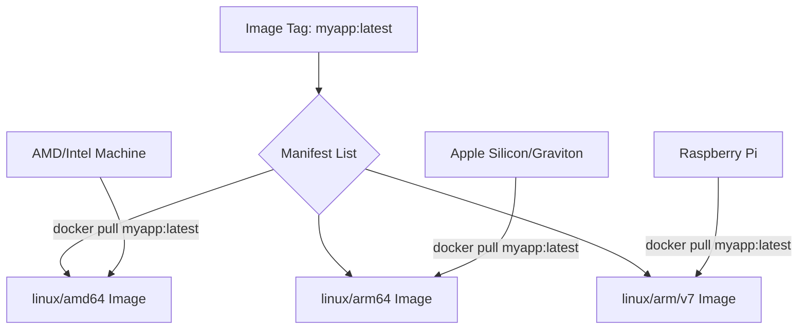
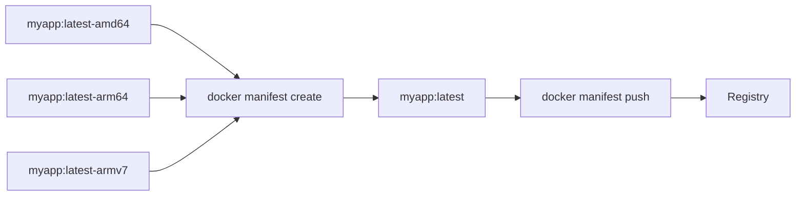
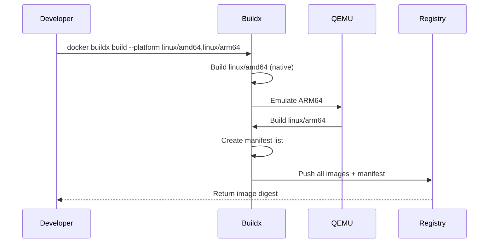

# How to Create Docker Multi-Platform Manifests

Author: [nawazdhandala](https://github.com/nawazdhandala)

Tags: Docker, Multi-Platform, Container Registry, ARM

Description: Learn to create Docker multi-platform manifests with buildx, manifest lists, and registry configuration for cross-architecture deployments.

---

Modern applications need to run on diverse hardware architectures - from Intel and AMD processors to ARM-based systems like Apple Silicon Macs, AWS Graviton instances, and Raspberry Pi devices. Docker multi-platform manifests solve this challenge by allowing a single image tag to serve different architectures automatically.

## What Are Multi-Platform Manifests?

A multi-platform manifest (also called a manifest list) is a reference that points to multiple platform-specific images. When you pull an image, Docker automatically selects the correct variant for your architecture.



## Prerequisites

Before creating multi-platform images, ensure you have:

- Docker Engine 19.03 or later
- Docker Buildx plugin (included in Docker Desktop)
- Access to a container registry (Docker Hub, GitHub Container Registry, AWS ECR, etc.)

## Setting Up Docker Buildx

Docker Buildx extends the docker build command with additional features, including multi-platform builds.

### Step 1: Verify Buildx Installation

```bash
# Check if buildx is available
docker buildx version

# Expected output:
# github.com/docker/buildx v0.12.0 ...
```

### Step 2: Create a New Builder Instance

The default builder does not support multi-platform builds. Create a new builder that uses the docker-container driver:

```bash
# Create a new builder instance
docker buildx create --name multiplatform-builder --driver docker-container --bootstrap

# Set it as the active builder
docker buildx use multiplatform-builder

# Verify the builder
docker buildx inspect --bootstrap
```

The `--bootstrap` flag ensures the builder is started immediately.

### Step 3: View Supported Platforms

```bash
docker buildx inspect --bootstrap | grep Platforms
```

This typically outputs platforms like:
```
Platforms: linux/amd64, linux/amd64/v2, linux/amd64/v3, linux/arm64, linux/arm/v7, linux/arm/v6
```

## Building Multi-Platform Images

### Method 1: Using buildx build with --platform

The most straightforward approach is using `docker buildx build` with the `--platform` flag:

```bash
# Build for multiple platforms and push to registry
docker buildx build \
  --platform linux/amd64,linux/arm64,linux/arm/v7 \
  --tag username/myapp:latest \
  --push \
  .
```

The `--push` flag is required because multi-platform images cannot be loaded into the local Docker image store directly.

### Complete Example with Dockerfile

Here is a practical example with a Node.js application:

**Dockerfile:**
```dockerfile
# Use a multi-platform base image
FROM --platform=$TARGETPLATFORM node:20-alpine

# Set working directory
WORKDIR /app

# Copy package files
COPY package*.json ./

# Install dependencies
RUN npm ci --only=production

# Copy application code
COPY . .

# Expose port
EXPOSE 3000

# Start the application
CMD ["node", "server.js"]
```

**Build command:**
```bash
docker buildx build \
  --platform linux/amd64,linux/arm64 \
  --tag ghcr.io/username/myapp:v1.0.0 \
  --tag ghcr.io/username/myapp:latest \
  --push \
  --file Dockerfile \
  .
```

### Understanding Platform Build Variables

Docker provides several build arguments for platform-specific logic:

| Variable | Description | Example Values |
|----------|-------------|----------------|
| `TARGETPLATFORM` | Full target platform | linux/amd64, linux/arm64 |
| `TARGETOS` | Target operating system | linux, windows |
| `TARGETARCH` | Target architecture | amd64, arm64, arm |
| `TARGETVARIANT` | Architecture variant | v7, v8 |
| `BUILDPLATFORM` | Platform of the build node | linux/amd64 |

**Using variables in Dockerfile:**
```dockerfile
FROM --platform=$BUILDPLATFORM golang:1.21-alpine AS builder

ARG TARGETOS
ARG TARGETARCH

WORKDIR /app
COPY . .

# Cross-compile for the target platform
RUN CGO_ENABLED=0 GOOS=$TARGETOS GOARCH=$TARGETARCH go build -o app .

FROM --platform=$TARGETPLATFORM alpine:3.19
COPY --from=builder /app/app /app
ENTRYPOINT ["/app"]
```

## Method 2: Creating Manifests from Existing Images

If you already have platform-specific images built separately, you can combine them into a manifest list:



### Step 1: Build and Push Individual Images

```bash
# Build and push AMD64 image
docker build --platform linux/amd64 -t username/myapp:latest-amd64 .
docker push username/myapp:latest-amd64

# Build and push ARM64 image
docker build --platform linux/arm64 -t username/myapp:latest-arm64 .
docker push username/myapp:latest-arm64

# Build and push ARMv7 image
docker build --platform linux/arm/v7 -t username/myapp:latest-armv7 .
docker push username/myapp:latest-armv7
```

### Step 2: Create the Manifest List

```bash
docker manifest create username/myapp:latest \
  username/myapp:latest-amd64 \
  username/myapp:latest-arm64 \
  username/myapp:latest-armv7
```

### Step 3: Annotate Platform Information (If Needed)

Sometimes you need to explicitly set platform metadata:

```bash
docker manifest annotate username/myapp:latest \
  username/myapp:latest-arm64 \
  --os linux \
  --arch arm64

docker manifest annotate username/myapp:latest \
  username/myapp:latest-armv7 \
  --os linux \
  --arch arm \
  --variant v7
```

### Step 4: Push the Manifest

```bash
docker manifest push username/myapp:latest
```

## Registry Configuration

### Docker Hub

```bash
# Login to Docker Hub
docker login

# Build and push
docker buildx build \
  --platform linux/amd64,linux/arm64 \
  --tag dockerhubusername/myapp:latest \
  --push \
  .
```

### GitHub Container Registry (GHCR)

```bash
# Login to GHCR
echo $GITHUB_TOKEN | docker login ghcr.io -u USERNAME --password-stdin

# Build and push
docker buildx build \
  --platform linux/amd64,linux/arm64 \
  --tag ghcr.io/username/myapp:latest \
  --push \
  .
```

### Amazon ECR

```bash
# Login to ECR
aws ecr get-login-password --region us-east-1 | \
  docker login --username AWS --password-stdin 123456789.dkr.ecr.us-east-1.amazonaws.com

# Build and push
docker buildx build \
  --platform linux/amd64,linux/arm64 \
  --tag 123456789.dkr.ecr.us-east-1.amazonaws.com/myapp:latest \
  --push \
  .
```

### Azure Container Registry

```bash
# Login to ACR
az acr login --name myregistry

# Build and push
docker buildx build \
  --platform linux/amd64,linux/arm64 \
  --tag myregistry.azurecr.io/myapp:latest \
  --push \
  .
```

## Verifying Multi-Platform Images

### Inspect the Manifest

```bash
docker manifest inspect username/myapp:latest
```

**Example output:**
```json
{
  "schemaVersion": 2,
  "mediaType": "application/vnd.docker.distribution.manifest.list.v2+json",
  "manifests": [
    {
      "mediaType": "application/vnd.docker.distribution.manifest.v2+json",
      "size": 1234,
      "digest": "sha256:abc123...",
      "platform": {
        "architecture": "amd64",
        "os": "linux"
      }
    },
    {
      "mediaType": "application/vnd.docker.distribution.manifest.v2+json",
      "size": 1234,
      "digest": "sha256:def456...",
      "platform": {
        "architecture": "arm64",
        "os": "linux"
      }
    }
  ]
}
```

### Using imagetools

The `buildx imagetools` command provides detailed inspection:

```bash
docker buildx imagetools inspect username/myapp:latest
```

### Testing on Different Architectures

```bash
# Pull and run on specific platform (useful for testing)
docker run --platform linux/arm64 username/myapp:latest

# Check the architecture inside the container
docker run --platform linux/amd64 username/myapp:latest uname -m
# Output: x86_64

docker run --platform linux/arm64 username/myapp:latest uname -m
# Output: aarch64
```

## CI/CD Integration

### GitHub Actions Example

```yaml
name: Build Multi-Platform Image

on:
  push:
    branches: [main]
    tags: ['v*']

jobs:
  build:
    runs-on: ubuntu-latest
    steps:
      - name: Checkout
        uses: actions/checkout@v4

      - name: Set up QEMU
        uses: docker/setup-qemu-action@v3

      - name: Set up Docker Buildx
        uses: docker/setup-buildx-action@v3

      - name: Login to GitHub Container Registry
        uses: docker/login-action@v3
        with:
          registry: ghcr.io
          username: ${{ github.actor }}
          password: ${{ secrets.GITHUB_TOKEN }}

      - name: Extract metadata
        id: meta
        uses: docker/metadata-action@v5
        with:
          images: ghcr.io/${{ github.repository }}
          tags: |
            type=ref,event=branch
            type=semver,pattern={{version}}
            type=sha

      - name: Build and push
        uses: docker/build-push-action@v5
        with:
          context: .
          platforms: linux/amd64,linux/arm64
          push: true
          tags: ${{ steps.meta.outputs.tags }}
          labels: ${{ steps.meta.outputs.labels }}
          cache-from: type=gha
          cache-to: type=gha,mode=max
```

### GitLab CI Example

```yaml
build-multiplatform:
  image: docker:24
  services:
    - docker:24-dind
  variables:
    DOCKER_BUILDKIT: 1
  before_script:
    - docker login -u $CI_REGISTRY_USER -p $CI_REGISTRY_PASSWORD $CI_REGISTRY
    - docker buildx create --use --name multiplatform
  script:
    - docker buildx build
        --platform linux/amd64,linux/arm64
        --tag $CI_REGISTRY_IMAGE:$CI_COMMIT_SHA
        --tag $CI_REGISTRY_IMAGE:latest
        --push
        .
```

## Build Process Flow



## Best Practices

### 1. Use Multi-Stage Builds for Smaller Images

```dockerfile
# Build stage
FROM --platform=$BUILDPLATFORM golang:1.21-alpine AS builder
ARG TARGETOS TARGETARCH
WORKDIR /app
COPY . .
RUN CGO_ENABLED=0 GOOS=$TARGETOS GOARCH=$TARGETARCH go build -o app .

# Runtime stage
FROM --platform=$TARGETPLATFORM alpine:3.19
RUN apk add --no-cache ca-certificates
COPY --from=builder /app/app /app
USER nobody
ENTRYPOINT ["/app"]
```

### 2. Cache Dependencies Efficiently

```dockerfile
FROM --platform=$TARGETPLATFORM node:20-alpine

WORKDIR /app

# Copy only package files first (cached layer)
COPY package*.json ./
RUN npm ci --only=production

# Copy source code (changes frequently)
COPY . .

CMD ["node", "server.js"]
```

### 3. Handle Architecture-Specific Dependencies

```dockerfile
FROM --platform=$TARGETPLATFORM ubuntu:22.04

ARG TARGETARCH

# Install architecture-specific packages
RUN apt-get update && \
    if [ "$TARGETARCH" = "arm64" ]; then \
      apt-get install -y package-arm64; \
    else \
      apt-get install -y package-amd64; \
    fi
```

### 4. Use Buildx Cache

```bash
# Use registry cache for faster builds
docker buildx build \
  --platform linux/amd64,linux/arm64 \
  --cache-from type=registry,ref=username/myapp:cache \
  --cache-to type=registry,ref=username/myapp:cache,mode=max \
  --tag username/myapp:latest \
  --push \
  .
```

## Troubleshooting

### Issue: Build Fails on ARM Platform

If builds fail when emulating ARM, check QEMU installation:

```bash
# Install QEMU for cross-platform emulation
docker run --privileged --rm tonistiigi/binfmt --install all

# Verify installation
docker buildx ls
```

### Issue: Manifest Already Exists

When recreating manifests, use the `--amend` flag:

```bash
docker manifest create --amend username/myapp:latest \
  username/myapp:latest-amd64 \
  username/myapp:latest-arm64
```

### Issue: Slow ARM Builds

Native builds are significantly faster than emulated builds. Consider using native ARM build nodes:

```bash
# Create a builder with multiple nodes
docker buildx create --name multiarch --node amd64-node --platform linux/amd64
docker buildx create --name multiarch --append --node arm64-node --platform linux/arm64
```

## Summary

Docker multi-platform manifests enable seamless cross-architecture deployments. Key takeaways:

1. **Set up buildx** with a docker-container driver for multi-platform support
2. **Use `--platform` flag** to specify target architectures
3. **Leverage build variables** like `TARGETARCH` for conditional logic
4. **Push directly to registry** since multi-platform images cannot be stored locally
5. **Verify with `manifest inspect`** to confirm platform support
6. **Integrate with CI/CD** using QEMU for emulation

With multi-platform images, your users can simply run `docker pull` and receive the correct image for their architecture automatically, whether they are on an x86 server, an ARM-based cloud instance, or an Apple Silicon Mac.
