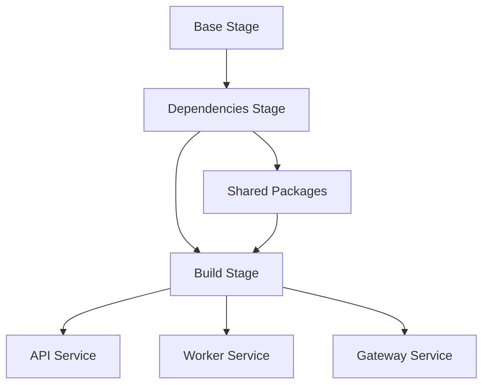

# How to Build Multi-Stage Dockerfiles for Monorepos

Author: [nawazdhandala](https://www.github.com/nawazdhandala)

Tags: Docker, Multi-Stage, Monorepo, DevOps, Build Optimization

Description: Design multi-stage Dockerfiles for monorepo projects with shared dependencies, selective builds, and optimized layer caching.

---

Monorepos bundle multiple services into a single repository, which simplifies code sharing but complicates Docker builds. Building each service naively means downloading the same dependencies repeatedly and losing caching benefits. Multi-stage Dockerfiles solve this by letting you structure builds that share common layers, build only what changed, and produce minimal production images.

## The Monorepo Challenge

A typical monorepo might look like this:

```
monorepo/
├── packages/
│   ├── shared-utils/
│   │   ├── package.json
│   │   └── src/
│   ├── api-client/
│   │   ├── package.json
│   │   └── src/
│   └── database/
│       ├── package.json
│       └── src/
├── services/
│   ├── api/
│   │   ├── package.json
│   │   ├── Dockerfile
│   │   └── src/
│   ├── worker/
│   │   ├── package.json
│   │   ├── Dockerfile
│   │   └── src/
│   └── gateway/
│       ├── package.json
│       ├── Dockerfile
│       └── src/
├── package.json
└── pnpm-workspace.yaml
```

Each service depends on shared packages. Without careful planning, you end up copying the entire monorepo into each service's Docker build, defeating the purpose of having a clean separation.

## Build Flow Overview

Here is how a well-designed multi-stage monorepo build flows:



## Setting Up the Base Dockerfile

Start with a root-level Dockerfile that handles the entire monorepo. This approach works better than per-service Dockerfiles because it maximizes layer reuse.

```dockerfile
# syntax=docker/dockerfile:1.4

# Stage 1: Base image with package manager
FROM node:20-alpine AS base

# Install pnpm globally
RUN corepack enable && corepack prepare pnpm@latest --activate

# Set working directory for the monorepo
WORKDIR /monorepo
```

The `syntax` directive enables BuildKit features we will use for caching. Using `corepack` ensures consistent package manager versions across builds.

## Dependency Installation Stage

This stage handles all dependency installation. The key is copying only the files needed to install dependencies before copying source code.

```dockerfile
# Stage 2: Install all dependencies
FROM base AS dependencies

# Copy workspace configuration first
# These files change less frequently than source code
COPY pnpm-workspace.yaml ./
COPY package.json pnpm-lock.yaml ./

# Copy all package.json files from packages and services
# We only need the manifests, not the source code
COPY packages/shared-utils/package.json ./packages/shared-utils/
COPY packages/api-client/package.json ./packages/api-client/
COPY packages/database/package.json ./packages/database/
COPY services/api/package.json ./services/api/
COPY services/worker/package.json ./services/worker/
COPY services/gateway/package.json ./services/gateway/

# Install all dependencies with build cache
# --frozen-lockfile ensures reproducible builds
RUN --mount=type=cache,id=pnpm,target=/root/.local/share/pnpm/store \
    pnpm install --frozen-lockfile
```

By copying only `package.json` files first, Docker can cache this layer. Dependencies only reinstall when the lock file changes.

## Building Shared Packages

Shared packages must be built before services that depend on them.

```dockerfile
# Stage 3: Build shared packages
FROM dependencies AS shared-builder

# Copy source code for shared packages only
COPY packages/ ./packages/

# Build packages in dependency order
# TypeScript packages need to compile before consumers use them
RUN pnpm --filter "./packages/**" run build
```

## Service-Specific Build Stages

Each service gets its own build stage that inherits from the shared builder.

```dockerfile
# Stage 4a: Build API service
FROM shared-builder AS api-builder

# Copy only the API service source
COPY services/api/ ./services/api/

# Build the API service
RUN pnpm --filter "api" run build

# Stage 4b: Build Worker service
FROM shared-builder AS worker-builder

COPY services/worker/ ./services/worker/
RUN pnpm --filter "worker" run build

# Stage 4c: Build Gateway service
FROM shared-builder AS gateway-builder

COPY services/gateway/ ./services/gateway/
RUN pnpm --filter "gateway" run build
```

BuildKit builds these stages in parallel when there are no dependencies between them, significantly speeding up CI pipelines.

## Production Images

Each service needs a minimal production image. Here is where multi-stage builds shine for monorepos.

```dockerfile
# Stage 5a: API production image
FROM node:20-alpine AS api-production

RUN corepack enable && corepack prepare pnpm@latest --activate

WORKDIR /app

# Copy only production dependencies
# Use pnpm deploy to extract a standalone package
COPY --from=api-builder /monorepo/pnpm-lock.yaml ./
COPY --from=api-builder /monorepo/package.json ./

# Copy built shared packages
COPY --from=api-builder /monorepo/packages/shared-utils/dist ./packages/shared-utils/dist
COPY --from=api-builder /monorepo/packages/shared-utils/package.json ./packages/shared-utils/
COPY --from=api-builder /monorepo/packages/api-client/dist ./packages/api-client/dist
COPY --from=api-builder /monorepo/packages/api-client/package.json ./packages/api-client/

# Copy the built service
COPY --from=api-builder /monorepo/services/api/dist ./services/api/dist
COPY --from=api-builder /monorepo/services/api/package.json ./services/api/

# Install production dependencies only
RUN --mount=type=cache,id=pnpm,target=/root/.local/share/pnpm/store \
    pnpm install --prod --frozen-lockfile

# Create non-root user
RUN adduser -D appuser
USER appuser

EXPOSE 3000
CMD ["node", "services/api/dist/index.js"]
```

## Using pnpm Deploy for Cleaner Output

pnpm has a `deploy` command that creates a standalone package with all its dependencies. This simplifies the production image.

```dockerfile
# Alternative approach using pnpm deploy
FROM shared-builder AS api-deploy

COPY services/api/ ./services/api/
RUN pnpm --filter "api" run build

# Deploy creates a standalone directory with all dependencies
RUN pnpm --filter "api" deploy --prod /deployed/api

# Production image is much simpler
FROM node:20-alpine AS api-final

WORKDIR /app

# Copy the entire deployed package
COPY --from=api-deploy /deployed/api ./

RUN adduser -D appuser
USER appuser

EXPOSE 3000
CMD ["node", "dist/index.js"]
```

## Optimizing Layer Caching

Layer caching is critical in monorepos because you want changes to one service to avoid rebuilding others. Here are the key strategies.

### Copy in Order of Change Frequency

Files that change less often should be copied first:

```dockerfile
# Rarely changes - cached aggressively
COPY pnpm-workspace.yaml ./

# Changes when dependencies update
COPY pnpm-lock.yaml package.json ./
COPY **/package.json ./

# Changes with every code update
COPY packages/ ./packages/
COPY services/ ./services/
```

### Use BuildKit Cache Mounts

Cache mounts persist between builds without bloating the image:

```dockerfile
# Cache pnpm store across builds
RUN --mount=type=cache,id=pnpm,target=/root/.local/share/pnpm/store \
    pnpm install --frozen-lockfile

# Cache TypeScript build artifacts
RUN --mount=type=cache,target=/monorepo/packages/shared-utils/.tsc-cache \
    pnpm --filter "shared-utils" run build
```

### Selective Builds with Build Arguments

Build only the service you need:

```dockerfile
ARG SERVICE=api

FROM shared-builder AS service-builder

# Copy and build only the requested service
COPY services/${SERVICE}/ ./services/${SERVICE}/
RUN pnpm --filter "${SERVICE}" run build

FROM node:20-alpine AS production

ARG SERVICE
WORKDIR /app

COPY --from=service-builder /monorepo/services/${SERVICE}/dist ./dist
```

Build with:

```bash
# Build only the worker service
docker build --build-arg SERVICE=worker -t myapp-worker .
```

## Handling Go Services in Monorepos

Go monorepos work differently because Go compiles to static binaries. Here is a pattern for mixed-language monorepos:

```dockerfile
# Go builder for backend services
FROM golang:1.22-alpine AS go-builder

WORKDIR /src

# Copy go.work for workspace support
COPY go.work go.work.sum ./
COPY services/auth/go.mod services/auth/go.sum ./services/auth/
COPY pkg/ ./pkg/

# Download dependencies with caching
RUN --mount=type=cache,target=/go/pkg/mod \
    go mod download

# Copy source and build
COPY services/auth/ ./services/auth/

# Build static binary
RUN --mount=type=cache,target=/root/.cache/go-build \
    CGO_ENABLED=0 go build -ldflags="-s -w" \
    -o /auth ./services/auth

# Minimal production image
FROM scratch AS auth-production

COPY --from=go-builder /etc/ssl/certs/ca-certificates.crt /etc/ssl/certs/
COPY --from=go-builder /auth /auth

ENTRYPOINT ["/auth"]
```

## Docker Compose for Local Development

Tie everything together with Docker Compose for local development:

```yaml
# docker-compose.yml
services:
  api:
    build:
      context: .
      target: api-production
    ports:
      - "3000:3000"
    environment:
      - DATABASE_URL=postgres://db:5432/app
    depends_on:
      - db

  worker:
    build:
      context: .
      target: worker-production
    environment:
      - REDIS_URL=redis://redis:6379
    depends_on:
      - redis

  gateway:
    build:
      context: .
      target: gateway-production
    ports:
      - "8080:8080"
    depends_on:
      - api

  db:
    image: postgres:16-alpine
    volumes:
      - pgdata:/var/lib/postgresql/data

  redis:
    image: redis:7-alpine

volumes:
  pgdata:
```

## CI Pipeline Integration

In your CI pipeline, build images in parallel and push only what changed:

```yaml
# .github/workflows/build.yml
name: Build Services

on:
  push:
    branches: [main]

jobs:
  detect-changes:
    runs-on: ubuntu-latest
    outputs:
      api: ${{ steps.changes.outputs.api }}
      worker: ${{ steps.changes.outputs.worker }}
    steps:
      - uses: actions/checkout@v4
      - uses: dorny/paths-filter@v3
        id: changes
        with:
          filters: |
            api:
              - 'services/api/**'
              - 'packages/**'
            worker:
              - 'services/worker/**'
              - 'packages/**'

  build-api:
    needs: detect-changes
    if: needs.detect-changes.outputs.api == 'true'
    runs-on: ubuntu-latest
    steps:
      - uses: actions/checkout@v4
      - uses: docker/build-push-action@v5
        with:
          target: api-production
          tags: myregistry/api:${{ github.sha }}
          cache-from: type=gha
          cache-to: type=gha,mode=max
          push: true

  build-worker:
    needs: detect-changes
    if: needs.detect-changes.outputs.worker == 'true'
    runs-on: ubuntu-latest
    steps:
      - uses: actions/checkout@v4
      - uses: docker/build-push-action@v5
        with:
          target: worker-production
          tags: myregistry/worker:${{ github.sha }}
          cache-from: type=gha
          cache-to: type=gha,mode=max
          push: true
```

## Common Mistakes to Avoid

1. **Copying the entire repo into each build context**: Use a single Dockerfile at the root and multi-stage targets.

2. **Not leveraging workspace protocols**: pnpm, npm, and yarn workspaces can hoist shared dependencies, reducing install time.

3. **Building all services when one changes**: Use path filtering in CI to build only affected services.

4. **Forgetting to build shared packages first**: Service builds will fail if their dependencies are not compiled.

5. **Including test files in production images**: Be explicit about what you copy.

---

Multi-stage Dockerfiles transform monorepo builds from a maintenance burden into an efficient pipeline. By structuring your Dockerfile to maximize layer sharing and cache reuse, you get faster builds, smaller images, and a cleaner separation between development and production environments. Start with the patterns in this guide and adapt them to your specific workspace structure.
