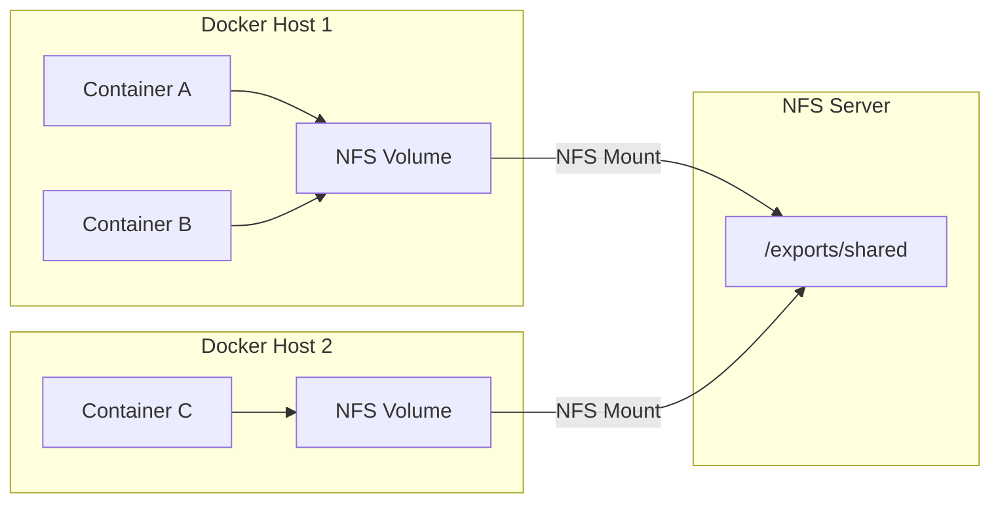
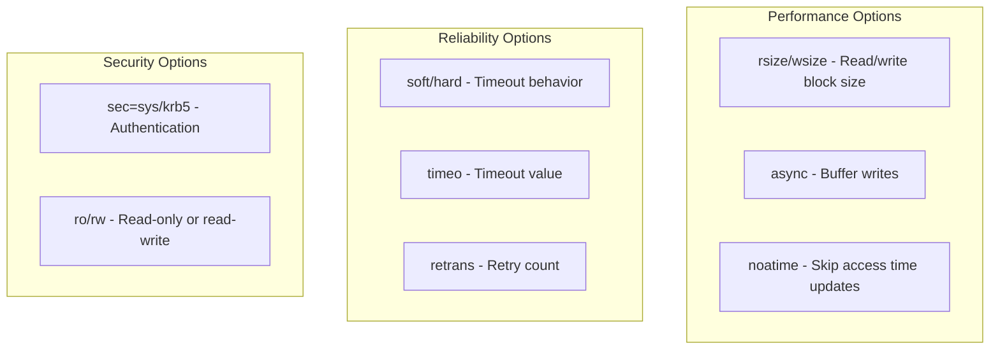
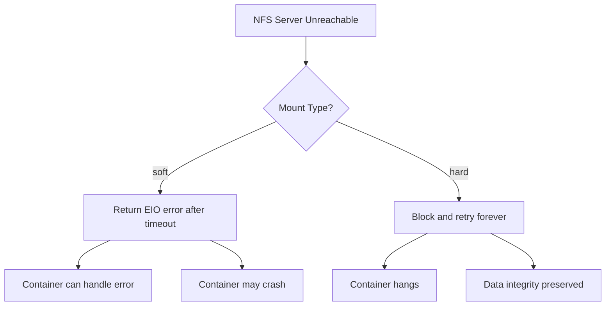
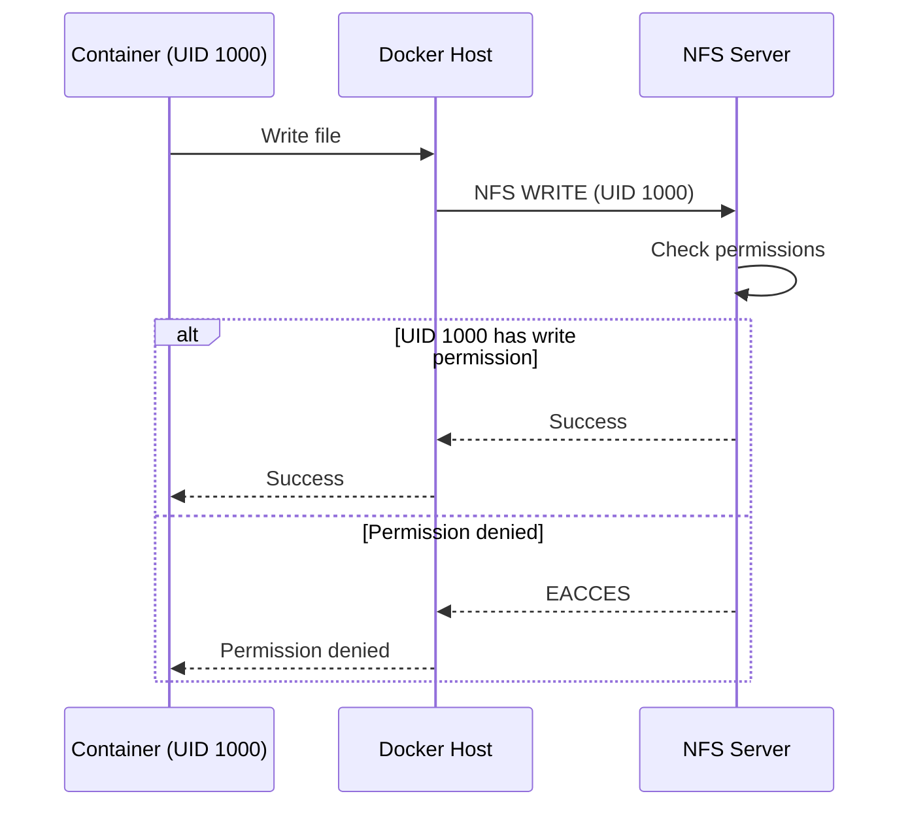

# How to Create Docker Volumes with NFS

Author: [nawazdhandala](https://github.com/nawazdhandala)

Tags: Docker, NFS, Volumes, Shared Storage

Description: Learn to configure Docker volumes with NFS backends for shared storage across containers and hosts with proper mount options and permissions.

---

Containers are ephemeral by design, but production workloads often need persistent, shared storage. When multiple containers - or entire Docker hosts - must read and write the same files, NFS (Network File System) becomes the natural choice. Docker volumes with NFS backends let you decouple storage from individual hosts while keeping your container orchestration simple.

This guide walks through setting up an NFS server, creating Docker volumes that mount NFS exports, configuring mount options for performance and reliability, handling permissions correctly, and troubleshooting common issues.

## Architecture Overview

Before diving into commands, understand how the pieces fit together:



All containers across multiple hosts mount the same NFS export. Writes from Container A are visible to Container C immediately (subject to NFS caching behavior).

## Setting Up the NFS Server

First, you need an NFS server exporting a directory. This can be a dedicated storage server, a VM, or even another container.

### Install NFS Server (Ubuntu/Debian)

```bash
# Install NFS kernel server
sudo apt update
sudo apt install -y nfs-kernel-server

# Create the export directory
sudo mkdir -p /exports/shared
sudo chown nobody:nogroup /exports/shared
sudo chmod 755 /exports/shared
```

### Configure Exports

Edit `/etc/exports` to define which directories are shared and who can access them:

```bash
# /etc/exports
/exports/shared    192.168.1.0/24(rw,sync,no_subtree_check,no_root_squash)
```

Key export options explained:

| Option | Purpose |
| --- | --- |
| `rw` | Allow read and write access |
| `sync` | Write changes to disk before replying - safer but slower |
| `async` | Reply before writing to disk - faster but riskier on crash |
| `no_subtree_check` | Disable subtree checking for better reliability |
| `no_root_squash` | Allow root on clients to act as root on NFS - use carefully |
| `root_squash` | Map root to anonymous user - more secure default |
| `all_squash` | Map all users to anonymous - useful for shared volumes |

Apply the exports and start the service:

```bash
# Export the shares
sudo exportfs -ra

# Start and enable NFS server
sudo systemctl enable nfs-kernel-server
sudo systemctl start nfs-kernel-server

# Verify exports
sudo exportfs -v
```

### Firewall Configuration

If you run a firewall, open the NFS ports:

```bash
# For UFW
sudo ufw allow from 192.168.1.0/24 to any port nfs
sudo ufw allow from 192.168.1.0/24 to any port 111

# For firewalld
sudo firewall-cmd --permanent --add-service=nfs
sudo firewall-cmd --permanent --add-service=rpc-bind
sudo firewall-cmd --permanent --add-service=mountd
sudo firewall-cmd --reload
```

## Creating Docker NFS Volumes

With the NFS server running, create Docker volumes that mount the export.

### Method 1: Docker Volume Create Command

The simplest approach uses `docker volume create` with driver options:

```bash
docker volume create \
  --driver local \
  --opt type=nfs \
  --opt o=addr=192.168.1.100,rw,nfsvers=4.1 \
  --opt device=:/exports/shared \
  shared-data
```

Breaking down the options:

- `--driver local`: Uses Docker's built-in local driver with NFS support
- `--opt type=nfs`: Specifies NFS filesystem type
- `--opt o=...`: Mount options passed to the mount command
- `--opt device=...`: The NFS export path (note the colon prefix)

Verify the volume exists:

```bash
docker volume inspect shared-data
```

Output shows the mount configuration:

```json
[
    {
        "CreatedAt": "2026-01-30T10:00:00Z",
        "Driver": "local",
        "Labels": {},
        "Mountpoint": "/var/lib/docker/volumes/shared-data/_data",
        "Name": "shared-data",
        "Options": {
            "device": ":/exports/shared",
            "o": "addr=192.168.1.100,rw,nfsvers=4.1",
            "type": "nfs"
        },
        "Scope": "local"
    }
]
```

### Method 2: Docker Compose

For reproducible setups, define NFS volumes in your `docker-compose.yml`:

```yaml
version: "3.8"

services:
  app:
    image: nginx:alpine
    volumes:
      - shared-data:/usr/share/nginx/html
    deploy:
      replicas: 3

  processor:
    image: python:3.11-slim
    volumes:
      - shared-data:/data
    command: python -c "while True: pass"

volumes:
  shared-data:
    driver: local
    driver_opts:
      type: nfs
      o: addr=192.168.1.100,rw,nfsvers=4.1,soft,timeo=300
      device: ":/exports/shared"
```

The volume definition under `volumes:` creates the NFS mount. All services referencing `shared-data` share the same NFS export.

### Method 3: Inline Volume Mount (Ad-hoc)

For quick testing, mount NFS directly in the run command:

```bash
docker run -d \
  --name web \
  --mount type=volume,volume-driver=local,\
volume-opt=type=nfs,\
volume-opt=o=addr=192.168.1.100,\
volume-opt=device=:/exports/shared,\
dst=/usr/share/nginx/html \
  nginx:alpine
```

This creates an anonymous volume with the NFS mount. The volume persists but has a random name, making it harder to manage.

## Mount Options for Production

The mount options in the `o=` parameter significantly affect performance, reliability, and failure behavior.

### Recommended Production Options

```bash
docker volume create \
  --driver local \
  --opt type=nfs \
  --opt o=addr=192.168.1.100,rw,nfsvers=4.1,soft,timeo=300,retrans=3,proto=tcp \
  --opt device=:/exports/shared \
  production-data
```

### Options Reference



| Option | Default | Recommendation | Purpose |
| --- | --- | --- | --- |
| `nfsvers=4.1` | varies | Use 4.1 or 4.2 | NFS protocol version - v4+ has better security and performance |
| `soft` | hard | soft for most apps | Return error on timeout instead of hanging forever |
| `hard` | - | For databases | Retry indefinitely - prevents data corruption but can hang |
| `timeo=300` | 600 | 300 (30 sec) | Timeout in deciseconds before retry or error |
| `retrans=3` | 3 | 3-5 | Number of retries before giving up (soft) or waiting (hard) |
| `rsize=65536` | negotiated | 65536-1048576 | Read buffer size in bytes |
| `wsize=65536` | negotiated | 65536-1048576 | Write buffer size in bytes |
| `proto=tcp` | tcp | tcp | Transport protocol - tcp is more reliable than udp |
| `noatime` | atime | noatime | Skip updating access times - reduces NFS traffic |
| `nolock` | lock | omit usually | Disable file locking - only if app handles it internally |

### Soft vs Hard Mounts

The choice between `soft` and `hard` determines how your containers behave when the NFS server is unreachable:



**Use `soft` when:**
- Your application can handle I/O errors gracefully
- You prefer containers to fail fast and restart
- Network issues are temporary and containers will retry naturally

**Use `hard` when:**
- Running databases that must not lose writes
- Data integrity is more important than availability
- You have reliable network infrastructure

## Handling Permissions

NFS permission issues are the most common source of frustration. Understanding how UIDs and GIDs map between containers and NFS is essential.

### The UID/GID Problem

Containers run processes as specific users (by UID, not name). NFS enforces permissions based on the UID/GID the client presents. If your container runs as UID 1000 but the NFS export is owned by UID 0, writes will fail.



### Solution 1: Match UIDs

Ensure the container user UID matches a user with permissions on the NFS export:

```dockerfile
# Dockerfile
FROM node:20-alpine

# Create user with specific UID matching NFS permissions
RUN addgroup -g 1500 appgroup && \
    adduser -u 1500 -G appgroup -D appuser

USER appuser
WORKDIR /app
```

On the NFS server:

```bash
# Create matching user/group
sudo groupadd -g 1500 appgroup
sudo useradd -u 1500 -g appgroup appuser
sudo chown -R appuser:appgroup /exports/shared
```

### Solution 2: Use all_squash with anonuid/anongid

Map all client users to a single anonymous user:

```bash
# /etc/exports
/exports/shared    192.168.1.0/24(rw,sync,no_subtree_check,all_squash,anonuid=1500,anongid=1500)
```

This maps every client UID to 1500, simplifying permission management when multiple different containers access the share.

### Solution 3: Run Container as Root with no_root_squash

For development or trusted environments:

```bash
# /etc/exports (less secure)
/exports/shared    192.168.1.0/24(rw,sync,no_subtree_check,no_root_squash)
```

```bash
# Run container as root
docker run --user root -v shared-data:/data myimage
```

This is convenient but reduces security. Root in the container becomes root on the NFS share.

### Solution 4: Init Container for Permissions

In Docker Compose, use an init container to set permissions:

```yaml
version: "3.8"

services:
  init-permissions:
    image: alpine
    volumes:
      - shared-data:/data
    command: sh -c "chown -R 1500:1500 /data && chmod -R 775 /data"
    user: root

  app:
    image: myapp
    depends_on:
      init-permissions:
        condition: service_completed_successfully
    volumes:
      - shared-data:/data
    user: "1500:1500"

volumes:
  shared-data:
    driver: local
    driver_opts:
      type: nfs
      o: addr=192.168.1.100,rw,nfsvers=4.1,no_root_squash
      device: ":/exports/shared"
```

## Multi-Host Deployment Example

Here is a complete example deploying a web application with shared storage across multiple Docker hosts.

### NFS Server Setup

```bash
# On the NFS server (192.168.1.100)
sudo mkdir -p /exports/webapp/{uploads,cache,logs}
sudo chown -R 1500:1500 /exports/webapp
sudo chmod -R 775 /exports/webapp

# /etc/exports
/exports/webapp    192.168.1.0/24(rw,sync,no_subtree_check,all_squash,anonuid=1500,anongid=1500)

sudo exportfs -ra
```

### Docker Compose for Each Host

```yaml
# docker-compose.yml - deploy on each Docker host
version: "3.8"

services:
  webapp:
    image: mywebapp:latest
    user: "1500:1500"
    volumes:
      - uploads:/app/uploads
      - cache:/app/cache
      - logs:/app/logs
    ports:
      - "8080:8080"
    environment:
      - NODE_ENV=production

volumes:
  uploads:
    driver: local
    driver_opts:
      type: nfs
      o: addr=192.168.1.100,rw,nfsvers=4.1,soft,timeo=300
      device: ":/exports/webapp/uploads"

  cache:
    driver: local
    driver_opts:
      type: nfs
      o: addr=192.168.1.100,rw,nfsvers=4.1,soft,timeo=150,noatime
      device: ":/exports/webapp/cache"

  logs:
    driver: local
    driver_opts:
      type: nfs
      o: addr=192.168.1.100,rw,nfsvers=4.1,soft,timeo=150,async
      device: ":/exports/webapp/logs"
```

Notice different mount options for different purposes:
- **uploads**: Standard options for user-uploaded files
- **cache**: `noatime` reduces overhead for frequently accessed cache files
- **logs**: `async` improves write performance for append-only log files

## Troubleshooting

### Problem: Volume Creation Fails

**Symptom:** `docker volume create` returns an error or hangs.

**Diagnosis:**

```bash
# Test NFS connectivity from Docker host
showmount -e 192.168.1.100

# Try manual mount
sudo mount -t nfs 192.168.1.100:/exports/shared /mnt/test -o nfsvers=4.1
```

**Common causes:**
- NFS server not running or not exported
- Firewall blocking NFS ports (2049, 111)
- Wrong NFS version specified
- DNS resolution issues (use IP instead of hostname)

### Problem: Permission Denied

**Symptom:** Container cannot read or write to the mounted volume.

**Diagnosis:**

```bash
# Check what UID the container runs as
docker exec mycontainer id

# Check NFS export permissions
ls -la /exports/shared  # on NFS server

# Check effective squash settings
sudo exportfs -v
```

**Solutions:**
- Match container UID to NFS permissions
- Use `all_squash` with `anonuid`/`anongid`
- Verify export options include `rw`

### Problem: Stale File Handle

**Symptom:** Operations fail with "Stale file handle" error.

**Causes:**
- NFS server restarted and export changed
- Directory was deleted and recreated on server
- Client cached file handles that are now invalid

**Solutions:**

```bash
# Remount the volume
docker volume rm shared-data
docker volume create ... # recreate with same options

# Or restart containers to force remount
docker-compose down && docker-compose up -d
```

### Problem: Slow Performance

**Symptom:** File operations are noticeably slower than local storage.

**Diagnosis:**

```bash
# Test raw NFS performance
dd if=/dev/zero of=/mnt/nfs/testfile bs=1M count=1000

# Check network latency
ping 192.168.1.100
```

**Optimizations:**

```bash
# Increase buffer sizes
docker volume create \
  --driver local \
  --opt type=nfs \
  --opt o=addr=192.168.1.100,rw,nfsvers=4.1,rsize=1048576,wsize=1048576,noatime,async \
  --opt device=:/exports/shared \
  fast-data
```

- Use `async` for write-heavy workloads (with data loss risk)
- Increase `rsize` and `wsize` for large file operations
- Use `noatime` to reduce metadata updates
- Ensure gigabit or better network between hosts and NFS server

### Problem: Container Hangs on Shutdown

**Symptom:** `docker stop` takes 30+ seconds or times out.

**Cause:** Hard NFS mount waiting for unreachable server.

**Solution:** Use `soft` mounts or add `intr` option (allows interrupt):

```bash
--opt o=addr=192.168.1.100,rw,nfsvers=4.1,soft,timeo=100,intr
```

## Monitoring NFS Volumes

Track NFS health alongside your applications:

```bash
# Check mounted NFS volumes
mount | grep nfs

# View NFS statistics
nfsstat -c  # client stats
nfsstat -s  # server stats

# Monitor NFS operations in real-time
nfsiostat 1
```

Integrate NFS monitoring into your observability stack. Export metrics to Prometheus and set alerts for:
- High NFS latency (p99 > 100ms)
- Mount failures
- Retransmission rates
- Server unreachable events

## Summary

Docker volumes with NFS backends provide shared storage across containers and hosts without complex distributed storage systems. The key points:

1. **Set up NFS server** with appropriate exports and permissions
2. **Create Docker volumes** using the local driver with NFS options
3. **Choose mount options** based on your reliability vs performance needs - `soft` for most apps, `hard` for databases
4. **Handle permissions** by matching UIDs or using squash options
5. **Monitor and troubleshoot** using standard NFS tools

NFS is not the fastest storage option, but its simplicity and wide support make it excellent for shared configuration, uploaded files, logs, and other workloads where convenience outweighs raw performance. For high-IOPS databases or latency-sensitive applications, consider local storage or distributed storage systems like Ceph.
