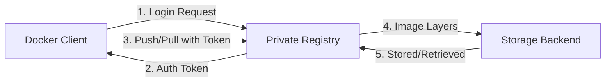
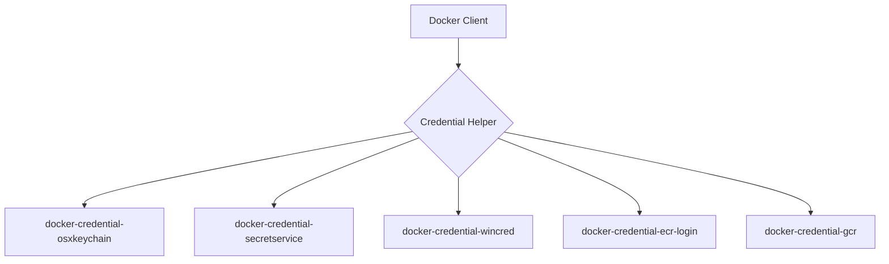
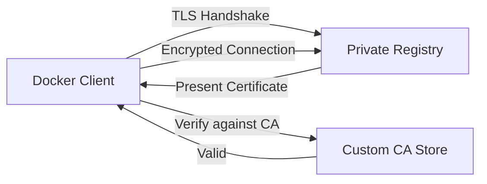
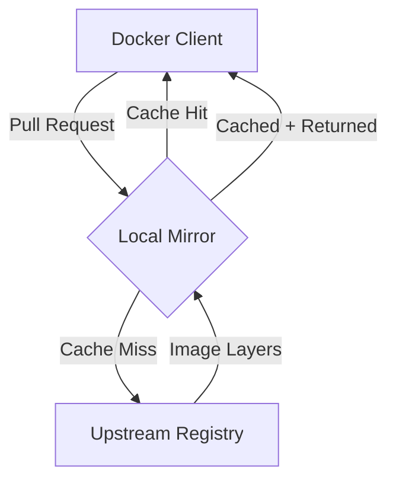
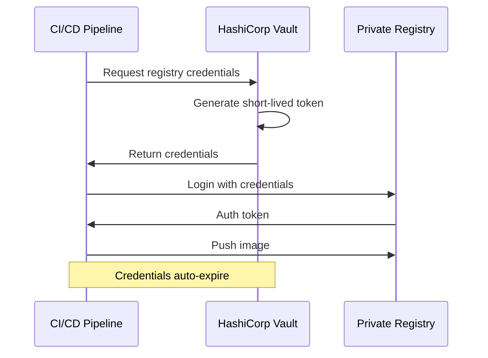

# How to Build Docker Images with Private Registries

Author: [nawazdhandala](https://github.com/nawazdhandala)

Tags: Docker, Private Registry, Authentication, CI/CD

Description: Learn to configure Docker for private registries with authentication, TLS, and CI/CD integration for secure enterprise image management.

---

Enterprise container deployments require secure, controlled access to Docker images. Private registries provide this control by allowing organizations to host proprietary images, enforce access policies, and maintain compliance requirements. This guide covers everything you need to know about building and pushing Docker images to private registries.

## Understanding Private Registry Architecture

Before diving into configuration, let us understand how Docker interacts with private registries.



The workflow involves authentication, token management, and secure layer transfer. Each step requires proper configuration for enterprise deployments.

## Setting Up Authentication

### Basic Authentication with Docker Login

The simplest method uses `docker login` to authenticate with your private registry:

```bash
# Login to a private registry
docker login registry.company.com

# Login with username directly
docker login -u myusername registry.company.com

# Login with password from stdin (recommended for scripts)
echo $REGISTRY_PASSWORD | docker login -u myusername --password-stdin registry.company.com
```

After successful login, Docker stores credentials in `~/.docker/config.json`:

```json
{
  "auths": {
    "registry.company.com": {
      "auth": "base64-encoded-credentials"
    }
  }
}
```

### Using Credential Helpers

For better security, use credential helpers instead of storing credentials in plain text. Docker supports several credential helpers:



#### Installing and Configuring Credential Helpers

**For macOS (using Keychain):**

```bash
# The helper comes with Docker Desktop
# Configure in ~/.docker/config.json
{
  "credsStore": "osxkeychain"
}
```

**For Linux (using pass or secretservice):**

```bash
# Install the pass credential helper
sudo apt-get install golang-docker-credential-helpers

# Or download directly
wget https://github.com/docker/docker-credential-helpers/releases/download/v0.8.0/docker-credential-pass-v0.8.0.linux-amd64

# Configure in ~/.docker/config.json
{
  "credsStore": "pass"
}
```

**For AWS ECR:**

```bash
# Install ECR credential helper
sudo apt-get install amazon-ecr-credential-helper

# Configure in ~/.docker/config.json
{
  "credHelpers": {
    "123456789.dkr.ecr.us-east-1.amazonaws.com": "ecr-login"
  }
}
```

**For Google Container Registry:**

```bash
# Install GCR credential helper
gcloud components install docker-credential-gcr

# Configure the helper
docker-credential-gcr configure-docker

# This adds to ~/.docker/config.json
{
  "credHelpers": {
    "gcr.io": "gcr",
    "us.gcr.io": "gcr",
    "eu.gcr.io": "gcr",
    "asia.gcr.io": "gcr"
  }
}
```

## Configuring TLS for Secure Communication

Enterprise registries must use TLS to encrypt all communication. Here is how to configure Docker to trust your registry certificates.

### Using Custom CA Certificates



**Step 1: Create the certificate directory:**

```bash
# Create directory for your registry's certificates
sudo mkdir -p /etc/docker/certs.d/registry.company.com:5000
```

**Step 2: Add your CA certificate:**

```bash
# Copy your CA certificate
sudo cp company-ca.crt /etc/docker/certs.d/registry.company.com:5000/ca.crt

# For client certificate authentication (optional)
sudo cp client.cert /etc/docker/certs.d/registry.company.com:5000/client.cert
sudo cp client.key /etc/docker/certs.d/registry.company.com:5000/client.key
```

**Directory structure for TLS configuration:**

```
/etc/docker/certs.d/
└── registry.company.com:5000/
    ├── ca.crt           # CA certificate
    ├── client.cert      # Client certificate (optional)
    └── client.key       # Client private key (optional)
```

### Configuring Docker Daemon for TLS

For system-wide TLS configuration, modify the Docker daemon settings:

```json
// /etc/docker/daemon.json
{
  "insecure-registries": [],
  "registry-mirrors": [],
  "tls": true,
  "tlscacert": "/etc/docker/ca.pem",
  "tlscert": "/etc/docker/server-cert.pem",
  "tlskey": "/etc/docker/server-key.pem",
  "tlsverify": true
}
```

After modifying the daemon configuration, restart Docker:

```bash
sudo systemctl restart docker
```

## Mirror Configuration for Enterprise Deployments

Registry mirrors help reduce external bandwidth and provide faster image pulls within your network.



### Setting Up a Pull-Through Cache

**Configure Docker daemon to use mirrors:**

```json
// /etc/docker/daemon.json
{
  "registry-mirrors": [
    "https://mirror.company.com:5000"
  ]
}
```

**Deploy a registry as a pull-through cache:**

```yaml
# docker-compose.yml for mirror registry
version: '3.8'
services:
  registry-mirror:
    image: registry:2
    ports:
      - "5000:5000"
    environment:
      REGISTRY_PROXY_REMOTEURL: https://registry-1.docker.io
      REGISTRY_PROXY_USERNAME: ${DOCKER_HUB_USER}
      REGISTRY_PROXY_PASSWORD: ${DOCKER_HUB_TOKEN}
      REGISTRY_STORAGE_FILESYSTEM_ROOTDIRECTORY: /var/lib/registry
      REGISTRY_HTTP_TLS_CERTIFICATE: /certs/domain.crt
      REGISTRY_HTTP_TLS_KEY: /certs/domain.key
    volumes:
      - registry-data:/var/lib/registry
      - ./certs:/certs:ro

volumes:
  registry-data:
```

### Configuring Multiple Registry Mirrors

For redundancy, configure multiple mirrors with fallback:

```json
// /etc/docker/daemon.json
{
  "registry-mirrors": [
    "https://mirror-primary.company.com:5000",
    "https://mirror-secondary.company.com:5000"
  ]
}
```

## Building and Pushing Images

### Tagging Images for Private Registries

```bash
# Build an image
docker build -t myapp:latest .

# Tag for private registry
docker tag myapp:latest registry.company.com/team/myapp:latest
docker tag myapp:latest registry.company.com/team/myapp:v1.0.0

# Push to private registry
docker push registry.company.com/team/myapp:latest
docker push registry.company.com/team/myapp:v1.0.0
```

### Using Build Arguments for Registry Configuration

```dockerfile
# Dockerfile with configurable base image registry
ARG REGISTRY=docker.io
ARG BASE_IMAGE=node:18-alpine

FROM ${REGISTRY}/${BASE_IMAGE}

WORKDIR /app
COPY package*.json ./
RUN npm ci --only=production
COPY . .

EXPOSE 3000
CMD ["node", "server.js"]
```

Build with your private registry:

```bash
docker build \
  --build-arg REGISTRY=registry.company.com \
  --build-arg BASE_IMAGE=base-images/node:18-alpine \
  -t registry.company.com/team/myapp:latest .
```

### Multi-Stage Builds with Private Base Images

```dockerfile
# Multi-stage build using private registry images
ARG REGISTRY=registry.company.com

# Build stage using private builder image
FROM ${REGISTRY}/build-tools/golang:1.21 AS builder
WORKDIR /src
COPY go.mod go.sum ./
RUN go mod download
COPY . .
RUN CGO_ENABLED=0 go build -o /app/server ./cmd/server

# Runtime stage using private minimal image
FROM ${REGISTRY}/base-images/alpine:3.18
RUN apk --no-cache add ca-certificates
WORKDIR /app
COPY --from=builder /app/server .
USER nobody:nobody
ENTRYPOINT ["./server"]
```

## CI/CD Integration

### GitHub Actions with Private Registry

```yaml
# .github/workflows/build-push.yml
name: Build and Push

on:
  push:
    branches: [main]
  pull_request:
    branches: [main]

env:
  REGISTRY: registry.company.com
  IMAGE_NAME: team/myapp

jobs:
  build:
    runs-on: ubuntu-latest

    steps:
      - name: Checkout code
        uses: actions/checkout@v4

      - name: Set up Docker Buildx
        uses: docker/setup-buildx-action@v3

      - name: Login to Private Registry
        uses: docker/login-action@v3
        with:
          registry: ${{ env.REGISTRY }}
          username: ${{ secrets.REGISTRY_USERNAME }}
          password: ${{ secrets.REGISTRY_PASSWORD }}

      - name: Extract metadata
        id: meta
        uses: docker/metadata-action@v5
        with:
          images: ${{ env.REGISTRY }}/${{ env.IMAGE_NAME }}
          tags: |
            type=ref,event=branch
            type=ref,event=pr
            type=sha,prefix=
            type=raw,value=latest,enable=${{ github.ref == 'refs/heads/main' }}

      - name: Build and push
        uses: docker/build-push-action@v5
        with:
          context: .
          push: ${{ github.event_name != 'pull_request' }}
          tags: ${{ steps.meta.outputs.tags }}
          labels: ${{ steps.meta.outputs.labels }}
          cache-from: type=registry,ref=${{ env.REGISTRY }}/${{ env.IMAGE_NAME }}:buildcache
          cache-to: type=registry,ref=${{ env.REGISTRY }}/${{ env.IMAGE_NAME }}:buildcache,mode=max
          build-args: |
            REGISTRY=${{ env.REGISTRY }}
```

### GitLab CI with Private Registry

```yaml
# .gitlab-ci.yml
stages:
  - build
  - push

variables:
  REGISTRY: registry.company.com
  IMAGE_NAME: team/myapp
  DOCKER_TLS_CERTDIR: "/certs"

build:
  stage: build
  image: docker:24
  services:
    - docker:24-dind
  before_script:
    - echo "$REGISTRY_PASSWORD" | docker login -u "$REGISTRY_USERNAME" --password-stdin $REGISTRY
  script:
    - docker build
        --build-arg REGISTRY=$REGISTRY
        -t $REGISTRY/$IMAGE_NAME:$CI_COMMIT_SHA
        -t $REGISTRY/$IMAGE_NAME:$CI_COMMIT_REF_SLUG
        .
    - docker push $REGISTRY/$IMAGE_NAME:$CI_COMMIT_SHA
    - docker push $REGISTRY/$IMAGE_NAME:$CI_COMMIT_REF_SLUG
  rules:
    - if: $CI_COMMIT_BRANCH == "main"

push-latest:
  stage: push
  image: docker:24
  services:
    - docker:24-dind
  before_script:
    - echo "$REGISTRY_PASSWORD" | docker login -u "$REGISTRY_USERNAME" --password-stdin $REGISTRY
  script:
    - docker pull $REGISTRY/$IMAGE_NAME:$CI_COMMIT_SHA
    - docker tag $REGISTRY/$IMAGE_NAME:$CI_COMMIT_SHA $REGISTRY/$IMAGE_NAME:latest
    - docker push $REGISTRY/$IMAGE_NAME:latest
  rules:
    - if: $CI_COMMIT_BRANCH == "main"
```

### Jenkins Pipeline with Private Registry

```groovy
// Jenkinsfile
pipeline {
    agent any

    environment {
        REGISTRY = 'registry.company.com'
        IMAGE_NAME = 'team/myapp'
        REGISTRY_CREDENTIALS = credentials('private-registry-creds')
    }

    stages {
        stage('Login to Registry') {
            steps {
                sh '''
                    echo $REGISTRY_CREDENTIALS_PSW | docker login \
                        -u $REGISTRY_CREDENTIALS_USR \
                        --password-stdin \
                        $REGISTRY
                '''
            }
        }

        stage('Build') {
            steps {
                sh """
                    docker build \
                        --build-arg REGISTRY=${REGISTRY} \
                        -t ${REGISTRY}/${IMAGE_NAME}:${BUILD_NUMBER} \
                        -t ${REGISTRY}/${IMAGE_NAME}:latest \
                        .
                """
            }
        }

        stage('Push') {
            when {
                branch 'main'
            }
            steps {
                sh """
                    docker push ${REGISTRY}/${IMAGE_NAME}:${BUILD_NUMBER}
                    docker push ${REGISTRY}/${IMAGE_NAME}:latest
                """
            }
        }
    }

    post {
        always {
            sh 'docker logout $REGISTRY'
        }
    }
}
```

## Managing Secrets Securely

### Kubernetes Secrets for Private Registries

```yaml
# Create a docker-registry secret
apiVersion: v1
kind: Secret
metadata:
  name: private-registry-secret
  namespace: default
type: kubernetes.io/dockerconfigjson
data:
  .dockerconfigjson: <base64-encoded-docker-config>
```

Create the secret using kubectl:

```bash
# Create secret from existing Docker config
kubectl create secret generic private-registry-secret \
  --from-file=.dockerconfigjson=$HOME/.docker/config.json \
  --type=kubernetes.io/dockerconfigjson

# Or create directly with credentials
kubectl create secret docker-registry private-registry-secret \
  --docker-server=registry.company.com \
  --docker-username=myuser \
  --docker-password=mypassword \
  --docker-email=user@company.com
```

Use the secret in your deployments:

```yaml
apiVersion: apps/v1
kind: Deployment
metadata:
  name: myapp
spec:
  replicas: 3
  selector:
    matchLabels:
      app: myapp
  template:
    metadata:
      labels:
        app: myapp
    spec:
      imagePullSecrets:
        - name: private-registry-secret
      containers:
        - name: myapp
          image: registry.company.com/team/myapp:latest
          ports:
            - containerPort: 3000
```

### HashiCorp Vault for Dynamic Credentials



Example Vault integration script:

```bash
#!/bin/bash
# fetch-registry-creds.sh

# Authenticate to Vault
export VAULT_TOKEN=$(vault write -field=token auth/approle/login \
    role_id="$VAULT_ROLE_ID" \
    secret_id="$VAULT_SECRET_ID")

# Fetch registry credentials
CREDS=$(vault read -format=json secret/data/docker-registry)

REGISTRY_USER=$(echo $CREDS | jq -r '.data.data.username')
REGISTRY_PASS=$(echo $CREDS | jq -r '.data.data.password')

# Login to registry
echo "$REGISTRY_PASS" | docker login -u "$REGISTRY_USER" --password-stdin registry.company.com

# Clean up
unset VAULT_TOKEN REGISTRY_USER REGISTRY_PASS CREDS
```

## Troubleshooting Common Issues

### Certificate Verification Failures

```bash
# Error: x509: certificate signed by unknown authority

# Solution 1: Add CA certificate
sudo mkdir -p /etc/docker/certs.d/registry.company.com:5000
sudo cp ca.crt /etc/docker/certs.d/registry.company.com:5000/ca.crt

# Solution 2: Add to system trust store (Linux)
sudo cp ca.crt /usr/local/share/ca-certificates/
sudo update-ca-certificates
sudo systemctl restart docker

# Solution 3: For testing only - use insecure registry
# Add to /etc/docker/daemon.json
{
  "insecure-registries": ["registry.company.com:5000"]
}
```

### Authentication Failures

```bash
# Error: unauthorized: authentication required

# Check current credentials
cat ~/.docker/config.json

# Clear cached credentials
docker logout registry.company.com

# Re-authenticate
docker login registry.company.com

# Verify with a test pull
docker pull registry.company.com/test/hello-world:latest
```

### Network and Proxy Issues

```bash
# Configure Docker to use corporate proxy
# Add to /etc/docker/daemon.json
{
  "proxies": {
    "http-proxy": "http://proxy.company.com:8080",
    "https-proxy": "http://proxy.company.com:8080",
    "no-proxy": "localhost,127.0.0.1,registry.company.com"
  }
}

# Or set environment variables for Docker client
export HTTP_PROXY="http://proxy.company.com:8080"
export HTTPS_PROXY="http://proxy.company.com:8080"
export NO_PROXY="localhost,127.0.0.1,registry.company.com"
```

## Best Practices Summary

1. **Never store credentials in plain text** - Use credential helpers or secret management tools
2. **Always use TLS** - Configure proper certificates for all registry communication
3. **Implement least privilege** - Create service accounts with minimal required permissions
4. **Use image signing** - Implement Docker Content Trust or Sigstore for image verification
5. **Set up mirrors** - Reduce external dependencies and improve build times
6. **Rotate credentials regularly** - Use short-lived tokens when possible
7. **Audit access** - Enable logging and monitor registry access patterns
8. **Tag strategically** - Use semantic versioning and avoid mutable tags like `latest` in production

## Conclusion

Configuring Docker for private registries requires attention to authentication, TLS, and secret management. By implementing credential helpers, proper certificate configuration, and CI/CD integration patterns covered in this guide, you can establish a secure and efficient container image workflow for your enterprise deployments. Remember to regularly audit your configurations and rotate credentials to maintain security posture.
