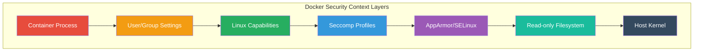
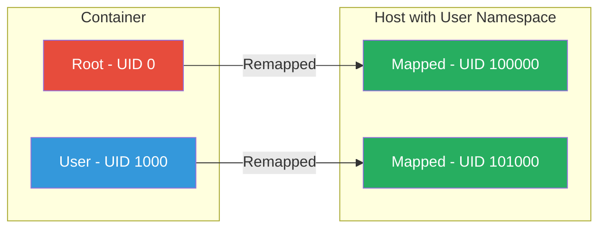
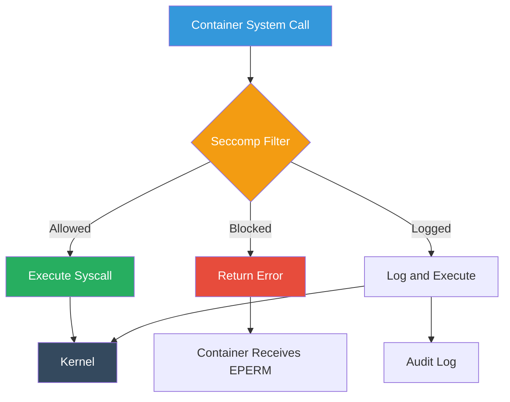
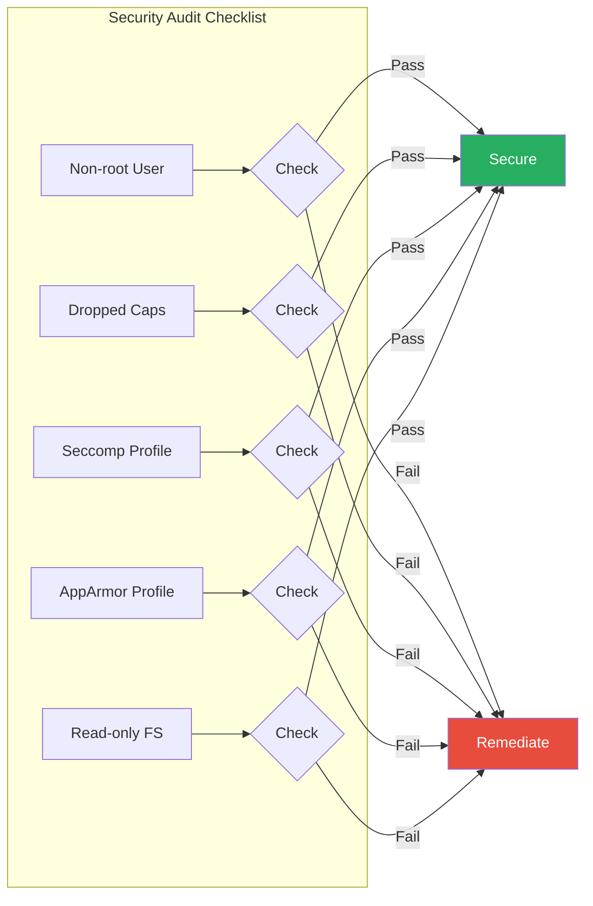

# How to Implement Docker Container Security Context

Author: [nawazdhandala](https://github.com/nawazdhandala)

Tags: Docker, Security, Security Context, Container Hardening

Description: Learn to implement Docker security context with user namespaces, capabilities, seccomp profiles, and AppArmor for hardened containers.

---

Containers share the host kernel, which means a compromised container can potentially affect the entire system. Docker security context provides multiple layers of defense to minimize the attack surface and contain potential breaches. This guide walks you through implementing comprehensive security controls for hardened Docker containers.

## Understanding Docker Security Context

Docker security context encompasses several mechanisms that control how containers interact with the host system. These include user and group permissions, Linux capabilities, seccomp profiles, and mandatory access control systems like AppArmor.



## User and Group Settings

By default, containers run as root, which poses significant security risks. Running containers as non-root users is one of the most effective hardening measures.

### Running as Non-Root User

You can specify the user at runtime or in the Dockerfile:

```dockerfile
# Dockerfile approach
FROM alpine:3.19

# Create a non-root user
RUN addgroup -g 1000 appgroup && \
    adduser -u 1000 -G appgroup -D appuser

# Set ownership of application files
COPY --chown=appuser:appgroup ./app /app

# Switch to non-root user
USER appuser

WORKDIR /app
CMD ["./start.sh"]
```

Alternatively, specify the user at runtime:

```bash
# Run container as specific user
docker run --user 1000:1000 myimage

# Run as non-root with username
docker run --user appuser myimage
```

### User Namespace Remapping

User namespaces provide an additional isolation layer by mapping container UIDs to unprivileged host UIDs:

```json
// /etc/docker/daemon.json
{
  "userns-remap": "default"
}
```

After configuring, restart Docker:

```bash
sudo systemctl restart docker
```

Verify the mapping:

```bash
# Check the subordinate UID/GID files
cat /etc/subuid
cat /etc/subgid

# Output example:
# dockremap:100000:65536
```



## Linux Capabilities

Linux capabilities divide root privileges into distinct units. Docker drops many capabilities by default, but you can further restrict or add specific capabilities.

### Default Capabilities

Docker containers start with a reduced set of capabilities:

```bash
# View capabilities of a running container
docker run --rm alpine cat /proc/1/status | grep Cap
```

### Dropping All Capabilities

For maximum security, drop all capabilities and add only what is needed:

```bash
# Drop all capabilities
docker run --cap-drop=ALL myimage

# Drop all and add specific ones
docker run --cap-drop=ALL --cap-add=NET_BIND_SERVICE myimage
```

### Common Capabilities Reference

| Capability | Description | When to Use |
|------------|-------------|-------------|
| NET_BIND_SERVICE | Bind to ports below 1024 | Web servers on port 80/443 |
| CHOWN | Change file ownership | File management apps |
| SETUID/SETGID | Change process UID/GID | Process privilege management |
| SYS_PTRACE | Debug processes | Debugging containers |
| NET_ADMIN | Network configuration | Network management tools |

### Docker Compose Example

```yaml
version: '3.8'
services:
  webapp:
    image: mywebapp:latest
    cap_drop:
      - ALL
    cap_add:
      - NET_BIND_SERVICE
    user: "1000:1000"
```

## Seccomp Profiles

Seccomp (Secure Computing Mode) filters system calls that containers can make. Docker includes a default profile that blocks dangerous syscalls.

### Default Seccomp Profile

Docker's default profile blocks approximately 44 system calls. Check if seccomp is enabled:

```bash
docker info | grep -i seccomp
# Output: Seccomp Profile: builtin
```

### Custom Seccomp Profile

Create a restrictive custom profile:

```json
{
  "defaultAction": "SCMP_ACT_ERRNO",
  "defaultErrnoRet": 1,
  "architectures": [
    "SCMP_ARCH_X86_64",
    "SCMP_ARCH_X86",
    "SCMP_ARCH_AARCH64"
  ],
  "syscalls": [
    {
      "names": [
        "read",
        "write",
        "open",
        "close",
        "stat",
        "fstat",
        "lstat",
        "poll",
        "lseek",
        "mmap",
        "mprotect",
        "munmap",
        "brk",
        "rt_sigaction",
        "rt_sigprocmask",
        "ioctl",
        "access",
        "pipe",
        "select",
        "sched_yield",
        "mremap",
        "msync",
        "mincore",
        "madvise",
        "dup",
        "dup2",
        "nanosleep",
        "getpid",
        "socket",
        "connect",
        "accept",
        "sendto",
        "recvfrom",
        "bind",
        "listen",
        "getsockname",
        "getpeername",
        "socketpair",
        "setsockopt",
        "getsockopt",
        "clone",
        "fork",
        "vfork",
        "execve",
        "exit",
        "wait4",
        "kill",
        "uname",
        "fcntl",
        "flock",
        "fsync",
        "fdatasync",
        "getcwd",
        "chdir",
        "rename",
        "mkdir",
        "rmdir",
        "link",
        "unlink",
        "symlink",
        "readlink",
        "chmod",
        "chown",
        "lchown",
        "gettimeofday",
        "getuid",
        "getgid",
        "geteuid",
        "getegid",
        "getppid",
        "getpgrp",
        "setsid",
        "setuid",
        "setgid",
        "getgroups",
        "setgroups",
        "setresuid",
        "setresgid",
        "getresuid",
        "getresgid",
        "sigaltstack",
        "statfs",
        "fstatfs",
        "prctl",
        "arch_prctl",
        "futex",
        "epoll_create",
        "epoll_ctl",
        "epoll_wait",
        "set_tid_address",
        "exit_group",
        "openat",
        "newfstatat",
        "readlinkat",
        "set_robust_list",
        "get_robust_list",
        "epoll_create1",
        "pipe2",
        "eventfd2",
        "accept4",
        "dup3",
        "getrandom",
        "memfd_create",
        "clock_gettime",
        "clock_nanosleep"
      ],
      "action": "SCMP_ACT_ALLOW"
    }
  ]
}
```

Apply the custom profile:

```bash
docker run --security-opt seccomp=/path/to/seccomp-profile.json myimage
```



### Generating Custom Profiles

Use tools like `strace` or `sysdig` to identify required syscalls:

```bash
# Trace syscalls of a running container
docker run --rm -it --cap-add SYS_PTRACE strace -c -f /bin/sh -c "your-app"

# Use OCI seccomp-bpf-generator
docker run --rm -it --security-opt seccomp=unconfined \
  -v /var/run/docker.sock:/var/run/docker.sock \
  genuinetools/amicontained
```

## AppArmor Profiles

AppArmor is a Linux kernel security module that restricts program capabilities using per-program profiles.

### Default AppArmor Profile

Docker applies a default AppArmor profile called `docker-default`. Verify it:

```bash
# Check AppArmor status
sudo aa-status

# View the default profile
cat /etc/apparmor.d/docker-default
```

### Custom AppArmor Profile

Create a custom restrictive profile:

```
# /etc/apparmor.d/docker-custom-webapp

#include <tunables/global>

profile docker-custom-webapp flags=(attach_disconnected,mediate_deleted) {
  #include <abstractions/base>
  #include <abstractions/nameservice>

  # Deny all file writes except specific paths
  deny /etc/** w,
  deny /usr/** w,
  deny /bin/** w,
  deny /sbin/** w,
  deny /lib/** w,

  # Allow read access to application files
  /app/** r,
  /app/data/** rw,
  /app/logs/** rw,
  /tmp/** rw,

  # Allow network access
  network inet stream,
  network inet6 stream,

  # Deny raw network access
  deny network raw,
  deny network packet,

  # Deny mount operations
  deny mount,
  deny umount,
  deny pivot_root,

  # Deny ptrace
  deny ptrace,

  # Allow necessary capabilities
  capability net_bind_service,
  capability setuid,
  capability setgid,

  # Deny dangerous capabilities
  deny capability sys_admin,
  deny capability sys_ptrace,
  deny capability sys_module,
}
```

Load and apply the profile:

```bash
# Load the profile
sudo apparmor_parser -r /etc/apparmor.d/docker-custom-webapp

# Run container with custom profile
docker run --security-opt apparmor=docker-custom-webapp myimage
```

### Docker Compose with AppArmor

```yaml
version: '3.8'
services:
  webapp:
    image: mywebapp:latest
    security_opt:
      - apparmor:docker-custom-webapp
```

## Read-Only Filesystems

Running containers with read-only filesystems prevents attackers from modifying binaries or writing malicious files.

### Basic Read-Only Container

```bash
# Run with read-only root filesystem
docker run --read-only myimage

# Allow writes to specific directories using tmpfs
docker run --read-only --tmpfs /tmp --tmpfs /run myimage
```

### Practical Example

```yaml
version: '3.8'
services:
  webapp:
    image: nginx:alpine
    read_only: true
    tmpfs:
      - /tmp:size=100M,mode=1777
      - /var/cache/nginx:size=100M
      - /var/run:size=10M
    volumes:
      - ./static-content:/usr/share/nginx/html:ro
      - ./nginx.conf:/etc/nginx/nginx.conf:ro
```

```mermaid
flowchart TB
    subgraph "Container Filesystem"
        A[Root Filesystem - Read Only]
        B[/tmp - tmpfs writable]
        C[/var/run - tmpfs writable]
        D[/app/data - Volume writable]
    end

    subgraph "Security Benefits"
        E[Prevents Binary Modification]
        F[Blocks Malware Installation]
        G[Limits Attack Persistence]
    end

    A --> E
    A --> F
    A --> G

    style A fill:#e74c3c,color:#fff
    style B fill:#27ae60,color:#fff
    style C fill:#27ae60,color:#fff
    style D fill:#3498db,color:#fff
```

## Complete Hardened Container Example

Here is a comprehensive example combining all security measures:

### Dockerfile

```dockerfile
FROM alpine:3.19 AS builder

RUN apk add --no-cache build-base
COPY src/ /build/
WORKDIR /build
RUN make

FROM alpine:3.19

# Install only necessary runtime dependencies
RUN apk add --no-cache libstdc++ && \
    rm -rf /var/cache/apk/*

# Create non-root user
RUN addgroup -g 10001 appgroup && \
    adduser -u 10001 -G appgroup -D -h /app appuser

# Copy application with correct ownership
COPY --from=builder --chown=appuser:appgroup /build/app /app/
COPY --chown=appuser:appgroup config/ /app/config/

# Create writable directories
RUN mkdir -p /app/data /app/logs && \
    chown -R appuser:appgroup /app/data /app/logs

# Set restrictive permissions
RUN chmod -R 500 /app && \
    chmod -R 700 /app/data /app/logs

WORKDIR /app
USER appuser

EXPOSE 8080

HEALTHCHECK --interval=30s --timeout=3s --start-period=5s --retries=3 \
  CMD wget --quiet --tries=1 --spider http://localhost:8080/health || exit 1

CMD ["./app"]
```

### Docker Compose

```yaml
version: '3.8'

services:
  webapp:
    build: .
    image: hardened-webapp:latest
    user: "10001:10001"
    read_only: true

    cap_drop:
      - ALL
    cap_add:
      - NET_BIND_SERVICE

    security_opt:
      - no-new-privileges:true
      - apparmor:docker-custom-webapp
      - seccomp:/etc/docker/seccomp/custom-profile.json

    tmpfs:
      - /tmp:size=50M,mode=1777,uid=10001,gid=10001

    volumes:
      - app-data:/app/data:rw
      - app-logs:/app/logs:rw
      - ./config:/app/config:ro

    networks:
      - internal

    deploy:
      resources:
        limits:
          cpus: '0.5'
          memory: 256M
        reservations:
          cpus: '0.25'
          memory: 128M

    healthcheck:
      test: ["CMD", "wget", "--quiet", "--tries=1", "--spider", "http://localhost:8080/health"]
      interval: 30s
      timeout: 3s
      retries: 3
      start_period: 5s

    logging:
      driver: json-file
      options:
        max-size: "10m"
        max-file: "3"

networks:
  internal:
    driver: bridge
    internal: true

volumes:
  app-data:
  app-logs:
```

## Security Context Verification

After implementing security measures, verify them:

```bash
# Check container security settings
docker inspect --format='{{json .HostConfig.SecurityOpt}}' container_name

# Verify capabilities
docker exec container_name cat /proc/1/status | grep Cap

# Check user
docker exec container_name id

# Verify read-only filesystem
docker exec container_name touch /test 2>&1 | grep -i "read-only"

# Test seccomp blocking
docker exec container_name unshare --user 2>&1 | grep -i "operation not permitted"
```



## Best Practices Summary

1. **Always run as non-root** - Use the USER directive in Dockerfiles and --user flag at runtime
2. **Drop all capabilities** - Start with --cap-drop=ALL and add only what is necessary
3. **Enable user namespace remapping** - Provides an additional isolation layer
4. **Use custom seccomp profiles** - Restrict syscalls to the minimum required
5. **Apply AppArmor profiles** - Add mandatory access control for file and network operations
6. **Enable read-only filesystem** - Use tmpfs for necessary writable paths
7. **Set no-new-privileges** - Prevent privilege escalation within containers
8. **Limit resources** - Set CPU and memory limits to prevent resource exhaustion
9. **Use internal networks** - Isolate container-to-container communication
10. **Regular audits** - Continuously verify security configurations

## Conclusion

Implementing Docker security context requires a defense-in-depth approach. By combining user restrictions, capability management, seccomp filtering, AppArmor profiles, and read-only filesystems, you create multiple barriers that an attacker must overcome. Start with the most restrictive settings and gradually relax them based on application requirements, always documenting the security rationale for each exception.

Remember that container security is not a one-time configuration but an ongoing process. Regularly review and update your security profiles as your applications evolve and new threats emerge.
