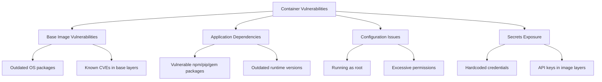
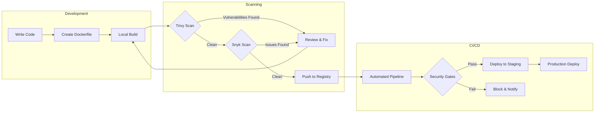
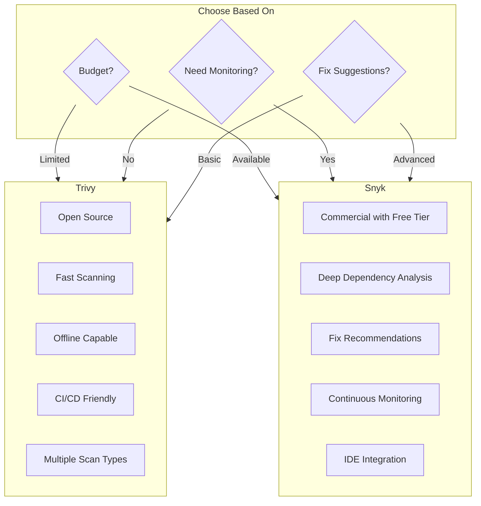
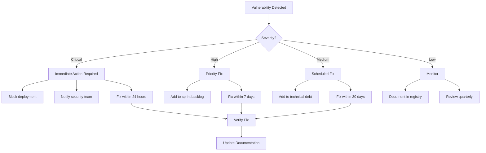

# How to Create Docker Images with Security Scanning

Author: [nawazdhandala](https://github.com/nawazdhandala)

Tags: Docker, Security, Container Security, DevSecOps

Description: Learn how to integrate security scanning into your Docker image build pipeline.

---

## Introduction

Container security has become a critical concern in modern software development. With the rise of containerized applications, vulnerabilities in Docker images can expose your entire infrastructure to attacks. Security scanning helps identify vulnerabilities in your base images, application dependencies, and configuration issues before they reach production.

This guide covers how to build secure Docker images and integrate vulnerability scanning tools like Trivy and Snyk into your development workflow and CI/CD pipelines.

## Understanding Container Vulnerabilities

Before diving into scanning tools, let's understand what we're protecting against:



## Building Secure Docker Images

### Best Practices for Secure Dockerfiles

Here's an example of a security-focused Dockerfile:

```dockerfile
# Use a specific version tag instead of 'latest' for reproducibility
# Alpine images have a smaller attack surface
FROM node:20-alpine AS builder

# Create a non-root user for security
# Running containers as root is a common security anti-pattern
RUN addgroup -g 1001 appgroup && \
    adduser -u 1001 -G appgroup -D appuser

# Set the working directory
WORKDIR /app

# Copy package files first for better layer caching
# This allows Docker to cache the npm install step
COPY package*.json ./

# Install dependencies
# Using --production flag excludes dev dependencies
# Using --ignore-scripts prevents malicious post-install scripts
RUN npm ci --production --ignore-scripts

# Copy application source code
COPY --chown=appuser:appgroup . .

# Multi-stage build: Create a minimal production image
FROM node:20-alpine AS production

# Install security updates
# Always update packages in your base image
RUN apk update && apk upgrade --no-cache

# Create non-root user in production image
RUN addgroup -g 1001 appgroup && \
    adduser -u 1001 -G appgroup -D appuser

WORKDIR /app

# Copy only necessary files from builder stage
# This reduces the attack surface by excluding build tools
COPY --from=builder --chown=appuser:appgroup /app/node_modules ./node_modules
COPY --from=builder --chown=appuser:appgroup /app/dist ./dist
COPY --from=builder --chown=appuser:appgroup /app/package.json ./

# Switch to non-root user
USER appuser

# Use HEALTHCHECK for container orchestration
HEALTHCHECK --interval=30s --timeout=3s --start-period=5s --retries=3 \
    CMD node healthcheck.js || exit 1

# Document the port (does not actually expose it)
EXPOSE 3000

# Use exec form of CMD for proper signal handling
CMD ["node", "dist/server.js"]
```

## Vulnerability Scanning with Trivy

Trivy is an open-source vulnerability scanner developed by Aqua Security. It scans container images, filesystems, and Git repositories for vulnerabilities.

### Installing Trivy

```bash
# Install on macOS using Homebrew
brew install trivy

# Install on Linux using apt
sudo apt-get install wget apt-transport-https gnupg lsb-release
wget -qO - https://aquasecurity.github.io/trivy-repo/deb/public.key | sudo apt-key add -
echo deb https://aquasecurity.github.io/trivy-repo/deb $(lsb_release -sc) main | sudo tee -a /etc/apt/sources.list.d/trivy.list
sudo apt-get update
sudo apt-get install trivy

# Run Trivy using Docker (no installation required)
docker run --rm -v /var/run/docker.sock:/var/run/docker.sock \
    aquasec/trivy:latest image your-image:tag
```

### Basic Trivy Scanning

```bash
# Scan a Docker image for vulnerabilities
# This command checks for OS and library vulnerabilities
trivy image myapp:latest

# Scan with severity filter
# Only show HIGH and CRITICAL vulnerabilities
trivy image --severity HIGH,CRITICAL myapp:latest

# Output results in JSON format for CI/CD integration
trivy image --format json --output results.json myapp:latest

# Scan and fail if vulnerabilities are found (useful for CI/CD)
# Exit code 1 if HIGH or CRITICAL vulnerabilities exist
trivy image --exit-code 1 --severity HIGH,CRITICAL myapp:latest

# Scan a Dockerfile before building
# This catches issues early in the development process
trivy config --severity HIGH,CRITICAL ./Dockerfile
```

### Trivy Configuration File

Create a `.trivy.yaml` file in your project root:

```yaml
# .trivy.yaml
# Trivy configuration for consistent scanning across environments

# Specify severity levels to report
severity:
  - HIGH
  - CRITICAL

# Ignore specific vulnerabilities that have been reviewed
# Document why each vulnerability is being ignored
ignorefile: .trivyignore

# Output format configuration
format: table

# Exit with error code if vulnerabilities found
exit-code: 1

# Scan configuration
scan:
  # Skip scanning files without proper permissions
  skip-files:
    - "**/*.md"
    - "**/test/**"

  # Vulnerability types to scan for
  vuln-type:
    - os
    - library

# Database configuration
db:
  # Skip database update (use cached version)
  skip-update: false
```

### Trivy Ignore File

Create a `.trivyignore` file for known exceptions:

```text
# .trivyignore
# Vulnerabilities that have been reviewed and accepted

# CVE-2023-XXXXX: This vulnerability does not affect our use case
# Reviewed by: security-team
# Review date: 2026-01-15
# Reason: The vulnerable function is not used in our application
CVE-2023-XXXXX

# CVE-2024-YYYYY: Waiting for upstream fix, compensating controls in place
# Reviewed by: security-team
# Review date: 2026-01-20
# Reason: Network policy prevents exploitation
CVE-2024-YYYYY
```

## Vulnerability Scanning with Snyk

Snyk provides comprehensive security scanning with deep integration into development workflows.

### Installing and Configuring Snyk

```bash
# Install Snyk CLI using npm
npm install -g snyk

# Authenticate with your Snyk account
# This opens a browser for authentication
snyk auth

# For CI/CD environments, use an API token
export SNYK_TOKEN=your-api-token
```

### Scanning Docker Images with Snyk

```bash
# Scan a local Docker image
# Snyk analyzes both the base image and application dependencies
snyk container test myapp:latest

# Scan and monitor the image for new vulnerabilities
# This adds the image to your Snyk dashboard for continuous monitoring
snyk container monitor myapp:latest

# Scan with a specific severity threshold
# Only fail on high severity or above
snyk container test myapp:latest --severity-threshold=high

# Output results in JSON format
snyk container test myapp:latest --json > snyk-results.json

# Include application dependencies in the scan
# The --app-vulns flag scans npm/pip/gem dependencies too
snyk container test myapp:latest --app-vulns

# Scan a Dockerfile for configuration issues
snyk iac test ./Dockerfile
```

### Snyk Configuration

Create a `.snyk` file for policy configuration:

```yaml
# .snyk
# Snyk policy file for vulnerability management

version: v1.25.0

# Ignore specific vulnerabilities with documentation
ignore:
  SNYK-JS-EXAMPLE-1234567:
    - '*':
        reason: 'Risk accepted - does not affect our use case'
        expires: '2026-06-30T00:00:00.000Z'
        created: '2026-01-30T00:00:00.000Z'

# Patch vulnerabilities when possible
patch: {}
```

## Security Scanning Workflow

Here's a visual representation of the security scanning workflow:



## CI/CD Integration

### GitHub Actions Integration

```yaml
# .github/workflows/docker-security.yml
# Automated security scanning workflow for Docker images

name: Docker Security Scan

on:
  push:
    branches: [main, develop]
  pull_request:
    branches: [main]
  # Run weekly scans to catch new vulnerabilities
  schedule:
    - cron: '0 0 * * 0'

env:
  REGISTRY: ghcr.io
  IMAGE_NAME: ${{ github.repository }}

jobs:
  build-and-scan:
    runs-on: ubuntu-latest
    permissions:
      contents: read
      packages: write
      security-events: write

    steps:
      # Checkout the repository
      - name: Checkout repository
        uses: actions/checkout@v4

      # Set up Docker Buildx for efficient builds
      - name: Set up Docker Buildx
        uses: docker/setup-buildx-action@v3

      # Build the Docker image
      - name: Build Docker image
        uses: docker/build-push-action@v5
        with:
          context: .
          load: true
          tags: ${{ env.IMAGE_NAME }}:${{ github.sha }}
          cache-from: type=gha
          cache-to: type=gha,mode=max

      # Scan with Trivy and upload results to GitHub Security tab
      - name: Run Trivy vulnerability scanner
        uses: aquasecurity/trivy-action@master
        with:
          image-ref: ${{ env.IMAGE_NAME }}:${{ github.sha }}
          format: 'sarif'
          output: 'trivy-results.sarif'
          severity: 'CRITICAL,HIGH'
          # Do not fail the build here - we'll handle that separately
          exit-code: '0'

      # Upload Trivy results to GitHub Security tab
      - name: Upload Trivy scan results to GitHub Security tab
        uses: github/codeql-action/upload-sarif@v3
        with:
          sarif_file: 'trivy-results.sarif'

      # Run Trivy again with exit code for build failure
      - name: Check for critical vulnerabilities
        uses: aquasecurity/trivy-action@master
        with:
          image-ref: ${{ env.IMAGE_NAME }}:${{ github.sha }}
          format: 'table'
          severity: 'CRITICAL'
          exit-code: '1'
          ignore-unfixed: true

      # Scan with Snyk for additional coverage
      - name: Run Snyk container scan
        uses: snyk/actions/docker@master
        env:
          SNYK_TOKEN: ${{ secrets.SNYK_TOKEN }}
        with:
          image: ${{ env.IMAGE_NAME }}:${{ github.sha }}
          args: --severity-threshold=high

      # Push to registry only if scans pass
      - name: Log in to Container Registry
        if: github.event_name != 'pull_request'
        uses: docker/login-action@v3
        with:
          registry: ${{ env.REGISTRY }}
          username: ${{ github.actor }}
          password: ${{ secrets.GITHUB_TOKEN }}

      - name: Push image to registry
        if: github.event_name != 'pull_request'
        uses: docker/build-push-action@v5
        with:
          context: .
          push: true
          tags: |
            ${{ env.REGISTRY }}/${{ env.IMAGE_NAME }}:${{ github.sha }}
            ${{ env.REGISTRY }}/${{ env.IMAGE_NAME }}:latest
```

### GitLab CI Integration

```yaml
# .gitlab-ci.yml
# GitLab CI/CD pipeline with security scanning

stages:
  - build
  - scan
  - push
  - deploy

variables:
  DOCKER_IMAGE: $CI_REGISTRY_IMAGE:$CI_COMMIT_SHA
  DOCKER_IMAGE_LATEST: $CI_REGISTRY_IMAGE:latest

# Build the Docker image
build:
  stage: build
  image: docker:24
  services:
    - docker:24-dind
  script:
    - docker build -t $DOCKER_IMAGE .
    - docker save $DOCKER_IMAGE > image.tar
  artifacts:
    paths:
      - image.tar
    expire_in: 1 hour

# Scan with Trivy
trivy-scan:
  stage: scan
  image:
    name: aquasec/trivy:latest
    entrypoint: [""]
  script:
    # Load the image from the build stage
    - docker load < image.tar
    # Run vulnerability scan
    - trivy image --exit-code 0 --severity HIGH,CRITICAL --format template --template "@/contrib/gitlab.tpl" -o gl-container-scanning-report.json $DOCKER_IMAGE
    # Fail on critical vulnerabilities
    - trivy image --exit-code 1 --severity CRITICAL --ignore-unfixed $DOCKER_IMAGE
  artifacts:
    reports:
      container_scanning: gl-container-scanning-report.json
  allow_failure: false

# Scan with Snyk
snyk-scan:
  stage: scan
  image: snyk/snyk:docker
  script:
    - docker load < image.tar
    - snyk auth $SNYK_TOKEN
    - snyk container test $DOCKER_IMAGE --severity-threshold=high
  allow_failure: false

# Push to registry only after successful scans
push:
  stage: push
  image: docker:24
  services:
    - docker:24-dind
  script:
    - docker load < image.tar
    - docker login -u $CI_REGISTRY_USER -p $CI_REGISTRY_PASSWORD $CI_REGISTRY
    - docker push $DOCKER_IMAGE
    - docker tag $DOCKER_IMAGE $DOCKER_IMAGE_LATEST
    - docker push $DOCKER_IMAGE_LATEST
  only:
    - main
  needs:
    - build
    - trivy-scan
    - snyk-scan
```

### Jenkins Pipeline Integration

```groovy
// Jenkinsfile
// Declarative pipeline with security scanning stages

pipeline {
    agent any

    environment {
        DOCKER_IMAGE = "myapp:${env.BUILD_NUMBER}"
        SNYK_TOKEN = credentials('snyk-api-token')
    }

    stages {
        stage('Build') {
            steps {
                script {
                    // Build the Docker image
                    docker.build(env.DOCKER_IMAGE)
                }
            }
        }

        stage('Security Scan - Trivy') {
            steps {
                script {
                    // Run Trivy vulnerability scan
                    sh '''
                        # Install Trivy if not present
                        if ! command -v trivy &> /dev/null; then
                            curl -sfL https://raw.githubusercontent.com/aquasecurity/trivy/main/contrib/install.sh | sh -s -- -b /usr/local/bin
                        fi

                        # Run scan and generate report
                        trivy image --format json --output trivy-report.json ${DOCKER_IMAGE}

                        # Fail build on critical vulnerabilities
                        trivy image --exit-code 1 --severity CRITICAL --ignore-unfixed ${DOCKER_IMAGE}
                    '''
                }
            }
            post {
                always {
                    // Archive the scan report
                    archiveArtifacts artifacts: 'trivy-report.json', fingerprint: true
                }
            }
        }

        stage('Security Scan - Snyk') {
            steps {
                script {
                    sh '''
                        # Run Snyk container scan
                        snyk container test ${DOCKER_IMAGE} \
                            --severity-threshold=high \
                            --json > snyk-report.json || true

                        # Check for high severity issues
                        snyk container test ${DOCKER_IMAGE} --severity-threshold=high
                    '''
                }
            }
            post {
                always {
                    archiveArtifacts artifacts: 'snyk-report.json', fingerprint: true
                }
            }
        }

        stage('Push to Registry') {
            when {
                branch 'main'
            }
            steps {
                script {
                    docker.withRegistry('https://registry.example.com', 'docker-credentials') {
                        docker.image(env.DOCKER_IMAGE).push()
                        docker.image(env.DOCKER_IMAGE).push('latest')
                    }
                }
            }
        }
    }

    post {
        failure {
            // Notify team of security scan failures
            emailext (
                subject: "Security Scan Failed: ${env.JOB_NAME} #${env.BUILD_NUMBER}",
                body: "Security vulnerabilities detected. Please review the scan reports.",
                to: 'security-team@example.com'
            )
        }
    }
}
```

## Comparing Trivy and Snyk

Here's a comparison to help you choose the right tool:



| Feature | Trivy | Snyk |
|---------|-------|------|
| Cost | Free, Open Source | Free tier, Paid plans |
| Speed | Very Fast | Fast |
| Offline Mode | Yes | Limited |
| Fix Recommendations | Basic | Detailed |
| Continuous Monitoring | Manual setup | Built-in |
| IDE Integration | Limited | Extensive |
| Container + Code | Yes | Yes |
| License Scanning | Yes | Yes |
| SBOM Generation | Yes | Yes |

## Advanced Scanning Strategies

### Scanning Base Images Before Use

```bash
#!/bin/bash
# scan-base-image.sh
# Scan base images before using them in your Dockerfile

set -e

BASE_IMAGE=$1

if [ -z "$BASE_IMAGE" ]; then
    echo "Usage: $0 <base-image>"
    exit 1
fi

echo "Scanning base image: $BASE_IMAGE"

# Pull the latest version
docker pull $BASE_IMAGE

# Scan with Trivy
echo "Running Trivy scan..."
trivy image --severity HIGH,CRITICAL $BASE_IMAGE

# Scan with Snyk if available
if command -v snyk &> /dev/null; then
    echo "Running Snyk scan..."
    snyk container test $BASE_IMAGE --severity-threshold=high
fi

echo "Base image scan complete!"
```

### Generating Software Bill of Materials (SBOM)

```bash
# Generate SBOM with Trivy in SPDX format
# SBOM provides a complete inventory of components in your image
trivy image --format spdx-json --output sbom.spdx.json myapp:latest

# Generate SBOM in CycloneDX format
trivy image --format cyclonedx --output sbom.cdx.json myapp:latest

# Scan an existing SBOM for vulnerabilities
trivy sbom sbom.spdx.json
```

### Pre-commit Hook for Local Scanning

```bash
#!/bin/bash
# .git/hooks/pre-commit
# Scan Dockerfile changes before committing

# Check if Dockerfile was modified
if git diff --cached --name-only | grep -q "Dockerfile"; then
    echo "Dockerfile changes detected. Running security scan..."

    # Scan Dockerfile configuration
    if command -v trivy &> /dev/null; then
        trivy config --severity HIGH,CRITICAL ./Dockerfile
        if [ $? -ne 0 ]; then
            echo "Security issues found in Dockerfile. Please fix before committing."
            exit 1
        fi
    fi

    echo "Dockerfile security scan passed!"
fi

exit 0
```

## Handling Scan Results

### Creating a Vulnerability Response Process



### Automating Vulnerability Reports

```python
#!/usr/bin/env python3
# vulnerability_report.py
# Generate vulnerability reports from Trivy JSON output

import json
import sys
from datetime import datetime
from collections import defaultdict

def parse_trivy_results(json_file):
    """Parse Trivy JSON output and generate a summary report."""

    with open(json_file, 'r') as f:
        data = json.load(f)

    # Initialize counters
    severity_counts = defaultdict(int)
    vulnerabilities = []

    # Process results
    for result in data.get('Results', []):
        target = result.get('Target', 'Unknown')

        for vuln in result.get('Vulnerabilities', []):
            severity = vuln.get('Severity', 'UNKNOWN')
            severity_counts[severity] += 1

            vulnerabilities.append({
                'target': target,
                'id': vuln.get('VulnerabilityID'),
                'package': vuln.get('PkgName'),
                'version': vuln.get('InstalledVersion'),
                'fixed_version': vuln.get('FixedVersion', 'Not available'),
                'severity': severity,
                'title': vuln.get('Title', 'No description')
            })

    return severity_counts, vulnerabilities

def generate_report(severity_counts, vulnerabilities):
    """Generate a formatted vulnerability report."""

    report = []
    report.append("=" * 60)
    report.append("VULNERABILITY SCAN REPORT")
    report.append(f"Generated: {datetime.now().isoformat()}")
    report.append("=" * 60)
    report.append("")

    # Summary section
    report.append("SUMMARY")
    report.append("-" * 40)
    for severity in ['CRITICAL', 'HIGH', 'MEDIUM', 'LOW', 'UNKNOWN']:
        count = severity_counts.get(severity, 0)
        report.append(f"  {severity}: {count}")
    report.append("")

    # Detailed findings
    report.append("DETAILED FINDINGS")
    report.append("-" * 40)

    # Sort by severity
    severity_order = {'CRITICAL': 0, 'HIGH': 1, 'MEDIUM': 2, 'LOW': 3, 'UNKNOWN': 4}
    sorted_vulns = sorted(vulnerabilities, key=lambda x: severity_order.get(x['severity'], 5))

    for vuln in sorted_vulns:
        report.append(f"\n[{vuln['severity']}] {vuln['id']}")
        report.append(f"  Package: {vuln['package']} ({vuln['version']})")
        report.append(f"  Fixed in: {vuln['fixed_version']}")
        report.append(f"  Description: {vuln['title']}")

    return "\n".join(report)

if __name__ == "__main__":
    if len(sys.argv) != 2:
        print("Usage: python vulnerability_report.py <trivy-results.json>")
        sys.exit(1)

    counts, vulns = parse_trivy_results(sys.argv[1])
    report = generate_report(counts, vulns)
    print(report)

    # Exit with error if critical vulnerabilities found
    if counts.get('CRITICAL', 0) > 0:
        sys.exit(1)
```

## Conclusion

Integrating security scanning into your Docker image build pipeline is essential for maintaining a secure containerized environment. By using tools like Trivy and Snyk, you can:

1. Identify vulnerabilities in base images and dependencies before deployment
2. Automate security checks in your CI/CD pipeline
3. Generate compliance reports and SBOMs
4. Establish a vulnerability response process

Remember that security scanning is just one part of a comprehensive container security strategy. Combine it with:

- Regular base image updates
- Principle of least privilege
- Network policies
- Runtime security monitoring
- Secret management solutions

Start with basic scanning and gradually expand your security practices as your organization matures. The goal is to shift security left and catch issues early in the development lifecycle.

## Additional Resources

- [Trivy Documentation](https://aquasecurity.github.io/trivy/)
- [Snyk Container Documentation](https://docs.snyk.io/products/snyk-container)
- [Docker Security Best Practices](https://docs.docker.com/develop/security-best-practices/)
- [CIS Docker Benchmark](https://www.cisecurity.org/benchmark/docker)
- [OWASP Container Security](https://owasp.org/www-project-container-security/)
