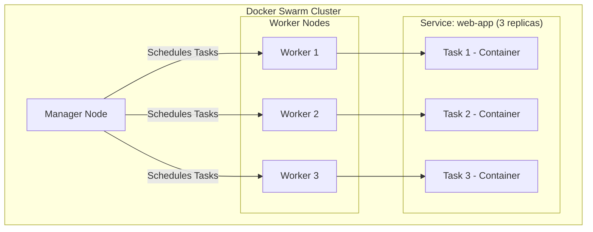
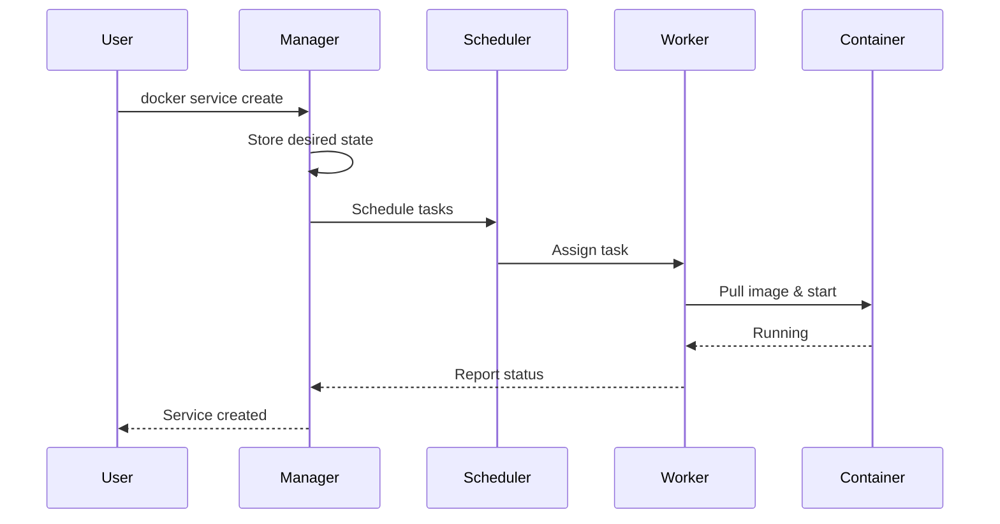
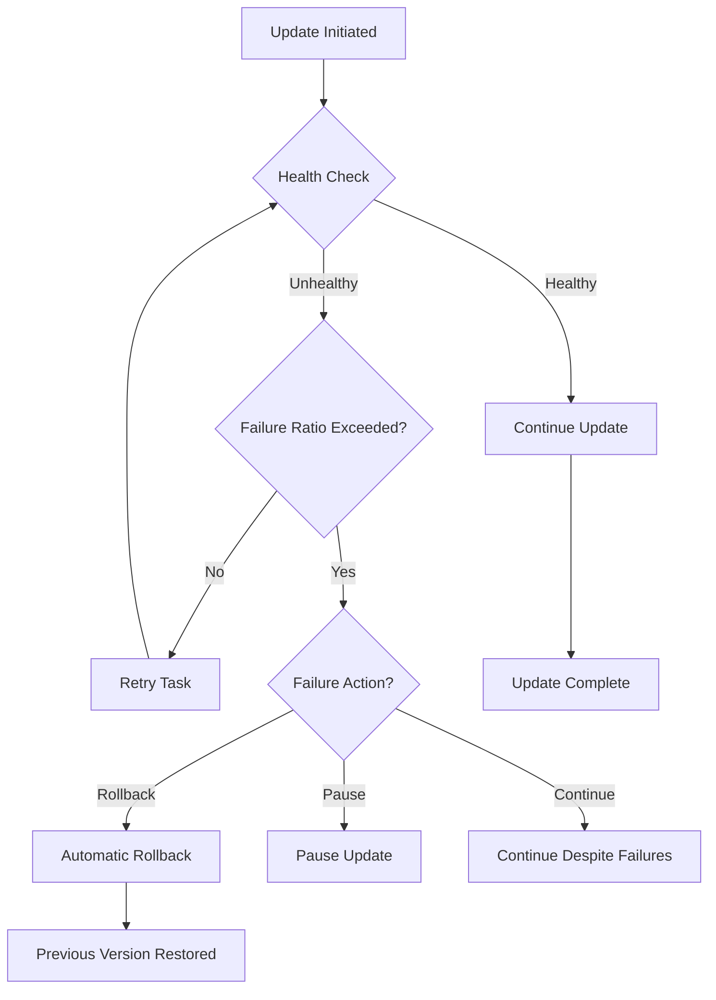
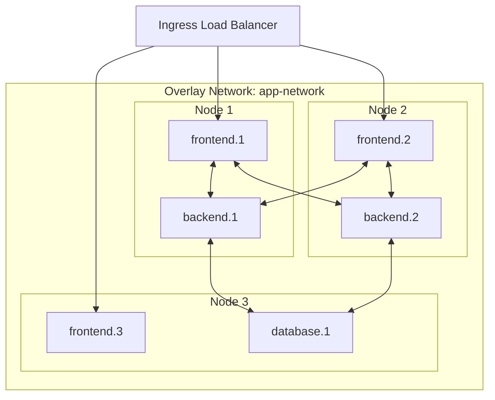
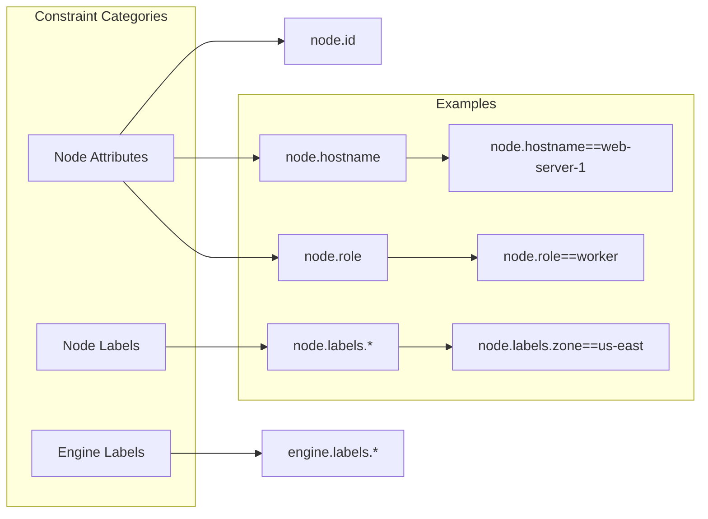
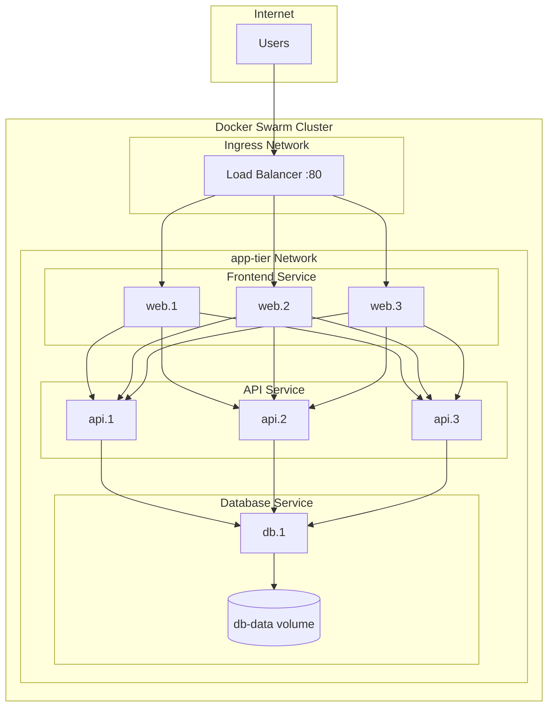

# How to Create Docker Swarm Services

Author: [nawazdhandala](https://github.com/nawazdhandala)

Tags: Docker, Swarm, Orchestration, Services

Description: Learn to create Docker Swarm services with replicas, update policies, and networking for simple container orchestration without Kubernetes.

---

Docker Swarm is Docker's native clustering and orchestration solution. It transforms a group of Docker hosts into a single virtual host, allowing you to deploy and manage containers at scale. While Kubernetes dominates enterprise container orchestration, Docker Swarm remains a compelling choice for teams seeking simplicity without sacrificing essential orchestration features.

## What is a Docker Swarm Service?

A service is the central concept in Docker Swarm. It defines how containers should run across your cluster - including the image to use, the number of replicas, networking configuration, and update strategies.



## Prerequisites

Before creating services, you need a Swarm cluster. Initialize one on your manager node:

```bash
# Initialize the swarm on the manager node
docker swarm init --advertise-addr <MANAGER-IP>

# The output provides a join token for worker nodes
# On each worker node, run:
docker swarm join --token <TOKEN> <MANAGER-IP>:2377
```

Verify your cluster status:

```bash
# List all nodes in the swarm
docker node ls
```

Output:

```
ID                            HOSTNAME     STATUS    AVAILABILITY   MANAGER STATUS
abc123 *                      manager-1    Ready     Active         Leader
def456                        worker-1     Ready     Active
ghi789                        worker-2     Ready     Active
```

## Creating Your First Service

The `docker service create` command deploys a service to your swarm. Here is a basic example:

```bash
# Create a simple nginx service
docker service create \
  --name web-server \
  --publish 80:80 \
  nginx:latest
```

This command creates a single replica of nginx, accessible on port 80 of any swarm node.

### Understanding the Service Lifecycle



## Working with Replicas

Replicas determine how many identical containers run for your service. Swarm automatically distributes them across available nodes.

### Setting Replicas at Creation

```bash
# Create a service with 5 replicas
docker service create \
  --name api-service \
  --replicas 5 \
  --publish 8080:8080 \
  my-api:v1.0
```

### Scaling an Existing Service

```bash
# Scale up to 10 replicas
docker service scale api-service=10

# Scale down to 3 replicas
docker service scale api-service=3

# Scale multiple services at once
docker service scale api-service=5 web-server=3
```

### Viewing Service Status

```bash
# List all services
docker service ls

# View detailed service information
docker service inspect --pretty api-service

# List tasks (containers) for a service
docker service ps api-service
```

Example output of `docker service ps`:

```
ID             NAME            IMAGE         NODE       DESIRED STATE   CURRENT STATE
a1b2c3d4e5     api-service.1   my-api:v1.0   worker-1   Running         Running 5 minutes ago
f6g7h8i9j0     api-service.2   my-api:v1.0   worker-2   Running         Running 5 minutes ago
k1l2m3n4o5     api-service.3   my-api:v1.0   worker-1   Running         Running 5 minutes ago
```

## Service Update Strategies

Docker Swarm supports rolling updates, allowing you to update services with zero downtime.

### Configuring Update Policies

```bash
# Create a service with update configuration
docker service create \
  --name web-app \
  --replicas 6 \
  --update-parallelism 2 \
  --update-delay 10s \
  --update-failure-action rollback \
  --update-max-failure-ratio 0.25 \
  --publish 80:80 \
  myapp:v1.0
```

Parameter explanations:

| Parameter | Description |
|-----------|-------------|
| `--update-parallelism` | Number of tasks to update simultaneously |
| `--update-delay` | Time to wait between updating batches |
| `--update-failure-action` | Action on failure: pause, continue, or rollback |
| `--update-max-failure-ratio` | Maximum fraction of failed tasks before action triggers |

### Rolling Update Visualization

```mermaid
gantt
    title Rolling Update Process (6 replicas, parallelism=2)
    dateFormat X
    axisFormat %s

    section Batch 1
    Update Task 1    :0, 5
    Update Task 2    :0, 5

    section Delay
    Wait 10s         :5, 15

    section Batch 2
    Update Task 3    :15, 20
    Update Task 4    :15, 20

    section Delay
    Wait 10s         :20, 30

    section Batch 3
    Update Task 5    :30, 35
    Update Task 6    :30, 35
```



### Performing an Update

```bash
# Update the service to a new image version
docker service update \
  --image myapp:v2.0 \
  web-app

# Update with additional configuration changes
docker service update \
  --image myapp:v2.0 \
  --env-add NEW_FEATURE=enabled \
  --replicas 8 \
  web-app
```

Monitor the update progress:

```bash
# Watch update status
docker service ps web-app

# View update status in service inspect
docker service inspect --pretty web-app | grep -A 5 "UpdateStatus"
```

## Rollback Strategies

When an update fails or introduces issues, you can quickly rollback to the previous version.

### Automatic Rollback Configuration

```bash
# Configure rollback behavior at service creation
docker service create \
  --name critical-app \
  --replicas 4 \
  --rollback-parallelism 1 \
  --rollback-delay 5s \
  --rollback-failure-action pause \
  --rollback-max-failure-ratio 0.1 \
  --update-failure-action rollback \
  myapp:v1.0
```

### Manual Rollback

```bash
# Rollback to the previous version
docker service rollback web-app

# Or update to a specific previous version
docker service update --image myapp:v1.0 web-app
```

### Rollback Flow



## Networking in Docker Swarm

Swarm provides built-in service discovery and load balancing through overlay networks.

### Creating an Overlay Network

```bash
# Create an overlay network for your services
docker network create \
  --driver overlay \
  --attachable \
  --subnet 10.0.1.0/24 \
  app-network
```

### Network Architecture



### Connecting Services to Networks

```bash
# Create services on the same network
docker service create \
  --name frontend \
  --network app-network \
  --replicas 3 \
  --publish 80:80 \
  frontend-app:latest

docker service create \
  --name backend \
  --network app-network \
  --replicas 2 \
  backend-api:latest

docker service create \
  --name database \
  --network app-network \
  --replicas 1 \
  postgres:14
```

Services on the same overlay network can communicate using their service names as DNS hostnames:

```bash
# From within the frontend container
curl http://backend:8080/api/health
```

### Publishing Ports

Swarm offers two port publishing modes:

```bash
# Ingress mode (default) - load balanced across all nodes
docker service create \
  --name web \
  --publish mode=ingress,target=80,published=8080 \
  nginx:latest

# Host mode - binds directly to the host port
docker service create \
  --name monitoring \
  --publish mode=host,target=9090,published=9090 \
  prometheus:latest
```

## Placement Constraints

Constraints control which nodes can run your service tasks.

### Node Labels

First, add labels to your nodes:

```bash
# Add labels to nodes
docker node update --label-add environment=production manager-1
docker node update --label-add environment=production worker-1
docker node update --label-add environment=staging worker-2
docker node update --label-add disk=ssd worker-1
docker node update --label-add disk=hdd worker-2
```

### Using Constraints

```bash
# Run only on production nodes
docker service create \
  --name prod-api \
  --constraint 'node.labels.environment==production' \
  --replicas 3 \
  api:latest

# Run only on nodes with SSD storage
docker service create \
  --name database \
  --constraint 'node.labels.disk==ssd' \
  --replicas 1 \
  postgres:14

# Combine multiple constraints
docker service create \
  --name critical-service \
  --constraint 'node.labels.environment==production' \
  --constraint 'node.labels.disk==ssd' \
  --constraint 'node.role==worker' \
  critical-app:latest
```

### Constraint Types



### Placement Preferences

Use preferences for soft constraints that influence but do not strictly control placement:

```bash
# Spread replicas across availability zones
docker service create \
  --name distributed-app \
  --replicas 6 \
  --placement-pref 'spread=node.labels.zone' \
  myapp:latest
```

## Resource Management

Control CPU and memory allocation for your services:

```bash
# Set resource limits and reservations
docker service create \
  --name resource-managed \
  --replicas 3 \
  --limit-cpu 0.5 \
  --limit-memory 512M \
  --reserve-cpu 0.25 \
  --reserve-memory 256M \
  myapp:latest
```

| Parameter | Description |
|-----------|-------------|
| `--limit-cpu` | Maximum CPU cores the container can use |
| `--limit-memory` | Maximum memory the container can use |
| `--reserve-cpu` | CPU cores reserved for the container |
| `--reserve-memory` | Memory reserved for the container |

## Health Checks

Configure health checks to ensure Swarm only routes traffic to healthy containers:

```bash
docker service create \
  --name healthy-app \
  --replicas 3 \
  --health-cmd "curl -f http://localhost:8080/health || exit 1" \
  --health-interval 30s \
  --health-timeout 10s \
  --health-retries 3 \
  --health-start-period 60s \
  myapp:latest
```

## Complete Example: Multi-Service Application

Here is a complete example deploying a three-tier application:

```bash
# Create the overlay network
docker network create --driver overlay app-tier

# Deploy the database
docker service create \
  --name db \
  --network app-tier \
  --replicas 1 \
  --constraint 'node.labels.disk==ssd' \
  --mount type=volume,source=db-data,target=/var/lib/postgresql/data \
  --env POSTGRES_PASSWORD=secretpassword \
  --env POSTGRES_DB=myapp \
  postgres:14

# Deploy the backend API
docker service create \
  --name api \
  --network app-tier \
  --replicas 3 \
  --update-parallelism 1 \
  --update-delay 10s \
  --update-failure-action rollback \
  --env DATABASE_URL=postgres://postgres:secretpassword@db:5432/myapp \
  --health-cmd "curl -f http://localhost:8080/health || exit 1" \
  --health-interval 30s \
  api-server:v1.0

# Deploy the frontend
docker service create \
  --name web \
  --network app-tier \
  --replicas 3 \
  --publish 80:80 \
  --update-parallelism 1 \
  --update-delay 5s \
  --env API_URL=http://api:8080 \
  frontend:v1.0
```

### Application Architecture



## Managing Services with Docker Stack

For complex applications, use Docker Compose files with `docker stack`:

```yaml
# docker-compose.yml
version: '3.8'

services:
  web:
    image: frontend:v1.0
    ports:
      - "80:80"
    networks:
      - app-tier
    deploy:
      replicas: 3
      update_config:
        parallelism: 1
        delay: 10s
        failure_action: rollback
      restart_policy:
        condition: on-failure

  api:
    image: api-server:v1.0
    networks:
      - app-tier
    environment:
      - DATABASE_URL=postgres://postgres:secretpassword@db:5432/myapp
    deploy:
      replicas: 3
      placement:
        constraints:
          - node.role == worker

  db:
    image: postgres:14
    networks:
      - app-tier
    environment:
      - POSTGRES_PASSWORD=secretpassword
      - POSTGRES_DB=myapp
    volumes:
      - db-data:/var/lib/postgresql/data
    deploy:
      replicas: 1
      placement:
        constraints:
          - node.labels.disk == ssd

networks:
  app-tier:
    driver: overlay

volumes:
  db-data:
```

Deploy the stack:

```bash
# Deploy the stack
docker stack deploy -c docker-compose.yml myapp

# List stacks
docker stack ls

# List services in a stack
docker stack services myapp

# Remove a stack
docker stack rm myapp
```

## Useful Commands Reference

```bash
# Service Management
docker service create    # Create a new service
docker service ls        # List services
docker service ps        # List tasks of a service
docker service inspect   # Display detailed service info
docker service update    # Update a service
docker service scale     # Scale a service
docker service rollback  # Rollback a service
docker service rm        # Remove a service
docker service logs      # View service logs

# Node Management
docker node ls           # List nodes
docker node inspect      # Inspect a node
docker node update       # Update node attributes
docker node promote      # Promote worker to manager
docker node demote       # Demote manager to worker

# Stack Management
docker stack deploy      # Deploy a stack
docker stack ls          # List stacks
docker stack services    # List services in a stack
docker stack ps          # List tasks in a stack
docker stack rm          # Remove a stack
```

## Conclusion

Docker Swarm provides a straightforward path to container orchestration. While it may lack some advanced features found in Kubernetes, its simplicity makes it an excellent choice for small to medium deployments. The key concepts covered in this guide - services, replicas, updates, rollbacks, networking, and constraints - form the foundation for running production workloads on Docker Swarm.

For teams already familiar with Docker, Swarm offers a natural progression to orchestration without requiring a steep learning curve. Start with simple services, experiment with rolling updates, and gradually introduce more complex configurations as your needs evolve.
