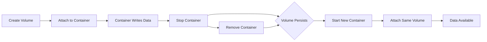
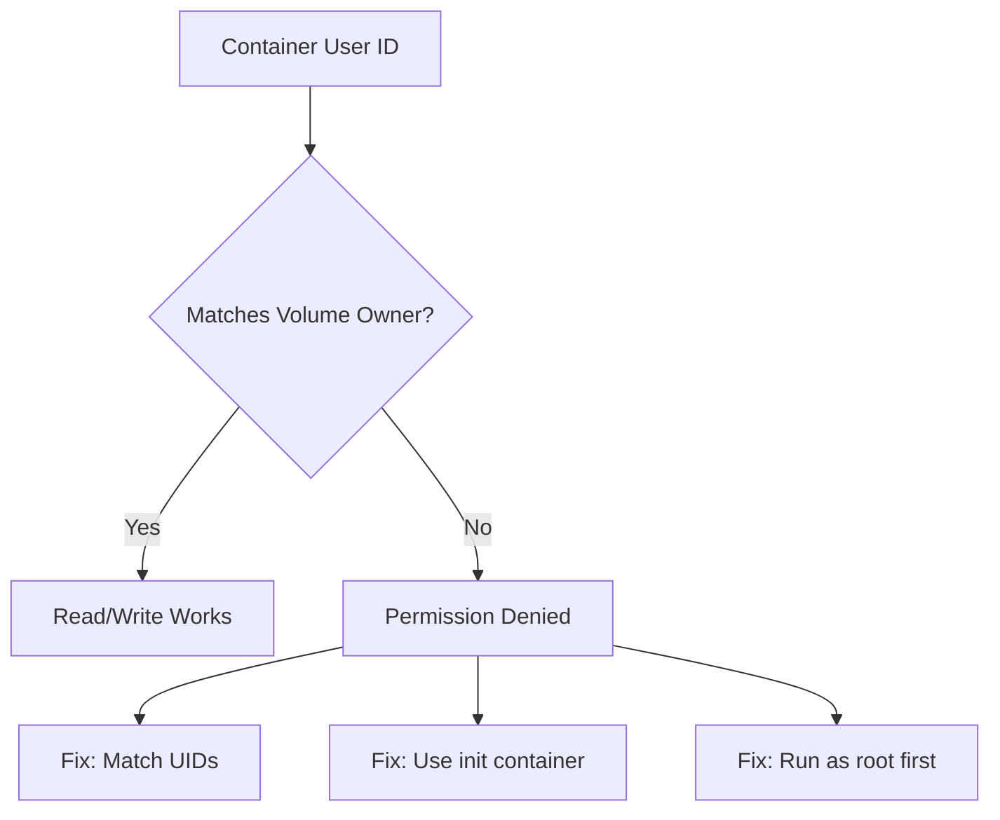
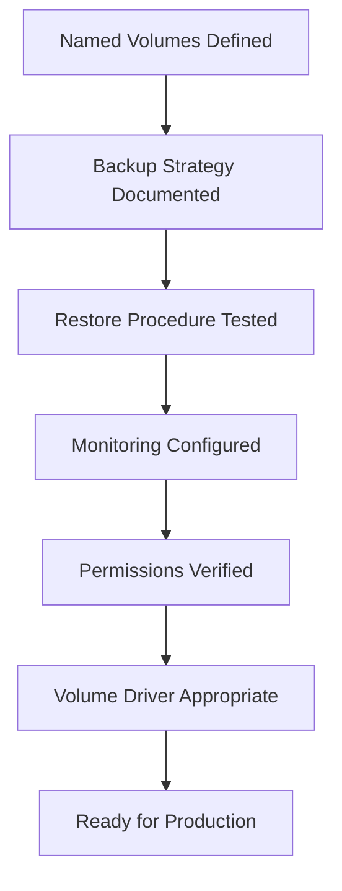

# How to Create Docker Volumes for Stateful Apps

Author: [nawazdhandala](https://github.com/nawazdhandala)

Tags: Docker, Storage, DevOps, Containers

Description: A practical guide to creating and managing Docker volumes for databases, caches, and other stateful applications that need persistent storage across container restarts.

---

Containers are ephemeral by design. Stop a container and its filesystem vanishes. That works perfectly for stateless web servers but becomes a nightmare the moment your app writes data you actually care about. Databases, file uploads, session stores, and caches all need storage that survives container lifecycles. Docker volumes solve this problem by decoupling data from container lifetimes.

## Why Volumes Beat Bind Mounts for Production

Docker offers two main ways to persist data: bind mounts and volumes. Bind mounts map a host path directly into the container. Volumes are managed by Docker itself and live in a dedicated area on the host filesystem.

| Feature | Bind Mounts | Docker Volumes |
| --- | --- | --- |
| **Portability** | Tied to host path structure | Works identically across hosts |
| **Permissions** | Host user/group must match container | Docker manages ownership |
| **Performance** | Same as host filesystem | Optimized drivers available |
| **Backup/Restore** | Manual file operations | Built-in volume commands |
| **Security** | Exposes host filesystem | Isolated from host |

For stateful apps in production, volumes win on every dimension except one: you cannot browse them with your host file manager. That is a feature, not a bug.

## Volume Lifecycle Overview

Understanding how volumes interact with containers helps you avoid data loss surprises.



Volumes survive container removal. You must explicitly delete a volume to lose its data.

## Creating Your First Volume

The simplest way to create a volume is with the `docker volume create` command.

```bash
# Create a named volume for PostgreSQL data
# Named volumes are easier to reference than anonymous volumes
docker volume create postgres_data
```

Verify the volume exists and inspect its details.

```bash
# List all volumes on the system
docker volume ls

# Show detailed information about the volume
# Mountpoint reveals where Docker stores the data on the host
docker volume inspect postgres_data
```

The inspect output shows the mountpoint, which is typically under `/var/lib/docker/volumes/` on Linux.

## Attaching Volumes to Containers

Use the `-v` or `--mount` flag to attach a volume when starting a container. The `--mount` syntax is more explicit and recommended for production scripts.

This command starts a PostgreSQL container with the data directory stored in the named volume.

```bash
# Start PostgreSQL with data persisted to the named volume
# --mount type=volume: Use a Docker-managed volume
# source=postgres_data: Name of the volume to attach
# target=/var/lib/postgresql/data: Where to mount inside the container
docker run -d \
  --name postgres \
  --mount type=volume,source=postgres_data,target=/var/lib/postgresql/data \
  -e POSTGRES_PASSWORD=secretpassword \
  postgres:16
```

The equivalent shorthand syntax uses `-v`, which is fine for quick experiments.

```bash
# Shorthand syntax: volume_name:container_path
docker run -d \
  --name postgres \
  -v postgres_data:/var/lib/postgresql/data \
  -e POSTGRES_PASSWORD=secretpassword \
  postgres:16
```

## Real-World Example: Redis with Persistence

Redis can operate in memory-only mode, but production deployments usually enable persistence. Here is a complete setup with AOF (Append Only File) persistence backed by a volume.

First, create a volume specifically for Redis data.

```bash
# Create a dedicated volume for Redis persistence files
docker volume create redis_data
```

Run Redis with persistence enabled and the volume attached.

```bash
# Start Redis with AOF persistence
# appendonly yes: Enable append-only file for durability
# appendfsync everysec: Sync to disk every second (balance of safety and speed)
docker run -d \
  --name redis \
  --mount type=volume,source=redis_data,target=/data \
  redis:7 \
  redis-server --appendonly yes --appendfsync everysec
```

Test that persistence works by writing data, destroying the container, and recreating it.

```bash
# Write a test key
docker exec redis redis-cli SET mykey "persistence test"

# Stop and remove the container (not the volume)
docker stop redis && docker rm redis

# Start a fresh container with the same volume
docker run -d \
  --name redis \
  --mount type=volume,source=redis_data,target=/data \
  redis:7 \
  redis-server --appendonly yes

# Verify the key survived
docker exec redis redis-cli GET mykey
# Output: "persistence test"
```

## Docker Compose for Multi-Container Stateful Apps

Most stateful applications involve multiple services. Docker Compose makes volume management declarative and repeatable.

This Compose file defines a typical web application stack with PostgreSQL and Redis, each with dedicated volumes.

```yaml
# docker-compose.yml
version: "3.8"

services:
  # PostgreSQL database with persistent storage
  db:
    image: postgres:16
    environment:
      POSTGRES_DB: myapp
      POSTGRES_USER: appuser
      POSTGRES_PASSWORD: ${DB_PASSWORD}  # Use .env file for secrets
    volumes:
      - postgres_data:/var/lib/postgresql/data
    healthcheck:
      test: ["CMD-SHELL", "pg_isready -U appuser -d myapp"]
      interval: 10s
      timeout: 5s
      retries: 5

  # Redis cache with AOF persistence
  cache:
    image: redis:7
    command: redis-server --appendonly yes
    volumes:
      - redis_data:/data
    healthcheck:
      test: ["CMD", "redis-cli", "ping"]
      interval: 10s
      timeout: 5s
      retries: 5

  # Application server depending on both data stores
  api:
    build: .
    depends_on:
      db:
        condition: service_healthy
      cache:
        condition: service_healthy
    environment:
      DATABASE_URL: postgres://appuser:${DB_PASSWORD}@db:5432/myapp
      REDIS_URL: redis://cache:6379

# Named volumes declared at the top level
# These persist independently of container lifecycle
volumes:
  postgres_data:
  redis_data:
```

Start the stack and Compose creates the volumes automatically.

```bash
# Start all services, creating volumes if they do not exist
docker compose up -d

# View volume status
docker volume ls --filter name=myapp
```

## Volume Drivers for Advanced Storage

Docker volumes support pluggable drivers that connect to network storage, cloud providers, or distributed filesystems.

| Driver | Use Case | Example |
| --- | --- | --- |
| **local** | Single-host development, simple production | Default driver |
| **nfs** | Shared storage across multiple Docker hosts | On-prem file servers |
| **rexray/ebs** | AWS EBS volumes for EC2 instances | Cloud-native persistence |
| **portworx** | Multi-host replicated storage | Kubernetes-like HA |
| **ceph** | Distributed storage clusters | Large-scale deployments |

Create a volume with a specific driver using the `--driver` flag.

```bash
# Create a volume backed by NFS storage
# driver-specific options configure the NFS server connection
docker volume create \
  --driver local \
  --opt type=nfs \
  --opt o=addr=192.168.1.100,rw \
  --opt device=:/exports/docker \
  nfs_shared_data
```

## Backup and Restore Strategies

Volumes store critical data, so backup procedures are essential. Docker does not include built-in backup commands, but the process is straightforward.

### Method 1: Backup to a Tarball

Use a temporary container to create a compressed archive of the volume contents.

```bash
# Create a backup of the postgres_data volume
# --rm: Remove the helper container after it finishes
# -v postgres_data:/source:ro: Mount volume read-only to prevent changes
# -v $(pwd):/backup: Mount current directory for the output file
# busybox tar: Use a minimal image to create the archive
docker run --rm \
  -v postgres_data:/source:ro \
  -v $(pwd):/backup \
  busybox tar czf /backup/postgres_backup_$(date +%Y%m%d).tar.gz -C /source .
```

### Method 2: Restore from a Tarball

Extract the backup into a new or existing volume.

```bash
# Create a fresh volume for the restore
docker volume create postgres_restored

# Extract the backup into the new volume
docker run --rm \
  -v postgres_restored:/target \
  -v $(pwd):/backup:ro \
  busybox tar xzf /backup/postgres_backup_20260130.tar.gz -C /target
```

### Method 3: Database-Native Dumps

For databases, native dump tools often produce smaller and more reliable backups than filesystem copies.

```bash
# PostgreSQL: Create a logical backup using pg_dump
docker exec postgres pg_dump -U appuser myapp > myapp_backup.sql

# Restore to a fresh database
docker exec -i postgres psql -U appuser myapp < myapp_backup.sql
```

## Volume Permissions and Ownership

Permission mismatches between container users and volume data cause frequent headaches. Here are the common scenarios and fixes.



### Solution 1: Match User IDs

Many official images run as non-root users. Check what user the image expects and set volume permissions accordingly.

```bash
# Find out what user the container runs as
docker run --rm postgres:16 id
# Output: uid=999(postgres) gid=999(postgres)

# On the host, ensure the volume directory has correct ownership
# This works for bind mounts; managed volumes handle this automatically
sudo chown -R 999:999 /path/to/bind/mount
```

### Solution 2: Init Container Pattern

Use a temporary privileged container to fix permissions before starting the real application.

```yaml
# In docker-compose.yml, run an init container first
services:
  init-permissions:
    image: busybox
    user: root
    volumes:
      - app_data:/data
    command: chown -R 1000:1000 /data
    # This service exits after fixing permissions

  app:
    image: myapp:latest
    user: "1000:1000"
    volumes:
      - app_data:/data
    depends_on:
      init-permissions:
        condition: service_completed_successfully
```

## Monitoring Volume Usage

Volumes can fill up silently. Monitor disk usage to prevent outages.

```bash
# Check disk usage of all volumes
docker system df -v

# Get detailed size of a specific volume
docker run --rm -v postgres_data:/data:ro busybox du -sh /data
```

For production systems, export these metrics to your monitoring stack. OneUptime can alert when volume usage crosses thresholds before your database crashes from disk full errors.

## Cleaning Up Unused Volumes

Docker does not automatically remove volumes when containers are deleted. Unused volumes accumulate and waste disk space.

```bash
# List volumes not attached to any container
docker volume ls -f dangling=true

# Remove all dangling volumes (careful in production!)
docker volume prune

# Remove a specific volume by name
docker volume rm postgres_data
```

Add volume cleanup to your maintenance runbooks, but always verify backups exist before removing anything.

## Common Pitfalls and How to Avoid Them

| Pitfall | Symptom | Prevention |
| --- | --- | --- |
| Anonymous volumes | Data disappears after `docker compose down -v` | Always use named volumes |
| Wrong mount path | Container runs but data not persisted | Check image docs for data directories |
| Permission denied | Container crashes on startup | Match container UID with volume owner |
| Disk full | Database crashes, writes fail | Monitor volume size, set alerts |
| No backups | Data loss after volume deletion | Automate backups before any volume removal |

## Production Checklist

Before deploying stateful containers to production, verify each item.



- [ ] All data directories use named volumes, not anonymous or bind mounts
- [ ] Backup jobs run on a schedule and store copies off-host
- [ ] Restore procedure tested within the last 30 days
- [ ] Disk usage alerts configured in OneUptime or your monitoring tool
- [ ] Container user IDs match volume ownership
- [ ] Volume driver supports your availability requirements (single host vs. multi-host)
- [ ] `docker compose down` without `-v` is documented as the safe shutdown method

---

Docker volumes turn ephemeral containers into reliable stateful services. Start with named volumes and the local driver for development, add proper backup procedures before production, and graduate to network-aware drivers when you need multi-host persistence. The data inside your volumes is the real asset; treat it accordingly.
