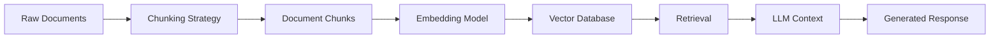
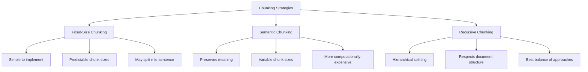
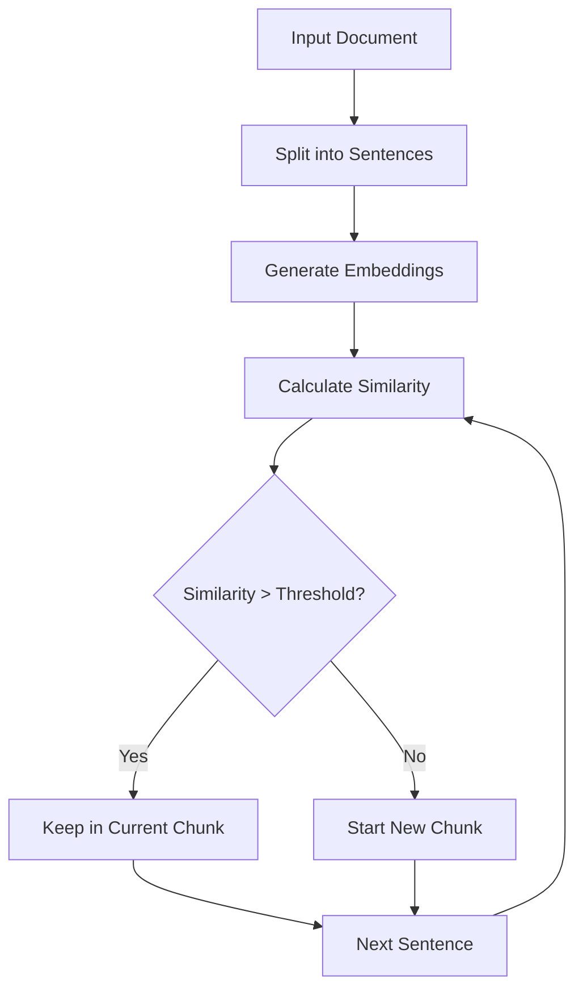
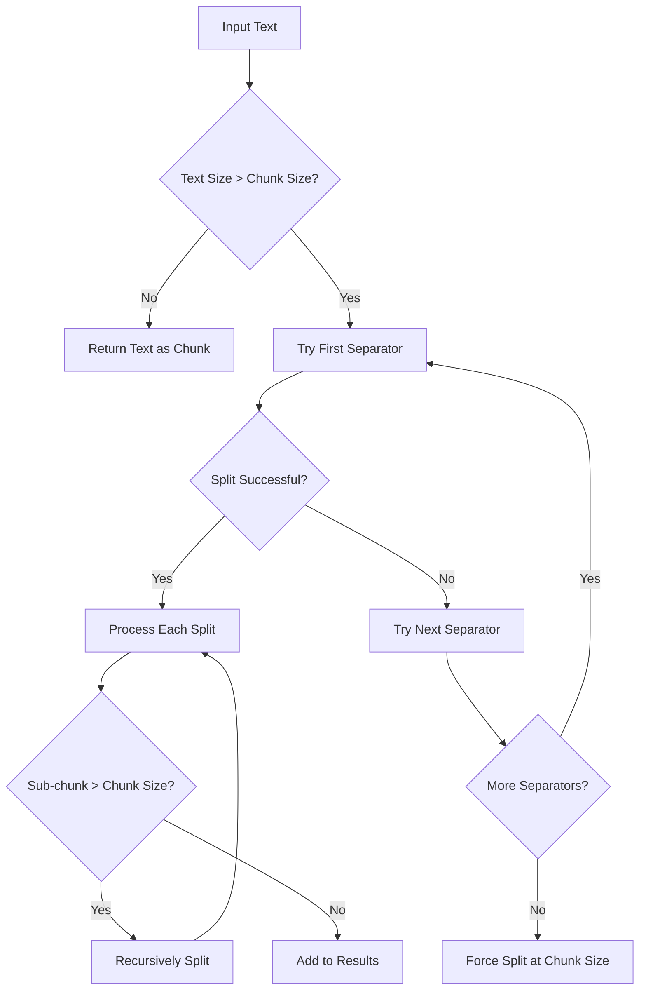
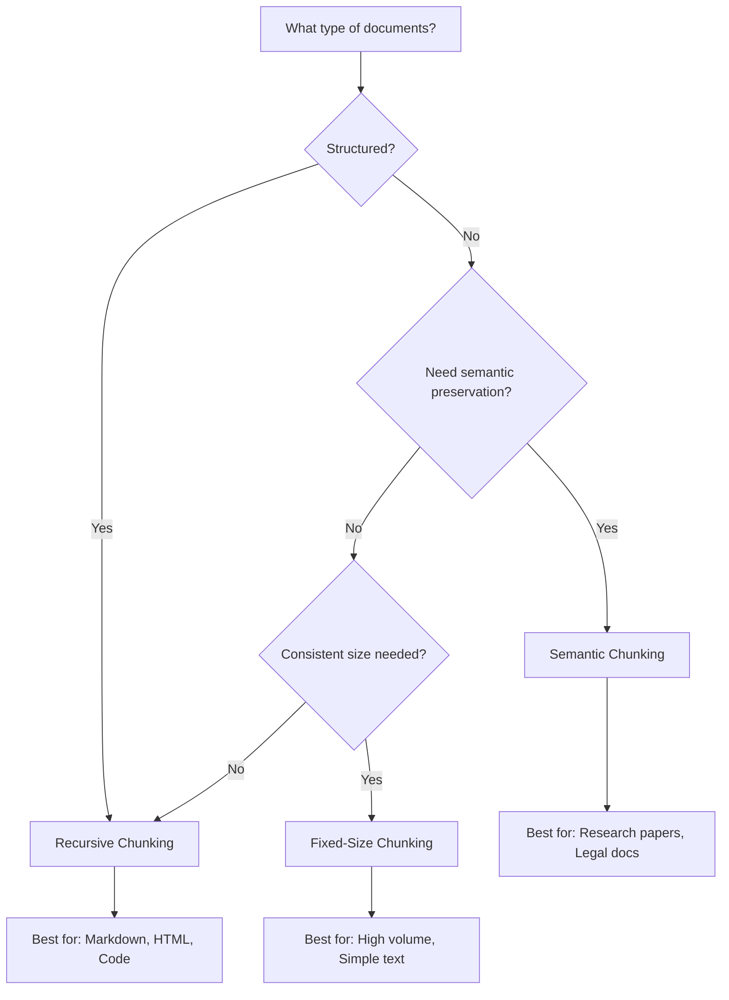

# How to Implement Document Chunking

Author: [nawazdhandala](https://github.com/nawazdhandala)

Tags: RAG, LLM, Document Processing, Vector Search

Description: Learn how to chunk documents effectively for retrieval-augmented generation.

---

Document chunking is a critical step in building effective Retrieval-Augmented Generation (RAG) systems. When you feed documents into a vector database, the way you split them into chunks directly impacts retrieval quality and, ultimately, the quality of your LLM responses. In this guide, we will explore different chunking strategies and provide practical code examples using LangChain.

## Why Document Chunking Matters

RAG systems work by retrieving relevant document chunks and passing them as context to an LLM. If your chunks are too large, you waste context window space and may include irrelevant information. If they are too small, you lose important context and semantic meaning.



## The Three Main Chunking Strategies

There are three primary approaches to document chunking, each with its own strengths and use cases:



---

## 1. Fixed-Size Chunking

Fixed-size chunking is the simplest approach. You split text into chunks of a predetermined number of characters or tokens, with optional overlap between chunks.

### When to Use Fixed-Size Chunking

- When you need predictable chunk sizes for your vector database
- When processing large volumes of similar documents
- When computational resources are limited

### LangChain Implementation

```python
from langchain.text_splitter import CharacterTextSplitter

# Create a fixed-size text splitter
# chunk_size: Maximum number of characters per chunk
# chunk_overlap: Number of characters to overlap between chunks
# separator: Character to split on (empty string splits anywhere)
fixed_splitter = CharacterTextSplitter(
    chunk_size=1000,        # Each chunk will be at most 1000 characters
    chunk_overlap=200,      # 200 characters of overlap between chunks
    separator=""            # Split at any position
)

# Sample document text
document_text = """
Retrieval-Augmented Generation (RAG) is a technique that combines
the power of large language models with external knowledge retrieval.
By grounding responses in retrieved documents, RAG systems can provide
more accurate and up-to-date information than standalone LLMs.

The key components of a RAG system include a document store, an embedding
model, a vector database, and a language model. Each component plays a
crucial role in the overall system performance.
"""

# Split the document into chunks
chunks = fixed_splitter.split_text(document_text)

# Print each chunk with its index and length
for i, chunk in enumerate(chunks):
    print(f"Chunk {i + 1} (length: {len(chunk)} chars):")
    print(chunk)
    print("-" * 50)
```

### Token-Based Fixed-Size Chunking

For more precise control, especially when working with LLMs that have token limits, use token-based splitting:

```python
from langchain.text_splitter import TokenTextSplitter

# Create a token-based splitter
# This ensures chunks fit within model token limits
token_splitter = TokenTextSplitter(
    chunk_size=500,         # Maximum tokens per chunk
    chunk_overlap=50        # Token overlap between chunks
)

# Split document into token-based chunks
token_chunks = token_splitter.split_text(document_text)

# Each chunk is guaranteed to be under the token limit
for i, chunk in enumerate(token_chunks):
    print(f"Token Chunk {i + 1}: {chunk[:100]}...")
```

---

## 2. Semantic Chunking

Semantic chunking splits documents based on meaning rather than arbitrary character counts. This approach preserves the semantic integrity of the content.

### How Semantic Chunking Works



### LangChain Implementation with Semantic Splitting

```python
from langchain_experimental.text_splitter import SemanticChunker
from langchain_openai import OpenAIEmbeddings

# Initialize the embedding model for semantic comparison
# The embeddings are used to measure semantic similarity between sentences
embeddings = OpenAIEmbeddings()

# Create a semantic chunker
# breakpoint_threshold_type: How to determine chunk boundaries
#   - "percentile": Split when similarity drops below a percentile threshold
#   - "standard_deviation": Split based on standard deviation from mean similarity
#   - "interquartile": Split based on interquartile range analysis
semantic_splitter = SemanticChunker(
    embeddings=embeddings,
    breakpoint_threshold_type="percentile",
    breakpoint_threshold_amount=95  # Split at the 95th percentile of similarity drops
)

# Sample document with multiple topics
multi_topic_document = """
Machine learning models require careful preprocessing of input data.
This includes normalization, handling missing values, and feature scaling.
Without proper preprocessing, model performance can suffer significantly.

Natural language processing has evolved rapidly in recent years.
Transformer architectures have revolutionized how we process text.
Models like BERT and GPT have set new benchmarks across many NLP tasks.

Database optimization involves indexing strategies and query planning.
Proper index selection can reduce query time from seconds to milliseconds.
Understanding execution plans is essential for database administrators.
"""

# Split based on semantic boundaries
semantic_chunks = semantic_splitter.split_text(multi_topic_document)

# Each chunk should contain semantically related content
for i, chunk in enumerate(semantic_chunks):
    print(f"Semantic Chunk {i + 1}:")
    print(chunk.strip())
    print("=" * 50)
```

### Custom Semantic Chunking with Sentence Transformers

For more control over the semantic splitting process:

```python
from sentence_transformers import SentenceTransformer
import numpy as np
from typing import List

def semantic_chunk_custom(
    text: str,
    similarity_threshold: float = 0.75,
    min_chunk_size: int = 100
) -> List[str]:
    """
    Custom semantic chunking implementation.

    Args:
        text: The input document text
        similarity_threshold: Minimum cosine similarity to keep sentences together
        min_chunk_size: Minimum characters per chunk

    Returns:
        List of semantically coherent chunks
    """
    # Load the sentence transformer model
    model = SentenceTransformer('all-MiniLM-L6-v2')

    # Split text into sentences
    # Using a simple split for demonstration
    # Consider using NLTK or spaCy for production
    sentences = [s.strip() for s in text.split('.') if s.strip()]

    # Generate embeddings for all sentences
    embeddings = model.encode(sentences)

    # Initialize chunking variables
    chunks = []
    current_chunk = [sentences[0]]
    current_embedding = embeddings[0]

    # Iterate through sentences and group by semantic similarity
    for i in range(1, len(sentences)):
        # Calculate cosine similarity between current chunk and new sentence
        similarity = np.dot(current_embedding, embeddings[i]) / (
            np.linalg.norm(current_embedding) * np.linalg.norm(embeddings[i])
        )

        # Decide whether to add to current chunk or start a new one
        if similarity >= similarity_threshold:
            # Add to current chunk
            current_chunk.append(sentences[i])
            # Update chunk embedding as the mean of all sentence embeddings
            chunk_indices = list(range(i - len(current_chunk) + 1, i + 1))
            current_embedding = np.mean(embeddings[chunk_indices], axis=0)
        else:
            # Save current chunk and start a new one
            chunk_text = '. '.join(current_chunk) + '.'
            if len(chunk_text) >= min_chunk_size:
                chunks.append(chunk_text)
            else:
                # If chunk is too small, merge with next
                current_chunk.append(sentences[i])
                continue

            current_chunk = [sentences[i]]
            current_embedding = embeddings[i]

    # Add the final chunk
    if current_chunk:
        chunks.append('. '.join(current_chunk) + '.')

    return chunks

# Usage example
chunks = semantic_chunk_custom(
    text=multi_topic_document,
    similarity_threshold=0.7,
    min_chunk_size=50
)
```

---

## 3. Recursive Chunking

Recursive chunking is the most sophisticated approach. It attempts to split text using a hierarchy of separators, preserving document structure while ensuring chunks stay within size limits.

### The Recursive Splitting Process



### LangChain Recursive Text Splitter

```python
from langchain.text_splitter import RecursiveCharacterTextSplitter

# Create a recursive text splitter
# The separators are tried in order; earlier separators are preferred
recursive_splitter = RecursiveCharacterTextSplitter(
    chunk_size=500,                 # Target chunk size in characters
    chunk_overlap=100,              # Overlap between chunks
    length_function=len,            # Function to measure chunk length
    separators=[
        "\n\n",     # First, try to split on double newlines (paragraphs)
        "\n",       # Then single newlines
        ". ",       # Then sentences
        ", ",       # Then clauses
        " ",        # Then words
        ""          # Finally, characters (last resort)
    ]
)

# Sample structured document
structured_document = """
# Introduction to RAG Systems

Retrieval-Augmented Generation represents a paradigm shift in how we build
AI applications. By combining retrieval mechanisms with generative models,
we can create systems that are both knowledgeable and creative.

## Key Benefits

RAG systems offer several advantages over traditional approaches:

1. Reduced hallucination through grounding in real documents
2. Easy knowledge updates without model retraining
3. Better source attribution and explainability
4. Cost-effective scaling of knowledge bases

## Implementation Considerations

When building a RAG system, you must consider:

- Chunk size optimization for your use case
- Embedding model selection based on your domain
- Vector database choice for your scale requirements
- Retrieval strategy tuning for precision vs recall

## Conclusion

Effective document chunking is foundational to RAG success. The strategy
you choose should align with your document types and query patterns.
"""

# Split the document recursively
recursive_chunks = recursive_splitter.split_text(structured_document)

# Display the chunks with their characteristics
for i, chunk in enumerate(recursive_chunks):
    print(f"Chunk {i + 1} (length: {len(chunk)} chars):")
    print(chunk)
    print("-" * 60)
```

### Advanced Recursive Chunking with Metadata

For production systems, you often need to track chunk metadata:

```python
from langchain.text_splitter import RecursiveCharacterTextSplitter
from langchain.schema import Document

# Create splitter with document handling
recursive_splitter = RecursiveCharacterTextSplitter(
    chunk_size=500,
    chunk_overlap=100,
    add_start_index=True  # Track where each chunk starts in the original document
)

# Create a Document object with metadata
original_doc = Document(
    page_content=structured_document,
    metadata={
        "source": "rag_guide.md",
        "author": "engineering_team",
        "created_at": "2026-01-30",
        "document_type": "technical_guide"
    }
)

# Split while preserving and enriching metadata
split_docs = recursive_splitter.split_documents([original_doc])

# Each chunk inherits the original metadata plus gets chunk-specific info
for i, doc in enumerate(split_docs):
    print(f"Chunk {i + 1}:")
    print(f"  Content: {doc.page_content[:80]}...")
    print(f"  Metadata: {doc.metadata}")
    print()
```

---

## Choosing the Right Strategy

The best chunking strategy depends on your specific use case:



### Strategy Comparison Table

| Strategy | Pros | Cons | Best For |
|----------|------|------|----------|
| Fixed-Size | Fast, predictable, simple | May break mid-sentence | Large-scale processing |
| Semantic | Preserves meaning, coherent chunks | Slower, variable sizes | Quality-critical applications |
| Recursive | Respects structure, balanced approach | More complex setup | Structured documents |

---

## Best Practices for Document Chunking

### 1. Optimize Chunk Size for Your Embedding Model

```python
# Different embedding models have different optimal input lengths
# Here are recommended chunk sizes for common models

CHUNK_SIZE_RECOMMENDATIONS = {
    "text-embedding-ada-002": 500,      # OpenAI
    "text-embedding-3-small": 512,      # OpenAI
    "text-embedding-3-large": 1024,     # OpenAI
    "all-MiniLM-L6-v2": 256,            # Sentence Transformers
    "all-mpnet-base-v2": 384,           # Sentence Transformers
    "e5-large-v2": 512,                 # Microsoft
}

def create_optimal_splitter(embedding_model: str) -> RecursiveCharacterTextSplitter:
    """
    Create a splitter optimized for a specific embedding model.

    Args:
        embedding_model: Name of the embedding model to optimize for

    Returns:
        Configured RecursiveCharacterTextSplitter
    """
    chunk_size = CHUNK_SIZE_RECOMMENDATIONS.get(embedding_model, 500)

    # Overlap should typically be 10-20% of chunk size
    chunk_overlap = int(chunk_size * 0.15)

    return RecursiveCharacterTextSplitter(
        chunk_size=chunk_size,
        chunk_overlap=chunk_overlap,
        separators=["\n\n", "\n", ". ", ", ", " ", ""]
    )
```

### 2. Handle Different Document Types

```python
from langchain.text_splitter import (
    RecursiveCharacterTextSplitter,
    MarkdownTextSplitter,
    Language
)

def get_splitter_for_document_type(doc_type: str):
    """
    Return the appropriate splitter for a given document type.

    Args:
        doc_type: File extension or document type identifier

    Returns:
        Configured text splitter for that document type
    """
    # Map document types to appropriate splitters
    splitters = {
        # Markdown documents
        "md": MarkdownTextSplitter(
            chunk_size=1000,
            chunk_overlap=100
        ),

        # Python code
        "py": RecursiveCharacterTextSplitter.from_language(
            language=Language.PYTHON,
            chunk_size=1000,
            chunk_overlap=100
        ),

        # JavaScript and TypeScript
        "js": RecursiveCharacterTextSplitter.from_language(
            language=Language.JS,
            chunk_size=1000,
            chunk_overlap=100
        ),

        # HTML documents
        "html": RecursiveCharacterTextSplitter.from_language(
            language=Language.HTML,
            chunk_size=1000,
            chunk_overlap=100
        ),

        # Default for plain text
        "txt": RecursiveCharacterTextSplitter(
            chunk_size=1000,
            chunk_overlap=100
        )
    }

    return splitters.get(doc_type, splitters["txt"])

# Usage
python_splitter = get_splitter_for_document_type("py")
markdown_splitter = get_splitter_for_document_type("md")
```

### 3. Add Contextual Information to Chunks

```python
from langchain.schema import Document
from typing import List

def add_context_to_chunks(
    chunks: List[Document],
    document_title: str,
    include_neighbors: bool = True
) -> List[Document]:
    """
    Enrich chunks with contextual information for better retrieval.

    Args:
        chunks: List of document chunks
        document_title: Title of the source document
        include_neighbors: Whether to include references to neighboring chunks

    Returns:
        Enriched document chunks
    """
    enriched_chunks = []

    for i, chunk in enumerate(chunks):
        # Create enhanced metadata
        enhanced_metadata = {
            **chunk.metadata,
            "document_title": document_title,
            "chunk_index": i,
            "total_chunks": len(chunks),
            "is_first_chunk": i == 0,
            "is_last_chunk": i == len(chunks) - 1
        }

        # Optionally add neighbor context
        if include_neighbors:
            if i > 0:
                enhanced_metadata["previous_chunk_preview"] = chunks[i - 1].page_content[:100]
            if i < len(chunks) - 1:
                enhanced_metadata["next_chunk_preview"] = chunks[i + 1].page_content[:100]

        # Create enhanced content with document context
        enhanced_content = f"[From: {document_title}]\n\n{chunk.page_content}"

        enriched_chunks.append(Document(
            page_content=enhanced_content,
            metadata=enhanced_metadata
        ))

    return enriched_chunks
```

---

## Complete Example: Building a Production Chunking Pipeline

Here is a complete example that combines all the concepts:

```python
from langchain.text_splitter import RecursiveCharacterTextSplitter
from langchain.schema import Document
from langchain_openai import OpenAIEmbeddings
from typing import List, Dict, Any
import hashlib

class DocumentChunker:
    """
    Production-ready document chunking pipeline for RAG systems.
    """

    def __init__(
        self,
        chunk_size: int = 500,
        chunk_overlap: int = 100,
        embedding_model: str = "text-embedding-3-small"
    ):
        """
        Initialize the document chunker.

        Args:
            chunk_size: Target size for each chunk
            chunk_overlap: Number of characters to overlap
            embedding_model: Name of the embedding model to use
        """
        self.chunk_size = chunk_size
        self.chunk_overlap = chunk_overlap
        self.embedding_model = embedding_model

        # Initialize the text splitter
        self.splitter = RecursiveCharacterTextSplitter(
            chunk_size=chunk_size,
            chunk_overlap=chunk_overlap,
            length_function=len,
            separators=["\n\n", "\n", ". ", ", ", " ", ""],
            add_start_index=True
        )

        # Initialize embeddings
        self.embeddings = OpenAIEmbeddings(model=embedding_model)

    def chunk_document(
        self,
        content: str,
        metadata: Dict[str, Any]
    ) -> List[Document]:
        """
        Chunk a document and enrich with metadata.

        Args:
            content: The document text content
            metadata: Document-level metadata

        Returns:
            List of chunked documents with enriched metadata
        """
        # Create the source document
        source_doc = Document(
            page_content=content,
            metadata=metadata
        )

        # Split into chunks
        chunks = self.splitter.split_documents([source_doc])

        # Enrich each chunk with additional metadata
        enriched_chunks = []
        for i, chunk in enumerate(chunks):
            # Generate a unique ID for this chunk
            chunk_id = self._generate_chunk_id(
                metadata.get("source", "unknown"),
                i
            )

            # Add chunk-specific metadata
            chunk.metadata.update({
                "chunk_id": chunk_id,
                "chunk_index": i,
                "total_chunks": len(chunks),
                "chunk_size": len(chunk.page_content),
                "chunking_config": {
                    "strategy": "recursive",
                    "target_size": self.chunk_size,
                    "overlap": self.chunk_overlap
                }
            })

            enriched_chunks.append(chunk)

        return enriched_chunks

    def _generate_chunk_id(self, source: str, index: int) -> str:
        """
        Generate a deterministic unique ID for a chunk.

        Args:
            source: Source document identifier
            index: Chunk index within the document

        Returns:
            Unique chunk identifier
        """
        content = f"{source}:chunk:{index}"
        return hashlib.md5(content.encode()).hexdigest()[:12]

    def chunk_and_embed(
        self,
        content: str,
        metadata: Dict[str, Any]
    ) -> List[Dict[str, Any]]:
        """
        Chunk a document and generate embeddings for each chunk.

        Args:
            content: The document text content
            metadata: Document-level metadata

        Returns:
            List of dictionaries containing chunks and their embeddings
        """
        # Get chunks
        chunks = self.chunk_document(content, metadata)

        # Generate embeddings for all chunks
        texts = [chunk.page_content for chunk in chunks]
        embeddings = self.embeddings.embed_documents(texts)

        # Combine chunks with embeddings
        results = []
        for chunk, embedding in zip(chunks, embeddings):
            results.append({
                "id": chunk.metadata["chunk_id"],
                "content": chunk.page_content,
                "metadata": chunk.metadata,
                "embedding": embedding
            })

        return results


# Usage example
if __name__ == "__main__":
    # Initialize the chunker
    chunker = DocumentChunker(
        chunk_size=500,
        chunk_overlap=100
    )

    # Sample document
    document_content = """
    Your long document content goes here...
    This can be any text you want to chunk for RAG.
    """

    document_metadata = {
        "source": "user_guide.md",
        "title": "User Guide",
        "author": "Engineering Team",
        "version": "1.0"
    }

    # Chunk the document
    chunks = chunker.chunk_document(document_content, document_metadata)

    print(f"Created {len(chunks)} chunks")
    for chunk in chunks:
        print(f"  Chunk {chunk.metadata['chunk_index']}: {len(chunk.page_content)} chars")
```

---

## Common Pitfalls to Avoid

1. **Ignoring document structure**: Always consider the natural structure of your documents before choosing a chunking strategy.

2. **Too much or too little overlap**: Too much overlap wastes storage and computation; too little can lose context at boundaries.

3. **Not considering the embedding model**: Different models have different optimal input lengths.

4. **Forgetting metadata**: Always preserve source information and chunk position for debugging and citation.

5. **One-size-fits-all approach**: Different document types often need different chunking strategies.

---

## Summary

| You Want To Know | Use This Strategy |
|------------------|-------------------|
| Simple, fast chunking | Fixed-Size |
| Preserve semantic meaning | Semantic |
| Handle structured documents | Recursive |
| Process code files | Language-aware Recursive |
| Mix of document types | Document-type-specific splitters |

Effective document chunking forms the foundation of any successful RAG system. Start with recursive chunking as your default, experiment with chunk sizes based on your embedding model, and always preserve metadata for debugging and attribution. The right chunking strategy can significantly improve retrieval quality and, ultimately, the usefulness of your RAG application.

---

*Building a RAG system and need observability? Monitor your LLM applications with [OneUptime](https://oneuptime.com) for real-time insights into performance, errors, and usage patterns.*
