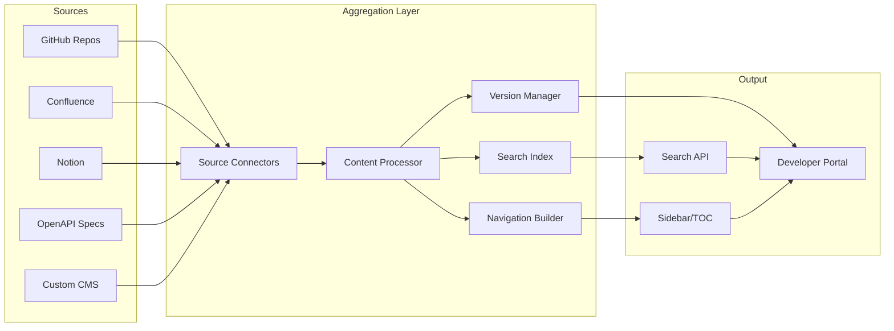
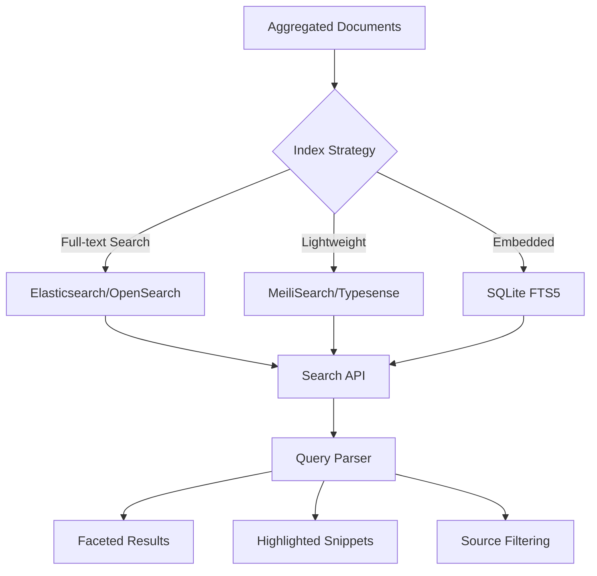
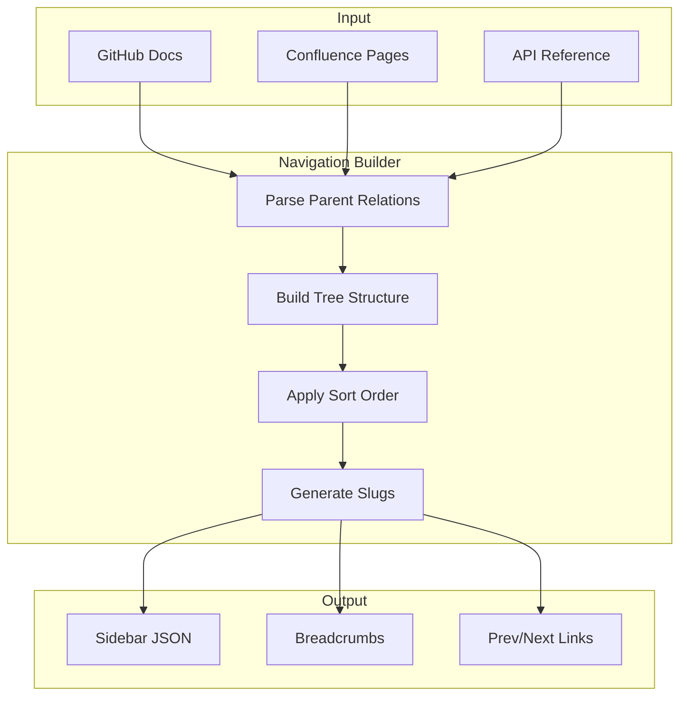
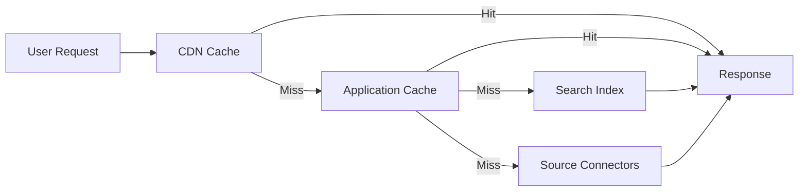

# How to Build Documentation Aggregation

Author: [nawazdhandala](https://github.com/nawazdhandala)

Tags: Platform Engineering, Documentation, Developer Portal, Knowledge Management

Description: Learn to implement documentation aggregation for developer portals with multi-source indexing, search, and unified navigation for centralized knowledge.

---

Documentation sprawl is the silent killer of developer productivity. Your API docs live in Swagger, runbooks in Confluence, architecture decisions in GitHub, and onboarding guides in Notion. Engineers waste hours hunting through tabs, Slack threads, and tribal knowledge to find answers that should be one search away.

A documentation aggregation layer solves this by pulling content from disparate sources into a unified portal with consistent navigation, cross-source search, and version awareness. This guide walks through building one from scratch.

## Architecture Overview

A documentation aggregation system has five core components:



The aggregation layer is the brain. It connects to sources, normalizes content, indexes for search, builds navigation trees, and handles versioning - all while presenting a single unified interface to developers.

## Building Source Connectors

Each documentation source needs a connector that handles authentication, fetching, and format normalization. The goal is to output a common document structure regardless of where content originates.

### Common Document Interface

Start by defining what a normalized document looks like:

```typescript
interface AggregatedDocument {
  id: string;
  source: string;
  sourcePath: string;
  title: string;
  content: string;
  contentType: 'markdown' | 'html' | 'openapi';
  metadata: {
    authors: string[];
    lastModified: Date;
    version?: string;
    tags: string[];
  };
  navigation: {
    parent?: string;
    order: number;
    slug: string;
  };
}

interface SourceConnector {
  name: string;
  fetch(): Promise<AggregatedDocument[]>;
  watch?(callback: (doc: AggregatedDocument) => void): void;
}
```

### GitHub Connector

The GitHub connector pulls markdown files from repositories. It can watch for changes via webhooks or poll on a schedule.

```typescript
import { Octokit } from '@octokit/rest';

class GitHubConnector implements SourceConnector {
  name = 'github';
  private octokit: Octokit;
  private repos: Array<{ owner: string; repo: string; path: string; branch: string }>;

  constructor(token: string, repos: typeof this.repos) {
    this.octokit = new Octokit({ auth: token });
    this.repos = repos;
  }

  async fetch(): Promise<AggregatedDocument[]> {
    const documents: AggregatedDocument[] = [];

    for (const { owner, repo, path, branch } of this.repos) {
      const files = await this.fetchDirectory(owner, repo, path, branch);

      for (const file of files) {
        if (!file.name.endsWith('.md')) continue;

        const content = await this.fetchFileContent(owner, repo, file.path, branch);
        const parsed = this.parseMarkdown(content);

        documents.push({
          id: `github:${owner}/${repo}:${file.path}`,
          source: 'github',
          sourcePath: `https://github.com/${owner}/${repo}/blob/${branch}/${file.path}`,
          title: parsed.title,
          content: parsed.body,
          contentType: 'markdown',
          metadata: {
            authors: await this.getFileAuthors(owner, repo, file.path),
            lastModified: new Date(file.sha), // Use commit date in production
            tags: parsed.frontmatter.tags || [],
          },
          navigation: {
            parent: this.extractParent(file.path),
            order: parsed.frontmatter.order || 999,
            slug: this.pathToSlug(file.path),
          },
        });
      }
    }

    return documents;
  }

  private async fetchDirectory(owner: string, repo: string, path: string, branch: string) {
    const { data } = await this.octokit.repos.getContent({
      owner,
      repo,
      path,
      ref: branch,
    });
    return Array.isArray(data) ? data : [data];
  }

  private async fetchFileContent(owner: string, repo: string, path: string, branch: string) {
    const { data } = await this.octokit.repos.getContent({
      owner,
      repo,
      path,
      ref: branch,
    });

    if ('content' in data) {
      return Buffer.from(data.content, 'base64').toString('utf-8');
    }
    throw new Error('Not a file');
  }

  private parseMarkdown(content: string) {
    // Extract frontmatter and body
    const frontmatterMatch = content.match(/^---\n([\s\S]*?)\n---\n([\s\S]*)$/);
    if (frontmatterMatch) {
      const frontmatter = this.parseFrontmatter(frontmatterMatch[1]);
      const body = frontmatterMatch[2];
      const titleMatch = body.match(/^#\s+(.+)$/m);
      return {
        frontmatter,
        title: frontmatter.title || titleMatch?.[1] || 'Untitled',
        body,
      };
    }
    const titleMatch = content.match(/^#\s+(.+)$/m);
    return {
      frontmatter: {},
      title: titleMatch?.[1] || 'Untitled',
      body: content,
    };
  }

  private parseFrontmatter(raw: string): Record<string, any> {
    const result: Record<string, any> = {};
    for (const line of raw.split('\n')) {
      const [key, ...valueParts] = line.split(':');
      if (key && valueParts.length) {
        result[key.trim()] = valueParts.join(':').trim();
      }
    }
    return result;
  }

  private async getFileAuthors(owner: string, repo: string, path: string): Promise<string[]> {
    const { data } = await this.octokit.repos.listCommits({
      owner,
      repo,
      path,
      per_page: 10,
    });
    const authors = new Set(data.map(c => c.commit.author?.name).filter(Boolean));
    return Array.from(authors) as string[];
  }

  private extractParent(path: string): string | undefined {
    const parts = path.split('/');
    return parts.length > 1 ? parts.slice(0, -1).join('/') : undefined;
  }

  private pathToSlug(path: string): string {
    return path
      .replace(/\.md$/, '')
      .replace(/\//g, '-')
      .toLowerCase();
  }
}
```

### Confluence Connector

Confluence uses a REST API. The connector fetches spaces and pages, converting Confluence's storage format to markdown.

```typescript
import TurndownService from 'turndown';

class ConfluenceConnector implements SourceConnector {
  name = 'confluence';
  private baseUrl: string;
  private auth: string;
  private spaces: string[];
  private turndown: TurndownService;

  constructor(baseUrl: string, email: string, apiToken: string, spaces: string[]) {
    this.baseUrl = baseUrl;
    this.auth = Buffer.from(`${email}:${apiToken}`).toString('base64');
    this.spaces = spaces;
    this.turndown = new TurndownService({
      headingStyle: 'atx',
      codeBlockStyle: 'fenced',
    });
  }

  async fetch(): Promise<AggregatedDocument[]> {
    const documents: AggregatedDocument[] = [];

    for (const spaceKey of this.spaces) {
      const pages = await this.fetchSpacePages(spaceKey);

      for (const page of pages) {
        const fullPage = await this.fetchPage(page.id);
        const markdown = this.turndown.turndown(fullPage.body.storage.value);

        documents.push({
          id: `confluence:${spaceKey}:${page.id}`,
          source: 'confluence',
          sourcePath: `${this.baseUrl}/wiki/spaces/${spaceKey}/pages/${page.id}`,
          title: page.title,
          content: markdown,
          contentType: 'markdown',
          metadata: {
            authors: [fullPage.version.by.displayName],
            lastModified: new Date(fullPage.version.when),
            tags: fullPage.metadata?.labels?.results?.map((l: any) => l.name) || [],
          },
          navigation: {
            parent: page.ancestors?.[0]?.id ? `confluence:${spaceKey}:${page.ancestors[0].id}` : undefined,
            order: page.position || 999,
            slug: this.titleToSlug(page.title),
          },
        });
      }
    }

    return documents;
  }

  private async fetchSpacePages(spaceKey: string): Promise<any[]> {
    const pages: any[] = [];
    let start = 0;
    const limit = 50;

    while (true) {
      const response = await fetch(
        `${this.baseUrl}/wiki/rest/api/content?spaceKey=${spaceKey}&type=page&start=${start}&limit=${limit}&expand=ancestors`,
        { headers: { Authorization: `Basic ${this.auth}` } }
      );
      const data = await response.json();
      pages.push(...data.results);

      if (data.results.length < limit) break;
      start += limit;
    }

    return pages;
  }

  private async fetchPage(pageId: string): Promise<any> {
    const response = await fetch(
      `${this.baseUrl}/wiki/rest/api/content/${pageId}?expand=body.storage,version,metadata.labels`,
      { headers: { Authorization: `Basic ${this.auth}` } }
    );
    return response.json();
  }

  private titleToSlug(title: string): string {
    return title
      .toLowerCase()
      .replace(/[^a-z0-9]+/g, '-')
      .replace(/^-|-$/g, '');
  }
}
```

### OpenAPI Connector

API reference documentation often lives in OpenAPI specs. This connector converts specs into browsable documentation.

```typescript
import SwaggerParser from '@apidevtools/swagger-parser';
import { OpenAPI } from 'openapi-types';

class OpenAPIConnector implements SourceConnector {
  name = 'openapi';
  private specs: Array<{ name: string; url: string; version?: string }>;

  constructor(specs: typeof this.specs) {
    this.specs = specs;
  }

  async fetch(): Promise<AggregatedDocument[]> {
    const documents: AggregatedDocument[] = [];

    for (const { name, url, version } of this.specs) {
      const spec = await SwaggerParser.dereference(url) as OpenAPI.Document;

      // Create overview document
      documents.push({
        id: `openapi:${name}:overview`,
        source: 'openapi',
        sourcePath: url,
        title: `${spec.info.title} - API Reference`,
        content: this.generateOverview(spec),
        contentType: 'markdown',
        metadata: {
          authors: spec.info.contact?.name ? [spec.info.contact.name] : [],
          lastModified: new Date(),
          version: spec.info.version,
          tags: ['api', 'reference'],
        },
        navigation: {
          order: 0,
          slug: `api-${name}`,
        },
      });

      // Create document per endpoint
      if ('paths' in spec && spec.paths) {
        for (const [path, methods] of Object.entries(spec.paths)) {
          for (const [method, operation] of Object.entries(methods || {})) {
            if (['get', 'post', 'put', 'patch', 'delete'].includes(method)) {
              const op = operation as OpenAPI.Operation;
              documents.push({
                id: `openapi:${name}:${method}:${path}`,
                source: 'openapi',
                sourcePath: url,
                title: op.summary || `${method.toUpperCase()} ${path}`,
                content: this.generateEndpointDoc(method, path, op),
                contentType: 'markdown',
                metadata: {
                  authors: [],
                  lastModified: new Date(),
                  version: spec.info.version,
                  tags: op.tags || ['api'],
                },
                navigation: {
                  parent: `openapi:${name}:overview`,
                  order: this.getOperationOrder(method),
                  slug: `api-${name}-${method}-${path.replace(/[^a-z0-9]/gi, '-')}`,
                },
              });
            }
          }
        }
      }
    }

    return documents;
  }

  private generateOverview(spec: OpenAPI.Document): string {
    return `# ${spec.info.title}

${spec.info.description || ''}

**Version:** ${spec.info.version}

${spec.info.contact ? `**Contact:** ${spec.info.contact.name} <${spec.info.contact.email}>` : ''}

## Authentication

${this.describeAuth(spec)}

## Base URL

\`${'servers' in spec ? spec.servers?.[0]?.url : 'https://api.example.com'}\`
`;
  }

  private generateEndpointDoc(method: string, path: string, op: OpenAPI.Operation): string {
    return `# ${op.summary || `${method.toUpperCase()} ${path}`}

${op.description || ''}

## Request

\`\`\`
${method.toUpperCase()} ${path}
\`\`\`

${this.describeParameters(op)}

${this.describeRequestBody(op)}

## Responses

${this.describeResponses(op)}
`;
  }

  private describeAuth(spec: OpenAPI.Document): string {
    // Simplified - expand based on securitySchemes
    return 'See the authentication section for details on API keys and tokens.';
  }

  private describeParameters(op: OpenAPI.Operation): string {
    if (!op.parameters?.length) return '';

    let md = '### Parameters\n\n| Name | In | Type | Required | Description |\n|------|-----|------|----------|-------------|\n';
    for (const param of op.parameters) {
      if ('name' in param) {
        md += `| ${param.name} | ${param.in} | ${(param as any).schema?.type || 'string'} | ${param.required ? 'Yes' : 'No'} | ${param.description || '-'} |\n`;
      }
    }
    return md;
  }

  private describeRequestBody(op: OpenAPI.Operation): string {
    if (!('requestBody' in op) || !op.requestBody) return '';
    return '### Request Body\n\nSee schema in the full specification.';
  }

  private describeResponses(op: OpenAPI.Operation): string {
    if (!op.responses) return '';

    let md = '';
    for (const [code, response] of Object.entries(op.responses)) {
      md += `### ${code}\n\n${(response as any).description || 'No description'}\n\n`;
    }
    return md;
  }

  private getOperationOrder(method: string): number {
    const order: Record<string, number> = { get: 1, post: 2, put: 3, patch: 4, delete: 5 };
    return order[method] || 99;
  }
}
```

## Content Indexing for Search

Once documents are fetched and normalized, they need to be indexed for search. You have two main options: a dedicated search engine or an embedded solution.

### Search Architecture



### MeiliSearch Implementation

MeiliSearch offers a great balance between features and operational simplicity. Here is how to set up indexing:

```typescript
import { MeiliSearch, Index } from 'meilisearch';

class SearchIndexer {
  private client: MeiliSearch;
  private index: Index;

  constructor(host: string, apiKey: string) {
    this.client = new MeiliSearch({ host, apiKey });
    this.index = this.client.index('documentation');
  }

  async initialize() {
    // Configure searchable and filterable attributes
    await this.index.updateSettings({
      searchableAttributes: [
        'title',
        'content',
        'metadata.tags',
      ],
      filterableAttributes: [
        'source',
        'metadata.tags',
        'metadata.version',
      ],
      sortableAttributes: [
        'metadata.lastModified',
        'navigation.order',
      ],
      rankingRules: [
        'words',
        'typo',
        'proximity',
        'attribute',
        'sort',
        'exactness',
      ],
    });
  }

  async indexDocuments(documents: AggregatedDocument[]) {
    // Transform documents for indexing
    const searchDocs = documents.map(doc => ({
      id: doc.id,
      title: doc.title,
      content: this.stripMarkdown(doc.content),
      source: doc.source,
      sourcePath: doc.sourcePath,
      slug: doc.navigation.slug,
      metadata: {
        tags: doc.metadata.tags,
        version: doc.metadata.version,
        lastModified: doc.metadata.lastModified.toISOString(),
      },
    }));

    await this.index.addDocuments(searchDocs, { primaryKey: 'id' });
  }

  async search(query: string, options: SearchOptions = {}): Promise<SearchResult> {
    const { source, tags, version, limit = 20, offset = 0 } = options;

    const filters: string[] = [];
    if (source) filters.push(`source = "${source}"`);
    if (tags?.length) filters.push(`metadata.tags IN [${tags.map(t => `"${t}"`).join(', ')}]`);
    if (version) filters.push(`metadata.version = "${version}"`);

    const result = await this.index.search(query, {
      limit,
      offset,
      filter: filters.length ? filters.join(' AND ') : undefined,
      attributesToHighlight: ['title', 'content'],
      highlightPreTag: '<mark>',
      highlightPostTag: '</mark>',
      attributesToCrop: ['content'],
      cropLength: 200,
    });

    return {
      hits: result.hits.map(hit => ({
        id: hit.id as string,
        title: hit._formatted?.title || hit.title,
        snippet: hit._formatted?.content || hit.content,
        source: hit.source as string,
        slug: hit.slug as string,
        score: hit._score,
      })),
      total: result.estimatedTotalHits || 0,
      query,
    };
  }

  private stripMarkdown(content: string): string {
    return content
      .replace(/```[\s\S]*?```/g, '') // Remove code blocks
      .replace(/`[^`]+`/g, '') // Remove inline code
      .replace(/\[([^\]]+)\]\([^)]+\)/g, '$1') // Links to text
      .replace(/[#*_~]/g, '') // Remove formatting chars
      .replace(/\n+/g, ' ') // Collapse newlines
      .trim();
  }
}

interface SearchOptions {
  source?: string;
  tags?: string[];
  version?: string;
  limit?: number;
  offset?: number;
}

interface SearchResult {
  hits: Array<{
    id: string;
    title: string;
    snippet: string;
    source: string;
    slug: string;
    score?: number;
  }>;
  total: number;
  query: string;
}
```

## Version Management

Documentation versioning is critical for APIs and SDKs where users may be on different releases. The version manager tracks which documents belong to which versions and handles navigation between them.

```typescript
interface VersionedContent {
  version: string;
  isLatest: boolean;
  releaseDate: Date;
  documents: AggregatedDocument[];
}

class VersionManager {
  private versions: Map<string, VersionedContent> = new Map();
  private latestVersion: string | null = null;

  registerVersion(version: string, releaseDate: Date, isLatest: boolean = false) {
    this.versions.set(version, {
      version,
      isLatest,
      releaseDate,
      documents: [],
    });

    if (isLatest) {
      this.latestVersion = version;
    }
  }

  addDocument(version: string, document: AggregatedDocument) {
    const versionContent = this.versions.get(version);
    if (!versionContent) {
      throw new Error(`Version ${version} not registered`);
    }
    versionContent.documents.push({
      ...document,
      metadata: { ...document.metadata, version },
    });
  }

  getVersions(): string[] {
    return Array.from(this.versions.keys()).sort((a, b) => {
      const vA = this.versions.get(a)!;
      const vB = this.versions.get(b)!;
      return vB.releaseDate.getTime() - vA.releaseDate.getTime();
    });
  }

  getDocumentsForVersion(version: string): AggregatedDocument[] {
    if (version === 'latest' && this.latestVersion) {
      return this.versions.get(this.latestVersion)?.documents || [];
    }
    return this.versions.get(version)?.documents || [];
  }

  findDocumentAcrossVersions(slug: string): Map<string, AggregatedDocument> {
    const results = new Map<string, AggregatedDocument>();

    for (const [version, content] of this.versions) {
      const doc = content.documents.find(d => d.navigation.slug === slug);
      if (doc) {
        results.set(version, doc);
      }
    }

    return results;
  }

  generateVersionSwitcher(currentSlug: string, currentVersion: string): VersionSwitcherData {
    const documentVersions = this.findDocumentAcrossVersions(currentSlug);

    return {
      currentVersion,
      availableVersions: this.getVersions().map(v => ({
        version: v,
        isLatest: this.versions.get(v)!.isLatest,
        hasDocument: documentVersions.has(v),
        url: documentVersions.has(v)
          ? `/docs/${v}/${currentSlug}`
          : `/docs/${v}`,
      })),
    };
  }
}

interface VersionSwitcherData {
  currentVersion: string;
  availableVersions: Array<{
    version: string;
    isLatest: boolean;
    hasDocument: boolean;
    url: string;
  }>;
}
```

## Navigation Generation

A unified sidebar that spans all sources requires building a tree structure from flat documents. The navigation builder creates this tree and handles ordering.



```typescript
interface NavNode {
  id: string;
  title: string;
  slug: string;
  source: string;
  order: number;
  children: NavNode[];
}

class NavigationBuilder {
  buildTree(documents: AggregatedDocument[]): NavNode[] {
    const nodeMap = new Map<string, NavNode>();
    const rootNodes: NavNode[] = [];

    // Create nodes for all documents
    for (const doc of documents) {
      nodeMap.set(doc.id, {
        id: doc.id,
        title: doc.title,
        slug: doc.navigation.slug,
        source: doc.source,
        order: doc.navigation.order,
        children: [],
      });
    }

    // Build parent-child relationships
    for (const doc of documents) {
      const node = nodeMap.get(doc.id)!;

      if (doc.navigation.parent && nodeMap.has(doc.navigation.parent)) {
        const parent = nodeMap.get(doc.navigation.parent)!;
        parent.children.push(node);
      } else {
        rootNodes.push(node);
      }
    }

    // Sort all levels
    const sortNodes = (nodes: NavNode[]): NavNode[] => {
      return nodes
        .sort((a, b) => a.order - b.order)
        .map(node => ({
          ...node,
          children: sortNodes(node.children),
        }));
    };

    return sortNodes(rootNodes);
  }

  generateBreadcrumbs(documents: AggregatedDocument[], currentId: string): Breadcrumb[] {
    const breadcrumbs: Breadcrumb[] = [];
    let current = documents.find(d => d.id === currentId);

    while (current) {
      breadcrumbs.unshift({
        title: current.title,
        slug: current.navigation.slug,
      });

      if (current.navigation.parent) {
        current = documents.find(d => d.id === current!.navigation.parent);
      } else {
        break;
      }
    }

    return breadcrumbs;
  }

  generatePrevNext(tree: NavNode[], currentSlug: string): PrevNextLinks {
    const flatList = this.flattenTree(tree);
    const currentIndex = flatList.findIndex(n => n.slug === currentSlug);

    return {
      prev: currentIndex > 0 ? flatList[currentIndex - 1] : null,
      next: currentIndex < flatList.length - 1 ? flatList[currentIndex + 1] : null,
    };
  }

  private flattenTree(nodes: NavNode[]): NavNode[] {
    const result: NavNode[] = [];

    for (const node of nodes) {
      result.push(node);
      result.push(...this.flattenTree(node.children));
    }

    return result;
  }

  exportSidebar(tree: NavNode[]): SidebarConfig {
    const toSidebarItem = (node: NavNode): SidebarItem => ({
      title: node.title,
      href: `/docs/${node.slug}`,
      source: node.source,
      children: node.children.length > 0
        ? node.children.map(toSidebarItem)
        : undefined,
    });

    return {
      items: tree.map(toSidebarItem),
    };
  }
}

interface Breadcrumb {
  title: string;
  slug: string;
}

interface PrevNextLinks {
  prev: NavNode | null;
  next: NavNode | null;
}

interface SidebarItem {
  title: string;
  href: string;
  source: string;
  children?: SidebarItem[];
}

interface SidebarConfig {
  items: SidebarItem[];
}
```

## Putting It All Together

The aggregator orchestrates all components. It runs on a schedule or reacts to webhooks to keep content fresh.

```typescript
class DocumentationAggregator {
  private connectors: SourceConnector[];
  private indexer: SearchIndexer;
  private versionManager: VersionManager;
  private navBuilder: NavigationBuilder;
  private documents: AggregatedDocument[] = [];

  constructor(
    connectors: SourceConnector[],
    indexer: SearchIndexer,
    versionManager: VersionManager
  ) {
    this.connectors = connectors;
    this.indexer = indexer;
    this.versionManager = versionManager;
    this.navBuilder = new NavigationBuilder();
  }

  async sync() {
    console.log('Starting documentation sync...');
    this.documents = [];

    // Fetch from all sources in parallel
    const results = await Promise.allSettled(
      this.connectors.map(connector => connector.fetch())
    );

    for (let i = 0; i < results.length; i++) {
      const result = results[i];
      const connector = this.connectors[i];

      if (result.status === 'fulfilled') {
        console.log(`Fetched ${result.value.length} documents from ${connector.name}`);
        this.documents.push(...result.value);
      } else {
        console.error(`Failed to fetch from ${connector.name}:`, result.reason);
      }
    }

    // Index for search
    await this.indexer.indexDocuments(this.documents);
    console.log(`Indexed ${this.documents.length} documents`);

    // Register versions and assign documents
    const versionedDocs = this.documents.filter(d => d.metadata.version);
    const unversionedDocs = this.documents.filter(d => !d.metadata.version);

    for (const doc of versionedDocs) {
      this.versionManager.addDocument(doc.metadata.version!, doc);
    }

    // Build navigation
    const navTree = this.navBuilder.buildTree(this.documents);
    const sidebarConfig = this.navBuilder.exportSidebar(navTree);

    return {
      documentCount: this.documents.length,
      sources: [...new Set(this.documents.map(d => d.source))],
      navigation: sidebarConfig,
    };
  }

  async search(query: string, options?: SearchOptions) {
    return this.indexer.search(query, options);
  }

  getDocument(slug: string, version?: string): AggregatedDocument | null {
    if (version) {
      const versionDocs = this.versionManager.getDocumentsForVersion(version);
      return versionDocs.find(d => d.navigation.slug === slug) || null;
    }
    return this.documents.find(d => d.navigation.slug === slug) || null;
  }

  getNavigation(): SidebarConfig {
    const tree = this.navBuilder.buildTree(this.documents);
    return this.navBuilder.exportSidebar(tree);
  }
}
```

## API Endpoints

Expose the aggregator through a simple REST API:

```typescript
import express from 'express';

const app = express();
const aggregator = new DocumentationAggregator(connectors, indexer, versionManager);

// Sync documentation (call on deploy or via webhook)
app.post('/api/docs/sync', async (req, res) => {
  try {
    const result = await aggregator.sync();
    res.json(result);
  } catch (error) {
    res.status(500).json({ error: 'Sync failed' });
  }
});

// Search documentation
app.get('/api/docs/search', async (req, res) => {
  const { q, source, tags, version, limit, offset } = req.query;

  const results = await aggregator.search(q as string, {
    source: source as string,
    tags: tags ? (tags as string).split(',') : undefined,
    version: version as string,
    limit: limit ? parseInt(limit as string) : undefined,
    offset: offset ? parseInt(offset as string) : undefined,
  });

  res.json(results);
});

// Get single document
app.get('/api/docs/:version/:slug', async (req, res) => {
  const { version, slug } = req.params;
  const doc = aggregator.getDocument(slug, version);

  if (!doc) {
    return res.status(404).json({ error: 'Document not found' });
  }

  res.json(doc);
});

// Get navigation sidebar
app.get('/api/docs/navigation', (req, res) => {
  const navigation = aggregator.getNavigation();
  res.json(navigation);
});

// Webhook for GitHub push events
app.post('/api/webhooks/github', express.json(), async (req, res) => {
  const event = req.headers['x-github-event'];

  if (event === 'push') {
    // Trigger async sync
    aggregator.sync().catch(console.error);
  }

  res.status(200).send('OK');
});
```

## Incremental Updates

Full syncs are expensive. For real-time updates, implement incremental indexing:

```typescript
class IncrementalUpdater {
  private aggregator: DocumentationAggregator;
  private indexer: SearchIndexer;

  constructor(aggregator: DocumentationAggregator, indexer: SearchIndexer) {
    this.aggregator = aggregator;
    this.indexer = indexer;
  }

  async handleGitHubWebhook(payload: GitHubPushPayload) {
    const { commits, repository } = payload;

    const modifiedFiles = new Set<string>();
    const deletedFiles = new Set<string>();

    for (const commit of commits) {
      commit.added.forEach(f => modifiedFiles.add(f));
      commit.modified.forEach(f => modifiedFiles.add(f));
      commit.removed.forEach(f => deletedFiles.add(f));
    }

    // Remove deleted documents from index
    for (const file of deletedFiles) {
      if (file.endsWith('.md')) {
        const docId = `github:${repository.full_name}:${file}`;
        await this.indexer.deleteDocument(docId);
      }
    }

    // Re-index modified documents
    for (const file of modifiedFiles) {
      if (file.endsWith('.md')) {
        // Fetch and index single document
        // Implementation depends on your connector setup
      }
    }
  }

  async handleConfluenceWebhook(payload: ConfluenceWebhookPayload) {
    const { page, eventType } = payload;

    if (eventType === 'page_removed') {
      await this.indexer.deleteDocument(`confluence:${page.spaceKey}:${page.id}`);
    } else if (['page_created', 'page_updated'].includes(eventType)) {
      // Re-fetch and index the specific page
    }
  }
}

interface GitHubPushPayload {
  commits: Array<{
    added: string[];
    modified: string[];
    removed: string[];
  }>;
  repository: {
    full_name: string;
  };
}

interface ConfluenceWebhookPayload {
  page: {
    id: string;
    spaceKey: string;
  };
  eventType: string;
}
```

## Caching Strategy

Documentation does not change every second. Cache aggressively at multiple layers:



```typescript
import NodeCache from 'node-cache';

class DocumentCache {
  private cache: NodeCache;

  constructor(ttlSeconds: number = 300) {
    this.cache = new NodeCache({
      stdTTL: ttlSeconds,
      checkperiod: ttlSeconds * 0.2,
      useClones: false,
    });
  }

  async getDocument(
    slug: string,
    version: string,
    fetchFn: () => Promise<AggregatedDocument | null>
  ): Promise<AggregatedDocument | null> {
    const key = `doc:${version}:${slug}`;

    let doc = this.cache.get<AggregatedDocument>(key);
    if (doc !== undefined) {
      return doc;
    }

    doc = await fetchFn();
    if (doc) {
      this.cache.set(key, doc);
    }

    return doc;
  }

  async getNavigation(
    fetchFn: () => Promise<SidebarConfig>
  ): Promise<SidebarConfig> {
    const key = 'navigation';

    let nav = this.cache.get<SidebarConfig>(key);
    if (nav !== undefined) {
      return nav;
    }

    nav = await fetchFn();
    this.cache.set(key, nav);

    return nav;
  }

  invalidate(pattern?: string) {
    if (pattern) {
      const keys = this.cache.keys().filter(k => k.includes(pattern));
      this.cache.del(keys);
    } else {
      this.cache.flushAll();
    }
  }
}
```

## Observability

Track aggregation health with metrics and alerts:

```typescript
import { Counter, Histogram, Gauge } from 'prom-client';

const metrics = {
  syncDuration: new Histogram({
    name: 'docs_sync_duration_seconds',
    help: 'Duration of documentation sync operations',
    labelNames: ['source'],
  }),

  documentsTotal: new Gauge({
    name: 'docs_documents_total',
    help: 'Total number of indexed documents',
    labelNames: ['source'],
  }),

  searchQueries: new Counter({
    name: 'docs_search_queries_total',
    help: 'Total number of search queries',
    labelNames: ['source_filter'],
  }),

  syncErrors: new Counter({
    name: 'docs_sync_errors_total',
    help: 'Total number of sync errors',
    labelNames: ['source', 'error_type'],
  }),
};

// Instrument the aggregator
class InstrumentedAggregator extends DocumentationAggregator {
  async sync() {
    const startTime = Date.now();

    try {
      const result = await super.sync();

      // Record metrics per source
      for (const source of result.sources) {
        const count = this.documents.filter(d => d.source === source).length;
        metrics.documentsTotal.labels(source).set(count);
        metrics.syncDuration.labels(source).observe((Date.now() - startTime) / 1000);
      }

      return result;
    } catch (error) {
      metrics.syncErrors.labels('all', error.name).inc();
      throw error;
    }
  }

  async search(query: string, options?: SearchOptions) {
    metrics.searchQueries.labels(options?.source || 'all').inc();
    return super.search(query, options);
  }
}
```

## Production Checklist

Before deploying your documentation aggregation system:

1. **Rate limiting on source APIs.** GitHub and Confluence have API limits. Implement backoff and respect headers.

2. **Graceful degradation.** If one source fails, serve stale content from cache rather than breaking the entire portal.

3. **Search relevance tuning.** Adjust ranking rules based on user feedback. Titles should rank higher than body content.

4. **Access control.** If some docs are internal-only, implement authentication and filter results based on user roles.

5. **Broken link detection.** Cross-source links can break when documents move. Run a periodic crawler to detect 404s.

6. **Mobile navigation.** Sidebar trees work on desktop but need collapse/expand logic for mobile viewports.

7. **Analytics.** Track which docs are viewed most, which searches return zero results, and where users drop off. This drives content improvements.

## Conclusion

Documentation aggregation transforms scattered knowledge into a unified developer experience. The architecture presented here - source connectors, content normalization, search indexing, versioning, and navigation building - provides the foundation for a portal that scales with your organization.

Start with two or three sources that cause the most pain. Get search working early because it is what developers reach for first. Add versioning only when you ship breaking changes. And instrument everything so you know whether your portal is actually reducing the time developers spend hunting for answers.

The best documentation system is the one engineers actually use. Make it fast, make it searchable, and keep it fresh.
