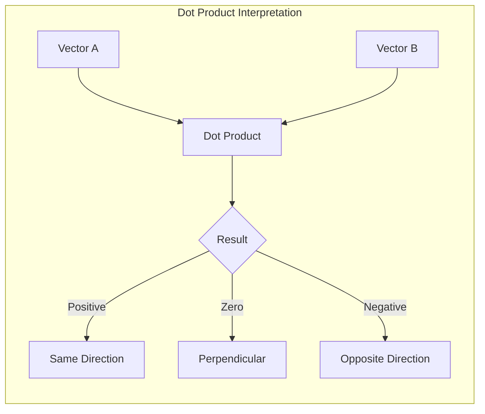
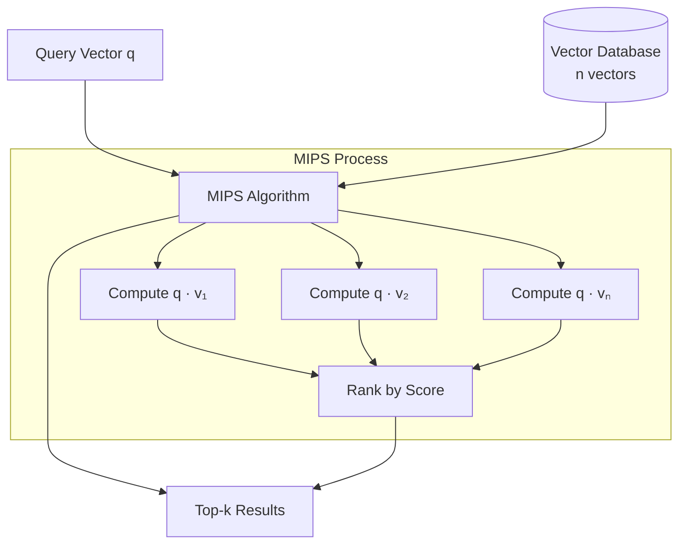
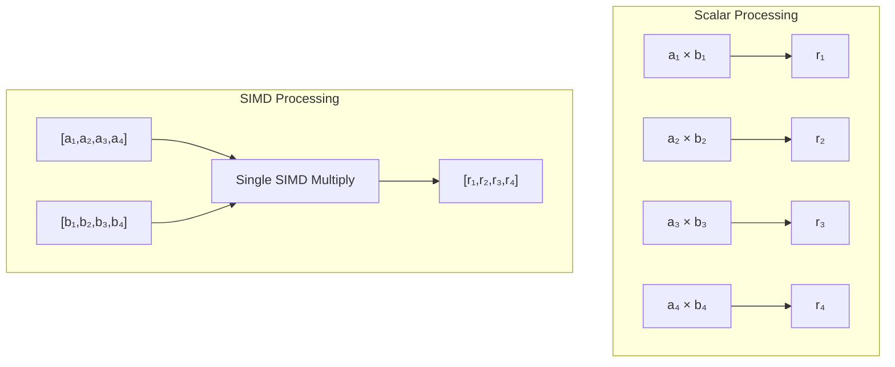
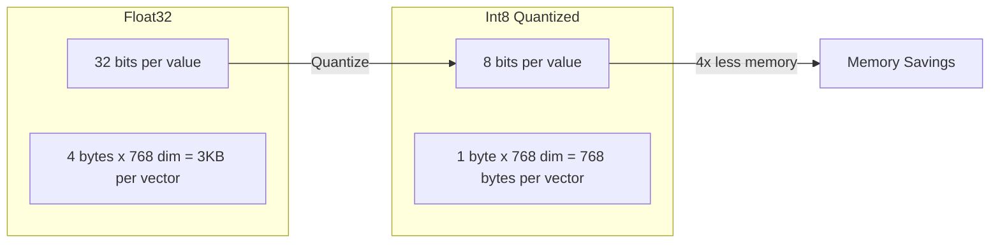
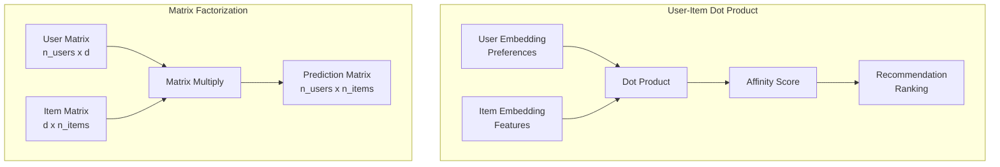
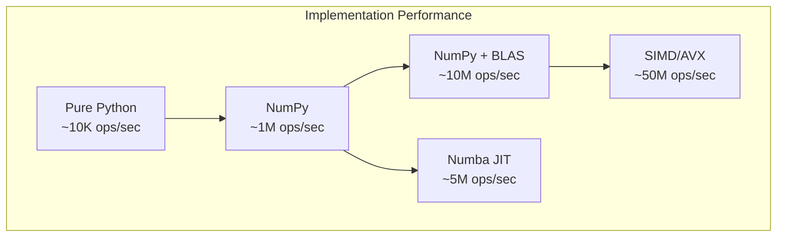

# How to Implement Dot Product

Author: [nawazdhandala](https://github.com/nawazdhandala)

Tags: Vector Search, Dot Product, Machine Learning, Embeddings

Description: Learn to implement dot product similarity for vector search with SIMD optimization, normalization considerations, and maximum inner product search.

---

## Introduction

The dot product is one of the most fundamental operations in vector similarity search. Unlike cosine similarity which measures angular distance, the dot product captures both magnitude and direction - making it essential for applications like recommendation systems, semantic search, and retrieval-augmented generation (RAG).

In this guide, we will explore how to implement dot product similarity from scratch, understand its mathematical foundation, optimize it for production workloads, and apply it to real-world use cases.

## Mathematical Foundation

The dot product (also called inner product or scalar product) of two vectors is defined as the sum of the products of their corresponding components.

For two vectors **a** and **b** of dimension n:

```
a · b = Σ(aᵢ × bᵢ) for i = 1 to n
     = a₁b₁ + a₂b₂ + ... + aₙbₙ
```

### Geometric Interpretation

The dot product has a beautiful geometric interpretation:

```
a · b = ||a|| × ||b|| × cos(θ)
```

Where:
- `||a||` is the magnitude (length) of vector a
- `||b||` is the magnitude of vector b
- `θ` is the angle between the vectors



### Key Properties

| Property | Formula | Description |
|----------|---------|-------------|
| Commutative | a · b = b · a | Order does not matter |
| Distributive | a · (b + c) = a · b + a · c | Distributes over addition |
| Scalar Multiplication | (ka) · b = k(a · b) | Scalars can be factored out |
| Self Dot Product | a · a = \|\|a\|\|² | Equals squared magnitude |

## Basic Implementation

Let us start with a straightforward implementation in Python:

```python
def dot_product_basic(a: list[float], b: list[float]) -> float:
    """
    Calculate the dot product of two vectors.

    Args:
        a: First vector
        b: Second vector

    Returns:
        Scalar dot product value

    Raises:
        ValueError: If vectors have different dimensions
    """
    if len(a) != len(b):
        raise ValueError(f"Vector dimensions must match: {len(a)} != {len(b)}")

    result = 0.0
    for i in range(len(a)):
        result += a[i] * b[i]

    return result


# Example usage
query = [0.5, 0.3, 0.8, 0.1]
document = [0.4, 0.6, 0.2, 0.9]

similarity = dot_product_basic(query, document)
print(f"Dot product similarity: {similarity}")
# Output: Dot product similarity: 0.47
```

### Using NumPy

For better performance with NumPy:

```python
import numpy as np

def dot_product_numpy(a: np.ndarray, b: np.ndarray) -> float:
    """
    Calculate dot product using NumPy's optimized implementation.

    NumPy uses BLAS (Basic Linear Algebra Subprograms) under the hood,
    which provides highly optimized vector operations.
    """
    return np.dot(a, b)


# Alternative using the @ operator (matrix multiplication)
def dot_product_matmul(a: np.ndarray, b: np.ndarray) -> float:
    """Using Python's matrix multiplication operator."""
    return a @ b


# Batch computation for multiple vectors
def batch_dot_product(query: np.ndarray, documents: np.ndarray) -> np.ndarray:
    """
    Compute dot product between a query and multiple document vectors.

    Args:
        query: Shape (d,) - single query vector
        documents: Shape (n, d) - n document vectors

    Returns:
        Shape (n,) - dot product scores for each document
    """
    return documents @ query
```

## Maximum Inner Product Search (MIPS)

Maximum Inner Product Search is the problem of finding the vector in a database that has the highest dot product with a query vector.



### Naive MIPS Implementation

```python
import numpy as np
from typing import List, Tuple

def mips_naive(
    query: np.ndarray,
    database: np.ndarray,
    k: int = 10
) -> Tuple[np.ndarray, np.ndarray]:
    """
    Naive Maximum Inner Product Search.

    Computes dot product with all vectors and returns top-k.
    Time complexity: O(n * d) where n = database size, d = dimension

    Args:
        query: Query vector of shape (d,)
        database: Database vectors of shape (n, d)
        k: Number of top results to return

    Returns:
        Tuple of (indices, scores) for top-k results
    """
    # Compute all dot products at once
    scores = database @ query

    # Get indices of top-k scores
    # Using argpartition for efficiency - O(n) instead of O(n log n)
    if k < len(scores):
        top_k_indices = np.argpartition(scores, -k)[-k:]
        # Sort the top-k by score (descending)
        top_k_indices = top_k_indices[np.argsort(scores[top_k_indices])[::-1]]
    else:
        top_k_indices = np.argsort(scores)[::-1]

    return top_k_indices, scores[top_k_indices]


# Example usage
np.random.seed(42)
d = 128  # dimension
n = 10000  # database size

query = np.random.randn(d).astype(np.float32)
database = np.random.randn(n, d).astype(np.float32)

indices, scores = mips_naive(query, database, k=5)
print(f"Top 5 indices: {indices}")
print(f"Top 5 scores: {scores}")
```

### MIPS to Nearest Neighbor Reduction

An important technique is reducing MIPS to nearest neighbor search, allowing use of existing ANN libraries:

```python
import numpy as np

def mips_to_nn_transform(vectors: np.ndarray) -> Tuple[np.ndarray, float]:
    """
    Transform vectors to enable MIPS via L2 nearest neighbor search.

    The transformation appends an extra dimension to each vector such that
    maximizing inner product becomes equivalent to minimizing L2 distance.

    For vector x, we create x' = [x, sqrt(M² - ||x||²)]
    where M = max(||xᵢ||) for all vectors in database.

    Args:
        vectors: Original vectors of shape (n, d)

    Returns:
        Transformed vectors of shape (n, d+1) and the max norm M
    """
    norms_squared = np.sum(vectors ** 2, axis=1, keepdims=True)
    max_norm_squared = np.max(norms_squared)

    # Ensure numerical stability
    extra_dim = np.sqrt(np.maximum(max_norm_squared - norms_squared, 0))

    transformed = np.hstack([vectors, extra_dim])
    return transformed, np.sqrt(max_norm_squared)


def transform_query_for_mips(query: np.ndarray) -> np.ndarray:
    """
    Transform query vector for MIPS-to-NN reduction.

    Query gets a zero appended: q' = [q, 0]
    """
    return np.append(query, 0)
```

## Normalization Considerations

The relationship between dot product and cosine similarity depends on vector normalization:

```mermaid
flowchart LR
    subgraph "Unnormalized Vectors"
        A1[Vector A] --> DP1[Dot Product]
        B1[Vector B] --> DP1
        DP1 --> R1[Magnitude Matters]
    end

    subgraph "Normalized Vectors"
        A2[Unit Vector A<br/>||A|| = 1] --> DP2[Dot Product]
        B2[Unit Vector B<br/>||B|| = 1] --> DP2
        DP2 --> R2[Equals Cosine Similarity]
    end
```

### When to Normalize

```python
import numpy as np

def normalize_vectors(vectors: np.ndarray, epsilon: float = 1e-10) -> np.ndarray:
    """
    L2 normalize vectors to unit length.

    After normalization: dot_product(a, b) == cosine_similarity(a, b)

    Args:
        vectors: Shape (n, d) or (d,)
        epsilon: Small value to prevent division by zero

    Returns:
        Normalized vectors with ||v|| = 1
    """
    if vectors.ndim == 1:
        norm = np.linalg.norm(vectors)
        return vectors / (norm + epsilon)

    norms = np.linalg.norm(vectors, axis=1, keepdims=True)
    return vectors / (norms + epsilon)


def dot_product_normalized(a: np.ndarray, b: np.ndarray) -> float:
    """
    Compute dot product of normalized vectors.
    This is equivalent to cosine similarity.
    """
    a_norm = normalize_vectors(a)
    b_norm = normalize_vectors(b)
    return np.dot(a_norm, b_norm)
```

### Normalization Decision Guide

| Scenario | Normalize? | Reason |
|----------|------------|--------|
| Semantic similarity | Yes | Only direction matters |
| Recommendation with popularity | No | Magnitude encodes importance |
| Pre-normalized embeddings (OpenAI) | No | Already unit vectors |
| Mixed-magnitude embeddings | Depends | Consider your use case |

## Optimization Techniques

### SIMD Optimization

Single Instruction Multiple Data (SIMD) allows processing multiple elements in parallel:



### C Implementation with AVX

```c
#include <immintrin.h>

float dot_product_avx(const float* a, const float* b, size_t n) {
    /*
     * AVX-optimized dot product using 256-bit vectors.
     * Processes 8 floats per iteration.
     */
    __m256 sum = _mm256_setzero_ps();

    size_t i = 0;
    // Process 8 elements at a time
    for (; i + 8 <= n; i += 8) {
        __m256 va = _mm256_loadu_ps(a + i);
        __m256 vb = _mm256_loadu_ps(b + i);
        sum = _mm256_fmadd_ps(va, vb, sum);  // Fused multiply-add
    }

    // Horizontal sum of the 8 floats in sum
    __m128 hi = _mm256_extractf128_ps(sum, 1);
    __m128 lo = _mm256_castps256_ps128(sum);
    __m128 sum128 = _mm_add_ps(hi, lo);
    sum128 = _mm_hadd_ps(sum128, sum128);
    sum128 = _mm_hadd_ps(sum128, sum128);

    float result = _mm_cvtss_f32(sum128);

    // Handle remaining elements
    for (; i < n; i++) {
        result += a[i] * b[i];
    }

    return result;
}
```

### Python with Numba JIT

```python
from numba import jit, prange
import numpy as np

@jit(nopython=True, fastmath=True, parallel=True)
def dot_product_numba(a: np.ndarray, b: np.ndarray) -> float:
    """
    JIT-compiled dot product with auto-vectorization.

    The fastmath flag allows SIMD optimizations.
    """
    result = 0.0
    for i in prange(len(a)):
        result += a[i] * b[i]
    return result


@jit(nopython=True, fastmath=True, parallel=True)
def batch_dot_products_numba(
    query: np.ndarray,
    database: np.ndarray
) -> np.ndarray:
    """
    Compute dot products between query and all database vectors.
    Parallelized across database vectors.
    """
    n = database.shape[0]
    results = np.empty(n, dtype=np.float32)

    for i in prange(n):
        dot = 0.0
        for j in range(len(query)):
            dot += query[j] * database[i, j]
        results[i] = dot

    return results
```

### Memory Layout Optimization

```python
import numpy as np

def optimize_memory_layout(vectors: np.ndarray) -> np.ndarray:
    """
    Ensure vectors are stored in contiguous, cache-friendly memory.

    Row-major (C-order) is typically faster for dot products
    when iterating over the vector dimension.
    """
    if not vectors.flags['C_CONTIGUOUS']:
        return np.ascontiguousarray(vectors)
    return vectors


def align_vectors(vectors: np.ndarray, alignment: int = 32) -> np.ndarray:
    """
    Align vector memory for optimal SIMD performance.

    AVX requires 32-byte alignment for best performance.
    AVX-512 requires 64-byte alignment.
    """
    # Pad dimension to multiple of alignment / sizeof(float)
    d = vectors.shape[-1]
    float_size = 4  # bytes
    elements_per_block = alignment // float_size

    if d % elements_per_block == 0:
        return vectors

    pad_size = elements_per_block - (d % elements_per_block)

    if vectors.ndim == 1:
        return np.pad(vectors, (0, pad_size))
    else:
        return np.pad(vectors, ((0, 0), (0, pad_size)))
```

## Quantization for Efficiency

Reduce memory and computation with quantization:



```python
import numpy as np
from typing import Tuple

class QuantizedDotProduct:
    """
    Scalar quantization for efficient dot product computation.
    Reduces memory by 4x (float32 to int8).
    """

    def __init__(self, bits: int = 8):
        self.bits = bits
        self.max_val = 2 ** (bits - 1) - 1
        self.min_val = -2 ** (bits - 1)

    def quantize(
        self,
        vectors: np.ndarray
    ) -> Tuple[np.ndarray, np.ndarray, np.ndarray]:
        """
        Quantize float vectors to int8.

        Returns:
            Tuple of (quantized_vectors, scales, zero_points)
        """
        # Per-vector quantization for better accuracy
        v_min = vectors.min(axis=-1, keepdims=True)
        v_max = vectors.max(axis=-1, keepdims=True)

        # Compute scale and zero point
        scales = (v_max - v_min) / (self.max_val - self.min_val)
        scales = np.where(scales == 0, 1.0, scales)  # Avoid division by zero

        zero_points = self.min_val - v_min / scales

        # Quantize
        quantized = np.round(vectors / scales + zero_points)
        quantized = np.clip(quantized, self.min_val, self.max_val)

        return quantized.astype(np.int8), scales.squeeze(), zero_points.squeeze()

    def dot_product_quantized(
        self,
        q_a: np.ndarray,
        q_b: np.ndarray,
        scale_a: float,
        scale_b: float,
        zp_a: float,
        zp_b: float
    ) -> float:
        """
        Compute approximate dot product from quantized vectors.

        Uses integer arithmetic for speed, then rescales.
        """
        # Integer dot product (fast)
        int_dot = np.dot(q_a.astype(np.int32), q_b.astype(np.int32))

        # Rescale to approximate original dot product
        n = len(q_a)
        result = scale_a * scale_b * (
            int_dot
            - zp_a * np.sum(q_b)
            - zp_b * np.sum(q_a)
            + n * zp_a * zp_b
        )

        return result
```

## Production Implementation

Here is a complete production-ready implementation:

```python
import numpy as np
from typing import List, Tuple, Optional
from dataclasses import dataclass
from enum import Enum
import threading

class SimilarityMetric(Enum):
    DOT_PRODUCT = "dot_product"
    COSINE = "cosine"  # Normalized dot product


@dataclass
class SearchResult:
    """Container for search results."""
    index: int
    score: float
    vector: Optional[np.ndarray] = None


class VectorIndex:
    """
    Production vector index using dot product similarity.

    Features:
    - Thread-safe operations
    - Batch processing
    - Optional normalization
    - Memory-efficient storage
    """

    def __init__(
        self,
        dimension: int,
        metric: SimilarityMetric = SimilarityMetric.DOT_PRODUCT,
        normalize: bool = False,
        dtype: np.dtype = np.float32
    ):
        self.dimension = dimension
        self.metric = metric
        self.normalize = normalize
        self.dtype = dtype
        self.vectors: Optional[np.ndarray] = None
        self.count = 0
        self._lock = threading.RLock()

    def _normalize(self, vectors: np.ndarray) -> np.ndarray:
        """L2 normalize vectors."""
        if vectors.ndim == 1:
            norm = np.linalg.norm(vectors)
            return vectors / (norm + 1e-10)
        norms = np.linalg.norm(vectors, axis=1, keepdims=True)
        return vectors / (norms + 1e-10)

    def add(self, vectors: np.ndarray) -> List[int]:
        """
        Add vectors to the index.

        Args:
            vectors: Shape (n, d) or (d,) vectors to add

        Returns:
            List of indices assigned to the vectors
        """
        if vectors.ndim == 1:
            vectors = vectors.reshape(1, -1)

        if vectors.shape[1] != self.dimension:
            raise ValueError(
                f"Vector dimension {vectors.shape[1]} != index dimension {self.dimension}"
            )

        vectors = vectors.astype(self.dtype)

        if self.normalize or self.metric == SimilarityMetric.COSINE:
            vectors = self._normalize(vectors)

        with self._lock:
            start_idx = self.count

            if self.vectors is None:
                self.vectors = vectors.copy()
            else:
                self.vectors = np.vstack([self.vectors, vectors])

            self.count += len(vectors)

            return list(range(start_idx, self.count))

    def search(
        self,
        query: np.ndarray,
        k: int = 10,
        return_vectors: bool = False
    ) -> List[SearchResult]:
        """
        Search for most similar vectors.

        Args:
            query: Query vector of shape (d,)
            k: Number of results to return
            return_vectors: Whether to include vectors in results

        Returns:
            List of SearchResult objects sorted by similarity (descending)
        """
        if query.shape[0] != self.dimension:
            raise ValueError(
                f"Query dimension {query.shape[0]} != index dimension {self.dimension}"
            )

        query = query.astype(self.dtype)

        if self.normalize or self.metric == SimilarityMetric.COSINE:
            query = self._normalize(query)

        with self._lock:
            if self.vectors is None or self.count == 0:
                return []

            # Compute all dot products
            scores = self.vectors @ query

            # Get top-k indices efficiently
            k = min(k, self.count)
            if k < self.count:
                top_k_idx = np.argpartition(scores, -k)[-k:]
                top_k_idx = top_k_idx[np.argsort(scores[top_k_idx])[::-1]]
            else:
                top_k_idx = np.argsort(scores)[::-1]

            # Build results
            results = []
            for idx in top_k_idx:
                result = SearchResult(
                    index=int(idx),
                    score=float(scores[idx]),
                    vector=self.vectors[idx].copy() if return_vectors else None
                )
                results.append(result)

            return results

    def batch_search(
        self,
        queries: np.ndarray,
        k: int = 10
    ) -> List[List[SearchResult]]:
        """
        Search for multiple queries in parallel.

        Args:
            queries: Shape (n_queries, d) query vectors
            k: Number of results per query

        Returns:
            List of search results for each query
        """
        results = []
        for query in queries:
            results.append(self.search(query, k))
        return results


# Example usage
if __name__ == "__main__":
    # Create index
    index = VectorIndex(
        dimension=128,
        metric=SimilarityMetric.DOT_PRODUCT,
        normalize=True  # Use normalized dot product (cosine similarity)
    )

    # Add vectors
    np.random.seed(42)
    documents = np.random.randn(10000, 128).astype(np.float32)
    indices = index.add(documents)
    print(f"Added {len(indices)} vectors")

    # Search
    query = np.random.randn(128).astype(np.float32)
    results = index.search(query, k=5)

    print("\nTop 5 results:")
    for i, result in enumerate(results):
        print(f"  {i+1}. Index: {result.index}, Score: {result.score:.4f}")
```

## Use Cases

### Semantic Search

```python
from sentence_transformers import SentenceTransformer

def semantic_search_example():
    """
    Use dot product for semantic similarity search.
    """
    # Load embedding model
    model = SentenceTransformer('all-MiniLM-L6-v2')

    # Documents to search
    documents = [
        "Machine learning is a subset of artificial intelligence.",
        "Python is a popular programming language.",
        "Neural networks are inspired by biological neurons.",
        "The weather today is sunny and warm.",
    ]

    # Create embeddings
    doc_embeddings = model.encode(documents, normalize_embeddings=True)

    # Query
    query = "What is deep learning?"
    query_embedding = model.encode(query, normalize_embeddings=True)

    # Search using dot product (equivalent to cosine for normalized vectors)
    scores = doc_embeddings @ query_embedding

    # Rank results
    ranked_indices = np.argsort(scores)[::-1]

    print("Search results for:", query)
    for idx in ranked_indices:
        print(f"  Score: {scores[idx]:.4f} - {documents[idx]}")
```

### Recommendation Systems



```python
import numpy as np

class MatrixFactorizationRecommender:
    """
    Simple matrix factorization recommender using dot product.
    """

    def __init__(self, n_users: int, n_items: int, n_factors: int = 64):
        self.n_factors = n_factors

        # Initialize user and item embeddings
        self.user_embeddings = np.random.randn(n_users, n_factors) * 0.01
        self.item_embeddings = np.random.randn(n_items, n_factors) * 0.01

    def predict(self, user_id: int, item_id: int) -> float:
        """Predict user's rating for an item using dot product."""
        return np.dot(
            self.user_embeddings[user_id],
            self.item_embeddings[item_id]
        )

    def recommend(self, user_id: int, k: int = 10) -> List[Tuple[int, float]]:
        """Get top-k item recommendations for a user."""
        user_vec = self.user_embeddings[user_id]

        # Compute dot product with all items
        scores = self.item_embeddings @ user_vec

        # Get top-k items
        top_k_items = np.argpartition(scores, -k)[-k:]
        top_k_items = top_k_items[np.argsort(scores[top_k_items])[::-1]]

        return [(int(item), float(scores[item])) for item in top_k_items]
```

### RAG (Retrieval-Augmented Generation)

```python
import numpy as np
from typing import List, Dict, Any

class RAGRetriever:
    """
    Document retriever for RAG using dot product similarity.
    """

    def __init__(self, embedding_model, normalize: bool = True):
        self.embedding_model = embedding_model
        self.normalize = normalize
        self.documents: List[str] = []
        self.embeddings: Optional[np.ndarray] = None
        self.metadata: List[Dict[str, Any]] = []

    def add_documents(
        self,
        documents: List[str],
        metadata: Optional[List[Dict[str, Any]]] = None
    ):
        """Add documents to the retriever."""
        # Generate embeddings
        new_embeddings = self.embedding_model.encode(
            documents,
            normalize_embeddings=self.normalize
        )

        self.documents.extend(documents)

        if self.embeddings is None:
            self.embeddings = new_embeddings
        else:
            self.embeddings = np.vstack([self.embeddings, new_embeddings])

        if metadata:
            self.metadata.extend(metadata)
        else:
            self.metadata.extend([{} for _ in documents])

    def retrieve(
        self,
        query: str,
        k: int = 5
    ) -> List[Dict[str, Any]]:
        """
        Retrieve most relevant documents for a query.

        Returns list of dicts with 'document', 'score', and 'metadata'.
        """
        # Encode query
        query_embedding = self.embedding_model.encode(
            query,
            normalize_embeddings=self.normalize
        )

        # Compute similarities using dot product
        scores = self.embeddings @ query_embedding

        # Get top-k
        top_k_idx = np.argpartition(scores, -k)[-k:]
        top_k_idx = top_k_idx[np.argsort(scores[top_k_idx])[::-1]]

        results = []
        for idx in top_k_idx:
            results.append({
                'document': self.documents[idx],
                'score': float(scores[idx]),
                'metadata': self.metadata[idx]
            })

        return results
```

## Performance Comparison



### Benchmarking Code

```python
import numpy as np
import time
from typing import Callable

def benchmark_dot_product(
    implementations: dict[str, Callable],
    dimensions: list[int] = [128, 512, 1024, 4096],
    n_iterations: int = 10000
) -> dict:
    """
    Benchmark different dot product implementations.
    """
    results = {name: {} for name in implementations}

    for d in dimensions:
        a = np.random.randn(d).astype(np.float32)
        b = np.random.randn(d).astype(np.float32)

        for name, func in implementations.items():
            # Warmup
            for _ in range(100):
                func(a, b)

            # Benchmark
            start = time.perf_counter()
            for _ in range(n_iterations):
                func(a, b)
            elapsed = time.perf_counter() - start

            ops_per_sec = n_iterations / elapsed
            results[name][d] = {
                'total_time': elapsed,
                'ops_per_sec': ops_per_sec,
                'us_per_op': (elapsed / n_iterations) * 1e6
            }

            print(f"{name} (d={d}): {ops_per_sec:.0f} ops/sec, {elapsed*1000/n_iterations:.3f} ms/op")

    return results


# Example benchmark
implementations = {
    'numpy_dot': lambda a, b: np.dot(a, b),
    'numpy_matmul': lambda a, b: a @ b,
    'numpy_sum': lambda a, b: np.sum(a * b),
}

# Uncomment to run benchmark
# results = benchmark_dot_product(implementations)
```

## Summary

The dot product is a foundational operation for vector similarity search with these key takeaways:

1. **Mathematical Foundation**: The dot product measures both magnitude and direction alignment between vectors

2. **Normalization**: When vectors are normalized to unit length, dot product equals cosine similarity

3. **MIPS**: Maximum Inner Product Search can be reduced to nearest neighbor search using transformations

4. **Optimization**: Use SIMD instructions, proper memory alignment, and batch processing for production workloads

5. **Quantization**: Reduce memory 4x with int8 quantization while maintaining reasonable accuracy

6. **Use Cases**: Semantic search, recommendations, and RAG all benefit from efficient dot product implementations

When implementing vector search systems, choose between dot product and cosine similarity based on whether vector magnitude carries meaningful information for your application.

## Further Reading

- Approximate Nearest Neighbor algorithms (HNSW, IVF)
- Product Quantization for large-scale vector search
- GPU acceleration with CUDA
- Distributed vector search systems
