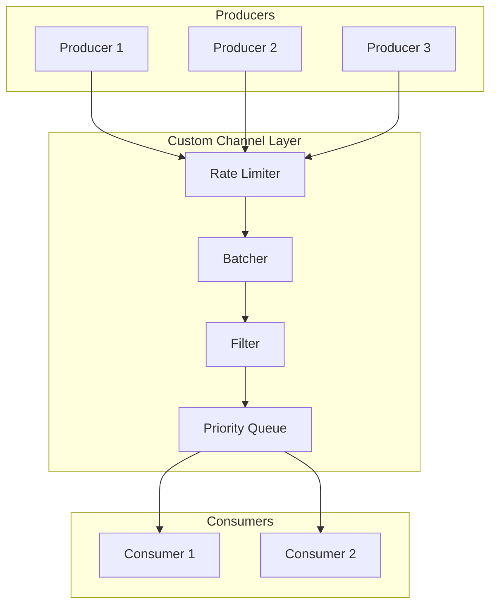
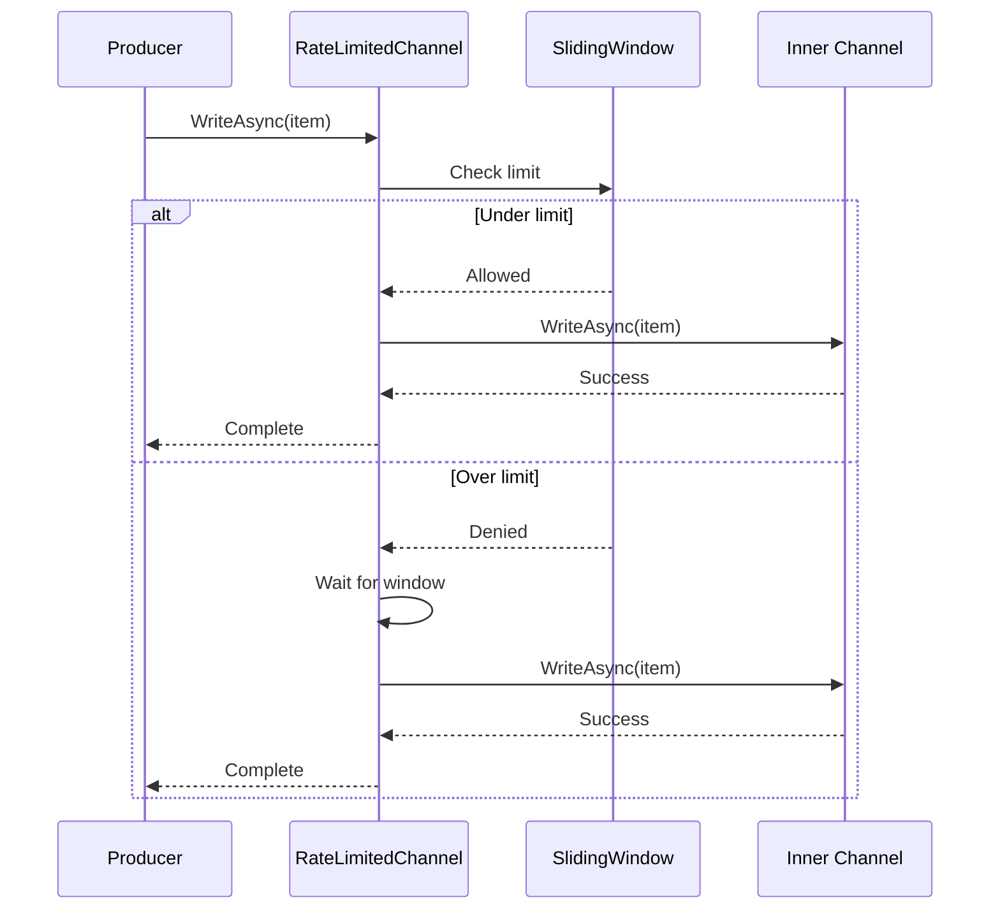
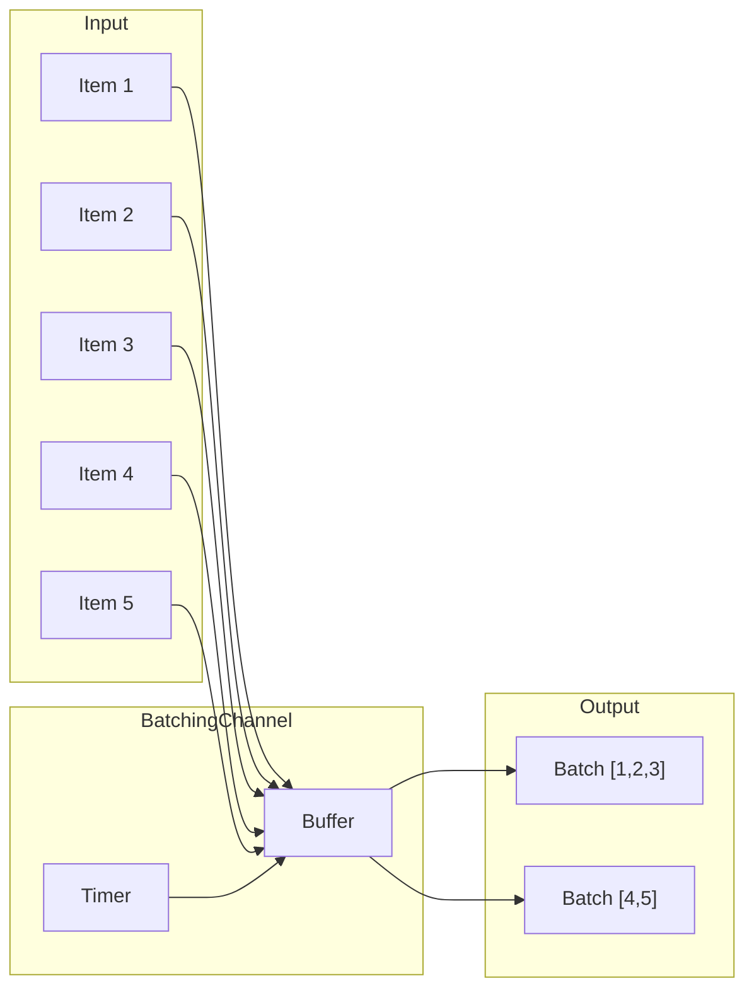
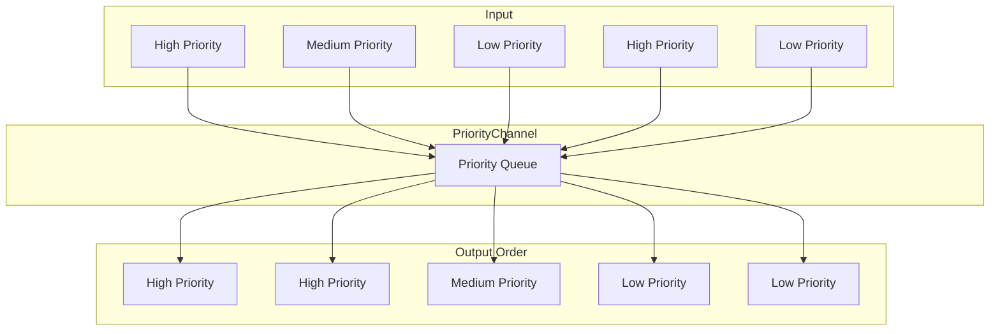
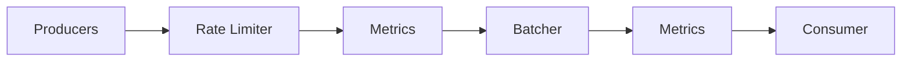

# How to Build Custom Channels with System.Threading.Channels

Author: [nawazdhandala](https://github.com/nawazdhandala)

Tags: CSharp, .NET, Channels, Concurrency, Async Programming, Producer Consumer

Description: Learn how to build custom channel implementations in .NET using System.Threading.Channels for specialized producer-consumer scenarios, rate limiting, batching, and priority queuing.

---

System.Threading.Channels provides high-performance, thread-safe data structures for producer-consumer patterns in .NET. While the built-in `Channel<T>` works for most cases, sometimes you need custom behavior like rate limiting, automatic batching, priority ordering, or filtering. This post walks through building custom channel wrappers and extensions that solve real production problems.

## Why Build Custom Channels?

The standard bounded and unbounded channels cover basic scenarios well. But production systems often need:

- Rate limiting to protect downstream services
- Automatic batching for database bulk inserts
- Priority queuing for different message types
- Filtering or transformation at the channel level
- Metrics and observability built into the data flow

Custom channels let you encapsulate this logic at the infrastructure layer, keeping your business code clean.



## Understanding Channel Architecture

Before building custom channels, let's understand the core abstractions. A channel consists of two parts: a writer and a reader.

| Component | Interface | Purpose |
|-----------|-----------|---------|
| Channel | `Channel<T>` | Container holding writer and reader |
| Writer | `ChannelWriter<T>` | Async write operations |
| Reader | `ChannelReader<T>` | Async read operations |

The standard factory methods create channels with different behaviors.

This code shows the three main channel types and when to use each one.

```csharp
// Unbounded: grows infinitely, use when producers must not block
var unbounded = Channel.CreateUnbounded<Message>();

// Bounded with wait: blocks producers when full
var boundedWait = Channel.CreateBounded<Message>(new BoundedChannelOptions(100)
{
    FullMode = BoundedChannelFullMode.Wait
});

// Bounded with drop: drops items when full (useful for telemetry)
var boundedDrop = Channel.CreateBounded<Message>(new BoundedChannelOptions(100)
{
    FullMode = BoundedChannelFullMode.DropOldest
});
```

## Building a Rate-Limited Channel

Rate limiting protects downstream services from being overwhelmed. This implementation limits how many items can be written per time window.



The rate limiter uses a sliding window algorithm to track write attempts. When the limit is exceeded, producers wait until the window slides forward.

```csharp
using System.Threading.Channels;

// RateLimitedChannel wraps an inner channel and enforces a maximum
// number of writes per time window. Useful for protecting APIs or
// databases from being overwhelmed by bursts of traffic.
public class RateLimitedChannel<T>
{
    private readonly Channel<T> _innerChannel;
    private readonly int _maxItemsPerWindow;
    private readonly TimeSpan _windowSize;
    private readonly SemaphoreSlim _semaphore;
    private readonly Queue<DateTime> _timestamps;
    private readonly object _lock = new();

    public RateLimitedChannel(
        int maxItemsPerWindow,
        TimeSpan windowSize,
        int? boundedCapacity = null)
    {
        _maxItemsPerWindow = maxItemsPerWindow;
        _windowSize = windowSize;
        _timestamps = new Queue<DateTime>();
        _semaphore = new SemaphoreSlim(maxItemsPerWindow, maxItemsPerWindow);

        // Create the inner channel based on whether bounding is requested
        _innerChannel = boundedCapacity.HasValue
            ? Channel.CreateBounded<T>(new BoundedChannelOptions(boundedCapacity.Value)
            {
                FullMode = BoundedChannelFullMode.Wait
            })
            : Channel.CreateUnbounded<T>();
    }

    public ChannelReader<T> Reader => _innerChannel.Reader;

    // WriteAsync enforces rate limiting before delegating to the inner channel.
    // It uses a sliding window to track recent writes and blocks when the
    // limit is reached until the window slides forward.
    public async ValueTask WriteAsync(T item, CancellationToken cancellationToken = default)
    {
        // Wait for a slot in the semaphore
        await _semaphore.WaitAsync(cancellationToken);

        try
        {
            // Clean up expired timestamps and calculate wait time if needed
            var waitTime = GetWaitTime();
            if (waitTime > TimeSpan.Zero)
            {
                await Task.Delay(waitTime, cancellationToken);
            }

            // Record this write attempt
            lock (_lock)
            {
                _timestamps.Enqueue(DateTime.UtcNow);
            }

            // Write to the inner channel
            await _innerChannel.Writer.WriteAsync(item, cancellationToken);
        }
        finally
        {
            // Schedule semaphore release after window expires
            _ = ReleaseAfterWindowAsync();
        }
    }

    // GetWaitTime calculates how long the producer must wait before
    // the next write is allowed. Returns zero if under the limit.
    private TimeSpan GetWaitTime()
    {
        lock (_lock)
        {
            var now = DateTime.UtcNow;
            var windowStart = now - _windowSize;

            // Remove timestamps outside the current window
            while (_timestamps.Count > 0 && _timestamps.Peek() < windowStart)
            {
                _timestamps.Dequeue();
            }

            // If under limit, no wait needed
            if (_timestamps.Count < _maxItemsPerWindow)
            {
                return TimeSpan.Zero;
            }

            // Calculate when the oldest timestamp will expire
            var oldestTimestamp = _timestamps.Peek();
            var expirationTime = oldestTimestamp + _windowSize;
            return expirationTime - now;
        }
    }

    // ReleaseAfterWindowAsync returns the semaphore slot after the
    // sliding window period has passed, allowing a new write.
    private async Task ReleaseAfterWindowAsync()
    {
        await Task.Delay(_windowSize);
        _semaphore.Release();
    }

    public void Complete() => _innerChannel.Writer.Complete();
}
```

Here is how to use the rate-limited channel in practice.

```csharp
// Usage example: limit to 100 writes per second
var rateLimitedChannel = new RateLimitedChannel<ApiRequest>(
    maxItemsPerWindow: 100,
    windowSize: TimeSpan.FromSeconds(1),
    boundedCapacity: 1000
);

// Producer task that respects rate limits automatically
var producerTask = Task.Run(async () =>
{
    foreach (var request in GetRequests())
    {
        // This will automatically throttle if we exceed 100/second
        await rateLimitedChannel.WriteAsync(request);
    }
    rateLimitedChannel.Complete();
});

// Consumer processes items as they become available
await foreach (var request in rateLimitedChannel.Reader.ReadAllAsync())
{
    await ProcessRequestAsync(request);
}
```

## Building a Batching Channel

Batching improves throughput for operations where processing multiple items together is more efficient than processing them individually. Database bulk inserts and HTTP batch APIs are common examples.



The batching channel collects items into batches based on size or time, whichever threshold is reached first.

```csharp
using System.Threading.Channels;

// BatchingChannel collects individual items into batches.
// Batches are emitted when they reach maxBatchSize or when
// maxWaitTime elapses, whichever happens first.
public class BatchingChannel<T>
{
    private readonly Channel<T> _inputChannel;
    private readonly Channel<IReadOnlyList<T>> _outputChannel;
    private readonly int _maxBatchSize;
    private readonly TimeSpan _maxWaitTime;
    private readonly CancellationTokenSource _cts;
    private readonly Task _batchingTask;

    public BatchingChannel(int maxBatchSize, TimeSpan maxWaitTime, int inputCapacity = 1000)
    {
        _maxBatchSize = maxBatchSize;
        _maxWaitTime = maxWaitTime;
        _cts = new CancellationTokenSource();

        // Input channel receives individual items from producers
        _inputChannel = Channel.CreateBounded<T>(new BoundedChannelOptions(inputCapacity)
        {
            FullMode = BoundedChannelFullMode.Wait
        });

        // Output channel emits batches to consumers
        _outputChannel = Channel.CreateUnbounded<IReadOnlyList<T>>();

        // Start the background task that creates batches
        _batchingTask = Task.Run(BatchItemsAsync);
    }

    public ChannelWriter<T> Writer => _inputChannel.Writer;
    public ChannelReader<IReadOnlyList<T>> Reader => _outputChannel.Reader;

    // BatchItemsAsync runs continuously, collecting items into batches
    // and emitting them based on size or time thresholds.
    private async Task BatchItemsAsync()
    {
        var batch = new List<T>(_maxBatchSize);
        var batchStartTime = DateTime.UtcNow;

        try
        {
            while (await _inputChannel.Reader.WaitToReadAsync(_cts.Token))
            {
                // Read all available items up to batch size
                while (batch.Count < _maxBatchSize &&
                       _inputChannel.Reader.TryRead(out var item))
                {
                    if (batch.Count == 0)
                    {
                        batchStartTime = DateTime.UtcNow;
                    }
                    batch.Add(item);
                }

                // Check if we should emit the batch
                var batchAge = DateTime.UtcNow - batchStartTime;
                var shouldEmit = batch.Count >= _maxBatchSize ||
                                 (batch.Count > 0 && batchAge >= _maxWaitTime);

                if (shouldEmit)
                {
                    await _outputChannel.Writer.WriteAsync(batch.ToList());
                    batch.Clear();
                }
                else if (batch.Count > 0)
                {
                    // Wait for more items or timeout
                    var remainingTime = _maxWaitTime - batchAge;
                    if (remainingTime > TimeSpan.Zero)
                    {
                        using var timeoutCts = CancellationTokenSource
                            .CreateLinkedTokenSource(_cts.Token);
                        timeoutCts.CancelAfter(remainingTime);

                        try
                        {
                            await _inputChannel.Reader.WaitToReadAsync(timeoutCts.Token);
                        }
                        catch (OperationCanceledException) when (!_cts.IsCancellationRequested)
                        {
                            // Timeout reached, emit partial batch
                            if (batch.Count > 0)
                            {
                                await _outputChannel.Writer.WriteAsync(batch.ToList());
                                batch.Clear();
                            }
                        }
                    }
                }
            }

            // Emit any remaining items when input completes
            if (batch.Count > 0)
            {
                await _outputChannel.Writer.WriteAsync(batch.ToList());
            }
        }
        catch (OperationCanceledException)
        {
            // Expected during shutdown
        }
        finally
        {
            _outputChannel.Writer.Complete();
        }
    }

    public void Complete()
    {
        _inputChannel.Writer.Complete();
    }

    public async ValueTask DisposeAsync()
    {
        _cts.Cancel();
        await _batchingTask;
        _cts.Dispose();
    }
}
```

Here is how to use the batching channel for efficient database operations.

```csharp
// Create a batching channel that emits batches of 100 items
// or every 500ms, whichever comes first
var batchingChannel = new BatchingChannel<DatabaseRecord>(
    maxBatchSize: 100,
    maxWaitTime: TimeSpan.FromMilliseconds(500)
);

// Producer writes individual records
var producerTask = Task.Run(async () =>
{
    await foreach (var record in GetRecordsAsync())
    {
        await batchingChannel.Writer.WriteAsync(record);
    }
    batchingChannel.Complete();
});

// Consumer processes batches efficiently
await foreach (var batch in batchingChannel.Reader.ReadAllAsync())
{
    // Bulk insert is much faster than individual inserts
    await BulkInsertAsync(batch);
    Console.WriteLine($"Inserted batch of {batch.Count} records");
}
```

## Building a Priority Channel

Priority channels ensure important messages are processed before less important ones. This is useful for systems that handle mixed workloads where some requests need faster handling.



The priority channel uses a priority queue internally and wraps the standard channel interfaces.

```csharp
using System.Threading.Channels;

// Priority levels for messages in the channel.
// Lower numeric values indicate higher priority.
public enum Priority
{
    High = 0,
    Medium = 1,
    Low = 2
}

// PrioritizedItem wraps an item with its priority level
// and arrival time for stable sorting.
public record PrioritizedItem<T>(T Item, Priority Priority, long Sequence);

// PriorityChannel ensures higher priority items are read before
// lower priority items, regardless of insertion order.
public class PriorityChannel<T>
{
    private readonly SortedSet<PrioritizedItem<T>> _queue;
    private readonly SemaphoreSlim _itemAvailable;
    private readonly SemaphoreSlim _lock;
    private readonly int _capacity;
    private long _sequence;
    private bool _completed;
    private readonly Comparer<PrioritizedItem<T>> _comparer;

    public PriorityChannel(int capacity = 1000)
    {
        _capacity = capacity;
        _itemAvailable = new SemaphoreSlim(0);
        _lock = new SemaphoreSlim(1, 1);

        // Compare by priority first, then by sequence for FIFO within priority
        _comparer = Comparer<PrioritizedItem<T>>.Create((a, b) =>
        {
            var priorityComparison = a.Priority.CompareTo(b.Priority);
            return priorityComparison != 0
                ? priorityComparison
                : a.Sequence.CompareTo(b.Sequence);
        });

        _queue = new SortedSet<PrioritizedItem<T>>(_comparer);
    }

    // WriteAsync adds an item with the specified priority.
    // Items with higher priority will be read before lower priority items.
    public async ValueTask WriteAsync(
        T item,
        Priority priority,
        CancellationToken cancellationToken = default)
    {
        await _lock.WaitAsync(cancellationToken);
        try
        {
            if (_completed)
            {
                throw new ChannelClosedException("Channel has been completed");
            }

            // Wait if at capacity
            while (_queue.Count >= _capacity)
            {
                _lock.Release();
                await Task.Delay(10, cancellationToken);
                await _lock.WaitAsync(cancellationToken);
            }

            var prioritizedItem = new PrioritizedItem<T>(
                item,
                priority,
                Interlocked.Increment(ref _sequence)
            );

            _queue.Add(prioritizedItem);
        }
        finally
        {
            _lock.Release();
        }

        _itemAvailable.Release();
    }

    // ReadAsync returns the highest priority item available.
    // Within the same priority, items are returned in FIFO order.
    public async ValueTask<T> ReadAsync(CancellationToken cancellationToken = default)
    {
        while (true)
        {
            await _itemAvailable.WaitAsync(cancellationToken);

            await _lock.WaitAsync(cancellationToken);
            try
            {
                if (_queue.Count > 0)
                {
                    var item = _queue.Min!;
                    _queue.Remove(item);
                    return item.Item;
                }

                if (_completed && _queue.Count == 0)
                {
                    throw new ChannelClosedException("Channel completed with no more items");
                }
            }
            finally
            {
                _lock.Release();
            }
        }
    }

    // TryRead attempts to read an item without blocking.
    // Returns false if no items are available.
    public bool TryRead(out T? item)
    {
        item = default;

        if (!_itemAvailable.Wait(0))
        {
            return false;
        }

        _lock.Wait();
        try
        {
            if (_queue.Count > 0)
            {
                var prioritizedItem = _queue.Min!;
                _queue.Remove(prioritizedItem);
                item = prioritizedItem.Item;
                return true;
            }
        }
        finally
        {
            _lock.Release();
        }

        return false;
    }

    // ReadAllAsync returns an async enumerable that yields items
    // in priority order until the channel is completed.
    public async IAsyncEnumerable<T> ReadAllAsync(
        [System.Runtime.CompilerServices.EnumeratorCancellation]
        CancellationToken cancellationToken = default)
    {
        while (true)
        {
            T item;
            try
            {
                item = await ReadAsync(cancellationToken);
            }
            catch (ChannelClosedException)
            {
                yield break;
            }

            yield return item;
        }
    }

    public void Complete()
    {
        _lock.Wait();
        try
        {
            _completed = true;
        }
        finally
        {
            _lock.Release();
        }
        _itemAvailable.Release(); // Wake up any waiting readers
    }
}
```

Here is an example of using the priority channel for request handling.

```csharp
// Create a priority channel for handling different request types
var priorityChannel = new PriorityChannel<Request>(capacity: 5000);

// Multiple producers with different priorities
var producerTasks = new List<Task>
{
    // Health checks are high priority
    Task.Run(async () =>
    {
        foreach (var healthCheck in GetHealthChecks())
        {
            await priorityChannel.WriteAsync(healthCheck, Priority.High);
        }
    }),

    // User requests are medium priority
    Task.Run(async () =>
    {
        foreach (var userRequest in GetUserRequests())
        {
            await priorityChannel.WriteAsync(userRequest, Priority.Medium);
        }
    }),

    // Background tasks are low priority
    Task.Run(async () =>
    {
        foreach (var backgroundTask in GetBackgroundTasks())
        {
            await priorityChannel.WriteAsync(backgroundTask, Priority.Low);
        }
    })
};

// Signal completion when all producers finish
_ = Task.WhenAll(producerTasks).ContinueWith(_ => priorityChannel.Complete());

// Consumer processes items in priority order
await foreach (var request in priorityChannel.ReadAllAsync())
{
    await ProcessRequestAsync(request);
}
```

## Building a Filtered Channel

Filtered channels allow you to drop or transform items before they reach consumers. This is useful for deduplication, validation, or transformation.

```csharp
using System.Threading.Channels;

// FilteredChannel wraps a channel and applies a predicate to filter
// items and optionally a transform function to modify items.
public class FilteredChannel<TInput, TOutput>
{
    private readonly Channel<TInput> _inputChannel;
    private readonly Channel<TOutput> _outputChannel;
    private readonly Func<TInput, bool> _filter;
    private readonly Func<TInput, TOutput> _transform;
    private readonly Task _processingTask;
    private readonly CancellationTokenSource _cts;

    public FilteredChannel(
        Func<TInput, bool> filter,
        Func<TInput, TOutput> transform,
        int inputCapacity = 1000,
        int outputCapacity = 1000)
    {
        _filter = filter;
        _transform = transform;
        _cts = new CancellationTokenSource();

        _inputChannel = Channel.CreateBounded<TInput>(new BoundedChannelOptions(inputCapacity)
        {
            FullMode = BoundedChannelFullMode.Wait
        });

        _outputChannel = Channel.CreateBounded<TOutput>(new BoundedChannelOptions(outputCapacity)
        {
            FullMode = BoundedChannelFullMode.Wait
        });

        _processingTask = Task.Run(ProcessItemsAsync);
    }

    public ChannelWriter<TInput> Writer => _inputChannel.Writer;
    public ChannelReader<TOutput> Reader => _outputChannel.Reader;

    // ProcessItemsAsync continuously reads from input, applies filter
    // and transform, then writes to output.
    private async Task ProcessItemsAsync()
    {
        try
        {
            await foreach (var item in _inputChannel.Reader.ReadAllAsync(_cts.Token))
            {
                // Apply filter predicate
                if (!_filter(item))
                {
                    continue;
                }

                // Apply transformation
                var transformed = _transform(item);

                // Write to output channel
                await _outputChannel.Writer.WriteAsync(transformed, _cts.Token);
            }
        }
        catch (OperationCanceledException)
        {
            // Expected during shutdown
        }
        finally
        {
            _outputChannel.Writer.Complete();
        }
    }

    public void Complete() => _inputChannel.Writer.Complete();

    public async ValueTask DisposeAsync()
    {
        _cts.Cancel();
        await _processingTask;
        _cts.Dispose();
    }
}

// Simplified version for filtering without transformation
public class FilteredChannel<T> : FilteredChannel<T, T>
{
    public FilteredChannel(Func<T, bool> filter, int capacity = 1000)
        : base(filter, x => x, capacity, capacity)
    {
    }
}
```

Here is how to use filtered channels for deduplication.

```csharp
// Create a filtered channel that deduplicates events by ID
var seenIds = new HashSet<string>();
var dedupLock = new object();

var dedupChannel = new FilteredChannel<Event>(
    filter: evt =>
    {
        lock (dedupLock)
        {
            return seenIds.Add(evt.Id);
        }
    },
    capacity: 1000
);

// Create a filtered channel that transforms and validates
var validatedChannel = new FilteredChannel<RawData, ValidatedData>(
    filter: raw => !string.IsNullOrEmpty(raw.Value),
    transform: raw => new ValidatedData
    {
        Id = raw.Id,
        Value = raw.Value.Trim().ToUpperInvariant(),
        ProcessedAt = DateTime.UtcNow
    }
);
```

## Building a Metrics-Enabled Channel

Production systems need observability. This channel wrapper adds metrics for monitoring throughput, latency, and queue depth.

```csharp
using System.Diagnostics;
using System.Diagnostics.Metrics;
using System.Threading.Channels;

// MetricsChannel wraps a channel and emits metrics about
// throughput, latency, and queue depth using System.Diagnostics.Metrics.
public class MetricsChannel<T>
{
    private readonly Channel<TimestampedItem<T>> _channel;
    private readonly Counter<long> _itemsWritten;
    private readonly Counter<long> _itemsRead;
    private readonly Histogram<double> _queueLatency;
    private readonly ObservableGauge<int> _queueDepth;
    private int _currentDepth;

    private record TimestampedItem<TItem>(TItem Item, long Timestamp);

    public MetricsChannel(
        string channelName,
        IMeterFactory meterFactory,
        int? boundedCapacity = null)
    {
        var meter = meterFactory.Create($"Channel.{channelName}");

        _itemsWritten = meter.CreateCounter<long>(
            $"channel_{channelName}_items_written",
            "items",
            "Number of items written to the channel"
        );

        _itemsRead = meter.CreateCounter<long>(
            $"channel_{channelName}_items_read",
            "items",
            "Number of items read from the channel"
        );

        _queueLatency = meter.CreateHistogram<double>(
            $"channel_{channelName}_latency",
            "ms",
            "Time items spend waiting in the channel"
        );

        _queueDepth = meter.CreateObservableGauge(
            $"channel_{channelName}_depth",
            () => _currentDepth,
            "items",
            "Current number of items in the channel"
        );

        _channel = boundedCapacity.HasValue
            ? Channel.CreateBounded<TimestampedItem<T>>(new BoundedChannelOptions(boundedCapacity.Value)
            {
                FullMode = BoundedChannelFullMode.Wait
            })
            : Channel.CreateUnbounded<TimestampedItem<T>>();
    }

    // WriteAsync records timing and metrics when items are written.
    public async ValueTask WriteAsync(T item, CancellationToken cancellationToken = default)
    {
        var timestamped = new TimestampedItem<T>(item, Stopwatch.GetTimestamp());

        await _channel.Writer.WriteAsync(timestamped, cancellationToken);

        Interlocked.Increment(ref _currentDepth);
        _itemsWritten.Add(1);
    }

    // ReadAsync records timing and metrics when items are read.
    public async ValueTask<T> ReadAsync(CancellationToken cancellationToken = default)
    {
        var timestamped = await _channel.Reader.ReadAsync(cancellationToken);

        Interlocked.Decrement(ref _currentDepth);
        _itemsRead.Add(1);

        // Calculate and record latency
        var elapsed = Stopwatch.GetElapsedTime(timestamped.Timestamp);
        _queueLatency.Record(elapsed.TotalMilliseconds);

        return timestamped.Item;
    }

    // ReadAllAsync returns all items with metrics recorded for each.
    public async IAsyncEnumerable<T> ReadAllAsync(
        [System.Runtime.CompilerServices.EnumeratorCancellation]
        CancellationToken cancellationToken = default)
    {
        await foreach (var timestamped in _channel.Reader.ReadAllAsync(cancellationToken))
        {
            Interlocked.Decrement(ref _currentDepth);
            _itemsRead.Add(1);

            var elapsed = Stopwatch.GetElapsedTime(timestamped.Timestamp);
            _queueLatency.Record(elapsed.TotalMilliseconds);

            yield return timestamped.Item;
        }
    }

    public bool TryWrite(T item)
    {
        var timestamped = new TimestampedItem<T>(item, Stopwatch.GetTimestamp());

        if (_channel.Writer.TryWrite(timestamped))
        {
            Interlocked.Increment(ref _currentDepth);
            _itemsWritten.Add(1);
            return true;
        }

        return false;
    }

    public void Complete() => _channel.Writer.Complete();
}
```

Here is how to register and use the metrics channel with dependency injection.

```csharp
// Register in Program.cs
var builder = WebApplication.CreateBuilder(args);

// Add OpenTelemetry metrics
builder.Services.AddOpenTelemetry()
    .WithMetrics(metrics =>
    {
        metrics.AddMeter("Channel.*");
        metrics.AddPrometheusExporter();
    });

// Create metrics-enabled channel
builder.Services.AddSingleton(sp =>
{
    var meterFactory = sp.GetRequiredService<IMeterFactory>();
    return new MetricsChannel<ProcessingRequest>(
        channelName: "processing_queue",
        meterFactory: meterFactory,
        boundedCapacity: 1000
    );
});

var app = builder.Build();

// Use the channel
app.MapPost("/process", async (
    ProcessingRequest request,
    MetricsChannel<ProcessingRequest> channel) =>
{
    await channel.WriteAsync(request);
    return Results.Accepted();
});
```

## Composing Custom Channels

The real power comes from composing these building blocks together. Here is an example that combines rate limiting, batching, and metrics.



This pipeline class composes multiple channel behaviors into a single processing flow.

```csharp
using System.Threading.Channels;

// ComposedPipeline chains multiple channel behaviors together:
// rate limiting, metrics, batching, and delivery.
public class ComposedPipeline<T> : IAsyncDisposable
{
    private readonly RateLimitedChannel<T> _rateLimiter;
    private readonly MetricsChannel<T> _inputMetrics;
    private readonly BatchingChannel<T> _batcher;
    private readonly MetricsChannel<IReadOnlyList<T>> _outputMetrics;
    private readonly Task _processingTask;
    private readonly CancellationTokenSource _cts;

    public ComposedPipeline(
        IMeterFactory meterFactory,
        int rateLimit,
        TimeSpan rateLimitWindow,
        int batchSize,
        TimeSpan batchTimeout)
    {
        _cts = new CancellationTokenSource();

        // Create each stage of the pipeline
        _rateLimiter = new RateLimitedChannel<T>(rateLimit, rateLimitWindow);
        _inputMetrics = new MetricsChannel<T>("input", meterFactory);
        _batcher = new BatchingChannel<T>(batchSize, batchTimeout);
        _outputMetrics = new MetricsChannel<IReadOnlyList<T>>("output", meterFactory);

        // Wire up the pipeline stages
        _processingTask = Task.WhenAll(
            ForwardAsync(_rateLimiter.Reader, _inputMetrics),
            ForwardAsync(_inputMetrics, _batcher.Writer),
            ForwardBatchesAsync(_batcher.Reader, _outputMetrics)
        );
    }

    // WriteAsync is the entry point for producers.
    // Items flow through rate limiting, metrics, and batching automatically.
    public async ValueTask WriteAsync(T item, CancellationToken cancellationToken = default)
    {
        await _rateLimiter.WriteAsync(item, cancellationToken);
    }

    // Reader exposes batched output for consumers.
    public IAsyncEnumerable<IReadOnlyList<T>> ReadBatchesAsync(
        CancellationToken cancellationToken = default)
    {
        return _outputMetrics.ReadAllAsync(cancellationToken);
    }

    // ForwardAsync moves items from a reader to a metrics channel.
    private async Task ForwardAsync(
        ChannelReader<T> reader,
        MetricsChannel<T> metrics)
    {
        await foreach (var item in reader.ReadAllAsync(_cts.Token))
        {
            await metrics.WriteAsync(item, _cts.Token);
        }
        metrics.Complete();
    }

    // ForwardAsync moves items from metrics to a channel writer.
    private async Task ForwardAsync(
        MetricsChannel<T> metrics,
        ChannelWriter<T> writer)
    {
        await foreach (var item in metrics.ReadAllAsync(_cts.Token))
        {
            await writer.WriteAsync(item, _cts.Token);
        }
        writer.Complete();
    }

    // ForwardBatchesAsync moves batches to the output metrics channel.
    private async Task ForwardBatchesAsync(
        ChannelReader<IReadOnlyList<T>> reader,
        MetricsChannel<IReadOnlyList<T>> metrics)
    {
        await foreach (var batch in reader.ReadAllAsync(_cts.Token))
        {
            await metrics.WriteAsync(batch, _cts.Token);
        }
        metrics.Complete();
    }

    public void Complete() => _rateLimiter.Complete();

    public async ValueTask DisposeAsync()
    {
        Complete();
        _cts.Cancel();

        try
        {
            await _processingTask;
        }
        catch (OperationCanceledException)
        {
            // Expected
        }

        await _batcher.DisposeAsync();
        _cts.Dispose();
    }
}
```

Here is the complete usage example.

```csharp
// Create a composed pipeline for database writes
await using var pipeline = new ComposedPipeline<DatabaseRecord>(
    meterFactory: app.Services.GetRequiredService<IMeterFactory>(),
    rateLimit: 1000,
    rateLimitWindow: TimeSpan.FromSeconds(1),
    batchSize: 100,
    batchTimeout: TimeSpan.FromMilliseconds(500)
);

// Producer writes individual records
var producerTask = Task.Run(async () =>
{
    await foreach (var record in GetRecordsAsync())
    {
        await pipeline.WriteAsync(record);
    }
    pipeline.Complete();
});

// Consumer receives optimally batched records
await foreach (var batch in pipeline.ReadBatchesAsync())
{
    await BulkInsertAsync(batch);
    Console.WriteLine($"Inserted {batch.Count} records");
}
```

## Testing Custom Channels

Testing channel behavior requires verifying concurrent operations. Here are patterns for testing custom channels.

```csharp
using Xunit;

public class CustomChannelTests
{
    [Fact]
    public async Task RateLimitedChannel_EnforcesLimit()
    {
        // Arrange
        var channel = new RateLimitedChannel<int>(
            maxItemsPerWindow: 5,
            windowSize: TimeSpan.FromSeconds(1)
        );

        var stopwatch = Stopwatch.StartNew();

        // Act: Write 10 items (should take ~1 second for items 6-10)
        for (int i = 0; i < 10; i++)
        {
            await channel.WriteAsync(i);
        }

        stopwatch.Stop();

        // Assert: Should take at least 1 second due to rate limiting
        Assert.True(stopwatch.ElapsedMilliseconds >= 900);
    }

    [Fact]
    public async Task BatchingChannel_EmitsBatchOnSize()
    {
        // Arrange
        var channel = new BatchingChannel<int>(
            maxBatchSize: 5,
            maxWaitTime: TimeSpan.FromSeconds(10)
        );

        // Act: Write exactly batch size items
        for (int i = 0; i < 5; i++)
        {
            await channel.Writer.WriteAsync(i);
        }

        // Assert: Should emit batch immediately
        var batchReceived = await channel.Reader.WaitToReadAsync();
        Assert.True(batchReceived);

        var batch = await channel.Reader.ReadAsync();
        Assert.Equal(5, batch.Count);
    }

    [Fact]
    public async Task BatchingChannel_EmitsBatchOnTimeout()
    {
        // Arrange
        var channel = new BatchingChannel<int>(
            maxBatchSize: 100,
            maxWaitTime: TimeSpan.FromMilliseconds(100)
        );

        // Act: Write fewer items than batch size
        await channel.Writer.WriteAsync(1);
        await channel.Writer.WriteAsync(2);

        // Wait for timeout
        await Task.Delay(200);

        // Assert: Should have emitted partial batch
        Assert.True(channel.Reader.TryRead(out var batch));
        Assert.Equal(2, batch!.Count);
    }

    [Fact]
    public async Task PriorityChannel_ReturnsHighPriorityFirst()
    {
        // Arrange
        var channel = new PriorityChannel<string>();

        // Act: Write in reverse priority order
        await channel.WriteAsync("low", Priority.Low);
        await channel.WriteAsync("medium", Priority.Medium);
        await channel.WriteAsync("high", Priority.High);

        // Assert: Should read in priority order
        Assert.Equal("high", await channel.ReadAsync());
        Assert.Equal("medium", await channel.ReadAsync());
        Assert.Equal("low", await channel.ReadAsync());
    }

    [Fact]
    public async Task PriorityChannel_MaintainsFifoWithinPriority()
    {
        // Arrange
        var channel = new PriorityChannel<int>();

        // Act: Write multiple items at same priority
        await channel.WriteAsync(1, Priority.High);
        await channel.WriteAsync(2, Priority.High);
        await channel.WriteAsync(3, Priority.High);

        // Assert: Should read in FIFO order within priority
        Assert.Equal(1, await channel.ReadAsync());
        Assert.Equal(2, await channel.ReadAsync());
        Assert.Equal(3, await channel.ReadAsync());
    }
}
```

## Performance Considerations

When building custom channels, keep these performance tips in mind.

| Consideration | Recommendation |
|--------------|----------------|
| Lock contention | Use lock-free structures where possible |
| Memory allocation | Pool objects when processing high volumes |
| Bounded vs unbounded | Always prefer bounded for backpressure |
| Async overhead | Use ValueTask for hot paths |
| Batch processing | Match batch size to downstream capacity |

## Summary

Custom channels let you build sophisticated data flow patterns while keeping the complexity out of your business logic. Start with the specific problem you need to solve:

- Rate limiting protects downstream services
- Batching improves throughput for bulk operations
- Priority queuing handles mixed workload requirements
- Filtering keeps validation at the infrastructure layer
- Metrics provide visibility into system behavior

Compose these building blocks together to create pipelines that match your exact requirements. The investment in building reusable channel components pays off as your system grows and you need consistent behavior across multiple data flows.

The patterns shown here work well in production, but always test your specific throughput requirements and tune buffer sizes accordingly. Monitor queue depths and latencies to identify bottlenecks before they become problems.
