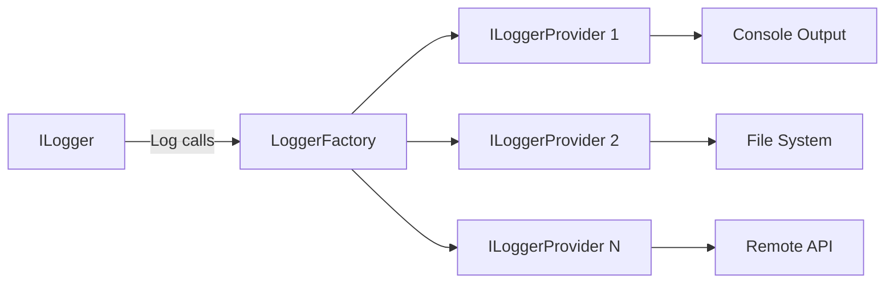
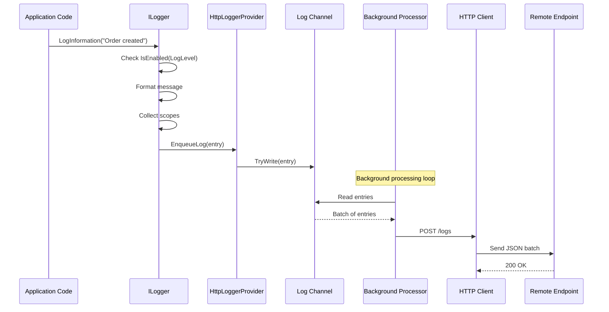

# How to Implement Custom Logging Providers in .NET

Author: [nawazdhandala](https://github.com/nawazdhandala)

Tags: C#, .NET, Logging, ASP.NET Core, Observability

Description: Learn how to build custom logging providers in .NET to send logs to any destination. This guide covers the ILoggerProvider interface, structured logging, log enrichment, and production-ready implementations.

---

The built-in .NET logging abstraction is flexible enough to send logs anywhere. While packages exist for popular destinations like Serilog sinks or NLog targets, sometimes you need to build your own. Maybe you're integrating with an internal system, need custom formatting, or want complete control over how logs are batched and shipped.

This guide walks through building a production-ready custom logging provider from scratch. You'll learn the interfaces involved, how to handle batching efficiently, and patterns for enriching logs with contextual data.

## Understanding the .NET Logging Architecture

Before writing code, let's understand how the pieces fit together.



The `ILogger` interface is what your application code uses. The `LoggerFactory` routes log messages to all registered `ILoggerProvider` instances. Each provider creates `ILogger` instances that handle the actual writing.

There are three interfaces you need to implement:

- `ILoggerProvider` - Factory that creates logger instances
- `ILogger` - Handles individual log calls for a specific category
- `ILoggerProvider` with `ISupportExternalScope` - Enables scope support for contextual logging

## Building a Simple Custom Logger

Let's start with a basic implementation that writes logs to a remote HTTP endpoint. This forms the foundation we'll enhance throughout this guide.

The following code defines the core logging interface implementation. It captures log messages and forwards them to our provider for processing.

```csharp
// Logging/HttpLogger.cs
using Microsoft.Extensions.Logging;

namespace MyApp.Logging;

// The logger instance handles individual log calls for a category
public class HttpLogger : ILogger
{
    private readonly string _categoryName;
    private readonly HttpLoggerProvider _provider;

    public HttpLogger(string categoryName, HttpLoggerProvider provider)
    {
        _categoryName = categoryName;
        _provider = provider;
    }

    // BeginScope enables contextual logging - we'll implement this later
    public IDisposable? BeginScope<TState>(TState state) where TState : notnull
    {
        return _provider.ScopeProvider?.Push(state);
    }

    // Check if logging is enabled for the given level
    public bool IsEnabled(LogLevel logLevel)
    {
        return logLevel != LogLevel.None && logLevel >= _provider.MinLevel;
    }

    // This is the main logging method called by ILogger.Log<T>
    public void Log<TState>(
        LogLevel logLevel,
        EventId eventId,
        TState state,
        Exception? exception,
        Func<TState, Exception?, string> formatter)
    {
        // Skip if logging is disabled for this level
        if (!IsEnabled(logLevel))
        {
            return;
        }

        // Build the log entry with all relevant information
        var logEntry = new LogEntry
        {
            Timestamp = DateTimeOffset.UtcNow,
            Level = logLevel.ToString(),
            Category = _categoryName,
            EventId = eventId.Id,
            EventName = eventId.Name,
            Message = formatter(state, exception),
            Exception = exception?.ToString(),
            Scopes = GetScopes()
        };

        // Enqueue for batch processing
        _provider.EnqueueLog(logEntry);
    }

    // Collect all active scopes for contextual information
    private List<object>? GetScopes()
    {
        if (_provider.ScopeProvider == null)
        {
            return null;
        }

        var scopes = new List<object>();
        _provider.ScopeProvider.ForEachScope((scope, list) =>
        {
            if (scope != null)
            {
                list.Add(scope);
            }
        }, scopes);

        return scopes.Count > 0 ? scopes : null;
    }
}

// Data structure representing a single log entry
public class LogEntry
{
    public DateTimeOffset Timestamp { get; set; }
    public string Level { get; set; } = string.Empty;
    public string Category { get; set; } = string.Empty;
    public int EventId { get; set; }
    public string? EventName { get; set; }
    public string Message { get; set; } = string.Empty;
    public string? Exception { get; set; }
    public List<object>? Scopes { get; set; }
}
```

## Implementing the Logger Provider

The provider manages logger instances and handles the batching logic. It implements `ISupportExternalScope` to enable scope propagation across async operations.

This provider uses a channel-based queue for thread-safe log collection and batches logs before sending them to reduce network overhead.

```csharp
// Logging/HttpLoggerProvider.cs
using System.Collections.Concurrent;
using System.Net.Http.Json;
using System.Text.Json;
using System.Threading.Channels;
using Microsoft.Extensions.Logging;
using Microsoft.Extensions.Options;

namespace MyApp.Logging;

// Configuration options for the HTTP logger
public class HttpLoggerOptions
{
    public string Endpoint { get; set; } = string.Empty;
    public string ApiKey { get; set; } = string.Empty;
    public LogLevel MinLevel { get; set; } = LogLevel.Information;
    public int BatchSize { get; set; } = 100;
    public TimeSpan FlushInterval { get; set; } = TimeSpan.FromSeconds(5);
    public int MaxQueueSize { get; set; } = 10000;
}

// The provider creates loggers and manages the batching pipeline
[ProviderAlias("HttpLogger")]
public class HttpLoggerProvider : ILoggerProvider, ISupportExternalScope
{
    private readonly ConcurrentDictionary<string, HttpLogger> _loggers = new();
    private readonly HttpLoggerOptions _options;
    private readonly HttpClient _httpClient;
    private readonly Channel<LogEntry> _logChannel;
    private readonly Task _processingTask;
    private readonly CancellationTokenSource _cts = new();

    // Scope provider for contextual logging support
    public IExternalScopeProvider? ScopeProvider { get; private set; }
    public LogLevel MinLevel => _options.MinLevel;

    public HttpLoggerProvider(IOptions<HttpLoggerOptions> options)
    {
        _options = options.Value;

        // Configure the HTTP client with authentication
        _httpClient = new HttpClient();
        _httpClient.DefaultRequestHeaders.Add("Authorization", $"Bearer {_options.ApiKey}");
        _httpClient.DefaultRequestHeaders.Add("Content-Type", "application/json");

        // Bounded channel prevents memory issues if the endpoint is slow
        _logChannel = Channel.CreateBounded<LogEntry>(new BoundedChannelOptions(_options.MaxQueueSize)
        {
            FullMode = BoundedChannelFullMode.DropOldest
        });

        // Start the background processing task
        _processingTask = Task.Run(ProcessLogQueueAsync);
    }

    // Factory method called by the logging framework
    public ILogger CreateLogger(string categoryName)
    {
        return _loggers.GetOrAdd(categoryName, name => new HttpLogger(name, this));
    }

    // Called by the framework to enable scope support
    public void SetScopeProvider(IExternalScopeProvider scopeProvider)
    {
        ScopeProvider = scopeProvider;
    }

    // Add a log entry to the processing queue
    public void EnqueueLog(LogEntry entry)
    {
        // TryWrite is non-blocking - drops if queue is full
        _logChannel.Writer.TryWrite(entry);
    }

    // Background task that batches and sends logs
    private async Task ProcessLogQueueAsync()
    {
        var batch = new List<LogEntry>(_options.BatchSize);
        var timer = new PeriodicTimer(_options.FlushInterval);

        while (!_cts.Token.IsCancellationRequested)
        {
            try
            {
                // Try to fill the batch or wait for the flush interval
                using var timeoutCts = new CancellationTokenSource(_options.FlushInterval);
                using var linkedCts = CancellationTokenSource.CreateLinkedTokenSource(
                    _cts.Token, timeoutCts.Token);

                while (batch.Count < _options.BatchSize)
                {
                    if (_logChannel.Reader.TryRead(out var entry))
                    {
                        batch.Add(entry);
                    }
                    else
                    {
                        // Wait for more items or timeout
                        var hasMore = await _logChannel.Reader.WaitToReadAsync(linkedCts.Token);
                        if (!hasMore)
                        {
                            break;
                        }
                    }
                }
            }
            catch (OperationCanceledException)
            {
                // Timeout or shutdown - flush what we have
            }

            // Send the batch if we have any logs
            if (batch.Count > 0)
            {
                await SendBatchAsync(batch);
                batch.Clear();
            }
        }

        // Flush remaining logs on shutdown
        while (_logChannel.Reader.TryRead(out var entry))
        {
            batch.Add(entry);
        }

        if (batch.Count > 0)
        {
            await SendBatchAsync(batch);
        }
    }

    // Send a batch of logs to the remote endpoint
    private async Task SendBatchAsync(List<LogEntry> batch)
    {
        try
        {
            var response = await _httpClient.PostAsJsonAsync(
                _options.Endpoint,
                batch,
                new JsonSerializerOptions { PropertyNamingPolicy = JsonNamingPolicy.CamelCase });

            if (!response.IsSuccessStatusCode)
            {
                // Log to console as fallback - avoid recursive logging
                Console.Error.WriteLine(
                    $"Failed to send logs: {response.StatusCode} - {await response.Content.ReadAsStringAsync()}");
            }
        }
        catch (Exception ex)
        {
            // Log to console as fallback
            Console.Error.WriteLine($"Error sending logs: {ex.Message}");
        }
    }

    public void Dispose()
    {
        _cts.Cancel();
        _logChannel.Writer.Complete();

        // Wait for processing to complete with timeout
        _processingTask.Wait(TimeSpan.FromSeconds(10));

        _httpClient.Dispose();
        _cts.Dispose();
    }
}
```

## Registering the Custom Provider

Create an extension method to make registration clean and discoverable.

```csharp
// Logging/HttpLoggerExtensions.cs
using Microsoft.Extensions.DependencyInjection;
using Microsoft.Extensions.DependencyInjection.Extensions;
using Microsoft.Extensions.Logging;
using Microsoft.Extensions.Logging.Configuration;

namespace MyApp.Logging;

public static class HttpLoggerExtensions
{
    // Extension method for clean registration syntax
    public static ILoggingBuilder AddHttpLogger(
        this ILoggingBuilder builder,
        Action<HttpLoggerOptions> configure)
    {
        // Bind configuration section if available
        builder.AddConfiguration();

        // Register the options
        builder.Services.Configure(configure);

        // Register the provider - TryAddEnumerable prevents duplicates
        builder.Services.TryAddEnumerable(
            ServiceDescriptor.Singleton<ILoggerProvider, HttpLoggerProvider>());

        // Enable scope support
        LoggerProviderOptions.RegisterProviderOptions<HttpLoggerOptions, HttpLoggerProvider>(
            builder.Services);

        return builder;
    }
}
```

Now you can register the logger in your application.

```csharp
// Program.cs
var builder = WebApplication.CreateBuilder(args);

// Add the custom HTTP logger alongside built-in providers
builder.Logging.AddHttpLogger(options =>
{
    options.Endpoint = "https://logs.example.com/ingest";
    options.ApiKey = builder.Configuration["Logging:ApiKey"] ?? "";
    options.MinLevel = LogLevel.Information;
    options.BatchSize = 100;
    options.FlushInterval = TimeSpan.FromSeconds(5);
});

var app = builder.Build();

// Example usage
app.MapGet("/", (ILogger<Program> logger) =>
{
    logger.LogInformation("Request received at {Endpoint}", "/");
    return "Hello World";
});

app.Run();
```

## Log Enrichment with Scope Data

Scopes let you attach contextual data to all logs within a code block. This is invaluable for tracing requests across your application.

The following example shows how scopes automatically attach request context to all logs within the scope block.

```csharp
// Controllers/OrderController.cs
using Microsoft.AspNetCore.Mvc;

namespace MyApp.Controllers;

[ApiController]
[Route("api/[controller]")]
public class OrderController : ControllerBase
{
    private readonly ILogger<OrderController> _logger;
    private readonly IOrderService _orderService;

    public OrderController(
        ILogger<OrderController> logger,
        IOrderService orderService)
    {
        _logger = logger;
        _orderService = orderService;
    }

    [HttpPost]
    public async Task<IActionResult> CreateOrder([FromBody] OrderRequest request)
    {
        // All logs within this scope include the order context
        using (_logger.BeginScope(new Dictionary<string, object>
        {
            ["OrderId"] = Guid.NewGuid(),
            ["CustomerId"] = request.CustomerId,
            ["RequestId"] = HttpContext.TraceIdentifier
        }))
        {
            _logger.LogInformation("Starting order creation");

            try
            {
                var order = await _orderService.CreateAsync(request);
                _logger.LogInformation("Order created successfully with total {Total}", order.Total);
                return Ok(order);
            }
            catch (Exception ex)
            {
                // This log automatically includes OrderId, CustomerId, and RequestId
                _logger.LogError(ex, "Order creation failed");
                return StatusCode(500, "Order creation failed");
            }
        }
    }
}
```

## Structured Logging with Strong Types

For better query capabilities and type safety, define structured log messages using source generators.

This approach uses the .NET 6+ logging source generator to create strongly-typed, high-performance log methods.

```csharp
// Logging/LogMessages.cs
using Microsoft.Extensions.Logging;

namespace MyApp.Logging;

// Partial class with source-generated log methods
public static partial class LogMessages
{
    [LoggerMessage(
        EventId = 1000,
        Level = LogLevel.Information,
        Message = "Order {OrderId} created for customer {CustomerId} with total {Total:C}")]
    public static partial void OrderCreated(
        ILogger logger,
        Guid orderId,
        string customerId,
        decimal total);

    [LoggerMessage(
        EventId = 1001,
        Level = LogLevel.Warning,
        Message = "Payment retry {Attempt} of {MaxAttempts} for order {OrderId}")]
    public static partial void PaymentRetrying(
        ILogger logger,
        int attempt,
        int maxAttempts,
        Guid orderId);

    [LoggerMessage(
        EventId = 1002,
        Level = LogLevel.Error,
        Message = "Payment failed for order {OrderId} after {Attempts} attempts")]
    public static partial void PaymentFailed(
        ILogger logger,
        Exception exception,
        Guid orderId,
        int attempts);

    [LoggerMessage(
        EventId = 2000,
        Level = LogLevel.Information,
        Message = "User {UserId} authenticated via {AuthMethod}")]
    public static partial void UserAuthenticated(
        ILogger logger,
        string userId,
        string authMethod);
}
```

Usage with strongly-typed logging:

```csharp
// Services/PaymentService.cs
public class PaymentService
{
    private readonly ILogger<PaymentService> _logger;
    private readonly IPaymentGateway _gateway;

    public PaymentService(
        ILogger<PaymentService> logger,
        IPaymentGateway gateway)
    {
        _logger = logger;
        _gateway = gateway;
    }

    public async Task<PaymentResult> ProcessPaymentAsync(Guid orderId, decimal amount)
    {
        const int maxAttempts = 3;

        for (int attempt = 1; attempt <= maxAttempts; attempt++)
        {
            try
            {
                var result = await _gateway.ChargeAsync(amount);
                return result;
            }
            catch (PaymentException ex) when (attempt < maxAttempts)
            {
                // Structured log with typed parameters
                LogMessages.PaymentRetrying(_logger, attempt, maxAttempts, orderId);
                await Task.Delay(TimeSpan.FromSeconds(Math.Pow(2, attempt)));
            }
            catch (PaymentException ex)
            {
                LogMessages.PaymentFailed(_logger, ex, orderId, attempt);
                throw;
            }
        }

        throw new InvalidOperationException("Unreachable");
    }
}
```

## Complete Log Flow

Here's how logs flow through the system from your application code to the remote endpoint.



## Adding Request Context Middleware

Automatically enrich all logs with HTTP request information using middleware.

```csharp
// Middleware/RequestLoggingMiddleware.cs
namespace MyApp.Middleware;

public class RequestLoggingMiddleware
{
    private readonly RequestDelegate _next;
    private readonly ILogger<RequestLoggingMiddleware> _logger;

    public RequestLoggingMiddleware(
        RequestDelegate next,
        ILogger<RequestLoggingMiddleware> logger)
    {
        _next = next;
        _logger = logger;
    }

    public async Task InvokeAsync(HttpContext context)
    {
        // Create scope with request context for all downstream logs
        using (_logger.BeginScope(new Dictionary<string, object>
        {
            ["RequestId"] = context.TraceIdentifier,
            ["RequestPath"] = context.Request.Path.ToString(),
            ["RequestMethod"] = context.Request.Method,
            ["UserAgent"] = context.Request.Headers.UserAgent.ToString(),
            ["ClientIP"] = context.Connection.RemoteIpAddress?.ToString() ?? "unknown"
        }))
        {
            var stopwatch = System.Diagnostics.Stopwatch.StartNew();

            try
            {
                await _next(context);

                stopwatch.Stop();
                _logger.LogInformation(
                    "Request completed with status {StatusCode} in {ElapsedMs}ms",
                    context.Response.StatusCode,
                    stopwatch.ElapsedMilliseconds);
            }
            catch (Exception ex)
            {
                stopwatch.Stop();
                _logger.LogError(ex,
                    "Request failed after {ElapsedMs}ms",
                    stopwatch.ElapsedMilliseconds);
                throw;
            }
        }
    }
}

// Extension method for clean registration
public static class RequestLoggingMiddlewareExtensions
{
    public static IApplicationBuilder UseRequestLogging(this IApplicationBuilder builder)
    {
        return builder.UseMiddleware<RequestLoggingMiddleware>();
    }
}
```

Register the middleware early in your pipeline:

```csharp
// Program.cs
var app = builder.Build();

// Add request logging early to capture all downstream operations
app.UseRequestLogging();

app.UseAuthentication();
app.UseAuthorization();

app.MapControllers();

app.Run();
```

## Handling High-Throughput Scenarios

For applications generating thousands of logs per second, consider these optimizations.

The following provider implementation uses object pooling and more aggressive batching to handle high volumes efficiently.

```csharp
// Logging/HighThroughputLoggerProvider.cs
using System.Buffers;
using System.Collections.Concurrent;
using System.Text.Json;
using Microsoft.Extensions.Logging;
using Microsoft.Extensions.ObjectPool;
using Microsoft.Extensions.Options;

namespace MyApp.Logging;

public class HighThroughputOptions
{
    public string Endpoint { get; set; } = string.Empty;
    public string ApiKey { get; set; } = string.Empty;
    public LogLevel MinLevel { get; set; } = LogLevel.Information;
    public int BatchSize { get; set; } = 1000;
    public TimeSpan FlushInterval { get; set; } = TimeSpan.FromSeconds(1);
    public int MaxConcurrentBatches { get; set; } = 4;
}

[ProviderAlias("HighThroughput")]
public class HighThroughputLoggerProvider : ILoggerProvider, ISupportExternalScope
{
    private readonly ConcurrentDictionary<string, HttpLogger> _loggers = new();
    private readonly HighThroughputOptions _options;
    private readonly HttpClient _httpClient;
    private readonly BlockingCollection<LogEntry> _logQueue;
    private readonly SemaphoreSlim _batchSemaphore;
    private readonly ObjectPool<List<LogEntry>> _listPool;
    private readonly Task[] _processingTasks;
    private readonly CancellationTokenSource _cts = new();

    public IExternalScopeProvider? ScopeProvider { get; private set; }
    public LogLevel MinLevel => _options.MinLevel;

    public HighThroughputLoggerProvider(IOptions<HighThroughputOptions> options)
    {
        _options = options.Value;

        _httpClient = new HttpClient();
        _httpClient.DefaultRequestHeaders.Add("Authorization", $"Bearer {_options.ApiKey}");

        // Use blocking collection for efficient multi-producer scenarios
        _logQueue = new BlockingCollection<LogEntry>(
            new ConcurrentQueue<LogEntry>(),
            boundedCapacity: 100000);

        // Limit concurrent HTTP requests
        _batchSemaphore = new SemaphoreSlim(_options.MaxConcurrentBatches);

        // Pool lists to reduce allocations
        var poolPolicy = new ListPoolPolicy();
        _listPool = new DefaultObjectPool<List<LogEntry>>(poolPolicy, 16);

        // Multiple processing tasks for parallelism
        _processingTasks = new Task[2];
        for (int i = 0; i < _processingTasks.Length; i++)
        {
            _processingTasks[i] = Task.Run(ProcessLogQueueAsync);
        }
    }

    public ILogger CreateLogger(string categoryName)
    {
        return _loggers.GetOrAdd(categoryName, name => new HttpLogger(name, this));
    }

    public void SetScopeProvider(IExternalScopeProvider scopeProvider)
    {
        ScopeProvider = scopeProvider;
    }

    public void EnqueueLog(LogEntry entry)
    {
        // Non-blocking add - drops if queue is full
        _logQueue.TryAdd(entry);
    }

    private async Task ProcessLogQueueAsync()
    {
        var batch = _listPool.Get();
        var lastFlush = DateTime.UtcNow;

        try
        {
            while (!_cts.Token.IsCancellationRequested)
            {
                // Try to get an item with timeout
                if (_logQueue.TryTake(out var entry, TimeSpan.FromMilliseconds(100)))
                {
                    batch.Add(entry);
                }

                var shouldFlush = batch.Count >= _options.BatchSize ||
                    (batch.Count > 0 && DateTime.UtcNow - lastFlush >= _options.FlushInterval);

                if (shouldFlush)
                {
                    await SendBatchWithThrottlingAsync(batch);
                    batch.Clear();
                    lastFlush = DateTime.UtcNow;
                }
            }

            // Drain remaining items
            while (_logQueue.TryTake(out var entry))
            {
                batch.Add(entry);
                if (batch.Count >= _options.BatchSize)
                {
                    await SendBatchWithThrottlingAsync(batch);
                    batch.Clear();
                }
            }

            if (batch.Count > 0)
            {
                await SendBatchWithThrottlingAsync(batch);
            }
        }
        finally
        {
            _listPool.Return(batch);
        }
    }

    private async Task SendBatchWithThrottlingAsync(List<LogEntry> batch)
    {
        await _batchSemaphore.WaitAsync(_cts.Token);

        try
        {
            // Create a copy since we release the semaphore before completion
            var batchCopy = batch.ToList();

            _ = Task.Run(async () =>
            {
                try
                {
                    await SendBatchAsync(batchCopy);
                }
                finally
                {
                    _batchSemaphore.Release();
                }
            });
        }
        catch
        {
            _batchSemaphore.Release();
            throw;
        }
    }

    private async Task SendBatchAsync(List<LogEntry> batch)
    {
        try
        {
            using var content = new StringContent(
                JsonSerializer.Serialize(batch),
                System.Text.Encoding.UTF8,
                "application/json");

            await _httpClient.PostAsync(_options.Endpoint, content);
        }
        catch (Exception ex)
        {
            Console.Error.WriteLine($"Error sending logs: {ex.Message}");
        }
    }

    public void Dispose()
    {
        _cts.Cancel();
        _logQueue.CompleteAdding();
        Task.WaitAll(_processingTasks, TimeSpan.FromSeconds(10));
        _logQueue.Dispose();
        _httpClient.Dispose();
        _batchSemaphore.Dispose();
        _cts.Dispose();
    }

    // Pool policy for list reuse
    private class ListPoolPolicy : PooledObjectPolicy<List<LogEntry>>
    {
        public override List<LogEntry> Create() => new(1000);

        public override bool Return(List<LogEntry> obj)
        {
            obj.Clear();
            return true;
        }
    }
}
```

## Configuration via appsettings.json

Support configuration through the standard .NET configuration system.

```json
{
  "Logging": {
    "LogLevel": {
      "Default": "Information",
      "Microsoft.AspNetCore": "Warning"
    },
    "HttpLogger": {
      "LogLevel": {
        "Default": "Information"
      },
      "Endpoint": "https://logs.example.com/ingest",
      "ApiKey": "${LOGGING_API_KEY}",
      "BatchSize": 100,
      "FlushIntervalSeconds": 5
    }
  }
}
```

Update the provider to read from configuration:

```csharp
// Program.cs
builder.Logging.AddHttpLogger(options =>
{
    var section = builder.Configuration.GetSection("Logging:HttpLogger");

    options.Endpoint = section["Endpoint"] ?? "https://localhost/logs";
    options.ApiKey = section["ApiKey"] ?? "";
    options.BatchSize = section.GetValue("BatchSize", 100);
    options.FlushInterval = TimeSpan.FromSeconds(
        section.GetValue("FlushIntervalSeconds", 5));
});
```

## Testing Your Custom Logger

Write unit tests to verify your logger behaves correctly under various conditions.

```csharp
// Tests/HttpLoggerTests.cs
using Microsoft.Extensions.Logging;
using Microsoft.Extensions.Options;
using Moq;
using Moq.Protected;
using System.Net;

namespace MyApp.Tests;

public class HttpLoggerTests
{
    [Fact]
    public void Logger_WhenLogLevelBelowMinimum_DoesNotEnqueue()
    {
        // Arrange
        var options = Options.Create(new HttpLoggerOptions
        {
            Endpoint = "https://test.com/logs",
            MinLevel = LogLevel.Warning
        });

        using var provider = new TestableHttpLoggerProvider(options);
        var logger = provider.CreateLogger("TestCategory");

        // Act
        logger.LogInformation("This should be ignored");

        // Assert
        Assert.Empty(provider.QueuedLogs);
    }

    [Fact]
    public void Logger_WhenLogLevelAtMinimum_Enqueues()
    {
        // Arrange
        var options = Options.Create(new HttpLoggerOptions
        {
            Endpoint = "https://test.com/logs",
            MinLevel = LogLevel.Warning
        });

        using var provider = new TestableHttpLoggerProvider(options);
        var logger = provider.CreateLogger("TestCategory");

        // Act
        logger.LogWarning("This should be logged");

        // Assert
        Assert.Single(provider.QueuedLogs);
        Assert.Equal("This should be logged", provider.QueuedLogs[0].Message);
    }

    [Fact]
    public void Logger_IncludesExceptionDetails()
    {
        // Arrange
        var options = Options.Create(new HttpLoggerOptions
        {
            Endpoint = "https://test.com/logs",
            MinLevel = LogLevel.Error
        });

        using var provider = new TestableHttpLoggerProvider(options);
        var logger = provider.CreateLogger("TestCategory");
        var exception = new InvalidOperationException("Test exception");

        // Act
        logger.LogError(exception, "An error occurred");

        // Assert
        Assert.Single(provider.QueuedLogs);
        Assert.Contains("InvalidOperationException", provider.QueuedLogs[0].Exception);
    }
}

// Testable provider that exposes the queue
public class TestableHttpLoggerProvider : HttpLoggerProvider
{
    public List<LogEntry> QueuedLogs { get; } = new();

    public TestableHttpLoggerProvider(IOptions<HttpLoggerOptions> options)
        : base(options)
    {
    }

    public new void EnqueueLog(LogEntry entry)
    {
        QueuedLogs.Add(entry);
    }
}
```

## Summary

Building a custom logging provider in .NET involves implementing three key interfaces: `ILoggerProvider` for creating loggers, `ILogger` for handling log calls, and `ISupportExternalScope` for contextual logging. The pattern is straightforward once you understand how the pieces connect.

Key points to remember:

- Use channels or blocking collections for thread-safe queuing
- Batch logs to reduce network overhead
- Always provide a fallback when the remote endpoint fails
- Support scopes for contextual enrichment
- Use source generators for high-performance structured logging
- Configure via the standard .NET configuration system

Custom logging providers give you complete control over where your logs go and how they get there. Whether you're integrating with a proprietary system, adding custom enrichment, or optimizing for high throughput, the .NET logging abstraction provides the foundation you need.

---

*Need centralized log management with full-text search and alerting? [OneUptime](https://oneuptime.com) provides log aggregation, metric collection, and distributed tracing in one platform.*

**Related Reading:**
- [How to Set Up OpenTelemetry in ASP.NET Core](https://oneuptime.com/blog/post/aspnet-core-opentelemetry/view) - Add distributed tracing to your .NET applications
- [How to Configure Health Checks in ASP.NET Core](https://oneuptime.com/blog/post/2026-01-30-aspnet-custom-health-checks/view) - Monitor your application health
