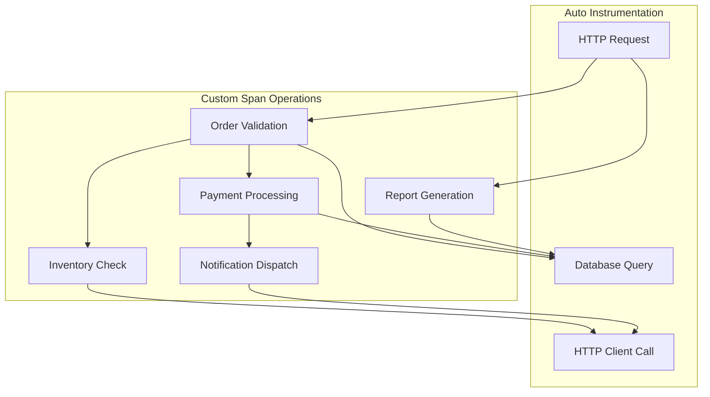
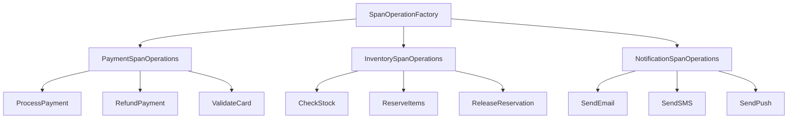
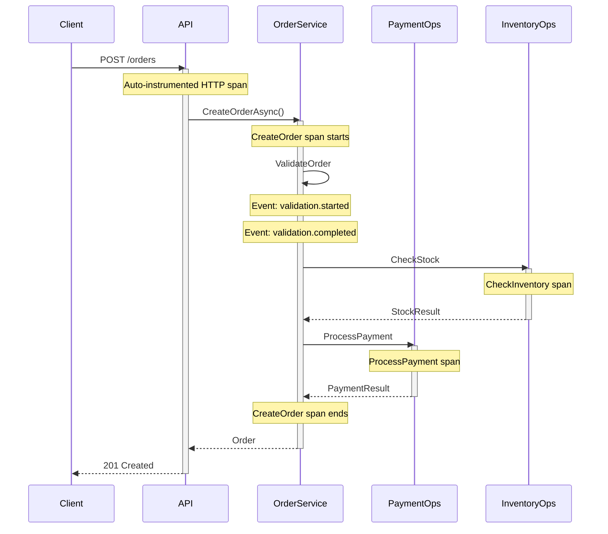

# How to Build Custom Span Operations in .NET

Author: [nawazdhandala](https://github.com/nawazdhandala)

Tags: .NET, C#, OpenTelemetry, Spans, Tracing, Observability, ActivitySource, Distributed Systems

Description: Learn how to build reusable, production-ready custom span operations in .NET using OpenTelemetry. Covers span factories, automatic timing, error handling patterns, and composable instrumentation strategies.

---

Standard OpenTelemetry instrumentation captures HTTP requests and database calls automatically. But when you need to trace complex business operations, batch processing, or custom workflows, you need to build your own span operations. This guide shows you how to create production-ready custom spans that are reusable, composable, and packed with meaningful data.

## Why Custom Span Operations

Auto-instrumentation gives you the basics: HTTP requests, SQL queries, and framework-level operations. Custom span operations let you trace what actually matters to your business:

- Order processing pipelines
- Payment workflows
- Data transformation jobs
- Background task execution
- Third-party API integrations
- File processing operations



## Setting Up the Foundation

Before building custom operations, configure OpenTelemetry in your application.

Install the required NuGet packages for tracing support:

```bash
dotnet add package OpenTelemetry.Extensions.Hosting
dotnet add package OpenTelemetry.Exporter.OpenTelemetryProtocol
dotnet add package OpenTelemetry.Instrumentation.AspNetCore
```

Configure OpenTelemetry in Program.cs with your custom ActivitySource:

```csharp
using OpenTelemetry.Resources;
using OpenTelemetry.Trace;

var builder = WebApplication.CreateBuilder(args);

var serviceName = builder.Configuration["ServiceName"] ?? "order-service";
var serviceVersion = "1.0.0";

builder.Services.AddOpenTelemetry()
    .ConfigureResource(resource => resource
        .AddService(serviceName, serviceVersion: serviceVersion)
        .AddAttributes(new Dictionary<string, object>
        {
            ["deployment.environment"] = builder.Environment.EnvironmentName
        }))
    .WithTracing(tracing => tracing
        // Register all custom ActivitySource names
        .AddSource("OrderOperations")
        .AddSource("PaymentOperations")
        .AddSource("InventoryOperations")
        .AddSource("NotificationOperations")
        .AddAspNetCoreInstrumentation()
        .AddOtlpExporter(options =>
        {
            options.Endpoint = new Uri(
                builder.Configuration["Otlp:Endpoint"] ?? "http://localhost:4317");
        }));

var app = builder.Build();
app.Run();
```

## Building a Span Operation Factory

Rather than scattering `StartActivity` calls throughout your code, create a factory that standardizes span creation with consistent naming, tagging, and error handling.

The following SpanOperationFactory class provides a centralized way to create spans with automatic timing and standard attributes:

```csharp
using System.Diagnostics;
using System.Runtime.CompilerServices;

public interface ISpanOperationFactory
{
    SpanOperation StartOperation(
        string operationName,
        SpanOperationOptions? options = null,
        [CallerMemberName] string? callerName = null);
}

public class SpanOperationFactory : ISpanOperationFactory
{
    private readonly ActivitySource _activitySource;
    private readonly string _serviceName;

    public SpanOperationFactory(string activitySourceName, string serviceName)
    {
        _activitySource = new ActivitySource(activitySourceName);
        _serviceName = serviceName;
    }

    public SpanOperation StartOperation(
        string operationName,
        SpanOperationOptions? options = null,
        [CallerMemberName] string? callerName = null)
    {
        options ??= new SpanOperationOptions();

        var activity = _activitySource.StartActivity(
            operationName,
            options.Kind);

        if (activity == null)
        {
            // Tracing is disabled or sampled out
            return new SpanOperation(null, operationName);
        }

        // Add standard attributes
        activity.SetTag("service.name", _serviceName);
        activity.SetTag("code.function", callerName);

        if (options.EntityId != null)
        {
            activity.SetTag("entity.id", options.EntityId);
        }

        if (options.EntityType != null)
        {
            activity.SetTag("entity.type", options.EntityType);
        }

        // Add custom attributes
        foreach (var attribute in options.Attributes)
        {
            activity.SetTag(attribute.Key, attribute.Value);
        }

        return new SpanOperation(activity, operationName);
    }
}

public class SpanOperationOptions
{
    public ActivityKind Kind { get; set; } = ActivityKind.Internal;
    public string? EntityId { get; set; }
    public string? EntityType { get; set; }
    public Dictionary<string, object?> Attributes { get; set; } = new();
}
```

## Creating the SpanOperation Wrapper

The SpanOperation class wraps Activity and provides a fluent interface for adding attributes, recording events, and handling errors consistently:

```csharp
using System.Diagnostics;

public class SpanOperation : IDisposable
{
    private readonly Activity? _activity;
    private readonly string _operationName;
    private readonly Stopwatch _stopwatch;
    private bool _disposed;
    private bool _statusSet;

    public SpanOperation(Activity? activity, string operationName)
    {
        _activity = activity;
        _operationName = operationName;
        _stopwatch = Stopwatch.StartNew();
    }

    // Fluent method to add a single attribute
    public SpanOperation WithAttribute(string key, object? value)
    {
        _activity?.SetTag(key, value);
        return this;
    }

    // Fluent method to add multiple attributes at once
    public SpanOperation WithAttributes(Dictionary<string, object?> attributes)
    {
        foreach (var attr in attributes)
        {
            _activity?.SetTag(attr.Key, attr.Value);
        }
        return this;
    }

    // Record a point-in-time event within the span
    public SpanOperation RecordEvent(string name, Dictionary<string, object?>? attributes = null)
    {
        if (_activity == null) return this;

        var tags = attributes != null
            ? new ActivityTagsCollection(
                attributes.Select(a => new KeyValuePair<string, object?>(a.Key, a.Value)))
            : null;

        _activity.AddEvent(new ActivityEvent(name, tags: tags));
        return this;
    }

    // Mark the operation as successful with optional result data
    public SpanOperation SetSuccess(string? message = null)
    {
        _activity?.SetStatus(ActivityStatusCode.Ok, message);
        _statusSet = true;
        return this;
    }

    // Mark the operation as failed and record the exception
    public SpanOperation SetError(Exception exception)
    {
        if (_activity == null) return this;

        _activity.SetStatus(ActivityStatusCode.Error, exception.Message);
        _activity.RecordException(exception);
        _statusSet = true;
        return this;
    }

    // Mark the operation as failed with a custom error message
    public SpanOperation SetError(string errorMessage)
    {
        _activity?.SetStatus(ActivityStatusCode.Error, errorMessage);
        _statusSet = true;
        return this;
    }

    public void Dispose()
    {
        if (_disposed) return;
        _disposed = true;

        _stopwatch.Stop();

        // Add duration as an attribute for easy querying
        _activity?.SetTag("operation.duration_ms", _stopwatch.ElapsedMilliseconds);

        // Set default success status if not explicitly set
        if (!_statusSet)
        {
            _activity?.SetStatus(ActivityStatusCode.Ok);
        }

        _activity?.Dispose();
    }
}
```

## Using the Span Operation Factory

Here is how the factory pattern simplifies instrumentation across your services. Notice how the code focuses on business logic while tracing is handled consistently:

```csharp
public class OrderService
{
    private readonly ISpanOperationFactory _spanFactory;
    private readonly IPaymentService _paymentService;
    private readonly IInventoryService _inventoryService;
    private readonly AppDbContext _dbContext;

    public OrderService(
        ISpanOperationFactory spanFactory,
        IPaymentService paymentService,
        IInventoryService inventoryService,
        AppDbContext dbContext)
    {
        _spanFactory = spanFactory;
        _paymentService = paymentService;
        _inventoryService = inventoryService;
        _dbContext = dbContext;
    }

    public async Task<Order> CreateOrderAsync(CreateOrderRequest request)
    {
        using var operation = _spanFactory.StartOperation(
            "CreateOrder",
            new SpanOperationOptions
            {
                EntityType = "Order",
                Attributes = new Dictionary<string, object?>
                {
                    ["customer.id"] = request.CustomerId,
                    ["order.items_count"] = request.Items.Count,
                    ["order.total_amount"] = request.TotalAmount
                }
            });

        try
        {
            operation.RecordEvent("validation.started");
            await ValidateOrderAsync(request);
            operation.RecordEvent("validation.completed");

            operation.RecordEvent("inventory.check.started");
            var inventoryResult = await CheckInventoryAsync(request.Items);
            operation.RecordEvent("inventory.check.completed", new Dictionary<string, object?>
            {
                ["items_available"] = inventoryResult.AllAvailable
            });

            if (!inventoryResult.AllAvailable)
            {
                operation.SetError("Insufficient inventory");
                throw new InsufficientInventoryException(inventoryResult.UnavailableItems);
            }

            operation.RecordEvent("payment.processing.started");
            var paymentResult = await _paymentService.ProcessPaymentAsync(
                request.CustomerId,
                request.TotalAmount);
            operation.RecordEvent("payment.processing.completed", new Dictionary<string, object?>
            {
                ["transaction_id"] = paymentResult.TransactionId
            });

            operation
                .WithAttribute("payment.transaction_id", paymentResult.TransactionId);

            var order = new Order
            {
                Id = Guid.NewGuid(),
                CustomerId = request.CustomerId,
                Items = request.Items,
                TotalAmount = request.TotalAmount,
                PaymentTransactionId = paymentResult.TransactionId,
                Status = OrderStatus.Confirmed,
                CreatedAt = DateTime.UtcNow
            };

            _dbContext.Orders.Add(order);
            await _dbContext.SaveChangesAsync();

            operation
                .WithAttribute("order.id", order.Id.ToString())
                .SetSuccess();

            return order;
        }
        catch (Exception ex)
        {
            operation.SetError(ex);
            throw;
        }
    }
}
```

## Building Composable Span Operations

For complex workflows, create specialized operation classes that compose with the base factory.



Create domain-specific span operation builders that encapsulate naming conventions and required attributes:

```csharp
public class PaymentSpanOperations
{
    private readonly ISpanOperationFactory _factory;

    public PaymentSpanOperations(ISpanOperationFactory factory)
    {
        _factory = factory;
    }

    public SpanOperation StartPaymentProcessing(
        string customerId,
        decimal amount,
        string currency,
        string paymentMethod)
    {
        return _factory.StartOperation(
            "ProcessPayment",
            new SpanOperationOptions
            {
                Kind = ActivityKind.Client,
                EntityType = "Payment",
                EntityId = customerId,
                Attributes = new Dictionary<string, object?>
                {
                    ["payment.amount"] = amount,
                    ["payment.currency"] = currency,
                    ["payment.method"] = paymentMethod,
                    ["customer.id"] = customerId
                }
            });
    }

    public SpanOperation StartRefund(
        string transactionId,
        decimal amount,
        string reason)
    {
        return _factory.StartOperation(
            "ProcessRefund",
            new SpanOperationOptions
            {
                Kind = ActivityKind.Client,
                EntityType = "Refund",
                EntityId = transactionId,
                Attributes = new Dictionary<string, object?>
                {
                    ["refund.original_transaction_id"] = transactionId,
                    ["refund.amount"] = amount,
                    ["refund.reason"] = reason
                }
            });
    }

    public SpanOperation StartCardValidation(string cardToken)
    {
        return _factory.StartOperation(
            "ValidateCard",
            new SpanOperationOptions
            {
                Kind = ActivityKind.Client,
                EntityType = "CardValidation",
                Attributes = new Dictionary<string, object?>
                {
                    ["card.token_prefix"] = cardToken.Substring(0, 4)
                }
            });
    }
}
```

## Async Operation Wrapper

For async operations that may execute multiple steps, create a wrapper that handles timing and error capture automatically:

```csharp
public class AsyncSpanOperation : IAsyncDisposable
{
    private readonly Activity? _activity;
    private readonly Stopwatch _stopwatch;
    private readonly List<string> _completedSteps = new();
    private bool _disposed;
    private bool _statusSet;

    public AsyncSpanOperation(Activity? activity)
    {
        _activity = activity;
        _stopwatch = Stopwatch.StartNew();
    }

    public async Task<T> ExecuteStepAsync<T>(
        string stepName,
        Func<Task<T>> operation,
        Dictionary<string, object?>? attributes = null)
    {
        RecordEvent($"{stepName}.started");

        try
        {
            var result = await operation();

            _completedSteps.Add(stepName);
            var eventAttributes = attributes ?? new Dictionary<string, object?>();
            eventAttributes["step.success"] = true;

            RecordEvent($"{stepName}.completed", eventAttributes);

            return result;
        }
        catch (Exception ex)
        {
            var eventAttributes = attributes ?? new Dictionary<string, object?>();
            eventAttributes["step.success"] = false;
            eventAttributes["step.error"] = ex.Message;

            RecordEvent($"{stepName}.failed", eventAttributes);
            throw;
        }
    }

    public async Task ExecuteStepAsync(
        string stepName,
        Func<Task> operation,
        Dictionary<string, object?>? attributes = null)
    {
        await ExecuteStepAsync(stepName, async () =>
        {
            await operation();
            return true;
        }, attributes);
    }

    public void RecordEvent(string name, Dictionary<string, object?>? attributes = null)
    {
        if (_activity == null) return;

        var tags = attributes != null
            ? new ActivityTagsCollection(
                attributes.Select(a => new KeyValuePair<string, object?>(a.Key, a.Value)))
            : null;

        _activity.AddEvent(new ActivityEvent(name, tags: tags));
    }

    public void SetSuccess()
    {
        _activity?.SetStatus(ActivityStatusCode.Ok);
        _activity?.SetTag("operation.completed_steps", string.Join(",", _completedSteps));
        _statusSet = true;
    }

    public void SetError(Exception ex)
    {
        _activity?.SetStatus(ActivityStatusCode.Error, ex.Message);
        _activity?.RecordException(ex);
        _activity?.SetTag("operation.completed_steps", string.Join(",", _completedSteps));
        _activity?.SetTag("operation.failed_at_step", _completedSteps.Count + 1);
        _statusSet = true;
    }

    public async ValueTask DisposeAsync()
    {
        if (_disposed) return;
        _disposed = true;

        _stopwatch.Stop();
        _activity?.SetTag("operation.duration_ms", _stopwatch.ElapsedMilliseconds);
        _activity?.SetTag("operation.total_steps", _completedSteps.Count);

        if (!_statusSet)
        {
            _activity?.SetStatus(ActivityStatusCode.Ok);
        }

        _activity?.Dispose();
        await Task.CompletedTask;
    }
}
```

Usage example showing a multi-step workflow with automatic step tracking:

```csharp
public class OrderFulfillmentService
{
    private readonly ActivitySource _activitySource = new("OrderOperations");
    private readonly IInventoryService _inventory;
    private readonly IShippingService _shipping;
    private readonly INotificationService _notifications;

    public async Task FulfillOrderAsync(Order order)
    {
        var activity = _activitySource.StartActivity("FulfillOrder");
        await using var operation = new AsyncSpanOperation(activity);

        activity?.SetTag("order.id", order.Id.ToString());
        activity?.SetTag("order.items_count", order.Items.Count);

        try
        {
            // Each step is tracked with timing and success/failure status
            var reservation = await operation.ExecuteStepAsync(
                "ReserveInventory",
                () => _inventory.ReserveAsync(order.Items),
                new Dictionary<string, object?>
                {
                    ["items_count"] = order.Items.Count
                });

            var shippingLabel = await operation.ExecuteStepAsync(
                "CreateShippingLabel",
                () => _shipping.CreateLabelAsync(order.ShippingAddress),
                new Dictionary<string, object?>
                {
                    ["carrier"] = order.PreferredCarrier
                });

            await operation.ExecuteStepAsync(
                "UpdateOrderStatus",
                () => UpdateOrderStatusAsync(order, OrderStatus.Shipped, shippingLabel));

            await operation.ExecuteStepAsync(
                "SendNotification",
                () => _notifications.SendShippedNotificationAsync(order, shippingLabel));

            operation.SetSuccess();
        }
        catch (Exception ex)
        {
            operation.SetError(ex);
            throw;
        }
    }
}
```

## Batch Operation Spans

When processing multiple items, create spans that capture batch-level metrics:

```csharp
public class BatchSpanOperation : IDisposable
{
    private readonly Activity? _activity;
    private readonly Stopwatch _stopwatch;
    private int _processedCount;
    private int _successCount;
    private int _failureCount;
    private readonly List<string> _errors = new();
    private bool _disposed;

    public BatchSpanOperation(Activity? activity, int totalItems)
    {
        _activity = activity;
        _stopwatch = Stopwatch.StartNew();

        _activity?.SetTag("batch.total_items", totalItems);
    }

    public void RecordItemProcessed(bool success, string? error = null)
    {
        _processedCount++;

        if (success)
        {
            _successCount++;
        }
        else
        {
            _failureCount++;
            if (error != null && _errors.Count < 10)
            {
                _errors.Add(error);
            }
        }
    }

    public void RecordProgress(int currentIndex, int totalItems)
    {
        var percentComplete = (currentIndex * 100) / totalItems;

        // Record progress events at 25%, 50%, 75%, 100%
        if (percentComplete % 25 == 0)
        {
            _activity?.AddEvent(new ActivityEvent($"progress.{percentComplete}pct",
                tags: new ActivityTagsCollection
                {
                    { "processed", currentIndex },
                    { "remaining", totalItems - currentIndex }
                }));
        }
    }

    public void Dispose()
    {
        if (_disposed) return;
        _disposed = true;

        _stopwatch.Stop();

        _activity?.SetTag("batch.processed_count", _processedCount);
        _activity?.SetTag("batch.success_count", _successCount);
        _activity?.SetTag("batch.failure_count", _failureCount);
        _activity?.SetTag("batch.success_rate", _processedCount > 0
            ? Math.Round(_successCount * 100.0 / _processedCount, 2)
            : 0);
        _activity?.SetTag("batch.duration_ms", _stopwatch.ElapsedMilliseconds);
        _activity?.SetTag("batch.items_per_second", _processedCount > 0
            ? Math.Round(_processedCount * 1000.0 / _stopwatch.ElapsedMilliseconds, 2)
            : 0);

        if (_errors.Count > 0)
        {
            _activity?.SetTag("batch.sample_errors", string.Join("; ", _errors));
        }

        _activity?.SetStatus(
            _failureCount == 0 ? ActivityStatusCode.Ok : ActivityStatusCode.Error,
            _failureCount > 0 ? $"{_failureCount} items failed" : null);

        _activity?.Dispose();
    }
}
```

Example usage for batch import processing:

```csharp
public class DataImportService
{
    private readonly ActivitySource _activitySource = new("ImportOperations");
    private readonly AppDbContext _dbContext;

    public async Task ImportCustomersAsync(List<CustomerRecord> records)
    {
        var activity = _activitySource.StartActivity("ImportCustomers");
        using var batch = new BatchSpanOperation(activity, records.Count);

        activity?.SetTag("import.source", "csv");
        activity?.SetTag("import.record_type", "Customer");

        for (int i = 0; i < records.Count; i++)
        {
            var record = records[i];

            try
            {
                var customer = MapToCustomer(record);
                _dbContext.Customers.Add(customer);

                batch.RecordItemProcessed(success: true);
            }
            catch (Exception ex)
            {
                batch.RecordItemProcessed(
                    success: false,
                    error: $"Row {i}: {ex.Message}");
            }

            batch.RecordProgress(i + 1, records.Count);
        }

        await _dbContext.SaveChangesAsync();
    }
}
```

## Dependency Injection Registration

Register the span operation factories in your DI container for proper lifecycle management:

```csharp
// Program.cs or a ServiceCollectionExtensions class
public static class SpanOperationExtensions
{
    public static IServiceCollection AddSpanOperations(
        this IServiceCollection services,
        string serviceName)
    {
        // Register the base factory
        services.AddSingleton<ISpanOperationFactory>(sp =>
            new SpanOperationFactory("OrderOperations", serviceName));

        // Register domain-specific operation builders
        services.AddSingleton<PaymentSpanOperations>(sp =>
        {
            var baseFactory = new SpanOperationFactory("PaymentOperations", serviceName);
            return new PaymentSpanOperations(baseFactory);
        });

        services.AddSingleton<InventorySpanOperations>(sp =>
        {
            var baseFactory = new SpanOperationFactory("InventoryOperations", serviceName);
            return new InventorySpanOperations(baseFactory);
        });

        return services;
    }
}

// In Program.cs
builder.Services.AddSpanOperations("order-service");
```

## Span Operation Flow

Here is how spans flow through a typical order processing request:



## Testing Span Operations

Write tests to verify your span operations capture the correct data:

```csharp
using System.Diagnostics;
using Xunit;

public class SpanOperationTests
{
    [Fact]
    public void SpanOperation_SetsAttributesCorrectly()
    {
        // Arrange
        using var listener = new ActivityListener
        {
            ShouldListenTo = _ => true,
            Sample = (ref ActivityCreationOptions<ActivityContext> _) =>
                ActivitySamplingResult.AllData
        };
        ActivitySource.AddActivityListener(listener);

        var factory = new SpanOperationFactory("TestOperations", "test-service");
        Activity? capturedActivity = null;

        // Act
        using (var operation = factory.StartOperation("TestOp", new SpanOperationOptions
        {
            EntityId = "123",
            EntityType = "Order",
            Attributes = { ["custom.attr"] = "value" }
        }))
        {
            capturedActivity = Activity.Current;
            operation.WithAttribute("another.attr", 42);
        }

        // Assert
        Assert.NotNull(capturedActivity);
        Assert.Equal("123", capturedActivity.GetTagItem("entity.id"));
        Assert.Equal("Order", capturedActivity.GetTagItem("entity.type"));
        Assert.Equal("value", capturedActivity.GetTagItem("custom.attr"));
        Assert.Equal(42, capturedActivity.GetTagItem("another.attr"));
    }

    [Fact]
    public void SpanOperation_RecordsErrorCorrectly()
    {
        using var listener = new ActivityListener
        {
            ShouldListenTo = _ => true,
            Sample = (ref ActivityCreationOptions<ActivityContext> _) =>
                ActivitySamplingResult.AllData
        };
        ActivitySource.AddActivityListener(listener);

        var factory = new SpanOperationFactory("TestOperations", "test-service");
        Activity? capturedActivity = null;
        var testException = new InvalidOperationException("Test error");

        using (var operation = factory.StartOperation("ErrorOp"))
        {
            capturedActivity = Activity.Current;
            operation.SetError(testException);
        }

        Assert.NotNull(capturedActivity);
        Assert.Equal(ActivityStatusCode.Error, capturedActivity.Status);
        Assert.Equal("Test error", capturedActivity.StatusDescription);
    }
}
```

## Summary

| Pattern | Use Case |
|---------|----------|
| **SpanOperationFactory** | Centralized span creation with consistent attributes |
| **SpanOperation** | Wrapper with fluent interface for attributes and events |
| **Domain-specific Operations** | Pre-configured spans for payment, inventory, etc. |
| **AsyncSpanOperation** | Multi-step workflows with automatic step tracking |
| **BatchSpanOperation** | Bulk processing with progress and success metrics |

Custom span operations give you fine-grained visibility into your .NET applications. By building reusable patterns, you maintain consistency across services while capturing the business-level data that matters for debugging and monitoring. Start with the factory pattern, add domain-specific builders as needed, and use specialized wrappers for batch and async workflows.
