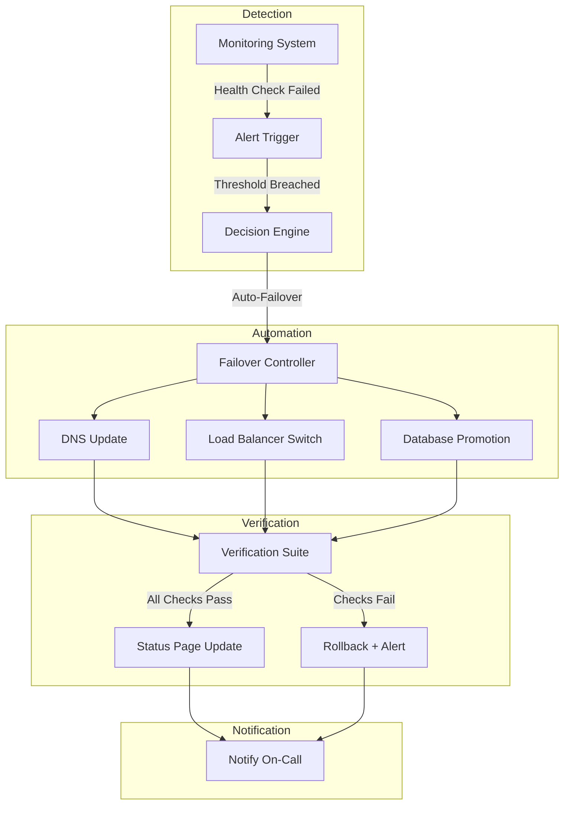
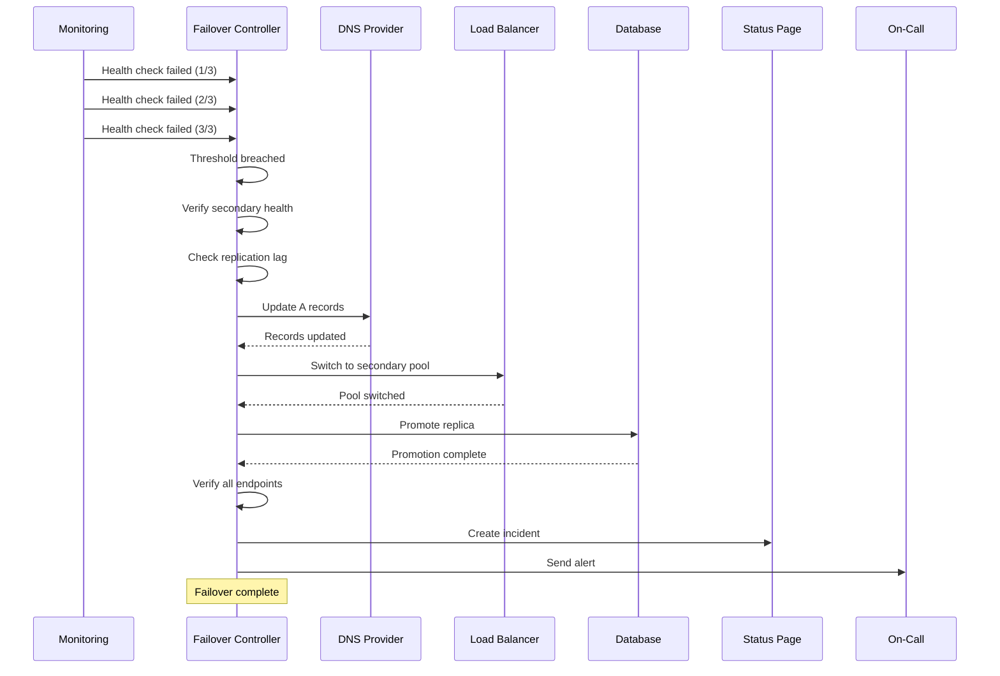

# How to Implement DR Automation

Author: [nawazdhandala](https://github.com/nawazdhandala)

Tags: Disaster Recovery, Automation, Infrastructure, Reliability

Description: A practical guide to automating disaster recovery with scripts, runbooks, and workflows that eliminate manual intervention during outages.

---

Manual disaster recovery is a promise waiting to be broken. When production goes down at 3 AM, the last thing you want is an engineer fumbling through a wiki page while customers watch their dashboards go dark. DR automation removes the human bottleneck and turns recovery into a predictable, tested, and fast operation.

This guide covers the building blocks of automated DR: failover triggers, DNS updates, data sync verification, and the runbooks that tie them together.

## The Automated DR Stack



## Prerequisites for DR Automation

Before you automate, you need:

1. **Defined RTO and RPO** for each service tier
2. **Secondary infrastructure** that mirrors production
3. **Replication pipelines** for databases and persistent storage
4. **DNS provider API access** with scoped tokens
5. **Health check endpoints** on all critical services

## Automated Failover Controller

The failover controller is the brain of your DR automation. It receives signals from monitoring, evaluates conditions, and orchestrates the recovery steps.

### Failover Controller Script

```python
#!/usr/bin/env python3
"""
dr_failover.py - Automated disaster recovery failover controller
"""

import os
import sys
import json
import time
import logging
import requests
from datetime import datetime
from typing import Dict, List, Optional

logging.basicConfig(
    level=logging.INFO,
    format='%(asctime)s - %(levelname)s - %(message)s'
)
logger = logging.getLogger(__name__)

class FailoverController:
    def __init__(self, config_path: str):
        with open(config_path) as f:
            self.config = json.load(f)

        self.primary_region = self.config['primary_region']
        self.secondary_region = self.config['secondary_region']
        self.dns_provider = self.config['dns_provider']
        self.health_endpoints = self.config['health_endpoints']
        self.failover_threshold = self.config.get('failover_threshold', 3)
        self.check_interval = self.config.get('check_interval', 10)

        self.consecutive_failures = 0
        self.is_failed_over = False

    def check_primary_health(self) -> bool:
        """Check health of all primary region endpoints."""
        for endpoint in self.health_endpoints:
            try:
                url = f"https://{self.primary_region}.{endpoint['domain']}{endpoint['path']}"
                response = requests.get(url, timeout=5)
                if response.status_code != 200:
                    logger.warning(f"Unhealthy: {url} returned {response.status_code}")
                    return False
            except requests.RequestException as e:
                logger.warning(f"Failed to reach {url}: {e}")
                return False
        return True

    def check_secondary_health(self) -> bool:
        """Verify secondary region is ready to receive traffic."""
        for endpoint in self.health_endpoints:
            try:
                url = f"https://{self.secondary_region}.{endpoint['domain']}{endpoint['path']}"
                response = requests.get(url, timeout=5)
                if response.status_code != 200:
                    logger.error(f"Secondary unhealthy: {url}")
                    return False
            except requests.RequestException as e:
                logger.error(f"Secondary unreachable: {e}")
                return False
        return True

    def verify_replication_lag(self) -> bool:
        """Check that database replication is within acceptable bounds."""
        max_lag_seconds = self.config.get('max_replication_lag_seconds', 60)

        try:
            response = requests.get(
                f"https://{self.secondary_region}.{self.config['db_status_endpoint']}",
                timeout=10
            )
            status = response.json()
            lag = status.get('replication_lag_seconds', 0)

            if lag > max_lag_seconds:
                logger.warning(f"Replication lag {lag}s exceeds threshold {max_lag_seconds}s")
                return False

            logger.info(f"Replication lag: {lag}s (threshold: {max_lag_seconds}s)")
            return True
        except Exception as e:
            logger.error(f"Failed to check replication lag: {e}")
            return False

    def execute_failover(self) -> bool:
        """Execute the full failover sequence."""
        logger.info("=== INITIATING AUTOMATED FAILOVER ===")

        # Step 1: Verify secondary is healthy
        if not self.check_secondary_health():
            logger.error("Secondary region not healthy. Aborting failover.")
            return False

        # Step 2: Check replication status
        if not self.verify_replication_lag():
            logger.warning("Replication lag high. Proceeding with caution.")

        # Step 3: Update DNS
        if not self.update_dns():
            logger.error("DNS update failed. Aborting failover.")
            return False

        # Step 4: Update load balancer
        if not self.update_load_balancer():
            logger.error("Load balancer update failed. Rolling back DNS.")
            self.rollback_dns()
            return False

        # Step 5: Promote database replica
        if not self.promote_database():
            logger.error("Database promotion failed. Manual intervention required.")
            return False

        # Step 6: Verify failover
        if not self.verify_failover():
            logger.error("Failover verification failed. Check manually.")
            return False

        # Step 7: Update status page
        self.update_status_page("Failover complete. Services running from secondary region.")

        self.is_failed_over = True
        logger.info("=== FAILOVER COMPLETE ===")
        return True

    def update_dns(self) -> bool:
        """Update DNS records to point to secondary region."""
        logger.info("Updating DNS records...")

        dns_api_token = os.environ.get('DNS_API_TOKEN')
        if not dns_api_token:
            logger.error("DNS_API_TOKEN not set")
            return False

        for record in self.config['dns_records']:
            try:
                response = requests.put(
                    f"{self.dns_provider}/zones/{record['zone_id']}/records/{record['record_id']}",
                    headers={
                        'Authorization': f'Bearer {dns_api_token}',
                        'Content-Type': 'application/json'
                    },
                    json={
                        'type': record['type'],
                        'name': record['name'],
                        'content': self.config['secondary_ips'][record['name']],
                        'ttl': 60  # Low TTL during failover
                    },
                    timeout=30
                )

                if response.status_code not in [200, 201]:
                    logger.error(f"DNS update failed for {record['name']}: {response.text}")
                    return False

                logger.info(f"DNS updated: {record['name']} -> {self.config['secondary_ips'][record['name']]}")

            except Exception as e:
                logger.error(f"DNS update exception: {e}")
                return False

        # Wait for DNS propagation
        logger.info("Waiting for DNS propagation...")
        time.sleep(30)
        return True

    def update_load_balancer(self) -> bool:
        """Switch load balancer to secondary backend pool."""
        logger.info("Updating load balancer configuration...")

        lb_api_token = os.environ.get('LB_API_TOKEN')
        if not lb_api_token:
            logger.error("LB_API_TOKEN not set")
            return False

        try:
            response = requests.post(
                f"{self.config['lb_api_endpoint']}/pools/{self.config['lb_pool_id']}/switch",
                headers={'Authorization': f'Bearer {lb_api_token}'},
                json={'target_pool': self.config['secondary_pool_id']},
                timeout=30
            )

            if response.status_code != 200:
                logger.error(f"Load balancer switch failed: {response.text}")
                return False

            logger.info("Load balancer switched to secondary pool")
            return True

        except Exception as e:
            logger.error(f"Load balancer update exception: {e}")
            return False

    def promote_database(self) -> bool:
        """Promote secondary database to primary."""
        logger.info("Promoting secondary database...")

        db_api_token = os.environ.get('DB_API_TOKEN')
        if not db_api_token:
            logger.error("DB_API_TOKEN not set")
            return False

        try:
            response = requests.post(
                f"{self.config['db_api_endpoint']}/replicas/{self.config['secondary_db_id']}/promote",
                headers={'Authorization': f'Bearer {db_api_token}'},
                timeout=60
            )

            if response.status_code != 200:
                logger.error(f"Database promotion failed: {response.text}")
                return False

            logger.info("Database promoted successfully")
            return True

        except Exception as e:
            logger.error(f"Database promotion exception: {e}")
            return False

    def verify_failover(self) -> bool:
        """Verify all services are responding from secondary region."""
        logger.info("Verifying failover...")

        for endpoint in self.health_endpoints:
            try:
                url = f"https://{endpoint['domain']}{endpoint['path']}"
                response = requests.get(url, timeout=10)

                if response.status_code != 200:
                    logger.error(f"Verification failed: {url} returned {response.status_code}")
                    return False

                # Check response header for region confirmation
                served_from = response.headers.get('X-Served-From', 'unknown')
                if served_from != self.secondary_region:
                    logger.warning(f"Region mismatch: expected {self.secondary_region}, got {served_from}")

                logger.info(f"Verified: {url} (served from {served_from})")

            except Exception as e:
                logger.error(f"Verification exception for {url}: {e}")
                return False

        return True

    def update_status_page(self, message: str):
        """Update public status page with current state."""
        status_api_token = os.environ.get('STATUS_PAGE_TOKEN')
        if not status_api_token:
            logger.warning("STATUS_PAGE_TOKEN not set, skipping status update")
            return

        try:
            requests.post(
                f"{self.config['status_page_endpoint']}/incidents",
                headers={'Authorization': f'Bearer {status_api_token}'},
                json={
                    'title': 'DR Failover Executed',
                    'status': 'investigating',
                    'body': message,
                    'affected_components': self.config.get('status_page_components', [])
                },
                timeout=10
            )
            logger.info("Status page updated")
        except Exception as e:
            logger.warning(f"Status page update failed: {e}")

    def rollback_dns(self):
        """Rollback DNS to primary region."""
        logger.info("Rolling back DNS to primary region...")
        # Implementation mirrors update_dns but uses primary_ips

    def run(self):
        """Main monitoring loop."""
        logger.info(f"Starting DR automation. Monitoring {self.primary_region}")

        while True:
            if self.check_primary_health():
                self.consecutive_failures = 0
                logger.debug("Primary healthy")
            else:
                self.consecutive_failures += 1
                logger.warning(f"Primary unhealthy ({self.consecutive_failures}/{self.failover_threshold})")

                if self.consecutive_failures >= self.failover_threshold and not self.is_failed_over:
                    logger.critical("Failover threshold reached!")
                    self.execute_failover()

            time.sleep(self.check_interval)


if __name__ == '__main__':
    config_path = sys.argv[1] if len(sys.argv) > 1 else '/etc/dr/config.json'
    controller = FailoverController(config_path)
    controller.run()
```

### Failover Configuration

```json
{
  "primary_region": "us-east-1",
  "secondary_region": "us-west-2",
  "failover_threshold": 3,
  "check_interval": 10,
  "max_replication_lag_seconds": 60,
  "dns_provider": "https://api.cloudflare.com/client/v4",
  "health_endpoints": [
    {
      "domain": "api.example.com",
      "path": "/health"
    },
    {
      "domain": "app.example.com",
      "path": "/health"
    }
  ],
  "dns_records": [
    {
      "zone_id": "abc123",
      "record_id": "def456",
      "type": "A",
      "name": "api.example.com"
    }
  ],
  "secondary_ips": {
    "api.example.com": "10.0.2.100",
    "app.example.com": "10.0.2.101"
  },
  "lb_api_endpoint": "https://lb.example.com/api/v1",
  "lb_pool_id": "pool-primary",
  "secondary_pool_id": "pool-secondary",
  "db_api_endpoint": "https://db.example.com/api/v1",
  "secondary_db_id": "db-replica-west",
  "db_status_endpoint": "db.example.com/status",
  "status_page_endpoint": "https://status.example.com/api/v1"
}
```

## Automated DNS Failover

DNS is often the first thing to update during a DR event. Here is a standalone script for automated DNS failover using Cloudflare as an example.

### DNS Failover Script

```bash
#!/bin/bash
# dns_failover.sh - Automated DNS failover script

set -euo pipefail

# Configuration
CLOUDFLARE_API="https://api.cloudflare.com/client/v4"
ZONE_ID="${CLOUDFLARE_ZONE_ID}"
API_TOKEN="${CLOUDFLARE_API_TOKEN}"

# Records to update (format: record_id:new_ip)
declare -A FAILOVER_RECORDS
FAILOVER_RECORDS["record_abc123"]="10.0.2.100"
FAILOVER_RECORDS["record_def456"]="10.0.2.101"

log() {
    echo "[$(date '+%Y-%m-%d %H:%M:%S')] $1"
}

update_dns_record() {
    local record_id=$1
    local new_ip=$2

    log "Updating record $record_id to $new_ip"

    response=$(curl -s -X PATCH \
        "${CLOUDFLARE_API}/zones/${ZONE_ID}/dns_records/${record_id}" \
        -H "Authorization: Bearer ${API_TOKEN}" \
        -H "Content-Type: application/json" \
        --data "{\"content\": \"${new_ip}\", \"ttl\": 60}")

    success=$(echo "$response" | jq -r '.success')

    if [ "$success" = "true" ]; then
        log "SUCCESS: Record $record_id updated"
        return 0
    else
        log "FAILED: Record $record_id - $(echo "$response" | jq -r '.errors')"
        return 1
    fi
}

verify_dns_propagation() {
    local domain=$1
    local expected_ip=$2
    local max_attempts=30
    local attempt=0

    log "Verifying DNS propagation for $domain"

    while [ $attempt -lt $max_attempts ]; do
        resolved_ip=$(dig +short "$domain" @8.8.8.8 | head -n1)

        if [ "$resolved_ip" = "$expected_ip" ]; then
            log "DNS propagated: $domain -> $resolved_ip"
            return 0
        fi

        log "Waiting for propagation... ($resolved_ip != $expected_ip)"
        sleep 10
        ((attempt++))
    done

    log "WARNING: DNS propagation timeout for $domain"
    return 1
}

main() {
    log "=== Starting DNS Failover ==="

    failed=0

    for record_id in "${!FAILOVER_RECORDS[@]}"; do
        if ! update_dns_record "$record_id" "${FAILOVER_RECORDS[$record_id]}"; then
            ((failed++))
        fi
    done

    if [ $failed -gt 0 ]; then
        log "ERROR: $failed record(s) failed to update"
        exit 1
    fi

    log "=== DNS Failover Complete ==="
    log "Waiting for propagation..."
    sleep 60

    log "=== DNS Failover Verified ==="
}

main "$@"
```

## Data Sync Verification

Before and after failover, you need to verify that data is consistent between regions. This script checks replication status and data integrity.

### Data Sync Verification Script

```python
#!/usr/bin/env python3
"""
verify_data_sync.py - Verify data synchronization between primary and secondary
"""

import os
import sys
import json
import hashlib
import psycopg2
import redis
from datetime import datetime, timedelta

class DataSyncVerifier:
    def __init__(self, config_path: str):
        with open(config_path) as f:
            self.config = json.load(f)

    def check_postgres_replication(self) -> dict:
        """Check PostgreSQL streaming replication status."""
        result = {
            'status': 'unknown',
            'lag_bytes': None,
            'lag_seconds': None,
            'replay_timestamp': None
        }

        try:
            conn = psycopg2.connect(
                host=self.config['primary_db_host'],
                database=self.config['database'],
                user=os.environ['DB_USER'],
                password=os.environ['DB_PASSWORD']
            )

            with conn.cursor() as cur:
                # Check replication lag
                cur.execute("""
                    SELECT
                        client_addr,
                        state,
                        pg_wal_lsn_diff(sent_lsn, replay_lsn) as lag_bytes,
                        replay_lag
                    FROM pg_stat_replication
                    WHERE client_addr = %s
                """, (self.config['secondary_db_host'],))

                row = cur.fetchone()
                if row:
                    result['status'] = row[1]
                    result['lag_bytes'] = row[2]
                    result['lag_seconds'] = row[3].total_seconds() if row[3] else 0

                    if result['lag_bytes'] < 1024 * 1024:  # Less than 1MB
                        result['healthy'] = True
                    else:
                        result['healthy'] = False
                else:
                    result['status'] = 'not_connected'
                    result['healthy'] = False

            conn.close()

        except Exception as e:
            result['error'] = str(e)
            result['healthy'] = False

        return result

    def check_redis_replication(self) -> dict:
        """Check Redis replication status."""
        result = {
            'status': 'unknown',
            'lag_bytes': None,
            'connected_slaves': 0
        }

        try:
            r = redis.Redis(
                host=self.config['primary_redis_host'],
                port=self.config.get('redis_port', 6379),
                password=os.environ.get('REDIS_PASSWORD')
            )

            info = r.info('replication')
            result['role'] = info.get('role')
            result['connected_slaves'] = info.get('connected_slaves', 0)

            # Check slave status
            if result['connected_slaves'] > 0:
                slave_info = info.get('slave0', '')
                if 'online' in str(slave_info):
                    result['status'] = 'connected'
                    result['lag_bytes'] = info.get('slave0', {}).get('offset', 0)
                    result['healthy'] = True
                else:
                    result['status'] = 'disconnected'
                    result['healthy'] = False
            else:
                result['status'] = 'no_slaves'
                result['healthy'] = False

        except Exception as e:
            result['error'] = str(e)
            result['healthy'] = False

        return result

    def verify_data_consistency(self) -> dict:
        """Spot-check data consistency between primary and secondary."""
        result = {
            'tables_checked': 0,
            'consistent': True,
            'discrepancies': []
        }

        try:
            primary_conn = psycopg2.connect(
                host=self.config['primary_db_host'],
                database=self.config['database'],
                user=os.environ['DB_USER'],
                password=os.environ['DB_PASSWORD']
            )

            secondary_conn = psycopg2.connect(
                host=self.config['secondary_db_host'],
                database=self.config['database'],
                user=os.environ['DB_USER'],
                password=os.environ['DB_PASSWORD']
            )

            for table in self.config.get('verification_tables', []):
                result['tables_checked'] += 1

                # Get row counts
                with primary_conn.cursor() as cur:
                    cur.execute(f"SELECT COUNT(*) FROM {table}")
                    primary_count = cur.fetchone()[0]

                with secondary_conn.cursor() as cur:
                    cur.execute(f"SELECT COUNT(*) FROM {table}")
                    secondary_count = cur.fetchone()[0]

                if primary_count != secondary_count:
                    result['consistent'] = False
                    result['discrepancies'].append({
                        'table': table,
                        'primary_count': primary_count,
                        'secondary_count': secondary_count,
                        'diff': primary_count - secondary_count
                    })

                # Check recent records checksum
                with primary_conn.cursor() as cur:
                    cur.execute(f"""
                        SELECT md5(array_agg(t.*)::text)
                        FROM (SELECT * FROM {table} ORDER BY id DESC LIMIT 1000) t
                    """)
                    primary_checksum = cur.fetchone()[0]

                with secondary_conn.cursor() as cur:
                    cur.execute(f"""
                        SELECT md5(array_agg(t.*)::text)
                        FROM (SELECT * FROM {table} ORDER BY id DESC LIMIT 1000) t
                    """)
                    secondary_checksum = cur.fetchone()[0]

                if primary_checksum != secondary_checksum:
                    result['consistent'] = False
                    result['discrepancies'].append({
                        'table': table,
                        'issue': 'checksum_mismatch',
                        'note': 'Recent 1000 rows differ'
                    })

            primary_conn.close()
            secondary_conn.close()

            result['healthy'] = result['consistent']

        except Exception as e:
            result['error'] = str(e)
            result['healthy'] = False

        return result

    def run_all_checks(self) -> dict:
        """Run all verification checks and return summary."""
        print("Running data sync verification...")

        results = {
            'timestamp': datetime.utcnow().isoformat(),
            'postgres_replication': self.check_postgres_replication(),
            'redis_replication': self.check_redis_replication(),
            'data_consistency': self.verify_data_consistency()
        }

        # Overall health
        results['all_healthy'] = all([
            results['postgres_replication'].get('healthy', False),
            results['redis_replication'].get('healthy', False),
            results['data_consistency'].get('healthy', False)
        ])

        return results


if __name__ == '__main__':
    config_path = sys.argv[1] if len(sys.argv) > 1 else '/etc/dr/sync_config.json'
    verifier = DataSyncVerifier(config_path)
    results = verifier.run_all_checks()
    print(json.dumps(results, indent=2, default=str))

    sys.exit(0 if results['all_healthy'] else 1)
```

## DR Runbook Template

Automation should be documented in runbooks that engineers can follow during incidents. Here is a template for an automated DR runbook.

### Automated DR Runbook

```markdown
# Disaster Recovery Runbook: Region Failover

## Overview
This runbook covers automated failover from us-east-1 to us-west-2 when primary region health checks fail.

## Automated Triggers
- 3 consecutive health check failures (30 seconds)
- Database replication lag > 5 minutes
- Manual trigger via PagerDuty or Slack command

## Pre-Failover Checklist (Automated)
- [ ] Secondary region health verified
- [ ] Replication lag within threshold
- [ ] DNS API token validated
- [ ] Load balancer API token validated
- [ ] Database API token validated

## Failover Sequence

### Step 1: Initiate Failover
**Automated Command:**
```bash
/opt/dr/failover.py --execute --region us-west-2
```

**Manual Override:**
```bash
/opt/dr/failover.py --execute --region us-west-2 --skip-health-check
```

### Step 2: DNS Update
- Records updated: api.example.com, app.example.com
- TTL reduced to 60 seconds
- Propagation wait: 60 seconds

### Step 3: Load Balancer Switch
- Primary pool drained
- Secondary pool activated
- Health checks verified

### Step 4: Database Promotion
- Replica promoted to primary
- Connection strings remain unchanged (via internal DNS)
- Write operations enabled

### Step 5: Verification
- All health endpoints return 200
- X-Served-From header confirms us-west-2
- Synthetic transactions pass

## Post-Failover Actions

### Immediate (Automated)
- Status page updated
- On-call notified via PagerDuty
- Incident channel created in Slack

### Within 1 Hour (Manual)
- [ ] Confirm customer impact assessment
- [ ] Update external status page with ETA
- [ ] Begin primary region investigation

### Within 24 Hours (Manual)
- [ ] Root cause identified
- [ ] Primary region restored
- [ ] Failback plan reviewed

## Failback Procedure

**Warning: Failback requires manual approval to prevent data conflicts.**

1. Verify primary region is healthy
2. Re-establish replication from secondary to primary
3. Wait for replication to catch up (lag < 1MB)
4. Execute failback during maintenance window:
   ```bash
   /opt/dr/failback.py --execute --target us-east-1 --maintenance-window
   ```

## Escalation Contacts
- Primary: On-call SRE (PagerDuty)
- Secondary: Infrastructure Lead
- Executive: VP Engineering (data loss scenarios only)
```

## Automated Failover Workflow

Here is the complete workflow showing how automated DR components interact.



## Testing DR Automation

Automated DR is worthless if you never test it. Schedule quarterly DR drills using this testing framework.

### DR Test Script

```bash
#!/bin/bash
# dr_test.sh - Automated DR testing framework

set -euo pipefail

TEST_MODE=${1:-"simulation"}  # simulation or live
LOG_FILE="/var/log/dr/test-$(date +%Y%m%d-%H%M%S).log"

log() {
    echo "[$(date '+%Y-%m-%d %H:%M:%S')] $1" | tee -a "$LOG_FILE"
}

simulate_primary_failure() {
    log "Simulating primary region failure..."

    if [ "$TEST_MODE" = "live" ]; then
        # Actually block traffic to primary
        iptables -A OUTPUT -d "$PRIMARY_REGION_CIDR" -j DROP
    else
        # Mock the health check responses
        curl -X POST "http://localhost:8080/mock/health?status=500"
    fi
}

verify_failover_executed() {
    log "Verifying failover execution..."

    # Check DNS points to secondary
    resolved=$(dig +short api.example.com @8.8.8.8)
    if [ "$resolved" = "$SECONDARY_IP" ]; then
        log "PASS: DNS points to secondary ($resolved)"
    else
        log "FAIL: DNS still points to $resolved"
        return 1
    fi

    # Check load balancer
    lb_pool=$(curl -s "https://lb.example.com/api/active-pool")
    if [ "$lb_pool" = "secondary" ]; then
        log "PASS: Load balancer on secondary pool"
    else
        log "FAIL: Load balancer on $lb_pool"
        return 1
    fi

    # Check application responds
    http_code=$(curl -s -o /dev/null -w "%{http_code}" https://api.example.com/health)
    if [ "$http_code" = "200" ]; then
        log "PASS: Application responding (HTTP $http_code)"
    else
        log "FAIL: Application returned HTTP $http_code"
        return 1
    fi
}

restore_primary() {
    log "Restoring primary region..."

    if [ "$TEST_MODE" = "live" ]; then
        iptables -D OUTPUT -d "$PRIMARY_REGION_CIDR" -j DROP
    else
        curl -X POST "http://localhost:8080/mock/health?status=200"
    fi
}

run_test() {
    log "=== DR Test Started (mode: $TEST_MODE) ==="

    # Record baseline
    log "Recording baseline metrics..."
    baseline_latency=$(curl -s -o /dev/null -w "%{time_total}" https://api.example.com/health)
    log "Baseline latency: ${baseline_latency}s"

    # Trigger failure
    simulate_primary_failure

    # Wait for failover
    log "Waiting for automated failover (max 2 minutes)..."
    sleep 120

    # Verify
    if verify_failover_executed; then
        log "=== DR Test PASSED ==="

        # Measure recovery metrics
        post_failover_latency=$(curl -s -o /dev/null -w "%{time_total}" https://api.example.com/health)
        log "Post-failover latency: ${post_failover_latency}s"
    else
        log "=== DR Test FAILED ==="
    fi

    # Cleanup
    restore_primary

    log "=== DR Test Complete ==="
}

run_test
```

## Monitoring DR Automation

Your DR automation needs its own monitoring. Track these metrics:

### Prometheus Metrics

```yaml
# dr_metrics.yaml
groups:
  - name: dr_automation
    rules:
      - alert: DRHealthCheckFailing
        expr: dr_primary_health_check_success == 0
        for: 1m
        labels:
          severity: warning
        annotations:
          summary: "Primary region health checks failing"

      - alert: DRReplicationLagHigh
        expr: dr_replication_lag_seconds > 300
        for: 5m
        labels:
          severity: critical
        annotations:
          summary: "Database replication lag exceeds 5 minutes"

      - alert: DRSecondaryUnhealthy
        expr: dr_secondary_health_check_success == 0
        for: 5m
        labels:
          severity: critical
        annotations:
          summary: "Secondary region unhealthy - failover will fail"

      - alert: DRFailoverExecuted
        expr: increase(dr_failover_executed_total[5m]) > 0
        labels:
          severity: critical
        annotations:
          summary: "DR failover was executed"

      - alert: DRTestOverdue
        expr: time() - dr_last_test_timestamp > 7776000  # 90 days
        labels:
          severity: warning
        annotations:
          summary: "DR test not run in 90 days"
```

## Common Pitfalls and How to Avoid Them

### 1. DNS Propagation Delays

**Problem:** Users still hit the dead primary because DNS is cached.

**Solution:**
- Keep production TTLs at 300 seconds or lower
- Use health-check-based DNS (Route53, Cloudflare) for automatic failover
- Implement client-side retry with exponential backoff

### 2. Database Replication Lag

**Problem:** Failover loses recent writes.

**Solution:**
- Monitor replication lag continuously
- Set acceptable RPO threshold in automation
- Consider synchronous replication for critical data (accept latency cost)

### 3. Secrets and Credentials

**Problem:** Failover scripts fail because API tokens expired or are missing.

**Solution:**
- Store all DR credentials in a secrets manager (HashiCorp Vault, AWS Secrets Manager)
- Rotate credentials automatically and update DR configs
- Test credential validity as part of daily DR health checks

### 4. Untested Automation

**Problem:** Automation worked six months ago but fails in production.

**Solution:**
- Run DR tests quarterly at minimum
- Use chaos engineering to randomly trigger failovers in staging
- Track automation code changes like any other critical system

## Final Thoughts

DR automation is not a one-time project. It requires continuous investment: testing, updating, and monitoring. The time you spend now will pay off the moment production goes down and your automation executes a clean failover while you sip coffee and watch the metrics recover.

Start with the basics: automate DNS failover, add replication verification, then build up to full orchestrated failover. Each piece you automate removes one more manual step that could fail at 3 AM.

The goal is not to eliminate humans from DR. The goal is to let humans focus on the hard problems while automation handles the predictable steps.
