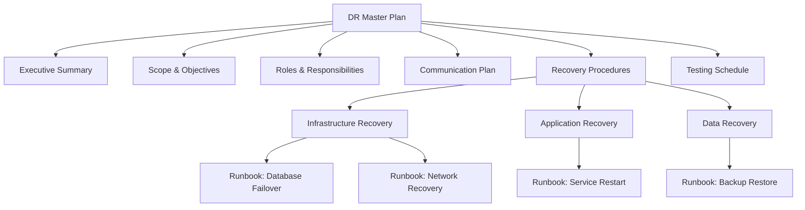
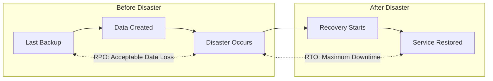
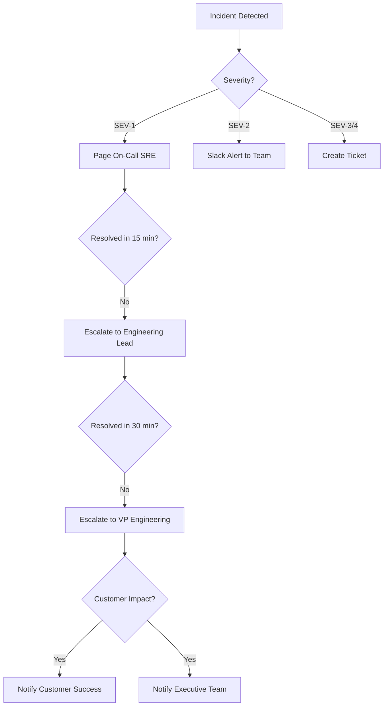
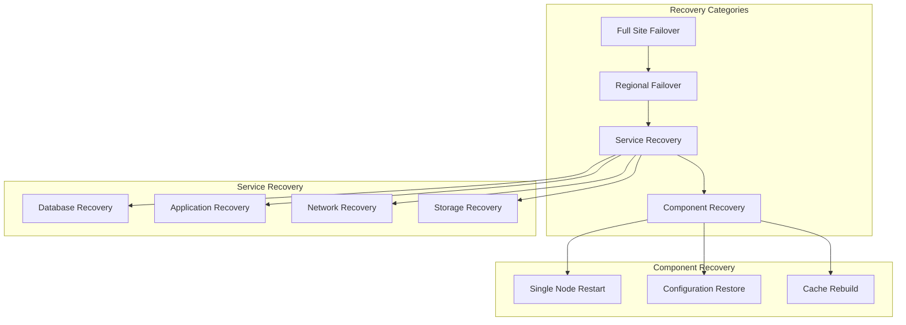
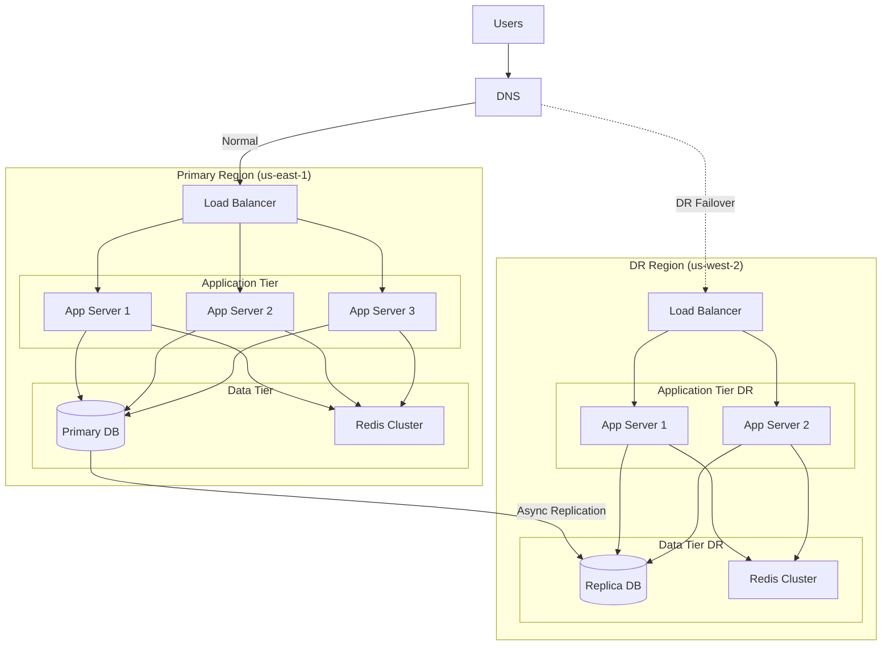
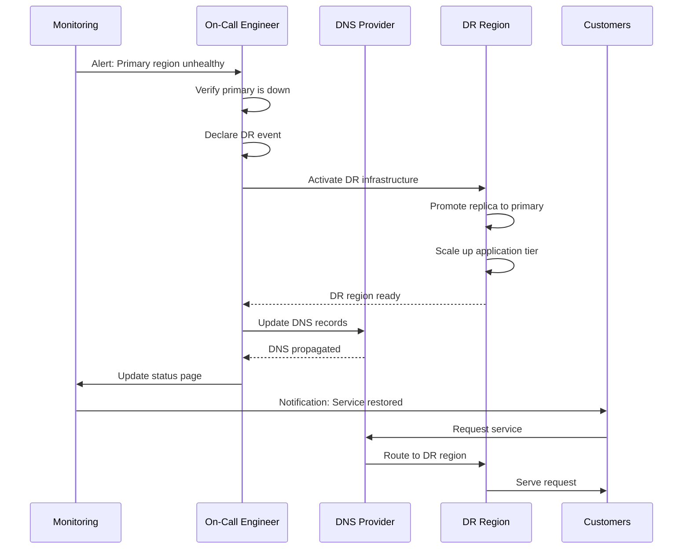
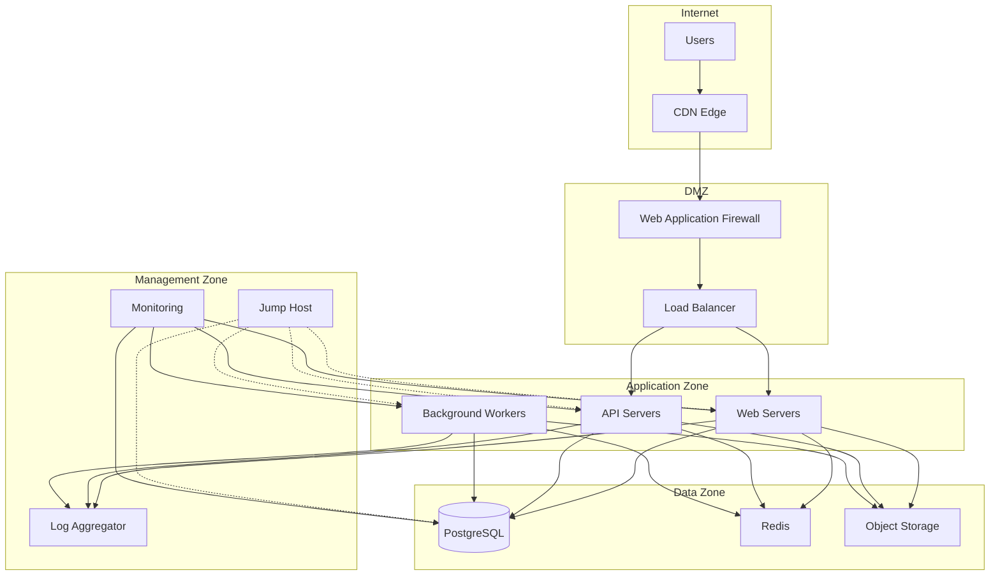
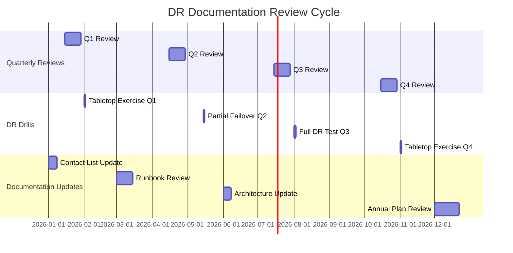

# How to Create DR Documentation

Author: [nawazdhandala](https://github.com/nawazdhandala)

Tags: Disaster Recovery, Documentation, SRE, Runbooks

Description: Learn how to create comprehensive disaster recovery documentation.

---

Disaster recovery (DR) documentation is the foundation of your organization's ability to respond to and recover from outages, data loss, or catastrophic failures. Without clear, up-to-date documentation, even the best-prepared teams can struggle during high-pressure incidents. This guide walks you through creating comprehensive DR documentation that your team can rely on when it matters most.

## Why DR Documentation Matters

When a disaster strikes, every second counts. Well-structured DR documentation:

- **Reduces recovery time** by providing clear, actionable steps
- **Eliminates guesswork** during high-stress situations
- **Enables any qualified team member** to execute recovery procedures
- **Ensures compliance** with regulatory requirements (SOC 2, ISO 27001, HIPAA)
- **Preserves institutional knowledge** even when key personnel are unavailable

## DR Plan Structure

A comprehensive DR plan should follow a hierarchical structure that makes information easy to find and follow. Here's the recommended structure:



### Essential Sections of a DR Plan

Create your DR plan with these core sections:

```yaml
# dr-plan-structure.yaml
dr_plan:
  version: "2.0"
  last_updated: "2026-01-30"
  next_review: "2026-04-30"

  sections:
    - name: "Executive Summary"
      description: "High-level overview for leadership"
      owner: "CTO"

    - name: "Scope and Objectives"
      description: "What systems are covered, RTO/RPO targets"
      owner: "DR Coordinator"

    - name: "Risk Assessment"
      description: "Identified threats and impact analysis"
      owner: "Security Team"

    - name: "Recovery Strategies"
      description: "Approach for each system tier"
      owner: "Infrastructure Lead"

    - name: "Detailed Procedures"
      description: "Step-by-step runbooks"
      owner: "SRE Team"

    - name: "Communication Plan"
      description: "Internal and external notification procedures"
      owner: "Communications Lead"

    - name: "Testing and Maintenance"
      description: "DR drill schedule and update procedures"
      owner: "DR Coordinator"
```

### Defining RTO and RPO

Every system in your DR plan should have clearly defined Recovery Time Objective (RTO) and Recovery Point Objective (RPO):



Document your RTO/RPO targets in a clear table format:

```markdown
| System Tier | Examples | RTO | RPO | Recovery Strategy |
|-------------|----------|-----|-----|-------------------|
| Tier 1 - Critical | Payment Processing, Auth | 15 min | 0 (sync replication) | Active-Active |
| Tier 2 - Important | Order Management, API | 1 hour | 15 min | Warm Standby |
| Tier 3 - Standard | Reporting, Analytics | 4 hours | 1 hour | Cold Standby |
| Tier 4 - Non-Critical | Dev/Test Environments | 24 hours | 24 hours | Backup Restore |
```

## Runbook Templates

Runbooks are the detailed, step-by-step procedures that engineers follow during recovery. A well-designed runbook template ensures consistency and completeness across all procedures.

### Standard Runbook Template

```markdown
# Runbook: [Procedure Name]

## Metadata
- **Document ID**: RB-[Category]-[Number]
- **Version**: X.Y
- **Last Updated**: YYYY-MM-DD
- **Owner**: [Team/Individual]
- **Reviewed By**: [Reviewer Name]
- **Next Review**: YYYY-MM-DD

## Overview
Brief description of what this runbook accomplishes and when to use it.

## Prerequisites
- [ ] Access credentials for [System X]
- [ ] VPN connection established
- [ ] Approval from [Role] (if required)

## Impact Assessment
- **Services Affected**: [List services]
- **Expected Downtime**: [Duration]
- **Customer Impact**: [Description]

## Procedure Steps

### Step 1: [Action Name]
**Estimated Time**: X minutes

```bash
# Command to execute
command --with-flags
```

**Expected Output**:
```
Success message or expected response
```

**If Error Occurs**:
- Error A: [Resolution steps]
- Error B: [Resolution steps]

### Step 2: [Next Action]
...

## Verification
How to confirm the procedure was successful:
- [ ] Check 1: [Description]
- [ ] Check 2: [Description]

## Rollback Procedure
Steps to undo changes if something goes wrong.

## Post-Recovery Tasks
- [ ] Update incident ticket
- [ ] Notify stakeholders
- [ ] Document any deviations
```

### Example: Database Failover Runbook

Here's a practical example of a database failover runbook:

```markdown
# Runbook: PostgreSQL Primary-to-Replica Failover

## Metadata
- **Document ID**: RB-DB-001
- **Version**: 3.2
- **Last Updated**: 2026-01-30
- **Owner**: Database Team
- **Reviewed By**: Sarah Chen
- **Next Review**: 2026-04-30

## Overview
This runbook describes the procedure to promote a PostgreSQL replica
to primary when the primary database server is unavailable.

## Prerequisites
- [ ] SSH access to replica servers
- [ ] Database admin credentials (stored in Vault at secret/db/admin)
- [ ] Access to DNS management console
- [ ] Incident channel created in Slack

## Impact Assessment
- **Services Affected**: All services using primary database
- **Expected Downtime**: 5-10 minutes
- **Customer Impact**: Brief service interruption, possible transaction rollback

## Procedure Steps

### Step 1: Verify Primary is Unavailable
**Estimated Time**: 2 minutes

```bash
# Check primary database connectivity
pg_isready -h db-primary.internal -p 5432

# Check replication lag on replica
psql -h db-replica-01.internal -U admin -c \
  "SELECT NOW() - pg_last_xact_replay_timestamp() AS replication_lag;"
```

**Expected Output** (confirming primary is down):
```
db-primary.internal:5432 - no response
```

### Step 2: Stop Replication on Target Replica
**Estimated Time**: 1 minute

```bash
# Connect to the replica to be promoted
ssh db-replica-01.internal

# Stop the replication process
sudo -u postgres pg_ctl stop -D /var/lib/postgresql/data -m fast
```

### Step 3: Promote Replica to Primary
**Estimated Time**: 2 minutes

```bash
# Promote the replica
sudo -u postgres pg_ctl promote -D /var/lib/postgresql/data

# Verify promotion was successful
psql -U admin -c "SELECT pg_is_in_recovery();"
```

**Expected Output**:
```
 pg_is_in_recovery
-------------------
 f
```

### Step 4: Update DNS Records
**Estimated Time**: 2 minutes

```bash
# Update internal DNS to point to new primary
# Using AWS Route53 as example
aws route53 change-resource-record-sets \
  --hosted-zone-id Z1234567890 \
  --change-batch '{
    "Changes": [{
      "Action": "UPSERT",
      "ResourceRecordSet": {
        "Name": "db-primary.internal",
        "Type": "CNAME",
        "TTL": 60,
        "ResourceRecords": [{"Value": "db-replica-01.internal"}]
      }
    }]
  }'
```

### Step 5: Verify Application Connectivity
**Estimated Time**: 2 minutes

```bash
# Test connection from application servers
for server in app-01 app-02 app-03; do
  echo "Testing from $server:"
  ssh $server "psql -h db-primary.internal -U app_user -c 'SELECT 1;'"
done
```

## Verification
- [ ] `pg_is_in_recovery()` returns `false` on new primary
- [ ] Application health checks are passing
- [ ] No database connection errors in application logs
- [ ] Monitoring shows queries executing on new primary

## Rollback Procedure
If the original primary comes back online, do NOT allow it to accept writes:
1. Keep original primary stopped
2. Rebuild original primary as a replica of new primary
3. Once caught up, evaluate whether to fail back

## Post-Recovery Tasks
- [ ] Update incident ticket with timeline
- [ ] Configure remaining replicas to follow new primary
- [ ] Review and rebuild failed server
- [ ] Schedule post-incident review
```

## Contact and Escalation Lists

Clear escalation paths are critical during an incident. Document who to contact, when to escalate, and how to reach each person.

### Escalation Matrix Structure



### Contact List Template

Store contact information in a structured, searchable format:

```yaml
# contacts/escalation-contacts.yaml
escalation_levels:
  - level: 1
    name: "On-Call Engineer"
    description: "First responder for all incidents"
    rotation_schedule: "https://pagerduty.com/schedules/oncall"
    response_time: "5 minutes"

  - level: 2
    name: "Engineering Lead"
    description: "Escalation for unresolved L1 issues"
    contacts:
      - name: "Alex Rivera"
        role: "Infrastructure Lead"
        phone: "+1-555-0101"
        slack: "@arivera"
        email: "arivera@company.com"
      - name: "Jordan Kim"
        role: "Platform Lead"
        phone: "+1-555-0102"
        slack: "@jkim"
        email: "jkim@company.com"
    response_time: "15 minutes"

  - level: 3
    name: "Director/VP Engineering"
    description: "Major incidents, business impact decisions"
    contacts:
      - name: "Morgan Chen"
        role: "VP Engineering"
        phone: "+1-555-0201"
        slack: "@mchen"
        email: "mchen@company.com"
    response_time: "30 minutes"

external_contacts:
  - category: "Cloud Provider"
    provider: "AWS"
    support_tier: "Enterprise"
    phone: "+1-800-555-0199"
    portal: "https://console.aws.amazon.com/support"
    account_id: "123456789012"

  - category: "DNS Provider"
    provider: "Cloudflare"
    support_tier: "Business"
    portal: "https://dash.cloudflare.com"
    account_email: "admin@company.com"

communication_channels:
  primary:
    type: "Slack"
    channel: "#incident-response"
    bridge_number: "+1-555-999-0001"

  backup:
    type: "Microsoft Teams"
    channel: "Incident Response"

  customer_communication:
    status_page: "https://status.company.com"
    admin_portal: "https://manage.statuspage.io"
```

### Automated Contact Lookup Script

Create a script to quickly find the right contact during an incident:

```python
#!/usr/bin/env python3
"""
DR Contact Lookup Tool
Quickly find escalation contacts during incidents.
"""

import yaml
import argparse
from datetime import datetime

def load_contacts(file_path="contacts/escalation-contacts.yaml"):
    """Load contact information from YAML file."""
    with open(file_path, 'r') as f:
        return yaml.safe_load(f)

def get_escalation_contact(level: int, contacts_data: dict) -> dict:
    """Get contact information for a specific escalation level."""
    for escalation in contacts_data['escalation_levels']:
        if escalation['level'] == level:
            return escalation
    return None

def get_external_contact(category: str, contacts_data: dict) -> dict:
    """Get external vendor contact by category."""
    for contact in contacts_data['external_contacts']:
        if contact['category'].lower() == category.lower():
            return contact
    return None

def print_contact_card(contact: dict):
    """Display contact information in a readable format."""
    print("\n" + "=" * 50)
    print(f"ESCALATION LEVEL {contact.get('level', 'N/A')}")
    print(f"Role: {contact['name']}")
    print(f"Response Time: {contact['response_time']}")
    print("-" * 50)

    if 'contacts' in contact:
        for person in contact['contacts']:
            print(f"\n  Name: {person['name']}")
            print(f"  Title: {person['role']}")
            print(f"  Phone: {person['phone']}")
            print(f"  Slack: {person['slack']}")
            print(f"  Email: {person['email']}")
    elif 'rotation_schedule' in contact:
        print(f"\n  See rotation: {contact['rotation_schedule']}")

    print("=" * 50)

if __name__ == "__main__":
    parser = argparse.ArgumentParser(description="DR Contact Lookup")
    parser.add_argument("--level", type=int, help="Escalation level (1-3)")
    parser.add_argument("--external", type=str, help="External contact category")
    args = parser.parse_args()

    contacts = load_contacts()

    if args.level:
        contact = get_escalation_contact(args.level, contacts)
        if contact:
            print_contact_card(contact)
        else:
            print(f"No contact found for level {args.level}")

    if args.external:
        contact = get_external_contact(args.external, contacts)
        if contact:
            print(f"\n{contact['category']} - {contact['provider']}")
            print(f"Support: {contact.get('phone', contact.get('portal'))}")
```

## Recovery Procedures

Recovery procedures should be organized by system type and severity. Here's how to structure them effectively.

### Recovery Procedure Hierarchy



### Infrastructure-as-Code for DR

Document your DR infrastructure using code. This ensures consistency and enables automated recovery:

```hcl
# terraform/dr-infrastructure/main.tf

# DR Region Configuration
provider "aws" {
  alias  = "dr_region"
  region = "us-west-2"  # DR region
}

# Replicated Database Instance
resource "aws_db_instance" "dr_replica" {
  provider = aws.dr_region

  identifier     = "production-db-dr-replica"
  instance_class = "db.r6g.xlarge"

  # Replicate from primary
  replicate_source_db = aws_db_instance.primary.arn

  # DR-specific settings
  multi_az               = true
  backup_retention_period = 7

  tags = {
    Environment = "dr"
    Purpose     = "disaster-recovery"
    RTO         = "1-hour"
    RPO         = "15-minutes"
  }
}

# DR Application Auto Scaling Group
resource "aws_autoscaling_group" "dr_app" {
  provider = aws.dr_region

  name                = "app-dr-asg"
  desired_capacity    = 0  # Scale up during DR activation
  min_size            = 0
  max_size            = 10

  launch_template {
    id      = aws_launch_template.dr_app.id
    version = "$Latest"
  }

  tag {
    key                 = "dr-ready"
    value               = "true"
    propagate_at_launch = true
  }
}

# DR Activation Script Output
output "dr_activation_steps" {
  value = <<-EOT
    DR Activation Procedure:
    1. Scale up DR ASG: aws autoscaling set-desired-capacity --auto-scaling-group-name app-dr-asg --desired-capacity 5 --region us-west-2
    2. Promote DR database replica
    3. Update DNS to point to DR region
    4. Verify application health checks
  EOT
}
```

### Kubernetes DR Recovery

For Kubernetes-based applications, document pod recovery procedures:

```yaml
# k8s/dr-recovery/app-deployment-dr.yaml
apiVersion: apps/v1
kind: Deployment
metadata:
  name: critical-app
  namespace: production
  labels:
    app: critical-app
    dr-tier: "1"
spec:
  replicas: 3
  selector:
    matchLabels:
      app: critical-app
  template:
    metadata:
      labels:
        app: critical-app
      annotations:
        dr.company.com/rto: "15m"
        dr.company.com/rpo: "0"
        dr.company.com/runbook: "https://wiki.company.com/runbooks/critical-app"
    spec:
      affinity:
        podAntiAffinity:
          requiredDuringSchedulingIgnoredDuringExecution:
            - labelSelector:
                matchLabels:
                  app: critical-app
              topologyKey: topology.kubernetes.io/zone
      containers:
        - name: app
          image: company/critical-app:v2.5.0
          resources:
            requests:
              memory: "512Mi"
              cpu: "500m"
            limits:
              memory: "1Gi"
              cpu: "1000m"
          readinessProbe:
            httpGet:
              path: /health
              port: 8080
            initialDelaySeconds: 10
            periodSeconds: 5
          livenessProbe:
            httpGet:
              path: /health
              port: 8080
            initialDelaySeconds: 30
            periodSeconds: 10
---
# DR Recovery Job
apiVersion: batch/v1
kind: Job
metadata:
  name: dr-recovery-verification
  namespace: production
spec:
  template:
    spec:
      containers:
        - name: verify
          image: company/dr-tools:latest
          command:
            - /bin/sh
            - -c
            - |
              echo "Verifying DR recovery..."

              # Check all critical pods are running
              kubectl get pods -l dr-tier=1 -n production | grep -v Running && exit 1

              # Verify database connectivity
              pg_isready -h $DB_HOST -p 5432 || exit 1

              # Run smoke tests
              curl -f http://critical-app:8080/health || exit 1

              echo "DR verification complete!"
          env:
            - name: DB_HOST
              valueFrom:
                configMapKeyRef:
                  name: dr-config
                  key: db_host
      restartPolicy: Never
  backoffLimit: 3
```

## Architecture Diagrams

Visual diagrams are essential for understanding system relationships and recovery paths. Include these diagram types in your DR documentation.

### High-Level Architecture



### Data Flow During Failover



### Network Topology Diagram



## Regular Review and Updates

DR documentation is only valuable if it's accurate. Establish a regular review and update process.

### Review Schedule



### Documentation Review Checklist

```yaml
# dr-review-checklist.yaml
review_checklist:
  contact_information:
    frequency: "monthly"
    items:
      - "Verify all phone numbers are current"
      - "Confirm email addresses are valid"
      - "Update on-call rotation schedules"
      - "Validate external vendor contacts"
      - "Test Slack/Teams channel access"

  runbooks:
    frequency: "quarterly"
    items:
      - "Execute each runbook in test environment"
      - "Verify all commands still work"
      - "Update screenshots if UI has changed"
      - "Confirm prerequisite tools are installed"
      - "Validate expected outputs match actual"

  architecture_diagrams:
    frequency: "quarterly"
    items:
      - "Compare diagrams to actual infrastructure"
      - "Add new services and dependencies"
      - "Remove decommissioned systems"
      - "Update IP addresses and endpoints"
      - "Verify DR region configuration matches"

  recovery_procedures:
    frequency: "semi-annually"
    items:
      - "Test full recovery in DR region"
      - "Measure actual RTO against target"
      - "Verify data integrity (RPO compliance)"
      - "Document any gaps or issues found"
      - "Update procedures based on findings"

  compliance:
    frequency: "annually"
    items:
      - "Review against compliance requirements"
      - "Update risk assessment"
      - "Conduct tabletop exercises"
      - "Train new team members"
      - "Archive old document versions"
```

### Automated Documentation Validation

Create automated checks to ensure documentation stays current:

```python
#!/usr/bin/env python3
"""
DR Documentation Validator
Checks that DR documentation is current and complete.
"""

import os
import yaml
from datetime import datetime, timedelta
from pathlib import Path

class DRDocValidator:
    def __init__(self, docs_path: str):
        self.docs_path = Path(docs_path)
        self.issues = []

    def check_last_updated(self, max_age_days: int = 90):
        """Check that documents were updated within threshold."""
        print("Checking document freshness...")

        for doc in self.docs_path.rglob("*.md"):
            stat = doc.stat()
            age = datetime.now() - datetime.fromtimestamp(stat.st_mtime)

            if age.days > max_age_days:
                self.issues.append({
                    "file": str(doc),
                    "issue": f"Document not updated in {age.days} days",
                    "severity": "warning"
                })

    def validate_runbook_structure(self):
        """Ensure runbooks have required sections."""
        required_sections = [
            "## Metadata",
            "## Prerequisites",
            "## Procedure Steps",
            "## Verification",
            "## Rollback"
        ]

        print("Validating runbook structure...")

        for runbook in self.docs_path.rglob("runbook-*.md"):
            content = runbook.read_text()

            for section in required_sections:
                if section not in content:
                    self.issues.append({
                        "file": str(runbook),
                        "issue": f"Missing required section: {section}",
                        "severity": "error"
                    })

    def check_contact_validity(self):
        """Verify contact information files are valid."""
        print("Checking contact information...")

        contact_file = self.docs_path / "contacts" / "escalation-contacts.yaml"

        if not contact_file.exists():
            self.issues.append({
                "file": str(contact_file),
                "issue": "Contact file not found",
                "severity": "critical"
            })
            return

        try:
            contacts = yaml.safe_load(contact_file.read_text())

            # Check for required fields
            for level in contacts.get('escalation_levels', []):
                if 'contacts' in level:
                    for contact in level['contacts']:
                        if not contact.get('phone'):
                            self.issues.append({
                                "file": str(contact_file),
                                "issue": f"Missing phone for {contact.get('name')}",
                                "severity": "error"
                            })
        except yaml.YAMLError as e:
            self.issues.append({
                "file": str(contact_file),
                "issue": f"Invalid YAML: {e}",
                "severity": "critical"
            })

    def generate_report(self) -> dict:
        """Generate validation report."""
        return {
            "timestamp": datetime.now().isoformat(),
            "total_issues": len(self.issues),
            "critical": len([i for i in self.issues if i['severity'] == 'critical']),
            "errors": len([i for i in self.issues if i['severity'] == 'error']),
            "warnings": len([i for i in self.issues if i['severity'] == 'warning']),
            "issues": self.issues
        }

if __name__ == "__main__":
    validator = DRDocValidator("./dr-documentation")
    validator.check_last_updated()
    validator.validate_runbook_structure()
    validator.check_contact_validity()

    report = validator.generate_report()

    print(f"\n{'='*50}")
    print("DR Documentation Validation Report")
    print(f"{'='*50}")
    print(f"Total Issues: {report['total_issues']}")
    print(f"  Critical: {report['critical']}")
    print(f"  Errors: {report['errors']}")
    print(f"  Warnings: {report['warnings']}")

    if report['issues']:
        print(f"\n{'='*50}")
        print("Issues Found:")
        for issue in report['issues']:
            print(f"\n[{issue['severity'].upper()}] {issue['file']}")
            print(f"  {issue['issue']}")
```

## Best Practices Summary

When creating DR documentation, follow these best practices:

1. **Keep it Simple**: Write for someone who may be stressed and fatigued. Use clear language and numbered steps.

2. **Version Control Everything**: Store documentation in Git. Track changes and maintain history.

3. **Test Regularly**: Documentation that hasn't been tested is just theory. Run DR drills quarterly.

4. **Automate Where Possible**: Use scripts to reduce human error during recovery.

5. **Single Source of Truth**: Maintain one authoritative location for DR docs. Avoid duplicates.

6. **Include Context**: Explain why steps are needed, not just what to do.

7. **Plan for Partial Failures**: Not every disaster is complete. Document procedures for partial outages.

8. **Document Dependencies**: Map out what depends on what. Recovery order matters.

## Conclusion

Creating comprehensive DR documentation is an investment that pays dividends during your organization's most critical moments. By following the structures and templates outlined in this guide, you'll build documentation that enables fast, confident recovery from any disaster scenario.

Remember: the best DR documentation is living documentation. Review it regularly, test it often, and update it whenever your systems change. Your future self, and your team, will thank you when disaster strikes.

Start small if needed - even basic documentation is better than none. Focus first on your most critical systems (Tier 1), and expand from there. The goal is progress, not perfection.

---

*Need help monitoring your disaster recovery readiness? OneUptime provides comprehensive monitoring and alerting to help you detect issues before they become disasters. [Learn more about OneUptime's monitoring capabilities](https://oneuptime.com).*
