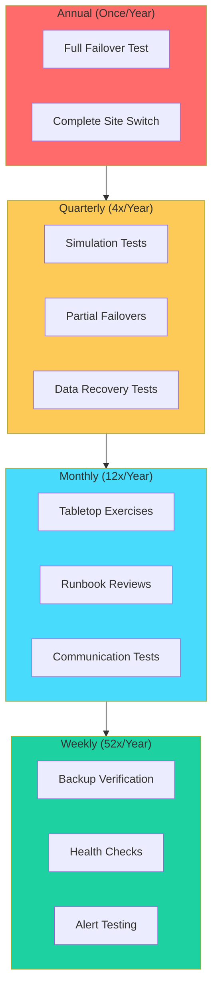
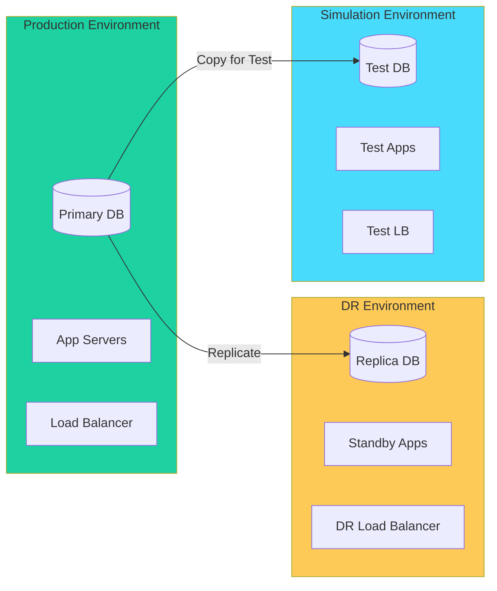
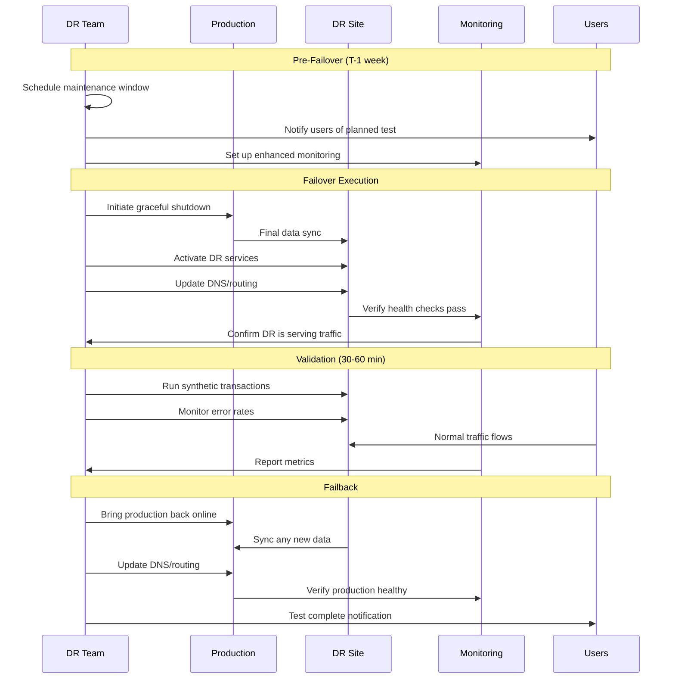
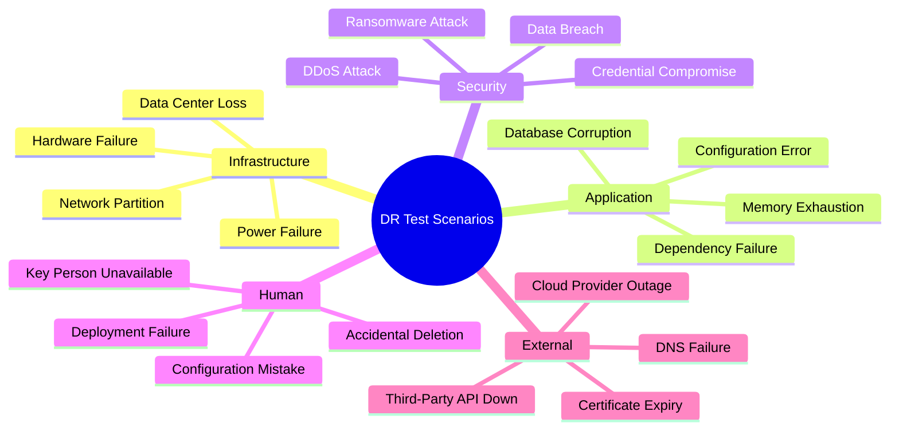
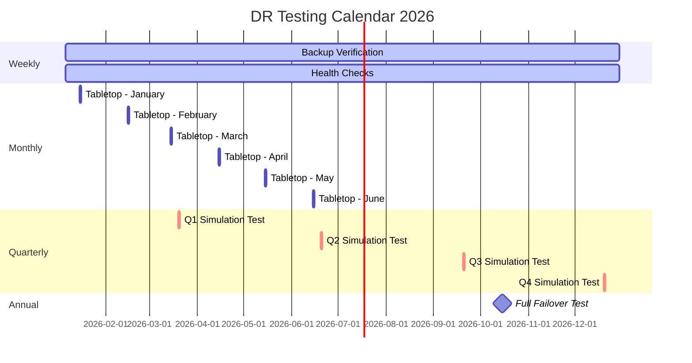

# How to Build DR Testing Schedules

Author: [nawazdhandala](https://github.com/nawazdhandala)

Tags: Disaster Recovery, Testing, SRE, Reliability

Description: Learn how to schedule and conduct regular disaster recovery tests.

---

Disaster recovery plans are worthless if they fail during an actual disaster. The only way to build confidence in your DR strategy is through regular, structured testing. This guide walks you through building a comprehensive DR testing schedule that evolves from simple tabletop exercises to full production failovers.

## Why DR Testing Matters

Most organizations create DR plans and forget about them. Then, when disaster strikes, they discover:

- Documentation is outdated
- Key personnel have left
- Systems have changed
- Dependencies no longer exist
- Recovery times are 10x longer than expected

Regular testing transforms your DR plan from a dusty document into a living, battle-tested playbook.

## DR Testing Frequency Framework



## Test Type 1: Tabletop Exercises

Tabletop exercises are discussion-based sessions where team members walk through disaster scenarios without touching production systems. They are low-risk but high-value.

### When to Run

- Monthly for critical systems
- After any significant infrastructure change
- When onboarding new team members
- Following actual incidents

### Tabletop Exercise Template

```yaml
# dr-tabletop-exercise.yaml
exercise:
  name: "Database Corruption Recovery"
  date: "2026-02-15"
  duration: "90 minutes"
  facilitator: "SRE Lead"

participants:
  - role: "Database Administrator"
    name: "TBD"
  - role: "Application Owner"
    name: "TBD"
  - role: "Infrastructure Engineer"
    name: "TBD"
  - role: "Communications Lead"
    name: "TBD"

scenario:
  description: |
    At 2:47 AM, the on-call engineer receives alerts indicating
    database corruption in the primary PostgreSQL cluster.
    Initial investigation shows the corruption affects the
    orders table, impacting customer checkout functionality.

  timeline:
    - time: "T+0"
      event: "Corruption detected, alerts fire"
    - time: "T+5m"
      event: "On-call acknowledges, begins investigation"
    - time: "T+15m"
      event: "Scope identified - orders table affected"
    - time: "T+30m"
      event: "Decision point - restore vs. rebuild"

discussion_points:
  - "How do we determine the extent of corruption?"
  - "What is our last known good backup?"
  - "How do we communicate to customers?"
  - "What is the rollback procedure?"
  - "Who has authority to initiate failover?"

expected_outcomes:
  - "Identify gaps in current runbooks"
  - "Validate contact lists are current"
  - "Estimate realistic recovery time"
  - "Document improvement actions"
```

### Running an Effective Tabletop

```python
#!/usr/bin/env python3
"""
DR Tabletop Exercise Facilitator Script
Guides teams through structured disaster scenarios
"""

import json
from datetime import datetime
from dataclasses import dataclass
from typing import List

@dataclass
class Inject:
    """An event injected during the exercise to change conditions"""
    time_offset: str
    description: str
    expected_response: str

@dataclass
class TabletopExercise:
    name: str
    scenario: str
    injects: List[Inject]

    def run(self):
        print(f"\n{'='*60}")
        print(f"DR TABLETOP EXERCISE: {self.name}")
        print(f"Date: {datetime.now().strftime('%Y-%m-%d %H:%M')}")
        print(f"{'='*60}\n")

        print("SCENARIO:")
        print("-" * 40)
        print(self.scenario)
        print()

        for i, inject in enumerate(self.injects, 1):
            input(f"\nPress Enter to reveal Inject #{i}...")
            print(f"\n[{inject.time_offset}] INJECT #{i}")
            print(f"  Event: {inject.description}")
            print(f"\n  Discussion: What actions would you take?")
            print(f"  Expected: {inject.expected_response}")

            # Record responses
            response = input("\n  Team response: ")
            print(f"  [Recorded: {response}]")

        print("\n" + "="*60)
        print("EXERCISE COMPLETE - Begin debrief discussion")
        print("="*60)


# Example: Database Failure Scenario
db_failure_exercise = TabletopExercise(
    name="Primary Database Failure",
    scenario="""
    Your primary PostgreSQL database server has experienced
    a hardware failure at 3:00 AM. The server is unresponsive
    and cannot be recovered. You have a streaming replica
    that is 30 seconds behind and daily backups stored in S3.
    """,
    injects=[
        Inject(
            time_offset="T+5m",
            description="Monitoring shows the replica has also stopped receiving updates",
            expected_response="Check replica status, verify network connectivity, assess data loss window"
        ),
        Inject(
            time_offset="T+15m",
            description="Customer support reports checkout failures are spiking",
            expected_response="Activate incident communication, post status page update"
        ),
        Inject(
            time_offset="T+30m",
            description="The DBA reports the replica can be promoted but 47 orders may be lost",
            expected_response="Make go/no-go decision, document lost transactions for reconciliation"
        ),
        Inject(
            time_offset="T+45m",
            description="After promotion, application errors indicate connection string issues",
            expected_response="Update DNS/config, rolling restart of application pods"
        )
    ]
)

if __name__ == "__main__":
    db_failure_exercise.run()
```

## Test Type 2: Simulation Tests

Simulation tests go beyond discussion - they involve actual execution of recovery procedures in non-production environments.

### Simulation Test Architecture



### Quarterly Simulation Test Checklist

```yaml
# simulation-test-checklist.yaml
simulation_test:
  name: "Q1 2026 DR Simulation"
  environment: "staging-dr"
  date: "2026-03-15"

pre_test_checklist:
  - task: "Notify stakeholders 1 week in advance"
    owner: "DR Coordinator"
    status: pending

  - task: "Verify test environment mirrors production"
    owner: "Infrastructure Team"
    status: pending

  - task: "Confirm backup restoration capabilities"
    owner: "Database Team"
    status: pending

  - task: "Review and update runbooks"
    owner: "SRE Team"
    status: pending

  - task: "Prepare rollback procedures"
    owner: "Operations Team"
    status: pending

test_scenarios:
  - name: "Database Failover"
    rto_target: "15 minutes"
    rpo_target: "1 minute"
    steps:
      - "Simulate primary database failure"
      - "Execute failover to replica"
      - "Verify application connectivity"
      - "Validate data integrity"
      - "Measure actual RTO/RPO"

  - name: "Application Recovery"
    rto_target: "30 minutes"
    rpo_target: "N/A"
    steps:
      - "Simulate complete application failure"
      - "Redeploy from container images"
      - "Restore configuration from backup"
      - "Verify service functionality"
      - "Run integration test suite"

  - name: "Full Site Failover"
    rto_target: "2 hours"
    rpo_target: "5 minutes"
    steps:
      - "Simulate primary site loss"
      - "Activate DR site"
      - "Update DNS/traffic routing"
      - "Verify all services operational"
      - "Execute synthetic transactions"

post_test_checklist:
  - task: "Document actual RTO/RPO achieved"
  - task: "Record all issues encountered"
  - task: "Update runbooks with lessons learned"
  - task: "Create action items for gaps"
  - task: "Brief leadership on results"
```

### Automated Simulation Test Runner

```python
#!/usr/bin/env python3
"""
DR Simulation Test Automation Framework
Executes and validates disaster recovery procedures
"""

import subprocess
import time
import json
from datetime import datetime
from dataclasses import dataclass, field
from typing import List, Dict, Optional
from enum import Enum

class TestStatus(Enum):
    PENDING = "pending"
    RUNNING = "running"
    PASSED = "passed"
    FAILED = "failed"
    SKIPPED = "skipped"

@dataclass
class TestStep:
    name: str
    command: str
    timeout_seconds: int = 300
    expected_exit_code: int = 0
    status: TestStatus = TestStatus.PENDING
    duration_seconds: float = 0
    output: str = ""
    error: str = ""

@dataclass
class SimulationTest:
    name: str
    rto_target_minutes: int
    rpo_target_minutes: int
    steps: List[TestStep]
    actual_rto_minutes: float = 0
    actual_rpo_minutes: float = 0

    def execute(self) -> Dict:
        """Execute all test steps and measure RTO"""
        start_time = time.time()
        results = {
            "test_name": self.name,
            "start_time": datetime.now().isoformat(),
            "rto_target": self.rto_target_minutes,
            "rpo_target": self.rpo_target_minutes,
            "steps": [],
            "passed": True
        }

        print(f"\n{'='*60}")
        print(f"EXECUTING: {self.name}")
        print(f"RTO Target: {self.rto_target_minutes} minutes")
        print(f"{'='*60}\n")

        for step in self.steps:
            step_result = self._execute_step(step)
            results["steps"].append(step_result)

            if step.status == TestStatus.FAILED:
                results["passed"] = False
                print(f"  [FAILED] Stopping test due to failure")
                break

        end_time = time.time()
        self.actual_rto_minutes = (end_time - start_time) / 60
        results["actual_rto_minutes"] = round(self.actual_rto_minutes, 2)
        results["rto_met"] = self.actual_rto_minutes <= self.rto_target_minutes
        results["end_time"] = datetime.now().isoformat()

        self._print_summary(results)
        return results

    def _execute_step(self, step: TestStep) -> Dict:
        """Execute a single test step"""
        print(f"  [{step.name}]")
        step.status = TestStatus.RUNNING
        start = time.time()

        try:
            result = subprocess.run(
                step.command,
                shell=True,
                capture_output=True,
                text=True,
                timeout=step.timeout_seconds
            )

            step.output = result.stdout
            step.error = result.stderr
            step.duration_seconds = time.time() - start

            if result.returncode == step.expected_exit_code:
                step.status = TestStatus.PASSED
                print(f"    PASSED ({step.duration_seconds:.1f}s)")
            else:
                step.status = TestStatus.FAILED
                print(f"    FAILED - Exit code: {result.returncode}")
                print(f"    Error: {step.error[:200]}")

        except subprocess.TimeoutExpired:
            step.status = TestStatus.FAILED
            step.duration_seconds = step.timeout_seconds
            print(f"    FAILED - Timeout after {step.timeout_seconds}s")
        except Exception as e:
            step.status = TestStatus.FAILED
            step.error = str(e)
            print(f"    FAILED - {e}")

        return {
            "name": step.name,
            "status": step.status.value,
            "duration_seconds": round(step.duration_seconds, 2),
            "output": step.output[:500] if step.output else "",
            "error": step.error[:500] if step.error else ""
        }

    def _print_summary(self, results: Dict):
        """Print test summary"""
        print(f"\n{'='*60}")
        print("TEST SUMMARY")
        print(f"{'='*60}")
        print(f"Test: {results['test_name']}")
        print(f"Status: {'PASSED' if results['passed'] else 'FAILED'}")
        print(f"RTO Target: {results['rto_target']} minutes")
        print(f"RTO Actual: {results['actual_rto_minutes']} minutes")
        print(f"RTO Met: {'Yes' if results['rto_met'] else 'NO'}")
        print(f"{'='*60}\n")


# Example: Database Failover Test
database_failover_test = SimulationTest(
    name="PostgreSQL Failover Test",
    rto_target_minutes=15,
    rpo_target_minutes=1,
    steps=[
        TestStep(
            name="Verify replica health",
            command="pg_isready -h replica.db.internal -p 5432",
            timeout_seconds=30
        ),
        TestStep(
            name="Check replication lag",
            command="psql -h replica.db.internal -c 'SELECT EXTRACT(EPOCH FROM (now() - pg_last_xact_replay_timestamp()))::int AS lag_seconds;'",
            timeout_seconds=30
        ),
        TestStep(
            name="Simulate primary failure",
            command="kubectl delete pod postgres-primary-0 --namespace=database",
            timeout_seconds=60
        ),
        TestStep(
            name="Promote replica to primary",
            command="kubectl exec postgres-replica-0 -- pg_ctl promote",
            timeout_seconds=120
        ),
        TestStep(
            name="Update connection string",
            command="kubectl patch configmap db-config --patch '{\"data\":{\"PRIMARY_HOST\":\"postgres-replica-0\"}}'",
            timeout_seconds=30
        ),
        TestStep(
            name="Restart application pods",
            command="kubectl rollout restart deployment/api-server",
            timeout_seconds=180
        ),
        TestStep(
            name="Verify application health",
            command="curl -f http://api.internal/health",
            timeout_seconds=60
        ),
        TestStep(
            name="Run data integrity check",
            command="python /scripts/verify_data_integrity.py",
            timeout_seconds=300
        )
    ]
)

if __name__ == "__main__":
    results = database_failover_test.execute()

    # Save results for reporting
    with open(f"dr-test-results-{datetime.now().strftime('%Y%m%d-%H%M%S')}.json", "w") as f:
        json.dump(results, f, indent=2)
```

## Test Type 3: Full Failover Tests

Full failover tests are the ultimate validation of your DR capabilities. They involve actually switching production traffic to your DR environment.

### Full Failover Test Flow



### Full Failover Test Runbook

```yaml
# full-failover-runbook.yaml
runbook:
  name: "Annual Full Site Failover Test"
  version: "2.1"
  last_updated: "2026-01-15"
  owner: "SRE Team"

prerequisites:
  - "DR site fully synced (replication lag < 30 seconds)"
  - "All runbooks reviewed and updated"
  - "Communication channels tested"
  - "Rollback procedures documented"
  - "Executive approval obtained"
  - "Customer notification sent 7 days prior"

timeline:
  - phase: "T-7 days"
    actions:
      - "Send customer notification"
      - "Confirm DR environment readiness"
      - "Review and assign roles"

  - phase: "T-1 day"
    actions:
      - "Final sync verification"
      - "Pre-flight checklist completion"
      - "War room setup"

  - phase: "T-0 (Failover Start)"
    actions:
      - action: "Announce failover start"
        command: "post-to-slack '#incidents' 'DR Failover Test Starting'"
        owner: "Communications Lead"

      - action: "Stop write traffic to primary"
        command: "kubectl scale deployment api-server --replicas=0"
        owner: "Application Team"

      - action: "Verify final replication"
        command: "check-replication-lag.sh"
        expected: "Lag < 5 seconds"
        owner: "Database Team"

      - action: "Promote DR database"
        command: "promote-dr-database.sh"
        owner: "Database Team"

      - action: "Start DR application servers"
        command: "kubectl --context=dr scale deployment api-server --replicas=10"
        owner: "Application Team"

      - action: "Update DNS"
        command: "update-dns-to-dr.sh"
        owner: "Infrastructure Team"

      - action: "Verify DNS propagation"
        command: "verify-dns.sh"
        timeout: "10 minutes"
        owner: "Infrastructure Team"

  - phase: "T+15m (Validation)"
    actions:
      - action: "Run smoke tests"
        command: "run-smoke-tests.sh"
        owner: "QA Team"

      - action: "Verify monitoring"
        command: "check-all-monitors.sh"
        owner: "SRE Team"

      - action: "Confirm customer-facing functionality"
        command: "run-synthetic-transactions.sh"
        owner: "Application Team"

  - phase: "T+60m (Failback)"
    actions:
      - action: "Sync data back to primary"
        command: "sync-to-primary.sh"
        owner: "Database Team"

      - action: "Verify primary data integrity"
        command: "verify-data-integrity.sh"
        owner: "Database Team"

      - action: "Update DNS to primary"
        command: "update-dns-to-primary.sh"
        owner: "Infrastructure Team"

      - action: "Scale up primary applications"
        command: "kubectl scale deployment api-server --replicas=10"
        owner: "Application Team"

      - action: "Scale down DR"
        command: "kubectl --context=dr scale deployment api-server --replicas=2"
        owner: "Application Team"

rollback_triggers:
  - "Error rate exceeds 5%"
  - "Latency exceeds 2x baseline"
  - "Data integrity check fails"
  - "Critical functionality unavailable"

rollback_procedure:
  - "Immediately revert DNS to primary"
  - "Scale up primary services"
  - "Investigate DR issues"
  - "Document failure reasons"
```

## Test Scenarios Library

Build a library of test scenarios that cover various failure modes.



### Scenario Definition Template

```python
#!/usr/bin/env python3
"""
DR Test Scenario Library
Define and manage disaster recovery test scenarios
"""

from dataclasses import dataclass, field
from typing import List, Dict
from enum import Enum
import json

class Severity(Enum):
    LOW = "low"
    MEDIUM = "medium"
    HIGH = "high"
    CRITICAL = "critical"

class Category(Enum):
    INFRASTRUCTURE = "infrastructure"
    APPLICATION = "application"
    SECURITY = "security"
    HUMAN = "human"
    EXTERNAL = "external"

@dataclass
class DRScenario:
    id: str
    name: str
    category: Category
    severity: Severity
    description: str
    impact: str
    rto_requirement: int  # minutes
    rpo_requirement: int  # minutes
    detection_method: str
    recovery_steps: List[str]
    validation_steps: List[str]
    dependencies: List[str] = field(default_factory=list)
    last_tested: str = ""
    test_frequency: str = ""  # monthly, quarterly, annual

    def to_dict(self) -> Dict:
        return {
            "id": self.id,
            "name": self.name,
            "category": self.category.value,
            "severity": self.severity.value,
            "description": self.description,
            "impact": self.impact,
            "rto_requirement": self.rto_requirement,
            "rpo_requirement": self.rpo_requirement,
            "detection_method": self.detection_method,
            "recovery_steps": self.recovery_steps,
            "validation_steps": self.validation_steps,
            "dependencies": self.dependencies,
            "last_tested": self.last_tested,
            "test_frequency": self.test_frequency
        }


# Define your scenario library
SCENARIO_LIBRARY = [
    DRScenario(
        id="DR-001",
        name="Primary Database Failure",
        category=Category.INFRASTRUCTURE,
        severity=Severity.CRITICAL,
        description="Complete failure of the primary PostgreSQL database server",
        impact="All write operations fail, application degraded to read-only",
        rto_requirement=15,
        rpo_requirement=1,
        detection_method="Database health check failures, application errors",
        recovery_steps=[
            "Confirm primary is unrecoverable",
            "Check replica synchronization status",
            "Promote replica to primary",
            "Update application connection strings",
            "Restart application services",
            "Verify data integrity"
        ],
        validation_steps=[
            "Execute write transaction",
            "Run data consistency check",
            "Verify all tables accessible",
            "Check application logs for errors"
        ],
        dependencies=["PostgreSQL Replica", "Connection String ConfigMap"],
        test_frequency="quarterly"
    ),

    DRScenario(
        id="DR-002",
        name="Kubernetes Cluster Failure",
        category=Category.INFRASTRUCTURE,
        severity=Severity.CRITICAL,
        description="Complete loss of primary Kubernetes cluster",
        impact="All services unavailable until failover to DR cluster",
        rto_requirement=30,
        rpo_requirement=5,
        detection_method="Cluster health checks fail, node unreachable alerts",
        recovery_steps=[
            "Confirm cluster is unrecoverable",
            "Activate DR Kubernetes cluster",
            "Sync latest container images to DR registry",
            "Apply Kubernetes manifests to DR cluster",
            "Update DNS/load balancer to DR cluster",
            "Verify all pods running"
        ],
        validation_steps=[
            "Check all deployments healthy",
            "Verify ingress routing",
            "Run integration tests",
            "Confirm monitoring operational"
        ],
        dependencies=["DR Kubernetes Cluster", "Container Registry Mirror", "DNS Failover"],
        test_frequency="annual"
    ),

    DRScenario(
        id="DR-003",
        name="Ransomware Attack",
        category=Category.SECURITY,
        severity=Severity.CRITICAL,
        description="Ransomware encrypts production systems and data",
        impact="Complete service outage, potential data loss",
        rto_requirement=240,
        rpo_requirement=60,
        detection_method="File integrity monitoring, unusual encryption activity",
        recovery_steps=[
            "Isolate affected systems immediately",
            "Identify scope of infection",
            "Engage incident response team",
            "Restore from known-clean backups",
            "Rebuild compromised systems",
            "Reset all credentials",
            "Scan restored systems for malware"
        ],
        validation_steps=[
            "Verify systems malware-free",
            "Confirm data integrity from checksums",
            "Test all authentication systems",
            "Review access logs for suspicious activity"
        ],
        dependencies=["Offline Backups", "Clean System Images", "Incident Response Team"],
        test_frequency="annual"
    ),

    DRScenario(
        id="DR-004",
        name="Accidental Data Deletion",
        category=Category.HUMAN,
        severity=Severity.HIGH,
        description="Critical data accidentally deleted by operator or automated process",
        impact="Data loss for affected tables/collections, service degradation",
        rto_requirement=60,
        rpo_requirement=15,
        detection_method="Application errors, missing data alerts, user reports",
        recovery_steps=[
            "Identify scope of deletion",
            "Stop any cascading deletions",
            "Identify most recent backup before deletion",
            "Restore affected data from backup",
            "Reconcile any transactions during gap",
            "Verify referential integrity"
        ],
        validation_steps=[
            "Count records match expected",
            "Verify relationships intact",
            "Test affected application features",
            "Confirm audit logs updated"
        ],
        dependencies=["Point-in-Time Recovery", "Transaction Logs"],
        test_frequency="quarterly"
    ),

    DRScenario(
        id="DR-005",
        name="Cloud Provider Outage",
        category=Category.EXTERNAL,
        severity=Severity.HIGH,
        description="Major outage at primary cloud provider affecting our region",
        impact="Services unavailable in affected region",
        rto_requirement=60,
        rpo_requirement=5,
        detection_method="Cloud provider status page, external monitoring",
        recovery_steps=[
            "Confirm outage via provider status",
            "Assess expected duration",
            "Decide: wait vs. failover",
            "If failover: activate multi-region DR",
            "Update global load balancer routing",
            "Verify services in alternate region"
        ],
        validation_steps=[
            "Confirm traffic routing to DR region",
            "Check application health in DR",
            "Verify data replication current",
            "Monitor for increased latency"
        ],
        dependencies=["Multi-Region Deployment", "Global Load Balancer", "Cross-Region Replication"],
        test_frequency="quarterly"
    )
]


def generate_test_schedule(scenarios: List[DRScenario]) -> Dict:
    """Generate a test schedule based on scenario frequencies"""
    schedule = {
        "weekly": [],
        "monthly": [],
        "quarterly": [],
        "annual": []
    }

    for scenario in scenarios:
        if scenario.test_frequency in schedule:
            schedule[scenario.test_frequency].append({
                "id": scenario.id,
                "name": scenario.name,
                "severity": scenario.severity.value,
                "rto": scenario.rto_requirement,
                "last_tested": scenario.last_tested
            })

    return schedule


if __name__ == "__main__":
    # Export scenario library
    scenarios_export = [s.to_dict() for s in SCENARIO_LIBRARY]

    with open("dr-scenarios.json", "w") as f:
        json.dump(scenarios_export, f, indent=2)

    # Generate test schedule
    schedule = generate_test_schedule(SCENARIO_LIBRARY)
    print("\nDR TEST SCHEDULE")
    print("="*50)

    for frequency, tests in schedule.items():
        if tests:
            print(f"\n{frequency.upper()}:")
            for test in tests:
                print(f"  - [{test['id']}] {test['name']} (RTO: {test['rto']}min)")
```

## Documentation and Continuous Improvement

### DR Test Report Template

```yaml
# dr-test-report-template.yaml
report:
  test_id: "DR-2026-Q1-001"
  test_date: "2026-03-15"
  test_type: "Quarterly Simulation"
  scenario: "Primary Database Failover"

team:
  lead: "Jane Smith"
  participants:
    - name: "John Doe"
      role: "Database Administrator"
    - name: "Alice Johnson"
      role: "Application Engineer"
    - name: "Bob Wilson"
      role: "SRE"

results:
  overall_status: "Passed with Issues"

  rto:
    target_minutes: 15
    actual_minutes: 22
    met: false

  rpo:
    target_minutes: 1
    actual_minutes: 0.5
    met: true

  steps_completed: 8
  steps_total: 8
  steps_failed: 1

timeline:
  - time: "14:00"
    event: "Test initiated"

  - time: "14:02"
    event: "Primary database stopped"

  - time: "14:05"
    event: "Replication lag confirmed < 30 seconds"

  - time: "14:08"
    event: "Replica promotion initiated"

  - time: "14:12"
    event: "ISSUE: Promotion script failed, manual intervention required"

  - time: "14:18"
    event: "Replica successfully promoted"

  - time: "14:20"
    event: "Application connection strings updated"

  - time: "14:22"
    event: "Application pods restarted and healthy"

issues:
  - id: "ISSUE-001"
    severity: "high"
    description: "Automated promotion script failed due to outdated credentials"
    root_cause: "Service account password rotated but script not updated"
    resolution: "Manual promotion using direct psql connection"
    action_item: "Update credential management for DR scripts"
    owner: "Database Team"
    due_date: "2026-03-22"

  - id: "ISSUE-002"
    severity: "medium"
    description: "Connection string update took longer than expected"
    root_cause: "ConfigMap change required pod restarts"
    resolution: "Waited for rolling restart"
    action_item: "Implement dynamic config reload"
    owner: "Application Team"
    due_date: "2026-04-15"

lessons_learned:
  - "Credential rotation must include DR automation scripts"
  - "Need better visibility into replication lag during failover"
  - "Rolling restarts add significant time - consider connection pooler"

recommendations:
  - priority: "high"
    recommendation: "Implement secrets management for DR scripts"
    effort: "medium"

  - priority: "medium"
    recommendation: "Add PgBouncer for connection pooling"
    effort: "high"

  - priority: "low"
    recommendation: "Create real-time replication dashboard"
    effort: "low"

next_steps:
  - "Address ISSUE-001 within 1 week"
  - "Schedule follow-up test for April"
  - "Present findings to leadership"
  - "Update runbooks with lessons learned"
```

### Tracking DR Test Metrics

```python
#!/usr/bin/env python3
"""
DR Test Metrics Tracker
Track and analyze disaster recovery test results over time
"""

import json
from datetime import datetime, timedelta
from dataclasses import dataclass
from typing import List, Dict, Optional
import statistics

@dataclass
class DRTestResult:
    test_id: str
    test_date: str
    scenario: str
    rto_target: int
    rto_actual: float
    rpo_target: int
    rpo_actual: float
    passed: bool
    issues_count: int
    critical_issues: int

class DRMetricsTracker:
    def __init__(self):
        self.results: List[DRTestResult] = []

    def add_result(self, result: DRTestResult):
        self.results.append(result)

    def load_from_file(self, filepath: str):
        with open(filepath) as f:
            data = json.load(f)
            for item in data:
                self.results.append(DRTestResult(**item))

    def get_summary(self, months: int = 12) -> Dict:
        """Get summary metrics for the specified period"""
        cutoff = datetime.now() - timedelta(days=months * 30)
        recent = [r for r in self.results
                  if datetime.fromisoformat(r.test_date) > cutoff]

        if not recent:
            return {"error": "No test results in period"}

        return {
            "period_months": months,
            "total_tests": len(recent),
            "pass_rate": sum(1 for r in recent if r.passed) / len(recent) * 100,
            "avg_rto_achievement": statistics.mean(
                [r.rto_target / r.rto_actual * 100 for r in recent if r.rto_actual > 0]
            ),
            "avg_rpo_achievement": statistics.mean(
                [r.rpo_target / r.rpo_actual * 100 for r in recent if r.rpo_actual > 0]
            ),
            "tests_meeting_rto": sum(1 for r in recent if r.rto_actual <= r.rto_target),
            "tests_meeting_rpo": sum(1 for r in recent if r.rpo_actual <= r.rpo_target),
            "total_issues": sum(r.issues_count for r in recent),
            "critical_issues": sum(r.critical_issues for r in recent),
            "improvement_trend": self._calculate_trend(recent)
        }

    def _calculate_trend(self, results: List[DRTestResult]) -> str:
        """Determine if DR capabilities are improving"""
        if len(results) < 4:
            return "insufficient_data"

        sorted_results = sorted(results, key=lambda r: r.test_date)
        first_half = sorted_results[:len(sorted_results)//2]
        second_half = sorted_results[len(sorted_results)//2:]

        first_half_rto = statistics.mean([r.rto_actual for r in first_half])
        second_half_rto = statistics.mean([r.rto_actual for r in second_half])

        if second_half_rto < first_half_rto * 0.9:
            return "improving"
        elif second_half_rto > first_half_rto * 1.1:
            return "degrading"
        else:
            return "stable"

    def generate_report(self) -> str:
        """Generate a text report of DR test metrics"""
        summary = self.get_summary()

        report = f"""
DR TEST METRICS REPORT
Generated: {datetime.now().strftime('%Y-%m-%d %H:%M')}
{'='*50}

SUMMARY (Last 12 Months)
------------------------
Total Tests Conducted: {summary['total_tests']}
Overall Pass Rate: {summary['pass_rate']:.1f}%

RTO PERFORMANCE
---------------
Tests Meeting RTO Target: {summary['tests_meeting_rto']}/{summary['total_tests']}
Average RTO Achievement: {summary['avg_rto_achievement']:.1f}%

RPO PERFORMANCE
---------------
Tests Meeting RPO Target: {summary['tests_meeting_rpo']}/{summary['total_tests']}
Average RPO Achievement: {summary['avg_rpo_achievement']:.1f}%

ISSUES
------
Total Issues Found: {summary['total_issues']}
Critical Issues: {summary['critical_issues']}

TREND
-----
DR Capability Trend: {summary['improvement_trend'].upper()}

{'='*50}
"""
        return report


# Example usage
if __name__ == "__main__":
    tracker = DRMetricsTracker()

    # Add sample results
    sample_results = [
        DRTestResult("DR-2025-Q1", "2025-03-15", "Database Failover",
                     15, 18, 1, 0.5, False, 3, 1),
        DRTestResult("DR-2025-Q2", "2025-06-15", "Database Failover",
                     15, 14, 1, 0.3, True, 1, 0),
        DRTestResult("DR-2025-Q3", "2025-09-15", "Database Failover",
                     15, 12, 1, 0.2, True, 1, 0),
        DRTestResult("DR-2025-Q4", "2025-12-15", "Database Failover",
                     15, 11, 1, 0.2, True, 0, 0),
        DRTestResult("DR-2026-Q1", "2026-03-15", "Database Failover",
                     15, 10, 1, 0.1, True, 0, 0),
    ]

    for result in sample_results:
        tracker.add_result(result)

    print(tracker.generate_report())
```

## Building Your DR Testing Calendar



## Getting Started Checklist

Start building your DR testing practice today:

1. **Week 1**: Document your current DR plan and identify gaps
2. **Week 2**: Schedule your first tabletop exercise
3. **Week 3**: Set up automated backup verification
4. **Week 4**: Run your first tabletop with the team
5. **Month 2**: Plan and execute a simulation test in staging
6. **Month 3**: Review results and update runbooks
7. **Quarter 2**: Work toward your first full failover test

## Key Takeaways

- **Test regularly**: Untested DR plans fail when needed most
- **Start simple**: Tabletop exercises build muscle memory without risk
- **Document everything**: Reports drive continuous improvement
- **Measure RTO/RPO**: Track metrics to prove your DR capabilities
- **Involve everyone**: DR is a team sport, not just ops
- **Learn from failures**: Test failures are cheaper than real failures

---

Your DR plan is only as good as your last successful test. Build a testing schedule that progressively challenges your team and systems, and you will be ready when disaster strikes for real.
