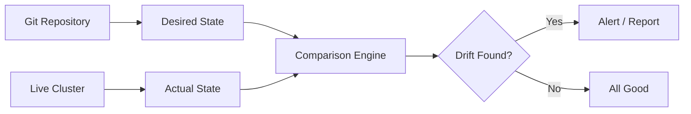
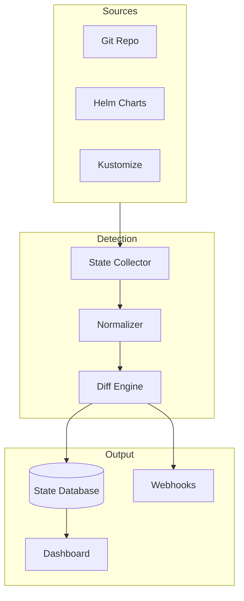
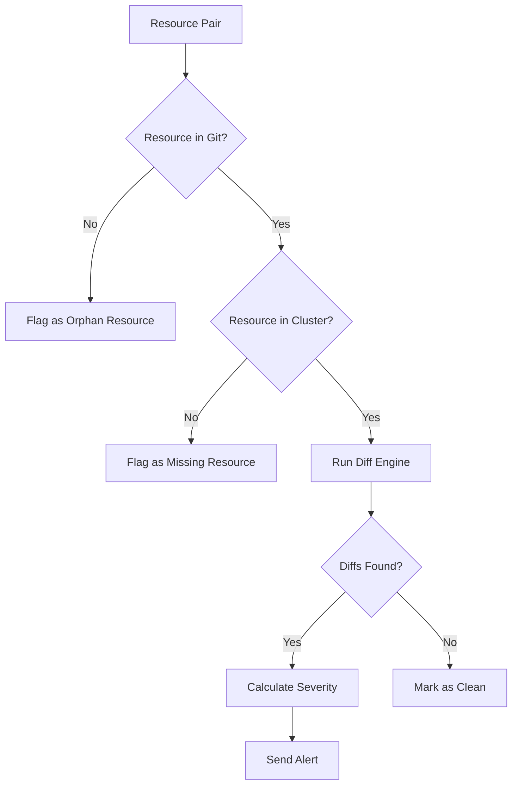

# How to Build Drift Detection Details

Author: [nawazdhandala](https://github.com/nawazdhandala)

Tags: GitOps, Drift Detection, IaC, Compliance

Description: Learn to build drift detection for identifying configuration changes from desired state.

---

Infrastructure drift happens when your running systems no longer match what you declared in code. A manual kubectl edit, a hotfix applied directly to production, or a forgotten console change. These small deviations accumulate into compliance nightmares and unexpected outages.

This guide walks through building a drift detection system from scratch. You will learn how to capture desired state, compare it against live resources, and surface meaningful differences to your team.

## What Is Drift Detection?

Drift detection continuously compares your declared configuration against actual running infrastructure. When differences appear, the system alerts you or automatically corrects them.



The comparison engine sits at the heart of drift detection. It needs to understand which differences matter and which are just noise from Kubernetes adding default values or status fields.

## Architecture Overview

A production drift detection system has four main components.



The state collector fetches both desired and actual configurations. The normalizer strips out fields that should not trigger drift alerts. The diff engine computes structured differences and stores them for reporting.

## Building the State Collector

Start by collecting the desired state from your Git repository. This example uses Python with the kubernetes client library.

```python
# state_collector.py
import yaml
import subprocess
from pathlib import Path
from kubernetes import client, config

class StateCollector:
    def __init__(self, kubeconfig_path=None):
        # Load cluster configuration from file or in-cluster
        if kubeconfig_path:
            config.load_kube_config(kubeconfig_path)
        else:
            config.load_incluster_config()

        self.apps_v1 = client.AppsV1Api()
        self.core_v1 = client.CoreV1Api()

    def get_desired_state(self, git_path: str, namespace: str) -> dict:
        """
        Render manifests from Git and return as structured data.
        Supports plain YAML, Helm, and Kustomize.
        """
        manifests = {}
        path = Path(git_path)

        # Check if this is a Kustomize directory
        if (path / "kustomization.yaml").exists():
            output = subprocess.run(
                ["kubectl", "kustomize", str(path)],
                capture_output=True,
                text=True,
                check=True
            )
            docs = yaml.safe_load_all(output.stdout)
        else:
            # Load plain YAML files
            docs = []
            for yaml_file in path.glob("*.yaml"):
                with open(yaml_file) as f:
                    docs.extend(yaml.safe_load_all(f))

        # Index by kind and name for easy lookup
        for doc in docs:
            if doc is None:
                continue
            key = f"{doc['kind']}/{doc['metadata']['name']}"
            manifests[key] = doc

        return manifests

    def get_actual_state(self, namespace: str) -> dict:
        """
        Fetch live resources from the cluster.
        """
        resources = {}

        # Collect Deployments
        deployments = self.apps_v1.list_namespaced_deployment(namespace)
        for dep in deployments.items:
            key = f"Deployment/{dep.metadata.name}"
            resources[key] = client.ApiClient().sanitize_for_serialization(dep)

        # Collect Services
        services = self.core_v1.list_namespaced_service(namespace)
        for svc in services.items:
            key = f"Service/{svc.metadata.name}"
            resources[key] = client.ApiClient().sanitize_for_serialization(svc)

        # Collect ConfigMaps
        configmaps = self.core_v1.list_namespaced_config_map(namespace)
        for cm in configmaps.items:
            key = f"ConfigMap/{cm.metadata.name}"
            resources[key] = client.ApiClient().sanitize_for_serialization(cm)

        return resources
```

This collector handles three common source formats. Plain YAML files work directly. Kustomize directories get rendered through kubectl. The actual state comes from the Kubernetes API with proper serialization.

## Normalizing Resources for Comparison

Kubernetes adds many fields that should not trigger drift alerts. Status fields, managed annotations, and default values all create noise. The normalizer strips these out.

```python
# normalizer.py
import copy

# Fields that Kubernetes manages automatically
IGNORED_METADATA_FIELDS = [
    "uid",
    "resourceVersion",
    "generation",
    "creationTimestamp",
    "managedFields",
    "selfLink",
]

# Annotations added by controllers
IGNORED_ANNOTATIONS = [
    "kubectl.kubernetes.io/last-applied-configuration",
    "deployment.kubernetes.io/revision",
]

def normalize_resource(resource: dict) -> dict:
    """
    Remove fields that should not trigger drift detection.
    Returns a clean copy suitable for comparison.
    """
    cleaned = copy.deepcopy(resource)

    # Remove status entirely
    cleaned.pop("status", None)

    # Clean metadata
    metadata = cleaned.get("metadata", {})
    for field in IGNORED_METADATA_FIELDS:
        metadata.pop(field, None)

    # Clean annotations
    annotations = metadata.get("annotations", {})
    for anno in IGNORED_ANNOTATIONS:
        annotations.pop(anno, None)
    if not annotations:
        metadata.pop("annotations", None)

    # Remove empty labels dict
    if not metadata.get("labels"):
        metadata.pop("labels", None)

    return cleaned

def normalize_deployment(resource: dict) -> dict:
    """
    Additional normalization specific to Deployments.
    """
    cleaned = normalize_resource(resource)
    spec = cleaned.get("spec", {})

    # Remove fields set by controllers
    spec.pop("revisionHistoryLimit", None)
    spec.pop("progressDeadlineSeconds", None)

    # Normalize container defaults
    containers = spec.get("template", {}).get("spec", {}).get("containers", [])
    for container in containers:
        container.pop("terminationMessagePath", None)
        container.pop("terminationMessagePolicy", None)
        container.pop("imagePullPolicy", None)

    return cleaned
```

The normalizer has two levels. Generic normalization removes standard Kubernetes metadata noise. Resource-specific normalization handles fields unique to each kind. Deployments have revision history limits. Services have cluster IPs. Each needs tailored handling.

## Computing Structured Diffs

With normalized resources ready, the diff engine compares them field by field. A structured diff shows exactly what changed, where it changed, and what the old and new values are.

```python
# diff_engine.py
from typing import Any
from dataclasses import dataclass

@dataclass
class DriftItem:
    path: str          # JSON path to the changed field
    change_type: str   # added, removed, modified
    desired: Any       # Value from Git
    actual: Any        # Value from cluster

def compute_diff(desired: dict, actual: dict, path: str = "") -> list[DriftItem]:
    """
    Recursively compare two dictionaries and return structured differences.
    """
    diffs = []

    # Handle None cases
    if desired is None and actual is None:
        return diffs
    if desired is None:
        return [DriftItem(path or "/", "removed", None, actual)]
    if actual is None:
        return [DriftItem(path or "/", "added", desired, None)]

    # Compare dictionaries
    if isinstance(desired, dict) and isinstance(actual, dict):
        all_keys = set(desired.keys()) | set(actual.keys())

        for key in all_keys:
            new_path = f"{path}/{key}" if path else f"/{key}"

            if key not in desired:
                diffs.append(DriftItem(new_path, "added", None, actual[key]))
            elif key not in actual:
                diffs.append(DriftItem(new_path, "removed", desired[key], None))
            else:
                diffs.extend(compute_diff(desired[key], actual[key], new_path))

    # Compare lists
    elif isinstance(desired, list) and isinstance(actual, list):
        max_len = max(len(desired), len(actual))
        for i in range(max_len):
            new_path = f"{path}[{i}]"
            if i >= len(desired):
                diffs.append(DriftItem(new_path, "added", None, actual[i]))
            elif i >= len(actual):
                diffs.append(DriftItem(new_path, "removed", desired[i], None))
            else:
                diffs.extend(compute_diff(desired[i], actual[i], new_path))

    # Compare scalar values
    elif desired != actual:
        diffs.append(DriftItem(path, "modified", desired, actual))

    return diffs
```

The recursive approach handles nested structures naturally. Each DriftItem contains the full JSON path, making it easy to pinpoint exactly where drift occurred. The change type helps prioritize fixes.

## Running Detection on a Schedule

Drift detection needs to run continuously. A Kubernetes CronJob works well for periodic checks.

```yaml
# drift-detector-cronjob.yaml
apiVersion: batch/v1
kind: CronJob
metadata:
  name: drift-detector
  namespace: monitoring
spec:
  schedule: "*/15 * * * *"  # Every 15 minutes
  concurrencyPolicy: Forbid
  jobTemplate:
    spec:
      template:
        spec:
          serviceAccountName: drift-detector
          containers:
            - name: detector
              image: myregistry/drift-detector:v1.0.0
              env:
                - name: GIT_REPO
                  value: "https://github.com/myorg/k8s-config.git"
                - name: TARGET_NAMESPACE
                  value: "production"
                - name: WEBHOOK_URL
                  valueFrom:
                    secretKeyRef:
                      name: drift-detector-secrets
                      key: webhook-url
              resources:
                requests:
                  memory: "128Mi"
                  cpu: "100m"
                limits:
                  memory: "256Mi"
                  cpu: "200m"
          restartPolicy: OnFailure
---
apiVersion: v1
kind: ServiceAccount
metadata:
  name: drift-detector
  namespace: monitoring
---
apiVersion: rbac.authorization.k8s.io/v1
kind: ClusterRole
metadata:
  name: drift-detector
rules:
  - apiGroups: ["", "apps", "batch"]
    resources: ["*"]
    verbs: ["get", "list"]
---
apiVersion: rbac.authorization.k8s.io/v1
kind: ClusterRoleBinding
metadata:
  name: drift-detector
subjects:
  - kind: ServiceAccount
    name: drift-detector
    namespace: monitoring
roleRef:
  kind: ClusterRole
  name: drift-detector
  apiGroup: rbac.authorization.k8s.io
```

The CronJob runs every 15 minutes. The service account has read-only access to cluster resources. Adjust the schedule based on your compliance requirements. High-security environments might run every minute.

## Sending Alerts

When drift is detected, the system needs to notify the right people. Here is a simple webhook sender.

```python
# alerter.py
import json
import requests
from datetime import datetime

def send_drift_alert(
    webhook_url: str,
    resource_key: str,
    diffs: list,
    namespace: str
):
    """
    Send drift details to a webhook endpoint.
    Works with Slack, Teams, PagerDuty, or custom receivers.
    """
    # Format diff details for human readability
    diff_lines = []
    for diff in diffs[:10]:  # Limit to first 10 changes
        if diff.change_type == "modified":
            diff_lines.append(
                f"  {diff.path}: {diff.desired} -> {diff.actual}"
            )
        elif diff.change_type == "added":
            diff_lines.append(f"  {diff.path}: (added) {diff.actual}")
        else:
            diff_lines.append(f"  {diff.path}: (removed) {diff.desired}")

    if len(diffs) > 10:
        diff_lines.append(f"  ... and {len(diffs) - 10} more changes")

    payload = {
        "text": f"Drift detected in {namespace}/{resource_key}",
        "timestamp": datetime.utcnow().isoformat(),
        "namespace": namespace,
        "resource": resource_key,
        "change_count": len(diffs),
        "details": "\n".join(diff_lines),
    }

    response = requests.post(
        webhook_url,
        json=payload,
        headers={"Content-Type": "application/json"},
        timeout=10
    )
    response.raise_for_status()
```

The alert includes the namespace, resource name, and specific field changes. This gives operators enough context to investigate without digging through logs.

## Handling Edge Cases

Real-world drift detection has many edge cases. Here are the most common ones and how to handle them.



Orphan resources exist in the cluster but not in Git. These often indicate manual debugging resources left behind. Missing resources are declared in Git but not deployed. Both warrant investigation but might not be immediate concerns.

## Integrating with GitOps Tools

If you use ArgoCD or Flux, you can leverage their built-in drift detection. ArgoCD exposes application sync status through its API.

```python
# argocd_integration.py
import requests

def get_argocd_drift(argocd_url: str, token: str, app_name: str) -> dict:
    """
    Fetch drift information from ArgoCD application status.
    """
    headers = {"Authorization": f"Bearer {token}"}

    response = requests.get(
        f"{argocd_url}/api/v1/applications/{app_name}",
        headers=headers,
        timeout=30
    )
    response.raise_for_status()
    app = response.json()

    sync_status = app["status"]["sync"]["status"]
    health_status = app["status"]["health"]["status"]

    # Get detailed resource differences
    resources = app["status"].get("resources", [])
    drifted = [
        r for r in resources
        if r.get("status") == "OutOfSync"
    ]

    return {
        "app_name": app_name,
        "synced": sync_status == "Synced",
        "healthy": health_status == "Healthy",
        "drifted_resources": drifted,
        "drift_count": len(drifted),
    }
```

ArgoCD already does the heavy lifting of comparing desired versus actual state. Your drift detection system can consume this data instead of reimplementing the comparison logic.

## Conclusion

Drift detection keeps your infrastructure honest. By continuously comparing declared state against reality, you catch configuration changes before they cause outages or compliance violations.

Start with a basic collector and diff engine. Add normalization rules as you discover noisy fields. Integrate with your existing alerting pipeline. Over time, you will build a system that catches drift within minutes of it happening.

The code examples here provide a foundation. Extend them based on your specific resources, compliance requirements, and GitOps tooling. The goal is simple: Git should always reflect what is running, and when it does not, you should know immediately.
