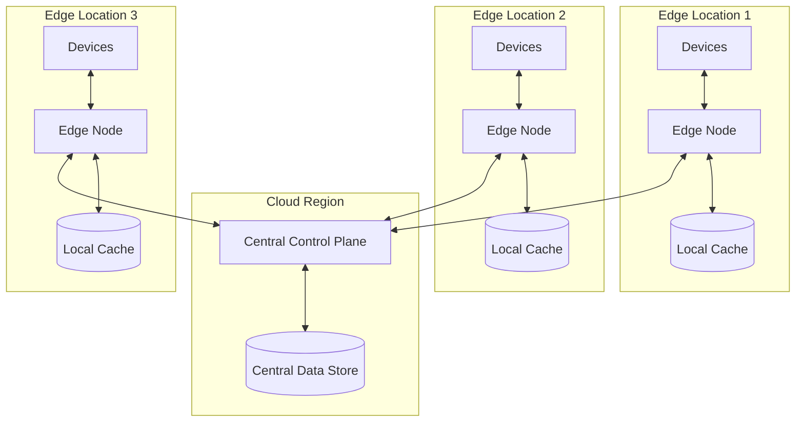
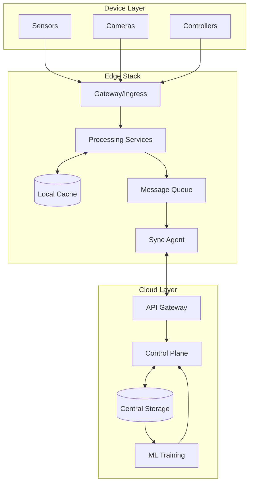
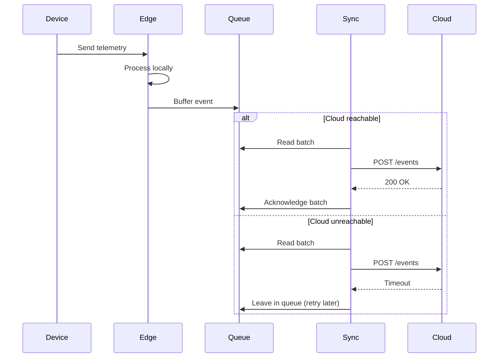
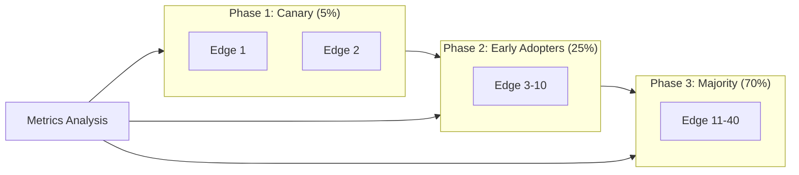
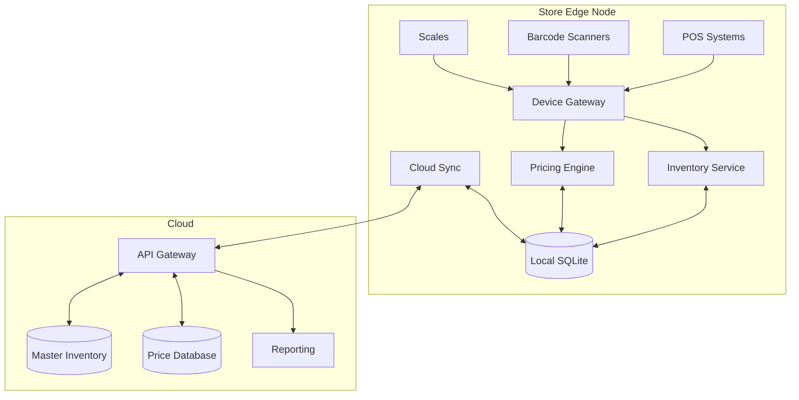

# How to Build Edge Architecture

Author: [nawazdhandala](https://github.com/nawazdhandala)

Tags: Edge Computing, IoT, Architecture, DevOps, Kubernetes, Distributed Systems

Description: A practical guide to designing and deploying edge architecture that brings compute closer to users and devices, reducing latency and improving reliability.

---

Edge computing moves processing power closer to where data is generated. Instead of routing everything through centralized cloud data centers, you deploy compute nodes at the network edge, whether that means retail stores, factory floors, cell towers, or regional points of presence. The result is lower latency, reduced bandwidth costs, and systems that keep running even when connectivity to the cloud fails.

## Why Edge Architecture Matters

Traditional cloud architectures assume reliable, low-latency connectivity to centralized infrastructure. That assumption breaks down in several scenarios:

- **Real-time applications** need sub-10ms response times that physics prevents when data must travel thousands of miles
- **IoT deployments** generate massive data volumes that become expensive to transmit
- **Offline resilience** is critical when network failures cannot halt operations
- **Data sovereignty** requirements may prohibit certain data from leaving specific regions

Edge architecture addresses all of these by placing compute where it is needed most.



## Core Principles of Edge Architecture

Before diving into implementation, understand the principles that guide edge design decisions.

### Principle 1: Design for Autonomy

Edge nodes must operate independently when connectivity to the cloud fails. This means:

- Local data persistence for active workloads
- Decision-making logic that runs without cloud dependencies
- Graceful degradation rather than complete failure

### Principle 2: Embrace Eventual Consistency

With data distributed across many locations, strong consistency becomes impractical. Design systems that:

- Tolerate temporary divergence between edge and cloud state
- Resolve conflicts through well-defined merge strategies
- Prioritize availability over consistency for most operations

### Principle 3: Minimize Data Movement

Moving data is expensive in terms of bandwidth, latency, and cost. Process data locally when possible:

- Filter and aggregate before transmitting
- Send only summaries, anomalies, or samples to the cloud
- Cache frequently accessed data at the edge

### Principle 4: Standardize the Edge Platform

Managing hundreds of edge locations becomes impossible without standardization:

- Use the same orchestration platform everywhere
- Deploy identical base configurations
- Automate everything from provisioning to updates

## Reference Architecture

A production edge architecture typically includes these layers.



### Device Layer

The device layer consists of sensors, actuators, cameras, and other endpoints that generate or consume data. Key considerations:

- Use standard protocols like MQTT, HTTP, or Modbus
- Implement device authentication and encryption
- Plan for device lifecycle management

### Edge Stack

The edge stack runs on compute hardware at each location. A typical stack includes:

| Component | Purpose | Example Technologies |
|-----------|---------|---------------------|
| Gateway | Protocol translation, device connectivity | EMQX, Mosquitto, nginx |
| Processing | Business logic, real-time analytics | Custom services, Apache Flink |
| Cache | Low-latency data access | Redis, SQLite |
| Message Queue | Async communication, buffering | NATS, RabbitMQ |
| Sync Agent | Cloud synchronization | Custom sync service |

### Cloud Layer

The cloud provides centralized management, long-term storage, and compute-intensive workloads like ML training. It should never be in the critical path for edge operations.

## Deploying Edge Infrastructure with Kubernetes

Kubernetes has become the standard for edge orchestration. Lightweight distributions make it practical to run on constrained hardware.

### Choosing an Edge Kubernetes Distribution

Several distributions target edge deployments.

| Distribution | Memory Footprint | Best For |
|-------------|------------------|----------|
| K3s | ~512MB | Single-node edge, IoT gateways |
| MicroK8s | ~540MB | Developer workstations, small edge |
| K0s | ~500MB | Air-gapped environments |
| KubeEdge | Variable | Large-scale IoT with cloud control |

### K3s Edge Deployment

K3s is our recommended choice for most edge scenarios. Here is how to set up an edge node.

The following script installs K3s with sensible defaults for edge deployment. It disables components you typically do not need at the edge and configures the node to join an existing cluster.

```bash
#!/bin/bash
# Install K3s agent on edge node
# This joins the node to a central K3s server

# Set these variables for your environment
K3S_URL="https://k3s-server.example.com:6443"
K3S_TOKEN="your-node-token"
NODE_NAME="edge-store-001"
NODE_LABELS="location=store-001,region=us-west"

curl -sfL https://get.k3s.io | sh -s - agent \
  --server "$K3S_URL" \
  --token "$K3S_TOKEN" \
  --node-name "$NODE_NAME" \
  --node-label "$NODE_LABELS" \
  --kubelet-arg="--max-pods=50"
```

### Edge Node Configuration

Configure resource limits appropriate for edge hardware. This deployment manifest shows a typical edge workload with proper resource constraints and node affinity to ensure it runs on edge nodes.

```yaml
apiVersion: apps/v1
kind: Deployment
metadata:
  name: edge-processor
  namespace: edge-workloads
spec:
  replicas: 1
  selector:
    matchLabels:
      app: edge-processor
  template:
    metadata:
      labels:
        app: edge-processor
    spec:
      # Ensure workload runs on edge nodes
      nodeSelector:
        node-role: edge

      # Tolerate edge node conditions
      tolerations:
        - key: "node-role"
          operator: "Equal"
          value: "edge"
          effect: "NoSchedule"

      containers:
        - name: processor
          image: myregistry/edge-processor:v1.2.0
          resources:
            # Constrained resources for edge hardware
            requests:
              memory: "128Mi"
              cpu: "100m"
            limits:
              memory: "256Mi"
              cpu: "500m"

          env:
            - name: NODE_NAME
              valueFrom:
                fieldRef:
                  fieldPath: spec.nodeName
            - name: CACHE_SIZE_MB
              value: "64"

          # Health checks for automatic recovery
          livenessProbe:
            httpGet:
              path: /health
              port: 8080
            initialDelaySeconds: 10
            periodSeconds: 30

          readinessProbe:
            httpGet:
              path: /ready
              port: 8080
            initialDelaySeconds: 5
            periodSeconds: 10

          volumeMounts:
            - name: local-cache
              mountPath: /var/cache/edge

      volumes:
        - name: local-cache
          emptyDir:
            sizeLimit: 1Gi
```

## Implementing Data Synchronization

Data sync between edge and cloud is the most challenging aspect of edge architecture. You need strategies for both upstream (edge to cloud) and downstream (cloud to edge) synchronization.

### Upstream Sync Pattern

Edge nodes should buffer data locally and sync when connectivity allows. This pattern handles intermittent connectivity gracefully.



### Sync Service Implementation

This Node.js example shows a robust sync service with retry logic and batching. It uses exponential backoff for retries and persists unsynced data locally.

```javascript
// sync-service.js
// Handles reliable data sync from edge to cloud

const Queue = require('better-queue');
const axios = require('axios');
const fs = require('fs').promises;

class EdgeSyncService {
  constructor(config) {
    this.cloudEndpoint = config.cloudEndpoint;
    this.batchSize = config.batchSize || 100;
    this.maxRetries = config.maxRetries || 5;
    this.persistPath = config.persistPath || '/var/lib/edge-sync';

    // Initialize the processing queue with persistence
    this.queue = new Queue(this.processBatch.bind(this), {
      batchSize: this.batchSize,
      batchDelay: 1000,
      maxRetries: this.maxRetries,
      retryDelay: 5000,
      // Store queue state on disk for crash recovery
      store: {
        type: 'file',
        path: `${this.persistPath}/queue.db`
      }
    });
  }

  // Add an event to the sync queue
  async enqueue(event) {
    return new Promise((resolve, reject) => {
      this.queue.push({
        id: event.id,
        timestamp: Date.now(),
        payload: event
      }, (err, result) => {
        if (err) reject(err);
        else resolve(result);
      });
    });
  }

  // Process a batch of events
  async processBatch(batch, callback) {
    const events = batch.map(item => item.payload);

    try {
      const response = await axios.post(
        `${this.cloudEndpoint}/api/v1/events`,
        { events },
        {
          timeout: 30000,
          headers: {
            'Content-Type': 'application/json',
            'X-Edge-Node': process.env.NODE_NAME
          }
        }
      );

      console.log(`Synced ${events.length} events to cloud`);
      callback(null, response.data);

    } catch (error) {
      // Log the failure but let the queue handle retries
      console.error(`Sync failed: ${error.message}`);
      callback(error);
    }
  }

  // Recover any persisted but unsynced data on startup
  async recover() {
    try {
      const pendingPath = `${this.persistPath}/pending.json`;
      const data = await fs.readFile(pendingPath, 'utf8');
      const pending = JSON.parse(data);

      console.log(`Recovering ${pending.length} pending events`);
      for (const event of pending) {
        await this.enqueue(event);
      }

      await fs.unlink(pendingPath);
    } catch (error) {
      // No pending data or file does not exist
      if (error.code !== 'ENOENT') {
        console.error(`Recovery error: ${error.message}`);
      }
    }
  }
}

module.exports = EdgeSyncService;
```

### Downstream Sync for Configuration

Edge nodes need to receive configuration updates from the cloud. Use a pull-based model to handle connectivity issues.

This configuration sync service periodically polls for updates and applies them locally. It tracks the last applied version to avoid reprocessing.

```javascript
// config-sync.js
// Pull configuration updates from cloud to edge

const axios = require('axios');
const fs = require('fs').promises;

class ConfigSyncService {
  constructor(config) {
    this.cloudEndpoint = config.cloudEndpoint;
    this.configPath = config.configPath || '/etc/edge/config.json';
    this.syncInterval = config.syncInterval || 60000;
    this.currentVersion = null;
  }

  async start() {
    // Load current config version
    await this.loadCurrentVersion();

    // Start periodic sync
    this.syncTimer = setInterval(
      () => this.sync(),
      this.syncInterval
    );

    // Initial sync
    await this.sync();
  }

  async loadCurrentVersion() {
    try {
      const config = JSON.parse(
        await fs.readFile(this.configPath, 'utf8')
      );
      this.currentVersion = config.version;
    } catch (error) {
      this.currentVersion = null;
    }
  }

  async sync() {
    try {
      const response = await axios.get(
        `${this.cloudEndpoint}/api/v1/edge-config`,
        {
          params: {
            nodeId: process.env.NODE_NAME,
            currentVersion: this.currentVersion
          },
          timeout: 10000
        }
      );

      // 304 means no changes
      if (response.status === 304) {
        return;
      }

      const newConfig = response.data;

      // Validate config before applying
      if (!this.validateConfig(newConfig)) {
        console.error('Invalid config received, skipping');
        return;
      }

      // Write new config atomically
      const tempPath = `${this.configPath}.tmp`;
      await fs.writeFile(tempPath, JSON.stringify(newConfig, null, 2));
      await fs.rename(tempPath, this.configPath);

      this.currentVersion = newConfig.version;
      console.log(`Applied config version ${newConfig.version}`);

      // Emit event for services to reload
      this.emit('configUpdated', newConfig);

    } catch (error) {
      // Log but do not crash on sync failure
      console.warn(`Config sync failed: ${error.message}`);
    }
  }

  validateConfig(config) {
    // Add your validation logic here
    return config && config.version && config.settings;
  }
}
```

## Handling Offline Scenarios

Edge nodes must continue operating when cloud connectivity is lost. Design your application with offline-first principles.

### Local Decision Making

Move decision logic to the edge. This example shows an alerting service that evaluates rules locally without requiring cloud connectivity.

```python
# alert_engine.py
# Local alert evaluation at the edge

from dataclasses import dataclass
from typing import List, Dict, Any
from datetime import datetime, timedelta
import json

@dataclass
class AlertRule:
    id: str
    metric: str
    operator: str
    threshold: float
    duration_seconds: int
    severity: str

class EdgeAlertEngine:
    """
    Evaluates alert rules locally at the edge.
    Continues operating even when cloud is unreachable.
    """

    def __init__(self, rules_path: str = '/etc/edge/alert-rules.json'):
        self.rules_path = rules_path
        self.rules: List[AlertRule] = []
        self.metric_history: Dict[str, List[tuple]] = {}
        self.active_alerts: Dict[str, datetime] = {}
        self.load_rules()

    def load_rules(self):
        """Load alert rules from local config file."""
        try:
            with open(self.rules_path) as f:
                data = json.load(f)
                self.rules = [AlertRule(**r) for r in data['rules']]
                print(f"Loaded {len(self.rules)} alert rules")
        except FileNotFoundError:
            print("No alert rules found, using defaults")
            self.rules = []

    def record_metric(self, metric: str, value: float, timestamp: datetime = None):
        """Record a metric value for evaluation."""
        if timestamp is None:
            timestamp = datetime.utcnow()

        if metric not in self.metric_history:
            self.metric_history[metric] = []

        self.metric_history[metric].append((timestamp, value))

        # Keep only last hour of data
        cutoff = datetime.utcnow() - timedelta(hours=1)
        self.metric_history[metric] = [
            (ts, val) for ts, val in self.metric_history[metric]
            if ts > cutoff
        ]

    def evaluate(self) -> List[Dict[str, Any]]:
        """Evaluate all rules against current metrics."""
        alerts = []
        now = datetime.utcnow()

        for rule in self.rules:
            if rule.metric not in self.metric_history:
                continue

            # Get values within the rule duration window
            cutoff = now - timedelta(seconds=rule.duration_seconds)
            recent_values = [
                val for ts, val in self.metric_history[rule.metric]
                if ts > cutoff
            ]

            if not recent_values:
                continue

            # Check if condition is met
            is_firing = self._check_condition(
                recent_values, rule.operator, rule.threshold
            )

            if is_firing:
                if rule.id not in self.active_alerts:
                    self.active_alerts[rule.id] = now
                    alerts.append({
                        'rule_id': rule.id,
                        'metric': rule.metric,
                        'severity': rule.severity,
                        'current_value': recent_values[-1],
                        'threshold': rule.threshold,
                        'started_at': now.isoformat()
                    })
            else:
                # Clear resolved alerts
                if rule.id in self.active_alerts:
                    del self.active_alerts[rule.id]

        return alerts

    def _check_condition(
        self,
        values: List[float],
        operator: str,
        threshold: float
    ) -> bool:
        """Check if all values in window meet the condition."""
        ops = {
            'gt': lambda v, t: v > t,
            'gte': lambda v, t: v >= t,
            'lt': lambda v, t: v < t,
            'lte': lambda v, t: v <= t,
            'eq': lambda v, t: v == t,
        }

        check = ops.get(operator)
        if not check:
            return False

        # All values must meet condition for the duration
        return all(check(v, threshold) for v in values)
```

### Local Storage Strategy

Use SQLite for structured data at the edge. It is reliable, requires no separate process, and handles power failures gracefully.

```python
# local_store.py
# Persistent local storage for edge data

import sqlite3
from contextlib import contextmanager
from datetime import datetime
from typing import List, Dict, Any, Optional
import json

class EdgeLocalStore:
    """
    SQLite-based local storage for edge nodes.
    Handles telemetry buffering and local state.
    """

    def __init__(self, db_path: str = '/var/lib/edge/local.db'):
        self.db_path = db_path
        self._init_schema()

    def _init_schema(self):
        """Initialize database tables."""
        with self._get_connection() as conn:
            conn.executescript('''
                -- Telemetry buffer for sync queue
                CREATE TABLE IF NOT EXISTS telemetry_buffer (
                    id INTEGER PRIMARY KEY AUTOINCREMENT,
                    device_id TEXT NOT NULL,
                    event_type TEXT NOT NULL,
                    payload TEXT NOT NULL,
                    created_at TEXT NOT NULL,
                    synced_at TEXT DEFAULT NULL
                );

                -- Index for efficient sync queries
                CREATE INDEX IF NOT EXISTS idx_telemetry_unsynced
                ON telemetry_buffer(synced_at) WHERE synced_at IS NULL;

                -- Local device state
                CREATE TABLE IF NOT EXISTS device_state (
                    device_id TEXT PRIMARY KEY,
                    state TEXT NOT NULL,
                    last_seen TEXT NOT NULL,
                    metadata TEXT
                );

                -- Configuration cache
                CREATE TABLE IF NOT EXISTS config_cache (
                    key TEXT PRIMARY KEY,
                    value TEXT NOT NULL,
                    version INTEGER NOT NULL,
                    updated_at TEXT NOT NULL
                );
            ''')

    @contextmanager
    def _get_connection(self):
        """Get a database connection with proper settings."""
        conn = sqlite3.connect(self.db_path)
        conn.row_factory = sqlite3.Row
        # Enable WAL mode for better concurrent access
        conn.execute('PRAGMA journal_mode=WAL')
        # Ensure writes are durable
        conn.execute('PRAGMA synchronous=NORMAL')
        try:
            yield conn
            conn.commit()
        except Exception:
            conn.rollback()
            raise
        finally:
            conn.close()

    def buffer_telemetry(
        self,
        device_id: str,
        event_type: str,
        payload: Dict[str, Any]
    ) -> int:
        """Buffer telemetry event for later sync."""
        with self._get_connection() as conn:
            cursor = conn.execute('''
                INSERT INTO telemetry_buffer
                (device_id, event_type, payload, created_at)
                VALUES (?, ?, ?, ?)
            ''', (
                device_id,
                event_type,
                json.dumps(payload),
                datetime.utcnow().isoformat()
            ))
            return cursor.lastrowid

    def get_unsynced_telemetry(self, limit: int = 100) -> List[Dict[str, Any]]:
        """Get telemetry events that need to be synced."""
        with self._get_connection() as conn:
            rows = conn.execute('''
                SELECT id, device_id, event_type, payload, created_at
                FROM telemetry_buffer
                WHERE synced_at IS NULL
                ORDER BY id ASC
                LIMIT ?
            ''', (limit,)).fetchall()

            return [
                {
                    'id': row['id'],
                    'device_id': row['device_id'],
                    'event_type': row['event_type'],
                    'payload': json.loads(row['payload']),
                    'created_at': row['created_at']
                }
                for row in rows
            ]

    def mark_synced(self, event_ids: List[int]):
        """Mark telemetry events as successfully synced."""
        with self._get_connection() as conn:
            placeholders = ','.join('?' * len(event_ids))
            conn.execute(f'''
                UPDATE telemetry_buffer
                SET synced_at = ?
                WHERE id IN ({placeholders})
            ''', [datetime.utcnow().isoformat()] + event_ids)

    def cleanup_synced(self, older_than_hours: int = 24):
        """Remove old synced telemetry to free space."""
        with self._get_connection() as conn:
            conn.execute('''
                DELETE FROM telemetry_buffer
                WHERE synced_at IS NOT NULL
                AND datetime(synced_at) < datetime('now', ?)
            ''', (f'-{older_than_hours} hours',))
```

## Monitoring Edge Deployments

Observability at the edge requires special consideration. You cannot assume the monitoring backend is always reachable.

### Edge Metrics Collection

Use OpenTelemetry with local buffering. This configuration collects metrics locally and forwards them when connectivity allows.

```yaml
# otel-collector-edge.yaml
# OpenTelemetry Collector configuration for edge nodes

receivers:
  # Collect metrics from local services
  prometheus:
    config:
      scrape_configs:
        - job_name: 'edge-services'
          scrape_interval: 15s
          static_configs:
            - targets: ['localhost:8080', 'localhost:8081']

  # Receive OTLP from applications
  otlp:
    protocols:
      grpc:
        endpoint: 0.0.0.0:4317
      http:
        endpoint: 0.0.0.0:4318

processors:
  # Add edge node metadata
  resource:
    attributes:
      - key: edge.node
        value: ${NODE_NAME}
        action: upsert
      - key: edge.location
        value: ${LOCATION}
        action: upsert

  # Batch for efficiency
  batch:
    timeout: 30s
    send_batch_size: 1000

exporters:
  # Primary: send to cloud when available
  otlphttp:
    endpoint: https://telemetry.example.com
    retry_on_failure:
      enabled: true
      initial_interval: 5s
      max_interval: 300s
      max_elapsed_time: 3600s

  # Fallback: write to local file when cloud unreachable
  file:
    path: /var/log/otel/metrics.json
    rotation:
      max_megabytes: 100
      max_days: 7
      max_backups: 3

extensions:
  # Health check for liveness probe
  health_check:
    endpoint: 0.0.0.0:13133

  # File storage for persistent queue
  file_storage:
    directory: /var/lib/otel
    timeout: 10s

service:
  extensions: [health_check, file_storage]
  pipelines:
    metrics:
      receivers: [prometheus, otlp]
      processors: [resource, batch]
      exporters: [otlphttp, file]
```

### Edge Health Dashboard

Track key health indicators for each edge location.

| Metric | Description | Alert Threshold |
|--------|-------------|-----------------|
| `edge_sync_lag_seconds` | Time since last successful sync | > 300s |
| `edge_buffer_size` | Unsynced events in queue | > 10000 |
| `edge_disk_usage_percent` | Local storage utilization | > 85% |
| `edge_last_heartbeat` | Time since last heartbeat | > 60s |
| `edge_device_count` | Connected devices | Deviation > 20% |

## Security Considerations

Edge nodes are physically distributed and potentially in less secure locations. Harden accordingly.

### Network Security

Isolate edge traffic and encrypt everything in transit.

```yaml
# edge-network-policy.yaml
# Kubernetes NetworkPolicy for edge workloads

apiVersion: networking.k8s.io/v1
kind: NetworkPolicy
metadata:
  name: edge-workload-policy
  namespace: edge
spec:
  podSelector:
    matchLabels:
      tier: edge-processor
  policyTypes:
    - Ingress
    - Egress

  ingress:
    # Only allow traffic from local device gateway
    - from:
        - podSelector:
            matchLabels:
              app: device-gateway
      ports:
        - protocol: TCP
          port: 8080

  egress:
    # Allow DNS
    - to:
        - namespaceSelector: {}
          podSelector:
            matchLabels:
              k8s-app: kube-dns
      ports:
        - protocol: UDP
          port: 53

    # Allow sync to cloud endpoint only
    - to:
        - ipBlock:
            cidr: 0.0.0.0/0
      ports:
        - protocol: TCP
          port: 443
```

### Secrets Management

Never store secrets in plain text on edge nodes. Use sealed secrets or external secret management.

```yaml
# edge-secrets.yaml
# Use Sealed Secrets for edge deployments

apiVersion: bitnami.com/v1alpha1
kind: SealedSecret
metadata:
  name: edge-credentials
  namespace: edge
spec:
  encryptedData:
    # Encrypted with cluster-specific key
    cloud-api-key: AgBy8h...encrypted...
    device-auth-token: AgCk9...encrypted...
  template:
    metadata:
      name: edge-credentials
      namespace: edge
    type: Opaque
```

## Deployment Strategies

Rolling out updates across hundreds of edge nodes requires careful orchestration.

### Canary Deployments

Test changes on a subset of edge locations before broad rollout.



### GitOps for Edge

Use Flux or Argo CD with location-specific overlays.

```yaml
# fleet.yaml
# Rancher Fleet configuration for edge deployments

kind: Fleet
metadata:
  name: edge-applications
spec:
  # Target all edge clusters
  clusterSelector:
    matchLabels:
      node-role: edge

  # Source from git
  repo: https://github.com/org/edge-configs
  branch: main
  paths:
    - /base

  # Location-specific customization
  targetCustomizations:
    - name: us-west-stores
      clusterSelector:
        matchLabels:
          region: us-west
      kustomize:
        dir: overlays/us-west

    - name: us-east-stores
      clusterSelector:
        matchLabels:
          region: us-east
      kustomize:
        dir: overlays/us-east
```

## Real-World Example: Retail Edge

Let me walk through a concrete example. A retail chain needs real-time inventory tracking and checkout processing that works even when internet connectivity fails.

### Architecture Overview



### Key Design Decisions

1. **Local pricing engine**: Checkout does not depend on cloud connectivity
2. **Inventory write-ahead**: Transactions are logged locally first
3. **Conflict resolution**: Cloud is authoritative; edge syncs and reconciles
4. **Graceful sync**: Batch sync every 5 minutes when online; buffer when offline

This architecture ensures the store remains operational during internet outages while still maintaining data consistency with the central systems once connectivity resumes.

## Conclusion

Edge architecture moves compute closer to where it is needed. The key principles are:

- **Design for autonomy**: Edge nodes must operate independently
- **Embrace eventual consistency**: Strong consistency is impractical at scale
- **Minimize data movement**: Process locally, sync summaries
- **Standardize operations**: Use Kubernetes and GitOps everywhere

Start small with a pilot location. Prove the patterns work for your use case before scaling to hundreds of edge nodes. The investment in edge infrastructure pays off through lower latency, reduced bandwidth costs, and systems that remain operational regardless of cloud connectivity.

Edge is not about replacing the cloud. It is about putting compute in the right place for each workload.
