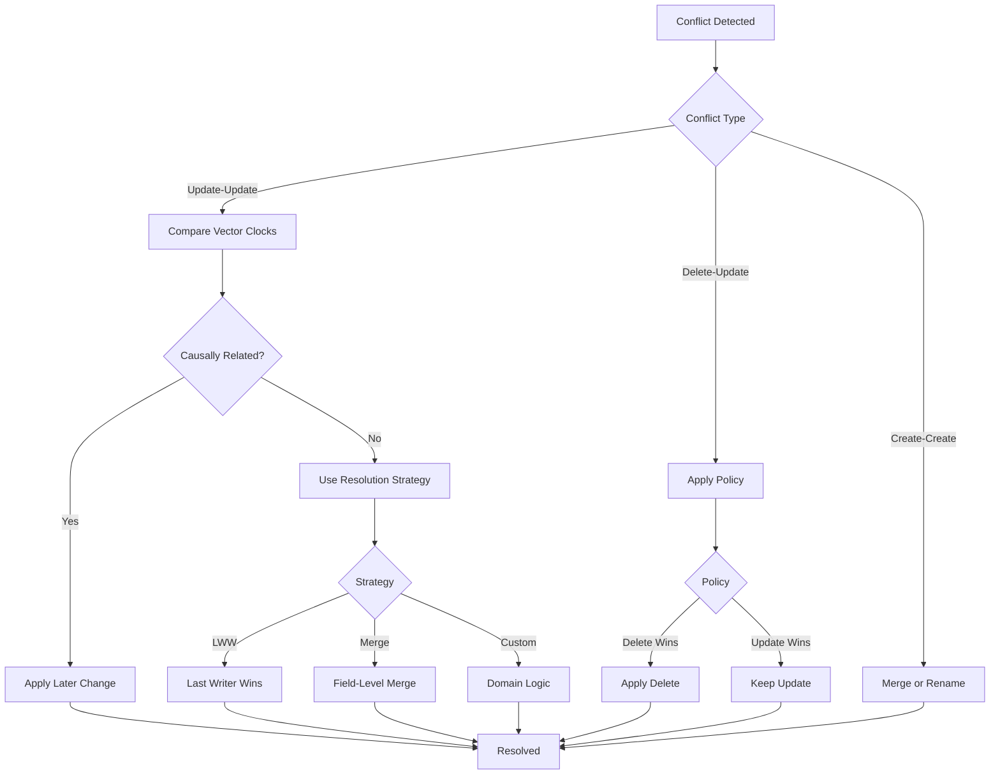

# How to Create Edge-Cloud Sync

Author: [nawazdhandala](https://github.com/nawazdhandala)

Tags: Edge Computing, Cloud Sync, Distributed Systems, Data Replication

Description: Learn to implement edge-cloud synchronization with conflict resolution, eventual consistency, and bandwidth optimization for hybrid architectures.

---

Edge computing brings computation closer to data sources, but maintaining synchronization between edge nodes and central cloud infrastructure presents unique challenges. This guide walks through building a robust edge-cloud sync system that handles network partitions, resolves conflicts, and optimizes bandwidth usage.

## Understanding Edge-Cloud Architecture

Before diving into implementation, let us understand the typical topology of an edge-cloud system.


Edge nodes operate semi-autonomously, processing data locally while periodically syncing with the cloud. This architecture provides low latency for local operations while ensuring data eventually reaches the central system.

## Sync Protocol Design

A well-designed sync protocol handles bidirectional data flow, tracks changes efficiently, and manages connection state. Here is a protocol implementation using vector clocks for causality tracking.

### Vector Clock Implementation

Vector clocks help track the causal relationship between events across distributed nodes.

```typescript
interface VectorClock {
  [nodeId: string]: number;
}

class SyncManager {
  private nodeId: string;
  private vectorClock: VectorClock = {};
  private pendingChanges: Change[] = [];

  constructor(nodeId: string) {
    this.nodeId = nodeId;
    this.vectorClock[nodeId] = 0;
  }

  // Increment local clock when making a change
  incrementClock(): VectorClock {
    this.vectorClock[this.nodeId] =
      (this.vectorClock[this.nodeId] || 0) + 1;
    return { ...this.vectorClock };
  }

  // Merge incoming clock with local clock
  mergeClock(incoming: VectorClock): void {
    for (const nodeId of Object.keys(incoming)) {
      this.vectorClock[nodeId] = Math.max(
        this.vectorClock[nodeId] || 0,
        incoming[nodeId]
      );
    }
  }

  // Compare two vector clocks to determine ordering
  compareClocks(a: VectorClock, b: VectorClock): 'before' | 'after' | 'concurrent' {
    let aBefore = false;
    let aAfter = false;

    const allKeys = new Set([...Object.keys(a), ...Object.keys(b)]);

    for (const key of allKeys) {
      const aVal = a[key] || 0;
      const bVal = b[key] || 0;

      if (aVal < bVal) aBefore = true;
      if (aVal > bVal) aAfter = true;
    }

    if (aBefore && !aAfter) return 'before';
    if (aAfter && !aBefore) return 'after';
    return 'concurrent';
  }
}
```

### Change Tracking Structure

Each change in the system carries metadata for synchronization decisions.

```typescript
interface Change {
  id: string;
  entityType: string;
  entityId: string;
  operation: 'create' | 'update' | 'delete';
  data: Record<string, unknown>;
  vectorClock: VectorClock;
  timestamp: number;
  nodeId: string;
  checksum: string;
}

interface SyncBatch {
  sourceNodeId: string;
  targetNodeId: string;
  changes: Change[];
  lastSyncTimestamp: number;
  batchId: string;
  compressed: boolean;
}
```

## Sync Protocol State Machine

The sync process follows a defined state machine to handle various network conditions and ensure data integrity.


### Protocol Implementation

```typescript
type SyncState = 'idle' | 'connecting' | 'handshake' | 'syncing' |
                 'resolving' | 'finalizing' | 'offline' | 'queuing';

class EdgeCloudSync {
  private state: SyncState = 'idle';
  private cloudEndpoint: string;
  private syncManager: SyncManager;
  private offlineQueue: Change[] = [];
  private retryCount: number = 0;
  private maxRetries: number = 5;

  constructor(nodeId: string, cloudEndpoint: string) {
    this.syncManager = new SyncManager(nodeId);
    this.cloudEndpoint = cloudEndpoint;
  }

  async startSync(): Promise<SyncResult> {
    if (this.state !== 'idle' && this.state !== 'offline') {
      throw new Error(`Cannot start sync from state: ${this.state}`);
    }

    this.state = 'connecting';

    try {
      // Establish connection with exponential backoff
      const connection = await this.connect();

      // Perform handshake to exchange sync metadata
      this.state = 'handshake';
      const syncMetadata = await this.performHandshake(connection);

      // Begin bidirectional sync
      this.state = 'syncing';
      const syncResult = await this.performSync(connection, syncMetadata);

      // Handle any conflicts
      if (syncResult.conflicts.length > 0) {
        this.state = 'resolving';
        await this.resolveConflicts(syncResult.conflicts);
      }

      // Finalize and commit changes
      this.state = 'finalizing';
      await this.finalize(connection, syncResult);

      this.state = 'idle';
      this.retryCount = 0;

      return { success: true, ...syncResult };

    } catch (error) {
      this.state = 'offline';
      return this.handleSyncError(error);
    }
  }

  private async connect(): Promise<Connection> {
    const backoffMs = Math.min(1000 * Math.pow(2, this.retryCount), 30000);

    return new Promise((resolve, reject) => {
      setTimeout(async () => {
        try {
          const conn = await fetch(`${this.cloudEndpoint}/sync/connect`, {
            method: 'POST',
            headers: { 'Content-Type': 'application/json' },
            body: JSON.stringify({
              nodeId: this.syncManager.nodeId,
              capabilities: ['delta-sync', 'compression', 'conflict-resolution']
            })
          });

          if (!conn.ok) throw new Error('Connection failed');
          resolve(await conn.json());
        } catch (err) {
          this.retryCount++;
          reject(err);
        }
      }, backoffMs);
    });
  }

  private async performHandshake(connection: Connection): Promise<SyncMetadata> {
    // Exchange vector clocks and determine sync window
    const localState = {
      vectorClock: this.syncManager.vectorClock,
      lastSyncTimestamp: this.getLastSyncTimestamp(),
      pendingChangesCount: this.offlineQueue.length
    };

    const response = await fetch(`${this.cloudEndpoint}/sync/handshake`, {
      method: 'POST',
      headers: {
        'Content-Type': 'application/json',
        'X-Session-Id': connection.sessionId
      },
      body: JSON.stringify(localState)
    });

    return response.json();
  }
}
```

## Conflict Resolution Strategies

Conflicts occur when the same data is modified on multiple nodes before synchronization. A robust conflict resolution system must handle various scenarios.



### Conflict Resolution Implementation

```typescript
interface Conflict {
  localChange: Change;
  remoteChange: Change;
  type: 'update-update' | 'delete-update' | 'create-create';
}

interface ResolutionResult {
  winner: 'local' | 'remote' | 'merged';
  resolvedData: Record<string, unknown>;
  metadata: {
    strategy: string;
    reason: string;
  };
}

type ResolutionStrategy = 'lww' | 'merge' | 'custom';

class ConflictResolver {
  private strategies: Map<string, ResolutionStrategy> = new Map();
  private customResolvers: Map<string, CustomResolver> = new Map();

  registerStrategy(entityType: string, strategy: ResolutionStrategy): void {
    this.strategies.set(entityType, strategy);
  }

  registerCustomResolver(entityType: string, resolver: CustomResolver): void {
    this.customResolvers.set(entityType, resolver);
    this.strategies.set(entityType, 'custom');
  }

  async resolve(conflict: Conflict): Promise<ResolutionResult> {
    const strategy = this.strategies.get(conflict.localChange.entityType) || 'lww';

    switch (conflict.type) {
      case 'update-update':
        return this.resolveUpdateConflict(conflict, strategy);
      case 'delete-update':
        return this.resolveDeleteUpdateConflict(conflict);
      case 'create-create':
        return this.resolveCreateConflict(conflict);
      default:
        throw new Error(`Unknown conflict type: ${conflict.type}`);
    }
  }

  private resolveUpdateConflict(
    conflict: Conflict,
    strategy: ResolutionStrategy
  ): ResolutionResult {
    const { localChange, remoteChange } = conflict;

    switch (strategy) {
      case 'lww':
        // Last Writer Wins based on timestamp
        const winner = localChange.timestamp > remoteChange.timestamp
          ? 'local' : 'remote';
        return {
          winner,
          resolvedData: winner === 'local' ? localChange.data : remoteChange.data,
          metadata: {
            strategy: 'lww',
            reason: `${winner} change has later timestamp`
          }
        };

      case 'merge':
        // Field-level merge - combine non-conflicting fields
        return this.fieldLevelMerge(localChange, remoteChange);

      case 'custom':
        const resolver = this.customResolvers.get(localChange.entityType);
        if (!resolver) {
          throw new Error(`No custom resolver for ${localChange.entityType}`);
        }
        return resolver(conflict);

      default:
        throw new Error(`Unknown strategy: ${strategy}`);
    }
  }

  private fieldLevelMerge(local: Change, remote: Change): ResolutionResult {
    const merged: Record<string, unknown> = {};
    const localData = local.data;
    const remoteData = remote.data;
    const allKeys = new Set([
      ...Object.keys(localData),
      ...Object.keys(remoteData)
    ]);

    for (const key of allKeys) {
      const localVal = localData[key];
      const remoteVal = remoteData[key];

      if (localVal === undefined) {
        merged[key] = remoteVal;
      } else if (remoteVal === undefined) {
        merged[key] = localVal;
      } else if (JSON.stringify(localVal) === JSON.stringify(remoteVal)) {
        merged[key] = localVal;
      } else {
        // For conflicting fields, use timestamp as tiebreaker
        merged[key] = local.timestamp > remote.timestamp ? localVal : remoteVal;
      }
    }

    return {
      winner: 'merged',
      resolvedData: merged,
      metadata: {
        strategy: 'merge',
        reason: 'Field-level merge with timestamp tiebreaker'
      }
    };
  }

  private resolveDeleteUpdateConflict(conflict: Conflict): ResolutionResult {
    const { localChange, remoteChange } = conflict;

    // Policy: Update wins over delete if update is more recent
    const deleteChange = localChange.operation === 'delete'
      ? localChange : remoteChange;
    const updateChange = localChange.operation === 'update'
      ? localChange : remoteChange;

    if (updateChange.timestamp > deleteChange.timestamp) {
      return {
        winner: updateChange === localChange ? 'local' : 'remote',
        resolvedData: updateChange.data,
        metadata: {
          strategy: 'delete-update-policy',
          reason: 'Update is more recent than delete'
        }
      };
    }

    return {
      winner: deleteChange === localChange ? 'local' : 'remote',
      resolvedData: {},
      metadata: {
        strategy: 'delete-update-policy',
        reason: 'Delete is more recent than update'
      }
    };
  }

  private resolveCreateConflict(conflict: Conflict): ResolutionResult {
    // For create-create conflicts, merge data and keep one ID
    const merged = {
      ...conflict.remoteChange.data,
      ...conflict.localChange.data
    };

    return {
      winner: 'merged',
      resolvedData: merged,
      metadata: {
        strategy: 'create-merge',
        reason: 'Merged duplicate creates'
      }
    };
  }
}
```

## Offline Queue Management

Edge nodes must handle network partitions gracefully. An offline queue stores changes locally until connectivity is restored.


### Queue Implementation

```typescript
interface QueuedChange extends Change {
  status: 'pending' | 'syncing' | 'synced' | 'failed';
  retryCount: number;
  queuedAt: number;
  lastAttempt: number | null;
  error: string | null;
}

class OfflineQueue {
  private db: LocalDatabase;
  private maxRetries: number = 3;
  private batchSize: number = 100;

  constructor(db: LocalDatabase) {
    this.db = db;
  }

  async enqueue(change: Change): Promise<void> {
    const queuedChange: QueuedChange = {
      ...change,
      status: 'pending',
      retryCount: 0,
      queuedAt: Date.now(),
      lastAttempt: null,
      error: null
    };

    await this.db.insert('sync_queue', queuedChange);

    // Trigger sync if online
    if (navigator.onLine) {
      this.triggerSync();
    }
  }

  async getPendingChanges(): Promise<QueuedChange[]> {
    return this.db.query('sync_queue', {
      where: {
        status: ['pending', 'failed'],
        retryCount: { lt: this.maxRetries }
      },
      orderBy: 'queuedAt',
      limit: this.batchSize
    });
  }

  async markSyncing(changeIds: string[]): Promise<void> {
    await this.db.update('sync_queue', {
      where: { id: { in: changeIds } },
      set: {
        status: 'syncing',
        lastAttempt: Date.now()
      }
    });
  }

  async markSynced(changeIds: string[]): Promise<void> {
    await this.db.update('sync_queue', {
      where: { id: { in: changeIds } },
      set: { status: 'synced' }
    });

    // Clean up old synced items periodically
    await this.cleanup();
  }

  async markFailed(changeId: string, error: string): Promise<void> {
    const change = await this.db.findOne('sync_queue', changeId);

    await this.db.update('sync_queue', {
      where: { id: changeId },
      set: {
        status: 'failed',
        retryCount: change.retryCount + 1,
        error
      }
    });
  }

  async getQueueStats(): Promise<QueueStats> {
    const counts = await this.db.aggregate('sync_queue', {
      groupBy: 'status',
      count: true
    });

    return {
      pending: counts.pending || 0,
      syncing: counts.syncing || 0,
      failed: counts.failed || 0,
      total: Object.values(counts).reduce((a, b) => a + b, 0)
    };
  }

  private async cleanup(): Promise<void> {
    const oneDayAgo = Date.now() - 24 * 60 * 60 * 1000;

    await this.db.delete('sync_queue', {
      where: {
        status: 'synced',
        queuedAt: { lt: oneDayAgo }
      }
    });
  }

  private triggerSync(): void {
    // Debounced sync trigger
    if (this.syncTimeout) clearTimeout(this.syncTimeout);
    this.syncTimeout = setTimeout(() => {
      eventEmitter.emit('sync:requested');
    }, 1000);
  }
}
```

### Persistence Layer for Offline Data

```typescript
class LocalDatabase {
  private db: IDBDatabase;

  async initialize(): Promise<void> {
    return new Promise((resolve, reject) => {
      const request = indexedDB.open('EdgeSyncDB', 1);

      request.onerror = () => reject(request.error);
      request.onsuccess = () => {
        this.db = request.result;
        resolve();
      };

      request.onupgradeneeded = (event) => {
        const db = (event.target as IDBOpenDBRequest).result;

        // Sync queue store
        const queueStore = db.createObjectStore('sync_queue', { keyPath: 'id' });
        queueStore.createIndex('status', 'status');
        queueStore.createIndex('queuedAt', 'queuedAt');
        queueStore.createIndex('entityType', 'entityType');

        // Local data store
        const dataStore = db.createObjectStore('local_data', { keyPath: 'id' });
        dataStore.createIndex('entityType', 'entityType');
        dataStore.createIndex('updatedAt', 'updatedAt');

        // Sync metadata store
        db.createObjectStore('sync_metadata', { keyPath: 'key' });
      };
    });
  }

  async insert(storeName: string, data: unknown): Promise<void> {
    return new Promise((resolve, reject) => {
      const transaction = this.db.transaction(storeName, 'readwrite');
      const store = transaction.objectStore(storeName);
      const request = store.add(data);

      request.onerror = () => reject(request.error);
      request.onsuccess = () => resolve();
    });
  }

  async query(storeName: string, options: QueryOptions): Promise<unknown[]> {
    return new Promise((resolve, reject) => {
      const transaction = this.db.transaction(storeName, 'readonly');
      const store = transaction.objectStore(storeName);
      const results: unknown[] = [];

      let source: IDBObjectStore | IDBIndex = store;
      if (options.index) {
        source = store.index(options.index);
      }

      const request = source.openCursor();

      request.onerror = () => reject(request.error);
      request.onsuccess = (event) => {
        const cursor = (event.target as IDBRequest).result;

        if (cursor && results.length < (options.limit || Infinity)) {
          if (this.matchesWhere(cursor.value, options.where)) {
            results.push(cursor.value);
          }
          cursor.continue();
        } else {
          resolve(results);
        }
      };
    });
  }

  private matchesWhere(value: unknown, where: WhereClause): boolean {
    if (!where) return true;

    for (const [key, condition] of Object.entries(where)) {
      const fieldValue = value[key];

      if (Array.isArray(condition)) {
        if (!condition.includes(fieldValue)) return false;
      } else if (typeof condition === 'object') {
        if (condition.lt !== undefined && fieldValue >= condition.lt) return false;
        if (condition.gt !== undefined && fieldValue <= condition.gt) return false;
        if (condition.in !== undefined && !condition.in.includes(fieldValue)) return false;
      } else {
        if (fieldValue !== condition) return false;
      }
    }

    return true;
  }
}
```

## Bandwidth Optimization

Edge environments often have limited or metered connectivity. Implementing bandwidth optimization ensures efficient data transfer.


### Delta Sync Implementation

Instead of sending full records, delta sync transmits only the changed fields.

```typescript
interface Delta {
  entityId: string;
  entityType: string;
  baseVersion: number;
  targetVersion: number;
  operations: DeltaOperation[];
}

interface DeltaOperation {
  op: 'set' | 'unset' | 'increment' | 'push' | 'pull';
  path: string;
  value?: unknown;
}

class DeltaEncoder {
  // Generate delta between two versions of an entity
  encode(oldData: Record<string, unknown>, newData: Record<string, unknown>): DeltaOperation[] {
    const operations: DeltaOperation[] = [];
    const allKeys = new Set([...Object.keys(oldData), ...Object.keys(newData)]);

    for (const key of allKeys) {
      const oldVal = oldData[key];
      const newVal = newData[key];

      if (newVal === undefined && oldVal !== undefined) {
        operations.push({ op: 'unset', path: key });
      } else if (oldVal === undefined && newVal !== undefined) {
        operations.push({ op: 'set', path: key, value: newVal });
      } else if (JSON.stringify(oldVal) !== JSON.stringify(newVal)) {
        // Check for numeric increment
        if (typeof oldVal === 'number' && typeof newVal === 'number') {
          operations.push({
            op: 'increment',
            path: key,
            value: newVal - oldVal
          });
        }
        // Check for array append
        else if (Array.isArray(oldVal) && Array.isArray(newVal)) {
          const arrayOps = this.encodeArrayDelta(key, oldVal, newVal);
          operations.push(...arrayOps);
        }
        else {
          operations.push({ op: 'set', path: key, value: newVal });
        }
      }
    }

    return operations;
  }

  // Apply delta to reconstruct the new version
  decode(
    baseData: Record<string, unknown>,
    operations: DeltaOperation[]
  ): Record<string, unknown> {
    const result = { ...baseData };

    for (const op of operations) {
      switch (op.op) {
        case 'set':
          this.setPath(result, op.path, op.value);
          break;
        case 'unset':
          this.unsetPath(result, op.path);
          break;
        case 'increment':
          const current = this.getPath(result, op.path) as number || 0;
          this.setPath(result, op.path, current + (op.value as number));
          break;
        case 'push':
          const arr = this.getPath(result, op.path) as unknown[] || [];
          this.setPath(result, op.path, [...arr, op.value]);
          break;
        case 'pull':
          const existing = this.getPath(result, op.path) as unknown[] || [];
          this.setPath(result, op.path,
            existing.filter(item => JSON.stringify(item) !== JSON.stringify(op.value))
          );
          break;
      }
    }

    return result;
  }

  private encodeArrayDelta(path: string, oldArr: unknown[], newArr: unknown[]): DeltaOperation[] {
    const ops: DeltaOperation[] = [];
    const oldSet = new Set(oldArr.map(item => JSON.stringify(item)));
    const newSet = new Set(newArr.map(item => JSON.stringify(item)));

    // Find additions
    for (const item of newArr) {
      const key = JSON.stringify(item);
      if (!oldSet.has(key)) {
        ops.push({ op: 'push', path, value: item });
      }
    }

    // Find removals
    for (const item of oldArr) {
      const key = JSON.stringify(item);
      if (!newSet.has(key)) {
        ops.push({ op: 'pull', path, value: item });
      }
    }

    // If delta is larger than full replacement, just set the value
    if (ops.length > newArr.length) {
      return [{ op: 'set', path, value: newArr }];
    }

    return ops;
  }

  private setPath(obj: Record<string, unknown>, path: string, value: unknown): void {
    const parts = path.split('.');
    let current = obj;

    for (let i = 0; i < parts.length - 1; i++) {
      if (!(parts[i] in current)) {
        current[parts[i]] = {};
      }
      current = current[parts[i]] as Record<string, unknown>;
    }

    current[parts[parts.length - 1]] = value;
  }

  private unsetPath(obj: Record<string, unknown>, path: string): void {
    const parts = path.split('.');
    let current = obj;

    for (let i = 0; i < parts.length - 1; i++) {
      if (!(parts[i] in current)) return;
      current = current[parts[i]] as Record<string, unknown>;
    }

    delete current[parts[parts.length - 1]];
  }

  private getPath(obj: Record<string, unknown>, path: string): unknown {
    const parts = path.split('.');
    let current: unknown = obj;

    for (const part of parts) {
      if (current === undefined || current === null) return undefined;
      current = (current as Record<string, unknown>)[part];
    }

    return current;
  }
}
```

### Compression and Batching

```typescript
import pako from 'pako';

class BandwidthOptimizer {
  private compressionThreshold: number = 1024; // Compress if larger than 1KB

  async prepareBatch(changes: Change[]): Promise<PreparedBatch> {
    // Convert to delta format where possible
    const deltas = await this.convertToDeltas(changes);

    // Serialize the batch
    const serialized = JSON.stringify(deltas);

    // Compress if beneficial
    let payload: ArrayBuffer | string;
    let compressed = false;

    if (serialized.length > this.compressionThreshold) {
      const compressed_data = pako.deflate(serialized);
      if (compressed_data.length < serialized.length * 0.9) {
        payload = compressed_data;
        compressed = true;
      } else {
        payload = serialized;
      }
    } else {
      payload = serialized;
    }

    return {
      payload,
      compressed,
      originalSize: serialized.length,
      compressedSize: compressed ? (payload as ArrayBuffer).byteLength : serialized.length,
      changeCount: changes.length
    };
  }

  private async convertToDeltas(changes: Change[]): Promise<(Change | Delta)[]> {
    const deltaEncoder = new DeltaEncoder();
    const results: (Change | Delta)[] = [];

    for (const change of changes) {
      if (change.operation === 'update') {
        // Fetch base version from local store
        const baseData = await this.getBaseVersion(change.entityId);

        if (baseData) {
          const operations = deltaEncoder.encode(baseData, change.data);

          // Only use delta if it is smaller
          const deltaSize = JSON.stringify(operations).length;
          const fullSize = JSON.stringify(change.data).length;

          if (deltaSize < fullSize * 0.8) {
            results.push({
              entityId: change.entityId,
              entityType: change.entityType,
              baseVersion: baseData._version,
              targetVersion: change.vectorClock[change.nodeId],
              operations
            });
            continue;
          }
        }
      }

      results.push(change);
    }

    return results;
  }

  // Adaptive sync based on network conditions
  async adaptiveSync(
    queue: OfflineQueue,
    networkInfo: NetworkInfo
  ): Promise<SyncPlan> {
    const stats = await queue.getQueueStats();

    // Determine sync strategy based on network quality
    if (networkInfo.effectiveType === '4g' && !networkInfo.saveData) {
      return {
        strategy: 'full',
        batchSize: 100,
        priority: 'all',
        compression: true
      };
    }

    if (networkInfo.effectiveType === '3g') {
      return {
        strategy: 'priority',
        batchSize: 50,
        priority: 'high',
        compression: true
      };
    }

    // Poor connection - only sync critical data
    return {
      strategy: 'critical',
      batchSize: 10,
      priority: 'critical',
      compression: true
    };
  }
}
```

## Consistency Models

Different data types require different consistency guarantees. Understanding and implementing appropriate consistency models is crucial.


### Consistency Level Implementation

```typescript
type ConsistencyLevel = 'strong' | 'eventual' | 'causal' | 'session';

interface ConsistencyConfig {
  level: ConsistencyLevel;
  readQuorum?: number;
  writeQuorum?: number;
  maxStaleness?: number; // milliseconds
}

class ConsistencyManager {
  private configs: Map<string, ConsistencyConfig> = new Map();
  private sessionTokens: Map<string, VectorClock> = new Map();

  configure(entityType: string, config: ConsistencyConfig): void {
    this.configs.set(entityType, config);
  }

  async read<T>(
    entityType: string,
    entityId: string,
    options: ReadOptions = {}
  ): Promise<T> {
    const config = this.configs.get(entityType) || { level: 'eventual' };

    switch (config.level) {
      case 'strong':
        return this.strongRead(entityType, entityId);

      case 'eventual':
        return this.eventualRead(entityType, entityId, config.maxStaleness);

      case 'causal':
        return this.causalRead(entityType, entityId, options.afterClock);

      case 'session':
        return this.sessionRead(entityType, entityId, options.sessionId);

      default:
        throw new Error(`Unknown consistency level: ${config.level}`);
    }
  }

  private async strongRead<T>(entityType: string, entityId: string): Promise<T> {
    // Read from cloud to ensure latest data
    const response = await fetch(`${this.cloudEndpoint}/data/${entityType}/${entityId}`, {
      headers: { 'X-Consistency': 'strong' }
    });

    if (!response.ok) {
      throw new Error('Strong read failed - cloud unavailable');
    }

    const data = await response.json();

    // Update local cache
    await this.localStore.put(entityType, entityId, data);

    return data;
  }

  private async eventualRead<T>(
    entityType: string,
    entityId: string,
    maxStaleness?: number
  ): Promise<T> {
    // Try local first
    const local = await this.localStore.get(entityType, entityId);

    if (local) {
      const age = Date.now() - local._updatedAt;

      // Return local if within staleness bounds or offline
      if (!navigator.onLine || (maxStaleness && age < maxStaleness)) {
        return local;
      }
    }

    // Fetch from cloud if available
    try {
      const response = await fetch(
        `${this.cloudEndpoint}/data/${entityType}/${entityId}`
      );
      const data = await response.json();
      await this.localStore.put(entityType, entityId, data);
      return data;
    } catch (error) {
      // Fall back to local on network error
      if (local) return local;
      throw error;
    }
  }

  private async causalRead<T>(
    entityType: string,
    entityId: string,
    afterClock?: VectorClock
  ): Promise<T> {
    const local = await this.localStore.get(entityType, entityId);

    if (!afterClock) {
      return local || this.fetchFromCloud(entityType, entityId);
    }

    // Check if local data satisfies causal dependency
    if (local && this.satisfiesCausality(local._vectorClock, afterClock)) {
      return local;
    }

    // Need to fetch from cloud to satisfy causality
    const cloudData = await this.fetchFromCloud(entityType, entityId);

    if (!this.satisfiesCausality(cloudData._vectorClock, afterClock)) {
      // Causal dependency not yet propagated - wait and retry
      await this.waitForCausality(entityType, entityId, afterClock);
      return this.causalRead(entityType, entityId, afterClock);
    }

    return cloudData;
  }

  private async sessionRead<T>(
    entityType: string,
    entityId: string,
    sessionId?: string
  ): Promise<T> {
    if (!sessionId) {
      return this.eventualRead(entityType, entityId);
    }

    const sessionClock = this.sessionTokens.get(sessionId);

    if (sessionClock) {
      // Read your own writes - use causal read with session clock
      return this.causalRead(entityType, entityId, sessionClock);
    }

    return this.eventualRead(entityType, entityId);
  }

  // Update session token after writes
  updateSessionToken(sessionId: string, clock: VectorClock): void {
    const existing = this.sessionTokens.get(sessionId) || {};

    // Merge clocks
    for (const [nodeId, timestamp] of Object.entries(clock)) {
      existing[nodeId] = Math.max(existing[nodeId] || 0, timestamp);
    }

    this.sessionTokens.set(sessionId, existing);
  }

  private satisfiesCausality(dataClock: VectorClock, requiredClock: VectorClock): boolean {
    for (const [nodeId, required] of Object.entries(requiredClock)) {
      if ((dataClock[nodeId] || 0) < required) {
        return false;
      }
    }
    return true;
  }
}
```

## Putting It All Together

Here is a complete edge-cloud sync client that combines all the components.

```typescript
class EdgeCloudClient {
  private syncManager: SyncManager;
  private offlineQueue: OfflineQueue;
  private conflictResolver: ConflictResolver;
  private bandwidthOptimizer: BandwidthOptimizer;
  private consistencyManager: ConsistencyManager;
  private localDb: LocalDatabase;

  constructor(config: EdgeCloudConfig) {
    this.localDb = new LocalDatabase();
    this.syncManager = new SyncManager(config.nodeId);
    this.offlineQueue = new OfflineQueue(this.localDb);
    this.conflictResolver = new ConflictResolver();
    this.bandwidthOptimizer = new BandwidthOptimizer();
    this.consistencyManager = new ConsistencyManager();

    // Set up network listeners
    this.setupNetworkListeners();

    // Configure consistency levels per entity type
    this.configureConsistency(config.consistencyRules);

    // Configure conflict resolution strategies
    this.configureConflictResolution(config.conflictStrategies);
  }

  async initialize(): Promise<void> {
    await this.localDb.initialize();

    // Start background sync if online
    if (navigator.onLine) {
      this.startBackgroundSync();
    }
  }

  // Write data - queues for sync automatically
  async write<T extends Record<string, unknown>>(
    entityType: string,
    entityId: string,
    data: T,
    options: WriteOptions = {}
  ): Promise<WriteResult> {
    // Increment vector clock
    const clock = this.syncManager.incrementClock();

    // Create change record
    const change: Change = {
      id: crypto.randomUUID(),
      entityType,
      entityId,
      operation: options.isNew ? 'create' : 'update',
      data,
      vectorClock: clock,
      timestamp: Date.now(),
      nodeId: this.syncManager.nodeId,
      checksum: this.computeChecksum(data)
    };

    // Write to local store
    await this.localDb.put('local_data', entityId, {
      ...data,
      _vectorClock: clock,
      _updatedAt: Date.now()
    });

    // Queue for sync
    await this.offlineQueue.enqueue(change);

    // Update session token for read-your-writes
    if (options.sessionId) {
      this.consistencyManager.updateSessionToken(options.sessionId, clock);
    }

    return {
      success: true,
      entityId,
      vectorClock: clock,
      synced: false
    };
  }

  // Read data with configurable consistency
  async read<T>(
    entityType: string,
    entityId: string,
    options: ReadOptions = {}
  ): Promise<T | null> {
    return this.consistencyManager.read(entityType, entityId, options);
  }

  // Delete data
  async delete(
    entityType: string,
    entityId: string
  ): Promise<void> {
    const clock = this.syncManager.incrementClock();

    const change: Change = {
      id: crypto.randomUUID(),
      entityType,
      entityId,
      operation: 'delete',
      data: {},
      vectorClock: clock,
      timestamp: Date.now(),
      nodeId: this.syncManager.nodeId,
      checksum: ''
    };

    await this.localDb.delete('local_data', entityId);
    await this.offlineQueue.enqueue(change);
  }

  // Force immediate sync
  async sync(): Promise<SyncResult> {
    if (!navigator.onLine) {
      return { success: false, error: 'Offline' };
    }

    const networkInfo = await this.getNetworkInfo();
    const syncPlan = await this.bandwidthOptimizer.adaptiveSync(
      this.offlineQueue,
      networkInfo
    );

    // Get pending changes based on sync plan
    const changes = await this.offlineQueue.getPendingChanges();
    const prioritizedChanges = this.prioritizeChanges(changes, syncPlan);

    // Prepare optimized batch
    const batch = await this.bandwidthOptimizer.prepareBatch(prioritizedChanges);

    try {
      // Upload changes
      const uploadResult = await this.uploadBatch(batch);

      // Download remote changes
      const remoteChanges = await this.downloadChanges();

      // Detect and resolve conflicts
      const conflicts = this.detectConflicts(prioritizedChanges, remoteChanges);

      for (const conflict of conflicts) {
        const resolution = await this.conflictResolver.resolve(conflict);
        await this.applyResolution(conflict, resolution);
      }

      // Apply non-conflicting remote changes
      await this.applyRemoteChanges(remoteChanges, conflicts);

      // Mark local changes as synced
      await this.offlineQueue.markSynced(
        prioritizedChanges.map(c => c.id)
      );

      return {
        success: true,
        uploaded: prioritizedChanges.length,
        downloaded: remoteChanges.length,
        conflicts: conflicts.length
      };

    } catch (error) {
      for (const change of prioritizedChanges) {
        await this.offlineQueue.markFailed(change.id, error.message);
      }
      return { success: false, error: error.message };
    }
  }

  private setupNetworkListeners(): void {
    window.addEventListener('online', () => {
      console.log('Network restored - starting sync');
      this.sync();
    });

    window.addEventListener('offline', () => {
      console.log('Network lost - queuing changes locally');
    });
  }

  private startBackgroundSync(): void {
    // Sync every 30 seconds when online
    setInterval(() => {
      if (navigator.onLine) {
        this.sync();
      }
    }, 30000);
  }

  private computeChecksum(data: Record<string, unknown>): string {
    const str = JSON.stringify(data, Object.keys(data).sort());
    let hash = 0;
    for (let i = 0; i < str.length; i++) {
      const char = str.charCodeAt(i);
      hash = ((hash << 5) - hash) + char;
      hash = hash & hash;
    }
    return hash.toString(16);
  }
}

// Usage example
const client = new EdgeCloudClient({
  nodeId: 'edge-node-001',
  cloudEndpoint: 'https://api.example.com',
  consistencyRules: {
    'sensor-data': { level: 'eventual', maxStaleness: 60000 },
    'user-config': { level: 'session' },
    'transactions': { level: 'strong' }
  },
  conflictStrategies: {
    'sensor-data': 'lww',
    'user-config': 'merge',
    'transactions': 'custom'
  }
});

await client.initialize();

// Write sensor data (eventual consistency)
await client.write('sensor-data', 'temp-001', {
  temperature: 23.5,
  humidity: 65,
  timestamp: Date.now()
});

// Read with session consistency (read your own writes)
const config = await client.read('user-config', 'user-123', {
  sessionId: 'session-abc'
});
```

## Summary

Building a robust edge-cloud sync system requires careful consideration of several interconnected components:

1. **Sync Protocol Design** - Use vector clocks for causality tracking and implement a state machine to handle connection lifecycle gracefully.

2. **Conflict Resolution** - Support multiple strategies including last-writer-wins, field-level merge, and custom domain logic. Choose the appropriate strategy based on your data semantics.

3. **Offline Queue Management** - Persist changes locally with proper status tracking and retry logic. Ensure no data is lost during network partitions.

4. **Bandwidth Optimization** - Implement delta encoding, compression, and adaptive batching to minimize data transfer, especially important for metered connections.

5. **Consistency Models** - Different data types require different consistency guarantees. Implement strong, eventual, causal, and session consistency based on your application needs.

The key to success is understanding your specific use case requirements and choosing the right trade-offs between consistency, availability, and partition tolerance. Start simple, measure your actual requirements, and add complexity only where needed.
