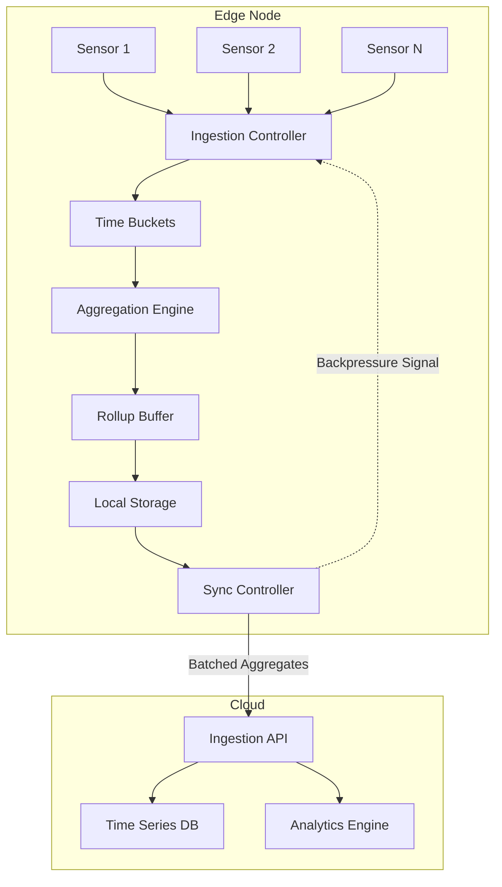
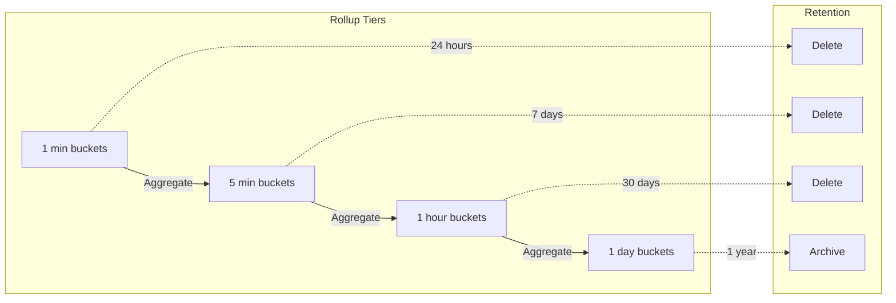
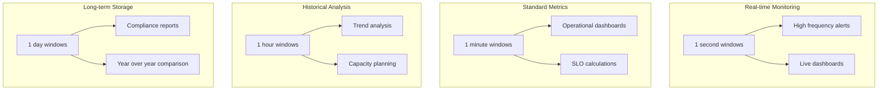
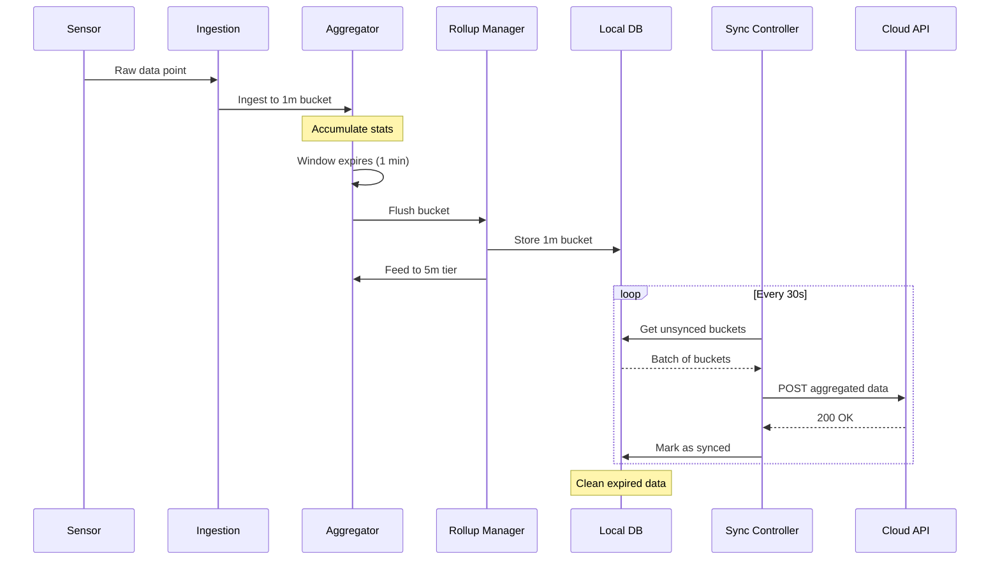

# How to Build Data Aggregation Edge

Author: [nawazdhandala](https://github.com/nawazdhandala)

Tags: Edge Computing, Data Aggregation, Bandwidth, IoT

Description: Learn to build data aggregation at the edge for combining and summarizing data before transmission.

---

Edge computing has fundamentally changed how we process data. Instead of sending every raw sensor reading, log entry, or metric to a central server, smart edge nodes can aggregate, summarize, and compress data locally. This reduces bandwidth consumption by 80-95%, cuts latency, and improves reliability in unreliable network conditions.

This guide walks you through building a production-ready data aggregation layer at the edge, covering aggregation windows, rollup strategies, storage optimization, and practical implementations.

---

## Why Aggregate at the Edge?

| Challenge | Without Edge Aggregation | With Edge Aggregation |
|-----------|-------------------------|----------------------|
| Bandwidth | 100 MB/hour raw data | 5-10 MB/hour summarized |
| Latency | Full round-trip for every data point | Local decisions, batched sync |
| Reliability | Data loss on network outage | Local buffering, eventual sync |
| Cost | High cloud ingestion costs | Reduced compute and storage bills |
| Privacy | All raw data leaves premises | Only aggregates transmitted |

---

## Architecture Overview



The architecture follows a pipeline model:

1. **Ingestion Controller**: Receives raw data from sensors or services
2. **Time Buckets**: Groups data points into configurable time windows
3. **Aggregation Engine**: Computes statistical summaries per bucket
4. **Rollup Buffer**: Manages hierarchical rollups (1m -> 5m -> 1h -> 1d)
5. **Local Storage**: Persists aggregates for reliability
6. **Sync Controller**: Batches and transmits to cloud with retry logic

---

## Core Data Structures

### TypeScript Implementation

```typescript
// core/types.ts
// Data structures for edge aggregation

/**
 * Raw data point from a sensor or service.
 * Timestamp uses Unix milliseconds for precision.
 */
export interface DataPoint {
  metric: string;        // e.g., "temperature", "cpu.usage"
  value: number;         // Numeric measurement
  timestamp: number;     // Unix timestamp in milliseconds
  tags: Record<string, string>;  // Dimensional metadata
}

/**
 * Aggregated bucket containing statistical summaries.
 * Each bucket represents a fixed time window.
 */
export interface AggregatedBucket {
  metric: string;
  tags: Record<string, string>;
  windowStart: number;   // Start of time window (ms)
  windowEnd: number;     // End of time window (ms)
  count: number;         // Number of data points
  sum: number;           // Sum of all values
  min: number;           // Minimum value observed
  max: number;           // Maximum value observed
  mean: number;          // Arithmetic mean
  variance: number;      // Population variance
  p50: number;           // 50th percentile (median)
  p95: number;           // 95th percentile
  p99: number;           // 99th percentile
}

/**
 * Configuration for aggregation windows.
 * Supports multiple granularities for hierarchical rollups.
 */
export interface WindowConfig {
  durationMs: number;    // Window size in milliseconds
  retentionMs: number;   // How long to keep data locally
  flushIntervalMs: number;  // How often to flush to next tier
}

/**
 * Rollup tier configuration for hierarchical aggregation.
 * Example: 1 minute -> 5 minutes -> 1 hour -> 1 day
 */
export interface RollupConfig {
  tiers: WindowConfig[];
  syncBatchSize: number;
  maxRetries: number;
  retryBackoffMs: number;
}
```

---

## Aggregation Engine

The aggregation engine maintains running statistics using Welford's algorithm for numerically stable variance computation.

```typescript
// engine/aggregator.ts
import { DataPoint, AggregatedBucket, WindowConfig } from '../core/types';

/**
 * Maintains running statistics for a single metric+tags combination.
 * Uses Welford's online algorithm for stable variance calculation.
 */
class RunningStats {
  private count = 0;
  private sum = 0;
  private min = Infinity;
  private max = -Infinity;
  private mean = 0;
  private m2 = 0;  // Sum of squared differences from mean
  private values: number[] = [];  // For percentile calculation

  /**
   * Add a new value to the running statistics.
   * Time complexity: O(1) for stats, O(n) for percentiles
   */
  addValue(value: number): void {
    this.count++;
    this.sum += value;
    this.min = Math.min(this.min, value);
    this.max = Math.max(this.max, value);

    // Welford's online algorithm for variance
    const delta = value - this.mean;
    this.mean += delta / this.count;
    const delta2 = value - this.mean;
    this.m2 += delta * delta2;

    // Store for percentile calculation
    // Consider using t-digest or DDSketch for memory efficiency
    this.values.push(value);
  }

  /**
   * Calculate a percentile from stored values.
   * Uses linear interpolation between nearest ranks.
   */
  getPercentile(p: number): number {
    if (this.values.length === 0) return 0;

    const sorted = [...this.values].sort((a, b) => a - b);
    const index = (p / 100) * (sorted.length - 1);
    const lower = Math.floor(index);
    const upper = Math.ceil(index);

    if (lower === upper) return sorted[lower];

    // Linear interpolation
    const weight = index - lower;
    return sorted[lower] * (1 - weight) + sorted[upper] * weight;
  }

  /**
   * Export final statistics for the bucket.
   */
  getStats(): Partial<AggregatedBucket> {
    return {
      count: this.count,
      sum: this.sum,
      min: this.count > 0 ? this.min : 0,
      max: this.count > 0 ? this.max : 0,
      mean: this.mean,
      variance: this.count > 1 ? this.m2 / this.count : 0,
      p50: this.getPercentile(50),
      p95: this.getPercentile(95),
      p99: this.getPercentile(99),
    };
  }

  /**
   * Reset statistics for the next window.
   */
  reset(): void {
    this.count = 0;
    this.sum = 0;
    this.min = Infinity;
    this.max = -Infinity;
    this.mean = 0;
    this.m2 = 0;
    this.values = [];
  }
}

/**
 * Aggregation engine that manages time-windowed buckets.
 * Groups data by metric name and tag combinations.
 */
export class AggregationEngine {
  private buckets: Map<string, RunningStats> = new Map();
  private windowStart: number;
  private config: WindowConfig;
  private onFlush: (buckets: AggregatedBucket[]) => void;

  constructor(
    config: WindowConfig,
    onFlush: (buckets: AggregatedBucket[]) => void
  ) {
    this.config = config;
    this.onFlush = onFlush;
    this.windowStart = this.alignToWindow(Date.now());

    // Schedule periodic flushes
    setInterval(() => this.maybeFlush(), config.flushIntervalMs);
  }

  /**
   * Align timestamp to window boundary.
   * Ensures consistent bucketing across restarts.
   */
  private alignToWindow(timestamp: number): number {
    return Math.floor(timestamp / this.config.durationMs) * this.config.durationMs;
  }

  /**
   * Generate a unique key for metric + tags combination.
   * Tags are sorted for consistent key generation.
   */
  private getBucketKey(metric: string, tags: Record<string, string>): string {
    const sortedTags = Object.entries(tags)
      .sort(([a], [b]) => a.localeCompare(b))
      .map(([k, v]) => `${k}=${v}`)
      .join(',');
    return `${metric}|${sortedTags}`;
  }

  /**
   * Parse metric and tags from bucket key.
   */
  private parseBucketKey(key: string): { metric: string; tags: Record<string, string> } {
    const [metric, tagStr] = key.split('|');
    const tags: Record<string, string> = {};

    if (tagStr) {
      tagStr.split(',').forEach(pair => {
        const [k, v] = pair.split('=');
        if (k && v) tags[k] = v;
      });
    }

    return { metric, tags };
  }

  /**
   * Ingest a raw data point into the appropriate bucket.
   */
  ingest(point: DataPoint): void {
    // Check if we need to flush before ingesting
    const pointWindow = this.alignToWindow(point.timestamp);
    if (pointWindow > this.windowStart) {
      this.flush();
      this.windowStart = pointWindow;
    }

    // Get or create bucket for this metric+tags
    const key = this.getBucketKey(point.metric, point.tags);
    let stats = this.buckets.get(key);

    if (!stats) {
      stats = new RunningStats();
      this.buckets.set(key, stats);
    }

    stats.addValue(point.value);
  }

  /**
   * Check if current window has elapsed and flush if needed.
   */
  private maybeFlush(): void {
    const now = Date.now();
    const currentWindow = this.alignToWindow(now);

    if (currentWindow > this.windowStart) {
      this.flush();
      this.windowStart = currentWindow;
    }
  }

  /**
   * Flush all buckets and emit aggregated data.
   */
  private flush(): void {
    if (this.buckets.size === 0) return;

    const aggregated: AggregatedBucket[] = [];

    for (const [key, stats] of this.buckets) {
      const { metric, tags } = this.parseBucketKey(key);
      const bucket: AggregatedBucket = {
        metric,
        tags,
        windowStart: this.windowStart,
        windowEnd: this.windowStart + this.config.durationMs,
        ...stats.getStats() as any,
      };
      aggregated.push(bucket);
    }

    // Clear buckets for next window
    this.buckets.clear();

    // Emit to next stage
    this.onFlush(aggregated);
  }
}
```

---

## Hierarchical Rollup Strategy



Hierarchical rollups reduce storage while preserving historical visibility:

```typescript
// engine/rollup-manager.ts
import { AggregatedBucket, RollupConfig, WindowConfig } from '../core/types';
import { AggregationEngine } from './aggregator';

/**
 * Manages hierarchical rollup tiers.
 * Each tier aggregates from the previous tier.
 */
export class RollupManager {
  private tiers: Map<number, AggregationEngine> = new Map();
  private storage: LocalStorage;
  private config: RollupConfig;

  constructor(config: RollupConfig, storage: LocalStorage) {
    this.config = config;
    this.storage = storage;
    this.initializeTiers();
  }

  /**
   * Initialize aggregation engines for each tier.
   * Tiers are chained so each feeds into the next.
   */
  private initializeTiers(): void {
    const { tiers } = this.config;

    for (let i = 0; i < tiers.length; i++) {
      const tierConfig = tiers[i];
      const nextTierIndex = i + 1;

      const engine = new AggregationEngine(
        tierConfig,
        (buckets) => this.handleTierFlush(i, buckets, nextTierIndex)
      );

      this.tiers.set(tierConfig.durationMs, engine);
    }
  }

  /**
   * Handle flush from a tier.
   * Persists to storage and feeds to next tier if available.
   */
  private async handleTierFlush(
    tierIndex: number,
    buckets: AggregatedBucket[],
    nextTierIndex: number
  ): Promise<void> {
    const tierConfig = this.config.tiers[tierIndex];

    // Persist to local storage
    await this.storage.storeBuckets(tierConfig.durationMs, buckets);

    // Feed to next tier if exists
    if (nextTierIndex < this.config.tiers.length) {
      const nextTier = this.tiers.get(this.config.tiers[nextTierIndex].durationMs);
      if (nextTier) {
        // Convert buckets to synthetic data points for re-aggregation
        for (const bucket of buckets) {
          // Use mean as representative value for rollup
          nextTier.ingest({
            metric: bucket.metric,
            value: bucket.mean,
            timestamp: bucket.windowStart,
            tags: {
              ...bucket.tags,
              _rollup_count: String(bucket.count),
              _rollup_sum: String(bucket.sum),
              _rollup_min: String(bucket.min),
              _rollup_max: String(bucket.max),
            },
          });
        }
      }
    }

    // Clean up expired data
    await this.storage.cleanExpired(tierConfig.durationMs, tierConfig.retentionMs);
  }

  /**
   * Ingest raw data into the finest granularity tier.
   */
  ingest(metric: string, value: number, tags: Record<string, string> = {}): void {
    const finestTier = this.tiers.get(this.config.tiers[0].durationMs);
    if (finestTier) {
      finestTier.ingest({
        metric,
        value,
        timestamp: Date.now(),
        tags,
      });
    }
  }
}

/**
 * Local storage interface for persisting aggregated buckets.
 */
interface LocalStorage {
  storeBuckets(tierDurationMs: number, buckets: AggregatedBucket[]): Promise<void>;
  getBuckets(tierDurationMs: number, startTime: number, endTime: number): Promise<AggregatedBucket[]>;
  cleanExpired(tierDurationMs: number, retentionMs: number): Promise<void>;
}
```

---

## Storage Optimization

### SQLite-Based Local Storage

For edge devices with limited resources, SQLite provides efficient, reliable storage:

```typescript
// storage/sqlite-storage.ts
import Database from 'better-sqlite3';
import { AggregatedBucket } from '../core/types';

/**
 * SQLite-based storage for aggregated buckets.
 * Optimized for time-series access patterns.
 */
export class SQLiteStorage {
  private db: Database.Database;

  constructor(dbPath: string) {
    this.db = new Database(dbPath);
    this.initialize();
  }

  /**
   * Initialize database schema with optimized indexes.
   */
  private initialize(): void {
    this.db.exec(`
      -- Main storage table for aggregated buckets
      CREATE TABLE IF NOT EXISTS buckets (
        id INTEGER PRIMARY KEY AUTOINCREMENT,
        tier_ms INTEGER NOT NULL,
        metric TEXT NOT NULL,
        tags_json TEXT NOT NULL,
        window_start INTEGER NOT NULL,
        window_end INTEGER NOT NULL,
        count INTEGER NOT NULL,
        sum REAL NOT NULL,
        min REAL NOT NULL,
        max REAL NOT NULL,
        mean REAL NOT NULL,
        variance REAL NOT NULL,
        p50 REAL NOT NULL,
        p95 REAL NOT NULL,
        p99 REAL NOT NULL,
        synced INTEGER DEFAULT 0,
        created_at INTEGER DEFAULT (strftime('%s', 'now') * 1000)
      );

      -- Index for time-range queries within a tier
      CREATE INDEX IF NOT EXISTS idx_buckets_tier_time
        ON buckets(tier_ms, window_start, synced);

      -- Index for metric lookups
      CREATE INDEX IF NOT EXISTS idx_buckets_metric
        ON buckets(metric, window_start);

      -- Index for sync status
      CREATE INDEX IF NOT EXISTS idx_buckets_sync
        ON buckets(synced, tier_ms);

      -- Sync queue for pending uploads
      CREATE TABLE IF NOT EXISTS sync_queue (
        id INTEGER PRIMARY KEY AUTOINCREMENT,
        bucket_ids TEXT NOT NULL,
        retry_count INTEGER DEFAULT 0,
        last_attempt INTEGER,
        created_at INTEGER DEFAULT (strftime('%s', 'now') * 1000)
      );
    `);

    // Enable WAL mode for better concurrent access
    this.db.pragma('journal_mode = WAL');
    this.db.pragma('synchronous = NORMAL');
  }

  /**
   * Store aggregated buckets with prepared statement for performance.
   */
  storeBuckets(tierMs: number, buckets: AggregatedBucket[]): void {
    const insert = this.db.prepare(`
      INSERT INTO buckets (
        tier_ms, metric, tags_json, window_start, window_end,
        count, sum, min, max, mean, variance, p50, p95, p99
      ) VALUES (?, ?, ?, ?, ?, ?, ?, ?, ?, ?, ?, ?, ?, ?)
    `);

    const insertMany = this.db.transaction((buckets: AggregatedBucket[]) => {
      for (const bucket of buckets) {
        insert.run(
          tierMs,
          bucket.metric,
          JSON.stringify(bucket.tags),
          bucket.windowStart,
          bucket.windowEnd,
          bucket.count,
          bucket.sum,
          bucket.min,
          bucket.max,
          bucket.mean,
          bucket.variance,
          bucket.p50,
          bucket.p95,
          bucket.p99
        );
      }
    });

    insertMany(buckets);
  }

  /**
   * Retrieve buckets for a time range.
   */
  getBuckets(
    tierMs: number,
    metric: string | null,
    startTime: number,
    endTime: number
  ): AggregatedBucket[] {
    let query = `
      SELECT * FROM buckets
      WHERE tier_ms = ?
        AND window_start >= ?
        AND window_end <= ?
    `;
    const params: any[] = [tierMs, startTime, endTime];

    if (metric) {
      query += ' AND metric = ?';
      params.push(metric);
    }

    query += ' ORDER BY window_start ASC';

    const rows = this.db.prepare(query).all(...params) as any[];

    return rows.map(row => ({
      metric: row.metric,
      tags: JSON.parse(row.tags_json),
      windowStart: row.window_start,
      windowEnd: row.window_end,
      count: row.count,
      sum: row.sum,
      min: row.min,
      max: row.max,
      mean: row.mean,
      variance: row.variance,
      p50: row.p50,
      p95: row.p95,
      p99: row.p99,
    }));
  }

  /**
   * Get unsynced buckets for transmission to cloud.
   */
  getUnsyncedBuckets(limit: number = 1000): { id: number; bucket: AggregatedBucket }[] {
    const rows = this.db.prepare(`
      SELECT * FROM buckets
      WHERE synced = 0
      ORDER BY window_start ASC
      LIMIT ?
    `).all(limit) as any[];

    return rows.map(row => ({
      id: row.id,
      bucket: {
        metric: row.metric,
        tags: JSON.parse(row.tags_json),
        windowStart: row.window_start,
        windowEnd: row.window_end,
        count: row.count,
        sum: row.sum,
        min: row.min,
        max: row.max,
        mean: row.mean,
        variance: row.variance,
        p50: row.p50,
        p95: row.p95,
        p99: row.p99,
      },
    }));
  }

  /**
   * Mark buckets as synced after successful upload.
   */
  markSynced(ids: number[]): void {
    const placeholders = ids.map(() => '?').join(',');
    this.db.prepare(`
      UPDATE buckets SET synced = 1 WHERE id IN (${placeholders})
    `).run(...ids);
  }

  /**
   * Clean up expired data based on retention policy.
   */
  cleanExpired(tierMs: number, retentionMs: number): void {
    const cutoff = Date.now() - retentionMs;
    this.db.prepare(`
      DELETE FROM buckets
      WHERE tier_ms = ?
        AND window_end < ?
        AND synced = 1
    `).run(tierMs, cutoff);
  }

  /**
   * Get storage statistics for monitoring.
   */
  getStats(): { totalBuckets: number; unsyncedBuckets: number; sizeBytes: number } {
    const total = this.db.prepare('SELECT COUNT(*) as count FROM buckets').get() as any;
    const unsynced = this.db.prepare('SELECT COUNT(*) as count FROM buckets WHERE synced = 0').get() as any;
    const pageCount = this.db.pragma('page_count', { simple: true }) as number;
    const pageSize = this.db.pragma('page_size', { simple: true }) as number;

    return {
      totalBuckets: total.count,
      unsyncedBuckets: unsynced.count,
      sizeBytes: pageCount * pageSize,
    };
  }

  /**
   * Close database connection gracefully.
   */
  close(): void {
    this.db.close();
  }
}
```

---

## Sync Controller with Backpressure

```typescript
// sync/sync-controller.ts
import { AggregatedBucket } from '../core/types';
import { SQLiteStorage } from '../storage/sqlite-storage';

interface SyncConfig {
  endpoint: string;
  apiKey: string;
  batchSize: number;
  maxRetries: number;
  retryBackoffMs: number;
  syncIntervalMs: number;
  maxQueueSize: number;
}

/**
 * Manages synchronization of aggregated data to cloud.
 * Implements retry logic, backpressure, and batch optimization.
 */
export class SyncController {
  private storage: SQLiteStorage;
  private config: SyncConfig;
  private isRunning = false;
  private backpressureActive = false;
  private syncTimer: NodeJS.Timeout | null = null;

  constructor(storage: SQLiteStorage, config: SyncConfig) {
    this.storage = storage;
    this.config = config;
  }

  /**
   * Start the sync loop.
   */
  start(): void {
    if (this.isRunning) return;
    this.isRunning = true;
    this.scheduleSync();
  }

  /**
   * Stop the sync loop gracefully.
   */
  stop(): void {
    this.isRunning = false;
    if (this.syncTimer) {
      clearTimeout(this.syncTimer);
      this.syncTimer = null;
    }
  }

  /**
   * Check if backpressure should be applied.
   * Returns true if queue is too large.
   */
  isBackpressureActive(): boolean {
    const stats = this.storage.getStats();
    this.backpressureActive = stats.unsyncedBuckets > this.config.maxQueueSize;
    return this.backpressureActive;
  }

  /**
   * Schedule next sync attempt.
   */
  private scheduleSync(): void {
    if (!this.isRunning) return;

    this.syncTimer = setTimeout(async () => {
      await this.syncBatch();
      this.scheduleSync();
    }, this.config.syncIntervalMs);
  }

  /**
   * Sync a batch of unsynced buckets.
   */
  private async syncBatch(): Promise<void> {
    const unsyncedData = this.storage.getUnsyncedBuckets(this.config.batchSize);

    if (unsyncedData.length === 0) return;

    const ids = unsyncedData.map(d => d.id);
    const buckets = unsyncedData.map(d => d.bucket);

    let retries = 0;
    while (retries < this.config.maxRetries) {
      try {
        await this.sendBatch(buckets);
        this.storage.markSynced(ids);
        console.log(`Synced ${buckets.length} buckets successfully`);
        return;
      } catch (error) {
        retries++;
        console.error(`Sync attempt ${retries} failed:`, error);

        if (retries < this.config.maxRetries) {
          // Exponential backoff
          const backoffMs = this.config.retryBackoffMs * Math.pow(2, retries - 1);
          await this.sleep(backoffMs);
        }
      }
    }

    console.error(`Failed to sync batch after ${this.config.maxRetries} retries`);
  }

  /**
   * Send a batch of buckets to the cloud endpoint.
   */
  private async sendBatch(buckets: AggregatedBucket[]): Promise<void> {
    const payload = {
      edgeNodeId: process.env.EDGE_NODE_ID || 'unknown',
      timestamp: Date.now(),
      buckets: buckets.map(b => ({
        metric: b.metric,
        tags: b.tags,
        window_start: b.windowStart,
        window_end: b.windowEnd,
        stats: {
          count: b.count,
          sum: b.sum,
          min: b.min,
          max: b.max,
          mean: b.mean,
          variance: b.variance,
          percentiles: {
            p50: b.p50,
            p95: b.p95,
            p99: b.p99,
          },
        },
      })),
    };

    const response = await fetch(this.config.endpoint, {
      method: 'POST',
      headers: {
        'Content-Type': 'application/json',
        'X-API-Key': this.config.apiKey,
        'X-Edge-Node-ID': process.env.EDGE_NODE_ID || 'unknown',
      },
      body: JSON.stringify(payload),
      signal: AbortSignal.timeout(30000), // 30 second timeout
    });

    if (!response.ok) {
      throw new Error(`HTTP ${response.status}: ${await response.text()}`);
    }
  }

  /**
   * Helper to sleep for a given duration.
   */
  private sleep(ms: number): Promise<void> {
    return new Promise(resolve => setTimeout(resolve, ms));
  }
}
```

---

## Aggregation Window Strategies

Different use cases require different window configurations:



### Configuration Examples

```typescript
// config/window-presets.ts
import { RollupConfig } from '../core/types';

/**
 * Preset configurations for common edge computing scenarios.
 */

// IoT sensor monitoring - high frequency data
export const iotSensorConfig: RollupConfig = {
  tiers: [
    { durationMs: 10_000, retentionMs: 3600_000, flushIntervalMs: 5_000 },      // 10s buckets, 1hr retention
    { durationMs: 60_000, retentionMs: 86400_000, flushIntervalMs: 30_000 },    // 1m buckets, 24hr retention
    { durationMs: 300_000, retentionMs: 604800_000, flushIntervalMs: 60_000 },  // 5m buckets, 7d retention
    { durationMs: 3600_000, retentionMs: 2592000_000, flushIntervalMs: 300_000 }, // 1hr buckets, 30d retention
  ],
  syncBatchSize: 500,
  maxRetries: 5,
  retryBackoffMs: 1000,
};

// Infrastructure metrics - standard frequency
export const infraMetricsConfig: RollupConfig = {
  tiers: [
    { durationMs: 60_000, retentionMs: 86400_000, flushIntervalMs: 30_000 },     // 1m buckets, 24hr retention
    { durationMs: 300_000, retentionMs: 604800_000, flushIntervalMs: 120_000 },  // 5m buckets, 7d retention
    { durationMs: 3600_000, retentionMs: 2592000_000, flushIntervalMs: 600_000 }, // 1hr buckets, 30d retention
    { durationMs: 86400_000, retentionMs: 31536000_000, flushIntervalMs: 3600_000 }, // 1d buckets, 1yr retention
  ],
  syncBatchSize: 1000,
  maxRetries: 3,
  retryBackoffMs: 2000,
};

// Network edge - bandwidth constrained
export const lowBandwidthConfig: RollupConfig = {
  tiers: [
    { durationMs: 300_000, retentionMs: 86400_000, flushIntervalMs: 60_000 },    // 5m buckets, 24hr retention
    { durationMs: 3600_000, retentionMs: 604800_000, flushIntervalMs: 300_000 }, // 1hr buckets, 7d retention
    { durationMs: 86400_000, retentionMs: 7776000_000, flushIntervalMs: 3600_000 }, // 1d buckets, 90d retention
  ],
  syncBatchSize: 200,
  maxRetries: 10,
  retryBackoffMs: 5000,
};
```

---

## Complete Edge Agent Example

```typescript
// index.ts
import { RollupManager } from './engine/rollup-manager';
import { SQLiteStorage } from './storage/sqlite-storage';
import { SyncController } from './sync/sync-controller';
import { infraMetricsConfig } from './config/window-presets';

/**
 * Main edge aggregation agent.
 * Collects metrics, aggregates locally, and syncs to cloud.
 */
async function main() {
  // Initialize storage
  const storage = new SQLiteStorage('./edge-data.db');

  // Initialize rollup manager
  const rollupManager = new RollupManager(infraMetricsConfig, storage);

  // Initialize sync controller
  const syncController = new SyncController(storage, {
    endpoint: process.env.CLOUD_ENDPOINT || 'https://api.oneuptime.com/edge/ingest',
    apiKey: process.env.API_KEY || '',
    batchSize: 500,
    maxRetries: 5,
    retryBackoffMs: 2000,
    syncIntervalMs: 30_000,  // Sync every 30 seconds
    maxQueueSize: 10_000,    // Backpressure threshold
  });

  // Start sync controller
  syncController.start();

  // Example: Simulate metric ingestion
  setInterval(() => {
    // CPU usage
    rollupManager.ingest('cpu.usage', Math.random() * 100, {
      host: 'edge-node-1',
      core: '0',
    });

    // Memory usage
    rollupManager.ingest('memory.used_percent', 50 + Math.random() * 30, {
      host: 'edge-node-1',
    });

    // Network throughput
    rollupManager.ingest('network.bytes_sent', Math.random() * 1_000_000, {
      host: 'edge-node-1',
      interface: 'eth0',
    });

    // Temperature sensor
    rollupManager.ingest('sensor.temperature', 20 + Math.random() * 10, {
      location: 'datacenter-a',
      rack: '42',
    });

    // Check backpressure
    if (syncController.isBackpressureActive()) {
      console.warn('Backpressure active - consider reducing ingestion rate');
    }
  }, 1000);

  // Graceful shutdown
  process.on('SIGTERM', () => {
    console.log('Shutting down...');
    syncController.stop();
    storage.close();
    process.exit(0);
  });

  console.log('Edge aggregation agent started');
}

main().catch(console.error);
```

---

## Data Flow Visualization



---

## Performance Optimization Tips

### 1. Memory-Efficient Percentile Calculation

For high-cardinality metrics, use approximate algorithms:

```typescript
// utils/t-digest.ts
/**
 * T-Digest approximation for memory-efficient percentiles.
 * Maintains O(1) memory regardless of data volume.
 */
export class TDigest {
  private centroids: { mean: number; count: number }[] = [];
  private maxSize: number;

  constructor(maxSize: number = 100) {
    this.maxSize = maxSize;
  }

  /**
   * Add a value to the digest.
   */
  add(value: number): void {
    this.centroids.push({ mean: value, count: 1 });

    if (this.centroids.length > this.maxSize * 2) {
      this.compress();
    }
  }

  /**
   * Compress centroids to maintain memory bounds.
   */
  private compress(): void {
    this.centroids.sort((a, b) => a.mean - b.mean);

    const compressed: { mean: number; count: number }[] = [];
    let current = this.centroids[0];

    for (let i = 1; i < this.centroids.length; i++) {
      const next = this.centroids[i];

      // Merge if within bounds
      if (compressed.length < this.maxSize) {
        const newCount = current.count + next.count;
        const newMean = (current.mean * current.count + next.mean * next.count) / newCount;
        current = { mean: newMean, count: newCount };
      } else {
        compressed.push(current);
        current = next;
      }
    }

    compressed.push(current);
    this.centroids = compressed;
  }

  /**
   * Estimate a percentile value.
   */
  percentile(p: number): number {
    if (this.centroids.length === 0) return 0;

    this.centroids.sort((a, b) => a.mean - b.mean);

    const totalCount = this.centroids.reduce((sum, c) => sum + c.count, 0);
    const targetCount = (p / 100) * totalCount;

    let runningCount = 0;
    for (const centroid of this.centroids) {
      runningCount += centroid.count;
      if (runningCount >= targetCount) {
        return centroid.mean;
      }
    }

    return this.centroids[this.centroids.length - 1].mean;
  }
}
```

### 2. Batch Processing for High Throughput

```typescript
// engine/batch-ingester.ts
import { DataPoint } from '../core/types';
import { AggregationEngine } from './aggregator';

/**
 * Batches incoming data points for efficient processing.
 * Reduces lock contention and improves throughput.
 */
export class BatchIngester {
  private buffer: DataPoint[] = [];
  private engine: AggregationEngine;
  private batchSize: number;
  private flushIntervalMs: number;
  private timer: NodeJS.Timeout | null = null;

  constructor(
    engine: AggregationEngine,
    batchSize: number = 1000,
    flushIntervalMs: number = 100
  ) {
    this.engine = engine;
    this.batchSize = batchSize;
    this.flushIntervalMs = flushIntervalMs;
    this.startTimer();
  }

  /**
   * Add a data point to the buffer.
   * Flushes automatically when batch size is reached.
   */
  ingest(point: DataPoint): void {
    this.buffer.push(point);

    if (this.buffer.length >= this.batchSize) {
      this.flush();
    }
  }

  /**
   * Start the periodic flush timer.
   */
  private startTimer(): void {
    this.timer = setInterval(() => this.flush(), this.flushIntervalMs);
  }

  /**
   * Flush buffered points to the aggregation engine.
   */
  private flush(): void {
    if (this.buffer.length === 0) return;

    const points = this.buffer;
    this.buffer = [];

    for (const point of points) {
      this.engine.ingest(point);
    }
  }

  /**
   * Stop the ingester and flush remaining data.
   */
  stop(): void {
    if (this.timer) {
      clearInterval(this.timer);
      this.timer = null;
    }
    this.flush();
  }
}
```

---

## Monitoring the Edge Agent

Track the health of your edge aggregation system:

```typescript
// monitoring/metrics.ts
import { SQLiteStorage } from '../storage/sqlite-storage';

/**
 * Internal metrics for monitoring edge agent health.
 */
export class EdgeMetrics {
  private storage: SQLiteStorage;
  private ingestCount = 0;
  private syncSuccessCount = 0;
  private syncFailureCount = 0;
  private lastSyncTime = 0;

  constructor(storage: SQLiteStorage) {
    this.storage = storage;
  }

  /**
   * Record a successful ingestion.
   */
  recordIngest(): void {
    this.ingestCount++;
  }

  /**
   * Record sync outcome.
   */
  recordSync(success: boolean): void {
    if (success) {
      this.syncSuccessCount++;
      this.lastSyncTime = Date.now();
    } else {
      this.syncFailureCount++;
    }
  }

  /**
   * Get current metrics snapshot.
   */
  getSnapshot(): Record<string, number> {
    const storageStats = this.storage.getStats();

    return {
      'edge.ingest.total': this.ingestCount,
      'edge.sync.success.total': this.syncSuccessCount,
      'edge.sync.failure.total': this.syncFailureCount,
      'edge.sync.last_success_age_ms': this.lastSyncTime > 0
        ? Date.now() - this.lastSyncTime
        : -1,
      'edge.storage.buckets.total': storageStats.totalBuckets,
      'edge.storage.buckets.unsynced': storageStats.unsyncedBuckets,
      'edge.storage.size_bytes': storageStats.sizeBytes,
      'edge.backpressure.queue_depth': storageStats.unsyncedBuckets,
    };
  }

  /**
   * Expose metrics in Prometheus format.
   */
  toPrometheusFormat(): string {
    const snapshot = this.getSnapshot();
    return Object.entries(snapshot)
      .map(([key, value]) => `${key.replace(/\./g, '_')} ${value}`)
      .join('\n');
  }
}
```

---

## Deployment Considerations

### Docker Compose for Edge Deployment

```yaml
# docker-compose.yml
version: '3.8'

services:
  edge-agent:
    build: .
    restart: unless-stopped
    environment:
      - EDGE_NODE_ID=${HOSTNAME}
      - CLOUD_ENDPOINT=https://api.oneuptime.com/edge/ingest
      - API_KEY=${ONEUPTIME_API_KEY}
      - LOG_LEVEL=info
    volumes:
      - edge-data:/app/data
    deploy:
      resources:
        limits:
          cpus: '0.5'
          memory: 256M
        reservations:
          cpus: '0.1'
          memory: 64M
    healthcheck:
      test: ["CMD", "curl", "-f", "http://localhost:8080/health"]
      interval: 30s
      timeout: 10s
      retries: 3

volumes:
  edge-data:
    driver: local
```

### Kubernetes DaemonSet for Fleet Deployment

```yaml
# k8s/edge-daemonset.yaml
apiVersion: apps/v1
kind: DaemonSet
metadata:
  name: edge-aggregation-agent
  namespace: monitoring
spec:
  selector:
    matchLabels:
      app: edge-agent
  template:
    metadata:
      labels:
        app: edge-agent
    spec:
      containers:
      - name: agent
        image: oneuptime/edge-agent:latest
        resources:
          limits:
            cpu: 500m
            memory: 256Mi
          requests:
            cpu: 100m
            memory: 64Mi
        env:
        - name: EDGE_NODE_ID
          valueFrom:
            fieldRef:
              fieldPath: spec.nodeName
        - name: CLOUD_ENDPOINT
          value: "https://api.oneuptime.com/edge/ingest"
        - name: API_KEY
          valueFrom:
            secretKeyRef:
              name: edge-agent-secrets
              key: api-key
        volumeMounts:
        - name: data
          mountPath: /app/data
        livenessProbe:
          httpGet:
            path: /health
            port: 8080
          initialDelaySeconds: 30
          periodSeconds: 10
        readinessProbe:
          httpGet:
            path: /ready
            port: 8080
          initialDelaySeconds: 5
          periodSeconds: 5
      volumes:
      - name: data
        emptyDir:
          sizeLimit: 1Gi
      tolerations:
      - effect: NoSchedule
        operator: Exists
```

---

## Key Takeaways

1. **Aggregate Early**: Process data as close to the source as possible to reduce bandwidth and latency.

2. **Hierarchical Rollups**: Use multiple time granularities (1m -> 5m -> 1h -> 1d) to balance storage costs with query flexibility.

3. **Statistical Summaries**: Compute count, sum, min, max, mean, variance, and percentiles to preserve analytical value while reducing data volume.

4. **Reliable Storage**: Use SQLite or similar embedded databases for local persistence with proper indexing for time-series access patterns.

5. **Graceful Degradation**: Implement backpressure and retry logic to handle network outages without data loss.

6. **Monitor the Monitor**: Track edge agent health metrics to ensure your aggregation layer is functioning correctly.

---

## Related Reading

- [What is OpenTelemetry Collector and Why Use One?](https://oneuptime.com/blog/post/2025-09-18-what-is-opentelemetry-collector-and-why-use-one/view)
- [How to Reduce Noise in OpenTelemetry](https://oneuptime.com/blog/post/2025-08-25-how-to-reduce-noise-in-opentelemetry/view)
- [Three Pillars of Observability: Logs, Metrics, Traces](https://oneuptime.com/blog/post/2025-08-20-three-pillars-of-observability-logs-metrics-traces/view)
