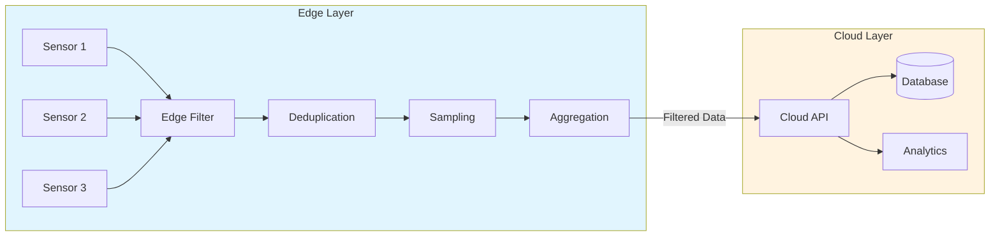
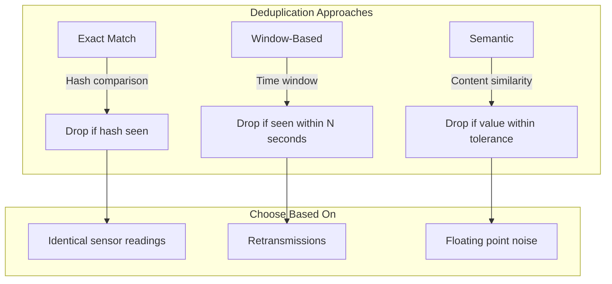
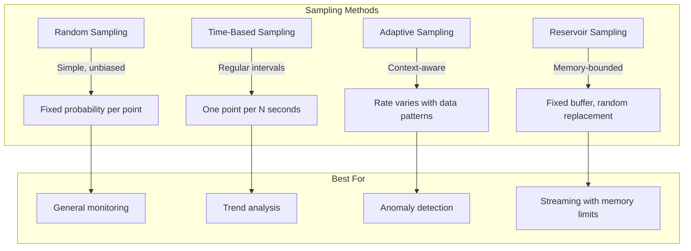
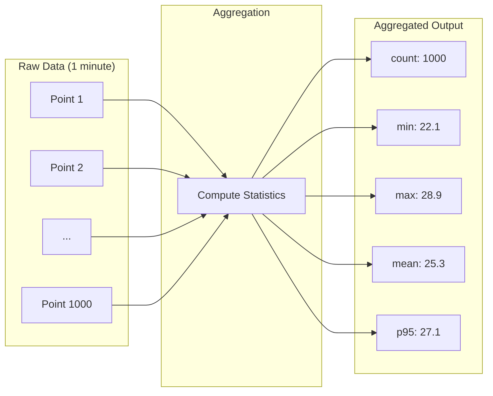
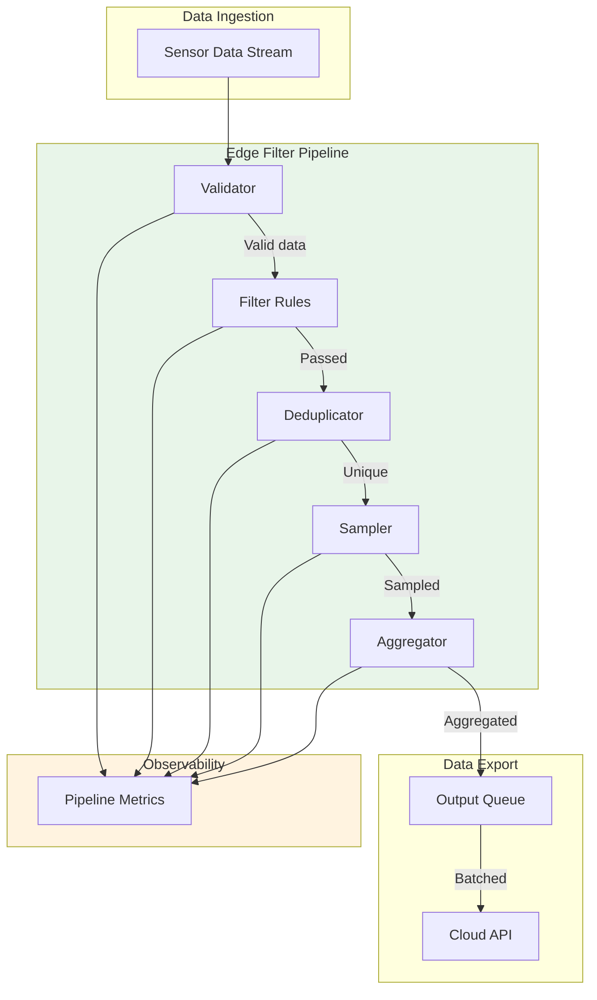

# How to Create Data Filtering

Author: [nawazdhandala](https://github.com/nawazdhandala)

Tags: Edge Computing, Data Filtering, Bandwidth, IoT

Description: Learn to create data filtering for reducing bandwidth by processing and filtering data at the edge.

---

Edge computing shifts data processing closer to where data originates. Instead of sending every byte to a central cloud, you filter, aggregate, and transform data at the edge. This reduces bandwidth costs, lowers latency, and keeps sensitive data local. This guide walks through practical strategies for implementing data filtering at the edge.

## Why Filter at the Edge?

| Challenge | Without Edge Filtering | With Edge Filtering |
|-----------|----------------------|---------------------|
| Bandwidth Cost | High (all raw data shipped) | Low (only relevant data sent) |
| Latency | High (round-trip to cloud) | Low (local decisions) |
| Data Privacy | Data leaves premises | Sensitive data stays local |
| Cloud Storage | Massive | Compact |
| Real-time Response | Delayed | Immediate |

A typical IoT sensor might generate 10,000 data points per second. Sending all of that to the cloud is expensive and often unnecessary. Edge filtering can reduce that to 100 meaningful events per second without losing operational insights.

---

## Architecture Overview



The edge layer receives raw sensor data, applies filtering rules, removes duplicates, samples intelligently, and aggregates before sending to the cloud. Each stage reduces data volume while preserving signal quality.

---

## Filter Rules: The First Line of Defense

Filter rules determine which data points pass through and which get dropped. Define rules based on value ranges, rate of change, or business logic.

### Rule-Based Filter Implementation (Python)

```python
"""
Edge Data Filter Module

This module implements a configurable rule-based filtering system
for edge computing scenarios. Rules can filter by value thresholds,
rate of change, or custom predicates.
"""

from dataclasses import dataclass, field
from typing import Callable, Optional, Any
from datetime import datetime, timedelta
import logging

# Configure logging for filter decisions
logging.basicConfig(level=logging.INFO)
logger = logging.getLogger("edge_filter")


@dataclass
class FilterRule:
    """
    Defines a single filter rule.

    Attributes:
        name: Human-readable rule identifier
        field: The data field this rule applies to
        condition: Function that returns True if data should PASS
        priority: Lower numbers evaluated first (default: 10)
        enabled: Toggle rule without removing it
    """
    name: str
    field: str
    condition: Callable[[Any], bool]
    priority: int = 10
    enabled: bool = True


@dataclass
class DataPoint:
    """
    Represents a single sensor reading.

    Attributes:
        sensor_id: Unique identifier for the sensor
        timestamp: When the reading was taken
        value: The measured value
        metadata: Additional context (units, location, etc.)
    """
    sensor_id: str
    timestamp: datetime
    value: float
    metadata: dict = field(default_factory=dict)


class EdgeFilter:
    """
    Applies multiple filter rules to incoming data points.

    The filter evaluates rules in priority order and tracks
    statistics about filtered vs. passed data points.
    """

    def __init__(self):
        self.rules: list[FilterRule] = []
        self.stats = {
            "total_received": 0,
            "total_passed": 0,
            "filtered_by_rule": {}
        }

    def add_rule(self, rule: FilterRule) -> None:
        """Add a filter rule and sort by priority."""
        self.rules.append(rule)
        # Sort rules by priority (lower number = higher priority)
        self.rules.sort(key=lambda r: r.priority)
        self.stats["filtered_by_rule"][rule.name] = 0
        logger.info(f"Added rule: {rule.name} (priority: {rule.priority})")

    def evaluate(self, data: DataPoint) -> tuple[bool, Optional[str]]:
        """
        Evaluate data point against all rules.

        Returns:
            Tuple of (should_pass, blocking_rule_name)
            If should_pass is True, blocking_rule_name is None
        """
        self.stats["total_received"] += 1

        for rule in self.rules:
            if not rule.enabled:
                continue

            # Get the field value from data point
            if rule.field == "value":
                field_value = data.value
            elif rule.field in data.metadata:
                field_value = data.metadata[rule.field]
            else:
                continue  # Skip rule if field not found

            # If condition returns False, data is filtered OUT
            if not rule.condition(field_value):
                self.stats["filtered_by_rule"][rule.name] += 1
                logger.debug(f"Filtered by {rule.name}: {data}")
                return False, rule.name

        # Data passed all rules
        self.stats["total_passed"] += 1
        return True, None

    def get_reduction_ratio(self) -> float:
        """Calculate the data reduction percentage."""
        if self.stats["total_received"] == 0:
            return 0.0
        return 1 - (self.stats["total_passed"] / self.stats["total_received"])


# Example: Creating common filter rules

def create_threshold_filter(
    name: str,
    field: str,
    min_val: Optional[float] = None,
    max_val: Optional[float] = None,
    priority: int = 10
) -> FilterRule:
    """
    Create a threshold-based filter rule.

    Data passes if: min_val <= value <= max_val
    """
    def condition(value: float) -> bool:
        if min_val is not None and value < min_val:
            return False
        if max_val is not None and value > max_val:
            return False
        return True

    return FilterRule(
        name=name,
        field=field,
        condition=condition,
        priority=priority
    )


def create_change_filter(
    name: str,
    field: str,
    min_change: float,
    priority: int = 10
) -> FilterRule:
    """
    Create a rate-of-change filter.

    Only passes data if value changed by at least min_change
    from the last reading. Uses closure to track state.
    """
    state = {"last_value": None}

    def condition(value: float) -> bool:
        if state["last_value"] is None:
            state["last_value"] = value
            return True  # Always pass the first reading

        change = abs(value - state["last_value"])
        if change >= min_change:
            state["last_value"] = value
            return True
        return False

    return FilterRule(
        name=name,
        field=field,
        condition=condition,
        priority=priority
    )


# Usage Example
if __name__ == "__main__":
    # Initialize the edge filter
    edge_filter = EdgeFilter()

    # Rule 1: Only pass temperature readings between -40 and 85 C
    # (Typical operating range for industrial sensors)
    edge_filter.add_rule(
        create_threshold_filter(
            name="temperature_range",
            field="value",
            min_val=-40.0,
            max_val=85.0,
            priority=1  # Check this first
        )
    )

    # Rule 2: Only pass if temperature changed by at least 0.5 degrees
    edge_filter.add_rule(
        create_change_filter(
            name="significant_change",
            field="value",
            min_change=0.5,
            priority=2  # Check after range validation
        )
    )

    # Simulate incoming sensor data
    readings = [
        DataPoint("temp-001", datetime.now(), 22.3),
        DataPoint("temp-001", datetime.now(), 22.4),  # Small change, filtered
        DataPoint("temp-001", datetime.now(), 23.1),  # Significant change, passes
        DataPoint("temp-001", datetime.now(), 150.0), # Out of range, filtered
        DataPoint("temp-001", datetime.now(), 23.0),  # Small change, filtered
        DataPoint("temp-001", datetime.now(), 25.5),  # Significant change, passes
    ]

    print("Processing sensor readings...")
    print("-" * 50)

    for reading in readings:
        passed, blocked_by = edge_filter.evaluate(reading)
        status = "PASS" if passed else f"FILTERED ({blocked_by})"
        print(f"Value: {reading.value:6.1f} -> {status}")

    print("-" * 50)
    print(f"Total received: {edge_filter.stats['total_received']}")
    print(f"Total passed: {edge_filter.stats['total_passed']}")
    print(f"Reduction ratio: {edge_filter.get_reduction_ratio():.1%}")
```

**Output:**
```
Processing sensor readings...
--------------------------------------------------
Value:   22.3 -> PASS
Value:   22.4 -> FILTERED (significant_change)
Value:   23.1 -> PASS
Value:  150.0 -> FILTERED (temperature_range)
Value:   23.0 -> FILTERED (significant_change)
Value:   25.5 -> PASS
--------------------------------------------------
Total received: 6
Total passed: 3
Reduction ratio: 50.0%
```

---

## Deduplication: Eliminating Redundant Data

Duplicate data wastes bandwidth. Sensors might send the same reading multiple times, or identical events might arrive from distributed sources. Deduplication catches these before transmission.

### Deduplication Strategies



### Deduplication Implementation (Python)

```python
"""
Deduplication Module for Edge Computing

Implements multiple deduplication strategies:
1. Exact match using content hashing
2. Time-window based deduplication
3. Semantic similarity with tolerance
"""

import hashlib
import time
from collections import OrderedDict
from dataclasses import dataclass
from typing import Optional
from datetime import datetime


@dataclass
class DataPoint:
    """Represents a sensor data point."""
    sensor_id: str
    timestamp: datetime
    value: float
    metadata: dict = None

    def __post_init__(self):
        if self.metadata is None:
            self.metadata = {}


class ExactDeduplicator:
    """
    Removes exact duplicates using content hashing.

    Uses an LRU cache to limit memory usage while maintaining
    a sliding window of seen data points.
    """

    def __init__(self, cache_size: int = 10000):
        """
        Initialize with a maximum cache size.

        Args:
            cache_size: Maximum number of hashes to remember
        """
        self.cache_size = cache_size
        # OrderedDict maintains insertion order for LRU eviction
        self.seen_hashes: OrderedDict[str, bool] = OrderedDict()
        self.stats = {"total": 0, "duplicates": 0}

    def _compute_hash(self, data: DataPoint) -> str:
        """
        Compute a hash of the data point content.

        Note: Excludes timestamp to catch retransmissions
        of the same reading.
        """
        content = f"{data.sensor_id}:{data.value}:{data.metadata}"
        return hashlib.sha256(content.encode()).hexdigest()[:16]

    def is_duplicate(self, data: DataPoint) -> bool:
        """
        Check if this data point is a duplicate.

        Returns True if duplicate (should be dropped).
        """
        self.stats["total"] += 1
        data_hash = self._compute_hash(data)

        if data_hash in self.seen_hashes:
            # Move to end (most recently seen)
            self.seen_hashes.move_to_end(data_hash)
            self.stats["duplicates"] += 1
            return True

        # Add to cache
        self.seen_hashes[data_hash] = True

        # Evict oldest if cache is full
        if len(self.seen_hashes) > self.cache_size:
            self.seen_hashes.popitem(last=False)

        return False


class WindowDeduplicator:
    """
    Time-window based deduplication.

    Considers data points as duplicates if the same sensor
    sends identical values within a specified time window.
    """

    def __init__(self, window_seconds: float = 5.0):
        """
        Initialize with a time window.

        Args:
            window_seconds: How long to remember readings
        """
        self.window_seconds = window_seconds
        # Track last reading per sensor: {sensor_id: (value, timestamp)}
        self.last_readings: dict[str, tuple[float, float]] = {}
        self.stats = {"total": 0, "duplicates": 0}

    def is_duplicate(self, data: DataPoint) -> bool:
        """
        Check if this is a duplicate within the time window.
        """
        self.stats["total"] += 1
        current_time = time.time()

        if data.sensor_id in self.last_readings:
            last_value, last_time = self.last_readings[data.sensor_id]

            # Check if within window and same value
            time_diff = current_time - last_time
            if time_diff <= self.window_seconds and data.value == last_value:
                self.stats["duplicates"] += 1
                return True

        # Update last reading
        self.last_readings[data.sensor_id] = (data.value, current_time)
        return False

    def cleanup_stale(self) -> int:
        """
        Remove entries older than the window.

        Call periodically to prevent memory growth.
        Returns number of entries removed.
        """
        current_time = time.time()
        stale_sensors = [
            sensor_id
            for sensor_id, (_, last_time) in self.last_readings.items()
            if current_time - last_time > self.window_seconds * 2
        ]

        for sensor_id in stale_sensors:
            del self.last_readings[sensor_id]

        return len(stale_sensors)


class SemanticDeduplicator:
    """
    Semantic deduplication with value tolerance.

    Useful for floating-point sensor readings where exact
    matches are rare due to measurement noise.
    """

    def __init__(self, tolerance: float = 0.01, window_seconds: float = 1.0):
        """
        Initialize with tolerance and time window.

        Args:
            tolerance: Maximum difference to consider as duplicate
            window_seconds: Time window for comparison
        """
        self.tolerance = tolerance
        self.window_seconds = window_seconds
        self.last_readings: dict[str, tuple[float, float]] = {}
        self.stats = {"total": 0, "duplicates": 0}

    def is_duplicate(self, data: DataPoint) -> bool:
        """
        Check if value is semantically duplicate (within tolerance).
        """
        self.stats["total"] += 1
        current_time = time.time()

        if data.sensor_id in self.last_readings:
            last_value, last_time = self.last_readings[data.sensor_id]

            # Check time window
            if current_time - last_time <= self.window_seconds:
                # Check if values are within tolerance
                if abs(data.value - last_value) <= self.tolerance:
                    self.stats["duplicates"] += 1
                    return True

        # Update last reading
        self.last_readings[data.sensor_id] = (data.value, current_time)
        return False


class CombinedDeduplicator:
    """
    Combines multiple deduplication strategies.

    Data is considered duplicate if ANY strategy flags it.
    """

    def __init__(
        self,
        use_exact: bool = True,
        use_window: bool = True,
        use_semantic: bool = True,
        window_seconds: float = 5.0,
        tolerance: float = 0.01
    ):
        self.deduplicators = []

        if use_exact:
            self.deduplicators.append(
                ("exact", ExactDeduplicator())
            )
        if use_window:
            self.deduplicators.append(
                ("window", WindowDeduplicator(window_seconds))
            )
        if use_semantic:
            self.deduplicators.append(
                ("semantic", SemanticDeduplicator(tolerance, window_seconds))
            )

    def is_duplicate(self, data: DataPoint) -> tuple[bool, Optional[str]]:
        """
        Check all deduplication strategies.

        Returns:
            Tuple of (is_duplicate, strategy_name_that_caught_it)
        """
        for name, dedup in self.deduplicators:
            if dedup.is_duplicate(data):
                return True, name
        return False, None

    def get_stats(self) -> dict:
        """Get combined statistics from all strategies."""
        return {
            name: dedup.stats
            for name, dedup in self.deduplicators
        }


# Usage Example
if __name__ == "__main__":
    dedup = CombinedDeduplicator(
        use_exact=True,
        use_window=True,
        use_semantic=True,
        window_seconds=2.0,
        tolerance=0.1
    )

    # Simulate rapid sensor readings
    readings = [
        DataPoint("sensor-1", datetime.now(), 25.0),
        DataPoint("sensor-1", datetime.now(), 25.0),    # Exact duplicate
        DataPoint("sensor-1", datetime.now(), 25.05),   # Within tolerance
        DataPoint("sensor-1", datetime.now(), 26.0),    # Significant change
        DataPoint("sensor-2", datetime.now(), 25.0),    # Different sensor
    ]

    print("Deduplication Results:")
    print("-" * 50)

    for reading in readings:
        is_dup, strategy = dedup.is_duplicate(reading)
        status = f"DUPLICATE ({strategy})" if is_dup else "UNIQUE"
        print(f"Sensor: {reading.sensor_id}, Value: {reading.value} -> {status}")

    print("-" * 50)
    print("Statistics:", dedup.get_stats())
```

---

## Sampling Strategies: Intelligent Data Reduction

When you cannot send all data, sampling selects representative subsets. Different sampling strategies serve different use cases.

### Sampling Strategy Comparison



### Sampling Implementation (Python)

```python
"""
Sampling Strategies for Edge Data Filtering

Implements multiple sampling approaches:
1. Random sampling with configurable probability
2. Time-based sampling at fixed intervals
3. Adaptive sampling that responds to data patterns
4. Reservoir sampling for memory-bounded streaming
"""

import random
import time
from abc import ABC, abstractmethod
from dataclasses import dataclass
from datetime import datetime
from typing import Optional, List
from collections import deque


@dataclass
class DataPoint:
    """Represents a sensor data point."""
    sensor_id: str
    timestamp: datetime
    value: float
    metadata: dict = None


class Sampler(ABC):
    """Abstract base class for sampling strategies."""

    @abstractmethod
    def should_sample(self, data: DataPoint) -> bool:
        """Return True if this data point should be kept."""
        pass

    @abstractmethod
    def get_stats(self) -> dict:
        """Return sampling statistics."""
        pass


class RandomSampler(Sampler):
    """
    Simple random sampling with fixed probability.

    Each data point has an independent probability of being kept.
    Unbiased but may miss important events.
    """

    def __init__(self, sample_rate: float = 0.1):
        """
        Initialize with a sample rate.

        Args:
            sample_rate: Probability of keeping each point (0.0 to 1.0)
        """
        if not 0.0 <= sample_rate <= 1.0:
            raise ValueError("sample_rate must be between 0.0 and 1.0")

        self.sample_rate = sample_rate
        self.stats = {"total": 0, "sampled": 0}

    def should_sample(self, data: DataPoint) -> bool:
        """Randomly decide whether to keep this data point."""
        self.stats["total"] += 1

        if random.random() < self.sample_rate:
            self.stats["sampled"] += 1
            return True
        return False

    def get_stats(self) -> dict:
        actual_rate = (
            self.stats["sampled"] / self.stats["total"]
            if self.stats["total"] > 0 else 0
        )
        return {
            **self.stats,
            "target_rate": self.sample_rate,
            "actual_rate": actual_rate
        }


class TimeBasedSampler(Sampler):
    """
    Sample one data point per time interval.

    Ensures regular coverage regardless of data arrival rate.
    Good for trend analysis and consistent reporting.
    """

    def __init__(self, interval_seconds: float = 1.0):
        """
        Initialize with a sampling interval.

        Args:
            interval_seconds: Minimum time between samples
        """
        self.interval_seconds = interval_seconds
        # Track last sample time per sensor
        self.last_sample_time: dict[str, float] = {}
        self.stats = {"total": 0, "sampled": 0}

    def should_sample(self, data: DataPoint) -> bool:
        """
        Sample if enough time has passed since last sample.
        """
        self.stats["total"] += 1
        current_time = time.time()

        last_time = self.last_sample_time.get(data.sensor_id, 0)

        if current_time - last_time >= self.interval_seconds:
            self.last_sample_time[data.sensor_id] = current_time
            self.stats["sampled"] += 1
            return True

        return False

    def get_stats(self) -> dict:
        return {
            **self.stats,
            "interval_seconds": self.interval_seconds,
            "active_sensors": len(self.last_sample_time)
        }


class AdaptiveSampler(Sampler):
    """
    Adaptive sampling that increases rate during anomalies.

    Maintains a baseline sampling rate but automatically
    increases sampling when data shows unusual patterns.

    Anomaly detection is based on:
    1. Value deviation from recent average
    2. Rate of change exceeding threshold
    """

    def __init__(
        self,
        base_rate: float = 0.1,
        anomaly_rate: float = 1.0,
        deviation_threshold: float = 2.0,
        window_size: int = 100
    ):
        """
        Initialize adaptive sampler.

        Args:
            base_rate: Normal sampling probability
            anomaly_rate: Sampling probability during anomalies
            deviation_threshold: Standard deviations to trigger anomaly
            window_size: Number of points for statistics calculation
        """
        self.base_rate = base_rate
        self.anomaly_rate = anomaly_rate
        self.deviation_threshold = deviation_threshold
        self.window_size = window_size

        # Per-sensor statistics
        self.sensor_windows: dict[str, deque] = {}
        self.stats = {"total": 0, "sampled": 0, "anomalies_detected": 0}

    def _get_window(self, sensor_id: str) -> deque:
        """Get or create the sliding window for a sensor."""
        if sensor_id not in self.sensor_windows:
            self.sensor_windows[sensor_id] = deque(maxlen=self.window_size)
        return self.sensor_windows[sensor_id]

    def _is_anomaly(self, data: DataPoint) -> bool:
        """
        Detect if current value is anomalous.

        Uses z-score based detection with the recent window.
        """
        window = self._get_window(data.sensor_id)

        if len(window) < 10:
            # Not enough data for statistics
            window.append(data.value)
            return False

        # Calculate mean and standard deviation
        mean = sum(window) / len(window)
        variance = sum((x - mean) ** 2 for x in window) / len(window)
        std_dev = variance ** 0.5

        # Add current value to window
        window.append(data.value)

        # Check for anomaly (avoid division by zero)
        if std_dev > 0:
            z_score = abs(data.value - mean) / std_dev
            return z_score > self.deviation_threshold

        return False

    def should_sample(self, data: DataPoint) -> bool:
        """
        Sample based on whether data appears anomalous.
        """
        self.stats["total"] += 1

        is_anomaly = self._is_anomaly(data)

        if is_anomaly:
            self.stats["anomalies_detected"] += 1
            sample_rate = self.anomaly_rate
        else:
            sample_rate = self.base_rate

        if random.random() < sample_rate:
            self.stats["sampled"] += 1
            return True

        return False

    def get_stats(self) -> dict:
        return {
            **self.stats,
            "base_rate": self.base_rate,
            "anomaly_rate": self.anomaly_rate,
            "monitored_sensors": len(self.sensor_windows)
        }


class ReservoirSampler(Sampler):
    """
    Reservoir sampling for memory-bounded streaming.

    Maintains a fixed-size sample that is statistically
    representative of all data seen so far. Uses Algorithm R.
    """

    def __init__(self, reservoir_size: int = 1000):
        """
        Initialize with reservoir size.

        Args:
            reservoir_size: Maximum number of samples to retain
        """
        self.reservoir_size = reservoir_size
        self.reservoir: List[DataPoint] = []
        self.count = 0  # Total items seen
        self.stats = {"total": 0, "current_size": 0}

    def should_sample(self, data: DataPoint) -> bool:
        """
        Decide whether to add this item to the reservoir.

        This method both decides AND potentially modifies
        the reservoir in one step.
        """
        self.stats["total"] += 1
        self.count += 1

        if len(self.reservoir) < self.reservoir_size:
            # Reservoir not full, always add
            self.reservoir.append(data)
            self.stats["current_size"] = len(self.reservoir)
            return True

        # Reservoir full, randomly replace with decreasing probability
        # Probability of keeping new item = reservoir_size / count
        replace_index = random.randint(0, self.count - 1)

        if replace_index < self.reservoir_size:
            self.reservoir[replace_index] = data
            return True  # Item was added (replacing old item)

        return False  # Item was not added

    def get_reservoir(self) -> List[DataPoint]:
        """Get the current reservoir contents."""
        return self.reservoir.copy()

    def get_stats(self) -> dict:
        return {
            **self.stats,
            "reservoir_size": self.reservoir_size,
            "total_seen": self.count
        }


# Usage Example
if __name__ == "__main__":
    # Generate sample data with an anomaly
    import math

    print("Comparing Sampling Strategies")
    print("=" * 60)

    # Create samplers
    samplers = {
        "Random (10%)": RandomSampler(sample_rate=0.1),
        "Time-Based (1s)": TimeBasedSampler(interval_seconds=0.1),
        "Adaptive": AdaptiveSampler(base_rate=0.1, anomaly_rate=1.0),
        "Reservoir (50)": ReservoirSampler(reservoir_size=50)
    }

    # Generate 1000 data points with a spike at point 500
    for i in range(1000):
        # Normal value around 25, with spike at i=500
        if 490 <= i <= 510:
            value = 50.0  # Anomaly spike
        else:
            value = 25.0 + random.gauss(0, 1)

        data = DataPoint(
            sensor_id="temp-001",
            timestamp=datetime.now(),
            value=value
        )

        for sampler in samplers.values():
            sampler.should_sample(data)

        # Small delay for time-based sampler
        time.sleep(0.001)

    # Print results
    for name, sampler in samplers.items():
        stats = sampler.get_stats()
        print(f"\n{name}:")
        print(f"  Total: {stats['total']}, Sampled: {stats['sampled']}")
        if "anomalies_detected" in stats:
            print(f"  Anomalies detected: {stats['anomalies_detected']}")
```

---

## Aggregation: Compress Before Transmit

Aggregation combines multiple data points into summary statistics. Instead of sending 1000 raw readings, send min, max, mean, and count for each time bucket.

### Aggregation Flow



### Aggregation Implementation (Python)

```python
"""
Data Aggregation Module for Edge Computing

Aggregates raw sensor data into time-bucketed statistics
to reduce bandwidth while preserving analytical value.
"""

import time
import threading
from dataclasses import dataclass, field
from datetime import datetime
from typing import Callable, Optional, List, Dict
from collections import defaultdict
import json


@dataclass
class DataPoint:
    """Represents a sensor data point."""
    sensor_id: str
    timestamp: datetime
    value: float
    metadata: dict = None


@dataclass
class AggregatedBucket:
    """
    Statistics for a time bucket.

    Contains all common aggregations needed for
    monitoring and alerting.
    """
    sensor_id: str
    bucket_start: datetime
    bucket_end: datetime
    count: int = 0
    sum_value: float = 0.0
    min_value: Optional[float] = None
    max_value: Optional[float] = None
    # For percentile calculation
    values: List[float] = field(default_factory=list)

    @property
    def mean(self) -> Optional[float]:
        """Calculate mean of values in bucket."""
        if self.count == 0:
            return None
        return self.sum_value / self.count

    def percentile(self, p: float) -> Optional[float]:
        """
        Calculate percentile of values.

        Args:
            p: Percentile to calculate (0.0 to 1.0)
        """
        if not self.values:
            return None
        sorted_values = sorted(self.values)
        index = int(len(sorted_values) * p)
        index = min(index, len(sorted_values) - 1)
        return sorted_values[index]

    def to_dict(self) -> dict:
        """Convert to dictionary for transmission."""
        return {
            "sensor_id": self.sensor_id,
            "bucket_start": self.bucket_start.isoformat(),
            "bucket_end": self.bucket_end.isoformat(),
            "count": self.count,
            "min": self.min_value,
            "max": self.max_value,
            "mean": self.mean,
            "sum": self.sum_value,
            "p50": self.percentile(0.5),
            "p95": self.percentile(0.95),
            "p99": self.percentile(0.99)
        }


class TimeWindowAggregator:
    """
    Aggregates data into fixed time windows.

    Collects raw data points and outputs aggregated
    statistics when each time window completes.
    """

    def __init__(
        self,
        window_seconds: float = 60.0,
        on_bucket_complete: Optional[Callable[[AggregatedBucket], None]] = None,
        keep_raw_values: bool = True
    ):
        """
        Initialize the aggregator.

        Args:
            window_seconds: Duration of each aggregation window
            on_bucket_complete: Callback when a bucket is ready
            keep_raw_values: Whether to store raw values for percentiles
        """
        self.window_seconds = window_seconds
        self.on_bucket_complete = on_bucket_complete
        self.keep_raw_values = keep_raw_values

        # Current buckets per sensor
        self.current_buckets: Dict[str, AggregatedBucket] = {}
        self.bucket_start_times: Dict[str, float] = {}

        # Lock for thread safety
        self.lock = threading.Lock()

        # Statistics
        self.stats = {
            "points_received": 0,
            "buckets_completed": 0
        }

    def _get_bucket(self, sensor_id: str) -> AggregatedBucket:
        """Get or create the current bucket for a sensor."""
        current_time = time.time()

        if sensor_id not in self.current_buckets:
            # Create new bucket
            self.bucket_start_times[sensor_id] = current_time
            self.current_buckets[sensor_id] = AggregatedBucket(
                sensor_id=sensor_id,
                bucket_start=datetime.now(),
                bucket_end=datetime.now()  # Will be updated
            )

        return self.current_buckets[sensor_id]

    def _should_flush(self, sensor_id: str) -> bool:
        """Check if the current bucket should be flushed."""
        if sensor_id not in self.bucket_start_times:
            return False

        elapsed = time.time() - self.bucket_start_times[sensor_id]
        return elapsed >= self.window_seconds

    def _flush_bucket(self, sensor_id: str) -> Optional[AggregatedBucket]:
        """Flush the current bucket and create a new one."""
        if sensor_id not in self.current_buckets:
            return None

        bucket = self.current_buckets[sensor_id]
        bucket.bucket_end = datetime.now()

        # Clear raw values if not needed (saves memory)
        if not self.keep_raw_values:
            bucket.values = []

        # Trigger callback
        if self.on_bucket_complete:
            self.on_bucket_complete(bucket)

        # Reset for new bucket
        del self.current_buckets[sensor_id]
        del self.bucket_start_times[sensor_id]

        self.stats["buckets_completed"] += 1

        return bucket

    def add(self, data: DataPoint) -> Optional[AggregatedBucket]:
        """
        Add a data point to the aggregator.

        Returns:
            Completed bucket if time window elapsed, else None
        """
        with self.lock:
            self.stats["points_received"] += 1

            # Check if we need to flush first
            completed_bucket = None
            if self._should_flush(data.sensor_id):
                completed_bucket = self._flush_bucket(data.sensor_id)

            # Add to current bucket
            bucket = self._get_bucket(data.sensor_id)

            bucket.count += 1
            bucket.sum_value += data.value

            if bucket.min_value is None or data.value < bucket.min_value:
                bucket.min_value = data.value

            if bucket.max_value is None or data.value > bucket.max_value:
                bucket.max_value = data.value

            if self.keep_raw_values:
                bucket.values.append(data.value)

            return completed_bucket

    def flush_all(self) -> List[AggregatedBucket]:
        """Flush all current buckets (e.g., on shutdown)."""
        with self.lock:
            buckets = []
            sensor_ids = list(self.current_buckets.keys())

            for sensor_id in sensor_ids:
                bucket = self._flush_bucket(sensor_id)
                if bucket:
                    buckets.append(bucket)

            return buckets

    def get_stats(self) -> dict:
        """Get aggregator statistics."""
        return {
            **self.stats,
            "active_buckets": len(self.current_buckets),
            "window_seconds": self.window_seconds
        }


class MultiFieldAggregator:
    """
    Aggregates multiple fields from complex data points.

    Useful when sensors report multiple measurements
    (e.g., temperature, humidity, pressure).
    """

    def __init__(self, window_seconds: float = 60.0, fields: List[str] = None):
        """
        Initialize multi-field aggregator.

        Args:
            window_seconds: Aggregation window duration
            fields: List of field names to aggregate
        """
        self.window_seconds = window_seconds
        self.fields = fields or ["value"]

        # One aggregator per field
        self.aggregators: Dict[str, TimeWindowAggregator] = {
            field_name: TimeWindowAggregator(window_seconds)
            for field_name in self.fields
        }

    def add(self, sensor_id: str, timestamp: datetime, values: dict):
        """
        Add a multi-field data point.

        Args:
            sensor_id: Sensor identifier
            timestamp: Reading timestamp
            values: Dictionary of field names to values
        """
        results = {}

        for field_name, aggregator in self.aggregators.items():
            if field_name in values:
                data = DataPoint(
                    sensor_id=f"{sensor_id}_{field_name}",
                    timestamp=timestamp,
                    value=values[field_name]
                )
                result = aggregator.add(data)
                if result:
                    results[field_name] = result

        return results if results else None


# Usage Example
if __name__ == "__main__":
    import random

    print("Data Aggregation Demo")
    print("=" * 60)

    # Track completed buckets
    completed = []

    def on_complete(bucket: AggregatedBucket):
        """Callback when a bucket is ready to send."""
        completed.append(bucket)
        print(f"\nBucket completed for {bucket.sensor_id}:")
        print(json.dumps(bucket.to_dict(), indent=2, default=str))

    # Create aggregator with 2-second windows (short for demo)
    aggregator = TimeWindowAggregator(
        window_seconds=2.0,
        on_bucket_complete=on_complete
    )

    # Simulate rapid sensor data
    print("Simulating 500 data points over 5 seconds...")
    print("-" * 60)

    for i in range(500):
        data = DataPoint(
            sensor_id="temp-001",
            timestamp=datetime.now(),
            value=25.0 + random.gauss(0, 2)
        )
        aggregator.add(data)
        time.sleep(0.01)  # 100 points per second

    # Flush remaining data
    print("\nFlushing remaining buckets...")
    remaining = aggregator.flush_all()
    for bucket in remaining:
        print(f"\nFinal bucket for {bucket.sensor_id}:")
        print(json.dumps(bucket.to_dict(), indent=2, default=str))

    # Summary
    stats = aggregator.get_stats()
    print("\n" + "=" * 60)
    print(f"Total points received: {stats['points_received']}")
    print(f"Buckets completed: {stats['buckets_completed']}")
    print(f"Compression ratio: {stats['points_received']}:1 per bucket")
```

---

## Complete Edge Filter Pipeline

Combine all components into a unified pipeline.

### Pipeline Architecture



### Complete Pipeline Implementation (Python)

```python
"""
Complete Edge Filter Pipeline

Combines validation, filtering, deduplication, sampling,
and aggregation into a unified processing pipeline.
"""

import time
import threading
import queue
from dataclasses import dataclass, field
from datetime import datetime
from typing import Callable, Optional, List, Any
from abc import ABC, abstractmethod
import json
import logging

# Configure logging
logging.basicConfig(
    level=logging.INFO,
    format='%(asctime)s - %(name)s - %(levelname)s - %(message)s'
)
logger = logging.getLogger("edge_pipeline")


@dataclass
class DataPoint:
    """Represents a sensor data point."""
    sensor_id: str
    timestamp: datetime
    value: float
    metadata: dict = field(default_factory=dict)


@dataclass
class PipelineMetrics:
    """Tracks pipeline performance metrics."""
    received: int = 0
    validated: int = 0
    filtered: int = 0
    deduplicated: int = 0
    sampled: int = 0
    aggregated: int = 0
    exported: int = 0
    errors: int = 0

    def to_dict(self) -> dict:
        return {
            "received": self.received,
            "validated": self.validated,
            "filtered": self.filtered,
            "deduplicated": self.deduplicated,
            "sampled": self.sampled,
            "aggregated": self.aggregated,
            "exported": self.exported,
            "errors": self.errors,
            "reduction_ratio": self._reduction_ratio()
        }

    def _reduction_ratio(self) -> float:
        if self.received == 0:
            return 0.0
        return 1 - (self.exported / self.received)


class PipelineStage(ABC):
    """Abstract base class for pipeline stages."""

    @abstractmethod
    def process(self, data: DataPoint) -> Optional[DataPoint]:
        """Process data, return None to drop."""
        pass

    @abstractmethod
    def get_stats(self) -> dict:
        """Return stage statistics."""
        pass


class ValidatorStage(PipelineStage):
    """
    Validates incoming data points.

    Ensures data meets basic quality requirements
    before further processing.
    """

    def __init__(self):
        self.stats = {"total": 0, "valid": 0, "invalid": 0}

    def process(self, data: DataPoint) -> Optional[DataPoint]:
        self.stats["total"] += 1

        # Check required fields
        if not data.sensor_id:
            self.stats["invalid"] += 1
            return None

        # Check value is a valid number
        if data.value is None or not isinstance(data.value, (int, float)):
            self.stats["invalid"] += 1
            return None

        # Check for NaN or infinity
        if data.value != data.value or abs(data.value) == float('inf'):
            self.stats["invalid"] += 1
            return None

        self.stats["valid"] += 1
        return data

    def get_stats(self) -> dict:
        return self.stats


class FilterStage(PipelineStage):
    """
    Applies configurable filter rules.

    Drops data that does not meet filter criteria.
    """

    def __init__(self, rules: List[dict] = None):
        """
        Initialize with filter rules.

        Each rule is a dict with:
        - name: Rule identifier
        - field: "value" or metadata key
        - min: Optional minimum value
        - max: Optional maximum value
        """
        self.rules = rules or []
        self.stats = {"total": 0, "passed": 0, "by_rule": {}}

        for rule in self.rules:
            self.stats["by_rule"][rule["name"]] = 0

    def process(self, data: DataPoint) -> Optional[DataPoint]:
        self.stats["total"] += 1

        for rule in self.rules:
            field_name = rule.get("field", "value")

            # Get field value
            if field_name == "value":
                value = data.value
            else:
                value = data.metadata.get(field_name)

            if value is None:
                continue

            # Check min/max bounds
            min_val = rule.get("min")
            max_val = rule.get("max")

            if min_val is not None and value < min_val:
                self.stats["by_rule"][rule["name"]] += 1
                return None

            if max_val is not None and value > max_val:
                self.stats["by_rule"][rule["name"]] += 1
                return None

        self.stats["passed"] += 1
        return data

    def get_stats(self) -> dict:
        return self.stats


class DeduplicationStage(PipelineStage):
    """
    Removes duplicate data points.

    Uses a combination of exact matching and
    tolerance-based comparison.
    """

    def __init__(self, tolerance: float = 0.01, window_ms: int = 1000):
        self.tolerance = tolerance
        self.window_ms = window_ms
        self.last_values: dict = {}  # sensor_id -> (value, timestamp_ms)
        self.stats = {"total": 0, "unique": 0, "duplicates": 0}

    def process(self, data: DataPoint) -> Optional[DataPoint]:
        self.stats["total"] += 1
        current_ms = int(time.time() * 1000)

        if data.sensor_id in self.last_values:
            last_value, last_ms = self.last_values[data.sensor_id]

            # Within time window?
            if current_ms - last_ms <= self.window_ms:
                # Within tolerance?
                if abs(data.value - last_value) <= self.tolerance:
                    self.stats["duplicates"] += 1
                    return None

        # Update last value
        self.last_values[data.sensor_id] = (data.value, current_ms)
        self.stats["unique"] += 1
        return data

    def get_stats(self) -> dict:
        return self.stats


class SamplingStage(PipelineStage):
    """
    Adaptive sampling stage.

    Adjusts sampling rate based on data variance.
    """

    def __init__(self, base_rate: float = 0.1, anomaly_rate: float = 1.0):
        self.base_rate = base_rate
        self.anomaly_rate = anomaly_rate
        self.windows: dict = {}  # sensor_id -> list of recent values
        self.window_size = 50
        self.stats = {"total": 0, "sampled": 0, "anomalies": 0}

    def _is_anomaly(self, sensor_id: str, value: float) -> bool:
        """Check if value is anomalous based on recent history."""
        if sensor_id not in self.windows:
            self.windows[sensor_id] = []

        window = self.windows[sensor_id]

        # Need minimum data for statistics
        if len(window) < 10:
            window.append(value)
            return False

        # Calculate z-score
        mean = sum(window) / len(window)
        variance = sum((x - mean) ** 2 for x in window) / len(window)
        std = variance ** 0.5

        # Update window
        window.append(value)
        if len(window) > self.window_size:
            window.pop(0)

        if std > 0:
            z_score = abs(value - mean) / std
            return z_score > 2.0

        return False

    def process(self, data: DataPoint) -> Optional[DataPoint]:
        import random

        self.stats["total"] += 1

        is_anomaly = self._is_anomaly(data.sensor_id, data.value)

        if is_anomaly:
            self.stats["anomalies"] += 1
            rate = self.anomaly_rate
        else:
            rate = self.base_rate

        if random.random() < rate:
            self.stats["sampled"] += 1
            return data

        return None

    def get_stats(self) -> dict:
        return self.stats


class AggregationStage:
    """
    Aggregates data into time buckets.

    This stage accumulates data and emits aggregated
    results when time windows complete.
    """

    def __init__(self, window_seconds: float = 60.0):
        self.window_seconds = window_seconds
        self.buckets: dict = {}  # sensor_id -> bucket data
        self.bucket_starts: dict = {}
        self.stats = {"points_in": 0, "buckets_out": 0}

    def add(self, data: DataPoint) -> Optional[dict]:
        """Add data point, return aggregated bucket if window complete."""
        self.stats["points_in"] += 1
        current_time = time.time()

        # Check if bucket should flush
        completed = None
        if data.sensor_id in self.bucket_starts:
            if current_time - self.bucket_starts[data.sensor_id] >= self.window_seconds:
                completed = self._flush_bucket(data.sensor_id)

        # Initialize or update bucket
        if data.sensor_id not in self.buckets:
            self.bucket_starts[data.sensor_id] = current_time
            self.buckets[data.sensor_id] = {
                "count": 0,
                "sum": 0.0,
                "min": None,
                "max": None,
                "values": []
            }

        bucket = self.buckets[data.sensor_id]
        bucket["count"] += 1
        bucket["sum"] += data.value
        bucket["values"].append(data.value)

        if bucket["min"] is None or data.value < bucket["min"]:
            bucket["min"] = data.value
        if bucket["max"] is None or data.value > bucket["max"]:
            bucket["max"] = data.value

        return completed

    def _flush_bucket(self, sensor_id: str) -> dict:
        """Flush and return a completed bucket."""
        bucket = self.buckets[sensor_id]

        # Calculate statistics
        values = sorted(bucket["values"])
        result = {
            "sensor_id": sensor_id,
            "timestamp": datetime.now().isoformat(),
            "count": bucket["count"],
            "min": bucket["min"],
            "max": bucket["max"],
            "mean": bucket["sum"] / bucket["count"] if bucket["count"] > 0 else 0,
            "p50": values[len(values) // 2] if values else None,
            "p95": values[int(len(values) * 0.95)] if values else None
        }

        # Clear bucket
        del self.buckets[sensor_id]
        del self.bucket_starts[sensor_id]

        self.stats["buckets_out"] += 1
        return result

    def flush_all(self) -> List[dict]:
        """Flush all pending buckets."""
        results = []
        sensor_ids = list(self.buckets.keys())
        for sensor_id in sensor_ids:
            results.append(self._flush_bucket(sensor_id))
        return results

    def get_stats(self) -> dict:
        return self.stats


class EdgeFilterPipeline:
    """
    Complete edge filtering pipeline.

    Combines all stages into a unified processing flow
    with metrics and export capabilities.
    """

    def __init__(
        self,
        filter_rules: List[dict] = None,
        sample_rate: float = 0.1,
        aggregation_window: float = 60.0,
        on_export: Optional[Callable[[dict], None]] = None
    ):
        """
        Initialize the pipeline.

        Args:
            filter_rules: List of filter rule configurations
            sample_rate: Base sampling rate (0.0 to 1.0)
            aggregation_window: Aggregation window in seconds
            on_export: Callback for aggregated data
        """
        # Initialize stages
        self.validator = ValidatorStage()
        self.filter = FilterStage(filter_rules or [])
        self.dedup = DeduplicationStage()
        self.sampler = SamplingStage(base_rate=sample_rate)
        self.aggregator = AggregationStage(window_seconds=aggregation_window)

        self.on_export = on_export
        self.metrics = PipelineMetrics()

        # Output queue for async export
        self.output_queue = queue.Queue(maxsize=1000)

        # Start export thread
        self.running = True
        self.export_thread = threading.Thread(target=self._export_worker)
        self.export_thread.daemon = True
        self.export_thread.start()

        logger.info("Edge filter pipeline initialized")

    def process(self, data: DataPoint) -> None:
        """
        Process a single data point through the pipeline.
        """
        self.metrics.received += 1

        try:
            # Stage 1: Validation
            data = self.validator.process(data)
            if data is None:
                return
            self.metrics.validated += 1

            # Stage 2: Filtering
            data = self.filter.process(data)
            if data is None:
                self.metrics.filtered += 1
                return

            # Stage 3: Deduplication
            data = self.dedup.process(data)
            if data is None:
                self.metrics.deduplicated += 1
                return

            # Stage 4: Sampling
            data = self.sampler.process(data)
            if data is None:
                return
            self.metrics.sampled += 1

            # Stage 5: Aggregation
            result = self.aggregator.add(data)
            if result:
                self.metrics.aggregated += 1
                self._queue_export(result)

        except Exception as e:
            self.metrics.errors += 1
            logger.error(f"Pipeline error: {e}")

    def _queue_export(self, data: dict) -> None:
        """Queue data for export."""
        try:
            self.output_queue.put_nowait(data)
        except queue.Full:
            logger.warning("Export queue full, dropping data")

    def _export_worker(self) -> None:
        """Background worker for data export."""
        while self.running:
            try:
                data = self.output_queue.get(timeout=1.0)

                if self.on_export:
                    self.on_export(data)

                self.metrics.exported += 1
                self.output_queue.task_done()

            except queue.Empty:
                continue
            except Exception as e:
                logger.error(f"Export error: {e}")

    def flush(self) -> None:
        """Flush all pending data."""
        for bucket in self.aggregator.flush_all():
            self._queue_export(bucket)

        # Wait for export queue to drain
        self.output_queue.join()

    def shutdown(self) -> None:
        """Gracefully shutdown the pipeline."""
        logger.info("Shutting down pipeline...")
        self.flush()
        self.running = False
        self.export_thread.join(timeout=5.0)
        logger.info("Pipeline shutdown complete")

    def get_metrics(self) -> dict:
        """Get comprehensive pipeline metrics."""
        return {
            "pipeline": self.metrics.to_dict(),
            "stages": {
                "validator": self.validator.get_stats(),
                "filter": self.filter.get_stats(),
                "deduplication": self.dedup.get_stats(),
                "sampling": self.sampler.get_stats(),
                "aggregation": self.aggregator.get_stats()
            }
        }


# Usage Example
if __name__ == "__main__":
    import random

    print("Edge Filter Pipeline Demo")
    print("=" * 60)

    # Track exports
    exports = []

    def handle_export(data: dict):
        """Handle exported aggregated data."""
        exports.append(data)
        print(f"\nExported: {json.dumps(data, indent=2)}")

    # Create pipeline with configuration
    pipeline = EdgeFilterPipeline(
        filter_rules=[
            {"name": "temp_range", "field": "value", "min": -40, "max": 85}
        ],
        sample_rate=0.2,
        aggregation_window=2.0,  # Short window for demo
        on_export=handle_export
    )

    # Simulate sensor data stream
    print("\nSimulating 1000 sensor readings over 5 seconds...")
    print("-" * 60)

    for i in range(1000):
        # Generate realistic sensor data
        # Occasionally include out-of-range values
        if random.random() < 0.05:
            value = random.choice([-50, 100])  # Out of range
        else:
            value = 25.0 + random.gauss(0, 3)

        data = DataPoint(
            sensor_id=f"sensor-{i % 3}",  # 3 sensors
            timestamp=datetime.now(),
            value=value,
            metadata={"location": "factory-1"}
        )

        pipeline.process(data)
        time.sleep(0.005)  # 200 points per second

    # Flush and shutdown
    print("\nFlushing pipeline...")
    pipeline.flush()

    # Print final metrics
    print("\n" + "=" * 60)
    print("Final Pipeline Metrics:")
    print(json.dumps(pipeline.get_metrics(), indent=2))

    print(f"\nTotal exports: {len(exports)}")
    print(f"Data reduction: {pipeline.metrics._reduction_ratio():.1%}")

    # Cleanup
    pipeline.shutdown()
```

---

## Configuration Best Practices

### YAML Configuration Example

```yaml
# edge-filter-config.yaml
# Configuration for edge data filtering pipeline

pipeline:
  name: "factory-floor-sensors"
  version: "1.0.0"

# Validation rules
validation:
  require_sensor_id: true
  require_timestamp: true
  reject_nan: true
  reject_infinity: true

# Filter rules (data must pass ALL rules)
filters:
  - name: "temperature_range"
    field: "value"
    sensor_pattern: "temp-*"
    min: -40.0
    max: 85.0

  - name: "humidity_range"
    field: "value"
    sensor_pattern: "humidity-*"
    min: 0.0
    max: 100.0

  - name: "pressure_range"
    field: "value"
    sensor_pattern: "pressure-*"
    min: 800.0
    max: 1200.0

# Deduplication settings
deduplication:
  enabled: true
  # Tolerance for "same value" comparison
  tolerance: 0.01
  # Time window in milliseconds
  window_ms: 1000
  # Maximum cache size
  cache_size: 10000

# Sampling configuration
sampling:
  # Base sampling rate for normal data
  base_rate: 0.1
  # Sampling rate during detected anomalies
  anomaly_rate: 1.0
  # Z-score threshold for anomaly detection
  anomaly_threshold: 2.5
  # Window size for statistics calculation
  stats_window: 100

# Aggregation settings
aggregation:
  enabled: true
  # Window duration in seconds
  window_seconds: 60
  # Statistics to compute
  compute:
    - count
    - min
    - max
    - mean
    - sum
    - p50
    - p95
    - p99

# Export configuration
export:
  # Batch size for export
  batch_size: 100
  # Maximum delay before export (seconds)
  max_delay_seconds: 5
  # Retry settings
  retry:
    max_attempts: 3
    backoff_seconds: 1
  # Target endpoint
  endpoint: "https://api.example.com/ingest"
  # Authentication
  auth:
    type: "bearer"
    token_env: "EXPORT_API_TOKEN"

# Observability
metrics:
  enabled: true
  # Expose Prometheus metrics
  prometheus_port: 9090
  # Log level
  log_level: "INFO"
```

### Loading Configuration (Python)

```python
"""
Configuration loader for edge filter pipeline.
"""

import yaml
import os
from dataclasses import dataclass
from typing import List, Optional


@dataclass
class FilterRuleConfig:
    """Configuration for a single filter rule."""
    name: str
    field: str
    sensor_pattern: str = "*"
    min: Optional[float] = None
    max: Optional[float] = None


@dataclass
class PipelineConfig:
    """Complete pipeline configuration."""
    name: str
    version: str
    filters: List[FilterRuleConfig]
    dedup_tolerance: float
    dedup_window_ms: int
    sample_base_rate: float
    sample_anomaly_rate: float
    aggregation_window: float
    export_endpoint: str

    @classmethod
    def from_yaml(cls, path: str) -> "PipelineConfig":
        """Load configuration from YAML file."""
        with open(path, 'r') as f:
            raw = yaml.safe_load(f)

        # Parse filter rules
        filters = [
            FilterRuleConfig(**rule)
            for rule in raw.get("filters", [])
        ]

        # Build config object
        return cls(
            name=raw["pipeline"]["name"],
            version=raw["pipeline"]["version"],
            filters=filters,
            dedup_tolerance=raw["deduplication"]["tolerance"],
            dedup_window_ms=raw["deduplication"]["window_ms"],
            sample_base_rate=raw["sampling"]["base_rate"],
            sample_anomaly_rate=raw["sampling"]["anomaly_rate"],
            aggregation_window=raw["aggregation"]["window_seconds"],
            export_endpoint=raw["export"]["endpoint"]
        )


# Example usage
if __name__ == "__main__":
    # Load from file
    # config = PipelineConfig.from_yaml("edge-filter-config.yaml")

    # Or create programmatically
    config = PipelineConfig(
        name="demo-pipeline",
        version="1.0.0",
        filters=[
            FilterRuleConfig(
                name="temp_range",
                field="value",
                min=-40.0,
                max=85.0
            )
        ],
        dedup_tolerance=0.01,
        dedup_window_ms=1000,
        sample_base_rate=0.1,
        sample_anomaly_rate=1.0,
        aggregation_window=60.0,
        export_endpoint="https://api.example.com/ingest"
    )

    print(f"Loaded config: {config.name} v{config.version}")
    print(f"Filter rules: {len(config.filters)}")
    print(f"Sample rate: {config.sample_base_rate}")
```

---

## Performance Considerations

### Memory Management

Edge devices often have limited memory. Use these strategies:

1. **Bounded caches**: Always set maximum sizes for hash tables and windows
2. **Streaming aggregation**: Calculate running statistics instead of storing all values
3. **Periodic cleanup**: Remove stale entries from tracking structures

### CPU Efficiency

1. **Batch processing**: Process data in batches rather than one at a time
2. **Early exit**: Order filter rules by cost (cheap first) and likelihood of rejection
3. **Async export**: Decouple data processing from network I/O

### Bandwidth Estimation

```
Raw bandwidth = sensors x readings_per_second x bytes_per_reading

With filtering:
- Filter rejection rate: ~20%
- Deduplication rate: ~15%
- Sampling rate: 10% (90% reduction)
- Aggregation: 60-second windows (60x compression)

Effective reduction = 0.8 x 0.85 x 0.1 x (1/60) = ~0.1%

Example:
- 100 sensors
- 100 readings/second each
- 64 bytes per reading
- Raw: 640 KB/s

After pipeline: ~0.7 KB/s
```

---

## Monitoring the Pipeline

Track these metrics to ensure the pipeline performs correctly:

| Metric | Purpose | Alert Threshold |
|--------|---------|-----------------|
| `pipeline_received_total` | Input volume | Sudden drops |
| `pipeline_exported_total` | Output volume | Zero for > 5 min |
| `pipeline_errors_total` | Processing failures | Any increase |
| `pipeline_reduction_ratio` | Compression effectiveness | < 80% |
| `pipeline_latency_p99` | Processing delay | > 100ms |
| `aggregator_active_buckets` | Memory usage | > 1000 |

---

## Key Takeaways

1. **Filter early**: Drop irrelevant data as close to the source as possible
2. **Deduplicate aggressively**: Redundant data wastes bandwidth and storage
3. **Sample intelligently**: Adaptive sampling preserves anomalies while reducing volume
4. **Aggregate before transmit**: Summary statistics are usually sufficient
5. **Monitor the pipeline**: Track reduction ratios and error rates
6. **Configure, do not hardcode**: Use configuration files for filter rules and thresholds

Edge filtering transforms raw sensor floods into actionable insights. The techniques in this guide can reduce bandwidth by 90% or more while preserving the signal quality needed for monitoring and alerting.

---

**Related Reading:**

- [How to reduce noise in OpenTelemetry](https://oneuptime.com/blog/post/2025-08-25-how-to-reduce-noise-in-opentelemetry/view)
- [What is OpenTelemetry Collector and Why Use One](https://oneuptime.com/blog/post/2025-09-18-what-is-opentelemetry-collector-and-why-use-one/view)
- [Three Pillars of Observability: Logs, Metrics, Traces](https://oneuptime.com/blog/post/2025-08-20-three-pillars-of-observability-logs-metrics-traces/view)
