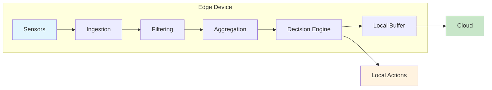
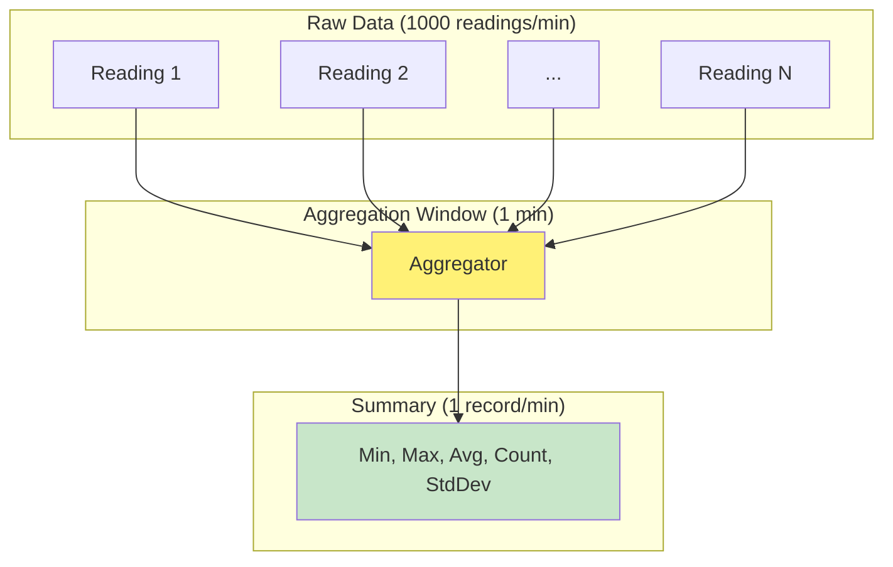
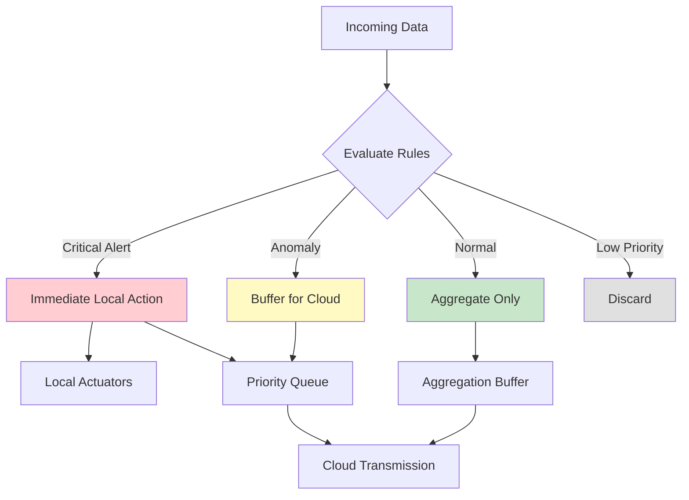
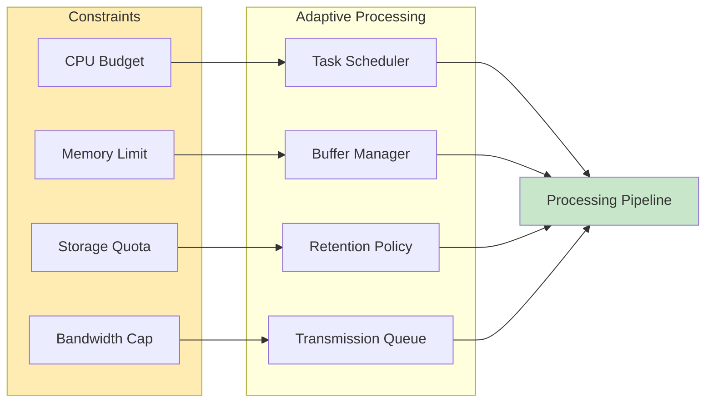

# How to Implement Local Processing

Author: [nawazdhandala](https://github.com/nawazdhandala)

Tags: Edge Computing, Local Processing, Data Processing, IoT

Description: Learn to implement local processing for performing computation at the edge before cloud transmission.

---

Edge computing shifts computation from centralized cloud servers to locations closer to where data is generated. Local processing at the edge reduces latency, saves bandwidth, improves privacy, and enables real-time decision making. Instead of sending every sensor reading or camera frame to the cloud, edge devices filter, aggregate, and analyze data locally, transmitting only meaningful insights.

This guide covers practical implementation patterns for local processing, from basic filtering to complex decision logic, with code examples you can adapt for your IoT and edge computing projects.

## Why Process Data Locally?

| Benefit | Description |
|---------|-------------|
| **Reduced Latency** | Local decisions in milliseconds vs. 100ms+ round trips to cloud |
| **Bandwidth Savings** | Transmit summaries instead of raw data (often 90%+ reduction) |
| **Privacy** | Sensitive data never leaves the device |
| **Reliability** | Operates during network outages |
| **Cost Reduction** | Lower cloud compute and data transfer bills |

## Architecture Overview

The following diagram shows how data flows through an edge processing pipeline before reaching the cloud.



Data moves through four stages at the edge:

1. **Ingestion**: Collect raw sensor data
2. **Filtering**: Remove noise and irrelevant readings
3. **Aggregation**: Combine multiple readings into summaries
4. **Decision Engine**: Determine what to send and what actions to take locally

## Basic Data Filtering

The first step in local processing is filtering out noise and irrelevant data. This prevents unnecessary computation downstream and reduces storage requirements.

### Threshold Filtering

Only process readings that exceed defined thresholds. This is useful for anomaly detection where normal readings are not interesting.

```python
# threshold_filter.py
# Filter sensor readings based on configurable thresholds
# Reduces data volume by ignoring readings within normal ranges

from dataclasses import dataclass
from typing import Optional, List
from datetime import datetime

@dataclass
class SensorReading:
    """Represents a single sensor measurement."""
    sensor_id: str
    value: float
    timestamp: datetime
    unit: str

@dataclass
class FilterConfig:
    """Configuration for threshold-based filtering."""
    min_value: float          # Readings below this are filtered out
    max_value: float          # Readings above this are filtered out
    change_threshold: float   # Minimum change from last reading to pass

class ThresholdFilter:
    """
    Filters sensor readings based on absolute thresholds and rate of change.

    A reading passes the filter if:
    1. It falls outside the normal range (min_value, max_value), OR
    2. It differs from the last reading by more than change_threshold

    This captures both anomalies and significant changes.
    """

    def __init__(self, config: FilterConfig):
        self.config = config
        # Track last reading per sensor for change detection
        self.last_readings: dict[str, float] = {}

    def should_process(self, reading: SensorReading) -> bool:
        """
        Determine if a reading should pass through the filter.

        Args:
            reading: The sensor reading to evaluate

        Returns:
            True if the reading should be processed, False to discard
        """
        # Check if value is outside normal operating range
        # These readings always pass because they may indicate problems
        if reading.value < self.config.min_value:
            return True
        if reading.value > self.config.max_value:
            return True

        # Check if value changed significantly from last reading
        # Captures trends even within normal range
        last_value = self.last_readings.get(reading.sensor_id)
        if last_value is not None:
            change = abs(reading.value - last_value)
            if change >= self.config.change_threshold:
                # Update last reading before returning
                self.last_readings[reading.sensor_id] = reading.value
                return True
        else:
            # First reading from this sensor always passes
            self.last_readings[reading.sensor_id] = reading.value
            return True

        # Reading is within normal range and hasn't changed significantly
        return False

    def filter_batch(self, readings: List[SensorReading]) -> List[SensorReading]:
        """Filter a batch of readings, returning only those that pass."""
        return [r for r in readings if self.should_process(r)]


# Example usage
if __name__ == "__main__":
    # Configure filter for temperature sensor
    # Normal range: 20-30C, significant change: 0.5C
    config = FilterConfig(
        min_value=20.0,
        max_value=30.0,
        change_threshold=0.5
    )

    filter = ThresholdFilter(config)

    # Simulate readings
    readings = [
        SensorReading("temp-01", 25.0, datetime.now(), "celsius"),  # Passes (first)
        SensorReading("temp-01", 25.1, datetime.now(), "celsius"),  # Filtered (small change)
        SensorReading("temp-01", 25.6, datetime.now(), "celsius"),  # Passes (0.6 > 0.5)
        SensorReading("temp-01", 31.0, datetime.now(), "celsius"),  # Passes (above max)
        SensorReading("temp-01", 19.0, datetime.now(), "celsius"),  # Passes (below min)
    ]

    passed = filter.filter_batch(readings)
    print(f"Filtered {len(readings)} readings down to {len(passed)}")
```

### Time-Based Deduplication

Prevent processing of duplicate or near-duplicate readings within a time window.

```python
# deduplication_filter.py
# Prevent duplicate readings from being processed multiple times
# Useful when sensors may report the same event repeatedly

from datetime import datetime, timedelta
from typing import Optional
from collections import defaultdict
import hashlib

class DeduplicationFilter:
    """
    Filters duplicate readings based on content hash and time window.

    Two readings are considered duplicates if:
    1. They have the same sensor_id AND
    2. They have the same value (within tolerance) AND
    3. They arrive within the dedup_window
    """

    def __init__(self, dedup_window_seconds: int = 60, value_tolerance: float = 0.01):
        """
        Args:
            dedup_window_seconds: Time window for deduplication
            value_tolerance: Values within this tolerance are considered equal
        """
        self.dedup_window = timedelta(seconds=dedup_window_seconds)
        self.value_tolerance = value_tolerance
        # Store: sensor_id -> (last_value, last_timestamp)
        self.seen: dict[str, tuple[float, datetime]] = {}

    def _values_equal(self, v1: float, v2: float) -> bool:
        """Check if two values are equal within tolerance."""
        return abs(v1 - v2) <= self.value_tolerance

    def is_duplicate(self, sensor_id: str, value: float, timestamp: datetime) -> bool:
        """
        Check if this reading is a duplicate of a recent one.

        Returns:
            True if this is a duplicate that should be filtered
        """
        if sensor_id not in self.seen:
            # First time seeing this sensor
            self.seen[sensor_id] = (value, timestamp)
            return False

        last_value, last_time = self.seen[sensor_id]

        # Check if outside dedup window
        if timestamp - last_time > self.dedup_window:
            # Window expired, this is not a duplicate
            self.seen[sensor_id] = (value, timestamp)
            return False

        # Within window, check if value is the same
        if self._values_equal(value, last_value):
            # Duplicate - don't update seen (keep original timestamp)
            return True

        # Different value, not a duplicate
        self.seen[sensor_id] = (value, timestamp)
        return False

    def cleanup_expired(self, current_time: datetime) -> int:
        """
        Remove expired entries from the seen cache.
        Call periodically to prevent memory growth.

        Returns:
            Number of entries removed
        """
        expired = []
        for sensor_id, (_, timestamp) in self.seen.items():
            if current_time - timestamp > self.dedup_window:
                expired.append(sensor_id)

        for sensor_id in expired:
            del self.seen[sensor_id]

        return len(expired)
```

## Data Aggregation

Aggregation combines multiple readings into summaries, dramatically reducing the volume of data sent to the cloud while preserving important information.



### Sliding Window Aggregator

```python
# aggregator.py
# Aggregate sensor readings into time-windowed summaries
# Reduces thousands of readings to meaningful statistics

from dataclasses import dataclass, field
from datetime import datetime, timedelta
from typing import List, Optional, Dict
from collections import defaultdict
import statistics

@dataclass
class AggregatedSummary:
    """Statistical summary of readings in a time window."""
    sensor_id: str
    window_start: datetime
    window_end: datetime
    count: int
    min_value: float
    max_value: float
    avg_value: float
    std_dev: Optional[float]  # None if count < 2
    percentile_95: Optional[float]  # None if count < 20

    def to_dict(self) -> dict:
        """Convert to dictionary for JSON serialization."""
        return {
            "sensor_id": self.sensor_id,
            "window_start": self.window_start.isoformat(),
            "window_end": self.window_end.isoformat(),
            "count": self.count,
            "min": self.min_value,
            "max": self.max_value,
            "avg": round(self.avg_value, 4),
            "std_dev": round(self.std_dev, 4) if self.std_dev else None,
            "p95": round(self.percentile_95, 4) if self.percentile_95 else None,
        }

class SlidingWindowAggregator:
    """
    Aggregates sensor readings into fixed-duration time windows.

    Readings are collected into windows, and when a window closes,
    a summary is generated with statistical measures.
    """

    def __init__(self, window_duration_seconds: int = 60):
        """
        Args:
            window_duration_seconds: Duration of each aggregation window
        """
        self.window_duration = timedelta(seconds=window_duration_seconds)
        # Current window data: sensor_id -> list of (timestamp, value)
        self.current_windows: Dict[str, List[tuple[datetime, float]]] = defaultdict(list)
        # Track window boundaries per sensor
        self.window_starts: Dict[str, datetime] = {}

    def _get_window_start(self, timestamp: datetime) -> datetime:
        """Calculate the start of the window containing this timestamp."""
        # Align windows to clean boundaries (e.g., minute boundaries)
        seconds = int(timestamp.timestamp())
        window_seconds = int(self.window_duration.total_seconds())
        aligned_seconds = (seconds // window_seconds) * window_seconds
        return datetime.fromtimestamp(aligned_seconds)

    def add_reading(self, sensor_id: str, value: float, timestamp: datetime) -> Optional[AggregatedSummary]:
        """
        Add a reading to the aggregator.

        Args:
            sensor_id: Identifier for the sensor
            value: The measured value
            timestamp: When the measurement was taken

        Returns:
            AggregatedSummary if a window just closed, None otherwise
        """
        window_start = self._get_window_start(timestamp)

        # Check if we need to close the previous window
        summary = None
        if sensor_id in self.window_starts:
            if window_start > self.window_starts[sensor_id]:
                # Window changed, close the previous one
                summary = self._close_window(sensor_id)

        # Initialize or update window tracking
        self.window_starts[sensor_id] = window_start
        self.current_windows[sensor_id].append((timestamp, value))

        return summary

    def _close_window(self, sensor_id: str) -> Optional[AggregatedSummary]:
        """Close the current window and generate summary."""
        data = self.current_windows.get(sensor_id, [])
        if not data:
            return None

        # Extract values for statistical calculation
        values = [v for _, v in data]
        timestamps = [t for t, _ in data]

        # Calculate statistics
        count = len(values)
        min_val = min(values)
        max_val = max(values)
        avg_val = statistics.mean(values)

        # Standard deviation requires at least 2 values
        std_dev = statistics.stdev(values) if count >= 2 else None

        # 95th percentile requires enough data points
        p95 = None
        if count >= 20:
            sorted_values = sorted(values)
            p95_index = int(count * 0.95)
            p95 = sorted_values[p95_index]

        summary = AggregatedSummary(
            sensor_id=sensor_id,
            window_start=min(timestamps),
            window_end=max(timestamps),
            count=count,
            min_value=min_val,
            max_value=max_val,
            avg_value=avg_val,
            std_dev=std_dev,
            percentile_95=p95,
        )

        # Clear the window data
        self.current_windows[sensor_id] = []

        return summary

    def flush_all(self) -> List[AggregatedSummary]:
        """
        Force close all open windows and return summaries.
        Call this during shutdown or when you need immediate results.
        """
        summaries = []
        for sensor_id in list(self.window_starts.keys()):
            summary = self._close_window(sensor_id)
            if summary:
                summaries.append(summary)
        return summaries


# Example usage demonstrating 1000:1 data reduction
if __name__ == "__main__":
    import random

    aggregator = SlidingWindowAggregator(window_duration_seconds=60)

    # Simulate 1000 readings over 5 minutes
    base_time = datetime.now()
    summaries = []

    for i in range(1000):
        timestamp = base_time + timedelta(seconds=i * 0.3)  # ~3 readings/second
        value = 25.0 + random.gauss(0, 2)  # Temperature with noise

        summary = aggregator.add_reading("temp-01", value, timestamp)
        if summary:
            summaries.append(summary)

    # Flush remaining data
    summaries.extend(aggregator.flush_all())

    print(f"Reduced {1000} readings to {len(summaries)} summaries")
    for s in summaries:
        print(f"  Window: {s.count} readings, avg={s.avg_value:.2f}, range=[{s.min_value:.2f}, {s.max_value:.2f}]")
```

## Decision Engine

The decision engine determines what action to take based on processed data. This is where local intelligence lives, enabling autonomous operation without cloud connectivity.



### Rule-Based Decision Engine

```python
# decision_engine.py
# Rule-based decision engine for edge processing
# Determines actions based on configurable rules and priorities

from dataclasses import dataclass
from enum import Enum
from typing import List, Callable, Any, Optional
from datetime import datetime
import json

class ActionType(Enum):
    """Possible actions the decision engine can take."""
    DISCARD = "discard"              # Drop the data entirely
    AGGREGATE_ONLY = "aggregate"      # Add to aggregation, don't send raw
    BUFFER_FOR_CLOUD = "buffer"       # Store for eventual cloud transmission
    IMMEDIATE_TRANSMIT = "transmit"   # Send to cloud immediately
    LOCAL_ACTION = "local_action"     # Trigger local actuator/alert
    CRITICAL_ALERT = "critical"       # Both local action AND immediate transmit

@dataclass
class Decision:
    """Result of evaluating data against rules."""
    action: ActionType
    priority: int  # 0 = lowest, 10 = highest
    reason: str
    metadata: dict = None

    def __post_init__(self):
        if self.metadata is None:
            self.metadata = {}

@dataclass
class Rule:
    """A single decision rule with condition and resulting action."""
    name: str
    condition: Callable[[dict], bool]  # Function that evaluates the data
    action: ActionType
    priority: int
    description: str

class DecisionEngine:
    """
    Evaluates incoming data against a set of rules to determine actions.

    Rules are evaluated in priority order (highest first). The first
    matching rule determines the action. If no rules match, a default
    action is taken.
    """

    def __init__(self, default_action: ActionType = ActionType.AGGREGATE_ONLY):
        self.rules: List[Rule] = []
        self.default_action = default_action
        # Statistics for monitoring
        self.stats = {
            "total_evaluated": 0,
            "actions_taken": {action.value: 0 for action in ActionType},
        }

    def add_rule(self, rule: Rule) -> None:
        """Add a rule and maintain priority ordering."""
        self.rules.append(rule)
        # Sort rules by priority (highest first)
        self.rules.sort(key=lambda r: r.priority, reverse=True)

    def evaluate(self, data: dict) -> Decision:
        """
        Evaluate data against all rules and return a decision.

        Args:
            data: Dictionary containing sensor reading and metadata

        Returns:
            Decision indicating what action to take
        """
        self.stats["total_evaluated"] += 1

        # Evaluate rules in priority order
        for rule in self.rules:
            try:
                if rule.condition(data):
                    decision = Decision(
                        action=rule.action,
                        priority=rule.priority,
                        reason=rule.name,
                        metadata={"rule_description": rule.description}
                    )
                    self.stats["actions_taken"][rule.action.value] += 1
                    return decision
            except Exception as e:
                # Log but don't fail on rule evaluation errors
                print(f"Rule '{rule.name}' evaluation error: {e}")
                continue

        # No rules matched, use default
        decision = Decision(
            action=self.default_action,
            priority=0,
            reason="default",
            metadata={"note": "No rules matched"}
        )
        self.stats["actions_taken"][self.default_action.value] += 1
        return decision

    def get_stats(self) -> dict:
        """Return evaluation statistics."""
        return self.stats.copy()


# Factory function to create common rules
def create_temperature_rules() -> List[Rule]:
    """Create standard rules for temperature monitoring."""
    return [
        Rule(
            name="critical_high_temp",
            condition=lambda d: d.get("value", 0) > 100,
            action=ActionType.CRITICAL_ALERT,
            priority=10,
            description="Temperature exceeds critical threshold (100C)"
        ),
        Rule(
            name="critical_low_temp",
            condition=lambda d: d.get("value", 0) < -40,
            action=ActionType.CRITICAL_ALERT,
            priority=10,
            description="Temperature below critical threshold (-40C)"
        ),
        Rule(
            name="high_temp_warning",
            condition=lambda d: d.get("value", 0) > 80,
            action=ActionType.IMMEDIATE_TRANSMIT,
            priority=8,
            description="Temperature exceeds warning threshold (80C)"
        ),
        Rule(
            name="rapid_change",
            condition=lambda d: abs(d.get("rate_of_change", 0)) > 5,
            action=ActionType.BUFFER_FOR_CLOUD,
            priority=6,
            description="Temperature changing rapidly (>5C/min)"
        ),
        Rule(
            name="anomaly_detected",
            condition=lambda d: d.get("is_anomaly", False),
            action=ActionType.BUFFER_FOR_CLOUD,
            priority=5,
            description="Statistical anomaly detected"
        ),
        Rule(
            name="normal_reading",
            condition=lambda d: 20 <= d.get("value", 0) <= 60,
            action=ActionType.AGGREGATE_ONLY,
            priority=1,
            description="Normal operating temperature"
        ),
    ]


# Example usage
if __name__ == "__main__":
    engine = DecisionEngine()

    # Add temperature monitoring rules
    for rule in create_temperature_rules():
        engine.add_rule(rule)

    # Test various scenarios
    test_cases = [
        {"sensor_id": "temp-01", "value": 25.0, "rate_of_change": 0.1},
        {"sensor_id": "temp-01", "value": 85.0, "rate_of_change": 2.0},
        {"sensor_id": "temp-01", "value": 105.0, "rate_of_change": 10.0},
        {"sensor_id": "temp-01", "value": 45.0, "rate_of_change": 8.0},
        {"sensor_id": "temp-01", "value": -50.0, "rate_of_change": -5.0},
    ]

    for data in test_cases:
        decision = engine.evaluate(data)
        print(f"Value: {data['value']:6.1f}C -> {decision.action.value:15s} (reason: {decision.reason})")
```

## Resource Constraints

Edge devices often have limited CPU, memory, and storage. Effective local processing must operate within these constraints.



### Resource-Aware Processor

```python
# resource_manager.py
# Monitor and enforce resource constraints on edge devices
# Prevents resource exhaustion while maintaining processing throughput

import os
import psutil
from dataclasses import dataclass
from typing import Optional, Callable
from enum import Enum
from datetime import datetime, timedelta
import threading
import time

class ResourceLevel(Enum):
    """Current resource availability level."""
    NORMAL = "normal"      # All resources available, full processing
    WARNING = "warning"    # Resources getting low, reduce processing
    CRITICAL = "critical"  # Resources nearly exhausted, minimal processing

@dataclass
class ResourceLimits:
    """Configurable resource thresholds."""
    max_memory_percent: float = 80.0    # Start reducing at this memory usage
    max_cpu_percent: float = 70.0       # Start reducing at this CPU usage
    max_disk_percent: float = 85.0      # Start cleanup at this disk usage
    min_free_memory_mb: int = 100       # Minimum free memory to maintain

    # Critical thresholds (more aggressive action)
    critical_memory_percent: float = 90.0
    critical_cpu_percent: float = 85.0
    critical_disk_percent: float = 95.0

class ResourceMonitor:
    """
    Monitors system resources and reports current availability level.

    Runs a background thread to periodically check resources and
    provides callbacks when levels change.
    """

    def __init__(self, limits: ResourceLimits = None, check_interval_seconds: int = 5):
        self.limits = limits or ResourceLimits()
        self.check_interval = check_interval_seconds
        self.current_level = ResourceLevel.NORMAL
        self.callbacks: list[Callable[[ResourceLevel], None]] = []
        self._running = False
        self._thread: Optional[threading.Thread] = None

        # Track resource history for trend analysis
        self.history_size = 12  # Keep last minute of readings
        self.cpu_history: list[float] = []
        self.memory_history: list[float] = []

    def start(self) -> None:
        """Start background resource monitoring."""
        self._running = True
        self._thread = threading.Thread(target=self._monitor_loop, daemon=True)
        self._thread.start()

    def stop(self) -> None:
        """Stop background monitoring."""
        self._running = False
        if self._thread:
            self._thread.join(timeout=10)

    def on_level_change(self, callback: Callable[[ResourceLevel], None]) -> None:
        """Register callback for resource level changes."""
        self.callbacks.append(callback)

    def _monitor_loop(self) -> None:
        """Background monitoring loop."""
        while self._running:
            try:
                new_level = self._check_resources()
                if new_level != self.current_level:
                    old_level = self.current_level
                    self.current_level = new_level
                    # Notify callbacks
                    for callback in self.callbacks:
                        try:
                            callback(new_level)
                        except Exception as e:
                            print(f"Callback error: {e}")
            except Exception as e:
                print(f"Resource check error: {e}")

            time.sleep(self.check_interval)

    def _check_resources(self) -> ResourceLevel:
        """Check current resource usage and determine level."""
        # Get current usage
        memory = psutil.virtual_memory()
        cpu = psutil.cpu_percent(interval=1)
        disk = psutil.disk_usage('/')

        # Update history
        self.cpu_history.append(cpu)
        self.memory_history.append(memory.percent)
        if len(self.cpu_history) > self.history_size:
            self.cpu_history.pop(0)
        if len(self.memory_history) > self.history_size:
            self.memory_history.pop(0)

        # Check for critical levels first
        if (memory.percent >= self.limits.critical_memory_percent or
            cpu >= self.limits.critical_cpu_percent or
            disk.percent >= self.limits.critical_disk_percent):
            return ResourceLevel.CRITICAL

        # Check for warning levels
        if (memory.percent >= self.limits.max_memory_percent or
            cpu >= self.limits.max_cpu_percent or
            disk.percent >= self.limits.max_disk_percent):
            return ResourceLevel.WARNING

        # Also check minimum free memory
        free_memory_mb = memory.available / (1024 * 1024)
        if free_memory_mb < self.limits.min_free_memory_mb:
            return ResourceLevel.WARNING

        return ResourceLevel.NORMAL

    def get_current_usage(self) -> dict:
        """Get current resource usage snapshot."""
        memory = psutil.virtual_memory()
        cpu = psutil.cpu_percent(interval=0.1)
        disk = psutil.disk_usage('/')

        return {
            "cpu_percent": cpu,
            "memory_percent": memory.percent,
            "memory_available_mb": memory.available / (1024 * 1024),
            "disk_percent": disk.percent,
            "disk_free_gb": disk.free / (1024 * 1024 * 1024),
            "level": self.current_level.value,
        }


class AdaptiveProcessor:
    """
    Adjusts processing behavior based on available resources.

    When resources are constrained, the processor:
    - Reduces batch sizes
    - Increases aggregation windows
    - Drops lower-priority data
    - Reduces processing frequency
    """

    def __init__(self, resource_monitor: ResourceMonitor):
        self.monitor = resource_monitor

        # Processing parameters that adapt to resource levels
        self.params = {
            ResourceLevel.NORMAL: {
                "batch_size": 100,
                "aggregation_window_seconds": 60,
                "min_priority": 0,
                "processing_interval_ms": 100,
            },
            ResourceLevel.WARNING: {
                "batch_size": 50,
                "aggregation_window_seconds": 120,  # Longer windows = less memory
                "min_priority": 3,  # Drop low priority data
                "processing_interval_ms": 250,  # Slower processing
            },
            ResourceLevel.CRITICAL: {
                "batch_size": 10,
                "aggregation_window_seconds": 300,  # 5 minute windows
                "min_priority": 7,  # Only high priority data
                "processing_interval_ms": 500,
            },
        }

        # Register for level change notifications
        self.monitor.on_level_change(self._on_resource_change)

    def _on_resource_change(self, new_level: ResourceLevel) -> None:
        """Handle resource level changes."""
        print(f"Resource level changed to: {new_level.value}")
        # In production, you might trigger garbage collection,
        # flush buffers, or notify upstream systems

    def get_current_params(self) -> dict:
        """Get processing parameters for current resource level."""
        return self.params[self.monitor.current_level].copy()

    def should_process(self, priority: int) -> bool:
        """Check if data with given priority should be processed."""
        params = self.get_current_params()
        return priority >= params["min_priority"]


# Example usage
if __name__ == "__main__":
    # Create monitor with default limits
    monitor = ResourceMonitor()
    processor = AdaptiveProcessor(monitor)

    # Start monitoring
    monitor.start()

    try:
        # Simulate processing loop
        for i in range(10):
            usage = monitor.get_current_usage()
            params = processor.get_current_params()

            print(f"\nIteration {i+1}:")
            print(f"  CPU: {usage['cpu_percent']:.1f}%, Memory: {usage['memory_percent']:.1f}%")
            print(f"  Level: {usage['level']}, Batch size: {params['batch_size']}")

            time.sleep(2)
    finally:
        monitor.stop()
```

## Complete Edge Processing Pipeline

Here is a complete example that combines filtering, aggregation, decision making, and resource awareness into a single processing pipeline.

```python
# edge_processor.py
# Complete edge processing pipeline combining all components
# Ready to deploy on edge devices with minimal modifications

import asyncio
from dataclasses import dataclass, field
from datetime import datetime, timedelta
from typing import List, Dict, Optional, Any
from collections import deque
from enum import Enum
import json

# Import components (in production, these would be separate modules)
# from threshold_filter import ThresholdFilter, FilterConfig
# from aggregator import SlidingWindowAggregator
# from decision_engine import DecisionEngine, ActionType
# from resource_manager import ResourceMonitor, AdaptiveProcessor

@dataclass
class ProcessedResult:
    """Result of processing a single reading through the pipeline."""
    original_reading: dict
    passed_filter: bool
    aggregation_triggered: Optional[dict]
    decision: Optional[dict]
    local_actions: List[str]
    queued_for_cloud: bool
    processing_time_ms: float

class EdgeProcessingPipeline:
    """
    Complete edge processing pipeline that:
    1. Filters incoming data
    2. Aggregates readings into time windows
    3. Makes decisions about local actions and cloud transmission
    4. Manages buffers for cloud upload
    5. Adapts to resource constraints

    This class serves as the main entry point for edge processing.
    """

    def __init__(
        self,
        filter_config: dict = None,
        aggregation_window_seconds: int = 60,
        max_buffer_size: int = 1000,
        cloud_batch_size: int = 100,
    ):
        """
        Initialize the processing pipeline.

        Args:
            filter_config: Configuration for threshold filtering
            aggregation_window_seconds: Duration of aggregation windows
            max_buffer_size: Maximum readings to buffer for cloud
            cloud_batch_size: Number of readings per cloud transmission
        """
        # Initialize components
        self.filter_config = filter_config or {
            "min_value": 0,
            "max_value": 100,
            "change_threshold": 1.0,
        }
        self.aggregation_window = timedelta(seconds=aggregation_window_seconds)
        self.max_buffer_size = max_buffer_size
        self.cloud_batch_size = cloud_batch_size

        # State tracking
        self.last_values: Dict[str, float] = {}
        self.aggregation_buffers: Dict[str, List[dict]] = {}
        self.window_starts: Dict[str, datetime] = {}

        # Cloud transmission buffer (priority queue)
        self.cloud_buffer: deque = deque(maxlen=max_buffer_size)

        # Statistics
        self.stats = {
            "total_received": 0,
            "passed_filter": 0,
            "aggregations_created": 0,
            "local_actions": 0,
            "cloud_transmissions": 0,
            "dropped_buffer_full": 0,
        }

        # Callbacks for local actions and cloud transmission
        self.local_action_handlers: Dict[str, callable] = {}
        self.cloud_transmit_handler: Optional[callable] = None

    def register_local_action(self, action_name: str, handler: callable) -> None:
        """Register a handler for local actions (e.g., turning on a fan)."""
        self.local_action_handlers[action_name] = handler

    def set_cloud_handler(self, handler: callable) -> None:
        """Set the handler for cloud transmission."""
        self.cloud_transmit_handler = handler

    async def process_reading(self, reading: dict) -> ProcessedResult:
        """
        Process a single sensor reading through the complete pipeline.

        Args:
            reading: Dictionary with sensor_id, value, timestamp, and optional metadata

        Returns:
            ProcessedResult with details of what happened to the reading
        """
        start_time = datetime.now()
        self.stats["total_received"] += 1

        result = ProcessedResult(
            original_reading=reading,
            passed_filter=False,
            aggregation_triggered=None,
            decision=None,
            local_actions=[],
            queued_for_cloud=False,
            processing_time_ms=0,
        )

        # Step 1: Filter
        if not self._passes_filter(reading):
            result.processing_time_ms = (datetime.now() - start_time).total_seconds() * 1000
            return result

        result.passed_filter = True
        self.stats["passed_filter"] += 1

        # Step 2: Add to aggregation
        agg_result = self._add_to_aggregation(reading)
        if agg_result:
            result.aggregation_triggered = agg_result
            self.stats["aggregations_created"] += 1

        # Step 3: Decision engine
        decision = self._make_decision(reading)
        result.decision = decision

        # Step 4: Execute decision
        if decision["action"] == "critical":
            # Critical: local action AND immediate cloud transmission
            actions = await self._execute_local_actions(reading, decision)
            result.local_actions = actions
            self.stats["local_actions"] += len(actions)
            await self._queue_for_cloud(reading, priority=10)
            result.queued_for_cloud = True

        elif decision["action"] == "local_action":
            # Local action only
            actions = await self._execute_local_actions(reading, decision)
            result.local_actions = actions
            self.stats["local_actions"] += len(actions)

        elif decision["action"] == "transmit":
            # Immediate cloud transmission
            await self._queue_for_cloud(reading, priority=8)
            result.queued_for_cloud = True

        elif decision["action"] == "buffer":
            # Buffer for eventual transmission
            await self._queue_for_cloud(reading, priority=5)
            result.queued_for_cloud = True

        # Aggregation results are always queued
        if agg_result:
            await self._queue_for_cloud(agg_result, priority=3)

        result.processing_time_ms = (datetime.now() - start_time).total_seconds() * 1000
        return result

    def _passes_filter(self, reading: dict) -> bool:
        """Check if reading passes the threshold filter."""
        value = reading.get("value", 0)
        sensor_id = reading.get("sensor_id", "unknown")

        # Check absolute thresholds
        if value < self.filter_config["min_value"]:
            return True  # Anomaly passes
        if value > self.filter_config["max_value"]:
            return True  # Anomaly passes

        # Check rate of change
        last_value = self.last_values.get(sensor_id)
        if last_value is not None:
            change = abs(value - last_value)
            if change >= self.filter_config["change_threshold"]:
                self.last_values[sensor_id] = value
                return True
        else:
            # First reading always passes
            self.last_values[sensor_id] = value
            return True

        return False

    def _add_to_aggregation(self, reading: dict) -> Optional[dict]:
        """Add reading to aggregation buffer, return summary if window closed."""
        sensor_id = reading.get("sensor_id", "unknown")
        timestamp = reading.get("timestamp", datetime.now())
        if isinstance(timestamp, str):
            timestamp = datetime.fromisoformat(timestamp)

        # Initialize buffer if needed
        if sensor_id not in self.aggregation_buffers:
            self.aggregation_buffers[sensor_id] = []
            self.window_starts[sensor_id] = timestamp

        # Check if window should close
        window_start = self.window_starts[sensor_id]
        if timestamp - window_start >= self.aggregation_window:
            # Close window and create summary
            summary = self._create_aggregation_summary(sensor_id, window_start, timestamp)
            # Start new window
            self.aggregation_buffers[sensor_id] = []
            self.window_starts[sensor_id] = timestamp
            # Add current reading to new window
            self.aggregation_buffers[sensor_id].append(reading)
            return summary

        # Add to current window
        self.aggregation_buffers[sensor_id].append(reading)
        return None

    def _create_aggregation_summary(
        self, sensor_id: str, window_start: datetime, window_end: datetime
    ) -> dict:
        """Create statistical summary from buffered readings."""
        buffer = self.aggregation_buffers.get(sensor_id, [])
        if not buffer:
            return None

        values = [r.get("value", 0) for r in buffer]

        return {
            "type": "aggregation",
            "sensor_id": sensor_id,
            "window_start": window_start.isoformat(),
            "window_end": window_end.isoformat(),
            "count": len(values),
            "min": min(values),
            "max": max(values),
            "avg": sum(values) / len(values),
        }

    def _make_decision(self, reading: dict) -> dict:
        """Evaluate reading and decide on action."""
        value = reading.get("value", 0)

        # Critical thresholds
        if value > 95 or value < 5:
            return {"action": "critical", "reason": "critical_threshold"}

        # Warning thresholds
        if value > 80 or value < 10:
            return {"action": "transmit", "reason": "warning_threshold"}

        # Check for anomaly flag
        if reading.get("is_anomaly", False):
            return {"action": "buffer", "reason": "anomaly_detected"}

        # Normal reading
        return {"action": "aggregate", "reason": "normal"}

    async def _execute_local_actions(self, reading: dict, decision: dict) -> List[str]:
        """Execute local actions based on decision."""
        actions_taken = []

        # Determine which actions to take based on the reading
        value = reading.get("value", 0)

        if value > 90 and "cooling" in self.local_action_handlers:
            try:
                await self.local_action_handlers["cooling"](reading)
                actions_taken.append("cooling")
            except Exception as e:
                print(f"Local action error: {e}")

        if value < 10 and "heating" in self.local_action_handlers:
            try:
                await self.local_action_handlers["heating"](reading)
                actions_taken.append("heating")
            except Exception as e:
                print(f"Local action error: {e}")

        if decision.get("reason") == "critical_threshold" and "alert" in self.local_action_handlers:
            try:
                await self.local_action_handlers["alert"](reading)
                actions_taken.append("alert")
            except Exception as e:
                print(f"Local action error: {e}")

        return actions_taken

    async def _queue_for_cloud(self, data: dict, priority: int) -> None:
        """Add data to cloud transmission buffer."""
        if len(self.cloud_buffer) >= self.max_buffer_size:
            self.stats["dropped_buffer_full"] += 1
            # Drop lowest priority item if buffer full
            # In production, use a proper priority queue
            return

        self.cloud_buffer.append({
            "data": data,
            "priority": priority,
            "queued_at": datetime.now().isoformat(),
        })

    async def flush_to_cloud(self) -> int:
        """
        Transmit buffered data to cloud.

        Returns:
            Number of items transmitted
        """
        if not self.cloud_transmit_handler:
            return 0

        items_to_send = []
        while len(items_to_send) < self.cloud_batch_size and self.cloud_buffer:
            items_to_send.append(self.cloud_buffer.popleft())

        if items_to_send:
            try:
                await self.cloud_transmit_handler(items_to_send)
                self.stats["cloud_transmissions"] += len(items_to_send)
                return len(items_to_send)
            except Exception as e:
                # Re-queue on failure
                for item in items_to_send:
                    self.cloud_buffer.appendleft(item)
                raise

        return 0

    def get_stats(self) -> dict:
        """Get pipeline statistics."""
        return {
            **self.stats,
            "buffer_size": len(self.cloud_buffer),
            "active_sensors": len(self.last_values),
        }


# Example usage
async def main():
    # Create pipeline
    pipeline = EdgeProcessingPipeline(
        filter_config={
            "min_value": 10,
            "max_value": 90,
            "change_threshold": 2.0,
        },
        aggregation_window_seconds=30,
    )

    # Register local action handlers
    async def activate_cooling(reading):
        print(f"  [LOCAL ACTION] Activating cooling for {reading['sensor_id']}")

    async def trigger_alert(reading):
        print(f"  [LOCAL ACTION] ALERT triggered for {reading['sensor_id']}: {reading['value']}")

    pipeline.register_local_action("cooling", activate_cooling)
    pipeline.register_local_action("alert", trigger_alert)

    # Register cloud handler
    async def send_to_cloud(items):
        print(f"  [CLOUD] Sending {len(items)} items to cloud")

    pipeline.set_cloud_handler(send_to_cloud)

    # Simulate sensor readings
    import random

    print("Processing sensor readings...\n")

    for i in range(20):
        # Generate reading with occasional anomalies
        if i % 7 == 0:
            value = random.choice([5, 98])  # Anomaly
        else:
            value = 50 + random.gauss(0, 15)  # Normal with noise

        reading = {
            "sensor_id": "temp-01",
            "value": round(value, 2),
            "timestamp": datetime.now().isoformat(),
        }

        result = await pipeline.process_reading(reading)

        status = "PASSED" if result.passed_filter else "FILTERED"
        print(f"Reading {i+1}: value={reading['value']:6.2f} -> {status}")

        if result.local_actions:
            print(f"  Local actions: {result.local_actions}")
        if result.aggregation_triggered:
            print(f"  Aggregation: count={result.aggregation_triggered['count']}, avg={result.aggregation_triggered['avg']:.2f}")

    # Flush remaining data to cloud
    print("\nFlushing to cloud...")
    sent = await pipeline.flush_to_cloud()

    # Print statistics
    print(f"\nPipeline Statistics:")
    for key, value in pipeline.get_stats().items():
        print(f"  {key}: {value}")


if __name__ == "__main__":
    asyncio.run(main())
```

## Best Practices Summary

| Area | Recommendation |
|------|----------------|
| **Filtering** | Filter early to reduce downstream processing load |
| **Aggregation** | Use time windows appropriate to your use case (seconds for real-time, minutes for monitoring) |
| **Decisions** | Keep decision logic simple and testable; avoid complex ML models on constrained devices |
| **Resources** | Monitor CPU, memory, and disk; adapt processing when resources are constrained |
| **Buffering** | Size buffers based on expected network outage duration and available memory |
| **Priority** | Implement priority queues to ensure critical data is transmitted first |
| **Testing** | Test edge logic offline before deployment; simulate network failures |

## Monitoring Your Edge Processing

To ensure your edge processing is working correctly, track these metrics:

1. **Filter Rate**: Percentage of readings filtered out
2. **Aggregation Efficiency**: Ratio of raw readings to summaries
3. **Decision Distribution**: Breakdown of actions taken
4. **Buffer Utilization**: Current buffer size vs. maximum
5. **Processing Latency**: Time to process each reading
6. **Resource Utilization**: CPU, memory, and disk usage over time

These metrics help you tune your edge processing parameters and identify issues before they impact your system.

## Conclusion

Local processing at the edge transforms raw sensor data into actionable insights while respecting the constraints of edge devices. By implementing filtering, aggregation, and decision logic close to the data source, you reduce latency, save bandwidth, improve privacy, and enable autonomous operation during network outages.

Start with simple threshold filtering and aggregation, then add decision logic as your requirements grow. Always design for resource constraints and implement graceful degradation when resources become scarce.
