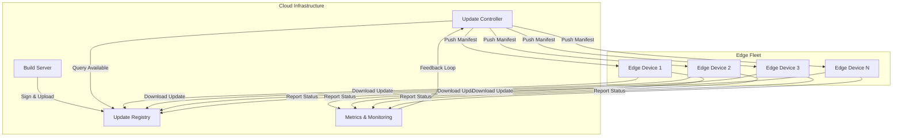
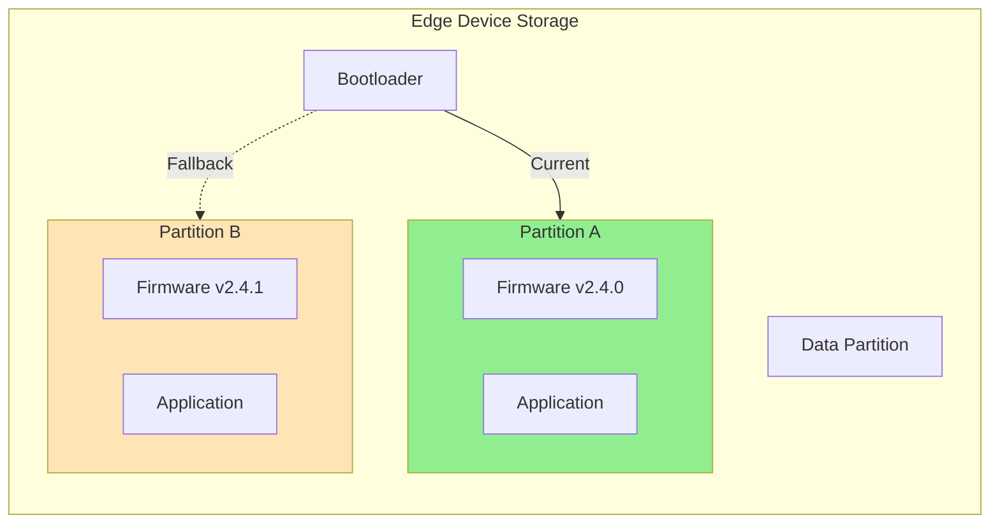
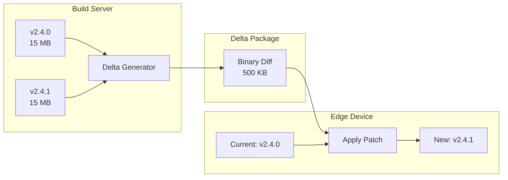
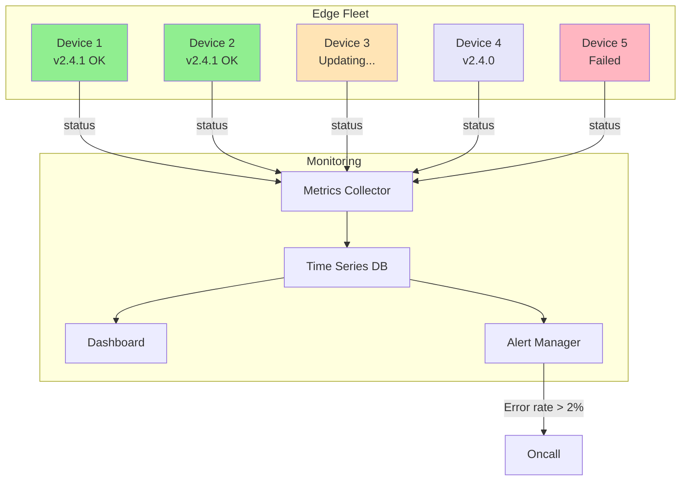

# How to Create Edge Updates

Author: [nawazdhandala](https://github.com/nawazdhandala)

Tags: Edge Computing, Updates, OTA, Deployment

Description: Learn to create edge updates for safely deploying software to distributed edge devices.

---

Edge devices operate in challenging environments: unreliable networks, limited bandwidth, and remote locations. Updating them requires careful planning to avoid bricking devices or creating security vulnerabilities. This guide covers practical strategies for building robust over-the-air (OTA) update systems.

## Understanding Edge Update Architecture

Before diving into implementation, let's visualize how edge updates flow through a typical system.



The controller orchestrates rollouts while devices pull updates from the registry. Status reporting creates a feedback loop for monitoring and automatic rollback decisions.

## 1. Design the Update Package Format

A well-structured update package contains everything needed for safe installation.

`update-package/manifest.json`

The manifest file describes the update contents, version information, and verification checksums. Edge devices use this to validate downloads before installation.

```json
{
  "version": "2.4.1",
  "releaseDate": "2026-01-30T10:00:00Z",
  "minAgentVersion": "1.2.0",
  "targetDeviceTypes": ["gateway-v2", "sensor-hub"],
  "components": [
    {
      "name": "firmware",
      "file": "firmware-2.4.1.bin",
      "size": 4194304,
      "sha256": "a1b2c3d4e5f6...truncated...",
      "installOrder": 1,
      "rebootRequired": true
    },
    {
      "name": "application",
      "file": "app-2.4.1.tar.gz",
      "size": 15728640,
      "sha256": "f6e5d4c3b2a1...truncated...",
      "installOrder": 2,
      "rebootRequired": false
    },
    {
      "name": "config",
      "file": "config-2.4.1.json",
      "size": 2048,
      "sha256": "1a2b3c4d5e6f...truncated...",
      "installOrder": 3,
      "rebootRequired": false
    }
  ],
  "rollbackVersion": "2.4.0",
  "signature": "MEUCIQD...base64-encoded-signature..."
}
```

## 2. Build the Update Agent

The update agent runs on each edge device and handles the entire update lifecycle.

`edge-agent/update_agent.py`

This agent implements the core update logic: checking for updates, downloading packages, verifying integrity, and applying changes safely.

```python
#!/usr/bin/env python3
"""
Edge Update Agent
Handles OTA updates for edge devices with rollback support.
"""

import hashlib
import json
import logging
import os
import shutil
import subprocess
import sys
import time
from dataclasses import dataclass
from enum import Enum
from pathlib import Path
from typing import Optional
import requests

# Configure logging with timestamps for debugging update issues
logging.basicConfig(
    level=logging.INFO,
    format="%(asctime)s [%(levelname)s] %(message)s"
)
logger = logging.getLogger(__name__)


class UpdateState(Enum):
    """
    Tracks the current state of an update operation.
    States flow: IDLE -> DOWNLOADING -> VERIFYING -> INSTALLING -> REBOOTING
    Any state can transition to FAILED or ROLLED_BACK on error.
    """
    IDLE = "idle"
    DOWNLOADING = "downloading"
    VERIFYING = "verifying"
    INSTALLING = "installing"
    REBOOTING = "rebooting"
    FAILED = "failed"
    ROLLED_BACK = "rolled_back"


@dataclass
class DeviceInfo:
    """
    Captures device identity and current software versions.
    Sent to the update server to determine applicable updates.
    """
    device_id: str
    device_type: str
    current_version: str
    agent_version: str


class UpdateAgent:
    """
    Manages the complete update lifecycle for an edge device.

    Features:
    - Atomic updates with A/B partitioning
    - Cryptographic verification of packages
    - Automatic rollback on failure
    - Resume support for interrupted downloads
    """

    def __init__(
        self,
        device_info: DeviceInfo,
        update_server: str,
        download_dir: Path,
        install_dir: Path,
        backup_dir: Path
    ):
        self.device = device_info
        self.server = update_server.rstrip("/")
        self.download_dir = download_dir
        self.install_dir = install_dir
        self.backup_dir = backup_dir
        self.state = UpdateState.IDLE
        self.current_manifest: Optional[dict] = None

        # Create required directories if they do not exist
        for directory in [download_dir, install_dir, backup_dir]:
            directory.mkdir(parents=True, exist_ok=True)

    def check_for_updates(self) -> Optional[dict]:
        """
        Query the update server for available updates.
        Returns the update manifest if an update is available, None otherwise.
        """
        logger.info(f"Checking for updates (current: {self.device.current_version})")

        try:
            # Send device info so server can filter compatible updates
            response = requests.post(
                f"{self.server}/api/v1/updates/check",
                json={
                    "device_id": self.device.device_id,
                    "device_type": self.device.device_type,
                    "current_version": self.device.current_version,
                    "agent_version": self.device.agent_version
                },
                timeout=30
            )
            response.raise_for_status()

            data = response.json()
            if data.get("update_available"):
                logger.info(f"Update available: {data['manifest']['version']}")
                return data["manifest"]

            logger.info("No updates available")
            return None

        except requests.RequestException as e:
            logger.error(f"Failed to check for updates: {e}")
            return None

    def download_update(self, manifest: dict) -> bool:
        """
        Download all components specified in the manifest.
        Supports resumable downloads for unreliable connections.
        """
        self.state = UpdateState.DOWNLOADING
        self.current_manifest = manifest

        for component in manifest["components"]:
            file_path = self.download_dir / component["file"]
            url = f"{self.server}/api/v1/updates/download/{component['file']}"

            logger.info(f"Downloading {component['name']}: {component['file']}")

            # Check for partial download to enable resume
            existing_size = file_path.stat().st_size if file_path.exists() else 0
            headers = {}

            if existing_size > 0 and existing_size < component["size"]:
                # Resume from where we left off
                headers["Range"] = f"bytes={existing_size}-"
                logger.info(f"Resuming download from byte {existing_size}")

            try:
                response = requests.get(
                    url,
                    headers=headers,
                    stream=True,
                    timeout=300
                )
                response.raise_for_status()

                # Open in append mode if resuming, write mode otherwise
                mode = "ab" if existing_size > 0 else "wb"
                with open(file_path, mode) as f:
                    for chunk in response.iter_content(chunk_size=8192):
                        f.write(chunk)

                logger.info(f"Downloaded {component['file']}")

            except requests.RequestException as e:
                logger.error(f"Download failed for {component['file']}: {e}")
                self.state = UpdateState.FAILED
                return False

        return True

    def verify_update(self, manifest: dict) -> bool:
        """
        Verify cryptographic hashes of all downloaded components.
        Prevents installation of corrupted or tampered packages.
        """
        self.state = UpdateState.VERIFYING
        logger.info("Verifying update integrity")

        for component in manifest["components"]:
            file_path = self.download_dir / component["file"]

            if not file_path.exists():
                logger.error(f"Missing file: {component['file']}")
                self.state = UpdateState.FAILED
                return False

            # Calculate SHA256 hash of downloaded file
            sha256_hash = hashlib.sha256()
            with open(file_path, "rb") as f:
                for chunk in iter(lambda: f.read(8192), b""):
                    sha256_hash.update(chunk)

            calculated_hash = sha256_hash.hexdigest()
            expected_hash = component["sha256"]

            if calculated_hash != expected_hash:
                logger.error(
                    f"Hash mismatch for {component['file']}: "
                    f"expected {expected_hash[:16]}..., got {calculated_hash[:16]}..."
                )
                self.state = UpdateState.FAILED
                return False

            logger.info(f"Verified {component['file']}")

        return True

    def backup_current_version(self) -> bool:
        """
        Create a backup of the current installation for rollback.
        Essential for recovery if the new version fails to boot.
        """
        logger.info("Creating backup of current version")

        backup_path = self.backup_dir / f"backup-{self.device.current_version}"

        try:
            # Remove old backup if it exists
            if backup_path.exists():
                shutil.rmtree(backup_path)

            # Copy current installation to backup location
            shutil.copytree(self.install_dir, backup_path)

            # Save version info for rollback identification
            version_file = backup_path / "VERSION"
            version_file.write_text(self.device.current_version)

            logger.info(f"Backup created at {backup_path}")
            return True

        except (OSError, shutil.Error) as e:
            logger.error(f"Backup failed: {e}")
            return False

    def install_update(self, manifest: dict) -> bool:
        """
        Install update components in the specified order.
        Each component is installed atomically when possible.
        """
        self.state = UpdateState.INSTALLING
        logger.info(f"Installing version {manifest['version']}")

        # Sort components by install order
        components = sorted(
            manifest["components"],
            key=lambda c: c["installOrder"]
        )

        for component in components:
            file_path = self.download_dir / component["file"]

            logger.info(f"Installing {component['name']}")

            try:
                if component["name"] == "firmware":
                    # Firmware requires special handling
                    self._install_firmware(file_path)
                elif component["name"] == "application":
                    # Extract application archive
                    self._install_application(file_path)
                elif component["name"] == "config":
                    # Merge configuration changes
                    self._install_config(file_path)
                else:
                    logger.warning(f"Unknown component type: {component['name']}")

            except Exception as e:
                logger.error(f"Installation failed for {component['name']}: {e}")
                self.state = UpdateState.FAILED
                return False

        # Update version marker
        version_file = self.install_dir / "VERSION"
        version_file.write_text(manifest["version"])

        logger.info("Installation complete")
        return True

    def _install_firmware(self, file_path: Path) -> None:
        """
        Write firmware to the inactive partition.
        Uses A/B partitioning for atomic updates.
        """
        # Determine which partition is inactive
        active_partition = self._get_active_partition()
        target_partition = "B" if active_partition == "A" else "A"

        partition_device = f"/dev/mmcblk0p{2 if target_partition == 'B' else 1}"

        logger.info(f"Writing firmware to partition {target_partition}")

        # Use dd for direct partition write with sync for safety
        subprocess.run(
            ["dd", f"if={file_path}", f"of={partition_device}", "bs=4M", "conv=fsync"],
            check=True,
            capture_output=True
        )

        # Update bootloader to use new partition on next boot
        self._set_boot_partition(target_partition)

    def _install_application(self, file_path: Path) -> None:
        """
        Extract and install the application package.
        Performs atomic replacement using rename.
        """
        temp_dir = self.install_dir / "app_temp"
        final_dir = self.install_dir / "app"
        old_dir = self.install_dir / "app_old"

        # Extract to temporary location
        temp_dir.mkdir(exist_ok=True)
        subprocess.run(
            ["tar", "-xzf", str(file_path), "-C", str(temp_dir)],
            check=True
        )

        # Atomic swap: rename is atomic on most filesystems
        if final_dir.exists():
            final_dir.rename(old_dir)
        temp_dir.rename(final_dir)

        # Clean up old version
        if old_dir.exists():
            shutil.rmtree(old_dir)

    def _install_config(self, file_path: Path) -> None:
        """
        Merge new configuration with existing settings.
        Preserves user customizations while applying updates.
        """
        config_path = self.install_dir / "config.json"

        # Load current config if it exists
        current_config = {}
        if config_path.exists():
            with open(config_path) as f:
                current_config = json.load(f)

        # Load new config
        with open(file_path) as f:
            new_config = json.load(f)

        # Merge: new config takes precedence, but preserve user settings
        user_settings = current_config.get("user_settings", {})
        merged_config = {**new_config}
        merged_config["user_settings"] = user_settings

        # Write merged config
        with open(config_path, "w") as f:
            json.dump(merged_config, f, indent=2)

    def _get_active_partition(self) -> str:
        """Read current boot partition from bootloader config."""
        # This is platform-specific; adjust for your bootloader
        result = subprocess.run(
            ["fw_printenv", "boot_partition"],
            capture_output=True,
            text=True
        )
        return result.stdout.strip().split("=")[-1]

    def _set_boot_partition(self, partition: str) -> None:
        """Configure bootloader to use specified partition."""
        subprocess.run(
            ["fw_setenv", "boot_partition", partition],
            check=True
        )

    def rollback(self) -> bool:
        """
        Restore the previous version from backup.
        Called automatically on boot failure or manually via API.
        """
        self.state = UpdateState.ROLLED_BACK
        logger.warning("Initiating rollback")

        # Find the most recent backup
        backups = sorted(
            self.backup_dir.glob("backup-*"),
            key=lambda p: p.stat().st_mtime,
            reverse=True
        )

        if not backups:
            logger.error("No backup available for rollback")
            return False

        backup_path = backups[0]
        logger.info(f"Rolling back to {backup_path.name}")

        try:
            # Restore from backup
            if self.install_dir.exists():
                shutil.rmtree(self.install_dir)
            shutil.copytree(backup_path, self.install_dir)

            # Update device version
            version_file = self.install_dir / "VERSION"
            if version_file.exists():
                self.device.current_version = version_file.read_text().strip()

            logger.info("Rollback complete")
            return True

        except (OSError, shutil.Error) as e:
            logger.error(f"Rollback failed: {e}")
            return False

    def report_status(self, success: bool, message: str = "") -> None:
        """
        Report update status back to the controller.
        Enables fleet-wide monitoring and automatic rollback triggers.
        """
        try:
            requests.post(
                f"{self.server}/api/v1/updates/status",
                json={
                    "device_id": self.device.device_id,
                    "state": self.state.value,
                    "success": success,
                    "version": self.device.current_version,
                    "message": message,
                    "timestamp": time.time()
                },
                timeout=10
            )
        except requests.RequestException as e:
            logger.warning(f"Failed to report status: {e}")

    def run_update_cycle(self) -> bool:
        """
        Execute a complete update cycle with proper error handling.
        This is the main entry point for scheduled update checks.
        """
        # Check for available updates
        manifest = self.check_for_updates()
        if not manifest:
            return True  # No update needed is not a failure

        # Download update package
        if not self.download_update(manifest):
            self.report_status(False, "Download failed")
            return False

        # Verify package integrity
        if not self.verify_update(manifest):
            self.report_status(False, "Verification failed")
            return False

        # Backup current version before installation
        if not self.backup_current_version():
            self.report_status(False, "Backup failed")
            return False

        # Install the update
        if not self.install_update(manifest):
            logger.warning("Installation failed, attempting rollback")
            self.rollback()
            self.report_status(False, "Installation failed, rolled back")
            return False

        # Check if reboot is required
        needs_reboot = any(
            c.get("rebootRequired", False)
            for c in manifest["components"]
        )

        if needs_reboot:
            self.state = UpdateState.REBOOTING
            self.report_status(True, "Update installed, rebooting")
            logger.info("Rebooting to complete update")
            subprocess.run(["reboot"], check=True)
        else:
            self.state = UpdateState.IDLE
            self.device.current_version = manifest["version"]
            self.report_status(True, "Update complete")

        return True


def main():
    """Initialize and run the update agent."""
    device = DeviceInfo(
        device_id=os.environ.get("DEVICE_ID", "edge-001"),
        device_type=os.environ.get("DEVICE_TYPE", "gateway-v2"),
        current_version=os.environ.get("CURRENT_VERSION", "2.4.0"),
        agent_version="1.2.0"
    )

    agent = UpdateAgent(
        device_info=device,
        update_server=os.environ.get("UPDATE_SERVER", "https://updates.example.com"),
        download_dir=Path("/var/cache/updates"),
        install_dir=Path("/opt/edge-app"),
        backup_dir=Path("/var/backups/edge-app")
    )

    success = agent.run_update_cycle()
    sys.exit(0 if success else 1)


if __name__ == "__main__":
    main()
```

## 3. Implement A/B Partitioning

A/B partitioning ensures devices always have a bootable fallback.



`bootloader/boot-config.sh`

This script manages A/B partition switching and boot counting for automatic rollback detection.

```bash
#!/bin/bash
# Boot configuration script for A/B partitioning
# Manages partition selection and boot failure detection

set -euo pipefail

# Configuration
BOOT_ENV_FILE="/boot/uboot.env"
MAX_BOOT_ATTEMPTS=3

# Read current boot configuration
get_current_partition() {
    # Extract the current boot partition from U-Boot environment
    fw_printenv boot_partition 2>/dev/null | cut -d'=' -f2 || echo "A"
}

get_boot_count() {
    # Track consecutive failed boots for automatic rollback
    fw_printenv boot_count 2>/dev/null | cut -d'=' -f2 || echo "0"
}

increment_boot_count() {
    local current_count
    current_count=$(get_boot_count)
    local new_count=$((current_count + 1))
    fw_setenv boot_count "$new_count"
    echo "$new_count"
}

reset_boot_count() {
    # Called after successful boot to reset the counter
    fw_setenv boot_count 0
}

switch_partition() {
    # Swap to the other partition
    local current
    current=$(get_current_partition)
    if [[ "$current" == "A" ]]; then
        fw_setenv boot_partition B
        echo "Switched to partition B"
    else
        fw_setenv boot_partition A
        echo "Switched to partition A"
    fi
}

mark_boot_successful() {
    # Call this after the application starts successfully
    # Confirms the update works and prevents rollback
    reset_boot_count

    # Update the fallback partition to match current (optional)
    local current
    current=$(get_current_partition)
    fw_setenv fallback_partition "$current"

    echo "Boot marked successful on partition $current"
}

check_boot_health() {
    # Check if we have exceeded boot attempts
    # Called early in boot process
    local count
    count=$(increment_boot_count)

    if [[ "$count" -ge "$MAX_BOOT_ATTEMPTS" ]]; then
        echo "Boot attempt $count of $MAX_BOOT_ATTEMPTS - triggering rollback"
        switch_partition
        reset_boot_count
        reboot
    else
        echo "Boot attempt $count of $MAX_BOOT_ATTEMPTS"
    fi
}

# Main entry point
case "${1:-}" in
    check)
        check_boot_health
        ;;
    success)
        mark_boot_successful
        ;;
    switch)
        switch_partition
        ;;
    status)
        echo "Current partition: $(get_current_partition)"
        echo "Boot count: $(get_boot_count)"
        ;;
    *)
        echo "Usage: $0 {check|success|switch|status}"
        exit 1
        ;;
esac
```

## 4. Build the Update Controller

The controller manages fleet-wide updates with staged rollouts.

`controller/update_controller.py`

This server-side component orchestrates updates across the device fleet, implementing staged rollouts and automatic rollback based on error thresholds.

```python
#!/usr/bin/env python3
"""
Edge Update Controller
Manages staged rollouts across a fleet of edge devices.
"""

import logging
import time
from dataclasses import dataclass, field
from datetime import datetime, timedelta
from enum import Enum
from typing import Dict, List, Optional, Set
from collections import defaultdict

logging.basicConfig(level=logging.INFO)
logger = logging.getLogger(__name__)


class RolloutStage(Enum):
    """
    Defines the stages of a progressive rollout.
    Each stage increases the percentage of devices receiving the update.
    """
    CANARY = "canary"           # 1% of devices
    EARLY_ADOPTERS = "early"    # 10% of devices
    GRADUAL = "gradual"         # 50% of devices
    FULL = "full"               # 100% of devices
    PAUSED = "paused"           # Rollout halted
    ROLLED_BACK = "rolled_back" # Reverted to previous version


@dataclass
class RolloutConfig:
    """
    Configuration for a staged rollout.
    Controls timing, thresholds, and automatic responses.
    """
    version: str
    canary_percentage: float = 1.0
    early_percentage: float = 10.0
    gradual_percentage: float = 50.0

    # Time to wait between stages for monitoring
    stage_delay_minutes: int = 30

    # Error thresholds that trigger automatic pause/rollback
    error_threshold_canary: float = 5.0    # 5% errors pauses rollout
    error_threshold_early: float = 2.0     # 2% errors pauses rollout
    error_threshold_gradual: float = 1.0   # 1% errors pauses rollout

    # Minimum devices in each stage before advancing
    min_canary_devices: int = 5
    min_early_devices: int = 50


@dataclass
class DeviceStatus:
    """Tracks the update status of a single device."""
    device_id: str
    device_type: str
    current_version: str
    target_version: Optional[str] = None
    update_state: str = "idle"
    last_seen: datetime = field(default_factory=datetime.utcnow)
    error_message: Optional[str] = None
    rollout_stage: Optional[RolloutStage] = None


class UpdateController:
    """
    Orchestrates updates across a fleet of edge devices.

    Features:
    - Staged rollouts (canary, early adopters, gradual, full)
    - Automatic pause on error threshold breach
    - Fleet-wide rollback capability
    - Device targeting by type, region, or custom tags
    """

    def __init__(self):
        # Track all known devices
        self.devices: Dict[str, DeviceStatus] = {}

        # Track devices in each rollout stage
        self.stage_devices: Dict[RolloutStage, Set[str]] = defaultdict(set)

        # Current rollout configuration
        self.current_rollout: Optional[RolloutConfig] = None
        self.current_stage: RolloutStage = RolloutStage.CANARY
        self.stage_start_time: Optional[datetime] = None

        # Metrics for decision making
        self.stage_success_count: int = 0
        self.stage_failure_count: int = 0

    def register_device(self, device_id: str, device_type: str, version: str) -> None:
        """Register a device or update its status."""
        if device_id in self.devices:
            self.devices[device_id].current_version = version
            self.devices[device_id].last_seen = datetime.utcnow()
        else:
            self.devices[device_id] = DeviceStatus(
                device_id=device_id,
                device_type=device_type,
                current_version=version
            )
        logger.info(f"Device {device_id} registered with version {version}")

    def start_rollout(self, config: RolloutConfig) -> bool:
        """
        Initiate a new staged rollout.
        Selects canary devices and begins the update process.
        """
        if self.current_rollout and self.current_stage not in [
            RolloutStage.ROLLED_BACK, RolloutStage.FULL
        ]:
            logger.error("Cannot start rollout: existing rollout in progress")
            return False

        logger.info(f"Starting rollout for version {config.version}")

        self.current_rollout = config
        self.current_stage = RolloutStage.CANARY
        self.stage_start_time = datetime.utcnow()
        self.stage_success_count = 0
        self.stage_failure_count = 0

        # Clear previous stage assignments
        for stage in RolloutStage:
            self.stage_devices[stage].clear()

        # Select canary devices
        self._select_devices_for_stage(RolloutStage.CANARY)

        return True

    def _select_devices_for_stage(self, stage: RolloutStage) -> None:
        """
        Select devices to receive the update in the current stage.
        Uses a deterministic selection based on device ID for consistency.
        """
        config = self.current_rollout
        if not config:
            return

        # Calculate target percentage based on stage
        percentages = {
            RolloutStage.CANARY: config.canary_percentage,
            RolloutStage.EARLY_ADOPTERS: config.early_percentage,
            RolloutStage.GRADUAL: config.gradual_percentage,
            RolloutStage.FULL: 100.0
        }

        target_percentage = percentages.get(stage, 0)

        # Get eligible devices (not yet updated to target version)
        eligible = [
            d for d in self.devices.values()
            if d.current_version != config.version
        ]

        # Calculate how many devices to include
        target_count = int(len(eligible) * target_percentage / 100)

        # Use hash-based selection for determinism
        # This ensures the same devices are selected on repeated calls
        sorted_devices = sorted(eligible, key=lambda d: hash(d.device_id + config.version))
        selected = sorted_devices[:target_count]

        for device in selected:
            device.target_version = config.version
            device.rollout_stage = stage
            self.stage_devices[stage].add(device.device_id)

        logger.info(
            f"Selected {len(selected)} devices for {stage.value} stage "
            f"({target_percentage}% of {len(eligible)} eligible)"
        )

    def report_device_status(
        self,
        device_id: str,
        state: str,
        success: bool,
        version: str,
        message: str = ""
    ) -> None:
        """
        Process a status report from a device.
        Updates metrics and may trigger stage advancement or rollback.
        """
        if device_id not in self.devices:
            logger.warning(f"Status report from unknown device: {device_id}")
            return

        device = self.devices[device_id]
        device.update_state = state
        device.current_version = version
        device.last_seen = datetime.utcnow()
        device.error_message = message if not success else None

        # Update stage metrics
        if device.rollout_stage == self.current_stage:
            if success and state == "idle":
                self.stage_success_count += 1
            elif not success:
                self.stage_failure_count += 1
                logger.warning(
                    f"Device {device_id} reported failure: {message}"
                )

        # Check if we should pause or advance
        self._evaluate_rollout_health()

    def _evaluate_rollout_health(self) -> None:
        """
        Analyze current rollout metrics and decide next action.
        May pause rollout, trigger rollback, or advance to next stage.
        """
        if not self.current_rollout or self.current_stage in [
            RolloutStage.PAUSED, RolloutStage.ROLLED_BACK, RolloutStage.FULL
        ]:
            return

        config = self.current_rollout
        total_reports = self.stage_success_count + self.stage_failure_count

        if total_reports == 0:
            return

        error_rate = (self.stage_failure_count / total_reports) * 100

        # Get error threshold for current stage
        thresholds = {
            RolloutStage.CANARY: config.error_threshold_canary,
            RolloutStage.EARLY_ADOPTERS: config.error_threshold_early,
            RolloutStage.GRADUAL: config.error_threshold_gradual
        }
        threshold = thresholds.get(self.current_stage, 1.0)

        if error_rate > threshold:
            logger.error(
                f"Error rate {error_rate:.1f}% exceeds threshold {threshold}% "
                f"in {self.current_stage.value} stage"
            )
            self._pause_rollout(f"Error rate {error_rate:.1f}% exceeded threshold")
            return

        # Check if we can advance to next stage
        self._try_advance_stage()

    def _try_advance_stage(self) -> None:
        """
        Check if conditions are met to advance to the next rollout stage.
        Considers time delay, success count, and error rate.
        """
        if not self.current_rollout or not self.stage_start_time:
            return

        config = self.current_rollout

        # Check minimum time has passed
        elapsed = datetime.utcnow() - self.stage_start_time
        if elapsed < timedelta(minutes=config.stage_delay_minutes):
            return

        # Check minimum device count for early stages
        min_counts = {
            RolloutStage.CANARY: config.min_canary_devices,
            RolloutStage.EARLY_ADOPTERS: config.min_early_devices,
            RolloutStage.GRADUAL: 0
        }
        min_count = min_counts.get(self.current_stage, 0)

        if self.stage_success_count < min_count:
            logger.info(
                f"Waiting for more devices: {self.stage_success_count}/{min_count}"
            )
            return

        # Advance to next stage
        stage_order = [
            RolloutStage.CANARY,
            RolloutStage.EARLY_ADOPTERS,
            RolloutStage.GRADUAL,
            RolloutStage.FULL
        ]

        current_index = stage_order.index(self.current_stage)
        if current_index < len(stage_order) - 1:
            next_stage = stage_order[current_index + 1]
            self._advance_to_stage(next_stage)

    def _advance_to_stage(self, stage: RolloutStage) -> None:
        """Move the rollout to the specified stage."""
        logger.info(f"Advancing rollout to {stage.value} stage")

        self.current_stage = stage
        self.stage_start_time = datetime.utcnow()
        self.stage_success_count = 0
        self.stage_failure_count = 0

        self._select_devices_for_stage(stage)

    def _pause_rollout(self, reason: str) -> None:
        """Halt the rollout without rolling back."""
        logger.warning(f"Pausing rollout: {reason}")
        self.current_stage = RolloutStage.PAUSED

        # Mark all pending devices as not targeted
        for device in self.devices.values():
            if device.update_state in ["downloading", "verifying"]:
                device.target_version = None

    def rollback_fleet(self, target_version: str) -> int:
        """
        Initiate a fleet-wide rollback to a specific version.
        Returns the number of devices that will receive rollback commands.
        """
        logger.warning(f"Initiating fleet rollback to version {target_version}")

        self.current_stage = RolloutStage.ROLLED_BACK
        rollback_count = 0

        for device in self.devices.values():
            if device.current_version != target_version:
                device.target_version = target_version
                device.rollout_stage = RolloutStage.ROLLED_BACK
                rollback_count += 1

        return rollback_count

    def get_device_assignment(self, device_id: str) -> Optional[str]:
        """
        Check if a device should receive an update.
        Called by devices during their update check.
        """
        if device_id not in self.devices:
            return None

        device = self.devices[device_id]

        # Only return target if device is in an active rollout stage
        if device.rollout_stage in [
            RolloutStage.CANARY,
            RolloutStage.EARLY_ADOPTERS,
            RolloutStage.GRADUAL,
            RolloutStage.FULL,
            RolloutStage.ROLLED_BACK
        ]:
            return device.target_version

        return None

    def get_rollout_status(self) -> dict:
        """Generate a summary of the current rollout status."""
        if not self.current_rollout:
            return {"status": "no_active_rollout"}

        # Count devices by status
        version_counts = defaultdict(int)
        for device in self.devices.values():
            version_counts[device.current_version] += 1

        return {
            "status": "active",
            "target_version": self.current_rollout.version,
            "current_stage": self.current_stage.value,
            "stage_success": self.stage_success_count,
            "stage_failures": self.stage_failure_count,
            "version_distribution": dict(version_counts),
            "total_devices": len(self.devices)
        }
```

## 5. Implement Delta Updates

Full updates waste bandwidth. Delta updates send only changed bytes.



`build/delta_generator.py`

This tool creates binary diff patches between firmware versions, reducing update size by 90% or more for minor changes.

```python
#!/usr/bin/env python3
"""
Delta Update Generator
Creates binary diff patches for efficient OTA updates.
"""

import hashlib
import json
import subprocess
import tempfile
from dataclasses import dataclass
from pathlib import Path
from typing import Optional
import logging

logging.basicConfig(level=logging.INFO)
logger = logging.getLogger(__name__)


@dataclass
class DeltaResult:
    """Result of delta generation."""
    source_version: str
    target_version: str
    source_size: int
    target_size: int
    delta_size: int
    compression_ratio: float
    delta_path: Path
    delta_hash: str


class DeltaGenerator:
    """
    Generates binary delta patches between firmware versions.

    Uses bsdiff for optimal compression of binary differences.
    Falls back to full image if delta would be larger.
    """

    def __init__(self, output_dir: Path):
        self.output_dir = output_dir
        output_dir.mkdir(parents=True, exist_ok=True)

    def generate_delta(
        self,
        source_path: Path,
        target_path: Path,
        source_version: str,
        target_version: str,
        max_delta_ratio: float = 0.5
    ) -> Optional[DeltaResult]:
        """
        Generate a delta patch from source to target version.

        Args:
            source_path: Path to the source (old) firmware
            target_path: Path to the target (new) firmware
            source_version: Version string for source
            target_version: Version string for target
            max_delta_ratio: Maximum delta size as ratio of target
                           If delta is larger, return None

        Returns:
            DeltaResult if delta was generated, None if not beneficial
        """
        logger.info(f"Generating delta: {source_version} -> {target_version}")

        source_size = source_path.stat().st_size
        target_size = target_path.stat().st_size

        # Generate delta filename
        delta_filename = f"delta-{source_version}-to-{target_version}.patch"
        delta_path = self.output_dir / delta_filename

        # Use bsdiff for binary diff (handles binaries well)
        try:
            subprocess.run(
                ["bsdiff", str(source_path), str(target_path), str(delta_path)],
                check=True,
                capture_output=True
            )
        except subprocess.CalledProcessError as e:
            logger.error(f"bsdiff failed: {e.stderr.decode()}")
            return None
        except FileNotFoundError:
            logger.error("bsdiff not found, install with: apt install bsdiff")
            return None

        delta_size = delta_path.stat().st_size
        compression_ratio = delta_size / target_size

        logger.info(
            f"Delta generated: {delta_size} bytes "
            f"({compression_ratio:.1%} of target size)"
        )

        # Check if delta is worthwhile
        if compression_ratio > max_delta_ratio:
            logger.warning(
                f"Delta too large ({compression_ratio:.1%}), "
                f"recommending full update"
            )
            delta_path.unlink()  # Clean up
            return None

        # Calculate hash for verification
        delta_hash = self._calculate_hash(delta_path)

        return DeltaResult(
            source_version=source_version,
            target_version=target_version,
            source_size=source_size,
            target_size=target_size,
            delta_size=delta_size,
            compression_ratio=compression_ratio,
            delta_path=delta_path,
            delta_hash=delta_hash
        )

    def _calculate_hash(self, file_path: Path) -> str:
        """Calculate SHA256 hash of a file."""
        sha256 = hashlib.sha256()
        with open(file_path, "rb") as f:
            for chunk in iter(lambda: f.read(8192), b""):
                sha256.update(chunk)
        return sha256.hexdigest()

    def generate_manifest(
        self,
        deltas: list[DeltaResult],
        full_image_path: Path,
        target_version: str
    ) -> dict:
        """
        Generate a manifest including both delta and full update options.
        Devices choose the best option based on their current version.
        """
        full_hash = self._calculate_hash(full_image_path)
        full_size = full_image_path.stat().st_size

        manifest = {
            "version": target_version,
            "releaseDate": "2026-01-30T10:00:00Z",
            "fullUpdate": {
                "file": full_image_path.name,
                "size": full_size,
                "sha256": full_hash
            },
            "deltaUpdates": []
        }

        for delta in deltas:
            manifest["deltaUpdates"].append({
                "fromVersion": delta.source_version,
                "file": delta.delta_path.name,
                "size": delta.delta_size,
                "sha256": delta.delta_hash,
                "savings": f"{(1 - delta.compression_ratio) * 100:.0f}%"
            })

        return manifest


class DeltaApplier:
    """
    Applies delta patches on edge devices.
    """

    def __init__(self, temp_dir: Path):
        self.temp_dir = temp_dir
        temp_dir.mkdir(parents=True, exist_ok=True)

    def apply_delta(
        self,
        current_firmware: Path,
        delta_patch: Path,
        expected_hash: str
    ) -> Optional[Path]:
        """
        Apply a delta patch to current firmware.

        Args:
            current_firmware: Path to current firmware image
            delta_patch: Path to the delta patch file
            expected_hash: Expected SHA256 of the resulting firmware

        Returns:
            Path to the new firmware if successful, None otherwise
        """
        output_path = self.temp_dir / "firmware_new.bin"

        logger.info("Applying delta patch")

        try:
            # Use bspatch to apply the delta
            subprocess.run(
                [
                    "bspatch",
                    str(current_firmware),
                    str(output_path),
                    str(delta_patch)
                ],
                check=True,
                capture_output=True
            )
        except subprocess.CalledProcessError as e:
            logger.error(f"Failed to apply patch: {e.stderr.decode()}")
            return None

        # Verify the result
        sha256 = hashlib.sha256()
        with open(output_path, "rb") as f:
            for chunk in iter(lambda: f.read(8192), b""):
                sha256.update(chunk)

        actual_hash = sha256.hexdigest()

        if actual_hash != expected_hash:
            logger.error(
                f"Hash mismatch after patching: "
                f"expected {expected_hash[:16]}..., got {actual_hash[:16]}..."
            )
            output_path.unlink()
            return None

        logger.info("Delta patch applied successfully")
        return output_path
```

## 6. Handle Offline and Unreliable Networks

Edge devices often have intermittent connectivity. Design for network failures.

`edge-agent/resilient_downloader.py`

This module implements robust download handling with automatic retries, chunk verification, and bandwidth throttling.

```python
#!/usr/bin/env python3
"""
Resilient Downloader
Handles downloads over unreliable networks with resume and verification.
"""

import hashlib
import logging
import os
import time
from dataclasses import dataclass
from pathlib import Path
from typing import Callable, Optional
import requests
from requests.adapters import HTTPAdapter
from urllib3.util.retry import Retry

logging.basicConfig(level=logging.INFO)
logger = logging.getLogger(__name__)


@dataclass
class DownloadProgress:
    """Tracks download progress for reporting."""
    total_size: int
    downloaded: int
    speed_bps: float
    eta_seconds: float

    @property
    def percentage(self) -> float:
        if self.total_size == 0:
            return 0
        return (self.downloaded / self.total_size) * 100


class ResilientDownloader:
    """
    Downloads files with automatic resume and verification.

    Designed for unreliable edge network conditions:
    - Automatic retry with exponential backoff
    - Resume support for interrupted downloads
    - Chunk-level verification
    - Bandwidth throttling option
    """

    def __init__(
        self,
        max_retries: int = 5,
        chunk_size: int = 65536,
        timeout: int = 30,
        max_bandwidth_kbps: Optional[int] = None
    ):
        self.max_retries = max_retries
        self.chunk_size = chunk_size
        self.timeout = timeout
        self.max_bandwidth_kbps = max_bandwidth_kbps

        # Configure session with retry strategy
        self.session = requests.Session()
        retry_strategy = Retry(
            total=max_retries,
            backoff_factor=1,  # Wait 1, 2, 4, 8... seconds between retries
            status_forcelist=[429, 500, 502, 503, 504],
            allowed_methods=["HEAD", "GET"]
        )
        adapter = HTTPAdapter(max_retries=retry_strategy)
        self.session.mount("https://", adapter)
        self.session.mount("http://", adapter)

    def download(
        self,
        url: str,
        destination: Path,
        expected_hash: Optional[str] = None,
        progress_callback: Optional[Callable[[DownloadProgress], None]] = None
    ) -> bool:
        """
        Download a file with resume support.

        Args:
            url: URL to download from
            destination: Local path to save the file
            expected_hash: Optional SHA256 hash for verification
            progress_callback: Optional function to report progress

        Returns:
            True if download completed and verified, False otherwise
        """
        logger.info(f"Starting download: {url}")

        # Check for existing partial download
        existing_size = 0
        if destination.exists():
            existing_size = destination.stat().st_size

        # Get total file size
        try:
            head_response = self.session.head(url, timeout=self.timeout)
            head_response.raise_for_status()
            total_size = int(head_response.headers.get("Content-Length", 0))
        except requests.RequestException as e:
            logger.error(f"Failed to get file info: {e}")
            return False

        # Check if already complete
        if existing_size == total_size and total_size > 0:
            if expected_hash and self._verify_hash(destination, expected_hash):
                logger.info("File already downloaded and verified")
                return True
            elif not expected_hash:
                logger.info("File already downloaded")
                return True
            else:
                # Hash mismatch, re-download
                logger.warning("Existing file hash mismatch, re-downloading")
                existing_size = 0
                destination.unlink()

        # Prepare headers for resume
        headers = {}
        if existing_size > 0:
            headers["Range"] = f"bytes={existing_size}-"
            logger.info(f"Resuming from byte {existing_size}")

        # Download with progress tracking
        start_time = time.time()
        downloaded = existing_size

        try:
            response = self.session.get(
                url,
                headers=headers,
                stream=True,
                timeout=self.timeout
            )
            response.raise_for_status()

            # Handle partial content response
            if response.status_code == 206:
                mode = "ab"  # Append for resume
            else:
                mode = "wb"  # Write fresh
                downloaded = 0

            with open(destination, mode) as f:
                for chunk in response.iter_content(chunk_size=self.chunk_size):
                    if chunk:
                        f.write(chunk)
                        downloaded += len(chunk)

                        # Apply bandwidth throttling if configured
                        if self.max_bandwidth_kbps:
                            self._throttle(downloaded, start_time)

                        # Report progress
                        if progress_callback:
                            elapsed = time.time() - start_time
                            speed = downloaded / elapsed if elapsed > 0 else 0
                            eta = (total_size - downloaded) / speed if speed > 0 else 0

                            progress = DownloadProgress(
                                total_size=total_size,
                                downloaded=downloaded,
                                speed_bps=speed,
                                eta_seconds=eta
                            )
                            progress_callback(progress)

            logger.info(f"Download complete: {downloaded} bytes")

        except requests.RequestException as e:
            logger.error(f"Download failed: {e}")
            return False

        # Verify hash if provided
        if expected_hash:
            if not self._verify_hash(destination, expected_hash):
                logger.error("Hash verification failed")
                return False
            logger.info("Hash verified successfully")

        return True

    def _verify_hash(self, file_path: Path, expected_hash: str) -> bool:
        """Verify file hash matches expected value."""
        sha256 = hashlib.sha256()
        with open(file_path, "rb") as f:
            for chunk in iter(lambda: f.read(self.chunk_size), b""):
                sha256.update(chunk)

        actual_hash = sha256.hexdigest()
        return actual_hash.lower() == expected_hash.lower()

    def _throttle(self, downloaded: int, start_time: float) -> None:
        """Apply bandwidth throttling if download is too fast."""
        if not self.max_bandwidth_kbps:
            return

        elapsed = time.time() - start_time
        if elapsed <= 0:
            return

        current_speed_kbps = (downloaded / 1024) / elapsed

        if current_speed_kbps > self.max_bandwidth_kbps:
            # Calculate how long we should have taken
            expected_time = (downloaded / 1024) / self.max_bandwidth_kbps
            sleep_time = expected_time - elapsed
            if sleep_time > 0:
                time.sleep(sleep_time)


def download_with_progress(url: str, dest: Path) -> bool:
    """Convenience function with progress printing."""

    def print_progress(progress: DownloadProgress):
        speed_kb = progress.speed_bps / 1024
        print(
            f"\rDownloading: {progress.percentage:.1f}% "
            f"({progress.downloaded / 1024 / 1024:.1f} MB) "
            f"@ {speed_kb:.0f} KB/s "
            f"ETA: {progress.eta_seconds:.0f}s",
            end="",
            flush=True
        )

    downloader = ResilientDownloader()
    result = downloader.download(url, dest, progress_callback=print_progress)
    print()  # Newline after progress
    return result
```

## 7. Implement Health Checks

Verify the device is healthy after updates to prevent boot loops.

`edge-agent/health_checker.py`

This module runs post-update health checks and signals the bootloader to confirm a successful update.

```python
#!/usr/bin/env python3
"""
Post-Update Health Checker
Validates device health after updates and confirms to bootloader.
"""

import logging
import subprocess
import time
from dataclasses import dataclass
from pathlib import Path
from typing import Callable, List, Optional
import requests

logging.basicConfig(level=logging.INFO)
logger = logging.getLogger(__name__)


@dataclass
class HealthCheck:
    """Defines a single health check."""
    name: str
    check_function: Callable[[], bool]
    critical: bool = True  # If True, failure triggers rollback
    timeout_seconds: int = 30


class HealthChecker:
    """
    Runs health checks after updates to confirm success.

    If checks fail, the bootloader will automatically roll back
    on the next reboot (via boot count mechanism).
    """

    def __init__(
        self,
        boot_config_script: Path = Path("/opt/edge-app/boot-config.sh")
    ):
        self.boot_config_script = boot_config_script
        self.checks: List[HealthCheck] = []

        # Register default checks
        self._register_default_checks()

    def _register_default_checks(self) -> None:
        """Register standard health checks for edge devices."""

        # Check that the main application is running
        self.add_check(HealthCheck(
            name="application_running",
            check_function=self._check_application_running,
            critical=True
        ))

        # Check network connectivity
        self.add_check(HealthCheck(
            name="network_connectivity",
            check_function=self._check_network,
            critical=True
        ))

        # Check available disk space
        self.add_check(HealthCheck(
            name="disk_space",
            check_function=self._check_disk_space,
            critical=False
        ))

        # Check system services
        self.add_check(HealthCheck(
            name="system_services",
            check_function=self._check_services,
            critical=True
        ))

    def add_check(self, check: HealthCheck) -> None:
        """Register a health check."""
        self.checks.append(check)

    def _check_application_running(self) -> bool:
        """Verify the main application process is running."""
        try:
            result = subprocess.run(
                ["pgrep", "-f", "edge-app"],
                capture_output=True
            )
            return result.returncode == 0
        except Exception as e:
            logger.error(f"Application check failed: {e}")
            return False

    def _check_network(self) -> bool:
        """Verify network connectivity to update server."""
        try:
            response = requests.get(
                "https://updates.example.com/health",
                timeout=10
            )
            return response.status_code == 200
        except requests.RequestException:
            # Network might be temporarily unavailable
            # Try a simple DNS check instead
            try:
                import socket
                socket.gethostbyname("updates.example.com")
                return True
            except socket.error:
                return False

    def _check_disk_space(self) -> bool:
        """Verify sufficient disk space is available."""
        try:
            result = subprocess.run(
                ["df", "-h", "/"],
                capture_output=True,
                text=True
            )
            # Parse output to get usage percentage
            lines = result.stdout.strip().split("\n")
            if len(lines) >= 2:
                # Format: Filesystem Size Used Avail Use% Mounted
                parts = lines[1].split()
                usage_str = parts[4].rstrip("%")
                usage = int(usage_str)
                # Fail if more than 90% full
                return usage < 90
            return False
        except Exception as e:
            logger.error(f"Disk space check failed: {e}")
            return False

    def _check_services(self) -> bool:
        """Verify critical system services are running."""
        critical_services = ["networkd", "resolved", "timesyncd"]

        for service in critical_services:
            try:
                result = subprocess.run(
                    ["systemctl", "is-active", f"systemd-{service}"],
                    capture_output=True,
                    text=True
                )
                if result.stdout.strip() != "active":
                    logger.warning(f"Service {service} is not active")
                    return False
            except Exception as e:
                logger.error(f"Service check failed for {service}: {e}")
                return False

        return True

    def run_all_checks(self, retry_count: int = 3, retry_delay: int = 10) -> bool:
        """
        Run all registered health checks with retries.

        Returns True only if all critical checks pass.
        Non-critical failures are logged but do not cause failure.
        """
        logger.info("Running post-update health checks")

        all_passed = True

        for check in self.checks:
            passed = False

            for attempt in range(retry_count):
                logger.info(f"Running check: {check.name} (attempt {attempt + 1})")

                try:
                    passed = check.check_function()
                except Exception as e:
                    logger.error(f"Check {check.name} raised exception: {e}")
                    passed = False

                if passed:
                    logger.info(f"Check {check.name}: PASSED")
                    break

                if attempt < retry_count - 1:
                    logger.warning(
                        f"Check {check.name} failed, retrying in {retry_delay}s"
                    )
                    time.sleep(retry_delay)

            if not passed:
                if check.critical:
                    logger.error(f"Critical check {check.name}: FAILED")
                    all_passed = False
                else:
                    logger.warning(f"Non-critical check {check.name}: FAILED")

        return all_passed

    def confirm_boot_success(self) -> bool:
        """
        Signal to bootloader that boot was successful.
        This prevents automatic rollback on next reboot.
        """
        logger.info("Confirming boot success to bootloader")

        try:
            result = subprocess.run(
                [str(self.boot_config_script), "success"],
                capture_output=True,
                text=True
            )

            if result.returncode == 0:
                logger.info("Boot success confirmed")
                return True
            else:
                logger.error(f"Failed to confirm boot: {result.stderr}")
                return False

        except Exception as e:
            logger.error(f"Failed to run boot config script: {e}")
            return False

    def run_and_confirm(self) -> bool:
        """
        Run all checks and confirm success if they pass.
        This is the main entry point for post-update validation.
        """
        if self.run_all_checks():
            return self.confirm_boot_success()
        else:
            logger.error("Health checks failed, boot will not be confirmed")
            logger.error("Device will roll back on next reboot")
            return False


def main():
    """Run health checks as a standalone script."""
    checker = HealthChecker()
    success = checker.run_and_confirm()
    exit(0 if success else 1)


if __name__ == "__main__":
    main()
```

## 8. Monitor Update Status

Track updates across your fleet in real time.



`monitoring/metrics_exporter.py`

Export update metrics in Prometheus format for monitoring and alerting.

```python
#!/usr/bin/env python3
"""
Update Metrics Exporter
Exposes fleet update metrics in Prometheus format.
"""

from dataclasses import dataclass
from typing import Dict
from collections import defaultdict
import time


@dataclass
class UpdateMetrics:
    """Aggregated metrics for the update system."""

    # Counter: Total update attempts
    update_attempts_total: int = 0

    # Counter: Successful updates
    update_successes_total: int = 0

    # Counter: Failed updates
    update_failures_total: int = 0

    # Counter: Rollbacks triggered
    rollbacks_total: int = 0

    # Gauge: Devices by version
    devices_by_version: Dict[str, int] = None

    # Gauge: Devices by state
    devices_by_state: Dict[str, int] = None

    # Gauge: Current rollout progress
    rollout_progress_percent: float = 0.0

    # Histogram: Update duration seconds
    update_duration_seconds: list = None

    def __post_init__(self):
        if self.devices_by_version is None:
            self.devices_by_version = defaultdict(int)
        if self.devices_by_state is None:
            self.devices_by_state = defaultdict(int)
        if self.update_duration_seconds is None:
            self.update_duration_seconds = []


class MetricsExporter:
    """
    Collects and exports update metrics for monitoring.
    """

    def __init__(self):
        self.metrics = UpdateMetrics()
        self.update_start_times: Dict[str, float] = {}

    def record_update_start(self, device_id: str) -> None:
        """Record when an update begins."""
        self.metrics.update_attempts_total += 1
        self.update_start_times[device_id] = time.time()

    def record_update_success(self, device_id: str, version: str) -> None:
        """Record a successful update."""
        self.metrics.update_successes_total += 1

        if device_id in self.update_start_times:
            duration = time.time() - self.update_start_times[device_id]
            self.metrics.update_duration_seconds.append(duration)
            del self.update_start_times[device_id]

        self.metrics.devices_by_version[version] += 1

    def record_update_failure(self, device_id: str, reason: str) -> None:
        """Record a failed update."""
        self.metrics.update_failures_total += 1

        if device_id in self.update_start_times:
            del self.update_start_times[device_id]

    def record_rollback(self, device_id: str) -> None:
        """Record a rollback event."""
        self.metrics.rollbacks_total += 1

    def update_device_state(self, device_id: str, state: str) -> None:
        """Update the current state of a device."""
        # This would typically decrement old state and increment new
        self.metrics.devices_by_state[state] += 1

    def set_rollout_progress(self, progress: float) -> None:
        """Set the current rollout progress percentage."""
        self.metrics.rollout_progress_percent = progress

    def export_prometheus(self) -> str:
        """
        Export metrics in Prometheus text format.
        Suitable for scraping by Prometheus server.
        """
        lines = []

        # Counter metrics
        lines.append("# HELP edge_update_attempts_total Total update attempts")
        lines.append("# TYPE edge_update_attempts_total counter")
        lines.append(f"edge_update_attempts_total {self.metrics.update_attempts_total}")

        lines.append("# HELP edge_update_successes_total Successful updates")
        lines.append("# TYPE edge_update_successes_total counter")
        lines.append(f"edge_update_successes_total {self.metrics.update_successes_total}")

        lines.append("# HELP edge_update_failures_total Failed updates")
        lines.append("# TYPE edge_update_failures_total counter")
        lines.append(f"edge_update_failures_total {self.metrics.update_failures_total}")

        lines.append("# HELP edge_rollbacks_total Rollbacks triggered")
        lines.append("# TYPE edge_rollbacks_total counter")
        lines.append(f"edge_rollbacks_total {self.metrics.rollbacks_total}")

        # Gauge metrics - devices by version
        lines.append("# HELP edge_devices_by_version Devices running each version")
        lines.append("# TYPE edge_devices_by_version gauge")
        for version, count in self.metrics.devices_by_version.items():
            lines.append(f'edge_devices_by_version{{version="{version}"}} {count}')

        # Gauge metrics - devices by state
        lines.append("# HELP edge_devices_by_state Devices in each state")
        lines.append("# TYPE edge_devices_by_state gauge")
        for state, count in self.metrics.devices_by_state.items():
            lines.append(f'edge_devices_by_state{{state="{state}"}} {count}')

        # Gauge - rollout progress
        lines.append("# HELP edge_rollout_progress_percent Current rollout progress")
        lines.append("# TYPE edge_rollout_progress_percent gauge")
        lines.append(f"edge_rollout_progress_percent {self.metrics.rollout_progress_percent}")

        # Histogram - update duration
        if self.metrics.update_duration_seconds:
            lines.append("# HELP edge_update_duration_seconds Update duration")
            lines.append("# TYPE edge_update_duration_seconds histogram")

            # Define buckets
            buckets = [30, 60, 120, 300, 600, 1800, 3600]
            durations = sorted(self.metrics.update_duration_seconds)

            for bucket in buckets:
                count = sum(1 for d in durations if d <= bucket)
                lines.append(f'edge_update_duration_seconds_bucket{{le="{bucket}"}} {count}')

            lines.append(
                f'edge_update_duration_seconds_bucket{{le="+Inf"}} {len(durations)}'
            )
            lines.append(f"edge_update_duration_seconds_sum {sum(durations)}")
            lines.append(f"edge_update_duration_seconds_count {len(durations)}")

        return "\n".join(lines)
```

## Summary

Building a reliable edge update system requires attention to several key areas:

1. **Package Design**: Include manifests with checksums and signatures for verification
2. **A/B Partitioning**: Maintain two bootable partitions for instant rollback
3. **Staged Rollouts**: Deploy to canary devices first, then gradually expand
4. **Delta Updates**: Send only changed bytes to reduce bandwidth usage
5. **Network Resilience**: Support resume and handle intermittent connectivity
6. **Health Checks**: Verify device health before confirming updates
7. **Monitoring**: Track fleet status and alert on failures

The code examples in this guide provide a foundation. Adapt them to your specific hardware, bootloader, and deployment requirements. Start with a small test fleet and expand your rollout stages as confidence grows.

---

Edge updates are critical infrastructure. Test thoroughly in staging environments before deploying to production devices. A single bad update can brick thousands of devices, so invest in rollback mechanisms and monitoring from the start.
