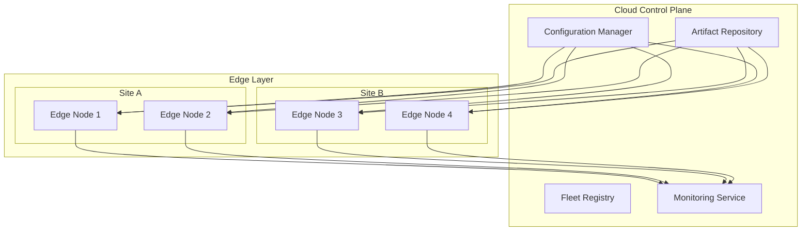
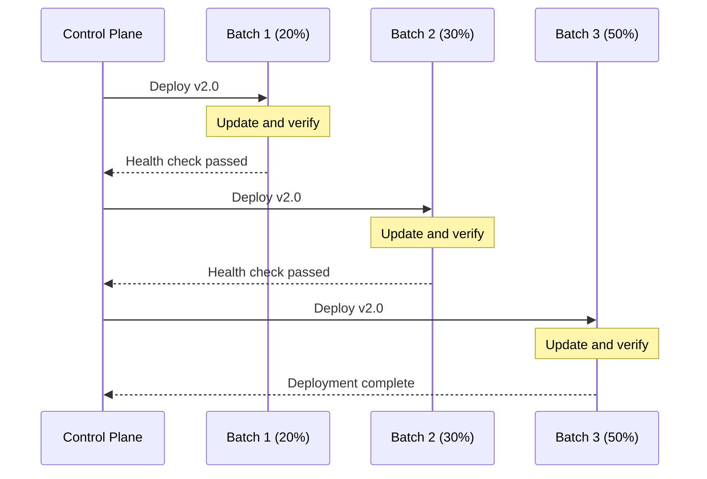
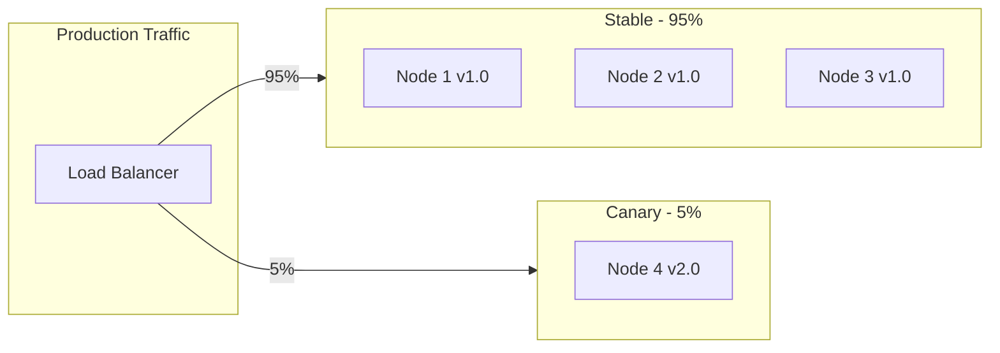
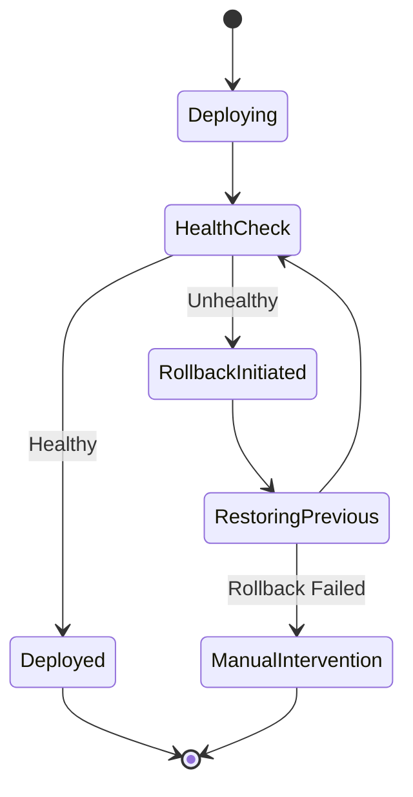

# How to Implement Edge Deployment

Author: [nawazdhandala](https://github.com/nawazdhandala)

Tags: Edge Computing, Deployment, IoT, Distributed Systems

Description: Learn to implement edge deployment strategies with container orchestration, fleet management, and rolling updates for distributed edge infrastructure.

---

Edge deployment brings computation closer to data sources, reducing latency and bandwidth costs while improving reliability. However, managing deployments across hundreds or thousands of edge nodes presents unique challenges. This guide covers practical strategies for implementing robust edge deployment pipelines.

## Understanding Edge Deployment Architecture

Before diving into implementation, let us understand the typical architecture of an edge deployment system.



The architecture consists of a centralized control plane that manages configuration and artifact distribution, while edge nodes operate semi-autonomously and report health metrics back to the cloud.

## Setting Up Fleet Management

Fleet management is the foundation of edge deployment. It allows you to organize, track, and manage edge devices at scale.

### Device Registration and Discovery

First, implement a device registration service that edge nodes use to announce themselves.

```python
# fleet_manager.py
from dataclasses import dataclass, field
from datetime import datetime
from typing import Dict, List, Optional
import hashlib
import json

@dataclass
class EdgeDevice:
    device_id: str
    hostname: str
    location: str
    capabilities: List[str]
    labels: Dict[str, str]
    registered_at: datetime
    last_heartbeat: datetime
    current_version: str
    status: str = "unknown"

class FleetManager:
    def __init__(self):
        self.devices: Dict[str, EdgeDevice] = {}
        self.device_groups: Dict[str, List[str]] = {}

    def register_device(self, registration_payload: dict) -> EdgeDevice:
        """Register a new edge device with the fleet."""
        device_id = self._generate_device_id(registration_payload)

        device = EdgeDevice(
            device_id=device_id,
            hostname=registration_payload["hostname"],
            location=registration_payload["location"],
            capabilities=registration_payload.get("capabilities", []),
            labels=registration_payload.get("labels", {}),
            registered_at=datetime.utcnow(),
            last_heartbeat=datetime.utcnow(),
            current_version=registration_payload.get("version", "unknown"),
            status="registered"
        )

        self.devices[device_id] = device
        self._assign_to_groups(device)

        return device

    def _generate_device_id(self, payload: dict) -> str:
        """Generate a unique device ID based on hardware identifiers."""
        identifier = f"{payload['hostname']}-{payload.get('mac_address', '')}"
        return hashlib.sha256(identifier.encode()).hexdigest()[:16]

    def _assign_to_groups(self, device: EdgeDevice) -> None:
        """Automatically assign device to groups based on labels."""
        for label_key, label_value in device.labels.items():
            group_name = f"{label_key}:{label_value}"
            if group_name not in self.device_groups:
                self.device_groups[group_name] = []
            self.device_groups[group_name].append(device.device_id)

    def get_devices_by_selector(self, selector: Dict[str, str]) -> List[EdgeDevice]:
        """Query devices matching label selectors."""
        matching_devices = []
        for device in self.devices.values():
            if all(device.labels.get(k) == v for k, v in selector.items()):
                matching_devices.append(device)
        return matching_devices

    def update_heartbeat(self, device_id: str, health_data: dict) -> None:
        """Update device heartbeat and health status."""
        if device_id in self.devices:
            device = self.devices[device_id]
            device.last_heartbeat = datetime.utcnow()
            device.status = health_data.get("status", "healthy")
            device.current_version = health_data.get("version", device.current_version)
```

This fleet manager provides the foundation for tracking devices, organizing them into groups, and querying them using label selectors - similar to how Kubernetes manages pods.

### Edge Agent Implementation

Each edge device runs an agent that communicates with the control plane.

```python
# edge_agent.py
import asyncio
import aiohttp
import subprocess
import json
from pathlib import Path
from typing import Optional

class EdgeAgent:
    def __init__(self, config_path: str):
        self.config = self._load_config(config_path)
        self.control_plane_url = self.config["control_plane_url"]
        self.device_info = self._gather_device_info()
        self.current_deployment: Optional[dict] = None

    def _load_config(self, path: str) -> dict:
        with open(path) as f:
            return json.load(f)

    def _gather_device_info(self) -> dict:
        """Collect device information for registration."""
        return {
            "hostname": subprocess.getoutput("hostname"),
            "mac_address": self._get_mac_address(),
            "location": self.config.get("location", "unknown"),
            "capabilities": self._detect_capabilities(),
            "labels": self.config.get("labels", {}),
            "version": self._get_current_version()
        }

    def _get_mac_address(self) -> str:
        """Get primary network interface MAC address."""
        try:
            with open("/sys/class/net/eth0/address") as f:
                return f.read().strip()
        except FileNotFoundError:
            return "unknown"

    def _detect_capabilities(self) -> list:
        """Detect hardware capabilities of the edge device."""
        capabilities = []

        # Check for GPU
        if Path("/dev/nvidia0").exists():
            capabilities.append("gpu")

        # Check for TPU
        if Path("/dev/apex_0").exists():
            capabilities.append("tpu")

        # Check available memory
        with open("/proc/meminfo") as f:
            for line in f:
                if line.startswith("MemTotal"):
                    mem_kb = int(line.split()[1])
                    if mem_kb > 8000000:
                        capabilities.append("high-memory")

        return capabilities

    def _get_current_version(self) -> str:
        """Get the currently deployed application version."""
        version_file = Path("/opt/edge-app/version")
        if version_file.exists():
            return version_file.read_text().strip()
        return "none"

    async def register(self) -> str:
        """Register this device with the control plane."""
        async with aiohttp.ClientSession() as session:
            async with session.post(
                f"{self.control_plane_url}/api/v1/devices/register",
                json=self.device_info
            ) as response:
                result = await response.json()
                return result["device_id"]

    async def heartbeat_loop(self, device_id: str):
        """Send periodic heartbeats to the control plane."""
        while True:
            health_data = await self._collect_health_metrics()

            async with aiohttp.ClientSession() as session:
                await session.post(
                    f"{self.control_plane_url}/api/v1/devices/{device_id}/heartbeat",
                    json=health_data
                )

            await asyncio.sleep(30)  # Heartbeat every 30 seconds

    async def _collect_health_metrics(self) -> dict:
        """Collect current health metrics."""
        return {
            "status": "healthy",
            "version": self._get_current_version(),
            "cpu_percent": self._get_cpu_usage(),
            "memory_percent": self._get_memory_usage(),
            "disk_percent": self._get_disk_usage()
        }

    async def watch_deployments(self, device_id: str):
        """Watch for new deployment instructions."""
        async with aiohttp.ClientSession() as session:
            while True:
                async with session.get(
                    f"{self.control_plane_url}/api/v1/devices/{device_id}/deployment"
                ) as response:
                    deployment = await response.json()

                    if deployment != self.current_deployment:
                        await self.apply_deployment(deployment)
                        self.current_deployment = deployment

                await asyncio.sleep(10)  # Poll every 10 seconds
```

## Deployment Strategies for Edge

Edge deployments require careful orchestration to maintain service availability across distributed nodes.

### Rolling Updates

Rolling updates gradually replace instances across your fleet, minimizing service disruption.



Here is the implementation for a rolling update strategy:

```python
# deployment_strategies.py
from dataclasses import dataclass
from typing import List, Optional, Callable
from enum import Enum
import asyncio

class DeploymentStatus(Enum):
    PENDING = "pending"
    IN_PROGRESS = "in_progress"
    COMPLETED = "completed"
    FAILED = "failed"
    ROLLED_BACK = "rolled_back"

@dataclass
class DeploymentConfig:
    name: str
    version: str
    artifact_url: str
    target_selector: dict
    strategy: str  # "rolling", "canary", "blue-green"
    max_unavailable: int = 1
    max_surge: int = 1
    batch_size_percent: int = 20
    health_check_timeout: int = 300
    rollback_on_failure: bool = True

class RollingUpdateStrategy:
    def __init__(self, fleet_manager, deployment_executor):
        self.fleet_manager = fleet_manager
        self.deployment_executor = deployment_executor

    async def execute(self, config: DeploymentConfig) -> DeploymentStatus:
        """Execute a rolling update deployment."""
        target_devices = self.fleet_manager.get_devices_by_selector(
            config.target_selector
        )

        if not target_devices:
            raise ValueError("No devices match the target selector")

        # Calculate batch sizes
        batches = self._create_batches(target_devices, config.batch_size_percent)

        print(f"Starting rolling update to {len(target_devices)} devices in {len(batches)} batches")

        for batch_num, batch in enumerate(batches, 1):
            print(f"Deploying batch {batch_num}/{len(batches)} ({len(batch)} devices)")

            # Deploy to batch
            results = await self._deploy_batch(batch, config)

            # Verify health
            healthy = await self._verify_batch_health(batch, config)

            if not healthy:
                if config.rollback_on_failure:
                    await self._rollback(target_devices[:batch_num * len(batch)], config)
                    return DeploymentStatus.ROLLED_BACK
                return DeploymentStatus.FAILED

            print(f"Batch {batch_num} healthy, continuing...")

        return DeploymentStatus.COMPLETED

    def _create_batches(self, devices: list, batch_percent: int) -> List[list]:
        """Divide devices into deployment batches."""
        batch_size = max(1, len(devices) * batch_percent // 100)
        return [devices[i:i + batch_size] for i in range(0, len(devices), batch_size)]

    async def _deploy_batch(self, batch: list, config: DeploymentConfig) -> list:
        """Deploy to a batch of devices concurrently."""
        tasks = [
            self.deployment_executor.deploy_to_device(device, config)
            for device in batch
        ]
        return await asyncio.gather(*tasks, return_exceptions=True)

    async def _verify_batch_health(self, batch: list, config: DeploymentConfig) -> bool:
        """Verify all devices in batch are healthy after deployment."""
        timeout = config.health_check_timeout
        check_interval = 10
        elapsed = 0

        while elapsed < timeout:
            all_healthy = True
            for device in batch:
                health = await self.deployment_executor.check_health(device)
                if health["status"] != "healthy":
                    all_healthy = False
                    break

            if all_healthy:
                return True

            await asyncio.sleep(check_interval)
            elapsed += check_interval

        return False

    async def _rollback(self, devices: list, config: DeploymentConfig) -> None:
        """Rollback devices to previous version."""
        print(f"Rolling back {len(devices)} devices...")
        for device in devices:
            await self.deployment_executor.rollback_device(device)
```

### Canary Deployments

Canary deployments test new versions on a small subset before full rollout.



```python
# canary_strategy.py
from dataclasses import dataclass
from typing import List, Dict
import asyncio

@dataclass
class CanaryConfig:
    initial_percent: int = 5
    increment_percent: int = 10
    max_percent: int = 100
    evaluation_period: int = 300  # seconds
    success_threshold: float = 0.99  # 99% success rate required
    error_rate_threshold: float = 0.01

class CanaryDeploymentStrategy:
    def __init__(self, fleet_manager, metrics_collector, deployment_executor):
        self.fleet_manager = fleet_manager
        self.metrics = metrics_collector
        self.executor = deployment_executor

    async def execute(self, config: DeploymentConfig) -> DeploymentStatus:
        """Execute a canary deployment with automatic promotion."""
        all_devices = self.fleet_manager.get_devices_by_selector(config.target_selector)

        canary_percent = config.canary_config.initial_percent

        while canary_percent <= config.canary_config.max_percent:
            # Calculate canary size
            canary_count = max(1, len(all_devices) * canary_percent // 100)
            canary_devices = all_devices[:canary_count]

            print(f"Deploying canary to {canary_percent}% ({canary_count} devices)")

            # Deploy to canary devices
            await self._deploy_to_devices(canary_devices, config)

            # Evaluate canary health
            is_healthy = await self._evaluate_canary(
                canary_devices,
                config.canary_config.evaluation_period
            )

            if not is_healthy:
                print("Canary evaluation failed, rolling back...")
                await self._rollback_canary(canary_devices)
                return DeploymentStatus.ROLLED_BACK

            print(f"Canary at {canary_percent}% passed evaluation")
            canary_percent += config.canary_config.increment_percent

        return DeploymentStatus.COMPLETED

    async def _evaluate_canary(self, devices: list, duration: int) -> bool:
        """Evaluate canary health over a period of time."""
        start_time = asyncio.get_event_loop().time()

        while asyncio.get_event_loop().time() - start_time < duration:
            metrics = await self._collect_canary_metrics(devices)

            # Check error rate
            if metrics["error_rate"] > self.config.error_rate_threshold:
                print(f"Error rate {metrics['error_rate']:.2%} exceeds threshold")
                return False

            # Check success rate
            if metrics["success_rate"] < self.config.success_threshold:
                print(f"Success rate {metrics['success_rate']:.2%} below threshold")
                return False

            # Check latency
            if metrics["p99_latency"] > metrics["baseline_p99"] * 1.5:
                print(f"Latency regression detected")
                return False

            await asyncio.sleep(30)

        return True

    async def _collect_canary_metrics(self, devices: list) -> dict:
        """Collect metrics from canary devices."""
        total_requests = 0
        total_errors = 0
        latencies = []

        for device in devices:
            device_metrics = await self.metrics.get_device_metrics(device.device_id)
            total_requests += device_metrics["request_count"]
            total_errors += device_metrics["error_count"]
            latencies.extend(device_metrics["latencies"])

        latencies.sort()
        p99_index = int(len(latencies) * 0.99)

        return {
            "error_rate": total_errors / max(total_requests, 1),
            "success_rate": 1 - (total_errors / max(total_requests, 1)),
            "p99_latency": latencies[p99_index] if latencies else 0,
            "baseline_p99": await self.metrics.get_baseline_p99()
        }
```

## Container Orchestration at the Edge

Containers provide consistency across heterogeneous edge environments. Here is how to implement container-based edge deployments.

### Edge Container Runtime

```python
# container_runtime.py
import subprocess
import json
from typing import Dict, Optional, List
from dataclasses import dataclass

@dataclass
class ContainerSpec:
    image: str
    name: str
    ports: Dict[int, int]
    environment: Dict[str, str]
    volumes: Dict[str, str]
    resources: Dict[str, str]
    restart_policy: str = "unless-stopped"
    health_check: Optional[dict] = None

class EdgeContainerRuntime:
    """Manages containers on edge devices using Docker or containerd."""

    def __init__(self, runtime: str = "docker"):
        self.runtime = runtime
        self._verify_runtime()

    def _verify_runtime(self):
        """Verify container runtime is available."""
        try:
            subprocess.run(
                [self.runtime, "version"],
                capture_output=True,
                check=True
            )
        except (subprocess.CalledProcessError, FileNotFoundError):
            raise RuntimeError(f"Container runtime '{self.runtime}' not available")

    def pull_image(self, image: str, registry_auth: Optional[dict] = None) -> bool:
        """Pull container image from registry."""
        if registry_auth:
            self._configure_registry_auth(registry_auth)

        result = subprocess.run(
            [self.runtime, "pull", image],
            capture_output=True,
            text=True
        )
        return result.returncode == 0

    def deploy_container(self, spec: ContainerSpec) -> str:
        """Deploy a container based on specification."""
        # Stop existing container if running
        self.stop_container(spec.name)

        # Build command
        cmd = [self.runtime, "run", "-d", "--name", spec.name]

        # Add restart policy
        cmd.extend(["--restart", spec.restart_policy])

        # Add port mappings
        for host_port, container_port in spec.ports.items():
            cmd.extend(["-p", f"{host_port}:{container_port}"])

        # Add environment variables
        for key, value in spec.environment.items():
            cmd.extend(["-e", f"{key}={value}"])

        # Add volume mounts
        for host_path, container_path in spec.volumes.items():
            cmd.extend(["-v", f"{host_path}:{container_path}"])

        # Add resource limits
        if "memory" in spec.resources:
            cmd.extend(["--memory", spec.resources["memory"]])
        if "cpus" in spec.resources:
            cmd.extend(["--cpus", spec.resources["cpus"]])

        # Add health check
        if spec.health_check:
            cmd.extend([
                "--health-cmd", spec.health_check["command"],
                "--health-interval", spec.health_check.get("interval", "30s"),
                "--health-timeout", spec.health_check.get("timeout", "10s"),
                "--health-retries", str(spec.health_check.get("retries", 3))
            ])

        # Add image
        cmd.append(spec.image)

        result = subprocess.run(cmd, capture_output=True, text=True)

        if result.returncode != 0:
            raise RuntimeError(f"Failed to deploy container: {result.stderr}")

        return result.stdout.strip()  # Container ID

    def stop_container(self, name: str) -> bool:
        """Stop and remove a container."""
        subprocess.run([self.runtime, "stop", name], capture_output=True)
        subprocess.run([self.runtime, "rm", name], capture_output=True)
        return True

    def get_container_health(self, name: str) -> dict:
        """Get container health status."""
        result = subprocess.run(
            [self.runtime, "inspect", name],
            capture_output=True,
            text=True
        )

        if result.returncode != 0:
            return {"status": "not_found"}

        inspect_data = json.loads(result.stdout)[0]
        state = inspect_data["State"]

        return {
            "status": "healthy" if state["Running"] else "stopped",
            "running": state["Running"],
            "health": state.get("Health", {}).get("Status", "unknown"),
            "started_at": state["StartedAt"],
            "exit_code": state.get("ExitCode", 0)
        }

    def get_container_logs(self, name: str, lines: int = 100) -> str:
        """Retrieve container logs."""
        result = subprocess.run(
            [self.runtime, "logs", "--tail", str(lines), name],
            capture_output=True,
            text=True
        )
        return result.stdout + result.stderr
```

### Kubernetes at the Edge with K3s

For more complex deployments, lightweight Kubernetes distributions like K3s provide powerful orchestration.

```yaml
# edge-deployment.yaml
apiVersion: apps/v1
kind: Deployment
metadata:
  name: edge-application
  namespace: edge-workloads
spec:
  replicas: 1
  selector:
    matchLabels:
      app: edge-application
  strategy:
    type: RollingUpdate
    rollingUpdate:
      maxUnavailable: 0
      maxSurge: 1
  template:
    metadata:
      labels:
        app: edge-application
    spec:
      containers:
      - name: app
        image: registry.example.com/edge-app:v2.0.0
        ports:
        - containerPort: 8080
        resources:
          requests:
            memory: "128Mi"
            cpu: "100m"
          limits:
            memory: "256Mi"
            cpu: "500m"
        livenessProbe:
          httpGet:
            path: /health
            port: 8080
          initialDelaySeconds: 10
          periodSeconds: 30
        readinessProbe:
          httpGet:
            path: /ready
            port: 8080
          initialDelaySeconds: 5
          periodSeconds: 10
        env:
        - name: NODE_LOCATION
          valueFrom:
            fieldRef:
              fieldPath: spec.nodeName
      tolerations:
      - key: "edge-node"
        operator: "Exists"
        effect: "NoSchedule"
      nodeSelector:
        node-type: edge
```

## Implementing Rollbacks

Robust rollback mechanisms are essential for maintaining service reliability.



```python
# rollback_manager.py
from dataclasses import dataclass, field
from datetime import datetime
from typing import List, Optional, Dict
import json
from pathlib import Path

@dataclass
class DeploymentSnapshot:
    version: str
    timestamp: datetime
    artifact_url: str
    config_hash: str
    container_spec: dict

@dataclass
class RollbackState:
    max_history: int = 5
    snapshots: List[DeploymentSnapshot] = field(default_factory=list)

class RollbackManager:
    """Manages deployment history and rollback operations."""

    def __init__(self, state_dir: str = "/var/lib/edge-deploy"):
        self.state_dir = Path(state_dir)
        self.state_dir.mkdir(parents=True, exist_ok=True)
        self.state_file = self.state_dir / "rollback_state.json"
        self.state = self._load_state()

    def _load_state(self) -> RollbackState:
        """Load rollback state from disk."""
        if self.state_file.exists():
            with open(self.state_file) as f:
                data = json.load(f)
                snapshots = [
                    DeploymentSnapshot(
                        version=s["version"],
                        timestamp=datetime.fromisoformat(s["timestamp"]),
                        artifact_url=s["artifact_url"],
                        config_hash=s["config_hash"],
                        container_spec=s["container_spec"]
                    )
                    for s in data.get("snapshots", [])
                ]
                return RollbackState(
                    max_history=data.get("max_history", 5),
                    snapshots=snapshots
                )
        return RollbackState()

    def _save_state(self) -> None:
        """Persist rollback state to disk."""
        data = {
            "max_history": self.state.max_history,
            "snapshots": [
                {
                    "version": s.version,
                    "timestamp": s.timestamp.isoformat(),
                    "artifact_url": s.artifact_url,
                    "config_hash": s.config_hash,
                    "container_spec": s.container_spec
                }
                for s in self.state.snapshots
            ]
        }
        with open(self.state_file, "w") as f:
            json.dump(data, f, indent=2)

    def record_deployment(self, deployment: DeploymentConfig, container_spec: dict) -> None:
        """Record a successful deployment for potential rollback."""
        snapshot = DeploymentSnapshot(
            version=deployment.version,
            timestamp=datetime.utcnow(),
            artifact_url=deployment.artifact_url,
            config_hash=self._hash_config(deployment),
            container_spec=container_spec
        )

        self.state.snapshots.insert(0, snapshot)

        # Trim history
        if len(self.state.snapshots) > self.state.max_history:
            self.state.snapshots = self.state.snapshots[:self.state.max_history]

        self._save_state()

    def get_previous_version(self) -> Optional[DeploymentSnapshot]:
        """Get the previous deployment snapshot."""
        if len(self.state.snapshots) > 1:
            return self.state.snapshots[1]
        return None

    def get_version(self, version: str) -> Optional[DeploymentSnapshot]:
        """Get a specific version from history."""
        for snapshot in self.state.snapshots:
            if snapshot.version == version:
                return snapshot
        return None

    async def execute_rollback(
        self,
        container_runtime: EdgeContainerRuntime,
        target_version: Optional[str] = None
    ) -> bool:
        """Execute a rollback to a previous version."""
        if target_version:
            snapshot = self.get_version(target_version)
        else:
            snapshot = self.get_previous_version()

        if not snapshot:
            raise ValueError("No rollback target available")

        print(f"Rolling back to version {snapshot.version}")

        # Pull the previous image
        image = snapshot.container_spec["image"]
        if not container_runtime.pull_image(image):
            raise RuntimeError(f"Failed to pull rollback image: {image}")

        # Create container spec from snapshot
        spec = ContainerSpec(**snapshot.container_spec)

        # Deploy the previous version
        container_id = container_runtime.deploy_container(spec)

        print(f"Rollback complete. Container ID: {container_id}")
        return True

    def _hash_config(self, config: DeploymentConfig) -> str:
        """Generate a hash of deployment configuration."""
        import hashlib
        config_str = json.dumps({
            "version": config.version,
            "artifact_url": config.artifact_url,
            "target_selector": config.target_selector
        }, sort_keys=True)
        return hashlib.sha256(config_str.encode()).hexdigest()[:16]
```

## Health Monitoring and Alerting

Continuous monitoring ensures early detection of issues across your edge fleet.

### Health Check Implementation

```python
# health_monitor.py
from dataclasses import dataclass
from typing import Dict, List, Callable, Optional
from datetime import datetime, timedelta
import asyncio
import aiohttp

@dataclass
class HealthCheckConfig:
    endpoint: str
    interval_seconds: int = 30
    timeout_seconds: int = 10
    healthy_threshold: int = 2
    unhealthy_threshold: int = 3

@dataclass
class DeviceHealthStatus:
    device_id: str
    status: str  # healthy, unhealthy, unknown
    last_check: datetime
    consecutive_failures: int
    consecutive_successes: int
    metrics: Dict[str, float]

class HealthMonitor:
    """Monitors health of edge devices and applications."""

    def __init__(self):
        self.health_status: Dict[str, DeviceHealthStatus] = {}
        self.alert_handlers: List[Callable] = []
        self.check_config = HealthCheckConfig(endpoint="/health")

    def register_alert_handler(self, handler: Callable) -> None:
        """Register a handler for health alerts."""
        self.alert_handlers.append(handler)

    async def start_monitoring(self, devices: List[EdgeDevice]) -> None:
        """Start health monitoring for all devices."""
        tasks = [self._monitor_device(device) for device in devices]
        await asyncio.gather(*tasks)

    async def _monitor_device(self, device: EdgeDevice) -> None:
        """Monitor a single device continuously."""
        while True:
            health_result = await self._check_device_health(device)
            await self._update_health_status(device, health_result)
            await asyncio.sleep(self.check_config.interval_seconds)

    async def _check_device_health(self, device: EdgeDevice) -> dict:
        """Perform health check on a device."""
        url = f"http://{device.hostname}:8080{self.check_config.endpoint}"

        try:
            async with aiohttp.ClientSession() as session:
                async with session.get(
                    url,
                    timeout=aiohttp.ClientTimeout(total=self.check_config.timeout_seconds)
                ) as response:
                    if response.status == 200:
                        data = await response.json()
                        return {
                            "success": True,
                            "status_code": 200,
                            "metrics": data.get("metrics", {}),
                            "version": data.get("version", "unknown")
                        }
                    return {"success": False, "status_code": response.status}
        except asyncio.TimeoutError:
            return {"success": False, "error": "timeout"}
        except aiohttp.ClientError as e:
            return {"success": False, "error": str(e)}

    async def _update_health_status(self, device: EdgeDevice, result: dict) -> None:
        """Update device health status and trigger alerts if needed."""
        device_id = device.device_id

        if device_id not in self.health_status:
            self.health_status[device_id] = DeviceHealthStatus(
                device_id=device_id,
                status="unknown",
                last_check=datetime.utcnow(),
                consecutive_failures=0,
                consecutive_successes=0,
                metrics={}
            )

        status = self.health_status[device_id]
        status.last_check = datetime.utcnow()

        if result["success"]:
            status.consecutive_successes += 1
            status.consecutive_failures = 0
            status.metrics = result.get("metrics", {})

            if status.consecutive_successes >= self.check_config.healthy_threshold:
                if status.status != "healthy":
                    status.status = "healthy"
                    await self._trigger_alert(device, "recovery", status)
        else:
            status.consecutive_failures += 1
            status.consecutive_successes = 0

            if status.consecutive_failures >= self.check_config.unhealthy_threshold:
                if status.status != "unhealthy":
                    status.status = "unhealthy"
                    await self._trigger_alert(device, "failure", status)

    async def _trigger_alert(
        self,
        device: EdgeDevice,
        alert_type: str,
        status: DeviceHealthStatus
    ) -> None:
        """Trigger alerts to registered handlers."""
        alert = {
            "type": alert_type,
            "device_id": device.device_id,
            "hostname": device.hostname,
            "location": device.location,
            "status": status.status,
            "timestamp": datetime.utcnow().isoformat(),
            "consecutive_failures": status.consecutive_failures
        }

        for handler in self.alert_handlers:
            try:
                await handler(alert)
            except Exception as e:
                print(f"Alert handler error: {e}")

    def get_fleet_health_summary(self) -> dict:
        """Get a summary of fleet health status."""
        total = len(self.health_status)
        healthy = sum(1 for s in self.health_status.values() if s.status == "healthy")
        unhealthy = sum(1 for s in self.health_status.values() if s.status == "unhealthy")
        unknown = sum(1 for s in self.health_status.values() if s.status == "unknown")

        return {
            "total_devices": total,
            "healthy": healthy,
            "unhealthy": unhealthy,
            "unknown": unknown,
            "health_percentage": (healthy / total * 100) if total > 0 else 0
        }
```

### Metrics Collection and Dashboard

```python
# metrics_collector.py
from dataclasses import dataclass
from typing import Dict, List
from datetime import datetime, timedelta
import asyncio

@dataclass
class MetricPoint:
    timestamp: datetime
    value: float
    labels: Dict[str, str]

class MetricsCollector:
    """Collects and aggregates metrics from edge devices."""

    def __init__(self, retention_hours: int = 24):
        self.metrics: Dict[str, List[MetricPoint]] = {}
        self.retention = timedelta(hours=retention_hours)

    def record_metric(
        self,
        name: str,
        value: float,
        labels: Dict[str, str] = None
    ) -> None:
        """Record a metric data point."""
        if name not in self.metrics:
            self.metrics[name] = []

        point = MetricPoint(
            timestamp=datetime.utcnow(),
            value=value,
            labels=labels or {}
        )

        self.metrics[name].append(point)
        self._cleanup_old_metrics(name)

    def _cleanup_old_metrics(self, name: str) -> None:
        """Remove metrics older than retention period."""
        cutoff = datetime.utcnow() - self.retention
        self.metrics[name] = [
            p for p in self.metrics[name]
            if p.timestamp > cutoff
        ]

    def get_metric_summary(self, name: str, duration_minutes: int = 60) -> dict:
        """Get summary statistics for a metric."""
        if name not in self.metrics:
            return {}

        cutoff = datetime.utcnow() - timedelta(minutes=duration_minutes)
        recent_points = [
            p for p in self.metrics[name]
            if p.timestamp > cutoff
        ]

        if not recent_points:
            return {}

        values = [p.value for p in recent_points]
        values.sort()

        return {
            "count": len(values),
            "min": min(values),
            "max": max(values),
            "avg": sum(values) / len(values),
            "p50": values[len(values) // 2],
            "p95": values[int(len(values) * 0.95)],
            "p99": values[int(len(values) * 0.99)]
        }

    def get_deployment_metrics(self, deployment_id: str) -> dict:
        """Get metrics specific to a deployment."""
        return {
            "success_rate": self.get_metric_summary(
                f"deployment.{deployment_id}.success_rate"
            ),
            "latency": self.get_metric_summary(
                f"deployment.{deployment_id}.latency"
            ),
            "error_count": self.get_metric_summary(
                f"deployment.{deployment_id}.errors"
            ),
            "throughput": self.get_metric_summary(
                f"deployment.{deployment_id}.throughput"
            )
        }
```

## Putting It All Together

Here is a complete example that ties all the components together.

```python
# main.py
import asyncio
from fleet_manager import FleetManager
from deployment_strategies import RollingUpdateStrategy, DeploymentConfig
from container_runtime import EdgeContainerRuntime, ContainerSpec
from rollback_manager import RollbackManager
from health_monitor import HealthMonitor
from metrics_collector import MetricsCollector

async def deploy_to_edge_fleet():
    # Initialize components
    fleet_manager = FleetManager()
    container_runtime = EdgeContainerRuntime()
    rollback_manager = RollbackManager()
    health_monitor = HealthMonitor()
    metrics = MetricsCollector()

    # Define deployment configuration
    deployment_config = DeploymentConfig(
        name="edge-app-v2",
        version="2.0.0",
        artifact_url="registry.example.com/edge-app:v2.0.0",
        target_selector={"environment": "production", "region": "us-west"},
        strategy="rolling",
        batch_size_percent=20,
        health_check_timeout=300,
        rollback_on_failure=True
    )

    # Define container specification
    container_spec = ContainerSpec(
        image="registry.example.com/edge-app:v2.0.0",
        name="edge-app",
        ports={8080: 8080},
        environment={
            "LOG_LEVEL": "info",
            "METRICS_ENABLED": "true"
        },
        volumes={
            "/var/data/edge-app": "/app/data"
        },
        resources={
            "memory": "256m",
            "cpus": "0.5"
        },
        health_check={
            "command": "curl -f http://localhost:8080/health || exit 1",
            "interval": "30s",
            "timeout": "10s",
            "retries": 3
        }
    )

    # Create deployment executor
    class DeploymentExecutor:
        def __init__(self, runtime, rollback_mgr):
            self.runtime = runtime
            self.rollback_mgr = rollback_mgr

        async def deploy_to_device(self, device, config):
            print(f"Deploying to {device.hostname}...")
            # Pull image
            self.runtime.pull_image(config.artifact_url)
            # Deploy container
            container_id = self.runtime.deploy_container(container_spec)
            # Record for rollback
            self.rollback_mgr.record_deployment(config, container_spec.__dict__)
            return container_id

        async def check_health(self, device):
            return self.runtime.get_container_health(container_spec.name)

        async def rollback_device(self, device):
            await self.rollback_mgr.execute_rollback(self.runtime)

    executor = DeploymentExecutor(container_runtime, rollback_manager)

    # Execute rolling update
    strategy = RollingUpdateStrategy(fleet_manager, executor)

    # Register alert handler
    async def alert_handler(alert):
        print(f"ALERT: {alert['type']} on {alert['hostname']}")

    health_monitor.register_alert_handler(alert_handler)

    # Start deployment
    print("Starting edge deployment...")
    result = await strategy.execute(deployment_config)

    print(f"Deployment result: {result}")

    # Print fleet health summary
    summary = health_monitor.get_fleet_health_summary()
    print(f"Fleet health: {summary['health_percentage']:.1f}% healthy")

if __name__ == "__main__":
    asyncio.run(deploy_to_edge_fleet())
```

## Best Practices for Edge Deployment

1. **Design for Offline Operation**: Edge nodes may lose connectivity. Ensure applications can function independently and sync when reconnected.

2. **Implement Gradual Rollouts**: Never deploy to all edge nodes simultaneously. Use progressive rollouts to catch issues early.

3. **Maintain Version History**: Keep multiple previous versions available for quick rollbacks.

4. **Use Health-Based Deployment Gates**: Only proceed with deployment batches when previous batches are confirmed healthy.

5. **Implement Circuit Breakers**: Automatically halt deployments if failure rates exceed thresholds.

6. **Test Rollback Procedures**: Regularly test that rollbacks work correctly before you need them in an emergency.

7. **Monitor Resource Utilization**: Edge devices often have limited resources. Monitor CPU, memory, and disk usage closely.

8. **Secure the Deployment Pipeline**: Use signed artifacts and encrypted communications between control plane and edge nodes.

## Conclusion

Implementing edge deployment requires careful planning around fleet management, deployment strategies, and health monitoring. By using the patterns and code examples in this guide, you can build a robust deployment pipeline that handles the unique challenges of distributed edge infrastructure.

The key is to start simple, with basic rolling updates and health checks, then gradually add more sophisticated features like canary deployments and automated rollbacks as your fleet grows. Remember that reliability at the edge depends on good observability - invest in monitoring and alerting early.

With proper tooling and processes in place, you can confidently deploy updates to thousands of edge nodes while maintaining high availability and quick recovery from failures.
