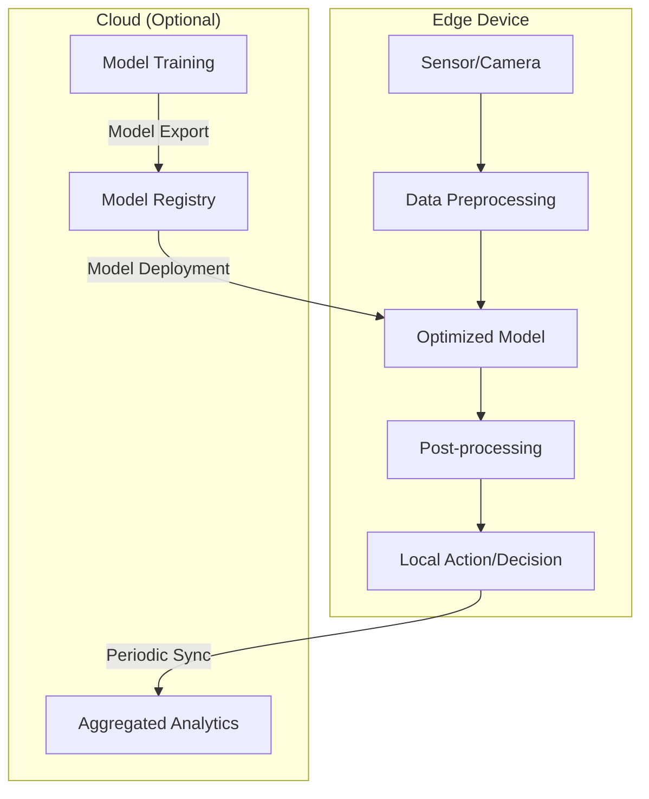
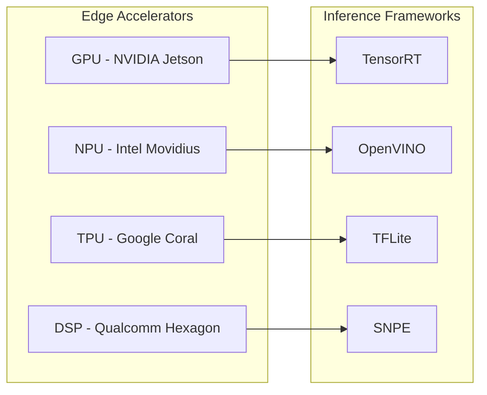
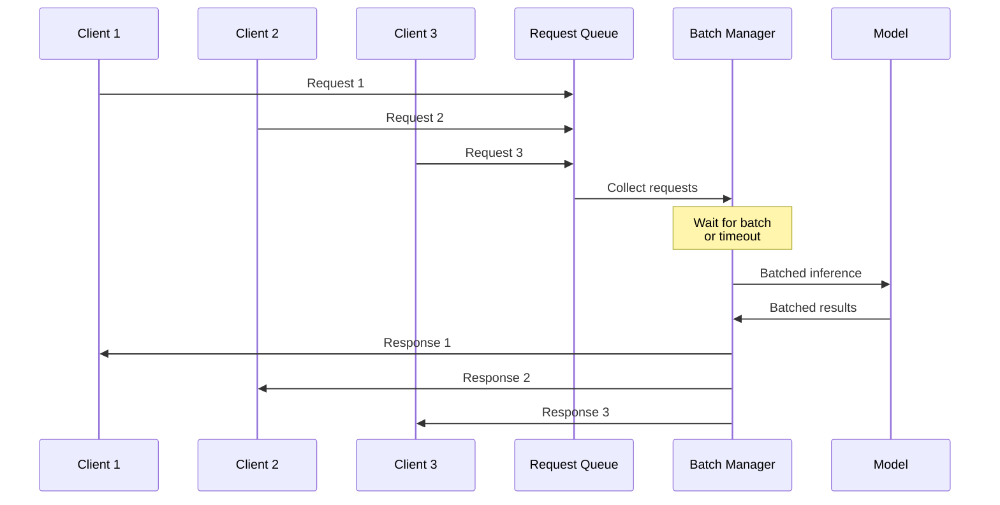
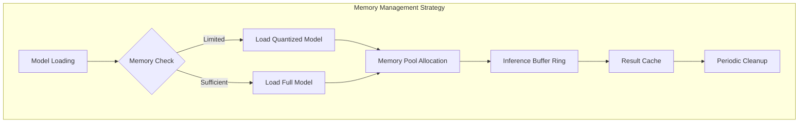
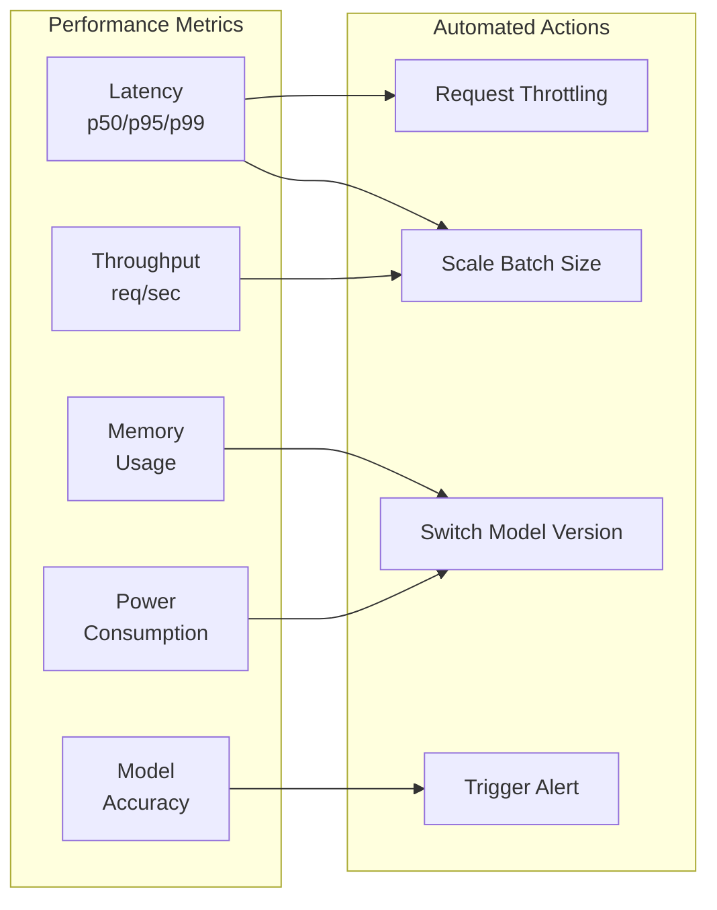

# How to Create Edge Inference

Author: [nawazdhandala](https://github.com/nawazdhandala)

Tags: Edge Computing, ML Inference, Edge AI, Model Optimization

Description: Learn to implement edge inference with model optimization, hardware acceleration, and batch processing for low-latency AI at the edge.

---

Edge inference brings machine learning models directly to where data is generated - on devices at the network edge. This approach eliminates round-trip latency to cloud servers, reduces bandwidth costs, and enables real-time decision making in applications ranging from autonomous vehicles to industrial IoT sensors.

In this guide, we will walk through the complete process of creating edge inference systems, covering model optimization, hardware acceleration, batch processing, memory management, and performance monitoring.

## Understanding Edge Inference Architecture

Before diving into implementation, let us understand how edge inference differs from traditional cloud-based inference.



Edge inference keeps the critical inference path local while optionally syncing with cloud services for model updates and analytics aggregation.

## Model Optimization for Edge Deployment

Edge devices have limited compute, memory, and power budgets. Model optimization is essential to meet these constraints while maintaining acceptable accuracy.

### Quantization

Quantization reduces model precision from 32-bit floating point to lower bit-widths like INT8 or even INT4.

```python
import tensorflow as tf

def quantize_model_for_edge(saved_model_path: str, output_path: str) -> None:
    """
    Convert a TensorFlow model to TFLite with INT8 quantization.

    Args:
        saved_model_path: Path to the saved TensorFlow model
        output_path: Path to save the quantized TFLite model
    """
    # Create converter from saved model
    converter = tf.lite.TFLiteConverter.from_saved_model(saved_model_path)

    # Enable INT8 quantization
    converter.optimizations = [tf.lite.Optimize.DEFAULT]

    # For full integer quantization, provide representative dataset
    def representative_dataset():
        """Generate representative samples for calibration."""
        for _ in range(100):
            # Replace with actual data samples from your dataset
            sample = tf.random.normal([1, 224, 224, 3])
            yield [sample]

    converter.representative_dataset = representative_dataset
    converter.target_spec.supported_ops = [tf.lite.OpsSet.TFLITE_BUILTINS_INT8]
    converter.inference_input_type = tf.int8
    converter.inference_output_type = tf.int8

    # Convert and save
    quantized_model = converter.convert()

    with open(output_path, 'wb') as f:
        f.write(quantized_model)

    print(f"Quantized model saved to {output_path}")
    print(f"Model size: {len(quantized_model) / 1024 / 1024:.2f} MB")


# Example usage
quantize_model_for_edge(
    saved_model_path="./models/resnet50",
    output_path="./models/resnet50_int8.tflite"
)
```

Quantization typically reduces model size by 4x and improves inference speed by 2-4x on hardware with INT8 support.

### Pruning and Knowledge Distillation

For more aggressive optimization, combine pruning with knowledge distillation:

```python
import torch
import torch.nn as nn
import torch.nn.utils.prune as prune
from typing import Iterator, Tuple

def prune_model(
    model: nn.Module,
    pruning_amount: float = 0.3
) -> nn.Module:
    """
    Apply structured pruning to reduce model size and computation.

    Args:
        model: PyTorch model to prune
        pruning_amount: Fraction of weights to prune (0.0 to 1.0)

    Returns:
        Pruned model
    """
    # Identify layers to prune
    layers_to_prune: list[Tuple[nn.Module, str]] = []

    for name, module in model.named_modules():
        if isinstance(module, (nn.Conv2d, nn.Linear)):
            layers_to_prune.append((module, 'weight'))

    # Apply global unstructured pruning
    prune.global_unstructured(
        layers_to_prune,
        pruning_method=prune.L1Unstructured,
        amount=pruning_amount
    )

    # Make pruning permanent
    for module, param_name in layers_to_prune:
        prune.remove(module, param_name)

    return model


class DistillationLoss(nn.Module):
    """
    Knowledge distillation loss combining hard and soft targets.
    """

    def __init__(self, temperature: float = 4.0, alpha: float = 0.7):
        super().__init__()
        self.temperature = temperature
        self.alpha = alpha
        self.ce_loss = nn.CrossEntropyLoss()
        self.kl_loss = nn.KLDivLoss(reduction='batchmean')

    def forward(
        self,
        student_logits: torch.Tensor,
        teacher_logits: torch.Tensor,
        labels: torch.Tensor
    ) -> torch.Tensor:
        """
        Compute combined distillation loss.

        Args:
            student_logits: Output from student model
            teacher_logits: Output from teacher model
            labels: Ground truth labels

        Returns:
            Combined loss value
        """
        # Hard target loss
        hard_loss = self.ce_loss(student_logits, labels)

        # Soft target loss with temperature scaling
        soft_student = nn.functional.log_softmax(
            student_logits / self.temperature, dim=1
        )
        soft_teacher = nn.functional.softmax(
            teacher_logits / self.temperature, dim=1
        )
        soft_loss = self.kl_loss(soft_student, soft_teacher)

        # Scale soft loss by temperature squared
        soft_loss = soft_loss * (self.temperature ** 2)

        # Combine losses
        return self.alpha * soft_loss + (1 - self.alpha) * hard_loss
```

## Hardware Acceleration

Edge devices often include specialized hardware accelerators. Leveraging these is crucial for achieving real-time performance.

### Hardware Acceleration Options



### TensorRT Optimization for NVIDIA Jetson

```python
import tensorrt as trt
import numpy as np
from typing import Optional

class TensorRTEngine:
    """
    TensorRT inference engine for optimized GPU execution.
    """

    def __init__(self, engine_path: str):
        """
        Initialize TensorRT engine from serialized file.

        Args:
            engine_path: Path to serialized TensorRT engine
        """
        self.logger = trt.Logger(trt.Logger.WARNING)
        self.runtime = trt.Runtime(self.logger)

        # Load engine
        with open(engine_path, 'rb') as f:
            self.engine = self.runtime.deserialize_cuda_engine(f.read())

        self.context = self.engine.create_execution_context()

        # Allocate buffers
        self.inputs: list = []
        self.outputs: list = []
        self.bindings: list = []

        self._allocate_buffers()

    def _allocate_buffers(self) -> None:
        """Allocate GPU memory for inputs and outputs."""
        import pycuda.driver as cuda

        for binding in self.engine:
            shape = self.engine.get_binding_shape(binding)
            size = trt.volume(shape)
            dtype = trt.nptype(self.engine.get_binding_dtype(binding))

            # Allocate host and device buffers
            host_mem = cuda.pagelocked_empty(size, dtype)
            device_mem = cuda.mem_alloc(host_mem.nbytes)

            self.bindings.append(int(device_mem))

            if self.engine.binding_is_input(binding):
                self.inputs.append({'host': host_mem, 'device': device_mem})
            else:
                self.outputs.append({'host': host_mem, 'device': device_mem})

    def infer(self, input_data: np.ndarray) -> np.ndarray:
        """
        Run inference on input data.

        Args:
            input_data: Preprocessed input tensor

        Returns:
            Model output as numpy array
        """
        import pycuda.driver as cuda

        # Copy input to device
        np.copyto(self.inputs[0]['host'], input_data.ravel())
        cuda.memcpy_htod(self.inputs[0]['device'], self.inputs[0]['host'])

        # Execute inference
        self.context.execute_v2(self.bindings)

        # Copy output from device
        cuda.memcpy_dtoh(self.outputs[0]['host'], self.outputs[0]['device'])

        return self.outputs[0]['host'].copy()


def build_tensorrt_engine(
    onnx_path: str,
    engine_path: str,
    fp16_mode: bool = True,
    max_batch_size: int = 8
) -> None:
    """
    Build TensorRT engine from ONNX model.

    Args:
        onnx_path: Path to ONNX model
        engine_path: Path to save TensorRT engine
        fp16_mode: Enable FP16 precision
        max_batch_size: Maximum batch size for dynamic batching
    """
    logger = trt.Logger(trt.Logger.WARNING)
    builder = trt.Builder(logger)
    network = builder.create_network(
        1 << int(trt.NetworkDefinitionCreationFlag.EXPLICIT_BATCH)
    )
    parser = trt.OnnxParser(network, logger)

    # Parse ONNX model
    with open(onnx_path, 'rb') as f:
        if not parser.parse(f.read()):
            for error in range(parser.num_errors):
                print(parser.get_error(error))
            raise RuntimeError("Failed to parse ONNX model")

    # Configure builder
    config = builder.create_builder_config()
    config.max_workspace_size = 1 << 30  # 1GB workspace

    if fp16_mode:
        config.set_flag(trt.BuilderFlag.FP16)

    # Build and serialize engine
    engine = builder.build_engine(network, config)

    with open(engine_path, 'wb') as f:
        f.write(engine.serialize())

    print(f"TensorRT engine saved to {engine_path}")
```

### Google Coral TPU Integration

```python
from pycoral.adapters import common
from pycoral.adapters import classify
from pycoral.utils.edgetpu import make_interpreter
import numpy as np
from PIL import Image

class CoralEdgeTPUInference:
    """
    Inference engine for Google Coral Edge TPU.
    """

    def __init__(self, model_path: str):
        """
        Initialize Edge TPU interpreter.

        Args:
            model_path: Path to Edge TPU compiled TFLite model
        """
        # Create interpreter with Edge TPU delegate
        self.interpreter = make_interpreter(model_path)
        self.interpreter.allocate_tensors()

        # Get input/output details
        self.input_details = self.interpreter.get_input_details()[0]
        self.output_details = self.interpreter.get_output_details()[0]

        # Input shape for preprocessing
        self.input_shape = self.input_details['shape'][1:3]

    def preprocess(self, image: Image.Image) -> np.ndarray:
        """
        Preprocess image for model input.

        Args:
            image: PIL Image to preprocess

        Returns:
            Preprocessed numpy array
        """
        # Resize to model input size
        image = image.resize(self.input_shape, Image.LANCZOS)

        # Convert to numpy and normalize
        input_data = np.array(image, dtype=np.uint8)

        # Add batch dimension
        return np.expand_dims(input_data, axis=0)

    def infer(self, image: Image.Image) -> list:
        """
        Run inference on image.

        Args:
            image: Input PIL Image

        Returns:
            List of classification results
        """
        # Preprocess
        input_data = self.preprocess(image)

        # Set input tensor
        common.set_input(self.interpreter, input_data)

        # Run inference
        self.interpreter.invoke()

        # Get classification results
        results = classify.get_classes(self.interpreter, top_k=5)

        return [(r.id, r.score) for r in results]


# Example usage
def run_coral_inference():
    # Initialize with Edge TPU model
    engine = CoralEdgeTPUInference("model_edgetpu.tflite")

    # Load and classify image
    image = Image.open("test_image.jpg")
    results = engine.infer(image)

    for class_id, score in results:
        print(f"Class {class_id}: {score:.4f}")
```

## Batch Processing and Request Management

Efficient batching improves throughput while managing latency constraints.



### Adaptive Batching Implementation

```python
import asyncio
import time
from dataclasses import dataclass
from typing import Any, Callable, Generic, TypeVar
from collections import deque
import numpy as np

T = TypeVar('T')
R = TypeVar('R')

@dataclass
class InferenceRequest(Generic[T]):
    """Container for an inference request."""
    data: T
    timestamp: float
    future: asyncio.Future


class AdaptiveBatcher(Generic[T, R]):
    """
    Adaptive batching system that balances throughput and latency.

    Collects requests and batches them based on:
    - Maximum batch size
    - Maximum wait time
    - Adaptive sizing based on load
    """

    def __init__(
        self,
        inference_fn: Callable[[list[T]], list[R]],
        max_batch_size: int = 32,
        max_wait_ms: float = 50.0,
        min_batch_size: int = 1
    ):
        """
        Initialize the adaptive batcher.

        Args:
            inference_fn: Function that processes a batch of inputs
            max_batch_size: Maximum number of requests per batch
            max_wait_ms: Maximum time to wait before processing
            min_batch_size: Minimum batch size before processing
        """
        self.inference_fn = inference_fn
        self.max_batch_size = max_batch_size
        self.max_wait_ms = max_wait_ms
        self.min_batch_size = min_batch_size

        self.queue: deque[InferenceRequest[T]] = deque()
        self.lock = asyncio.Lock()
        self.processing = False

        # Metrics for adaptive sizing
        self.recent_latencies: deque[float] = deque(maxlen=100)
        self.target_latency_ms = max_wait_ms * 2

    async def submit(self, data: T) -> R:
        """
        Submit a request for inference.

        Args:
            data: Input data for inference

        Returns:
            Inference result
        """
        loop = asyncio.get_event_loop()
        future = loop.create_future()

        request = InferenceRequest(
            data=data,
            timestamp=time.time(),
            future=future
        )

        async with self.lock:
            self.queue.append(request)

            # Start processing if conditions met
            if self._should_process():
                asyncio.create_task(self._process_batch())

        return await future

    def _should_process(self) -> bool:
        """Determine if batch should be processed now."""
        if not self.queue or self.processing:
            return False

        # Process if batch is full
        if len(self.queue) >= self.max_batch_size:
            return True

        # Process if oldest request has waited too long
        oldest = self.queue[0]
        wait_time = (time.time() - oldest.timestamp) * 1000

        if wait_time >= self.max_wait_ms:
            return True

        # Process if minimum batch size reached
        if len(self.queue) >= self.min_batch_size:
            return True

        return False

    async def _process_batch(self) -> None:
        """Process a batch of requests."""
        async with self.lock:
            if self.processing or not self.queue:
                return
            self.processing = True

        try:
            # Collect batch
            batch_size = min(len(self.queue), self._adaptive_batch_size())
            requests: list[InferenceRequest[T]] = []

            async with self.lock:
                for _ in range(batch_size):
                    if self.queue:
                        requests.append(self.queue.popleft())

            if not requests:
                return

            # Run inference
            start_time = time.time()
            inputs = [r.data for r in requests]

            # Run in thread pool to avoid blocking
            loop = asyncio.get_event_loop()
            results = await loop.run_in_executor(
                None,
                self.inference_fn,
                inputs
            )

            # Record latency
            latency = (time.time() - start_time) * 1000
            self.recent_latencies.append(latency)

            # Dispatch results
            for request, result in zip(requests, results):
                if not request.future.done():
                    request.future.set_result(result)

        finally:
            async with self.lock:
                self.processing = False

                # Check if more processing needed
                if self._should_process():
                    asyncio.create_task(self._process_batch())

    def _adaptive_batch_size(self) -> int:
        """Calculate adaptive batch size based on recent latencies."""
        if not self.recent_latencies:
            return self.max_batch_size

        avg_latency = sum(self.recent_latencies) / len(self.recent_latencies)

        # Reduce batch size if latency is too high
        if avg_latency > self.target_latency_ms:
            ratio = self.target_latency_ms / avg_latency
            return max(self.min_batch_size, int(self.max_batch_size * ratio))

        return self.max_batch_size


# Example usage with a mock inference function
async def example_batched_inference():
    def mock_inference(batch: list[np.ndarray]) -> list[dict]:
        """Simulate batch inference."""
        time.sleep(0.01 * len(batch))  # Simulate processing time
        return [{"class": 0, "confidence": 0.95} for _ in batch]

    batcher = AdaptiveBatcher(
        inference_fn=mock_inference,
        max_batch_size=16,
        max_wait_ms=20.0
    )

    # Submit concurrent requests
    async def submit_request(i: int):
        data = np.random.randn(224, 224, 3)
        result = await batcher.submit(data)
        return f"Request {i}: {result}"

    # Run 50 concurrent requests
    tasks = [submit_request(i) for i in range(50)]
    results = await asyncio.gather(*tasks)

    for r in results[:5]:
        print(r)
```

## Memory Management

Edge devices have limited RAM. Proper memory management is essential for stable operation.



### Memory-Efficient Inference Pipeline

```python
import gc
import numpy as np
from typing import Optional, Any
from dataclasses import dataclass
import threading
import weakref

@dataclass
class MemoryConfig:
    """Configuration for memory management."""
    max_memory_mb: int = 512
    buffer_pool_size: int = 10
    cache_size: int = 100
    gc_interval_seconds: float = 30.0


class MemoryPool:
    """
    Pre-allocated memory pool for inference buffers.
    Reduces allocation overhead and memory fragmentation.
    """

    def __init__(self, buffer_shape: tuple, pool_size: int, dtype=np.float32):
        """
        Initialize memory pool with pre-allocated buffers.

        Args:
            buffer_shape: Shape of each buffer
            pool_size: Number of buffers in pool
            dtype: Data type for buffers
        """
        self.buffer_shape = buffer_shape
        self.dtype = dtype
        self.pool_size = pool_size

        # Pre-allocate buffers
        self.buffers: list[np.ndarray] = [
            np.zeros(buffer_shape, dtype=dtype)
            for _ in range(pool_size)
        ]

        self.available: list[int] = list(range(pool_size))
        self.lock = threading.Lock()

    def acquire(self) -> tuple[int, np.ndarray]:
        """
        Acquire a buffer from the pool.

        Returns:
            Tuple of (buffer_id, buffer_array)

        Raises:
            RuntimeError: If no buffers available
        """
        with self.lock:
            if not self.available:
                raise RuntimeError("No buffers available in pool")

            buffer_id = self.available.pop()
            return buffer_id, self.buffers[buffer_id]

    def release(self, buffer_id: int) -> None:
        """
        Release a buffer back to the pool.

        Args:
            buffer_id: ID of buffer to release
        """
        with self.lock:
            # Clear buffer data
            self.buffers[buffer_id].fill(0)
            self.available.append(buffer_id)


class LRUCache:
    """
    Least Recently Used cache for inference results.
    """

    def __init__(self, max_size: int = 100):
        self.max_size = max_size
        self.cache: dict[str, Any] = {}
        self.access_order: list[str] = []
        self.lock = threading.Lock()

    def get(self, key: str) -> Optional[Any]:
        """Get item from cache."""
        with self.lock:
            if key in self.cache:
                # Move to end (most recently used)
                self.access_order.remove(key)
                self.access_order.append(key)
                return self.cache[key]
        return None

    def put(self, key: str, value: Any) -> None:
        """Put item in cache."""
        with self.lock:
            if key in self.cache:
                self.access_order.remove(key)
            elif len(self.cache) >= self.max_size:
                # Remove least recently used
                oldest = self.access_order.pop(0)
                del self.cache[oldest]

            self.cache[key] = value
            self.access_order.append(key)

    def clear(self) -> None:
        """Clear the cache."""
        with self.lock:
            self.cache.clear()
            self.access_order.clear()


class MemoryManagedInference:
    """
    Memory-managed inference engine for edge devices.
    """

    def __init__(
        self,
        model_loader: callable,
        config: MemoryConfig
    ):
        """
        Initialize memory-managed inference.

        Args:
            model_loader: Function that loads and returns the model
            config: Memory configuration
        """
        self.config = config
        self.model = None
        self.model_ref: Optional[weakref.ref] = None

        # Initialize memory pool after model loading
        self.memory_pool: Optional[MemoryPool] = None
        self.result_cache = LRUCache(config.cache_size)

        # Load model
        self._load_model(model_loader)

        # Start garbage collection thread
        self._start_gc_thread()

    def _load_model(self, model_loader: callable) -> None:
        """Load model with memory checks."""
        import psutil

        available_mb = psutil.virtual_memory().available / (1024 * 1024)

        if available_mb < self.config.max_memory_mb:
            print(f"Warning: Low memory ({available_mb:.0f}MB available)")
            gc.collect()

        self.model = model_loader()
        self.model_ref = weakref.ref(self.model)

        # Initialize memory pool for inference buffers
        # Assuming input shape of [1, 224, 224, 3]
        self.memory_pool = MemoryPool(
            buffer_shape=(1, 224, 224, 3),
            pool_size=self.config.buffer_pool_size
        )

    def _start_gc_thread(self) -> None:
        """Start background garbage collection thread."""
        def gc_loop():
            while True:
                threading.Event().wait(self.config.gc_interval_seconds)
                gc.collect()

        gc_thread = threading.Thread(target=gc_loop, daemon=True)
        gc_thread.start()

    def infer(self, input_data: np.ndarray, cache_key: Optional[str] = None) -> Any:
        """
        Run inference with memory management.

        Args:
            input_data: Input tensor
            cache_key: Optional key for result caching

        Returns:
            Inference result
        """
        # Check cache first
        if cache_key:
            cached = self.result_cache.get(cache_key)
            if cached is not None:
                return cached

        # Acquire buffer from pool
        buffer_id, buffer = self.memory_pool.acquire()

        try:
            # Copy input to pooled buffer
            np.copyto(buffer, input_data)

            # Run inference
            result = self.model.predict(buffer)

            # Cache result
            if cache_key:
                self.result_cache.put(cache_key, result.copy())

            return result

        finally:
            # Always release buffer
            self.memory_pool.release(buffer_id)

    def get_memory_stats(self) -> dict:
        """Get current memory statistics."""
        import psutil

        process = psutil.Process()
        memory_info = process.memory_info()

        return {
            "rss_mb": memory_info.rss / (1024 * 1024),
            "vms_mb": memory_info.vms / (1024 * 1024),
            "available_buffers": len(self.memory_pool.available),
            "cache_size": len(self.result_cache.cache),
            "model_loaded": self.model_ref() is not None
        }
```

## Performance Monitoring

Comprehensive monitoring is essential for maintaining reliable edge inference systems.



### Performance Monitor Implementation

```python
import time
import statistics
from dataclasses import dataclass, field
from collections import deque
from typing import Optional, Callable
import threading
import json

@dataclass
class PerformanceMetrics:
    """Container for performance metrics."""
    latency_ms: float
    throughput_rps: float
    memory_mb: float
    batch_size: int
    timestamp: float = field(default_factory=time.time)


class PerformanceMonitor:
    """
    Real-time performance monitoring for edge inference.
    """

    def __init__(
        self,
        window_size: int = 1000,
        alert_callback: Optional[Callable[[str, dict], None]] = None
    ):
        """
        Initialize performance monitor.

        Args:
            window_size: Number of samples to keep for statistics
            alert_callback: Function to call when alerts are triggered
        """
        self.window_size = window_size
        self.alert_callback = alert_callback

        # Metric storage
        self.latencies: deque[float] = deque(maxlen=window_size)
        self.throughputs: deque[float] = deque(maxlen=window_size)
        self.memory_usage: deque[float] = deque(maxlen=window_size)
        self.batch_sizes: deque[int] = deque(maxlen=window_size)

        # Timestamps for throughput calculation
        self.request_timestamps: deque[float] = deque(maxlen=window_size)

        # Alert thresholds
        self.latency_threshold_ms = 100.0
        self.memory_threshold_mb = 400.0

        self.lock = threading.Lock()

    def record_inference(
        self,
        latency_ms: float,
        batch_size: int,
        memory_mb: Optional[float] = None
    ) -> None:
        """
        Record metrics for an inference call.

        Args:
            latency_ms: Inference latency in milliseconds
            batch_size: Number of samples in batch
            memory_mb: Current memory usage in MB
        """
        current_time = time.time()

        with self.lock:
            self.latencies.append(latency_ms)
            self.batch_sizes.append(batch_size)
            self.request_timestamps.append(current_time)

            if memory_mb is not None:
                self.memory_usage.append(memory_mb)

        # Check for alert conditions
        self._check_alerts(latency_ms, memory_mb)

    def _check_alerts(
        self,
        latency_ms: float,
        memory_mb: Optional[float]
    ) -> None:
        """Check and trigger alerts if thresholds exceeded."""
        if self.alert_callback is None:
            return

        if latency_ms > self.latency_threshold_ms:
            self.alert_callback("high_latency", {
                "latency_ms": latency_ms,
                "threshold_ms": self.latency_threshold_ms
            })

        if memory_mb and memory_mb > self.memory_threshold_mb:
            self.alert_callback("high_memory", {
                "memory_mb": memory_mb,
                "threshold_mb": self.memory_threshold_mb
            })

    def get_statistics(self) -> dict:
        """
        Calculate current performance statistics.

        Returns:
            Dictionary of performance statistics
        """
        with self.lock:
            if not self.latencies:
                return {"error": "No data collected"}

            latency_list = list(self.latencies)

            # Calculate percentiles
            latency_stats = {
                "p50_ms": statistics.median(latency_list),
                "p95_ms": statistics.quantiles(latency_list, n=20)[18] if len(latency_list) >= 20 else max(latency_list),
                "p99_ms": statistics.quantiles(latency_list, n=100)[98] if len(latency_list) >= 100 else max(latency_list),
                "mean_ms": statistics.mean(latency_list),
                "stddev_ms": statistics.stdev(latency_list) if len(latency_list) > 1 else 0
            }

            # Calculate throughput
            if len(self.request_timestamps) >= 2:
                time_span = self.request_timestamps[-1] - self.request_timestamps[0]
                throughput = len(self.request_timestamps) / time_span if time_span > 0 else 0
            else:
                throughput = 0

            # Memory stats
            memory_stats = {}
            if self.memory_usage:
                memory_list = list(self.memory_usage)
                memory_stats = {
                    "current_mb": memory_list[-1],
                    "peak_mb": max(memory_list),
                    "mean_mb": statistics.mean(memory_list)
                }

            # Batch size stats
            batch_list = list(self.batch_sizes)
            batch_stats = {
                "mean_batch_size": statistics.mean(batch_list),
                "max_batch_size": max(batch_list)
            }

            return {
                "latency": latency_stats,
                "throughput_rps": throughput,
                "memory": memory_stats,
                "batch": batch_stats,
                "sample_count": len(latency_list)
            }

    def export_metrics(self, filepath: str) -> None:
        """Export metrics to JSON file."""
        stats = self.get_statistics()
        stats["export_timestamp"] = time.time()

        with open(filepath, 'w') as f:
            json.dump(stats, f, indent=2)


class InferenceProfiler:
    """
    Context manager for profiling inference calls.
    """

    def __init__(self, monitor: PerformanceMonitor, batch_size: int = 1):
        self.monitor = monitor
        self.batch_size = batch_size
        self.start_time: Optional[float] = None

    def __enter__(self):
        self.start_time = time.time()
        return self

    def __exit__(self, exc_type, exc_val, exc_tb):
        if self.start_time is not None:
            latency_ms = (time.time() - self.start_time) * 1000

            # Get memory usage
            try:
                import psutil
                memory_mb = psutil.Process().memory_info().rss / (1024 * 1024)
            except ImportError:
                memory_mb = None

            self.monitor.record_inference(
                latency_ms=latency_ms,
                batch_size=self.batch_size,
                memory_mb=memory_mb
            )

        return False


# Example usage
def example_monitoring():
    def alert_handler(alert_type: str, details: dict):
        print(f"ALERT [{alert_type}]: {details}")

    monitor = PerformanceMonitor(
        window_size=1000,
        alert_callback=alert_handler
    )

    # Simulate inference calls
    for i in range(100):
        with InferenceProfiler(monitor, batch_size=8):
            # Simulate inference
            time.sleep(0.01 + (i % 10) * 0.005)

    # Print statistics
    stats = monitor.get_statistics()
    print(json.dumps(stats, indent=2))

    # Export metrics
    monitor.export_metrics("inference_metrics.json")
```

## Complete Edge Inference Pipeline

Here is a complete example that brings together all the components:

```python
import asyncio
import numpy as np
from typing import Any
from dataclasses import dataclass

@dataclass
class EdgeInferenceConfig:
    """Configuration for edge inference system."""
    model_path: str
    max_batch_size: int = 16
    max_wait_ms: float = 20.0
    memory_limit_mb: int = 512
    enable_monitoring: bool = True


class EdgeInferencePipeline:
    """
    Complete edge inference pipeline with all optimizations.
    """

    def __init__(self, config: EdgeInferenceConfig):
        """
        Initialize the edge inference pipeline.

        Args:
            config: Pipeline configuration
        """
        self.config = config

        # Initialize components
        self.model = self._load_optimized_model()
        self.batcher = AdaptiveBatcher(
            inference_fn=self._batch_inference,
            max_batch_size=config.max_batch_size,
            max_wait_ms=config.max_wait_ms
        )
        self.memory_pool = MemoryPool(
            buffer_shape=(1, 224, 224, 3),
            pool_size=config.max_batch_size * 2
        )

        if config.enable_monitoring:
            self.monitor = PerformanceMonitor(
                alert_callback=self._handle_alert
            )
        else:
            self.monitor = None

    def _load_optimized_model(self) -> Any:
        """Load and optimize model for edge deployment."""
        # Implementation depends on target hardware
        # This is a placeholder for the actual model loading
        import tensorflow as tf

        interpreter = tf.lite.Interpreter(
            model_path=self.config.model_path,
            num_threads=4
        )
        interpreter.allocate_tensors()
        return interpreter

    def _batch_inference(self, inputs: list[np.ndarray]) -> list[dict]:
        """
        Run batched inference on inputs.

        Args:
            inputs: List of input arrays

        Returns:
            List of inference results
        """
        results = []

        for input_data in inputs:
            # Get input/output tensors
            input_details = self.model.get_input_details()[0]
            output_details = self.model.get_output_details()[0]

            # Set input
            self.model.set_tensor(
                input_details['index'],
                input_data.astype(input_details['dtype'])
            )

            # Run inference
            self.model.invoke()

            # Get output
            output = self.model.get_tensor(output_details['index'])
            results.append({
                "predictions": output.tolist(),
                "class": int(np.argmax(output))
            })

        return results

    def _handle_alert(self, alert_type: str, details: dict) -> None:
        """Handle performance alerts."""
        print(f"Performance alert: {alert_type}")

        if alert_type == "high_latency":
            # Reduce batch size
            self.batcher.max_batch_size = max(
                1,
                self.batcher.max_batch_size // 2
            )
        elif alert_type == "high_memory":
            # Clear caches and trigger GC
            import gc
            gc.collect()

    async def infer(self, input_data: np.ndarray) -> dict:
        """
        Run inference on input data.

        Args:
            input_data: Preprocessed input tensor

        Returns:
            Inference result dictionary
        """
        if self.monitor:
            start_time = time.time()

        result = await self.batcher.submit(input_data)

        if self.monitor:
            latency_ms = (time.time() - start_time) * 1000
            self.monitor.record_inference(latency_ms, batch_size=1)

        return result

    def get_stats(self) -> dict:
        """Get pipeline statistics."""
        stats = {
            "config": {
                "max_batch_size": self.config.max_batch_size,
                "max_wait_ms": self.config.max_wait_ms
            }
        }

        if self.monitor:
            stats["performance"] = self.monitor.get_statistics()

        return stats


# Main execution example
async def main():
    # Configure pipeline
    config = EdgeInferenceConfig(
        model_path="model_quantized.tflite",
        max_batch_size=16,
        max_wait_ms=20.0,
        memory_limit_mb=512,
        enable_monitoring=True
    )

    # Initialize pipeline
    pipeline = EdgeInferencePipeline(config)

    # Simulate concurrent inference requests
    async def process_request(request_id: int):
        # Generate synthetic input
        input_data = np.random.randn(1, 224, 224, 3).astype(np.float32)

        result = await pipeline.infer(input_data)
        return f"Request {request_id}: class={result['class']}"

    # Run 100 concurrent requests
    tasks = [process_request(i) for i in range(100)]
    results = await asyncio.gather(*tasks)

    # Print sample results
    for r in results[:5]:
        print(r)

    # Print performance statistics
    print("\nPerformance Statistics:")
    print(json.dumps(pipeline.get_stats(), indent=2))


if __name__ == "__main__":
    asyncio.run(main())
```

## Best Practices Summary

1. **Model Optimization**: Always quantize and optimize models before deployment. INT8 quantization typically provides 4x size reduction with minimal accuracy loss.

2. **Hardware Acceleration**: Use hardware-specific inference engines like TensorRT, OpenVINO, or Edge TPU delegates to maximize performance.

3. **Adaptive Batching**: Implement dynamic batching that balances throughput and latency based on current load patterns.

4. **Memory Management**: Use buffer pools and LRU caches to minimize allocation overhead and prevent memory fragmentation.

5. **Performance Monitoring**: Continuously monitor latency percentiles, throughput, and memory usage. Set up alerts for anomalies.

6. **Graceful Degradation**: Implement fallback mechanisms - reduce batch size when latency spikes, switch to lighter models when memory is constrained.

## Conclusion

Building effective edge inference systems requires careful attention to model optimization, hardware acceleration, memory management, and monitoring. By following the patterns and implementations covered in this guide, you can create robust edge AI applications that deliver real-time performance while operating within the constraints of edge devices.

The key is to treat edge inference as a system design problem - not just a model deployment task. Consider the complete pipeline from data ingestion to result delivery, and optimize each component for your specific hardware and latency requirements.

Start with a working baseline, measure everything, and iterate based on real performance data. Edge inference is as much about engineering discipline as it is about machine learning expertise.
