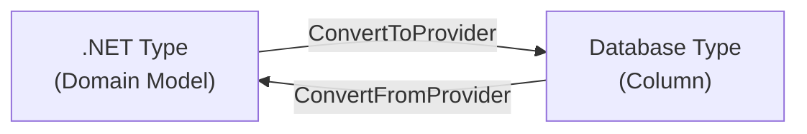
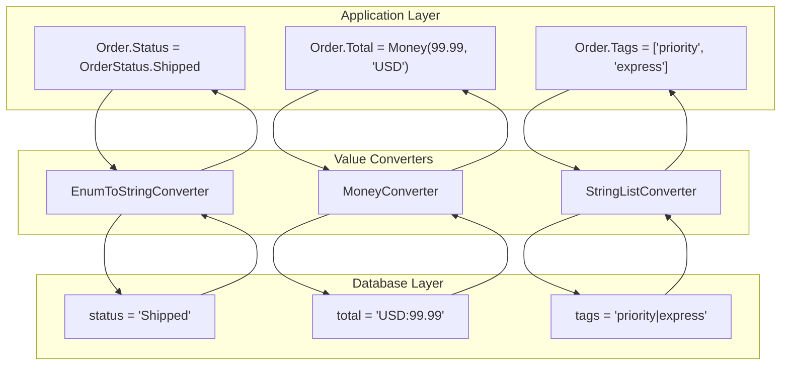

# How to Implement Custom EF Core Value Converters

Author: [nawazdhandala](https://github.com/nawazdhandala)

Tags: EF Core, Entity Framework, C#, .NET, Database, ORM

Description: Learn how to build custom value converters in Entity Framework Core to handle complex type mappings, encryption, JSON serialization, and enum conversions with production-ready examples.

---

Entity Framework Core value converters let you transform data between your .NET types and database columns. They solve a common problem: your domain model uses rich types like enums, value objects, or encrypted strings, but your database stores primitive types like integers, strings, or JSON.

This guide covers practical value converter implementations you can use in production systems.

## How Value Converters Work

A value converter defines two transformations:

1. **To Provider**: Converts your .NET type to a database-compatible type when saving
2. **From Provider**: Converts the database value back to your .NET type when reading



## Basic Value Converter Structure

Every value converter implements `ValueConverter<TModel, TProvider>`. Here is a simple example that converts a boolean to a "Y" or "N" string in the database.

```csharp
using Microsoft.EntityFrameworkCore.Storage.ValueConversion;

// Converts bool to "Y"/"N" string for legacy database compatibility
// TModel = bool (what your C# code uses)
// TProvider = string (what the database stores)
public class BoolToYesNoConverter : ValueConverter<bool, string>
{
    public BoolToYesNoConverter() : base(
        // ConvertToProvider: C# bool -> database string
        v => v ? "Y" : "N",
        // ConvertFromProvider: database string -> C# bool
        v => v == "Y")
    {
    }
}
```

## Registering Value Converters

You can register converters at three levels: per-property, per-type, or globally.

### Per-Property Registration

Apply a converter to a specific property in your DbContext configuration.

```csharp
public class AppDbContext : DbContext
{
    public DbSet<User> Users { get; set; }

    protected override void OnModelCreating(ModelBuilder modelBuilder)
    {
        modelBuilder.Entity<User>()
            .Property(u => u.IsActive)
            // Apply the converter only to this property
            .HasConversion(new BoolToYesNoConverter());
    }
}
```

### Per-Type Registration (EF Core 6+)

Configure all properties of a specific type to use the same converter.

```csharp
protected override void ConfigureConventions(ModelConfigurationBuilder configurationBuilder)
{
    // Every bool property in every entity will use this converter
    configurationBuilder
        .Properties<bool>()
        .HaveConversion<BoolToYesNoConverter>();
}
```

### Inline Lambda Converters

For simple conversions, you can define the converter inline without creating a class.

```csharp
modelBuilder.Entity<Product>()
    .Property(p => p.Status)
    .HasConversion(
        // To database: enum -> string
        v => v.ToString(),
        // From database: string -> enum
        v => (ProductStatus)Enum.Parse(typeof(ProductStatus), v));
```

## Practical Example: Enum to String Converter

Storing enums as strings instead of integers makes your database more readable and refactoring-safe. Here is a generic converter that works with any enum.

```csharp
// Generic enum-to-string converter that works with any enum type
// Using strings instead of integers makes database queries more readable
// and protects against enum value reordering breaking existing data
public class EnumToStringConverter<TEnum> : ValueConverter<TEnum, string>
    where TEnum : struct, Enum
{
    public EnumToStringConverter() : base(
        // Convert enum to its string name for storage
        v => v.ToString(),
        // Parse string back to enum when reading
        v => Enum.Parse<TEnum>(v, ignoreCase: true))
    {
    }
}

// Example enum
public enum OrderStatus
{
    Pending,
    Processing,
    Shipped,
    Delivered,
    Cancelled
}

// Usage in DbContext
modelBuilder.Entity<Order>()
    .Property(o => o.Status)
    .HasConversion(new EnumToStringConverter<OrderStatus>());
```

## JSON Serialization Converter

Store complex objects as JSON in a single column. This is useful for settings, metadata, or denormalized data that does not need relational queries.

```csharp
using System.Text.Json;

// Converts any object to JSON for storage in a single database column
// Useful for: settings objects, metadata, audit logs, or any data
// that doesn't need to be queried relationally
public class JsonConverter<T> : ValueConverter<T, string> where T : class
{
    // Configure JSON serialization options once to reuse
    private static readonly JsonSerializerOptions Options = new()
    {
        PropertyNamingPolicy = JsonNamingPolicy.CamelCase,
        WriteIndented = false  // Compact storage
    };

    public JsonConverter() : base(
        // Serialize object to JSON string, handle null gracefully
        v => v == null ? null : JsonSerializer.Serialize(v, Options),
        // Deserialize JSON back to object, handle null/empty
        v => string.IsNullOrEmpty(v) ? null : JsonSerializer.Deserialize<T>(v, Options))
    {
    }
}

// Example: User preferences stored as JSON
public class UserPreferences
{
    public string Theme { get; set; } = "light";
    public string Language { get; set; } = "en";
    public bool EmailNotifications { get; set; } = true;
    public List<string> FavoriteCategories { get; set; } = new();
}

public class User
{
    public int Id { get; set; }
    public string Email { get; set; }

    // This complex object will be stored as a JSON string
    public UserPreferences Preferences { get; set; }
}

// Registration
modelBuilder.Entity<User>()
    .Property(u => u.Preferences)
    .HasConversion(new JsonConverter<UserPreferences>())
    .HasColumnType("nvarchar(max)");  // Or "jsonb" for PostgreSQL
```

## Encrypted String Converter

Protect sensitive data at rest by encrypting values before storage. This example uses AES encryption with a key from configuration.

```csharp
using System.Security.Cryptography;
using System.Text;

// Encrypts string values before storing in database
// Decrypts when reading back into the application
// Use this for PII, API keys, or other sensitive data
public class EncryptedStringConverter : ValueConverter<string, string>
{
    // In production, load this from secure configuration (Azure Key Vault, etc.)
    private static readonly byte[] Key;
    private static readonly byte[] IV;

    static EncryptedStringConverter()
    {
        // Initialize encryption key from environment or config
        // IMPORTANT: Never hardcode keys in production code
        var keyString = Environment.GetEnvironmentVariable("ENCRYPTION_KEY")
            ?? throw new InvalidOperationException("ENCRYPTION_KEY not configured");

        // Derive a consistent key from the string
        using var sha256 = SHA256.Create();
        Key = sha256.ComputeHash(Encoding.UTF8.GetBytes(keyString));
        IV = new byte[16];  // Use a fixed IV or store per-record
        Array.Copy(Key, IV, 16);
    }

    public EncryptedStringConverter() : base(
        v => Encrypt(v),
        v => Decrypt(v))
    {
    }

    private static string Encrypt(string plainText)
    {
        if (string.IsNullOrEmpty(plainText))
            return plainText;

        using var aes = Aes.Create();
        aes.Key = Key;
        aes.IV = IV;

        using var encryptor = aes.CreateEncryptor();
        var plainBytes = Encoding.UTF8.GetBytes(plainText);
        var encryptedBytes = encryptor.TransformFinalBlock(plainBytes, 0, plainBytes.Length);

        // Return as Base64 for safe string storage
        return Convert.ToBase64String(encryptedBytes);
    }

    private static string Decrypt(string cipherText)
    {
        if (string.IsNullOrEmpty(cipherText))
            return cipherText;

        using var aes = Aes.Create();
        aes.Key = Key;
        aes.IV = IV;

        using var decryptor = aes.CreateDecryptor();
        var cipherBytes = Convert.FromBase64String(cipherText);
        var decryptedBytes = decryptor.TransformFinalBlock(cipherBytes, 0, cipherBytes.Length);

        return Encoding.UTF8.GetString(decryptedBytes);
    }
}

// Usage: Encrypt social security numbers
public class Employee
{
    public int Id { get; set; }
    public string Name { get; set; }

    // This will be encrypted in the database
    public string SocialSecurityNumber { get; set; }
}

modelBuilder.Entity<Employee>()
    .Property(e => e.SocialSecurityNumber)
    .HasConversion(new EncryptedStringConverter());
```

## Value Object Converter

Map domain-driven design value objects to database columns. This example converts a strongly-typed `Money` value object.

```csharp
// Value object representing monetary amounts
// Immutable and includes currency for correctness
public record Money(decimal Amount, string Currency)
{
    // Factory methods for common currencies
    public static Money USD(decimal amount) => new(amount, "USD");
    public static Money EUR(decimal amount) => new(amount, "EUR");

    // Format for display
    public override string ToString() => $"{Currency} {Amount:N2}";
}

// Converts Money to a string format: "USD:123.45"
// Allows storing both amount and currency in a single column
public class MoneyConverter : ValueConverter<Money, string>
{
    public MoneyConverter() : base(
        // Store as "CURRENCY:AMOUNT" format
        v => $"{v.Currency}:{v.Amount}",
        // Parse back to Money object
        v => ParseMoney(v))
    {
    }

    private static Money ParseMoney(string value)
    {
        if (string.IsNullOrEmpty(value))
            return null;

        var parts = value.Split(':');
        if (parts.Length != 2)
            throw new FormatException($"Invalid money format: {value}");

        return new Money(decimal.Parse(parts[1]), parts[0]);
    }
}

// Alternative: Store as decimal with currency in separate column
// Use this when you need to query/sort by amount
public class MoneyAmountConverter : ValueConverter<Money, decimal>
{
    public MoneyAmountConverter() : base(
        v => v.Amount,
        v => new Money(v, "USD"))  // Default currency when reading
    {
    }
}

// Entity using the Money value object
public class Invoice
{
    public int Id { get; set; }
    public string InvoiceNumber { get; set; }
    public Money Total { get; set; }
    public Money Tax { get; set; }
}

// Registration with column configuration
modelBuilder.Entity<Invoice>(entity =>
{
    entity.Property(i => i.Total)
        .HasConversion(new MoneyConverter())
        .HasColumnName("total_with_currency")
        .HasMaxLength(50);

    entity.Property(i => i.Tax)
        .HasConversion(new MoneyConverter())
        .HasColumnName("tax_with_currency")
        .HasMaxLength(50);
});
```

## List to Delimited String Converter

Store simple lists in a single column using delimiter separation. This works well for tags, categories, or other string lists.

```csharp
// Converts a list of strings to a delimited string for storage
// Example: ["tag1", "tag2", "tag3"] -> "tag1|tag2|tag3"
public class StringListConverter : ValueConverter<List<string>, string>
{
    // Use a delimiter unlikely to appear in actual values
    private const char Delimiter = '|';

    public StringListConverter() : base(
        // Join list items with delimiter
        v => v == null || v.Count == 0
            ? string.Empty
            : string.Join(Delimiter, v),
        // Split string back to list
        v => string.IsNullOrEmpty(v)
            ? new List<string>()
            : v.Split(Delimiter).ToList())
    {
    }
}

// Usage
public class Article
{
    public int Id { get; set; }
    public string Title { get; set; }

    // Stored as "tech|programming|dotnet" in database
    public List<string> Tags { get; set; } = new();
}

modelBuilder.Entity<Article>()
    .Property(a => a.Tags)
    .HasConversion(new StringListConverter())
    .HasMaxLength(1000);
```

## DateTime UTC Converter

Ensure all DateTime values are stored and retrieved as UTC to avoid timezone confusion.

```csharp
// Ensures DateTime values are always stored and retrieved as UTC
// Prevents timezone bugs when servers are in different timezones
public class UtcDateTimeConverter : ValueConverter<DateTime, DateTime>
{
    public UtcDateTimeConverter() : base(
        // When saving: convert to UTC if not already
        v => v.Kind == DateTimeKind.Utc ? v : v.ToUniversalTime(),
        // When reading: specify that the value is UTC
        v => DateTime.SpecifyKind(v, DateTimeKind.Utc))
    {
    }
}

// Apply globally to all DateTime properties
protected override void ConfigureConventions(ModelConfigurationBuilder configurationBuilder)
{
    configurationBuilder
        .Properties<DateTime>()
        .HaveConversion<UtcDateTimeConverter>();
}
```

## Handling Nullables

When your property is nullable, you need to handle null values in your converter.

```csharp
// Converter that properly handles nullable types
public class NullableEnumConverter<TEnum> : ValueConverter<TEnum?, string>
    where TEnum : struct, Enum
{
    public NullableEnumConverter() : base(
        // Handle null on write
        v => v.HasValue ? v.Value.ToString() : null,
        // Handle null/empty on read
        v => string.IsNullOrEmpty(v) ? null : Enum.Parse<TEnum>(v, true))
    {
    }
}
```

## Value Converter with Comparer

For complex types, EF Core needs a value comparer to detect changes. Without it, EF might not detect modifications to your objects.

```csharp
using Microsoft.EntityFrameworkCore.ChangeTracking;

// When using JSON converter, EF needs help comparing objects
// Without this, modifications to the object might not be detected
public static class JsonConverterExtensions
{
    public static PropertyBuilder<T> HasJsonConversion<T>(
        this PropertyBuilder<T> propertyBuilder) where T : class
    {
        var converter = new JsonConverter<T>();

        // Comparer that serializes to JSON to check equality
        // This ensures EF detects changes within the object
        var comparer = new ValueComparer<T>(
            // Check equality by comparing JSON representations
            (l, r) => JsonSerializer.Serialize(l) == JsonSerializer.Serialize(r),
            // Generate hash code from JSON
            v => v == null ? 0 : JsonSerializer.Serialize(v).GetHashCode(),
            // Create snapshot by deserializing a fresh copy
            v => JsonSerializer.Deserialize<T>(JsonSerializer.Serialize(v)));

        propertyBuilder.HasConversion(converter);
        propertyBuilder.Metadata.SetValueComparer(comparer);

        return propertyBuilder;
    }
}

// Usage with extension method
modelBuilder.Entity<User>()
    .Property(u => u.Preferences)
    .HasJsonConversion()
    .HasColumnType("nvarchar(max)");
```

## Complete Example: E-Commerce Domain

Here is a complete example showing multiple converters working together in a realistic domain model.

```csharp
// Domain types
public record Money(decimal Amount, string Currency);
public record Address(string Street, string City, string State, string ZipCode, string Country);

public enum OrderStatus { Pending, Confirmed, Shipped, Delivered, Cancelled }
public enum PaymentMethod { CreditCard, BankTransfer, PayPal, Crypto }

public class Order
{
    public Guid Id { get; set; }
    public string OrderNumber { get; set; }
    public int CustomerId { get; set; }

    public OrderStatus Status { get; set; }
    public PaymentMethod PaymentMethod { get; set; }

    public Money Subtotal { get; set; }
    public Money Tax { get; set; }
    public Money Total { get; set; }

    public Address ShippingAddress { get; set; }
    public Address BillingAddress { get; set; }

    public List<string> Tags { get; set; } = new();
    public Dictionary<string, string> Metadata { get; set; } = new();

    public DateTime CreatedAt { get; set; }
    public DateTime? ShippedAt { get; set; }
}

// DbContext with all converters configured
public class ECommerceDbContext : DbContext
{
    public DbSet<Order> Orders { get; set; }

    protected override void OnModelCreating(ModelBuilder modelBuilder)
    {
        modelBuilder.Entity<Order>(entity =>
        {
            entity.HasKey(o => o.Id);

            // Enum converters for readable database values
            entity.Property(o => o.Status)
                .HasConversion(new EnumToStringConverter<OrderStatus>())
                .HasMaxLength(20);

            entity.Property(o => o.PaymentMethod)
                .HasConversion(new EnumToStringConverter<PaymentMethod>())
                .HasMaxLength(20);

            // Money value objects
            entity.Property(o => o.Subtotal)
                .HasConversion(new MoneyConverter())
                .HasMaxLength(50);

            entity.Property(o => o.Tax)
                .HasConversion(new MoneyConverter())
                .HasMaxLength(50);

            entity.Property(o => o.Total)
                .HasConversion(new MoneyConverter())
                .HasMaxLength(50);

            // Complex objects as JSON
            entity.Property(o => o.ShippingAddress)
                .HasJsonConversion()
                .HasColumnType("nvarchar(500)");

            entity.Property(o => o.BillingAddress)
                .HasJsonConversion()
                .HasColumnType("nvarchar(500)");

            // List as delimited string
            entity.Property(o => o.Tags)
                .HasConversion(new StringListConverter())
                .HasMaxLength(500);

            // Dictionary as JSON
            entity.Property(o => o.Metadata)
                .HasConversion(new JsonConverter<Dictionary<string, string>>())
                .HasColumnType("nvarchar(max)");

            // UTC DateTime handling
            entity.Property(o => o.CreatedAt)
                .HasConversion(new UtcDateTimeConverter());

            entity.Property(o => o.ShippedAt)
                .HasConversion(new UtcDateTimeConverter());
        });
    }
}
```

## Data Flow Visualization

This diagram shows how data transforms as it moves between your application and database.



## Performance Considerations

Value converters run on every read and write operation. Keep these tips in mind:

| Concern | Recommendation |
|---------|----------------|
| **CPU overhead** | Keep conversion logic simple; avoid heavy computation |
| **Memory allocation** | Reuse converter instances; avoid creating objects in conversion |
| **Database indexing** | Converted values might not index well; test query performance |
| **Null handling** | Always handle nulls explicitly to avoid exceptions |
| **Testing** | Unit test converters independently before integration |

## Limitations

Value converters have some constraints to be aware of:

1. **No LINQ translation**: EF Core cannot translate converter logic to SQL. Queries filter on converted values, which may prevent index usage.

2. **No collection navigation**: You cannot use converters on navigation properties or collection relationships.

3. **Snapshot tracking**: Complex types need a value comparer for change detection to work correctly.

4. **Migration considerations**: Changing a converter on existing data requires a data migration.

## Testing Value Converters

Always test your converters in isolation before using them in your application.

```csharp
[TestClass]
public class MoneyConverterTests
{
    private readonly MoneyConverter _converter = new();

    [TestMethod]
    public void ConvertToProvider_FormatsCorrectly()
    {
        var money = new Money(123.45m, "USD");

        // Access the conversion expression
        var result = _converter.ConvertToProvider(money);

        Assert.AreEqual("USD:123.45", result);
    }

    [TestMethod]
    public void ConvertFromProvider_ParsesCorrectly()
    {
        var dbValue = "EUR:99.99";

        var result = _converter.ConvertFromProvider(dbValue);

        Assert.AreEqual(99.99m, result.Amount);
        Assert.AreEqual("EUR", result.Currency);
    }

    [TestMethod]
    public void RoundTrip_PreservesValue()
    {
        var original = new Money(500.00m, "GBP");

        var dbValue = _converter.ConvertToProvider(original);
        var restored = _converter.ConvertFromProvider(dbValue);

        Assert.AreEqual(original, restored);
    }
}
```

## Summary

EF Core value converters bridge the gap between your domain model and database storage. Use them to:

- Store enums as readable strings
- Serialize complex objects to JSON
- Encrypt sensitive data
- Handle value objects from DDD
- Normalize DateTime values to UTC

Start with the built-in converters when possible, and create custom ones when your domain requires specific transformations. Always test thoroughly and consider the performance implications for high-throughput scenarios.
