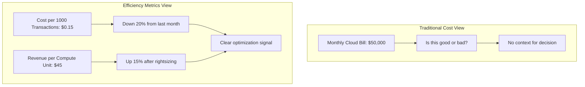
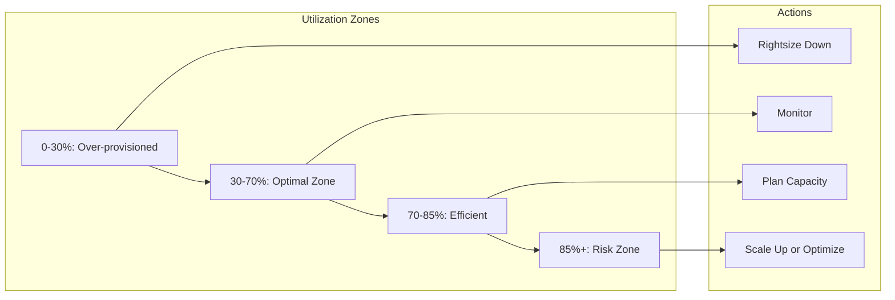
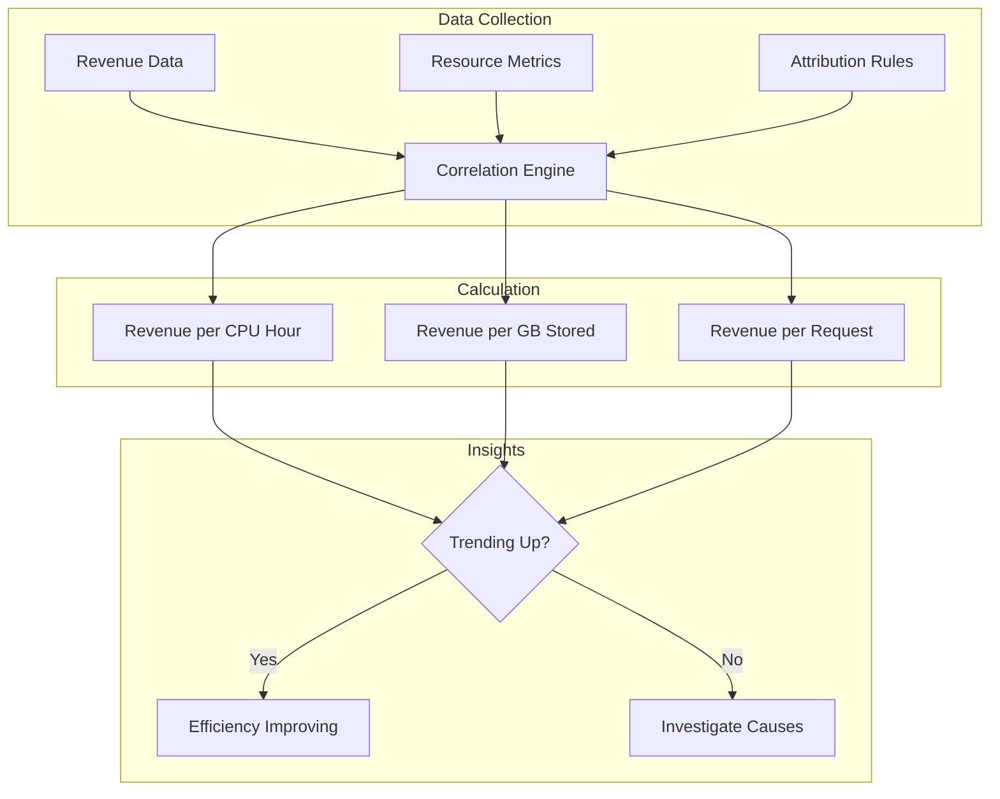
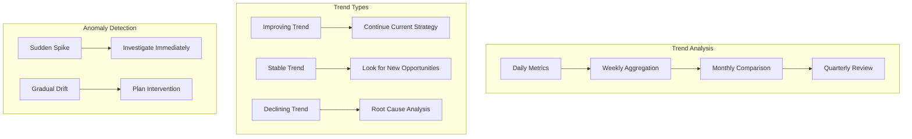
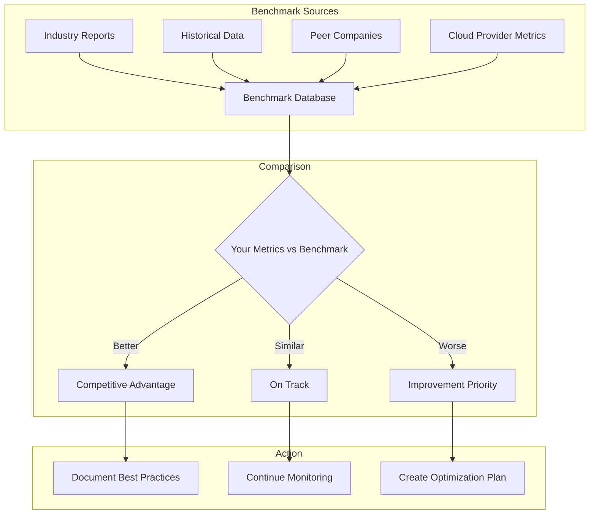
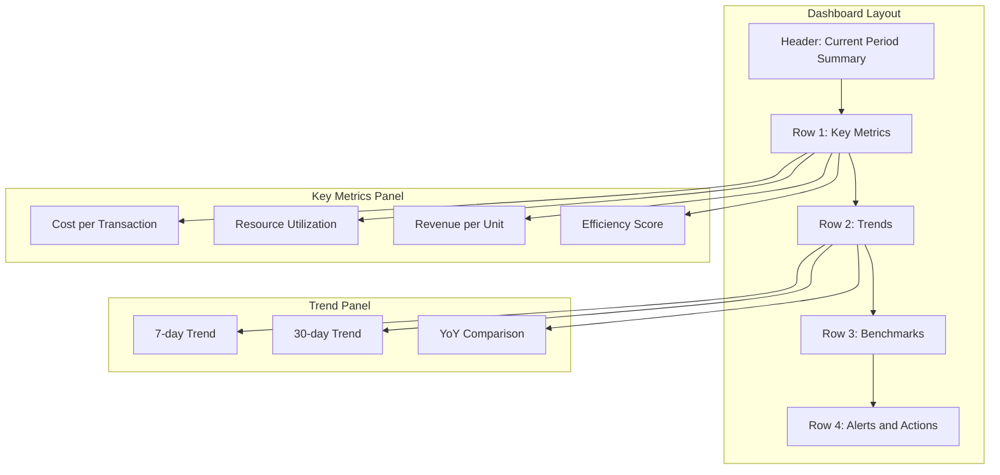

# How to Build Efficiency Metrics

Author: [nawazdhandala](https://github.com/nawazdhandala)

Tags: Cost Optimization, Metrics, FinOps, Performance

Description: Learn how to measure and track infrastructure efficiency for cost optimization.

---

Efficiency metrics bridge the gap between infrastructure costs and business value. While traditional monitoring focuses on availability and performance, efficiency metrics answer the question: "Are we getting the most value from our infrastructure spend?" This guide covers practical approaches to building efficiency metrics that drive cost optimization decisions.

## Why Efficiency Metrics Matter

Raw infrastructure costs tell you what you spend, but not whether that spending is justified. Efficiency metrics normalize costs against business outcomes, revealing optimization opportunities that raw cost data cannot surface.



## Cost Per Transaction Metrics

Cost per transaction is the foundational efficiency metric. It divides infrastructure costs by a meaningful unit of work, creating a normalized measure that accounts for business growth.

### Defining Transaction Units

The first step is identifying what constitutes a "transaction" for your business:

| Business Type | Transaction Unit | Example Calculation |
|--------------|------------------|---------------------|
| E-commerce | Order completed | Monthly infra cost / Orders processed |
| SaaS | API request | Compute cost / API calls |
| Streaming | Minutes streamed | CDN + compute cost / Stream minutes |
| Data Platform | GB processed | Storage + compute cost / Data volume |

### Implementation

```python
from dataclasses import dataclass
from datetime import datetime, timedelta
from typing import Dict, List, Optional
from enum import Enum
import statistics

class CostCategory(Enum):
    COMPUTE = "compute"
    STORAGE = "storage"
    NETWORK = "network"
    DATABASE = "database"
    CDN = "cdn"
    OTHER = "other"

@dataclass
class CostEntry:
    """Represents a cost entry from cloud billing."""
    timestamp: datetime
    category: CostCategory
    amount: float
    currency: str = "USD"
    service: str = ""
    tags: Dict[str, str] = None

@dataclass
class TransactionMetric:
    """Represents a transaction count metric."""
    timestamp: datetime
    transaction_type: str
    count: int
    metadata: Dict[str, any] = None

class CostPerTransactionCalculator:
    """Calculate and track cost per transaction metrics."""

    def __init__(self):
        self.costs: List[CostEntry] = []
        self.transactions: List[TransactionMetric] = []

    def add_cost(self, entry: CostEntry):
        """Record a cost entry."""
        self.costs.append(entry)

    def add_transactions(self, metric: TransactionMetric):
        """Record transaction counts."""
        self.transactions.append(metric)

    def calculate_cost_per_transaction(
        self,
        start: datetime,
        end: datetime,
        transaction_type: str,
        cost_categories: List[CostCategory] = None
    ) -> Dict[str, float]:
        """
        Calculate cost per transaction for a given period.

        Args:
            start: Beginning of measurement period
            end: End of measurement period
            transaction_type: Type of transaction to measure
            cost_categories: Optional filter for cost categories

        Returns:
            Dictionary with cost metrics
        """
        # Filter costs within period
        period_costs = [
            c for c in self.costs
            if start <= c.timestamp < end
            and (cost_categories is None or c.category in cost_categories)
        ]

        # Filter transactions within period
        period_transactions = [
            t for t in self.transactions
            if start <= t.timestamp < end
            and t.transaction_type == transaction_type
        ]

        total_cost = sum(c.amount for c in period_costs)
        total_transactions = sum(t.count for t in period_transactions)

        if total_transactions == 0:
            return {
                'total_cost': total_cost,
                'total_transactions': 0,
                'cost_per_transaction': None,
                'cost_per_1000_transactions': None
            }

        cost_per_transaction = total_cost / total_transactions

        return {
            'total_cost': total_cost,
            'total_transactions': total_transactions,
            'cost_per_transaction': cost_per_transaction,
            'cost_per_1000_transactions': cost_per_transaction * 1000,
            'period_start': start.isoformat(),
            'period_end': end.isoformat()
        }

    def calculate_cost_breakdown(
        self,
        start: datetime,
        end: datetime,
        transaction_type: str
    ) -> Dict[str, Dict[str, float]]:
        """
        Break down cost per transaction by category.

        Useful for identifying which cost categories
        contribute most to per-transaction costs.
        """
        period_transactions = [
            t for t in self.transactions
            if start <= t.timestamp < end
            and t.transaction_type == transaction_type
        ]

        total_transactions = sum(t.count for t in period_transactions)

        if total_transactions == 0:
            return {}

        breakdown = {}
        for category in CostCategory:
            category_costs = [
                c for c in self.costs
                if start <= c.timestamp < end
                and c.category == category
            ]

            category_total = sum(c.amount for c in category_costs)

            breakdown[category.value] = {
                'total_cost': category_total,
                'cost_per_transaction': category_total / total_transactions,
                'percentage_of_total': 0  # Calculate after all categories
            }

        # Calculate percentages
        total_cost = sum(b['total_cost'] for b in breakdown.values())
        for category in breakdown:
            if total_cost > 0:
                breakdown[category]['percentage_of_total'] = (
                    breakdown[category]['total_cost'] / total_cost * 100
                )

        return breakdown


# Example usage
calculator = CostPerTransactionCalculator()

# Add sample cost data
calculator.add_cost(CostEntry(
    timestamp=datetime(2026, 1, 15, 12, 0),
    category=CostCategory.COMPUTE,
    amount=15000.00,
    service="EC2"
))

calculator.add_cost(CostEntry(
    timestamp=datetime(2026, 1, 15, 12, 0),
    category=CostCategory.DATABASE,
    amount=5000.00,
    service="RDS"
))

calculator.add_cost(CostEntry(
    timestamp=datetime(2026, 1, 15, 12, 0),
    category=CostCategory.NETWORK,
    amount=2500.00,
    service="Data Transfer"
))

# Add transaction data
calculator.add_transactions(TransactionMetric(
    timestamp=datetime(2026, 1, 15, 12, 0),
    transaction_type="api_request",
    count=150000000  # 150M requests
))

# Calculate cost per transaction
result = calculator.calculate_cost_per_transaction(
    start=datetime(2026, 1, 1),
    end=datetime(2026, 2, 1),
    transaction_type="api_request"
)

print(f"Total Cost: ${result['total_cost']:,.2f}")
print(f"Total Transactions: {result['total_transactions']:,}")
print(f"Cost per 1000 Transactions: ${result['cost_per_1000_transactions']:.4f}")

# Get category breakdown
breakdown = calculator.calculate_cost_breakdown(
    start=datetime(2026, 1, 1),
    end=datetime(2026, 2, 1),
    transaction_type="api_request"
)

print("\nCost Breakdown by Category:")
for category, metrics in breakdown.items():
    print(f"  {category}: ${metrics['total_cost']:,.2f} ({metrics['percentage_of_total']:.1f}%)")
```

## Resource Utilization Ratios

Utilization ratios measure how effectively you use provisioned resources. Low utilization indicates overprovisioning, while consistently high utilization may indicate performance risks.



### Calculating Utilization Efficiency

```python
from dataclasses import dataclass
from datetime import datetime, timedelta
from typing import List, Dict, Tuple, Optional
from enum import Enum
import statistics

class ResourceType(Enum):
    CPU = "cpu"
    MEMORY = "memory"
    DISK = "disk"
    NETWORK = "network"
    GPU = "gpu"

@dataclass
class ResourceSample:
    """A single resource utilization sample."""
    timestamp: datetime
    resource_type: ResourceType
    resource_id: str
    provisioned: float  # Total capacity
    used: float         # Current usage
    unit: str           # e.g., "cores", "GB", "Mbps"

@dataclass
class UtilizationReport:
    """Utilization analysis for a resource."""
    resource_id: str
    resource_type: ResourceType
    avg_utilization: float
    max_utilization: float
    min_utilization: float
    p95_utilization: float
    samples_count: int
    efficiency_score: float
    recommendation: str

class UtilizationAnalyzer:
    """Analyze resource utilization patterns."""

    # Utilization thresholds for efficiency scoring
    THRESHOLDS = {
        ResourceType.CPU: {'optimal_min': 30, 'optimal_max': 70, 'risk': 85},
        ResourceType.MEMORY: {'optimal_min': 40, 'optimal_max': 80, 'risk': 90},
        ResourceType.DISK: {'optimal_min': 20, 'optimal_max': 70, 'risk': 85},
        ResourceType.NETWORK: {'optimal_min': 20, 'optimal_max': 60, 'risk': 80},
        ResourceType.GPU: {'optimal_min': 50, 'optimal_max': 85, 'risk': 95},
    }

    def __init__(self):
        self.samples: List[ResourceSample] = []

    def add_sample(self, sample: ResourceSample):
        """Record a utilization sample."""
        self.samples.append(sample)

    def calculate_utilization(self, sample: ResourceSample) -> float:
        """Calculate utilization percentage from a sample."""
        if sample.provisioned == 0:
            return 0.0
        return (sample.used / sample.provisioned) * 100

    def analyze_resource(
        self,
        resource_id: str,
        resource_type: ResourceType,
        start: datetime,
        end: datetime
    ) -> UtilizationReport:
        """
        Analyze utilization patterns for a specific resource.

        Returns a comprehensive utilization report with
        recommendations.
        """
        # Filter relevant samples
        relevant_samples = [
            s for s in self.samples
            if s.resource_id == resource_id
            and s.resource_type == resource_type
            and start <= s.timestamp < end
        ]

        if not relevant_samples:
            return UtilizationReport(
                resource_id=resource_id,
                resource_type=resource_type,
                avg_utilization=0,
                max_utilization=0,
                min_utilization=0,
                p95_utilization=0,
                samples_count=0,
                efficiency_score=0,
                recommendation="No data available"
            )

        # Calculate utilization values
        utilizations = [self.calculate_utilization(s) for s in relevant_samples]

        avg_util = statistics.mean(utilizations)
        max_util = max(utilizations)
        min_util = min(utilizations)

        # Calculate P95
        sorted_utils = sorted(utilizations)
        p95_index = int(len(sorted_utils) * 0.95)
        p95_util = sorted_utils[p95_index] if sorted_utils else 0

        # Calculate efficiency score and recommendation
        thresholds = self.THRESHOLDS.get(resource_type, self.THRESHOLDS[ResourceType.CPU])
        efficiency_score, recommendation = self._calculate_efficiency(
            avg_util, max_util, thresholds
        )

        return UtilizationReport(
            resource_id=resource_id,
            resource_type=resource_type,
            avg_utilization=avg_util,
            max_utilization=max_util,
            min_utilization=min_util,
            p95_utilization=p95_util,
            samples_count=len(relevant_samples),
            efficiency_score=efficiency_score,
            recommendation=recommendation
        )

    def _calculate_efficiency(
        self,
        avg_util: float,
        max_util: float,
        thresholds: Dict[str, int]
    ) -> Tuple[float, str]:
        """
        Calculate efficiency score and generate recommendation.

        Efficiency score is 0-100 where:
        - 100 = perfectly optimized
        - 50+ = acceptable
        - <50 = needs attention
        """
        optimal_min = thresholds['optimal_min']
        optimal_max = thresholds['optimal_max']
        risk_threshold = thresholds['risk']

        # Case 1: Under-utilized
        if avg_util < optimal_min:
            # Score decreases as utilization drops further from optimal
            efficiency_score = max(0, 50 - (optimal_min - avg_util))
            rightsize_factor = optimal_min / avg_util if avg_util > 0 else 2
            recommendation = (
                f"Under-utilized at {avg_util:.1f}%. "
                f"Consider rightsizing to {1/rightsize_factor:.0%} of current capacity."
            )

        # Case 2: In optimal range
        elif optimal_min <= avg_util <= optimal_max:
            # Perfect score when in the middle of optimal range
            mid_optimal = (optimal_min + optimal_max) / 2
            distance_from_optimal = abs(avg_util - mid_optimal)
            max_distance = (optimal_max - optimal_min) / 2
            efficiency_score = 100 - (distance_from_optimal / max_distance * 20)
            recommendation = f"Utilization is optimal at {avg_util:.1f}%. Continue monitoring."

        # Case 3: High utilization but below risk
        elif optimal_max < avg_util < risk_threshold:
            efficiency_score = 80 - ((avg_util - optimal_max) / (risk_threshold - optimal_max) * 30)
            recommendation = (
                f"Utilization at {avg_util:.1f}% is high. "
                f"Plan capacity increase before reaching {risk_threshold}%."
            )

        # Case 4: At or above risk threshold
        else:
            efficiency_score = max(0, 50 - (avg_util - risk_threshold))
            recommendation = (
                f"Critical: Utilization at {avg_util:.1f}% exceeds risk threshold. "
                f"Immediate scaling or optimization required."
            )

        # Adjust for spiky workloads (big gap between avg and max)
        if max_util > avg_util * 1.5 and avg_util < optimal_min:
            recommendation += (
                f" Note: Peak utilization ({max_util:.1f}%) is significantly "
                f"higher than average. Consider autoscaling."
            )

        return efficiency_score, recommendation

    def calculate_fleet_efficiency(
        self,
        resource_type: ResourceType,
        start: datetime,
        end: datetime
    ) -> Dict[str, any]:
        """
        Calculate aggregate efficiency across all resources of a type.

        Useful for fleet-wide optimization decisions.
        """
        # Get unique resource IDs
        resource_ids = set(
            s.resource_id for s in self.samples
            if s.resource_type == resource_type
        )

        reports = []
        total_provisioned = 0
        total_used = 0

        for resource_id in resource_ids:
            report = self.analyze_resource(resource_id, resource_type, start, end)
            reports.append(report)

            # Sum up capacity
            relevant_samples = [
                s for s in self.samples
                if s.resource_id == resource_id
                and s.resource_type == resource_type
                and start <= s.timestamp < end
            ]

            if relevant_samples:
                # Use average provisioned and used
                total_provisioned += statistics.mean(s.provisioned for s in relevant_samples)
                total_used += statistics.mean(s.used for s in relevant_samples)

        fleet_utilization = (total_used / total_provisioned * 100) if total_provisioned > 0 else 0
        avg_efficiency = statistics.mean(r.efficiency_score for r in reports) if reports else 0

        # Identify optimization opportunities
        underutilized = [r for r in reports if r.avg_utilization < 30]
        overutilized = [r for r in reports if r.avg_utilization > 85]

        return {
            'fleet_size': len(resource_ids),
            'fleet_utilization': fleet_utilization,
            'average_efficiency_score': avg_efficiency,
            'total_provisioned': total_provisioned,
            'total_used': total_used,
            'underutilized_resources': len(underutilized),
            'overutilized_resources': len(overutilized),
            'potential_savings_percent': max(0, (1 - fleet_utilization / 50) * 100) if fleet_utilization < 50 else 0
        }


# Example usage
analyzer = UtilizationAnalyzer()

# Simulate adding utilization samples for a server
import random
base_time = datetime(2026, 1, 15, 0, 0)

for hour in range(24 * 7):  # One week of hourly samples
    # Simulate varying utilization (higher during business hours)
    hour_of_day = hour % 24
    if 9 <= hour_of_day <= 17:  # Business hours
        base_util = 45
    else:
        base_util = 20

    analyzer.add_sample(ResourceSample(
        timestamp=base_time + timedelta(hours=hour),
        resource_type=ResourceType.CPU,
        resource_id="server-001",
        provisioned=8.0,  # 8 CPU cores
        used=8.0 * (base_util + random.uniform(-10, 15)) / 100,
        unit="cores"
    ))

# Analyze the resource
report = analyzer.analyze_resource(
    resource_id="server-001",
    resource_type=ResourceType.CPU,
    start=datetime(2026, 1, 15),
    end=datetime(2026, 1, 22)
)

print(f"Resource: {report.resource_id}")
print(f"Average Utilization: {report.avg_utilization:.1f}%")
print(f"Max Utilization: {report.max_utilization:.1f}%")
print(f"P95 Utilization: {report.p95_utilization:.1f}%")
print(f"Efficiency Score: {report.efficiency_score:.0f}/100")
print(f"Recommendation: {report.recommendation}")
```

## Revenue Per Resource Unit

Revenue per resource unit connects infrastructure costs directly to business outcomes, making it easier to justify infrastructure investments or identify inefficiencies.



### Implementation

```python
from dataclasses import dataclass, field
from datetime import datetime, timedelta
from typing import Dict, List, Optional
from enum import Enum
import statistics

class RevenueSource(Enum):
    SUBSCRIPTION = "subscription"
    TRANSACTION = "transaction"
    ADVERTISING = "advertising"
    API_USAGE = "api_usage"
    OTHER = "other"

@dataclass
class RevenueEntry:
    """Revenue recorded for a time period."""
    timestamp: datetime
    amount: float
    source: RevenueSource
    currency: str = "USD"
    customer_segment: str = "all"

@dataclass
class ResourceUsage:
    """Resource consumption for a time period."""
    timestamp: datetime
    resource_type: str
    quantity: float
    unit: str  # e.g., "cpu_hours", "gb_stored", "requests"
    cost: float

@dataclass
class RevenueEfficiencyMetrics:
    """Revenue efficiency metrics for a period."""
    period_start: datetime
    period_end: datetime
    total_revenue: float
    total_resource_cost: float
    revenue_per_cpu_hour: float
    revenue_per_gb_stored: float
    revenue_per_1000_requests: float
    gross_margin: float
    efficiency_ratio: float  # Revenue / Cost

class RevenueEfficiencyCalculator:
    """Calculate revenue per resource unit metrics."""

    def __init__(self):
        self.revenue_entries: List[RevenueEntry] = []
        self.resource_usage: List[ResourceUsage] = []

    def add_revenue(self, entry: RevenueEntry):
        """Record revenue entry."""
        self.revenue_entries.append(entry)

    def add_resource_usage(self, usage: ResourceUsage):
        """Record resource usage."""
        self.resource_usage.append(usage)

    def calculate_efficiency(
        self,
        start: datetime,
        end: datetime,
        customer_segment: str = "all"
    ) -> RevenueEfficiencyMetrics:
        """
        Calculate revenue efficiency metrics for a period.

        This connects revenue directly to resource consumption,
        enabling cost optimization decisions based on business impact.
        """
        # Filter revenue
        period_revenue = [
            r for r in self.revenue_entries
            if start <= r.timestamp < end
            and (customer_segment == "all" or r.customer_segment == customer_segment)
        ]

        # Filter resource usage
        period_usage = [
            u for u in self.resource_usage
            if start <= u.timestamp < end
        ]

        total_revenue = sum(r.amount for r in period_revenue)
        total_cost = sum(u.cost for u in period_usage)

        # Calculate resource-specific totals
        cpu_hours = sum(
            u.quantity for u in period_usage
            if u.unit == "cpu_hours"
        )
        gb_stored = sum(
            u.quantity for u in period_usage
            if u.unit == "gb_stored"
        )
        requests = sum(
            u.quantity for u in period_usage
            if u.unit == "requests"
        )

        # Calculate per-unit revenues
        revenue_per_cpu = total_revenue / cpu_hours if cpu_hours > 0 else 0
        revenue_per_gb = total_revenue / gb_stored if gb_stored > 0 else 0
        revenue_per_1k_requests = (total_revenue / requests * 1000) if requests > 0 else 0

        # Calculate margins
        gross_margin = ((total_revenue - total_cost) / total_revenue * 100) if total_revenue > 0 else 0
        efficiency_ratio = total_revenue / total_cost if total_cost > 0 else 0

        return RevenueEfficiencyMetrics(
            period_start=start,
            period_end=end,
            total_revenue=total_revenue,
            total_resource_cost=total_cost,
            revenue_per_cpu_hour=revenue_per_cpu,
            revenue_per_gb_stored=revenue_per_gb,
            revenue_per_1000_requests=revenue_per_1k_requests,
            gross_margin=gross_margin,
            efficiency_ratio=efficiency_ratio
        )

    def compare_periods(
        self,
        period1_start: datetime,
        period1_end: datetime,
        period2_start: datetime,
        period2_end: datetime
    ) -> Dict[str, any]:
        """
        Compare efficiency between two periods.

        Useful for tracking improvement over time or
        comparing before/after optimization changes.
        """
        metrics1 = self.calculate_efficiency(period1_start, period1_end)
        metrics2 = self.calculate_efficiency(period2_start, period2_end)

        def calc_change(old: float, new: float) -> float:
            if old == 0:
                return 0 if new == 0 else 100
            return ((new - old) / old) * 100

        return {
            'period1': {
                'start': period1_start.isoformat(),
                'end': period1_end.isoformat(),
                'efficiency_ratio': metrics1.efficiency_ratio,
                'gross_margin': metrics1.gross_margin
            },
            'period2': {
                'start': period2_start.isoformat(),
                'end': period2_end.isoformat(),
                'efficiency_ratio': metrics2.efficiency_ratio,
                'gross_margin': metrics2.gross_margin
            },
            'changes': {
                'revenue_change': calc_change(metrics1.total_revenue, metrics2.total_revenue),
                'cost_change': calc_change(metrics1.total_resource_cost, metrics2.total_resource_cost),
                'efficiency_ratio_change': calc_change(metrics1.efficiency_ratio, metrics2.efficiency_ratio),
                'revenue_per_cpu_change': calc_change(metrics1.revenue_per_cpu_hour, metrics2.revenue_per_cpu_hour),
                'gross_margin_change': metrics2.gross_margin - metrics1.gross_margin
            },
            'summary': self._generate_summary(metrics1, metrics2)
        }

    def _generate_summary(
        self,
        metrics1: RevenueEfficiencyMetrics,
        metrics2: RevenueEfficiencyMetrics
    ) -> str:
        """Generate human-readable comparison summary."""
        if metrics2.efficiency_ratio > metrics1.efficiency_ratio:
            return (
                f"Efficiency improved by "
                f"{((metrics2.efficiency_ratio - metrics1.efficiency_ratio) / metrics1.efficiency_ratio * 100):.1f}%. "
                f"Each dollar of infrastructure now generates ${metrics2.efficiency_ratio:.2f} in revenue."
            )
        elif metrics2.efficiency_ratio < metrics1.efficiency_ratio:
            return (
                f"Efficiency decreased by "
                f"{((metrics1.efficiency_ratio - metrics2.efficiency_ratio) / metrics1.efficiency_ratio * 100):.1f}%. "
                f"Review recent changes for optimization opportunities."
            )
        else:
            return "Efficiency remained stable between periods."


# Example usage
calculator = RevenueEfficiencyCalculator()

# Add monthly revenue
calculator.add_revenue(RevenueEntry(
    timestamp=datetime(2026, 1, 15),
    amount=500000,
    source=RevenueSource.SUBSCRIPTION
))

calculator.add_revenue(RevenueEntry(
    timestamp=datetime(2026, 1, 15),
    amount=75000,
    source=RevenueSource.API_USAGE
))

# Add resource usage
calculator.add_resource_usage(ResourceUsage(
    timestamp=datetime(2026, 1, 15),
    resource_type="compute",
    quantity=50000,
    unit="cpu_hours",
    cost=25000
))

calculator.add_resource_usage(ResourceUsage(
    timestamp=datetime(2026, 1, 15),
    resource_type="storage",
    quantity=100000,
    unit="gb_stored",
    cost=5000
))

calculator.add_resource_usage(ResourceUsage(
    timestamp=datetime(2026, 1, 15),
    resource_type="api",
    quantity=500000000,
    unit="requests",
    cost=15000
))

# Calculate efficiency
metrics = calculator.calculate_efficiency(
    start=datetime(2026, 1, 1),
    end=datetime(2026, 2, 1)
)

print(f"Total Revenue: ${metrics.total_revenue:,.2f}")
print(f"Total Infrastructure Cost: ${metrics.total_resource_cost:,.2f}")
print(f"Revenue per CPU Hour: ${metrics.revenue_per_cpu_hour:.2f}")
print(f"Revenue per GB Stored: ${metrics.revenue_per_gb_stored:.4f}")
print(f"Revenue per 1000 Requests: ${metrics.revenue_per_1000_requests:.4f}")
print(f"Gross Margin: {metrics.gross_margin:.1f}%")
print(f"Efficiency Ratio: {metrics.efficiency_ratio:.2f}x")
```

## Efficiency Trend Tracking

Point-in-time efficiency metrics are useful, but tracking trends reveals whether your optimization efforts are working and helps predict future efficiency.



### Trend Analysis Implementation

```python
from dataclasses import dataclass
from datetime import datetime, timedelta
from typing import List, Dict, Optional, Tuple
from enum import Enum
import statistics
import math

class TrendDirection(Enum):
    IMPROVING = "improving"
    STABLE = "stable"
    DECLINING = "declining"
    VOLATILE = "volatile"

@dataclass
class EfficiencyDataPoint:
    """Single efficiency measurement."""
    timestamp: datetime
    metric_name: str
    value: float
    metadata: Dict[str, any] = None

@dataclass
class TrendAnalysis:
    """Results of trend analysis."""
    metric_name: str
    direction: TrendDirection
    slope: float  # Change per day
    r_squared: float  # Fit quality (0-1)
    current_value: float
    predicted_next_period: float
    confidence_interval: Tuple[float, float]
    anomalies: List[datetime]

class EfficiencyTrendTracker:
    """Track and analyze efficiency metric trends."""

    def __init__(self, anomaly_threshold: float = 2.0):
        """
        Initialize tracker.

        Args:
            anomaly_threshold: Number of standard deviations for anomaly detection
        """
        self.data_points: List[EfficiencyDataPoint] = []
        self.anomaly_threshold = anomaly_threshold

    def add_data_point(self, point: EfficiencyDataPoint):
        """Record an efficiency data point."""
        self.data_points.append(point)

    def analyze_trend(
        self,
        metric_name: str,
        start: datetime,
        end: datetime,
        higher_is_better: bool = True
    ) -> TrendAnalysis:
        """
        Analyze trend for a specific metric over a time period.

        Uses linear regression to determine trend direction and strength.
        """
        # Filter relevant data points
        points = sorted([
            p for p in self.data_points
            if p.metric_name == metric_name
            and start <= p.timestamp < end
        ], key=lambda p: p.timestamp)

        if len(points) < 3:
            return TrendAnalysis(
                metric_name=metric_name,
                direction=TrendDirection.STABLE,
                slope=0,
                r_squared=0,
                current_value=points[-1].value if points else 0,
                predicted_next_period=points[-1].value if points else 0,
                confidence_interval=(0, 0),
                anomalies=[]
            )

        # Convert to numeric values for regression
        values = [p.value for p in points]
        # Days since start
        x_values = [
            (p.timestamp - points[0].timestamp).total_seconds() / 86400
            for p in points
        ]

        # Calculate linear regression
        slope, intercept, r_squared = self._linear_regression(x_values, values)

        # Determine trend direction
        direction = self._classify_trend(slope, r_squared, higher_is_better)

        # Predict next period
        next_x = x_values[-1] + (x_values[-1] - x_values[0]) / len(x_values)
        predicted = slope * next_x + intercept

        # Calculate confidence interval
        std_dev = statistics.stdev(values) if len(values) > 1 else 0
        confidence_interval = (
            predicted - 1.96 * std_dev,
            predicted + 1.96 * std_dev
        )

        # Detect anomalies
        anomalies = self._detect_anomalies(points)

        return TrendAnalysis(
            metric_name=metric_name,
            direction=direction,
            slope=slope,
            r_squared=r_squared,
            current_value=values[-1],
            predicted_next_period=predicted,
            confidence_interval=confidence_interval,
            anomalies=anomalies
        )

    def _linear_regression(
        self,
        x: List[float],
        y: List[float]
    ) -> Tuple[float, float, float]:
        """
        Simple linear regression.

        Returns: (slope, intercept, r_squared)
        """
        n = len(x)
        if n == 0:
            return 0, 0, 0

        mean_x = sum(x) / n
        mean_y = sum(y) / n

        # Calculate slope
        numerator = sum((x[i] - mean_x) * (y[i] - mean_y) for i in range(n))
        denominator = sum((x[i] - mean_x) ** 2 for i in range(n))

        if denominator == 0:
            return 0, mean_y, 0

        slope = numerator / denominator
        intercept = mean_y - slope * mean_x

        # Calculate R-squared
        ss_res = sum((y[i] - (slope * x[i] + intercept)) ** 2 for i in range(n))
        ss_tot = sum((y[i] - mean_y) ** 2 for i in range(n))

        r_squared = 1 - (ss_res / ss_tot) if ss_tot > 0 else 0

        return slope, intercept, max(0, min(1, r_squared))

    def _classify_trend(
        self,
        slope: float,
        r_squared: float,
        higher_is_better: bool
    ) -> TrendDirection:
        """Classify trend based on slope and fit quality."""
        # If R-squared is low, trend is volatile/unclear
        if r_squared < 0.3:
            return TrendDirection.VOLATILE

        # Determine if slope is significant (>1% change per week)
        weekly_change = slope * 7

        if abs(weekly_change) < 0.01:  # Less than 1% per week
            return TrendDirection.STABLE

        if higher_is_better:
            return TrendDirection.IMPROVING if slope > 0 else TrendDirection.DECLINING
        else:
            return TrendDirection.IMPROVING if slope < 0 else TrendDirection.DECLINING

    def _detect_anomalies(
        self,
        points: List[EfficiencyDataPoint]
    ) -> List[datetime]:
        """Detect anomalous data points using z-score method."""
        if len(points) < 5:
            return []

        values = [p.value for p in points]
        mean_val = statistics.mean(values)
        std_dev = statistics.stdev(values)

        if std_dev == 0:
            return []

        anomalies = []
        for point in points:
            z_score = abs((point.value - mean_val) / std_dev)
            if z_score > self.anomaly_threshold:
                anomalies.append(point.timestamp)

        return anomalies

    def generate_report(
        self,
        metrics: List[str],
        start: datetime,
        end: datetime
    ) -> Dict[str, any]:
        """
        Generate comprehensive trend report for multiple metrics.
        """
        report = {
            'period': {
                'start': start.isoformat(),
                'end': end.isoformat()
            },
            'metrics': {},
            'summary': {
                'improving': [],
                'stable': [],
                'declining': [],
                'volatile': []
            }
        }

        for metric in metrics:
            # Determine if higher is better based on metric name
            higher_is_better = not any(
                term in metric.lower()
                for term in ['cost', 'error', 'latency', 'time']
            )

            analysis = self.analyze_trend(metric, start, end, higher_is_better)

            report['metrics'][metric] = {
                'direction': analysis.direction.value,
                'current_value': analysis.current_value,
                'predicted_next': analysis.predicted_next_period,
                'confidence_interval': analysis.confidence_interval,
                'slope_per_day': analysis.slope,
                'r_squared': analysis.r_squared,
                'anomaly_count': len(analysis.anomalies)
            }

            report['summary'][analysis.direction.value].append(metric)

        return report


# Example usage
tracker = EfficiencyTrendTracker()

# Simulate 30 days of efficiency data with improving trend
import random
base_time = datetime(2026, 1, 1)

for day in range(30):
    # Cost per transaction decreasing over time (improving)
    base_value = 0.15 - (day * 0.001)  # Decreasing cost
    noise = random.uniform(-0.005, 0.005)

    tracker.add_data_point(EfficiencyDataPoint(
        timestamp=base_time + timedelta(days=day),
        metric_name="cost_per_transaction",
        value=base_value + noise
    ))

    # Revenue per CPU hour increasing (improving)
    revenue_base = 50 + (day * 0.5)
    revenue_noise = random.uniform(-2, 2)

    tracker.add_data_point(EfficiencyDataPoint(
        timestamp=base_time + timedelta(days=day),
        metric_name="revenue_per_cpu_hour",
        value=revenue_base + revenue_noise
    ))

# Analyze trends
cost_trend = tracker.analyze_trend(
    metric_name="cost_per_transaction",
    start=datetime(2026, 1, 1),
    end=datetime(2026, 1, 31),
    higher_is_better=False  # Lower cost is better
)

print(f"Cost per Transaction Trend:")
print(f"  Direction: {cost_trend.direction.value}")
print(f"  Current: ${cost_trend.current_value:.4f}")
print(f"  Predicted Next: ${cost_trend.predicted_next_period:.4f}")
print(f"  R-squared: {cost_trend.r_squared:.3f}")

# Generate comprehensive report
report = tracker.generate_report(
    metrics=["cost_per_transaction", "revenue_per_cpu_hour"],
    start=datetime(2026, 1, 1),
    end=datetime(2026, 1, 31)
)

print(f"\nTrend Summary:")
print(f"  Improving: {report['summary']['improving']}")
print(f"  Stable: {report['summary']['stable']}")
print(f"  Declining: {report['summary']['declining']}")
```

## Benchmark Comparisons

Benchmarking efficiency metrics against industry standards or historical baselines helps contextualize your performance and identify improvement opportunities.



### Benchmark Implementation

```python
from dataclasses import dataclass
from datetime import datetime
from typing import Dict, List, Optional
from enum import Enum

class BenchmarkCategory(Enum):
    INDUSTRY_AVERAGE = "industry_average"
    TOP_QUARTILE = "top_quartile"
    HISTORICAL_BEST = "historical_best"
    TARGET = "target"

@dataclass
class Benchmark:
    """A benchmark value for comparison."""
    metric_name: str
    value: float
    category: BenchmarkCategory
    source: str
    as_of_date: datetime
    lower_is_better: bool = False

@dataclass
class BenchmarkComparison:
    """Result of comparing a metric against benchmarks."""
    metric_name: str
    current_value: float
    benchmarks: Dict[str, float]
    percentile: float
    gap_to_target: float
    status: str
    recommendations: List[str]

class BenchmarkAnalyzer:
    """Compare efficiency metrics against benchmarks."""

    def __init__(self):
        self.benchmarks: List[Benchmark] = []

    def add_benchmark(self, benchmark: Benchmark):
        """Register a benchmark for comparison."""
        self.benchmarks.append(benchmark)

    def compare(
        self,
        metric_name: str,
        current_value: float,
        lower_is_better: bool = False
    ) -> BenchmarkComparison:
        """
        Compare current metric value against all relevant benchmarks.
        """
        relevant_benchmarks = [
            b for b in self.benchmarks
            if b.metric_name == metric_name
        ]

        if not relevant_benchmarks:
            return BenchmarkComparison(
                metric_name=metric_name,
                current_value=current_value,
                benchmarks={},
                percentile=50,
                gap_to_target=0,
                status="No benchmarks available",
                recommendations=[]
            )

        benchmark_dict = {
            b.category.value: b.value
            for b in relevant_benchmarks
        }

        # Calculate percentile position
        percentile = self._calculate_percentile(
            current_value,
            benchmark_dict,
            lower_is_better
        )

        # Calculate gap to target
        target = benchmark_dict.get('target', benchmark_dict.get('top_quartile', 0))
        if lower_is_better:
            gap = current_value - target
        else:
            gap = target - current_value

        # Determine status
        status = self._determine_status(percentile, gap, lower_is_better)

        # Generate recommendations
        recommendations = self._generate_recommendations(
            metric_name,
            current_value,
            benchmark_dict,
            lower_is_better
        )

        return BenchmarkComparison(
            metric_name=metric_name,
            current_value=current_value,
            benchmarks=benchmark_dict,
            percentile=percentile,
            gap_to_target=gap,
            status=status,
            recommendations=recommendations
        )

    def _calculate_percentile(
        self,
        value: float,
        benchmarks: Dict[str, float],
        lower_is_better: bool
    ) -> float:
        """
        Estimate percentile position based on benchmarks.

        Uses industry average (50th) and top quartile (75th) as reference points.
        """
        industry_avg = benchmarks.get('industry_average')
        top_quartile = benchmarks.get('top_quartile')

        if industry_avg is None or top_quartile is None:
            return 50  # No data, assume average

        if lower_is_better:
            # For metrics where lower is better, invert the comparison
            if value <= top_quartile:
                return 75 + ((top_quartile - value) / top_quartile * 25)
            elif value <= industry_avg:
                return 50 + ((industry_avg - value) / (industry_avg - top_quartile) * 25)
            else:
                return max(0, 50 - ((value - industry_avg) / industry_avg * 50))
        else:
            # For metrics where higher is better
            if value >= top_quartile:
                return 75 + ((value - top_quartile) / top_quartile * 25)
            elif value >= industry_avg:
                return 50 + ((value - industry_avg) / (top_quartile - industry_avg) * 25)
            else:
                return max(0, 50 - ((industry_avg - value) / industry_avg * 50))

    def _determine_status(
        self,
        percentile: float,
        gap: float,
        lower_is_better: bool
    ) -> str:
        """Determine status based on percentile position."""
        if percentile >= 75:
            return "Excellent - Top quartile performance"
        elif percentile >= 50:
            return "Good - Above average performance"
        elif percentile >= 25:
            return "Fair - Below average, improvement recommended"
        else:
            return "Poor - Significant improvement needed"

    def _generate_recommendations(
        self,
        metric_name: str,
        current: float,
        benchmarks: Dict[str, float],
        lower_is_better: bool
    ) -> List[str]:
        """Generate actionable recommendations based on comparison."""
        recommendations = []

        industry_avg = benchmarks.get('industry_average', current)
        top_quartile = benchmarks.get('top_quartile', current)
        target = benchmarks.get('target', top_quartile)

        if lower_is_better:
            if current > industry_avg:
                pct_above = ((current - industry_avg) / industry_avg) * 100
                recommendations.append(
                    f"Current {metric_name} is {pct_above:.1f}% above industry average. "
                    f"Target reducing to {industry_avg:.4f} to match peers."
                )
            if current > top_quartile:
                pct_to_top = ((current - top_quartile) / current) * 100
                recommendations.append(
                    f"Reduce {metric_name} by {pct_to_top:.1f}% to reach top quartile."
                )
        else:
            if current < industry_avg:
                pct_below = ((industry_avg - current) / industry_avg) * 100
                recommendations.append(
                    f"Current {metric_name} is {pct_below:.1f}% below industry average. "
                    f"Target increasing to {industry_avg:.4f} to match peers."
                )
            if current < top_quartile:
                pct_to_top = ((top_quartile - current) / top_quartile) * 100
                recommendations.append(
                    f"Increase {metric_name} by {pct_to_top:.1f}% to reach top quartile."
                )

        return recommendations

    def generate_benchmark_report(
        self,
        metrics: Dict[str, float],
        lower_is_better_metrics: List[str] = None
    ) -> Dict[str, any]:
        """
        Generate comprehensive benchmark comparison report.

        Args:
            metrics: Dictionary of metric names to current values
            lower_is_better_metrics: List of metrics where lower is better
        """
        lower_is_better = lower_is_better_metrics or []

        report = {
            'generated_at': datetime.utcnow().isoformat(),
            'comparisons': {},
            'summary': {
                'excellent': [],
                'good': [],
                'needs_improvement': []
            },
            'priority_actions': []
        }

        for metric_name, value in metrics.items():
            is_lower_better = metric_name in lower_is_better
            comparison = self.compare(metric_name, value, is_lower_better)

            report['comparisons'][metric_name] = {
                'current_value': comparison.current_value,
                'benchmarks': comparison.benchmarks,
                'percentile': comparison.percentile,
                'gap_to_target': comparison.gap_to_target,
                'status': comparison.status,
                'recommendations': comparison.recommendations
            }

            # Categorize for summary
            if comparison.percentile >= 75:
                report['summary']['excellent'].append(metric_name)
            elif comparison.percentile >= 50:
                report['summary']['good'].append(metric_name)
            else:
                report['summary']['needs_improvement'].append(metric_name)
                # Add to priority actions
                if comparison.recommendations:
                    report['priority_actions'].append({
                        'metric': metric_name,
                        'action': comparison.recommendations[0]
                    })

        return report


# Example usage
analyzer = BenchmarkAnalyzer()

# Add industry benchmarks
analyzer.add_benchmark(Benchmark(
    metric_name="cost_per_1000_requests",
    value=0.12,
    category=BenchmarkCategory.INDUSTRY_AVERAGE,
    source="FinOps Foundation 2026 Report",
    as_of_date=datetime(2026, 1, 1),
    lower_is_better=True
))

analyzer.add_benchmark(Benchmark(
    metric_name="cost_per_1000_requests",
    value=0.08,
    category=BenchmarkCategory.TOP_QUARTILE,
    source="FinOps Foundation 2026 Report",
    as_of_date=datetime(2026, 1, 1),
    lower_is_better=True
))

analyzer.add_benchmark(Benchmark(
    metric_name="cost_per_1000_requests",
    value=0.10,
    category=BenchmarkCategory.TARGET,
    source="Internal Target",
    as_of_date=datetime(2026, 1, 1),
    lower_is_better=True
))

analyzer.add_benchmark(Benchmark(
    metric_name="revenue_per_cpu_hour",
    value=45.00,
    category=BenchmarkCategory.INDUSTRY_AVERAGE,
    source="Industry Analysis",
    as_of_date=datetime(2026, 1, 1),
    lower_is_better=False
))

analyzer.add_benchmark(Benchmark(
    metric_name="revenue_per_cpu_hour",
    value=65.00,
    category=BenchmarkCategory.TOP_QUARTILE,
    source="Industry Analysis",
    as_of_date=datetime(2026, 1, 1),
    lower_is_better=False
))

# Compare current metrics
comparison = analyzer.compare(
    metric_name="cost_per_1000_requests",
    current_value=0.15,
    lower_is_better=True
)

print(f"Cost per 1000 Requests Comparison:")
print(f"  Current: ${comparison.current_value:.4f}")
print(f"  Industry Average: ${comparison.benchmarks['industry_average']:.4f}")
print(f"  Top Quartile: ${comparison.benchmarks['top_quartile']:.4f}")
print(f"  Percentile: {comparison.percentile:.0f}th")
print(f"  Status: {comparison.status}")
print(f"  Recommendations:")
for rec in comparison.recommendations:
    print(f"    - {rec}")
```

## Efficiency Dashboards

A well-designed efficiency dashboard brings all metrics together into a cohesive view that enables quick decision-making.



### Dashboard Data Structure

```python
from dataclasses import dataclass, field
from datetime import datetime, timedelta
from typing import Dict, List, Optional, Any
from enum import Enum
import json

class MetricStatus(Enum):
    HEALTHY = "healthy"
    WARNING = "warning"
    CRITICAL = "critical"
    UNKNOWN = "unknown"

@dataclass
class DashboardMetric:
    """A metric displayed on the dashboard."""
    name: str
    value: float
    unit: str
    status: MetricStatus
    trend: str  # "up", "down", "stable"
    trend_value: float  # Percentage change
    sparkline_data: List[float] = field(default_factory=list)

@dataclass
class Alert:
    """Dashboard alert."""
    severity: str
    metric: str
    message: str
    timestamp: datetime
    action_url: Optional[str] = None

class EfficiencyDashboard:
    """
    Comprehensive efficiency dashboard combining all metric types.

    This class orchestrates data from multiple calculators to provide
    a unified view of infrastructure efficiency.
    """

    def __init__(
        self,
        cost_calculator: CostPerTransactionCalculator,
        utilization_analyzer: UtilizationAnalyzer,
        revenue_calculator: RevenueEfficiencyCalculator,
        trend_tracker: EfficiencyTrendTracker,
        benchmark_analyzer: BenchmarkAnalyzer
    ):
        self.cost_calc = cost_calculator
        self.util_analyzer = utilization_analyzer
        self.revenue_calc = revenue_calculator
        self.trend_tracker = trend_tracker
        self.benchmark_analyzer = benchmark_analyzer

    def generate_dashboard_data(
        self,
        period_end: datetime = None,
        period_days: int = 30
    ) -> Dict[str, Any]:
        """
        Generate complete dashboard data structure.

        This can be serialized to JSON and consumed by a frontend.
        """
        end = period_end or datetime.utcnow()
        start = end - timedelta(days=period_days)

        dashboard = {
            'generated_at': datetime.utcnow().isoformat(),
            'period': {
                'start': start.isoformat(),
                'end': end.isoformat(),
                'days': period_days
            },
            'summary': self._generate_summary(start, end),
            'key_metrics': self._generate_key_metrics(start, end),
            'trends': self._generate_trends(start, end),
            'benchmarks': self._generate_benchmark_section(start, end),
            'alerts': self._generate_alerts(start, end),
            'recommendations': self._generate_recommendations(start, end)
        }

        return dashboard

    def _generate_summary(
        self,
        start: datetime,
        end: datetime
    ) -> Dict[str, Any]:
        """Generate executive summary section."""
        # Get key efficiency metrics
        cost_metrics = self.cost_calc.calculate_cost_per_transaction(
            start, end, "api_request"
        )

        revenue_metrics = self.revenue_calc.calculate_efficiency(start, end)

        # Calculate overall efficiency score (0-100)
        scores = []

        if cost_metrics.get('cost_per_1000_transactions'):
            # Score based on cost efficiency (lower is better)
            # Assuming $0.10 per 1000 is excellent, $0.50 is poor
            cost_score = max(0, min(100, 100 - (cost_metrics['cost_per_1000_transactions'] - 0.10) / 0.004))
            scores.append(cost_score)

        if revenue_metrics.efficiency_ratio > 0:
            # Score based on revenue efficiency (higher is better)
            # Assuming 10x is excellent, 2x is poor
            revenue_score = max(0, min(100, (revenue_metrics.efficiency_ratio - 2) / 0.08))
            scores.append(revenue_score)

        overall_score = sum(scores) / len(scores) if scores else 50

        return {
            'overall_efficiency_score': round(overall_score, 1),
            'total_cost': cost_metrics.get('total_cost', 0),
            'total_revenue': revenue_metrics.total_revenue,
            'gross_margin': round(revenue_metrics.gross_margin, 1),
            'status': self._score_to_status(overall_score)
        }

    def _generate_key_metrics(
        self,
        start: datetime,
        end: datetime
    ) -> List[Dict[str, Any]]:
        """Generate key metrics section."""
        metrics = []

        # Cost per transaction
        cost_data = self.cost_calc.calculate_cost_per_transaction(
            start, end, "api_request"
        )
        if cost_data.get('cost_per_1000_transactions'):
            metrics.append({
                'name': 'Cost per 1K Transactions',
                'value': round(cost_data['cost_per_1000_transactions'], 4),
                'unit': 'USD',
                'format': 'currency',
                'lower_is_better': True
            })

        # Revenue efficiency
        revenue_data = self.revenue_calc.calculate_efficiency(start, end)
        metrics.append({
            'name': 'Revenue per CPU Hour',
            'value': round(revenue_data.revenue_per_cpu_hour, 2),
            'unit': 'USD',
            'format': 'currency',
            'lower_is_better': False
        })

        metrics.append({
            'name': 'Efficiency Ratio',
            'value': round(revenue_data.efficiency_ratio, 2),
            'unit': 'x',
            'format': 'multiplier',
            'lower_is_better': False
        })

        metrics.append({
            'name': 'Gross Margin',
            'value': round(revenue_data.gross_margin, 1),
            'unit': '%',
            'format': 'percentage',
            'lower_is_better': False
        })

        return metrics

    def _generate_trends(
        self,
        start: datetime,
        end: datetime
    ) -> Dict[str, Any]:
        """Generate trends section."""
        metrics_to_track = [
            "cost_per_transaction",
            "revenue_per_cpu_hour",
            "utilization_efficiency"
        ]

        trend_report = self.trend_tracker.generate_report(
            metrics=metrics_to_track,
            start=start,
            end=end
        )

        return {
            'metrics': trend_report['metrics'],
            'summary': trend_report['summary']
        }

    def _generate_benchmark_section(
        self,
        start: datetime,
        end: datetime
    ) -> Dict[str, Any]:
        """Generate benchmarks section."""
        # Get current values
        cost_data = self.cost_calc.calculate_cost_per_transaction(
            start, end, "api_request"
        )
        revenue_data = self.revenue_calc.calculate_efficiency(start, end)

        current_metrics = {
            'cost_per_1000_requests': cost_data.get('cost_per_1000_transactions', 0),
            'revenue_per_cpu_hour': revenue_data.revenue_per_cpu_hour
        }

        benchmark_report = self.benchmark_analyzer.generate_benchmark_report(
            metrics=current_metrics,
            lower_is_better_metrics=['cost_per_1000_requests']
        )

        return {
            'comparisons': benchmark_report['comparisons'],
            'summary': benchmark_report['summary']
        }

    def _generate_alerts(
        self,
        start: datetime,
        end: datetime
    ) -> List[Dict[str, Any]]:
        """Generate alerts based on thresholds and anomalies."""
        alerts = []

        # Check cost trends
        cost_trend = self.trend_tracker.analyze_trend(
            "cost_per_transaction",
            start,
            end,
            higher_is_better=False
        )

        if cost_trend.direction == TrendDirection.DECLINING:
            alerts.append({
                'severity': 'warning',
                'metric': 'cost_per_transaction',
                'message': f'Cost per transaction increasing at {abs(cost_trend.slope):.4f}/day',
                'timestamp': datetime.utcnow().isoformat()
            })

        # Check for anomalies
        if cost_trend.anomalies:
            alerts.append({
                'severity': 'info',
                'metric': 'cost_per_transaction',
                'message': f'{len(cost_trend.anomalies)} anomalies detected in cost metrics',
                'timestamp': datetime.utcnow().isoformat()
            })

        return alerts

    def _generate_recommendations(
        self,
        start: datetime,
        end: datetime
    ) -> List[Dict[str, Any]]:
        """Generate actionable recommendations."""
        recommendations = []

        # Get benchmark recommendations
        cost_data = self.cost_calc.calculate_cost_per_transaction(
            start, end, "api_request"
        )

        if cost_data.get('cost_per_1000_transactions'):
            comparison = self.benchmark_analyzer.compare(
                "cost_per_1000_requests",
                cost_data['cost_per_1000_transactions'],
                lower_is_better=True
            )

            for rec in comparison.recommendations:
                recommendations.append({
                    'category': 'cost_optimization',
                    'priority': 'high' if comparison.percentile < 50 else 'medium',
                    'recommendation': rec,
                    'potential_impact': 'Reduce infrastructure costs'
                })

        return recommendations

    def _score_to_status(self, score: float) -> str:
        """Convert efficiency score to status string."""
        if score >= 80:
            return "excellent"
        elif score >= 60:
            return "good"
        elif score >= 40:
            return "fair"
        else:
            return "needs_attention"

    def export_to_json(
        self,
        filepath: str,
        period_end: datetime = None,
        period_days: int = 30
    ):
        """Export dashboard data to JSON file."""
        data = self.generate_dashboard_data(period_end, period_days)

        with open(filepath, 'w') as f:
            json.dump(data, f, indent=2, default=str)


# Example: Setting up the complete dashboard
def setup_dashboard():
    """
    Example of setting up a complete efficiency dashboard.
    """
    # Initialize all calculators
    cost_calc = CostPerTransactionCalculator()
    util_analyzer = UtilizationAnalyzer()
    revenue_calc = RevenueEfficiencyCalculator()
    trend_tracker = EfficiencyTrendTracker()
    benchmark_analyzer = BenchmarkAnalyzer()

    # Add sample data (in production, this would come from your monitoring systems)
    # ... (data population code)

    # Create dashboard
    dashboard = EfficiencyDashboard(
        cost_calculator=cost_calc,
        utilization_analyzer=util_analyzer,
        revenue_calculator=revenue_calc,
        trend_tracker=trend_tracker,
        benchmark_analyzer=benchmark_analyzer
    )

    # Generate dashboard data
    data = dashboard.generate_dashboard_data(
        period_end=datetime.utcnow(),
        period_days=30
    )

    return data


# Print sample structure
print("Dashboard Data Structure:")
print(json.dumps({
    'generated_at': '2026-01-30T12:00:00Z',
    'period': {'start': '2026-01-01', 'end': '2026-01-30', 'days': 30},
    'summary': {
        'overall_efficiency_score': 72.5,
        'total_cost': 45000,
        'total_revenue': 575000,
        'gross_margin': 92.2,
        'status': 'good'
    },
    'key_metrics': [
        {'name': 'Cost per 1K Transactions', 'value': 0.15, 'unit': 'USD'},
        {'name': 'Revenue per CPU Hour', 'value': 52.30, 'unit': 'USD'},
        {'name': 'Efficiency Ratio', 'value': 12.78, 'unit': 'x'},
        {'name': 'Gross Margin', 'value': 92.2, 'unit': '%'}
    ]
}, indent=2))
```

## Putting It All Together

Building effective efficiency metrics requires combining multiple data sources and analysis techniques. Here is a recommended implementation approach:

### Step 1: Identify Key Business Metrics

Start by identifying the transactions or units of work that matter most to your business:

- E-commerce: Orders, checkouts, product views
- SaaS: API calls, active users, feature usage
- Data platforms: Queries processed, data volume
- Media: Streams, downloads, ad impressions

### Step 2: Map Costs to Business Units

Create attribution rules that connect infrastructure costs to business outcomes:

```python
# Example cost attribution configuration
COST_ATTRIBUTION = {
    'api_request': {
        'compute': 0.60,    # 60% of compute costs
        'database': 0.80,   # 80% of database costs
        'network': 0.40,    # 40% of network costs
    },
    'data_processing': {
        'compute': 0.30,
        'storage': 0.90,
        'network': 0.50,
    },
    'background_jobs': {
        'compute': 0.10,
        'storage': 0.10,
        'network': 0.10,
    }
}
```

### Step 3: Establish Baselines and Targets

Before optimization, establish baselines:

| Metric | Baseline | Target | Stretch Goal |
|--------|----------|--------|--------------|
| Cost per 1K requests | $0.20 | $0.15 | $0.10 |
| CPU utilization | 35% | 55% | 70% |
| Revenue per CPU hour | $40 | $55 | $75 |

### Step 4: Implement Continuous Monitoring

Set up automated collection and alerting:

```python
# Prometheus recording rules for efficiency metrics
RECORDING_RULES = '''
groups:
  - name: efficiency_metrics
    interval: 1m
    rules:
      - record: efficiency:cost_per_request:rate5m
        expr: |
          sum(rate(cloud_cost_dollars_total[5m]))
          /
          sum(rate(http_requests_total[5m]))

      - record: efficiency:revenue_per_cpu_hour:rate1h
        expr: |
          sum(increase(revenue_dollars_total[1h]))
          /
          sum(increase(cpu_usage_seconds_total[1h])) * 3600

      - record: efficiency:utilization_score:avg5m
        expr: |
          avg(
            (rate(cpu_usage_seconds_total[5m]) / cpu_quota_cores)
            * 100
          )
'''
```

### Step 5: Review and Iterate

Schedule regular efficiency reviews:

- **Weekly**: Review trends, investigate anomalies
- **Monthly**: Compare against benchmarks, adjust targets
- **Quarterly**: Comprehensive efficiency audit, update strategies

## Key Takeaways

Building efficiency metrics for cost optimization requires a systematic approach:

1. **Start with business outcomes**: Efficiency metrics should connect infrastructure costs to business value, not just measure raw utilization.

2. **Normalize costs**: Cost per transaction is more meaningful than total cost because it accounts for business growth.

3. **Track utilization intelligently**: Low utilization is waste, but very high utilization is risk. Find the optimal zone for each resource type.

4. **Connect revenue to resources**: Revenue per resource unit shows whether infrastructure investments are paying off.

5. **Watch trends, not just snapshots**: A declining efficiency trend signals problems before they become critical.

6. **Benchmark against standards**: Without context, you cannot know if your efficiency is good or bad.

7. **Build actionable dashboards**: Good dashboards surface insights and drive decisions, not just display numbers.

By implementing these efficiency metrics, you can transform cost optimization from reactive cost-cutting into proactive value creation. The goal is not to spend less, but to get more value from every dollar spent on infrastructure.

## Further Reading

- FinOps Foundation: Unit Economics
- Google Cloud Architecture: Cost Optimization
- AWS Well-Architected Framework: Cost Optimization Pillar
- The Frugal Architect by Werner Vogels
