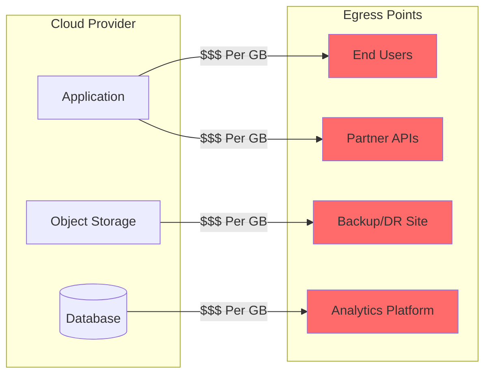
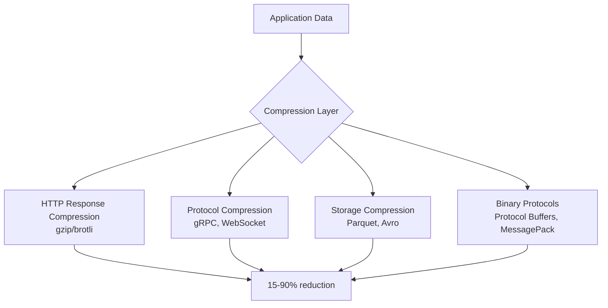
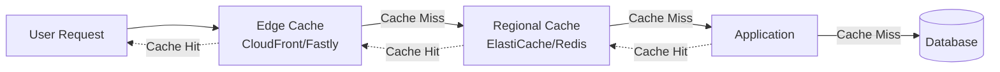
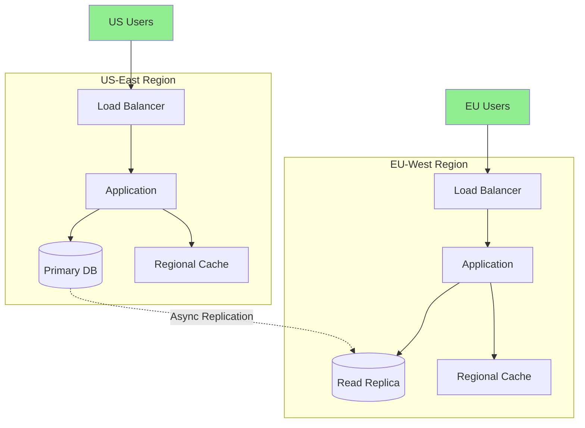

# How to Create Egress Cost Reduction

Author: [nawazdhandala](https://github.com/nawazdhandala)

Tags: Cloud, Cost Optimization, Networking, FinOps

Description: Learn strategies for reducing cloud egress costs without impacting performance.

---

Egress charges are the silent budget killer in cloud infrastructure. You optimize compute, right-size instances, and negotiate reserved capacity, yet your bill keeps climbing. The culprit? Data leaving your cloud provider's network. Every byte crossing the boundary costs money, and at scale, those bytes become millions of dollars annually.

This guide covers practical strategies to slash egress costs while maintaining (or improving) performance. No theory lectures. Just patterns that work.

---

## Understanding Egress Costs: Where Money Leaks

Before optimizing, you need to know where egress actually happens.



### Major Egress Cost Centers

| Source | Typical Cost (AWS) | Common Culprits |
|--------|-------------------|-----------------|
| Internet egress | $0.09/GB | API responses, media serving, downloads |
| Cross-region transfer | $0.02/GB | Multi-region replication, DR |
| Cross-AZ transfer | $0.01/GB | Microservices chatter, DB reads |
| VPC peering (cross-region) | $0.02/GB | Shared services, data pipelines |
| NAT Gateway | $0.045/GB + $0.045/hr | Container registries, package managers |

The first step: enable Cost Allocation Tags and use tools like AWS Cost Explorer or GCP Billing Export to attribute egress to specific services.

---

## Strategy 1: CDN Offloading (The 80/20 Win)

A CDN moves content closer to users and shifts egress from your cloud to the CDN's network. CDN egress is typically 3-10x cheaper than cloud provider egress.

### When CDN Offloading Works Best

- Static assets (images, JS, CSS, fonts)
- Media files (video, audio, PDFs)
- API responses that are cacheable (user profiles, product catalogs, config)
- Software downloads and updates

### Implementation: CloudFront with S3 Origin

```hcl
# Terraform: CloudFront distribution for S3 static assets
resource "aws_cloudfront_distribution" "assets" {
  origin {
    domain_name              = aws_s3_bucket.assets.bucket_regional_domain_name
    origin_id                = "S3-Assets"
    origin_access_control_id = aws_cloudfront_origin_access_control.default.id
  }

  enabled             = true
  default_root_object = "index.html"
  price_class         = "PriceClass_100"  # Use only NA/EU edge locations for cost savings

  default_cache_behavior {
    allowed_methods        = ["GET", "HEAD", "OPTIONS"]
    cached_methods         = ["GET", "HEAD"]
    target_origin_id       = "S3-Assets"
    viewer_protocol_policy = "redirect-to-https"

    cache_policy_id          = aws_cloudfront_cache_policy.optimized.id
    origin_request_policy_id = aws_cloudfront_origin_request_policy.cors.id

    compress = true  # Enable automatic gzip/brotli compression
  }

  restrictions {
    geo_restriction {
      restriction_type = "none"
    }
  }

  viewer_certificate {
    cloudfront_default_certificate = true
  }
}

# Cache policy optimized for static assets
resource "aws_cloudfront_cache_policy" "optimized" {
  name        = "static-assets-optimized"
  min_ttl     = 86400      # 1 day minimum
  default_ttl = 604800     # 7 days default
  max_ttl     = 31536000   # 1 year maximum

  parameters_in_cache_key_and_forwarded_to_origin {
    cookies_config {
      cookie_behavior = "none"
    }
    headers_config {
      header_behavior = "none"
    }
    query_strings_config {
      query_string_behavior = "none"
    }
    enable_accept_encoding_brotli = true
    enable_accept_encoding_gzip   = true
  }
}
```

### Cache-Control Headers for Maximum Offload

```ts
// Node.js/Express: Set proper cache headers
import express from 'express';
import path from 'path';

const app = express();

// Static assets with long cache
app.use('/static', express.static(path.join(__dirname, 'public'), {
  maxAge: '1y',           // Cache for 1 year
  immutable: true,        // Won't change (use versioned filenames)
  etag: true,
  lastModified: true
}));

// API responses that can be cached
app.get('/api/products/:id', async (req, res) => {
  const product = await getProduct(req.params.id);

  res.set({
    'Cache-Control': 'public, max-age=3600, stale-while-revalidate=86400',
    'ETag': `"${product.version}"`,
    'Vary': 'Accept-Encoding'
  });

  res.json(product);
});

// User-specific data: private cache only
app.get('/api/user/profile', auth, async (req, res) => {
  const profile = await getProfile(req.user.id);

  res.set({
    'Cache-Control': 'private, max-age=300',  // 5 min browser cache
    'Vary': 'Authorization'
  });

  res.json(profile);
});
```

### Cost Impact Example

| Metric | Before CDN | After CDN |
|--------|-----------|-----------|
| Monthly egress | 50 TB | 5 TB (from origin) |
| Cloud egress cost | $4,500 | $450 |
| CDN cost | $0 | $500 (50TB at $0.01/GB) |
| **Net savings** | - | **$3,550/month** |

---

## Strategy 2: Data Compression (Shrink Before You Ship)

Compression reduces the bytes transferred without reducing the data. Modern algorithms like Brotli achieve 15-25% better compression than gzip with similar CPU cost.

### Compression at Multiple Layers



### HTTP Compression with Nginx

```nginx
# nginx.conf: Aggressive compression settings
http {
    # Enable gzip
    gzip on;
    gzip_vary on;
    gzip_proxied any;
    gzip_comp_level 6;
    gzip_min_length 256;
    gzip_types
        application/javascript
        application/json
        application/xml
        application/rss+xml
        image/svg+xml
        text/css
        text/javascript
        text/plain
        text/xml;

    # Enable Brotli (requires ngx_brotli module)
    brotli on;
    brotli_comp_level 6;
    brotli_min_length 256;
    brotli_types
        application/javascript
        application/json
        application/xml
        image/svg+xml
        text/css
        text/javascript
        text/plain
        text/xml;
}
```

### Application-Level Compression for APIs

```ts
// Express with compression middleware
import compression from 'compression';
import express from 'express';

const app = express();

// Compress responses larger than 1KB
app.use(compression({
  level: 6,
  threshold: 1024,
  filter: (req, res) => {
    // Don't compress if client doesn't support it
    if (req.headers['x-no-compression']) {
      return false;
    }
    return compression.filter(req, res);
  }
}));

// For large JSON payloads, consider streaming compression
import { createGzip } from 'zlib';
import { pipeline } from 'stream/promises';

app.get('/api/export/large-dataset', async (req, res) => {
  res.set({
    'Content-Type': 'application/json',
    'Content-Encoding': 'gzip',
    'Transfer-Encoding': 'chunked'
  });

  const dataStream = getLargeDatasetStream();
  const gzipStream = createGzip({ level: 6 });

  await pipeline(dataStream, gzipStream, res);
});
```

### Binary Protocols for Internal Services

```ts
// Protocol Buffers reduce payload size by 3-10x vs JSON
// user.proto
/*
syntax = "proto3";

message User {
  int64 id = 1;
  string email = 2;
  string name = 3;
  repeated string roles = 4;
  int64 created_at = 5;
}
*/

// TypeScript client using protobuf
import { User } from './generated/user_pb';

// JSON payload: ~150 bytes
const jsonUser = {
  id: 12345678901234,
  email: "user@example.com",
  name: "Jane Developer",
  roles: ["admin", "developer"],
  created_at: 1706640000000
};

// Protobuf payload: ~60 bytes (60% reduction)
const protoUser = new User();
protoUser.setId(12345678901234);
protoUser.setEmail("user@example.com");
protoUser.setName("Jane Developer");
protoUser.setRolesList(["admin", "developer"]);
protoUser.setCreatedAt(1706640000000);

const bytes = protoUser.serializeBinary();
```

---

## Strategy 3: Caching at the Edge (Reduce Round Trips)

Edge caching eliminates egress entirely for repeated requests. The goal: serve from cache, not origin.

### Multi-Layer Caching Architecture



### Redis Caching Layer

```ts
// Caching layer to reduce database egress
import Redis from 'ioredis';

const redis = new Redis({
  host: process.env.REDIS_HOST,
  port: 6379,
  keyPrefix: 'cache:'
});

interface CacheOptions {
  ttl: number;           // Seconds
  staleWhileRevalidate?: number;
}

async function cachedFetch<T>(
  key: string,
  fetcher: () => Promise<T>,
  options: CacheOptions
): Promise<T> {
  const cached = await redis.get(key);

  if (cached) {
    const data = JSON.parse(cached);

    // Check if stale but still usable
    if (data._staleAt && Date.now() > data._staleAt) {
      // Serve stale, revalidate in background
      setImmediate(async () => {
        const fresh = await fetcher();
        await cacheSet(key, fresh, options);
      });
    }

    return data.value;
  }

  const fresh = await fetcher();
  await cacheSet(key, fresh, options);
  return fresh;
}

async function cacheSet<T>(key: string, value: T, options: CacheOptions) {
  const wrapper = {
    value,
    _staleAt: options.staleWhileRevalidate
      ? Date.now() + (options.ttl * 1000)
      : null,
    _expiresAt: Date.now() + ((options.ttl + (options.staleWhileRevalidate || 0)) * 1000)
  };

  const totalTtl = options.ttl + (options.staleWhileRevalidate || 0);
  await redis.setex(key, totalTtl, JSON.stringify(wrapper));
}

// Usage: Cache product data to avoid repeated DB egress
app.get('/api/products/:id', async (req, res) => {
  const product = await cachedFetch(
    `product:${req.params.id}`,
    () => db.products.findById(req.params.id),
    { ttl: 3600, staleWhileRevalidate: 86400 }
  );

  res.json(product);
});
```

### Cache Invalidation Strategy

```ts
// Event-driven cache invalidation
import { EventEmitter } from 'events';

const cacheEvents = new EventEmitter();

// When data changes, invalidate relevant caches
async function updateProduct(id: string, data: ProductUpdate) {
  const updated = await db.products.update(id, data);

  // Invalidate all related caches
  await Promise.all([
    redis.del(`product:${id}`),
    redis.del(`product-list:category:${updated.categoryId}`),
    // Publish to other regions/instances
    redis.publish('cache:invalidate', JSON.stringify({
      type: 'product',
      id,
      categoryId: updated.categoryId
    }))
  ]);

  return updated;
}

// Subscribe to invalidation events (for multi-instance)
redis.subscribe('cache:invalidate');
redis.on('message', async (channel, message) => {
  if (channel === 'cache:invalidate') {
    const { type, id } = JSON.parse(message);
    await redis.del(`${type}:${id}`);
  }
});
```

---

## Strategy 4: Regional Optimization (Keep Data Close)

Cross-region data transfer adds latency and cost. The principle: process data where it lives.

### Multi-Region Architecture for Reduced Egress



### Geolocation-Based Routing

```ts
// Route users to nearest region using Cloudflare Workers
export default {
  async fetch(request: Request): Promise<Response> {
    const cf = request.cf;
    const country = cf?.country || 'US';

    // Map countries to regional endpoints
    const regionMap: Record<string, string> = {
      // Europe
      'GB': 'eu-west-1',
      'DE': 'eu-west-1',
      'FR': 'eu-west-1',
      // Asia Pacific
      'JP': 'ap-northeast-1',
      'AU': 'ap-southeast-2',
      // Default to US
      'default': 'us-east-1'
    };

    const region = regionMap[country] || regionMap['default'];
    const origin = `https://api-${region}.example.com`;

    // Forward request to regional endpoint
    const url = new URL(request.url);
    url.hostname = new URL(origin).hostname;

    return fetch(new Request(url, request), {
      cf: {
        // Cache at edge for this region
        cacheTtl: 300,
        cacheEverything: true
      }
    });
  }
};
```

### Data Locality for Batch Processing

```python
# Process data in the same region as storage
import boto3
from concurrent.futures import ThreadPoolExecutor

def process_regional_data():
    """Process S3 data using regional EC2 instances to avoid cross-region egress."""

    regions = ['us-east-1', 'eu-west-1', 'ap-northeast-1']

    def process_region(region: str):
        # Use regional endpoint
        s3 = boto3.client('s3', region_name=region)

        # Process only buckets in this region
        bucket = f"data-{region}"

        # Stream and process locally
        paginator = s3.get_paginator('list_objects_v2')
        for page in paginator.paginate(Bucket=bucket, Prefix='events/'):
            for obj in page.get('Contents', []):
                # Process in-region: no egress cost
                response = s3.get_object(Bucket=bucket, Key=obj['Key'])
                process_object(response['Body'])

    # Process all regions in parallel
    with ThreadPoolExecutor(max_workers=len(regions)) as executor:
        executor.map(process_region, regions)
```

---

## Strategy 5: Egress Monitoring and Alerting

You cannot optimize what you do not measure. Build visibility into egress patterns.

### CloudWatch Metrics for Egress Tracking

```ts
// Custom metrics for egress tracking
import { CloudWatch } from '@aws-sdk/client-cloudwatch';

const cloudwatch = new CloudWatch({ region: process.env.AWS_REGION });

interface EgressMetric {
  service: string;
  endpoint: string;
  bytesOut: number;
  destination: 'internet' | 'cross-region' | 'cross-az';
}

async function recordEgressMetric(metric: EgressMetric) {
  await cloudwatch.putMetricData({
    Namespace: 'Custom/Egress',
    MetricData: [
      {
        MetricName: 'BytesOut',
        Value: metric.bytesOut,
        Unit: 'Bytes',
        Dimensions: [
          { Name: 'Service', Value: metric.service },
          { Name: 'Endpoint', Value: metric.endpoint },
          { Name: 'Destination', Value: metric.destination }
        ],
        Timestamp: new Date()
      }
    ]
  });
}

// Express middleware to track response sizes
import express from 'express';

function egressTracker(serviceName: string) {
  return (req: express.Request, res: express.Response, next: express.NextFunction) => {
    const originalSend = res.send;

    res.send = function(body: any) {
      const bytes = Buffer.isBuffer(body)
        ? body.length
        : Buffer.byteLength(body || '', 'utf8');

      // Record asynchronously
      recordEgressMetric({
        service: serviceName,
        endpoint: req.path,
        bytesOut: bytes,
        destination: 'internet'
      }).catch(console.error);

      return originalSend.call(this, body);
    };

    next();
  };
}

app.use(egressTracker('api-service'));
```

### Egress Budget Alerts

```yaml
# CloudFormation: Egress cost alarm
AWSTemplateFormatVersion: '2010-09-09'
Description: Egress cost monitoring and alerting

Resources:
  EgressBudget:
    Type: AWS::Budgets::Budget
    Properties:
      Budget:
        BudgetName: MonthlyEgressBudget
        BudgetLimit:
          Amount: 5000
          Unit: USD
        TimeUnit: MONTHLY
        BudgetType: COST
        CostFilters:
          Service:
            - Amazon Elastic Compute Cloud - Compute
          UsageType:
            - USE1-DataTransfer-Out-Bytes
            - USE1-DataTransfer-Regional-Bytes
        NotificationsWithSubscribers:
          - Notification:
              NotificationType: ACTUAL
              ComparisonOperator: GREATER_THAN
              Threshold: 80
              ThresholdType: PERCENTAGE
            Subscribers:
              - SubscriptionType: EMAIL
                Address: platform-team@example.com
              - SubscriptionType: SNS
                Address: !Ref EgressAlertTopic
          - Notification:
              NotificationType: FORECASTED
              ComparisonOperator: GREATER_THAN
              Threshold: 100
              ThresholdType: PERCENTAGE
            Subscribers:
              - SubscriptionType: EMAIL
                Address: platform-team@example.com

  EgressAlertTopic:
    Type: AWS::SNS::Topic
    Properties:
      TopicName: egress-cost-alerts

  # Metric alarm for sudden spikes
  EgressSpikeAlarm:
    Type: AWS::CloudWatch::Alarm
    Properties:
      AlarmName: EgressSpike
      AlarmDescription: Egress exceeded normal baseline by 200%
      MetricName: BytesOut
      Namespace: Custom/Egress
      Statistic: Sum
      Period: 3600
      EvaluationPeriods: 1
      Threshold: 1000000000000  # 1TB per hour
      ComparisonOperator: GreaterThanThreshold
      AlarmActions:
        - !Ref EgressAlertTopic
```

### OneUptime Dashboard for Egress Visibility

```yaml
# OneUptime probe configuration for egress monitoring
# Place this in your monitoring configuration

monitors:
  - name: "API Egress Health"
    type: api
    url: "https://api.example.com/health"
    interval: 60
    # Track response size trends

  - name: "CDN Cache Hit Ratio"
    type: api
    url: "https://api.cloudflare.com/client/v4/zones/{zone_id}/analytics/dashboard"
    headers:
      Authorization: "Bearer ${CLOUDFLARE_TOKEN}"
    interval: 300
    # Alert if cache hit ratio drops below 80%

alerts:
  - name: "Egress Cost Anomaly"
    condition: "egress_bytes_daily > baseline * 1.5"
    severity: warning
    notification:
      - channel: slack
        webhook: "${SLACK_WEBHOOK}"
      - channel: email
        to: "finops@example.com"
```

---

## Quick Wins Checklist

Before diving into complex optimizations, capture these immediate savings:

### Immediate Actions (Day 1)

- [ ] Enable compression on all load balancers and CDNs
- [ ] Set `Cache-Control` headers on static assets (1 year for versioned files)
- [ ] Move static assets to CDN (CloudFront, Cloudflare, Fastly)
- [ ] Enable VPC endpoints for AWS services (S3, DynamoDB, etc.)

### Short-Term (Week 1-2)

- [ ] Audit NAT Gateway traffic - move to VPC endpoints or Gateway endpoints
- [ ] Implement API response caching (Redis/Memcached)
- [ ] Add gzip/brotli compression to API responses
- [ ] Review cross-region replication - is it all necessary?

### Medium-Term (Month 1)

- [ ] Deploy regional read replicas for databases
- [ ] Implement edge caching for API responses
- [ ] Migrate to binary protocols (gRPC, Protocol Buffers) for internal services
- [ ] Set up egress monitoring dashboards and alerts

### Long-Term (Quarter 1)

- [ ] Build multi-region architecture with data locality
- [ ] Negotiate committed use discounts with CDN providers
- [ ] Evaluate dedicated interconnects for high-volume partner traffic
- [ ] Consider hybrid cloud for predictable high-egress workloads

---

## Cost Savings Summary

| Strategy | Implementation Effort | Typical Savings | Best For |
|----------|----------------------|-----------------|----------|
| CDN offloading | Low | 50-80% | Static content, media |
| Compression | Low | 15-30% | All traffic |
| Edge caching | Medium | 30-60% | Cacheable APIs |
| Regional optimization | High | 20-40% | Global applications |
| Monitoring/alerting | Medium | 10-20% | Cost visibility |

The compound effect: implementing all five strategies typically reduces egress costs by 60-85%.

---

## Key Takeaways

1. **Measure first.** Enable detailed billing and attribute egress to services before optimizing.
2. **CDN is the biggest lever.** Moving static content to CDN is high-impact, low-effort.
3. **Compress everything.** Modern compression (Brotli) is CPU-cheap and bandwidth-expensive.
4. **Cache aggressively.** Every cache hit is zero egress cost.
5. **Keep data close to compute.** Process data in the region where it lives.
6. **Monitor continuously.** Egress patterns change; your optimization must evolve.

> The goal is not zero egress - it is right-sized egress. Pay for the bytes that deliver value, not the bytes that leak through misconfiguration.

Build egress awareness into your platform team culture. Review monthly. Optimize quarterly. Your cloud bill will thank you.

---

**Related Reading:**

- [Moving from AWS to Bare Metal](https://oneuptime.com/blog/post/2023-10-30-moving-from-aws-to-bare-metal/view)
- [AWS to Bare Metal: Two Years Later](https://oneuptime.com/blog/post/2025-10-29-aws-to-bare-metal-two-years-later/view)
- [How to Reduce Noise in OpenTelemetry](https://oneuptime.com/blog/post/2025-08-25-how-to-reduce-noise-in-opentelemetry/view)
