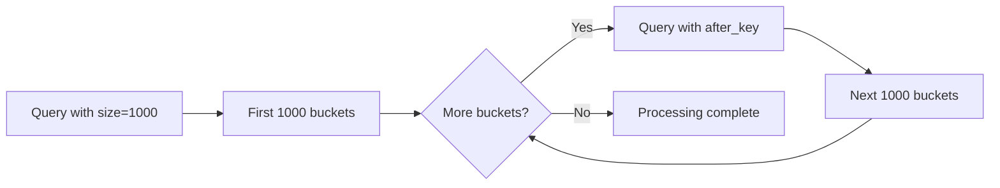
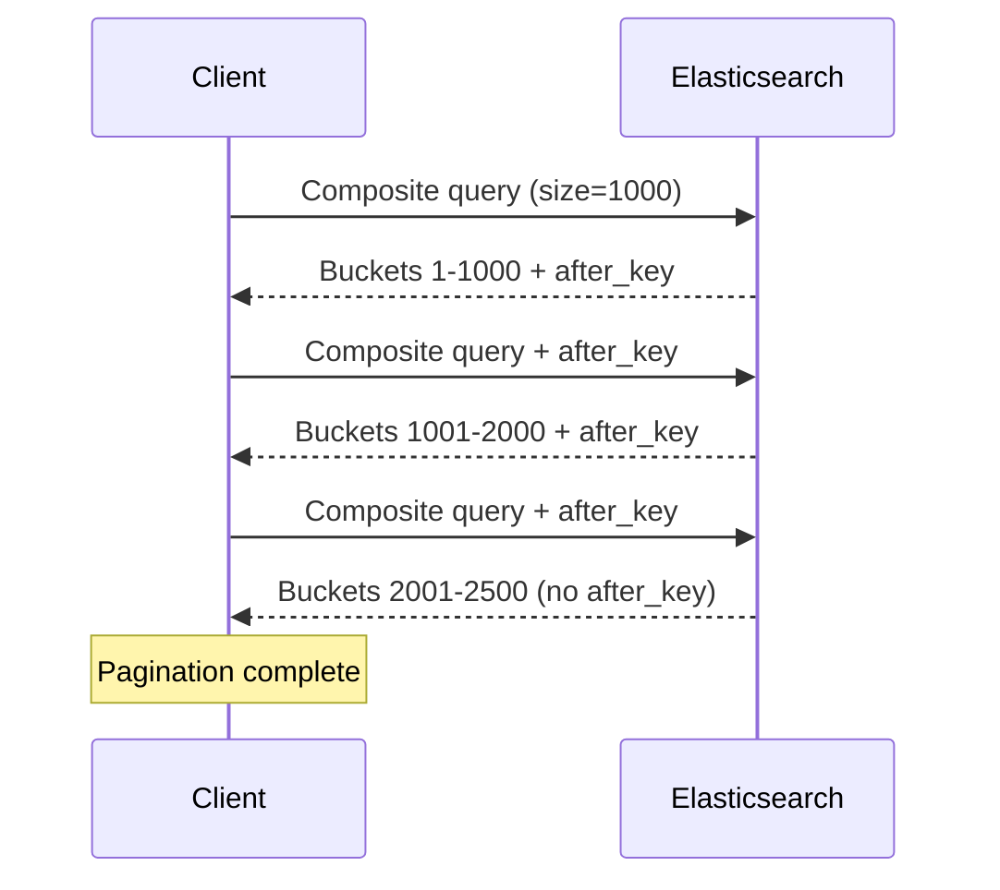
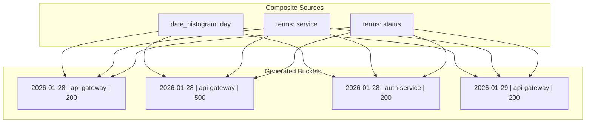
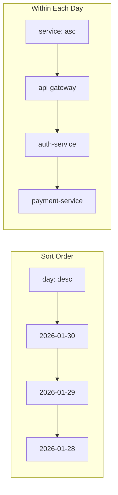

# How to Create Elasticsearch Composite Aggregations

Author: [nawazdhandala](https://github.com/nawazdhandala)

Tags: Elasticsearch, Aggregations, Analytics, Search

Description: Learn to build paginated composite aggregations in Elasticsearch for efficient bucket iteration across large datasets.

---

Elasticsearch aggregations are powerful for analytics, but standard bucket aggregations have a significant limitation: they return all buckets at once, which becomes problematic when you have millions of unique combinations. Composite aggregations solve this by providing paginated access to aggregation buckets.

This guide covers how composite aggregations work, how to paginate through results using `after_key`, and how to combine multiple value sources for complex analytics.

## What Makes Composite Aggregations Different

Standard aggregations like `terms` or `date_histogram` return all matching buckets in a single response. For high-cardinality fields or cross-product aggregations, this can mean millions of buckets, overwhelming memory and causing timeouts.

Composite aggregations flip this model:

- Return buckets in batches (pages)
- Allow you to iterate through the entire result set
- Support multiple value sources in a single aggregation
- Guarantee consistent ordering for pagination



## Basic Composite Aggregation Structure

A composite aggregation requires at least one value source and supports pagination through the `after` parameter.

```json
GET /logs/_search
{
  "size": 0,
  "aggs": {
    "my_buckets": {
      "composite": {
        "size": 1000,
        "sources": [
          {
            "service": {
              "terms": {
                "field": "service.name"
              }
            }
          }
        ]
      }
    }
  }
}
```

The response includes an `after_key` that you use to fetch the next page:

```json
{
  "aggregations": {
    "my_buckets": {
      "after_key": {
        "service": "payment-service"
      },
      "buckets": [
        {
          "key": { "service": "api-gateway" },
          "doc_count": 15234
        },
        {
          "key": { "service": "auth-service" },
          "doc_count": 8921
        }
      ]
    }
  }
}
```

## Pagination with after_key

To retrieve the next page, include the `after_key` from the previous response:

```json
GET /logs/_search
{
  "size": 0,
  "aggs": {
    "my_buckets": {
      "composite": {
        "size": 1000,
        "sources": [
          {
            "service": {
              "terms": {
                "field": "service.name"
              }
            }
          }
        ],
        "after": {
          "service": "payment-service"
        }
      }
    }
  }
}
```

When `after_key` is absent from the response, you have reached the end of the result set.



## Value Source Types

Composite aggregations support four types of value sources that can be combined to create multi-dimensional buckets.

### Terms Source

Groups documents by the exact value of a field. Best for keyword fields or fields with limited cardinality.

```json
{
  "sources": [
    {
      "status_code": {
        "terms": {
          "field": "response.status",
          "missing_bucket": true,
          "order": "desc"
        }
      }
    }
  ]
}
```

The `missing_bucket` option includes documents where the field is missing, placing them in a bucket with a null key.

### Histogram Source

Groups numeric values into fixed-size intervals.

```json
{
  "sources": [
    {
      "response_time": {
        "histogram": {
          "field": "latency_ms",
          "interval": 100
        }
      }
    }
  ]
}
```

This creates buckets for 0-99ms, 100-199ms, 200-299ms, and so on.

### Date Histogram Source

Groups timestamps into calendar-aware intervals.

```json
{
  "sources": [
    {
      "daily": {
        "date_histogram": {
          "field": "@timestamp",
          "calendar_interval": "1d",
          "format": "yyyy-MM-dd",
          "time_zone": "UTC"
        }
      }
    }
  ]
}
```

Supported intervals include `minute`, `hour`, `day`, `week`, `month`, `quarter`, and `year` for calendar intervals, or fixed intervals like `1h`, `30m`, `1d`.

### GeoTile Grid Source

Groups geo-points into grid cells for geographic aggregations.

```json
{
  "sources": [
    {
      "location": {
        "geotile_grid": {
          "field": "coordinates",
          "precision": 8
        }
      }
    }
  ]
}
```

## Multi-Source Aggregations

The real power of composite aggregations comes from combining multiple sources to create cross-product buckets.

```json
GET /logs/_search
{
  "size": 0,
  "aggs": {
    "service_daily_metrics": {
      "composite": {
        "size": 1000,
        "sources": [
          {
            "day": {
              "date_histogram": {
                "field": "@timestamp",
                "calendar_interval": "1d",
                "format": "yyyy-MM-dd"
              }
            }
          },
          {
            "service": {
              "terms": {
                "field": "service.name"
              }
            }
          },
          {
            "status": {
              "terms": {
                "field": "response.status"
              }
            }
          }
        ]
      },
      "aggs": {
        "avg_latency": {
          "avg": {
            "field": "latency_ms"
          }
        },
        "p99_latency": {
          "percentiles": {
            "field": "latency_ms",
            "percents": [99]
          }
        }
      }
    }
  }
}
```

This produces buckets for every combination of day, service, and status code:

```json
{
  "buckets": [
    {
      "key": {
        "day": "2026-01-28",
        "service": "api-gateway",
        "status": 200
      },
      "doc_count": 45231,
      "avg_latency": { "value": 45.2 },
      "p99_latency": { "values": { "99.0": 234.5 } }
    },
    {
      "key": {
        "day": "2026-01-28",
        "service": "api-gateway",
        "status": 500
      },
      "doc_count": 123,
      "avg_latency": { "value": 892.1 },
      "p99_latency": { "values": { "99.0": 2341.8 } }
    }
  ]
}
```



## Implementing Pagination in Code

Here is a practical example of iterating through all composite buckets in Node.js:

```javascript
const { Client } = require('@elastic/elasticsearch');

const client = new Client({ node: 'http://localhost:9200' });

async function* iterateCompositeAggregation(index, aggregation) {
  let afterKey = null;

  while (true) {
    const query = {
      index,
      size: 0,
      aggs: {
        composite_buckets: {
          composite: {
            ...aggregation,
            size: 1000,
            ...(afterKey && { after: afterKey })
          }
        }
      }
    };

    const response = await client.search(query);
    const { buckets, after_key } = response.aggregations.composite_buckets;

    for (const bucket of buckets) {
      yield bucket;
    }

    if (!after_key) {
      break;
    }

    afterKey = after_key;
  }
}

// Usage
async function analyzeServiceMetrics() {
  const aggregation = {
    sources: [
      { day: { date_histogram: { field: '@timestamp', calendar_interval: '1d' } } },
      { service: { terms: { field: 'service.name' } } }
    ]
  };

  let totalRequests = 0;
  let bucketCount = 0;

  for await (const bucket of iterateCompositeAggregation('logs-*', aggregation)) {
    totalRequests += bucket.doc_count;
    bucketCount++;

    // Process each bucket
    console.log(`${bucket.key.day} | ${bucket.key.service}: ${bucket.doc_count} requests`);
  }

  console.log(`Processed ${bucketCount} buckets, ${totalRequests} total requests`);
}

analyzeServiceMetrics().catch(console.error);
```

## Python Implementation

```python
from elasticsearch import Elasticsearch

def iterate_composite(client, index, agg_body):
    """Generator that yields all buckets from a composite aggregation."""
    after_key = None

    while True:
        composite = {
            **agg_body,
            "size": 1000
        }

        if after_key:
            composite["after"] = after_key

        response = client.search(
            index=index,
            size=0,
            aggs={"composite_buckets": {"composite": composite}}
        )

        result = response["aggregations"]["composite_buckets"]

        for bucket in result["buckets"]:
            yield bucket

        after_key = result.get("after_key")
        if not after_key:
            break

# Usage
client = Elasticsearch("http://localhost:9200")

agg_body = {
    "sources": [
        {"hour": {"date_histogram": {"field": "@timestamp", "fixed_interval": "1h"}}},
        {"error_type": {"terms": {"field": "error.type"}}}
    ]
}

error_counts = {}
for bucket in iterate_composite(client, "logs-*", agg_body):
    error_type = bucket["key"]["error_type"]
    error_counts[error_type] = error_counts.get(error_type, 0) + bucket["doc_count"]

for error_type, count in sorted(error_counts.items(), key=lambda x: -x[1]):
    print(f"{error_type}: {count}")
```

## Nested Aggregations Within Composite

You can add sub-aggregations to compute metrics for each composite bucket:

```json
GET /logs/_search
{
  "size": 0,
  "aggs": {
    "service_metrics": {
      "composite": {
        "size": 500,
        "sources": [
          {
            "hour": {
              "date_histogram": {
                "field": "@timestamp",
                "fixed_interval": "1h"
              }
            }
          },
          {
            "service": {
              "terms": {
                "field": "service.name"
              }
            }
          }
        ]
      },
      "aggs": {
        "request_count": {
          "value_count": {
            "field": "request_id"
          }
        },
        "error_count": {
          "filter": {
            "range": {
              "response.status": {
                "gte": 500
              }
            }
          }
        },
        "latency_stats": {
          "extended_stats": {
            "field": "latency_ms"
          }
        },
        "top_endpoints": {
          "terms": {
            "field": "request.path",
            "size": 5
          }
        }
      }
    }
  }
}
```

## Controlling Sort Order

By default, composite aggregations sort buckets in ascending order by source values. You can control the sort direction for each source:

```json
{
  "sources": [
    {
      "day": {
        "date_histogram": {
          "field": "@timestamp",
          "calendar_interval": "1d",
          "order": "desc"
        }
      }
    },
    {
      "service": {
        "terms": {
          "field": "service.name",
          "order": "asc"
        }
      }
    }
  ]
}
```

This returns recent days first while sorting services alphabetically within each day.



## Performance Considerations

### Choosing the Right Size

The `size` parameter controls how many buckets to return per page. Larger sizes mean fewer round trips but more memory usage:

| Size | Use Case |
|------|----------|
| 100-500 | Interactive queries, dashboards |
| 1000-5000 | Background processing, exports |
| 10000 | Bulk data extraction (use with caution) |

### Early Termination

Composite aggregations can use early termination when all sources are sorted by indexed fields. This significantly improves performance for large datasets:

```json
{
  "sources": [
    {
      "timestamp": {
        "date_histogram": {
          "field": "@timestamp",
          "calendar_interval": "1d"
        }
      }
    }
  ]
}
```

If `@timestamp` is indexed in sorted order (which is common for time-series data), Elasticsearch can stop scanning early once it fills the requested bucket size.

### Filtering Before Aggregation

Always apply filters at the query level rather than in sub-aggregations:

```json
GET /logs/_search
{
  "size": 0,
  "query": {
    "bool": {
      "filter": [
        { "range": { "@timestamp": { "gte": "now-7d" } } },
        { "term": { "environment": "production" } }
      ]
    }
  },
  "aggs": {
    "service_metrics": {
      "composite": {
        "size": 1000,
        "sources": [
          { "service": { "terms": { "field": "service.name" } } }
        ]
      }
    }
  }
}
```

## Common Use Cases

### Building Time Series Reports

Export hourly metrics for all services over a time period:

```json
GET /metrics/_search
{
  "size": 0,
  "query": {
    "range": {
      "@timestamp": {
        "gte": "2026-01-01",
        "lt": "2026-02-01"
      }
    }
  },
  "aggs": {
    "hourly_by_service": {
      "composite": {
        "size": 1000,
        "sources": [
          {
            "hour": {
              "date_histogram": {
                "field": "@timestamp",
                "fixed_interval": "1h",
                "format": "yyyy-MM-dd'T'HH:mm:ss"
              }
            }
          },
          {
            "service": {
              "terms": {
                "field": "service.name"
              }
            }
          }
        ]
      },
      "aggs": {
        "avg_cpu": { "avg": { "field": "cpu_percent" } },
        "avg_memory": { "avg": { "field": "memory_mb" } },
        "request_rate": { "avg": { "field": "requests_per_second" } }
      }
    }
  }
}
```

### Unique User Counting Per Dimension

Count unique users across multiple dimensions:

```json
GET /events/_search
{
  "size": 0,
  "aggs": {
    "unique_users": {
      "composite": {
        "size": 1000,
        "sources": [
          { "country": { "terms": { "field": "geo.country" } } },
          { "device": { "terms": { "field": "user_agent.device" } } }
        ]
      },
      "aggs": {
        "users": {
          "cardinality": {
            "field": "user_id"
          }
        }
      }
    }
  }
}
```

### Error Analysis by Multiple Dimensions

Analyze errors grouped by service, error type, and time:

```json
GET /logs/_search
{
  "size": 0,
  "query": {
    "bool": {
      "filter": [
        { "term": { "level": "error" } },
        { "range": { "@timestamp": { "gte": "now-24h" } } }
      ]
    }
  },
  "aggs": {
    "error_breakdown": {
      "composite": {
        "size": 500,
        "sources": [
          {
            "hour": {
              "date_histogram": {
                "field": "@timestamp",
                "fixed_interval": "1h"
              }
            }
          },
          { "service": { "terms": { "field": "service.name" } } },
          { "error_class": { "terms": { "field": "error.class" } } }
        ]
      },
      "aggs": {
        "sample_message": {
          "top_hits": {
            "size": 1,
            "_source": ["message", "stack_trace"]
          }
        }
      }
    }
  }
}
```

## Limitations to Keep in Mind

1. **No bucket sorting by metrics**: Unlike terms aggregations, you cannot sort composite buckets by a sub-aggregation value. Buckets are always sorted by their source keys.

2. **Source order matters**: The order of sources determines the sort order of results. Changing source order changes pagination behavior.

3. **Memory for after_key**: The `after_key` contains one value per source. With many sources, this key can become large.

4. **No global cardinality**: You cannot know the total number of buckets ahead of time without iterating through all of them.

## Summary

| Feature | Description |
|---------|-------------|
| **Pagination** | Use `after_key` from response in next query's `after` parameter |
| **Sources** | Combine terms, histogram, date_histogram, geotile_grid |
| **Size** | Controls buckets per page (100-10000 typical) |
| **Nested aggs** | Add metrics, filters, cardinality to each bucket |
| **Sort order** | Set per source with `order: asc` or `order: desc` |
| **Performance** | Filter at query level, use indexed sort fields |

Composite aggregations are the right choice when you need to process a large number of bucket combinations or when you need consistent pagination through aggregation results. They trade the ability to sort by metrics for the ability to handle arbitrary bucket counts without memory issues.

For observability use cases, composite aggregations excel at building time-series reports, computing metrics across many dimensions, and exporting aggregated data for further analysis.
