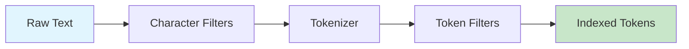

# How to Build Elasticsearch Custom Analyzers

Author: [nawazdhandala](https://www.github.com/nawazdhandala)

Tags: Elasticsearch, Search, Text Analysis, Lucene, Full-Text Search

Description: Create custom Elasticsearch analyzers with tokenizers, token filters, and character filters for domain-specific text search and analysis.

---

Out of the box, Elasticsearch analyzers work well for general text search. But when you are dealing with domain-specific content like medical records, legal documents, or product catalogs, the built-in analyzers often fall short. That is where custom analyzers come in.

This guide walks you through building custom analyzers from scratch. You will learn how the analysis pipeline works and how to combine components to create analyzers that match your exact search requirements.

---

## Understanding the Analysis Pipeline

Before building custom analyzers, you need to understand how text flows through the analysis pipeline. Every analyzer consists of three components that execute in order:



**Character filters** preprocess the raw text string before tokenization. They can strip HTML, map characters, or apply regex replacements.

**Tokenizers** split the preprocessed text into individual tokens. Each analyzer has exactly one tokenizer.

**Token filters** transform the tokens produced by the tokenizer. They can lowercase, stem, remove stopwords, or add synonyms.

---

## Your First Custom Analyzer

Let us start with a simple custom analyzer. This example creates an analyzer for product descriptions that strips HTML, lowercases everything, and removes English stopwords.

```bash
# Create an index with a custom product analyzer
curl -X PUT "localhost:9200/products" -H 'Content-Type: application/json' -d'
{
  "settings": {
    "analysis": {
      "analyzer": {
        "product_description": {
          "type": "custom",
          "char_filter": ["html_strip"],
          "tokenizer": "standard",
          "filter": ["lowercase", "english_stop"]
        }
      },
      "filter": {
        "english_stop": {
          "type": "stop",
          "stopwords": "_english_"
        }
      }
    }
  },
  "mappings": {
    "properties": {
      "description": {
        "type": "text",
        "analyzer": "product_description"
      }
    }
  }
}'
```

Test your analyzer with the Analyze API:

```bash
# Test the custom analyzer
curl -X POST "localhost:9200/products/_analyze" -H 'Content-Type: application/json' -d'
{
  "analyzer": "product_description",
  "text": "<p>The Quick Brown Fox jumps over the lazy dog</p>"
}'

# Output tokens: [quick, brown, fox, jumps, over, lazy, dog]
# Note: "the" is removed as a stopword, HTML tags are stripped
```

---

## Building Character Filters

Character filters run before tokenization. They modify the raw text string, which can dramatically affect how the tokenizer splits it.

### Mapping Character Filter

The mapping filter replaces specific character sequences. This is useful for normalizing domain-specific notation.

```bash
# Create an analyzer for chemical formulas
curl -X PUT "localhost:9200/chemistry" -H 'Content-Type: application/json' -d'
{
  "settings": {
    "analysis": {
      "char_filter": {
        "chemical_symbols": {
          "type": "mapping",
          "mappings": [
            "H2O => water",
            "CO2 => carbon_dioxide",
            "NaCl => sodium_chloride",
            "O2 => oxygen"
          ]
        }
      },
      "analyzer": {
        "chemistry_analyzer": {
          "type": "custom",
          "char_filter": ["chemical_symbols"],
          "tokenizer": "standard",
          "filter": ["lowercase"]
        }
      }
    }
  }
}'

# Test: "H2O and CO2" becomes tokens [water, and, carbon_dioxide]
```

### Pattern Replace Filter

For more complex transformations, use regex patterns. This example strips version numbers from software names.

```bash
# Create an analyzer that normalizes software versions
curl -X PUT "localhost:9200/software" -H 'Content-Type: application/json' -d'
{
  "settings": {
    "analysis": {
      "char_filter": {
        "strip_version": {
          "type": "pattern_replace",
          "pattern": "\\s*v?\\d+(\\.\\d+)*",
          "replacement": ""
        }
      },
      "analyzer": {
        "software_analyzer": {
          "type": "custom",
          "char_filter": ["strip_version"],
          "tokenizer": "standard",
          "filter": ["lowercase"]
        }
      }
    }
  }
}'

# Test: "Python 3.11.4" becomes [python]
# Test: "Node.js v18.12.0" becomes [node.js]
```

---

## Choosing and Configuring Tokenizers

The tokenizer is the core of your analyzer. It determines how text gets split into tokens.

### N-gram Tokenizer for Partial Matching

N-grams enable substring matching, useful for searching product codes or technical identifiers.

```bash
# Create an analyzer for part numbers with partial matching
curl -X PUT "localhost:9200/parts" -H 'Content-Type: application/json' -d'
{
  "settings": {
    "analysis": {
      "tokenizer": {
        "part_number_tokenizer": {
          "type": "ngram",
          "min_gram": 3,
          "max_gram": 6,
          "token_chars": ["letter", "digit"]
        }
      },
      "analyzer": {
        "part_number_analyzer": {
          "type": "custom",
          "tokenizer": "part_number_tokenizer",
          "filter": ["uppercase"]
        }
      }
    }
  },
  "mappings": {
    "properties": {
      "part_id": {
        "type": "text",
        "analyzer": "part_number_analyzer"
      }
    }
  }
}'

# Part "ABC123" generates: [ABC, ABC1, ABC12, ABC123, BC1, BC12, BC123, C12, C123, 123]
# Now searching "BC12" will match "ABC123"
```

### Edge N-gram for Autocomplete

Edge n-grams anchor at the beginning of words, making them perfect for autocomplete.

```bash
# Create an autocomplete analyzer
curl -X PUT "localhost:9200/autocomplete_index" -H 'Content-Type: application/json' -d'
{
  "settings": {
    "analysis": {
      "tokenizer": {
        "autocomplete_tokenizer": {
          "type": "edge_ngram",
          "min_gram": 2,
          "max_gram": 15,
          "token_chars": ["letter", "digit"]
        }
      },
      "analyzer": {
        "autocomplete_index_analyzer": {
          "type": "custom",
          "tokenizer": "autocomplete_tokenizer",
          "filter": ["lowercase"]
        },
        "autocomplete_search_analyzer": {
          "type": "custom",
          "tokenizer": "standard",
          "filter": ["lowercase"]
        }
      }
    }
  },
  "mappings": {
    "properties": {
      "name": {
        "type": "text",
        "analyzer": "autocomplete_index_analyzer",
        "search_analyzer": "autocomplete_search_analyzer"
      }
    }
  }
}'

# "Elasticsearch" indexes as: [el, ela, elas, elast, elasti, elastic, ...]
# Searching "elast" matches "Elasticsearch"
```

---

## Building Token Filter Chains

Token filters transform tokens after tokenization. The order matters since each filter processes the output of the previous one.

### Synonym Filter for Domain Vocabulary

Synonyms help users find content using different terminology.

```bash
# Create a medical terminology analyzer
curl -X PUT "localhost:9200/medical" -H 'Content-Type: application/json' -d'
{
  "settings": {
    "analysis": {
      "filter": {
        "medical_synonyms": {
          "type": "synonym",
          "synonyms": [
            "heart attack, myocardial infarction, MI",
            "high blood pressure, hypertension, HTN",
            "diabetes, diabetes mellitus, DM",
            "broken bone, fracture"
          ]
        },
        "medical_stopwords": {
          "type": "stop",
          "stopwords": ["patient", "presents", "with", "the", "a", "an"]
        }
      },
      "analyzer": {
        "medical_analyzer": {
          "type": "custom",
          "tokenizer": "standard",
          "filter": [
            "lowercase",
            "medical_stopwords",
            "medical_synonyms"
          ]
        }
      }
    }
  }
}'

# Searching "heart attack" will also match documents containing "MI"
```

### Word Delimiter Graph for Compound Words

This filter handles compound words, camelCase, and mixed alphanumerics.

```bash
# Create an analyzer for technical identifiers
curl -X PUT "localhost:9200/technical" -H 'Content-Type: application/json' -d'
{
  "settings": {
    "analysis": {
      "filter": {
        "identifier_delimiter": {
          "type": "word_delimiter_graph",
          "split_on_case_change": true,
          "split_on_numerics": true,
          "preserve_original": true,
          "generate_word_parts": true,
          "generate_number_parts": true
        }
      },
      "analyzer": {
        "identifier_analyzer": {
          "type": "custom",
          "tokenizer": "whitespace",
          "filter": [
            "identifier_delimiter",
            "lowercase",
            "flatten_graph"
          ]
        }
      }
    }
  }
}'

# "PowerShell2024" becomes: [powershell2024, power, shell, 2024]
# "camelCaseMethod" becomes: [camelcasemethod, camel, case, method]
```

---

## Complete Example: E-commerce Search Analyzer

Here is a production-ready analyzer for an e-commerce product catalog that combines multiple techniques.

```bash
# Create a comprehensive e-commerce analyzer
curl -X PUT "localhost:9200/ecommerce" -H 'Content-Type: application/json' -d'
{
  "settings": {
    "analysis": {
      "char_filter": {
        "ampersand_mapping": {
          "type": "mapping",
          "mappings": ["& => and", "+ => plus"]
        }
      },
      "filter": {
        "product_synonyms": {
          "type": "synonym",
          "synonyms": [
            "laptop, notebook, portable computer",
            "phone, mobile, smartphone, cell phone",
            "tv, television, telly",
            "fridge, refrigerator"
          ]
        },
        "brand_synonyms": {
          "type": "synonym",
          "synonyms": [
            "hp, hewlett packard",
            "lg, life is good"
          ]
        },
        "product_stopwords": {
          "type": "stop",
          "stopwords": ["for", "with", "the", "a", "an", "of"]
        },
        "min_token_length": {
          "type": "length",
          "min": 2
        }
      },
      "analyzer": {
        "product_index_analyzer": {
          "type": "custom",
          "char_filter": ["html_strip", "ampersand_mapping"],
          "tokenizer": "standard",
          "filter": [
            "lowercase",
            "asciifolding",
            "product_stopwords",
            "min_token_length",
            "product_synonyms",
            "porter_stem"
          ]
        },
        "product_search_analyzer": {
          "type": "custom",
          "tokenizer": "standard",
          "filter": [
            "lowercase",
            "asciifolding",
            "product_synonyms"
          ]
        }
      }
    }
  },
  "mappings": {
    "properties": {
      "title": {
        "type": "text",
        "analyzer": "product_index_analyzer",
        "search_analyzer": "product_search_analyzer"
      },
      "brand": {
        "type": "text",
        "analyzer": "product_index_analyzer",
        "search_analyzer": "product_search_analyzer",
        "fields": {
          "keyword": {
            "type": "keyword"
          }
        }
      }
    }
  }
}'
```

Test the analyzer:

```bash
# Test with sample product text
curl -X POST "localhost:9200/ecommerce/_analyze" -H 'Content-Type: application/json' -d'
{
  "analyzer": "product_index_analyzer",
  "text": "HP 15.6\" Laptop with Intel Core i7 & 16GB RAM"
}'

# Output includes: [hp, hewlett, packard, 15.6, laptop, notebook,
#                   portabl, comput, intel, core, i7, and, 16gb, ram]
```

---

## Debugging Custom Analyzers

When your analyzer does not behave as expected, use the explain parameter to see what each component does.

```bash
# Get detailed analysis breakdown
curl -X POST "localhost:9200/ecommerce/_analyze" -H 'Content-Type: application/json' -d'
{
  "analyzer": "product_index_analyzer",
  "text": "Samsung 55\" Smart TV",
  "explain": true
}'
```

This shows the output at each stage, making it easy to identify which filter is causing unexpected behavior.

---

## Performance Considerations

Custom analyzers affect both indexing speed and index size. Keep these guidelines in mind:

- N-gram tokenizers significantly increase index size. Limit max_gram to reasonable values.
- Synonym filters add processing overhead. Consider using synonym_graph for better accuracy.
- Character filters run on every document. Keep regex patterns simple.
- Test with representative data volumes before deploying to production.

---

## Conclusion

Custom analyzers give you precise control over how Elasticsearch processes text. By combining character filters, tokenizers, and token filters, you can build analyzers tailored to your domain.

Start with the built-in components and iterate based on search quality feedback. Use the Analyze API liberally during development to understand exactly how your text gets processed.

The investment in building proper analyzers pays off in search relevance. Users find what they need, and your application delivers the search experience they expect.

---

*Need to monitor your Elasticsearch cluster performance? [OneUptime](https://oneuptime.com) provides observability tools for your entire search infrastructure.*
