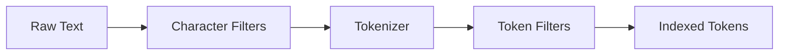
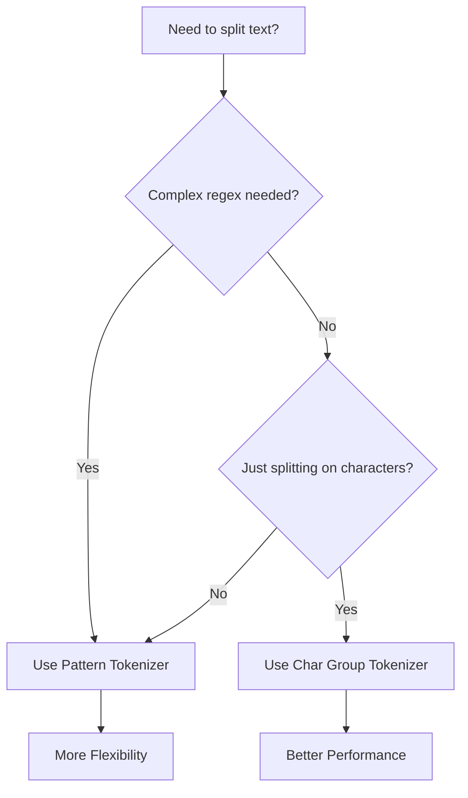
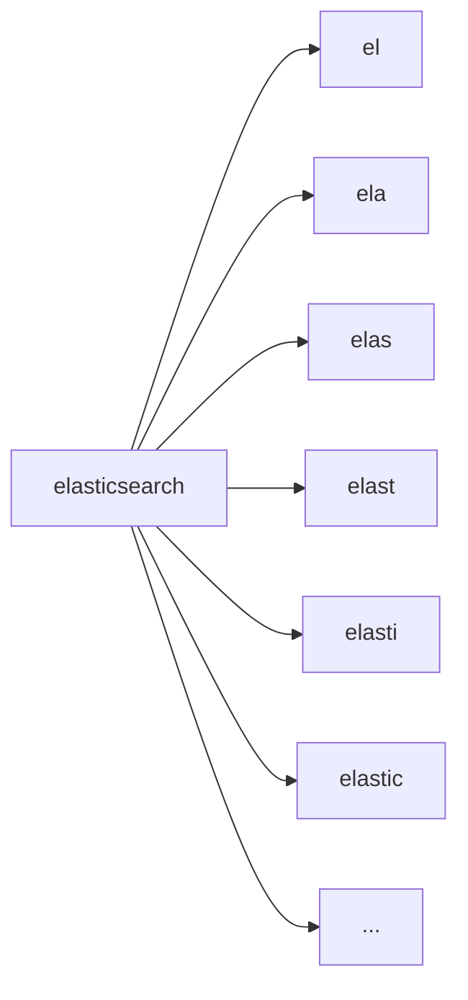
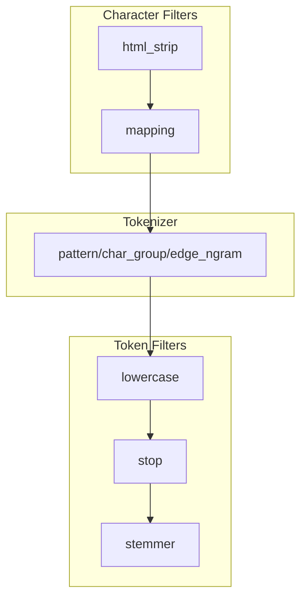

# How to Build Elasticsearch Custom Tokenizers

Author: [nawazdhandala](https://github.com/nawazdhandala)

Tags: Elasticsearch, Search, Tokenization, Analysis

Description: A practical guide to building custom tokenizers in Elasticsearch for better search relevance and text analysis.

---

Search quality lives and dies by how well you tokenize text. Out of the box, Elasticsearch handles common cases, but real-world data often demands custom tokenization. Log messages, product SKUs, domain-specific formats, and multilingual content all benefit from tailored tokenizers.

This guide walks through the Elasticsearch analysis pipeline and shows you how to build custom tokenizers using patterns, character groups, and edge n-grams.

---

## Table of Contents

1. Understanding the Analysis Pipeline
2. Standard Tokenizer Limitations
3. Pattern Tokenizer
4. Char Group Tokenizer
5. Edge N-gram Tokenizer
6. Combining Tokenizers with Filters
7. Testing Your Analyzer
8. Production Index Settings
9. Common Use Cases
10. Performance Considerations

---

## 1. Understanding the Analysis Pipeline

Before diving into custom tokenizers, you need to understand how Elasticsearch processes text. The analysis pipeline has three stages:



| Stage | Purpose | Example |
|-------|---------|---------|
| Character Filters | Transform raw text before tokenization | Strip HTML, replace characters |
| Tokenizer | Break text into individual tokens | Split on whitespace, patterns |
| Token Filters | Modify tokens after tokenization | Lowercase, stemming, synonyms |

The tokenizer is the core component. It decides where to split text into searchable units. Everything else refines those decisions.

---

## 2. Standard Tokenizer Limitations

The default `standard` tokenizer works well for natural language:

```json
POST _analyze
{
  "tokenizer": "standard",
  "text": "Quick brown fox jumps"
}
```

Output: `["Quick", "brown", "fox", "jumps"]`

But it struggles with:

- Log formats: `2024-01-15T10:30:00.123Z ERROR [main] Connection failed`
- Product codes: `SKU-ABC-123-XL`
- Paths: `/var/log/nginx/access.log`
- Emails: `user+tag@example.com`

For these, you need custom tokenizers.

---

## 3. Pattern Tokenizer

The pattern tokenizer splits text using a regular expression. You define what separates tokens, not what constitutes them.

### Basic Pattern Tokenizer

Split on non-word characters:

```json
PUT my_index
{
  "settings": {
    "analysis": {
      "tokenizer": {
        "my_pattern_tokenizer": {
          "type": "pattern",
          "pattern": "[^\\w]+",
          "flags": "CASE_INSENSITIVE"
        }
      },
      "analyzer": {
        "my_pattern_analyzer": {
          "type": "custom",
          "tokenizer": "my_pattern_tokenizer",
          "filter": ["lowercase"]
        }
      }
    }
  }
}
```

Test it:

```json
POST my_index/_analyze
{
  "analyzer": "my_pattern_analyzer",
  "text": "SKU-ABC-123-XL"
}
```

Output: `["sku", "abc", "123", "xl"]`

### Log Line Tokenizer

Parse structured log formats:

```json
PUT log_index
{
  "settings": {
    "analysis": {
      "tokenizer": {
        "log_tokenizer": {
          "type": "pattern",
          "pattern": "[\\s\\[\\]]+",
          "flags": ""
        }
      },
      "analyzer": {
        "log_analyzer": {
          "type": "custom",
          "tokenizer": "log_tokenizer",
          "filter": ["lowercase"]
        }
      }
    }
  }
}
```

Input: `ERROR [main-thread] Connection timeout after 30s`

Output: `["error", "main-thread", "connection", "timeout", "after", "30s"]`

### Capturing Groups

Pattern tokenizers can capture specific parts using groups:

```json
PUT email_index
{
  "settings": {
    "analysis": {
      "tokenizer": {
        "email_tokenizer": {
          "type": "pattern",
          "pattern": "([a-zA-Z0-9._%+-]+)@([a-zA-Z0-9.-]+)\\.([a-zA-Z]{2,})",
          "group": 0
        }
      }
    }
  }
}
```

Setting `group` to specific numbers extracts just that capture group as tokens.

---

## 4. Char Group Tokenizer

The char_group tokenizer splits on specified character classes. It is faster than pattern tokenizer because it does not use regex.

### Basic Char Group Tokenizer

```json
PUT path_index
{
  "settings": {
    "analysis": {
      "tokenizer": {
        "path_tokenizer": {
          "type": "char_group",
          "tokenize_on_chars": [
            "/",
            "-",
            "_",
            "."
          ]
        }
      },
      "analyzer": {
        "path_analyzer": {
          "type": "custom",
          "tokenizer": "path_tokenizer",
          "filter": ["lowercase"]
        }
      }
    }
  }
}
```

Test:

```json
POST path_index/_analyze
{
  "analyzer": "path_analyzer",
  "text": "/var/log/nginx/access.log"
}
```

Output: `["var", "log", "nginx", "access", "log"]`

### Using Character Classes

Char group supports predefined character classes:

| Class | Characters |
|-------|------------|
| `whitespace` | Space, tab, newline |
| `letter` | Unicode letters |
| `digit` | 0-9 |
| `punctuation` | Punctuation marks |
| `symbol` | Symbols |

Example splitting on whitespace and punctuation:

```json
PUT mixed_index
{
  "settings": {
    "analysis": {
      "tokenizer": {
        "mixed_tokenizer": {
          "type": "char_group",
          "tokenize_on_chars": [
            "whitespace",
            "punctuation",
            "-",
            "_"
          ]
        }
      }
    }
  }
}
```

### When to Use Char Group Over Pattern



Char group is 2-3x faster for simple splits. Use pattern only when you need regex power.

---

## 5. Edge N-gram Tokenizer

Edge n-grams generate tokens from the beginning of words. They power autocomplete and prefix matching.

### Basic Edge N-gram Setup

```json
PUT autocomplete_index
{
  "settings": {
    "analysis": {
      "tokenizer": {
        "autocomplete_tokenizer": {
          "type": "edge_ngram",
          "min_gram": 2,
          "max_gram": 10,
          "token_chars": ["letter", "digit"]
        }
      },
      "analyzer": {
        "autocomplete_analyzer": {
          "type": "custom",
          "tokenizer": "autocomplete_tokenizer",
          "filter": ["lowercase"]
        }
      }
    }
  }
}
```

Test:

```json
POST autocomplete_index/_analyze
{
  "analyzer": "autocomplete_analyzer",
  "text": "elasticsearch"
}
```

Output: `["el", "ela", "elas", "elast", "elasti", "elastic", "elastics", "elasticse", "elasticsea"]`

### Token Generation Flow



### Autocomplete Index Pattern

For autocomplete, use different analyzers at index and search time:

```json
PUT products
{
  "settings": {
    "analysis": {
      "tokenizer": {
        "autocomplete_tokenizer": {
          "type": "edge_ngram",
          "min_gram": 2,
          "max_gram": 15,
          "token_chars": ["letter", "digit"]
        }
      },
      "analyzer": {
        "autocomplete_index": {
          "type": "custom",
          "tokenizer": "autocomplete_tokenizer",
          "filter": ["lowercase"]
        },
        "autocomplete_search": {
          "type": "custom",
          "tokenizer": "standard",
          "filter": ["lowercase"]
        }
      }
    }
  },
  "mappings": {
    "properties": {
      "name": {
        "type": "text",
        "analyzer": "autocomplete_index",
        "search_analyzer": "autocomplete_search"
      }
    }
  }
}
```

This indexes edge n-grams but searches with the full term. Typing "elast" matches documents containing "elasticsearch" without generating n-grams at query time.

### Edge N-gram Parameters

| Parameter | Description | Default |
|-----------|-------------|---------|
| `min_gram` | Minimum token length | 1 |
| `max_gram` | Maximum token length | 2 |
| `token_chars` | Character classes to include | All |

Character classes for `token_chars`:
- `letter`
- `digit`
- `whitespace`
- `punctuation`
- `symbol`
- `custom` (with `custom_token_chars`)

---

## 6. Combining Tokenizers with Filters

Tokenizers work best when combined with character filters and token filters.

### Full Analysis Chain



### Example: Product Search Analyzer

```json
PUT product_index
{
  "settings": {
    "analysis": {
      "char_filter": {
        "normalize_hyphens": {
          "type": "mapping",
          "mappings": [
            "- => _",
            "/ => _"
          ]
        }
      },
      "tokenizer": {
        "product_tokenizer": {
          "type": "char_group",
          "tokenize_on_chars": ["whitespace", "_"]
        }
      },
      "filter": {
        "product_synonyms": {
          "type": "synonym",
          "synonyms": [
            "laptop, notebook",
            "phone, mobile, smartphone"
          ]
        }
      },
      "analyzer": {
        "product_analyzer": {
          "type": "custom",
          "char_filter": ["normalize_hyphens"],
          "tokenizer": "product_tokenizer",
          "filter": [
            "lowercase",
            "product_synonyms",
            "asciifolding"
          ]
        }
      }
    }
  }
}
```

Test:

```json
POST product_index/_analyze
{
  "analyzer": "product_analyzer",
  "text": "MacBook-Pro/2024 laptop"
}
```

Output: `["macbook", "pro", "2024", "laptop", "notebook"]`

### Example: Log Analysis Pipeline

```json
PUT logs
{
  "settings": {
    "analysis": {
      "char_filter": {
        "strip_brackets": {
          "type": "pattern_replace",
          "pattern": "[\\[\\]]",
          "replacement": " "
        }
      },
      "tokenizer": {
        "log_tokenizer": {
          "type": "pattern",
          "pattern": "[\\s,;:=]+",
          "flags": ""
        }
      },
      "filter": {
        "log_stop": {
          "type": "stop",
          "stopwords": ["the", "a", "an", "is", "at", "to"]
        }
      },
      "analyzer": {
        "log_analyzer": {
          "type": "custom",
          "char_filter": ["strip_brackets"],
          "tokenizer": "log_tokenizer",
          "filter": ["lowercase", "log_stop"]
        }
      }
    }
  }
}
```

---

## 7. Testing Your Analyzer

Always test analyzers before deploying to production.

### Analyze API

```json
POST my_index/_analyze
{
  "analyzer": "my_analyzer",
  "text": "Sample text to analyze"
}
```

### Explain Mode

Get detailed token information:

```json
POST my_index/_analyze
{
  "analyzer": "my_analyzer",
  "text": "elasticsearch custom tokenizer",
  "explain": true
}
```

This shows position, start/end offsets, and which filter produced each token.

### Test with Real Data

Before going live, test with actual data samples:

```bash
# Extract sample data
curl -s "localhost:9200/production_index/_search?size=100" | \
  jq -r '.hits.hits[]._source.text_field' > samples.txt

# Test each sample
while read line; do
  curl -s -X POST "localhost:9200/test_index/_analyze" \
    -H "Content-Type: application/json" \
    -d "{\"analyzer\": \"my_analyzer\", \"text\": \"$line\"}"
done < samples.txt
```

---

## 8. Production Index Settings

Complete example with multiple analyzers:

```json
PUT production_search
{
  "settings": {
    "number_of_shards": 3,
    "number_of_replicas": 1,
    "analysis": {
      "char_filter": {
        "strip_html": {
          "type": "html_strip"
        },
        "normalize_special": {
          "type": "mapping",
          "mappings": [
            "& => and",
            "@ => at",
            "# => number"
          ]
        }
      },
      "tokenizer": {
        "path_tokenizer": {
          "type": "char_group",
          "tokenize_on_chars": ["/", "\\\\", "-", "_", "."]
        },
        "autocomplete_tokenizer": {
          "type": "edge_ngram",
          "min_gram": 2,
          "max_gram": 20,
          "token_chars": ["letter", "digit"]
        },
        "code_tokenizer": {
          "type": "pattern",
          "pattern": "[^a-zA-Z0-9]+",
          "flags": ""
        }
      },
      "filter": {
        "english_stop": {
          "type": "stop",
          "stopwords": "_english_"
        },
        "english_stemmer": {
          "type": "stemmer",
          "language": "english"
        },
        "tech_synonyms": {
          "type": "synonym",
          "synonyms": [
            "k8s, kubernetes",
            "js, javascript",
            "ts, typescript",
            "db, database"
          ]
        }
      },
      "analyzer": {
        "default_analyzer": {
          "type": "custom",
          "char_filter": ["strip_html", "normalize_special"],
          "tokenizer": "standard",
          "filter": ["lowercase", "english_stop", "english_stemmer"]
        },
        "path_analyzer": {
          "type": "custom",
          "tokenizer": "path_tokenizer",
          "filter": ["lowercase"]
        },
        "autocomplete_analyzer": {
          "type": "custom",
          "tokenizer": "autocomplete_tokenizer",
          "filter": ["lowercase"]
        },
        "code_analyzer": {
          "type": "custom",
          "tokenizer": "code_tokenizer",
          "filter": ["lowercase", "tech_synonyms"]
        },
        "search_analyzer": {
          "type": "custom",
          "tokenizer": "standard",
          "filter": ["lowercase", "english_stop", "tech_synonyms"]
        }
      }
    }
  },
  "mappings": {
    "properties": {
      "title": {
        "type": "text",
        "analyzer": "default_analyzer",
        "fields": {
          "autocomplete": {
            "type": "text",
            "analyzer": "autocomplete_analyzer",
            "search_analyzer": "search_analyzer"
          }
        }
      },
      "file_path": {
        "type": "text",
        "analyzer": "path_analyzer"
      },
      "code": {
        "type": "text",
        "analyzer": "code_analyzer"
      },
      "description": {
        "type": "text",
        "analyzer": "default_analyzer"
      }
    }
  }
}
```

---

## 9. Common Use Cases

### URL and Path Search

```json
{
  "tokenizer": {
    "url_tokenizer": {
      "type": "char_group",
      "tokenize_on_chars": ["/", "?", "&", "=", ":", "."]
    }
  }
}
```

Input: `https://api.example.com/v2/users?limit=100`

Output: `["https", "api", "example", "com", "v2", "users", "limit", "100"]`

### Camel Case Splitting

```json
{
  "tokenizer": {
    "camel_tokenizer": {
      "type": "pattern",
      "pattern": "(?<=[a-z])(?=[A-Z])|(?<=[A-Z])(?=[A-Z][a-z])|[_\\s]+"
    }
  }
}
```

Input: `getUserById` or `HTTPSConnection`

Output: `["get", "User", "By", "Id"]` or `["HTTPS", "Connection"]`

### Email Address Analysis

```json
{
  "tokenizer": {
    "email_tokenizer": {
      "type": "char_group",
      "tokenize_on_chars": ["@", ".", "+"]
    }
  }
}
```

Input: `john.doe+work@company.example.com`

Output: `["john", "doe", "work", "company", "example", "com"]`

### Version Numbers

```json
{
  "tokenizer": {
    "version_tokenizer": {
      "type": "pattern",
      "pattern": "[.\\-v]+",
      "flags": "CASE_INSENSITIVE"
    }
  }
}
```

Input: `v2.14.3-beta`

Output: `["2", "14", "3", "beta"]`

---

## 10. Performance Considerations

### Tokenizer Performance Comparison

| Tokenizer | Relative Speed | Use Case |
|-----------|---------------|----------|
| whitespace | Fastest | Simple splits |
| char_group | Fast | Character-based splits |
| standard | Medium | Natural language |
| pattern | Slower | Complex regex needs |
| edge_ngram | Slowest at index | Autocomplete |

### Memory Impact

Edge n-grams expand index size significantly:

```
Original token: "elasticsearch" (13 chars)
Edge n-grams (2-10): 9 tokens
Index size multiplier: ~5-10x for text fields
```

Mitigate by:
- Limiting `max_gram` (10-15 is usually enough)
- Using edge n-grams only on specific fields
- Setting appropriate `token_chars` to skip unwanted characters

### Indexing Throughput

Complex analyzers slow indexing. Profile with:

```json
POST _nodes/hot_threads
```

If analysis is the bottleneck:
1. Simplify regex patterns
2. Use char_group instead of pattern where possible
3. Reduce max_gram values
4. Remove unnecessary token filters

### Query Performance

Search-time analysis adds latency. For autocomplete:
- Use simple search_analyzer (standard tokenizer)
- Let edge n-grams do the work at index time
- Avoid search-time regex

---

## Summary

| Tokenizer | Best For | Avoid When |
|-----------|----------|------------|
| Pattern | Log parsing, complex formats | Performance is critical |
| Char Group | Paths, codes, structured text | Need regex capture groups |
| Edge N-gram | Autocomplete, prefix search | Index size is constrained |

Building custom tokenizers requires balancing search relevance against index size and performance. Start with the simplest tokenizer that meets your needs, test with real data, and iterate based on actual search patterns.

---

## Related Resources

- [Elasticsearch Analysis Documentation](https://www.elastic.co/guide/en/elasticsearch/reference/current/analysis.html)
- [Token Filters Reference](https://www.elastic.co/guide/en/elasticsearch/reference/current/analysis-tokenfilters.html)
- [Character Filters Reference](https://www.elastic.co/guide/en/elasticsearch/reference/current/analysis-charfilters.html)
