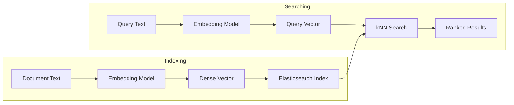
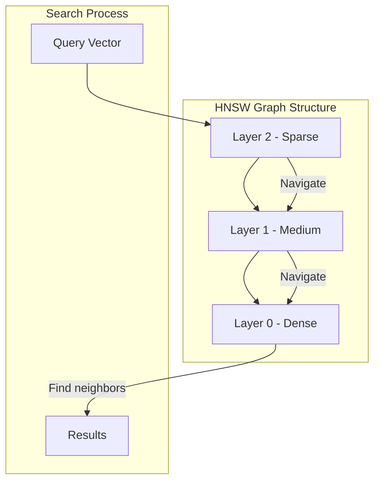
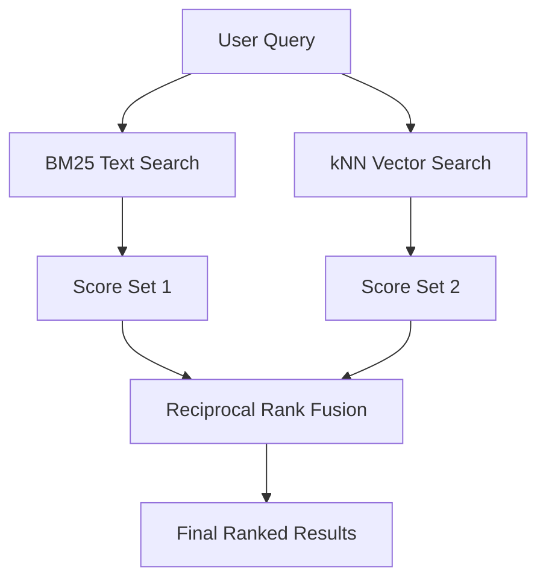

# How to Implement Elasticsearch Dense Vector Search

Author: [nawazdhandala](https://github.com/nawazdhandala)

Tags: Elasticsearch, Vector Search, Embeddings, AI

Description: A practical guide to implementing semantic search in Elasticsearch using dense vectors, covering mapping configuration, HNSW tuning, and hybrid search strategies.

---

Traditional keyword search breaks down when users search for concepts rather than exact terms. Someone searching "how to fix slow API responses" might miss a document titled "optimizing endpoint latency" because the words don't match. Dense vector search solves this by comparing the meaning of queries and documents using numerical representations called embeddings.

Elasticsearch has supported dense vectors since version 7.3, but the real power came with native kNN search in 8.0. This guide walks through the complete implementation from mapping to production-ready hybrid search.

## How Dense Vector Search Works

The core idea is simple: convert text into fixed-length arrays of numbers (vectors) where similar meanings produce similar vectors. At search time, find the vectors closest to the query vector.



The embedding model is the critical piece. Options include:

- **OpenAI text-embedding-3-small/large**: High quality, requires API calls
- **Sentence Transformers**: Self-hosted, models like `all-MiniLM-L6-v2` work well
- **Cohere Embed**: Good multilingual support
- **E5/BGE models**: Open source, competitive quality

## Setting Up the Dense Vector Mapping

Start with the index mapping. The `dense_vector` field type stores the embeddings.

```json
PUT /documents
{
  "mappings": {
    "properties": {
      "title": {
        "type": "text",
        "analyzer": "english"
      },
      "content": {
        "type": "text",
        "analyzer": "english"
      },
      "content_vector": {
        "type": "dense_vector",
        "dims": 384,
        "index": true,
        "similarity": "cosine"
      },
      "category": {
        "type": "keyword"
      },
      "created_at": {
        "type": "date"
      }
    }
  }
}
```

Key parameters:

- **dims**: Must match your embedding model's output dimension. Common values are 384 (MiniLM), 768 (BERT-based), 1536 (OpenAI ada-002), or 3072 (OpenAI text-embedding-3-large).
- **index**: Set to `true` to enable kNN search. Without this, you can only use exact brute-force search.
- **similarity**: The distance function. Options are `cosine`, `dot_product`, and `l2_norm`.

### Choosing the Right Similarity Function

| Similarity | When to Use | Notes |
|------------|-------------|-------|
| `cosine` | Most embedding models | Normalizes vectors, handles varying magnitudes |
| `dot_product` | Normalized vectors, when you need raw scores | Faster than cosine, but requires pre-normalized vectors |
| `l2_norm` | When Euclidean distance matters | Less common for text embeddings |

Most text embedding models are trained with cosine similarity in mind. Stick with `cosine` unless you have a specific reason to change.

## Configuring HNSW for Performance

Elasticsearch uses HNSW (Hierarchical Navigable Small World) graphs for approximate nearest neighbor search. The algorithm trades some accuracy for massive speed improvements on large datasets.

```json
PUT /documents
{
  "mappings": {
    "properties": {
      "content_vector": {
        "type": "dense_vector",
        "dims": 384,
        "index": true,
        "similarity": "cosine",
        "index_options": {
          "type": "hnsw",
          "m": 16,
          "ef_construction": 100
        }
      }
    }
  }
}
```

### HNSW Parameters Explained



**m (default: 16)**
- Controls the number of bi-directional links per node
- Higher values improve recall but increase memory usage and indexing time
- Range: 4-64, typical production value: 16-32

**ef_construction (default: 100)**
- Controls index quality during build time
- Higher values create better graphs but slow down indexing
- Range: 50-500, typical production value: 100-200

### Tuning Guidelines

| Dataset Size | m | ef_construction | Memory Impact |
|--------------|---|-----------------|---------------|
| < 100K docs | 16 | 100 | Baseline |
| 100K - 1M docs | 24 | 150 | ~1.5x baseline |
| 1M - 10M docs | 32 | 200 | ~2x baseline |
| > 10M docs | 48 | 200 | ~3x baseline |

Test with your actual data. The right values depend on your recall requirements and hardware constraints.

## Indexing Documents with Vectors

Generate embeddings before indexing. Here's a Python example using Sentence Transformers:

```python
from sentence_transformers import SentenceTransformer
from elasticsearch import Elasticsearch

# Initialize
model = SentenceTransformer('all-MiniLM-L6-v2')
es = Elasticsearch(['http://localhost:9200'])

# Generate embedding and index
def index_document(doc_id, title, content, category):
    # Combine title and content for embedding
    text = f"{title} {content}"
    vector = model.encode(text).tolist()

    es.index(
        index='documents',
        id=doc_id,
        document={
            'title': title,
            'content': content,
            'content_vector': vector,
            'category': category,
            'created_at': '2026-01-30'
        }
    )

# Bulk indexing for better performance
def bulk_index(documents):
    from elasticsearch.helpers import bulk

    actions = []
    for doc in documents:
        text = f"{doc['title']} {doc['content']}"
        vector = model.encode(text).tolist()

        actions.append({
            '_index': 'documents',
            '_id': doc['id'],
            '_source': {
                'title': doc['title'],
                'content': doc['content'],
                'content_vector': vector,
                'category': doc['category'],
                'created_at': doc['created_at']
            }
        })

    bulk(es, actions)
```

For production workloads, batch your embedding generation. Most models can process multiple texts efficiently:

```python
# Batch encoding is much faster
texts = [f"{d['title']} {d['content']}" for d in documents]
vectors = model.encode(texts, batch_size=32, show_progress_bar=True)
```

## Running kNN Searches

The basic kNN query finds the k nearest vectors:

```json
GET /documents/_search
{
  "knn": {
    "field": "content_vector",
    "query_vector": [0.1, 0.2, 0.3, ...],
    "k": 10,
    "num_candidates": 100
  }
}
```

Parameters:

- **k**: Number of results to return
- **num_candidates**: How many candidates to consider per shard. Higher values improve recall but slow down search. Rule of thumb: start with `k * 10`.

### Searching with a Query String

In practice, you'll embed the query first:

```python
def search(query_text, k=10):
    query_vector = model.encode(query_text).tolist()

    response = es.search(
        index='documents',
        knn={
            'field': 'content_vector',
            'query_vector': query_vector,
            'k': k,
            'num_candidates': 100
        }
    )

    return response['hits']['hits']
```

### Adding Filters

Combine kNN with traditional filters using the `filter` clause:

```json
GET /documents/_search
{
  "knn": {
    "field": "content_vector",
    "query_vector": [0.1, 0.2, 0.3, ...],
    "k": 10,
    "num_candidates": 100,
    "filter": {
      "bool": {
        "must": [
          { "term": { "category": "technical" } },
          { "range": { "created_at": { "gte": "2025-01-01" } } }
        ]
      }
    }
  }
}
```

Filters are applied before the kNN search, reducing the candidate pool. This improves performance when filtering down to a small subset.

## Implementing Hybrid Search

Pure vector search misses exact keyword matches. Hybrid search combines BM25 (traditional) with kNN (semantic) for better results.



### Using Reciprocal Rank Fusion (RRF)

Elasticsearch 8.8+ supports RRF natively:

```json
GET /documents/_search
{
  "retriever": {
    "rrf": {
      "retrievers": [
        {
          "standard": {
            "query": {
              "multi_match": {
                "query": "fix slow API responses",
                "fields": ["title^2", "content"]
              }
            }
          }
        },
        {
          "knn": {
            "field": "content_vector",
            "query_vector": [0.1, 0.2, 0.3, ...],
            "k": 20,
            "num_candidates": 100
          }
        }
      ],
      "rank_constant": 60,
      "rank_window_size": 100
    }
  },
  "size": 10
}
```

RRF parameters:

- **rank_constant**: Controls how much weight lower-ranked results get. Default 60 works well for most cases.
- **rank_window_size**: How many results from each retriever to consider for fusion.

### Manual Hybrid Search (Pre-8.8)

For older Elasticsearch versions, implement hybrid search manually:

```python
def hybrid_search(query_text, k=10, bm25_weight=0.3, vector_weight=0.7):
    query_vector = model.encode(query_text).tolist()

    response = es.search(
        index='documents',
        query={
            "script_score": {
                "query": {
                    "bool": {
                        "should": [
                            {
                                "multi_match": {
                                    "query": query_text,
                                    "fields": ["title^2", "content"]
                                }
                            }
                        ]
                    }
                },
                "script": {
                    "source": """
                        double bm25 = _score;
                        double vector = cosineSimilarity(params.query_vector, 'content_vector') + 1.0;
                        return params.bm25_weight * bm25 + params.vector_weight * vector;
                    """,
                    "params": {
                        "query_vector": query_vector,
                        "bm25_weight": bm25_weight,
                        "vector_weight": vector_weight
                    }
                }
            }
        },
        size=k
    )

    return response['hits']['hits']
```

Note: Script-based approaches are slower than native RRF. Upgrade to 8.8+ if possible.

## Production Considerations

### Memory Requirements

Dense vectors consume significant memory:

```
Memory per vector = dims * 4 bytes (float32)
Total = num_documents * memory_per_vector * replication_factor
```

For 1 million documents with 384-dimension vectors:
- Per vector: 384 * 4 = 1,536 bytes
- Total: 1M * 1,536 = 1.46 GB (before HNSW overhead)
- With HNSW (m=16): approximately 2-3 GB

Plan your cluster sizing accordingly.

### Quantization for Large Datasets

Elasticsearch 8.12+ supports int8 quantization to reduce memory:

```json
PUT /documents
{
  "mappings": {
    "properties": {
      "content_vector": {
        "type": "dense_vector",
        "dims": 384,
        "index": true,
        "similarity": "cosine",
        "index_options": {
          "type": "int8_hnsw",
          "m": 16,
          "ef_construction": 100
        }
      }
    }
  }
}
```

This reduces memory by 4x with minimal recall impact (typically < 1% degradation).

### Index Lifecycle

Vector indices grow linearly. Consider:

1. **Time-based indices**: Roll over monthly/weekly for easier management
2. **Force merge**: Run `_forcemerge` after bulk indexing to optimize the HNSW graph
3. **Snapshot regularly**: Vector indices can take hours to rebuild

```bash
# Force merge after bulk indexing
POST /documents/_forcemerge?max_num_segments=1
```

### Monitoring Performance

Track these metrics:

- **Search latency (p50, p95, p99)**: kNN should complete in < 100ms for most use cases
- **Recall**: Compare kNN results against exact brute-force on a sample
- **Memory pressure**: Watch for JVM heap issues as indices grow

## Complete Example: Semantic Search API

Putting it all together:

```python
from flask import Flask, request, jsonify
from sentence_transformers import SentenceTransformer
from elasticsearch import Elasticsearch

app = Flask(__name__)
model = SentenceTransformer('all-MiniLM-L6-v2')
es = Elasticsearch(['http://localhost:9200'])

@app.route('/search', methods=['POST'])
def search():
    data = request.json
    query = data.get('query')
    filters = data.get('filters', {})
    k = data.get('k', 10)
    search_type = data.get('type', 'hybrid')  # 'vector', 'keyword', or 'hybrid'

    query_vector = model.encode(query).tolist()

    if search_type == 'vector':
        body = {
            'knn': {
                'field': 'content_vector',
                'query_vector': query_vector,
                'k': k,
                'num_candidates': k * 10
            }
        }
    elif search_type == 'keyword':
        body = {
            'query': {
                'multi_match': {
                    'query': query,
                    'fields': ['title^2', 'content']
                }
            },
            'size': k
        }
    else:  # hybrid
        body = {
            'retriever': {
                'rrf': {
                    'retrievers': [
                        {
                            'standard': {
                                'query': {
                                    'multi_match': {
                                        'query': query,
                                        'fields': ['title^2', 'content']
                                    }
                                }
                            }
                        },
                        {
                            'knn': {
                                'field': 'content_vector',
                                'query_vector': query_vector,
                                'k': k * 2,
                                'num_candidates': k * 10
                            }
                        }
                    ],
                    'rank_window_size': k * 5
                }
            },
            'size': k
        }

    # Add filters if provided
    if filters and 'knn' in body:
        filter_clauses = []
        if 'category' in filters:
            filter_clauses.append({'term': {'category': filters['category']}})
        if 'date_from' in filters:
            filter_clauses.append({'range': {'created_at': {'gte': filters['date_from']}}})

        if filter_clauses:
            body['knn']['filter'] = {'bool': {'must': filter_clauses}}

    response = es.search(index='documents', body=body)

    results = []
    for hit in response['hits']['hits']:
        results.append({
            'id': hit['_id'],
            'score': hit['_score'],
            'title': hit['_source']['title'],
            'content': hit['_source']['content'][:200] + '...'
        })

    return jsonify({'results': results})

if __name__ == '__main__':
    app.run(port=5000)
```

## Summary

Dense vector search transforms how users find information. Start with these steps:

1. Choose an embedding model that fits your latency and quality needs
2. Create a mapping with `dense_vector` field and appropriate HNSW settings
3. Batch index documents with pre-computed embeddings
4. Use hybrid search (RRF) for the best results
5. Monitor memory usage and search latency as you scale

Vector search is not a replacement for keyword search. The combination of both through hybrid search gives users the precision of keyword matching with the flexibility of semantic understanding.
