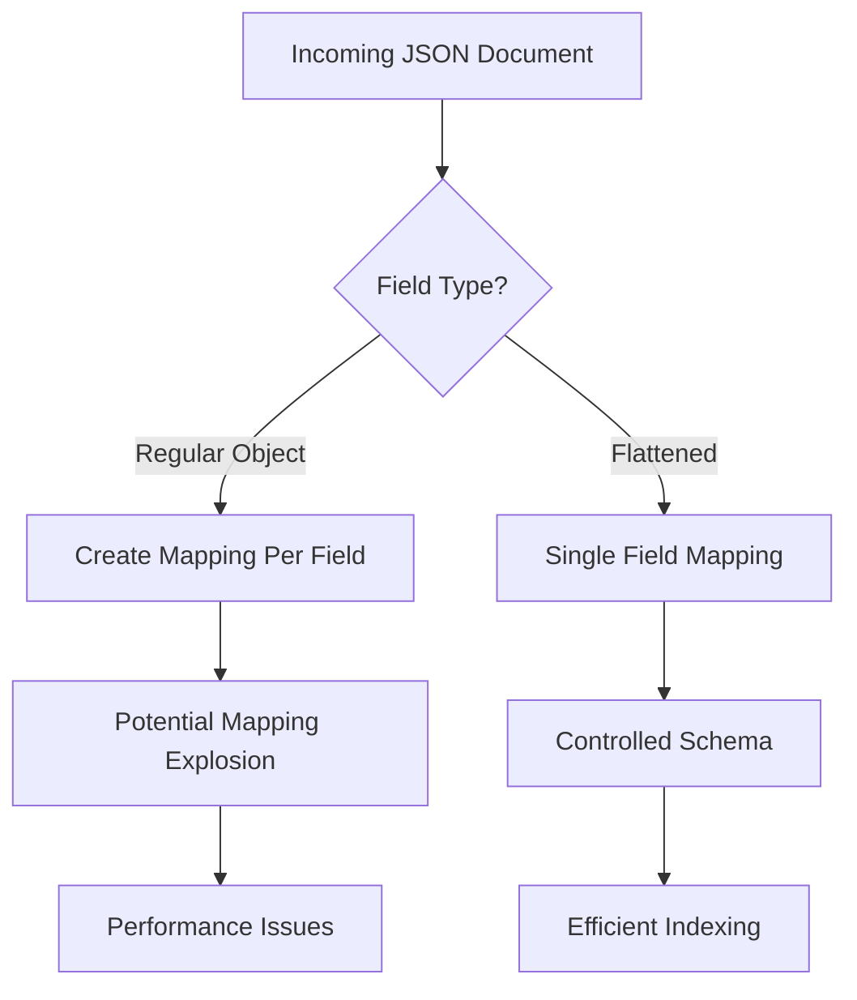
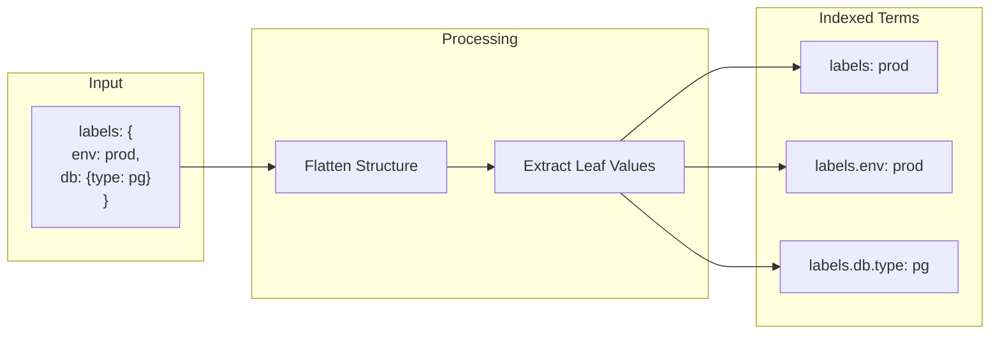
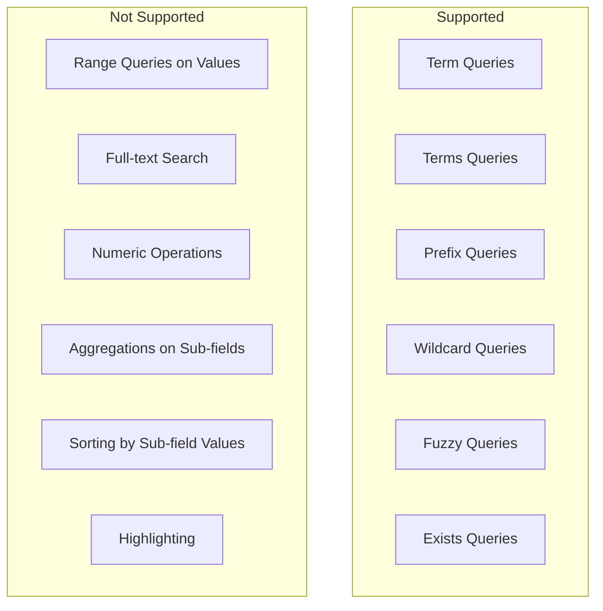
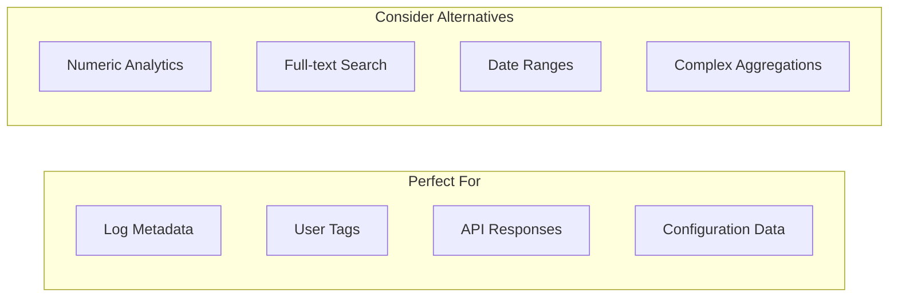

# How to Create Elasticsearch Flattened Fields

Author: [nawazdhandala](https://github.com/nawazdhandala)

Tags: Elasticsearch, Flattened Fields, Dynamic Mapping, Schema

Description: Learn to implement Elasticsearch flattened fields for arbitrary JSON with mapping explosion prevention and efficient keyword search.

---

When dealing with dynamic or unpredictable JSON data in Elasticsearch, you may encounter the infamous "mapping explosion" problem. This happens when documents contain hundreds or thousands of unique field names, causing Elasticsearch to create mappings for each one. The **flattened** field type provides an elegant solution to this challenge.

## What is the Flattened Field Type?

The flattened field type allows you to index an entire JSON object as a single field. Instead of creating separate mappings for each nested key, Elasticsearch treats all leaf values as keywords within one field. This is particularly useful for:

- Logging systems with arbitrary metadata
- User-defined attributes or tags
- External API responses with unpredictable structures
- Any scenario where field names are dynamic



## Creating a Flattened Field Mapping

Let us start by creating an index with a flattened field for storing dynamic labels or metadata.

### Basic Mapping Definition

```json
PUT /my-application-logs
{
  "mappings": {
    "properties": {
      "timestamp": {
        "type": "date"
      },
      "message": {
        "type": "text"
      },
      "severity": {
        "type": "keyword"
      },
      "labels": {
        "type": "flattened"
      }
    }
  }
}
```

In this example, the `labels` field can accept any JSON object structure without requiring predefined mappings.

### Indexing Documents with Dynamic Data

Now you can index documents with varying label structures:

```json
POST /my-application-logs/_doc
{
  "timestamp": "2026-01-30T10:15:00Z",
  "message": "Application started successfully",
  "severity": "info",
  "labels": {
    "environment": "production",
    "region": "us-east-1",
    "service": "payment-gateway",
    "version": "2.4.1"
  }
}

POST /my-application-logs/_doc
{
  "timestamp": "2026-01-30T10:16:00Z",
  "message": "Database connection established",
  "severity": "info",
  "labels": {
    "environment": "production",
    "database": {
      "type": "postgresql",
      "host": "db-primary.internal",
      "pool_size": "25"
    },
    "custom_metric": "connection_time_ms_45"
  }
}
```

Notice how the second document has a completely different structure in the `labels` field, including nested objects. Both documents index successfully without any mapping conflicts.

## How Flattened Fields Work Internally

Understanding the internal mechanics helps you write better queries and set appropriate expectations.



Elasticsearch flattens the nested structure and indexes:
1. The leaf values themselves (e.g., "prod", "pg")
2. The full dotted path with values (e.g., "labels.env: prod")

All values are indexed as **keywords**, meaning they support exact match queries but not full-text search or range queries on numeric values.

## Query Patterns for Flattened Fields

### Simple Term Query

Search for any document where labels contain a specific value:

```json
GET /my-application-logs/_search
{
  "query": {
    "term": {
      "labels": "production"
    }
  }
}
```

This matches documents where any leaf value in the labels field equals "production".

### Querying Specific Keys

To query a specific key within the flattened field:

```json
GET /my-application-logs/_search
{
  "query": {
    "term": {
      "labels.environment": "production"
    }
  }
}
```

### Nested Key Queries

For nested structures, use the full dotted path:

```json
GET /my-application-logs/_search
{
  "query": {
    "term": {
      "labels.database.type": "postgresql"
    }
  }
}
```

### Boolean Combinations

Combine multiple conditions on flattened fields:

```json
GET /my-application-logs/_search
{
  "query": {
    "bool": {
      "must": [
        { "term": { "labels.environment": "production" } },
        { "term": { "labels.region": "us-east-1" } }
      ],
      "filter": [
        { "range": { "timestamp": { "gte": "2026-01-30T00:00:00Z" } } }
      ]
    }
  }
}
```

### Wildcard Queries

You can use wildcard queries on flattened field values:

```json
GET /my-application-logs/_search
{
  "query": {
    "wildcard": {
      "labels.service": "payment-*"
    }
  }
}
```

### Prefix Queries

Prefix queries work efficiently on flattened fields:

```json
GET /my-application-logs/_search
{
  "query": {
    "prefix": {
      "labels.version": "2.4"
    }
  }
}
```

## Configuring Flattened Field Options

The flattened type supports several configuration options:

```json
PUT /configured-logs
{
  "mappings": {
    "properties": {
      "metadata": {
        "type": "flattened",
        "depth_limit": 5,
        "ignore_above": 256,
        "doc_values": true,
        "index": true,
        "null_value": "NULL",
        "similarity": "BM25"
      }
    }
  }
}
```

### Configuration Options Explained

| Option | Default | Description |
|--------|---------|-------------|
| `depth_limit` | 20 | Maximum allowed depth of nested objects |
| `ignore_above` | 2147483647 | Strings longer than this value will not be indexed |
| `doc_values` | true | Whether to store field values in column-stride storage for sorting and aggregations |
| `index` | true | Whether the field should be searchable |
| `null_value` | null | Value to substitute for explicit null values |
| `similarity` | BM25 | Scoring algorithm to use |

## Limitations of Flattened Fields

Understanding the limitations helps you decide when to use flattened fields.



### Key Limitations

1. **No Range Queries on Values**: Since all values are indexed as keywords, you cannot perform numeric or date range queries.

```json
// This will NOT work as expected
GET /my-application-logs/_search
{
  "query": {
    "range": {
      "labels.pool_size": {
        "gte": 10,
        "lte": 50
      }
    }
  }
}
```

2. **No Full-text Analysis**: Values are not analyzed, so full-text search capabilities like stemming, synonyms, or relevance scoring based on term frequency are unavailable.

3. **Limited Aggregations**: You can aggregate on the entire flattened field but not on specific sub-fields.

```json
// This works - aggregating on all leaf values
GET /my-application-logs/_search
{
  "size": 0,
  "aggs": {
    "all_label_values": {
      "terms": {
        "field": "labels"
      }
    }
  }
}

// This also works - aggregating on a specific path
GET /my-application-logs/_search
{
  "size": 0,
  "aggs": {
    "environments": {
      "terms": {
        "field": "labels.environment"
      }
    }
  }
}
```

4. **No Sorting by Nested Values**: You cannot sort results by values within the flattened field.

5. **Case Sensitivity**: All queries are case-sensitive since values are stored as-is without analysis.

## Use Cases and Best Practices

### Ideal Use Cases



### Example: Kubernetes Pod Labels

Kubernetes pod labels are a perfect fit for flattened fields:

```json
PUT /kubernetes-pods
{
  "mappings": {
    "properties": {
      "pod_name": { "type": "keyword" },
      "namespace": { "type": "keyword" },
      "status": { "type": "keyword" },
      "created_at": { "type": "date" },
      "labels": { "type": "flattened" },
      "annotations": { "type": "flattened" }
    }
  }
}

POST /kubernetes-pods/_doc
{
  "pod_name": "frontend-deployment-7d8f9c6b5-x2k4j",
  "namespace": "production",
  "status": "Running",
  "created_at": "2026-01-30T08:00:00Z",
  "labels": {
    "app": "frontend",
    "version": "3.2.1",
    "team": "web-platform",
    "environment": "production",
    "tier": "frontend"
  },
  "annotations": {
    "kubernetes.io/change-cause": "Image updated to v3.2.1",
    "prometheus.io/scrape": "true",
    "prometheus.io/port": "9090"
  }
}
```

Query pods by any label combination:

```json
GET /kubernetes-pods/_search
{
  "query": {
    "bool": {
      "must": [
        { "term": { "labels.team": "web-platform" } },
        { "term": { "labels.environment": "production" } }
      ]
    }
  }
}
```

### Example: E-commerce Product Attributes

Products with variable attributes benefit from flattened fields:

```json
PUT /products
{
  "mappings": {
    "properties": {
      "sku": { "type": "keyword" },
      "name": { "type": "text" },
      "category": { "type": "keyword" },
      "price": { "type": "float" },
      "attributes": { "type": "flattened" }
    }
  }
}

POST /products/_doc
{
  "sku": "LAPTOP-001",
  "name": "Professional Laptop 15 inch",
  "category": "electronics",
  "price": 1299.99,
  "attributes": {
    "brand": "TechCorp",
    "screen_size": "15.6 inches",
    "processor": "Intel Core i7",
    "ram": "16GB",
    "storage": "512GB SSD",
    "graphics": "NVIDIA RTX 3060",
    "color": "Space Gray"
  }
}

POST /products/_doc
{
  "sku": "TSHIRT-001",
  "name": "Cotton T-Shirt",
  "category": "apparel",
  "price": 29.99,
  "attributes": {
    "brand": "FashionCo",
    "size": "Large",
    "color": "Navy Blue",
    "material": "100% Cotton",
    "fit": "Regular"
  }
}
```

### Best Practices Summary

1. **Use for Truly Dynamic Data**: Reserve flattened fields for data where field names are unpredictable or user-defined.

2. **Keep Values Short**: Since `ignore_above` affects indexing, keep values concise.

3. **Combine with Regular Fields**: Use flattened fields alongside typed fields for data that needs range queries or full-text search.

4. **Set Appropriate Depth Limits**: If you know your data structure, set `depth_limit` to prevent deeply nested abuse.

5. **Consider Query Patterns**: If you frequently need to aggregate or sort by specific attributes, those might be better as dedicated fields.

## Migrating to Flattened Fields

If you have an existing index suffering from mapping explosion, here is a migration approach:

```json
// Step 1: Create new index with flattened field
PUT /my-logs-v2
{
  "mappings": {
    "properties": {
      "timestamp": { "type": "date" },
      "message": { "type": "text" },
      "metadata": { "type": "flattened" }
    }
  }
}

// Step 2: Reindex data
POST /_reindex
{
  "source": {
    "index": "my-logs-v1"
  },
  "dest": {
    "index": "my-logs-v2"
  },
  "script": {
    "source": """
      // Move dynamic fields to metadata
      ctx._source.metadata = ctx._source.custom_fields;
      ctx._source.remove('custom_fields');
    """
  }
}

// Step 3: Create alias pointing to new index
POST /_aliases
{
  "actions": [
    { "remove": { "index": "my-logs-v1", "alias": "my-logs" } },
    { "add": { "index": "my-logs-v2", "alias": "my-logs" } }
  ]
}
```

## Conclusion

Elasticsearch flattened fields provide a powerful solution for handling dynamic JSON data without suffering from mapping explosion. They are ideal for logging metadata, user-defined tags, and any scenario where field names are unpredictable.

Key takeaways:

- Flattened fields index entire JSON objects as single fields
- All leaf values are stored as keywords, enabling exact match queries
- Query specific paths using dot notation (e.g., `labels.environment`)
- Limitations include no range queries, no full-text search, and limited aggregations
- Best suited for truly dynamic data that does not require numeric operations

By understanding when and how to use flattened fields, you can build more resilient Elasticsearch schemas that gracefully handle dynamic data while maintaining performance and stability.
