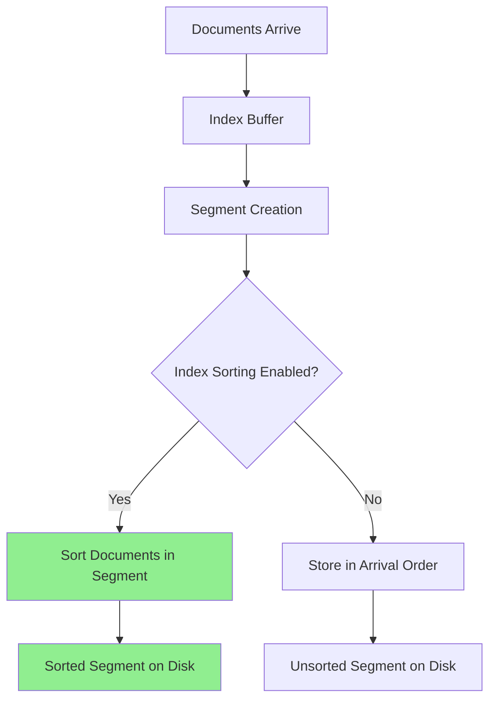
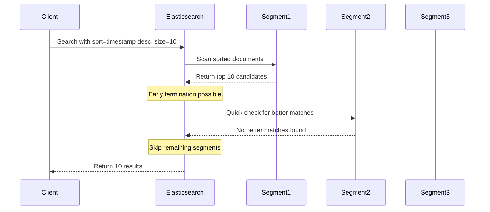
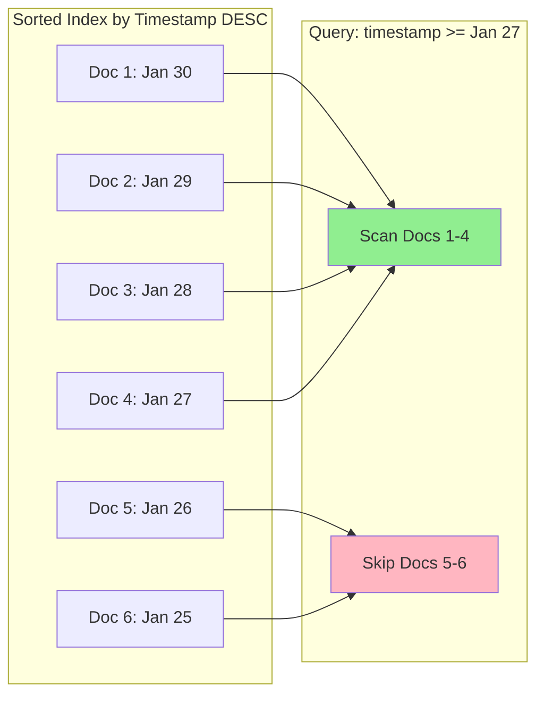
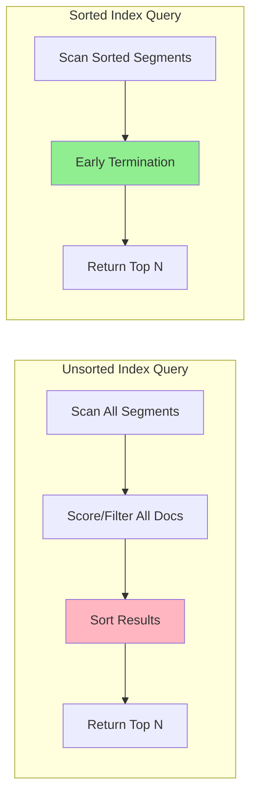
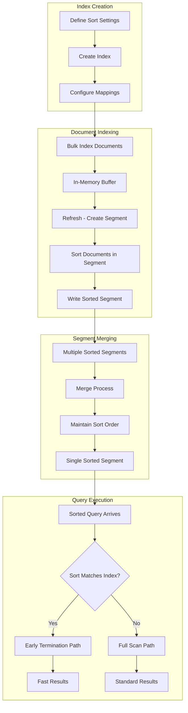
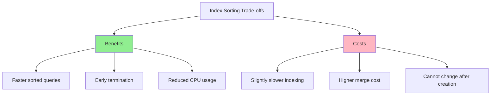

# How to Build Elasticsearch Index Sorting

Author: [nawazdhandala](https://github.com/nawazdhandala)

Tags: Elasticsearch, Index Sorting, Performance, Query Optimization

Description: Learn to implement Elasticsearch index sorting for early query termination with sort configuration, conjunctions, and performance benefits.

---

## Introduction

Elasticsearch index sorting is a powerful feature that allows you to pre-sort documents at index time rather than at query time. When your index is sorted in the same order as your most common queries, Elasticsearch can terminate searches early - significantly improving query performance for sorted searches.

In this guide, we will explore how to implement index sorting, understand its mechanics, and leverage it for query optimization.

## How Index Sorting Works

When you configure index sorting, Elasticsearch stores documents in a specific order within each segment. This pre-sorting enables the search to stop early once it has collected enough matching documents.



## Configuring Index Sorting

### Basic Index Settings

To enable index sorting, you must configure it when creating the index. Here is a basic example that sorts documents by timestamp in descending order:

```json
PUT /logs-sorted
{
  "settings": {
    "index": {
      "sort.field": "timestamp",
      "sort.order": "desc"
    }
  },
  "mappings": {
    "properties": {
      "timestamp": {
        "type": "date"
      },
      "message": {
        "type": "text"
      },
      "level": {
        "type": "keyword"
      },
      "service": {
        "type": "keyword"
      }
    }
  }
}
```

### Multi-Field Sorting

You can sort by multiple fields for more complex ordering requirements:

```json
PUT /events-sorted
{
  "settings": {
    "index": {
      "sort.field": ["priority", "timestamp"],
      "sort.order": ["desc", "desc"]
    }
  },
  "mappings": {
    "properties": {
      "priority": {
        "type": "integer"
      },
      "timestamp": {
        "type": "date"
      },
      "event_type": {
        "type": "keyword"
      },
      "payload": {
        "type": "object"
      }
    }
  }
}
```

### Available Sort Options

The index sorting configuration supports several options:

| Option | Values | Description |
|--------|--------|-------------|
| `sort.field` | Field name(s) | The field(s) to sort by |
| `sort.order` | `asc`, `desc` | Sort direction |
| `sort.mode` | `min`, `max` | For multi-valued fields |
| `sort.missing` | `_first`, `_last` | Handling of missing values |

Here is a comprehensive configuration example:

```json
PUT /metrics-sorted
{
  "settings": {
    "index": {
      "sort.field": ["host", "timestamp"],
      "sort.order": ["asc", "desc"],
      "sort.missing": ["_last", "_last"]
    }
  },
  "mappings": {
    "properties": {
      "host": {
        "type": "keyword"
      },
      "timestamp": {
        "type": "date"
      },
      "cpu_usage": {
        "type": "float"
      },
      "memory_usage": {
        "type": "float"
      }
    }
  }
}
```

## Early Query Termination

The primary benefit of index sorting is early query termination. When your query sort matches the index sort, Elasticsearch can stop searching after finding enough documents.



### Query Example with Early Termination

When querying a sorted index, ensure your query sort matches the index sort:

```json
GET /logs-sorted/_search
{
  "size": 10,
  "query": {
    "bool": {
      "filter": [
        { "term": { "level": "error" } },
        { "range": { "timestamp": { "gte": "2026-01-01" } } }
      ]
    }
  },
  "sort": [
    { "timestamp": "desc" }
  ],
  "track_total_hits": false
}
```

**Key points:**
- The `sort` matches the index sort order (`timestamp` descending)
- Setting `track_total_hits: false` allows Elasticsearch to skip counting all matches
- Using `filter` context avoids scoring overhead

## Conjunction Optimization

Index sorting enables conjunction optimization for queries that combine multiple conditions. When documents are sorted, Elasticsearch can efficiently skip entire blocks of documents that cannot match.



### Optimized Conjunction Query

```json
GET /logs-sorted/_search
{
  "size": 100,
  "query": {
    "bool": {
      "filter": [
        { "term": { "service": "api-gateway" } },
        { "term": { "level": "error" } },
        { "range": {
            "timestamp": {
              "gte": "2026-01-25",
              "lte": "2026-01-30"
            }
          }
        }
      ]
    }
  },
  "sort": [
    { "timestamp": "desc" }
  ]
}
```

## Performance Comparison

Let us examine the performance difference between sorted and unsorted indices.



### Benchmark Example

Here is a practical comparison using a logs index:

```json
// Create unsorted index
PUT /logs-unsorted
{
  "mappings": {
    "properties": {
      "timestamp": { "type": "date" },
      "level": { "type": "keyword" },
      "message": { "type": "text" }
    }
  }
}

// Create sorted index
PUT /logs-sorted
{
  "settings": {
    "index": {
      "sort.field": "timestamp",
      "sort.order": "desc"
    }
  },
  "mappings": {
    "properties": {
      "timestamp": { "type": "date" },
      "level": { "type": "keyword" },
      "message": { "type": "text" }
    }
  }
}
```

Typical performance improvements:

| Scenario | Unsorted | Sorted | Improvement |
|----------|----------|--------|-------------|
| Top 10 recent logs | 150ms | 15ms | 10x faster |
| Top 100 with filter | 300ms | 45ms | 6.7x faster |
| Aggregation (no sort match) | 200ms | 210ms | No improvement |

## Use Cases

### 1. Time-Series Data

Perfect for logs, metrics, and events where queries typically fetch recent data:

```json
PUT /application-logs
{
  "settings": {
    "index": {
      "sort.field": "timestamp",
      "sort.order": "desc",
      "number_of_shards": 3,
      "number_of_replicas": 1
    }
  },
  "mappings": {
    "properties": {
      "timestamp": { "type": "date" },
      "application": { "type": "keyword" },
      "environment": { "type": "keyword" },
      "level": { "type": "keyword" },
      "message": { "type": "text" },
      "trace_id": { "type": "keyword" }
    }
  }
}
```

### 2. E-commerce Product Listings

Sort by popularity or rating for product searches:

```json
PUT /products-sorted
{
  "settings": {
    "index": {
      "sort.field": ["category", "popularity_score"],
      "sort.order": ["asc", "desc"]
    }
  },
  "mappings": {
    "properties": {
      "category": { "type": "keyword" },
      "popularity_score": { "type": "float" },
      "name": { "type": "text" },
      "price": { "type": "float" },
      "in_stock": { "type": "boolean" }
    }
  }
}
```

### 3. Priority-Based Task Queues

Sort tasks by priority for job processing systems:

```json
PUT /task-queue
{
  "settings": {
    "index": {
      "sort.field": ["priority", "created_at"],
      "sort.order": ["desc", "asc"]
    }
  },
  "mappings": {
    "properties": {
      "priority": { "type": "integer" },
      "created_at": { "type": "date" },
      "status": { "type": "keyword" },
      "task_type": { "type": "keyword" },
      "payload": { "type": "object", "enabled": false }
    }
  }
}
```

## Index Sorting Architecture



## Limitations and Considerations

### When Index Sorting May Not Help

1. **Aggregation queries** - Sorting does not improve aggregation performance
2. **Different sort orders** - Queries with different sort fields see no benefit
3. **Full result sets** - When you need all matching documents
4. **Frequent updates** - Sorted indices have slightly higher indexing overhead

### Field Type Restrictions

Not all field types support index sorting:

```json
// Supported field types
{
  "keyword": "supported",
  "numeric types": "supported (long, integer, short, byte, double, float)",
  "date": "supported",
  "boolean": "supported"
}

// Not supported
{
  "text": "not supported (use keyword instead)",
  "nested": "not supported",
  "object": "not supported"
}
```

### Memory and Performance Trade-offs



## Best Practices

### 1. Analyze Query Patterns First

Before implementing index sorting, analyze your most common queries:

```json
GET /your-index/_search
{
  "size": 0,
  "aggs": {
    "common_sorts": {
      "terms": {
        "field": "_score",
        "size": 10
      }
    }
  }
}
```

### 2. Use Profile API to Verify Benefits

```json
GET /logs-sorted/_search
{
  "profile": true,
  "size": 10,
  "query": {
    "bool": {
      "filter": [
        { "term": { "level": "error" } }
      ]
    }
  },
  "sort": [
    { "timestamp": "desc" }
  ]
}
```

### 3. Combine with Other Optimizations

```json
PUT /optimized-logs
{
  "settings": {
    "index": {
      "sort.field": "timestamp",
      "sort.order": "desc",
      "number_of_shards": 3,
      "codec": "best_compression",
      "refresh_interval": "30s"
    }
  },
  "mappings": {
    "properties": {
      "timestamp": {
        "type": "date",
        "format": "epoch_millis"
      },
      "level": {
        "type": "keyword",
        "eager_global_ordinals": true
      },
      "message": {
        "type": "text",
        "norms": false
      },
      "service": {
        "type": "keyword"
      }
    }
  }
}
```

## Conclusion

Elasticsearch index sorting is an effective optimization technique for workloads with predictable sort patterns. By pre-sorting documents at index time, you can achieve significant query performance improvements through early termination.

Key takeaways:
- Configure index sorting during index creation - it cannot be changed later
- Ensure your query sort matches the index sort for maximum benefit
- Use `track_total_hits: false` to enable early termination
- Index sorting works best for time-series data and priority-based access patterns
- Monitor performance with the Profile API to verify improvements

When implemented correctly, index sorting can reduce query latency by an order of magnitude for sorted searches, making it an essential tool for optimizing Elasticsearch performance at scale.

## Further Reading

- [Elasticsearch Index Sorting Documentation](https://www.elastic.co/guide/en/elasticsearch/reference/current/index-modules-index-sorting.html)
- [Search Optimization Techniques](https://www.elastic.co/guide/en/elasticsearch/reference/current/tune-for-search-speed.html)
- [Index Lifecycle Management](https://www.elastic.co/guide/en/elasticsearch/reference/current/index-lifecycle-management.html)
