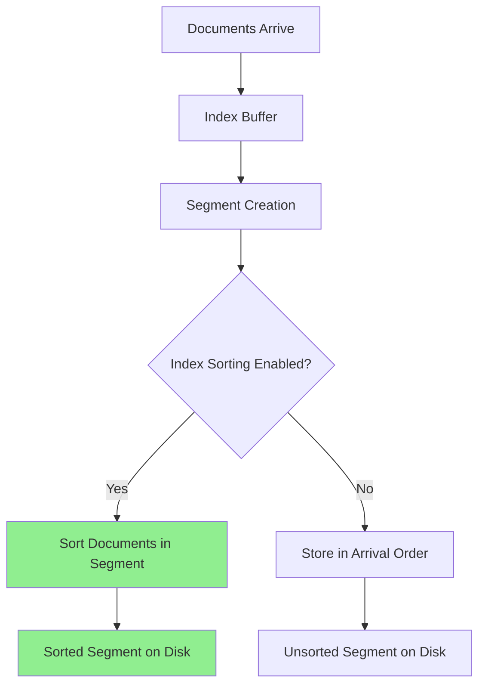
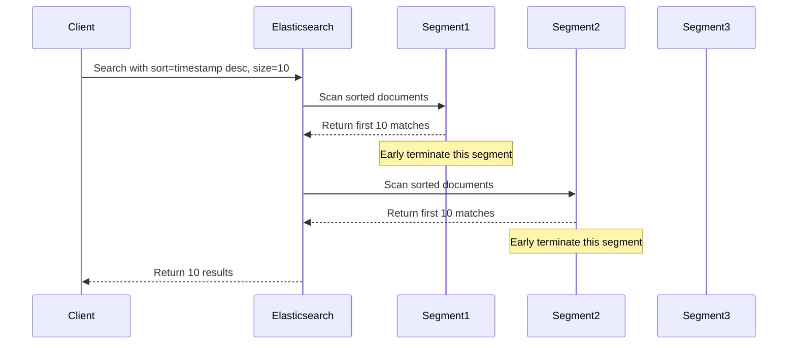
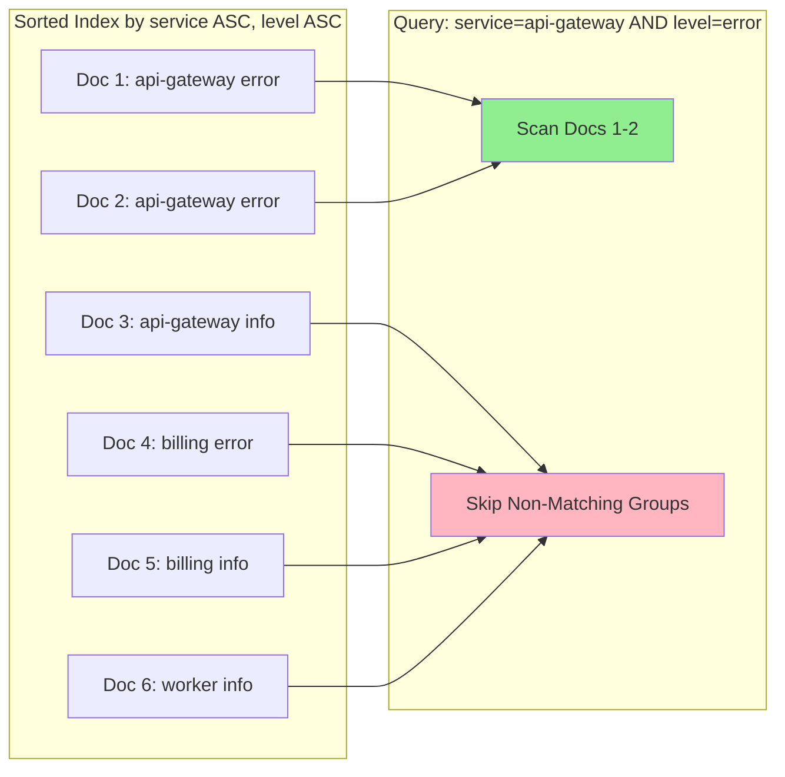
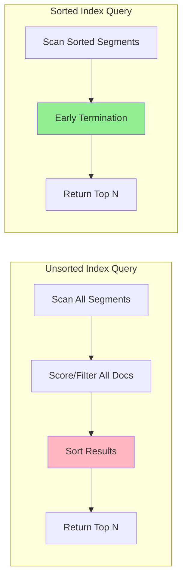
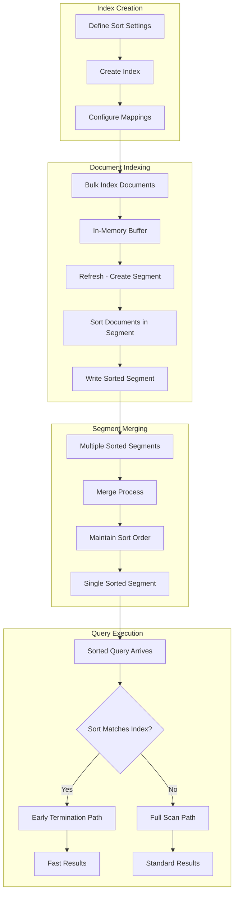
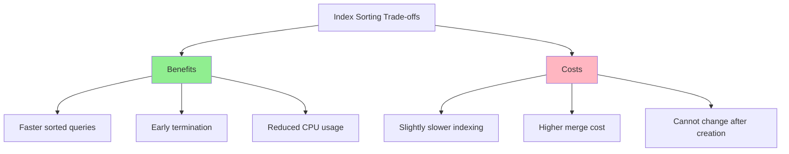

# How to Build Elasticsearch Index Sorting

Author: [nawazdhandala](https://github.com/nawazdhandala)

Tags: Elasticsearch, Index Sorting, Performance, Query Optimization

Description: Learn to implement Elasticsearch index sorting for early query termination with sort configuration, conjunctions, and performance benefits.

---

## Introduction

Elasticsearch index sorting is a powerful feature that allows you to pre-sort documents at index time rather than at query time. When your index is sorted in the same order as your most common queries, Elasticsearch can terminate searches early - significantly improving query performance for sorted searches.

In this guide, we will explore how to implement index sorting, understand its mechanics, and leverage it for query optimization.

## How Index Sorting Works

When you configure index sorting, Elasticsearch stores documents in a specific order within each segment. This pre-sorting enables the search to stop early once it has collected enough matching documents.


```mermaid
flowchart TD
    A[Documents Arrive] --> B[Index Buffer]
    B --> C[Segment Creation]
    C --> D{Index Sorting Enabled?}
    D -->|Yes| E[Sort Documents in Segment]
    D -->|No| F[Store in Arrival Order]
    E --> G[Sorted Segment on Disk]
    F --> H[Unsorted Segment on Disk]

    style E fill:#90EE90
    style G fill:#90EE90
```

## Configuring Index Sorting

### Basic Index Settings

To enable index sorting, you must configure it when creating the index. Here is a basic example that sorts documents by timestamp in descending order:

```json
PUT /logs-sorted
{
  "settings": {
    "index": {
      "sort.field": "timestamp",
      "sort.order": "desc"
    }
  },
  "mappings": {
    "properties": {
      "timestamp": {
        "type": "date"
      },
      "message": {
        "type": "text"
      },
      "level": {
        "type": "keyword"
      },
      "service": {
        "type": "keyword"
      }
    }
  }
}
```

### Multi-Field Sorting

You can sort by multiple fields for more complex ordering requirements:

```json
PUT /events-sorted
{
  "settings": {
    "index": {
      "sort.field": ["priority", "timestamp"],
      "sort.order": ["desc", "desc"]
    }
  },
  "mappings": {
    "properties": {
      "priority": {
        "type": "integer"
      },
      "timestamp": {
        "type": "date"
      },
      "event_type": {
        "type": "keyword"
      },
      "payload": {
        "type": "object"
      }
    }
  }
}
```

### Available Sort Options

The index sorting configuration supports several options:

| Option | Values | Description |
|--------|--------|-------------|
| `sort.field` | Field name(s) | The field(s) to sort by |
| `sort.order` | `asc`, `desc` | Sort direction |
| `sort.mode` | `min`, `max` | For multi-valued fields |
| `sort.missing` | `_first`, `_last` | Handling of missing values |

Here is a comprehensive configuration example:

```json
PUT /metrics-sorted
{
  "settings": {
    "index": {
      "sort.field": ["host", "timestamp"],
      "sort.order": ["asc", "desc"],
      "sort.missing": ["_last", "_last"]
    }
  },
  "mappings": {
    "properties": {
      "host": {
        "type": "keyword"
      },
      "timestamp": {
        "type": "date"
      },
      "cpu_usage": {
        "type": "float"
      },
      "memory_usage": {
        "type": "float"
      }
    }
  }
}
```

## Early Query Termination

The primary benefit of index sorting is early query termination. When your query sort matches the index sort and you do not need an exact hit count, Elasticsearch can stop collecting after the requested number of matching documents per segment.


```mermaid
sequenceDiagram
    participant Client
    participant Elasticsearch
    participant Segment1
    participant Segment2
    participant Segment3

    Client->>Elasticsearch: Search with sort=timestamp desc, size=10
    Elasticsearch->>Segment1: Scan sorted documents
    Segment1-->>Elasticsearch: Return first 10 matches
    Note over Segment1: Early terminate this segment
    Elasticsearch->>Segment2: Scan sorted documents
    Segment2-->>Elasticsearch: Return first 10 matches
    Note over Segment2: Early terminate this segment
    Elasticsearch-->>Client: Return 10 results
```

### Query Example with Early Termination

When querying a sorted index, ensure your query sort matches the index sort:

```json
GET /logs-sorted/_search
{
  "size": 10,
  "query": {
    "bool": {
      "filter": [
        { "term": { "level": "error" } },
        { "range": { "timestamp": { "gte": "2026-01-01" } } }
      ]
    }
  },
  "sort": [
    { "timestamp": "desc" }
  ],
  "track_total_hits": false
}
```

**Key points:**
- The `sort` matches the index sort order (`timestamp` descending)
- Setting `track_total_hits: false` allows Elasticsearch to skip counting all matches
- Using `filter` context avoids scoring overhead

## Conjunction Optimization

Index sorting can also help conjunctions (queries that combine multiple conditions with AND logic). This works best when the index is sorted first by low-cardinality fields that are frequently used for filtering, because documents with the same filter values are grouped together and Lucene can skip ranges of document IDs that cannot match.


```mermaid
flowchart LR
    subgraph "Sorted Index by service ASC, level ASC"
        A[Doc 1: api-gateway error]
        B[Doc 2: api-gateway error]
        C[Doc 3: api-gateway info]
        D[Doc 4: billing error]
        E[Doc 5: billing info]
        F[Doc 6: worker info]
    end

    subgraph "Query: service=api-gateway AND level=error"
        G[Scan Docs 1-2]
        H[Skip Non-Matching Groups]
    end

    A --> G
    B --> G
    C --> H
    D --> H
    E --> H
    F --> H

    style H fill:#FFB6C1
    style G fill:#90EE90
```

### Optimized Conjunction Query

For an index sorted by `service`, `level`, and then `timestamp`, a conjunction query can group the most selective low-cardinality filters first:

```json
GET /logs-conjunction-sorted/_search
{
  "size": 100,
  "query": {
    "bool": {
      "filter": [
        { "term": { "service": "api-gateway" } },
        { "term": { "level": "error" } },
        { "range": {
            "timestamp": {
              "gte": "2026-01-25",
              "lte": "2026-01-30"
            }
          }
        }
      ]
    }
  },
  "sort": [
    { "service": "asc" },
    { "level": "asc" },
    { "timestamp": "desc" }
  ]
}
```

## Performance Comparison

Let us examine the performance difference between sorted and unsorted indices.


```mermaid
graph LR
    subgraph "Unsorted Index Query"
        A1[Scan All Segments] --> B1[Score/Filter All Docs]
        B1 --> C1[Sort Results]
        C1 --> D1[Return Top N]
    end

    subgraph "Sorted Index Query"
        A2[Scan Sorted Segments] --> B2[Early Termination]
        B2 --> D2[Return Top N]
    end

    style B2 fill:#90EE90
    style C1 fill:#FFB6C1
```

### Benchmark Example

Here is a practical comparison using a logs index:

```json
// Create unsorted index
PUT /logs-unsorted
{
  "mappings": {
    "properties": {
      "timestamp": { "type": "date" },
      "level": { "type": "keyword" },
      "message": { "type": "text" }
    }
  }
}

// Create sorted index
PUT /logs-sorted
{
  "settings": {
    "index": {
      "sort.field": "timestamp",
      "sort.order": "desc"
    }
  },
  "mappings": {
    "properties": {
      "timestamp": { "type": "date" },
      "level": { "type": "keyword" },
      "message": { "type": "text" }
    }
  }
}
```

Typical performance improvements:

| Scenario | Unsorted | Sorted | Improvement |
|----------|----------|--------|-------------|
| Top 10 recent logs | 150ms | 15ms | 10x faster |
| Top 100 with filter | 300ms | 45ms | 6.7x faster |
| Aggregation without a selective sorted filter | 200ms | 210ms | No early-termination benefit |

## Use Cases

### 1. Time-Series Data

Perfect for logs, metrics, and events where queries typically fetch recent data:

```json
PUT /application-logs
{
  "settings": {
    "index": {
      "sort.field": "timestamp",
      "sort.order": "desc",
      "number_of_shards": 3,
      "number_of_replicas": 1
    }
  },
  "mappings": {
    "properties": {
      "timestamp": { "type": "date" },
      "application": { "type": "keyword" },
      "environment": { "type": "keyword" },
      "level": { "type": "keyword" },
      "message": { "type": "text" },
      "trace_id": { "type": "keyword" }
    }
  }
}
```

### 2. E-commerce Product Listings

Sort by popularity or rating for product searches:

```json
PUT /products-sorted
{
  "settings": {
    "index": {
      "sort.field": ["category", "popularity_score"],
      "sort.order": ["asc", "desc"]
    }
  },
  "mappings": {
    "properties": {
      "category": { "type": "keyword" },
      "popularity_score": { "type": "float" },
      "name": { "type": "text" },
      "price": { "type": "float" },
      "in_stock": { "type": "boolean" }
    }
  }
}
```

### 3. Priority-Based Task Queues

Sort tasks by priority for job processing systems:

```json
PUT /task-queue
{
  "settings": {
    "index": {
      "sort.field": ["priority", "created_at"],
      "sort.order": ["desc", "asc"]
    }
  },
  "mappings": {
    "properties": {
      "priority": { "type": "integer" },
      "created_at": { "type": "date" },
      "status": { "type": "keyword" },
      "task_type": { "type": "keyword" },
      "payload": { "type": "object", "enabled": false }
    }
  }
}
```

## Index Sorting Architecture


```mermaid
flowchart TB
    subgraph "Index Creation"
        A[Define Sort Settings] --> B[Create Index]
        B --> C[Configure Mappings]
    end

    subgraph "Document Indexing"
        D[Bulk Index Documents] --> E[In-Memory Buffer]
        E --> F[Refresh - Create Segment]
        F --> G[Sort Documents in Segment]
        G --> H[Write Sorted Segment]
    end

    subgraph "Segment Merging"
        I[Multiple Sorted Segments] --> J[Merge Process]
        J --> K[Maintain Sort Order]
        K --> L[Single Sorted Segment]
    end

    subgraph "Query Execution"
        M[Sorted Query Arrives] --> N{Sort Matches Index?}
        N -->|Yes| O[Early Termination Path]
        N -->|No| P[Full Scan Path]
        O --> Q[Fast Results]
        P --> R[Standard Results]
    end

    C --> D
    H --> I
    L --> M
```

## Limitations and Considerations

### When Index Sorting May Not Help

1. **Aggregation queries** - Aggregations still collect all matching documents, so they do not get the same early-termination benefit
2. **Different sort orders** - Queries with different sort fields see no benefit
3. **Full result sets** - When you need all matching documents
4. **Frequent updates** - Sorted indices have slightly higher indexing overhead

### Field Type Restrictions

Not all field types support index sorting:

```json
// Supported field types
{
  "keyword": "supported",
  "numeric types": "supported",
  "date": "supported",
  "boolean": "supported"
}

// Not supported
{
  "text": "not supported (use keyword instead)",
  "nested fields": "not supported as sort fields",
  "object fields": "not supported as sort fields"
}
```

### Memory and Performance Trade-offs


```mermaid
graph TD
    A[Index Sorting Trade-offs] --> B[Benefits]
    A --> C[Costs]

    B --> B1[Faster sorted queries]
    B --> B2[Early termination]
    B --> B3[Reduced CPU usage]

    C --> C1[Slightly slower indexing]
    C --> C2[Higher merge cost]
    C --> C3[Cannot change after creation]

    style B fill:#90EE90
    style C fill:#FFB6C1
```

## Best Practices

### 1. Analyze Query Patterns First

Before implementing index sorting, analyze your most common queries. If you log search requests separately, aggregate those logs to identify the most frequent sort fields:

```json
GET /search-logs/_search
{
  "size": 0,
  "aggs": {
    "common_sort_fields": {
      "terms": {
        "field": "sort_field.keyword",
        "size": 10
      }
    }
  }
}
```

### 2. Use Profile API to Verify Benefits

```json
GET /logs-sorted/_search
{
  "profile": true,
  "size": 10,
  "query": {
    "bool": {
      "filter": [
        { "term": { "level": "error" } }
      ]
    }
  },
  "sort": [
    { "timestamp": "desc" }
  ]
}
```

### 3. Combine with Other Optimizations

```json
PUT /optimized-logs
{
  "settings": {
    "index": {
      "sort.field": "timestamp",
      "sort.order": "desc",
      "number_of_shards": 3,
      "codec": "best_compression",
      "refresh_interval": "30s"
    }
  },
  "mappings": {
    "properties": {
      "timestamp": {
        "type": "date",
        "format": "epoch_millis"
      },
      "level": {
        "type": "keyword",
        "eager_global_ordinals": true
      },
      "message": {
        "type": "text",
        "norms": false
      },
      "service": {
        "type": "keyword"
      }
    }
  }
}
```

## Conclusion

Elasticsearch index sorting is an effective optimization technique for workloads with predictable sort patterns. By pre-sorting documents at index time, you can achieve significant query performance improvements through early termination.

Key takeaways:
- Configure index sorting during index creation - it cannot be changed later
- Ensure your query sort matches the index sort for maximum benefit
- Use `track_total_hits: false` to enable early termination
- Index sorting works best for time-series data and priority-based access patterns
- Monitor performance with the Profile API to verify improvements

When implemented correctly, index sorting can reduce query latency by an order of magnitude for sorted searches, making it an essential tool for optimizing Elasticsearch performance at scale.

## Further Reading

- [Elasticsearch Index Sorting Documentation](https://www.elastic.co/guide/en/elasticsearch/reference/current/index-modules-index-sorting.html)
- [Search Optimization Techniques](https://www.elastic.co/guide/en/elasticsearch/reference/current/tune-for-search-speed.html)
- [Index Lifecycle Management](https://www.elastic.co/guide/en/elasticsearch/reference/current/index-lifecycle-management.html)
