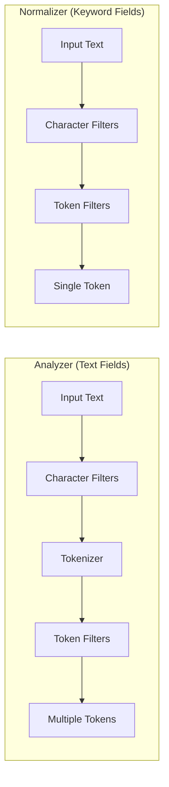
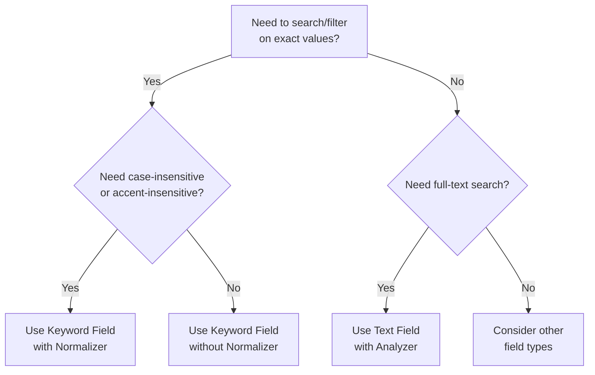
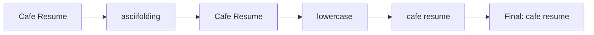
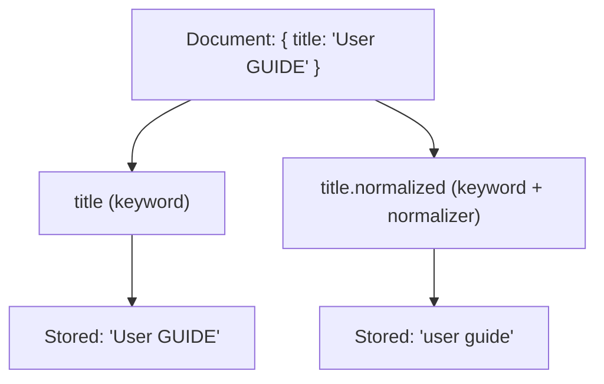
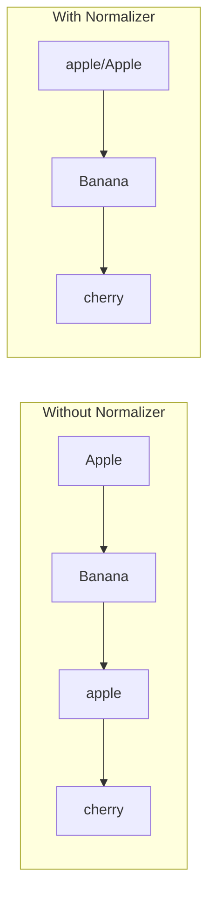
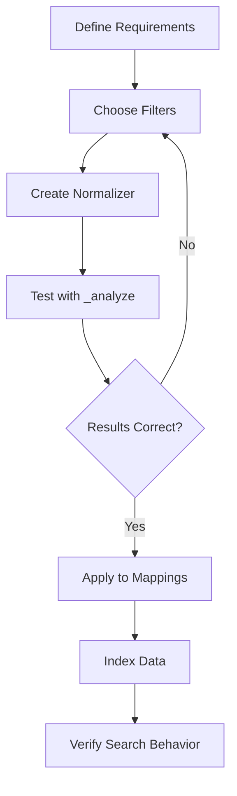

# How to Implement Elasticsearch Normalizers

Author: [nawazdhandala](https://github.com/nawazdhandala)

Tags: Elasticsearch, Normalizers, Keyword Fields, Text Processing

Description: Learn to implement Elasticsearch normalizers for keyword field normalization with case folding, accent removal, and custom filters.

---

## Introduction

When working with Elasticsearch, you often need to perform case-insensitive searches or normalize special characters on keyword fields. Unlike text fields that use analyzers, keyword fields require **normalizers** - a special type of analysis that processes the entire field value as a single token.

This guide walks you through implementing Elasticsearch normalizers for effective keyword field normalization.

## Understanding the Difference: Analyzers vs Normalizers

Before diving into implementation, let us understand why normalizers exist alongside analyzers.



Key differences:
- **Analyzers** break text into multiple tokens and are used for full-text search
- **Normalizers** keep the field as a single token but apply transformations
- Normalizers do not include a tokenizer - they preserve the entire value as one unit

## When to Use Normalizers

Normalizers are ideal for:
- Case-insensitive exact matching on keyword fields
- Removing accents from names or identifiers
- Standardizing product codes or SKUs
- Consistent sorting regardless of case



## Basic Normalizer Definition

Let us start with a simple normalizer that converts text to lowercase.

### Creating an Index with a Custom Normalizer

```json
PUT /products
{
  "settings": {
    "analysis": {
      "normalizer": {
        "lowercase_normalizer": {
          "type": "custom",
          "filter": ["lowercase"]
        }
      }
    }
  },
  "mappings": {
    "properties": {
      "product_code": {
        "type": "keyword",
        "normalizer": "lowercase_normalizer"
      },
      "product_name": {
        "type": "keyword"
      }
    }
  }
}
```

### Testing the Normalizer

You can test your normalizer using the `_analyze` endpoint:

```json
POST /products/_analyze
{
  "normalizer": "lowercase_normalizer",
  "text": "ABC-123-XYZ"
}
```

Response:
```json
{
  "tokens": [
    {
      "token": "abc-123-xyz",
      "start_offset": 0,
      "end_offset": 11,
      "type": "word",
      "position": 0
    }
  ]
}
```

## Building Filter Chains

Normalizers become powerful when you chain multiple filters together. Here is how filter chains work:



### Example: Comprehensive Normalizer

```json
PUT /customers
{
  "settings": {
    "analysis": {
      "normalizer": {
        "standard_normalizer": {
          "type": "custom",
          "char_filter": ["special_char_mapping"],
          "filter": ["lowercase", "asciifolding"]
        }
      },
      "char_filter": {
        "special_char_mapping": {
          "type": "mapping",
          "mappings": [
            "& => and",
            "@ => at"
          ]
        }
      }
    }
  },
  "mappings": {
    "properties": {
      "company_name": {
        "type": "keyword",
        "normalizer": "standard_normalizer"
      },
      "contact_email": {
        "type": "keyword",
        "normalizer": "standard_normalizer"
      }
    }
  }
}
```

## Available Filters for Normalizers

Not all token filters work with normalizers. Here are the compatible ones:

### Character Filters

| Filter | Description | Example |
|--------|-------------|---------|
| `mapping` | Replace characters based on mappings | `& => and` |
| `pattern_replace` | Replace using regex patterns | Remove special chars |

### Token Filters

| Filter | Description | Example |
|--------|-------------|---------|
| `lowercase` | Convert to lowercase | `ABC` to `abc` |
| `uppercase` | Convert to uppercase | `abc` to `ABC` |
| `asciifolding` | Convert Unicode to ASCII | `cafe` to `cafe` |
| `trim` | Remove leading/trailing whitespace | ` text ` to `text` |
| `pattern_replace` | Replace using regex | Remove hyphens |

### Example: Pattern Replace Filter

```json
PUT /inventory
{
  "settings": {
    "analysis": {
      "normalizer": {
        "sku_normalizer": {
          "type": "custom",
          "filter": ["uppercase", "remove_hyphens"]
        }
      },
      "filter": {
        "remove_hyphens": {
          "type": "pattern_replace",
          "pattern": "-",
          "replacement": ""
        }
      }
    }
  },
  "mappings": {
    "properties": {
      "sku": {
        "type": "keyword",
        "normalizer": "sku_normalizer"
      }
    }
  }
}
```

Testing:
```json
POST /inventory/_analyze
{
  "normalizer": "sku_normalizer",
  "text": "abc-123-def"
}
```

Result: `ABC123DEF`

## Keyword Mapping with Normalizers

When applying normalizers to keyword fields, consider these mapping patterns:

### Multi-field Mapping

Sometimes you need both normalized and original values:

```json
PUT /documents
{
  "settings": {
    "analysis": {
      "normalizer": {
        "case_insensitive": {
          "type": "custom",
          "filter": ["lowercase"]
        }
      }
    }
  },
  "mappings": {
    "properties": {
      "title": {
        "type": "keyword",
        "fields": {
          "normalized": {
            "type": "keyword",
            "normalizer": "case_insensitive"
          }
        }
      }
    }
  }
}
```



### Searching with Multi-fields

```json
// Exact match (case-sensitive)
GET /documents/_search
{
  "query": {
    "term": {
      "title": "User GUIDE"
    }
  }
}

// Case-insensitive match
GET /documents/_search
{
  "query": {
    "term": {
      "title.normalized": "user guide"
    }
  }
}
```

## Sorting Behavior with Normalizers

Normalizers significantly impact sorting behavior. Without normalizers, uppercase letters sort before lowercase letters.

### Without Normalizer

```json
// Data: ["apple", "Banana", "cherry", "Apple"]
// Sort result: ["Apple", "Banana", "apple", "cherry"]
```

### With Lowercase Normalizer

```json
// Data: ["apple", "Banana", "cherry", "Apple"]
// Sort result: ["apple", "Apple", "Banana", "cherry"]
```



### Practical Sorting Example

```json
PUT /users
{
  "settings": {
    "analysis": {
      "normalizer": {
        "sortable": {
          "type": "custom",
          "filter": ["lowercase", "asciifolding"]
        }
      }
    }
  },
  "mappings": {
    "properties": {
      "name": {
        "type": "keyword",
        "fields": {
          "sort": {
            "type": "keyword",
            "normalizer": "sortable"
          }
        }
      }
    }
  }
}

// Index some documents
POST /users/_bulk
{"index":{}}
{"name": "Zoe"}
{"index":{}}
{"name": "alice"}
{"index":{}}
{"name": "Bob"}
{"index":{}}
{"name": "Andre"}

// Sort by normalized field
GET /users/_search
{
  "sort": [
    { "name.sort": "asc" }
  ]
}
```

Result order: alice, Andre, Bob, Zoe

## Complete Implementation Example

Here is a complete example implementing normalizers for an e-commerce product catalog:

```json
PUT /product_catalog
{
  "settings": {
    "analysis": {
      "char_filter": {
        "symbol_mapping": {
          "type": "mapping",
          "mappings": [
            "& => and",
            "+ => plus",
            "# => sharp"
          ]
        }
      },
      "filter": {
        "trim_spaces": {
          "type": "pattern_replace",
          "pattern": "\\s+",
          "replacement": " "
        }
      },
      "normalizer": {
        "product_normalizer": {
          "type": "custom",
          "char_filter": ["symbol_mapping"],
          "filter": ["lowercase", "asciifolding", "trim"]
        },
        "code_normalizer": {
          "type": "custom",
          "filter": ["uppercase", "trim_spaces", "trim"]
        },
        "search_normalizer": {
          "type": "custom",
          "filter": ["lowercase", "asciifolding"]
        }
      }
    }
  },
  "mappings": {
    "properties": {
      "product_id": {
        "type": "keyword"
      },
      "name": {
        "type": "keyword",
        "normalizer": "product_normalizer",
        "fields": {
          "raw": {
            "type": "keyword"
          }
        }
      },
      "sku": {
        "type": "keyword",
        "normalizer": "code_normalizer"
      },
      "brand": {
        "type": "keyword",
        "normalizer": "search_normalizer"
      },
      "category": {
        "type": "keyword",
        "normalizer": "search_normalizer"
      }
    }
  }
}
```

### Indexing Sample Data

```json
POST /product_catalog/_bulk
{"index":{"_id":"1"}}
{"product_id":"P001","name":"C++ Programming Guide","sku":"cpp-guide-001","brand":"TechBooks","category":"Programming"}
{"index":{"_id":"2"}}
{"product_id":"P002","name":"Cafe & Restaurant Management","sku":"cafe-mgmt-002","brand":"BusinessPro","category":"Management"}
{"index":{"_id":"3"}}
{"product_id":"P003","name":"Rock & Roll History","sku":"rock-hist-003","brand":"MusicWorld","category":"Music"}
```

### Querying with Normalizers

```json
// Search for C++ books (symbol converted to "plus")
GET /product_catalog/_search
{
  "query": {
    "term": {
      "name": "c plus plus programming guide"
    }
  }
}

// Case-insensitive brand search
GET /product_catalog/_search
{
  "query": {
    "term": {
      "brand": "techbooks"
    }
  }
}

// Aggregation on normalized category
GET /product_catalog/_search
{
  "size": 0,
  "aggs": {
    "categories": {
      "terms": {
        "field": "category"
      }
    }
  }
}
```

## Best Practices

1. **Choose the right filters**: Only use filters that make sense for your use case. Excessive filtering can lead to unexpected matches.

2. **Test normalizers thoroughly**: Always use the `_analyze` endpoint to verify normalizer behavior before applying to production data.

3. **Use multi-fields strategically**: Keep the original value accessible when you need both normalized and raw data.

4. **Document your normalizers**: Clearly document what each normalizer does for team members.

5. **Consider reindexing implications**: Changing a normalizer requires reindexing existing data.



## Troubleshooting Common Issues

### Issue: Normalizer Not Applied to Existing Data

Normalizers only affect new data. To apply to existing data:

```json
POST /product_catalog/_update_by_query?refresh
{
  "query": {
    "match_all": {}
  }
}
```

### Issue: Unexpected Search Results

Verify the normalized value:

```json
GET /product_catalog/_termvectors/1
{
  "fields": ["name"],
  "term_statistics": true
}
```

### Issue: Aggregations Show Different Values

Remember that aggregations use the normalized (indexed) value, not the original:

```json
// To aggregate on original values, use the .raw sub-field
GET /product_catalog/_search
{
  "aggs": {
    "original_names": {
      "terms": {
        "field": "name.raw"
      }
    }
  }
}
```

## Conclusion

Elasticsearch normalizers provide a powerful way to standardize keyword fields for case-insensitive searching, accent-independent matching, and consistent sorting. By understanding how to chain character filters and token filters, you can create normalizers tailored to your specific requirements.

Key takeaways:
- Normalizers process keyword fields as single tokens
- Use filter chains for complex transformations
- Multi-fields let you keep both normalized and original values
- Always test normalizers before deploying to production
- Consider the impact on sorting and aggregations

With these techniques, you can build more flexible and user-friendly search experiences in your Elasticsearch applications.
