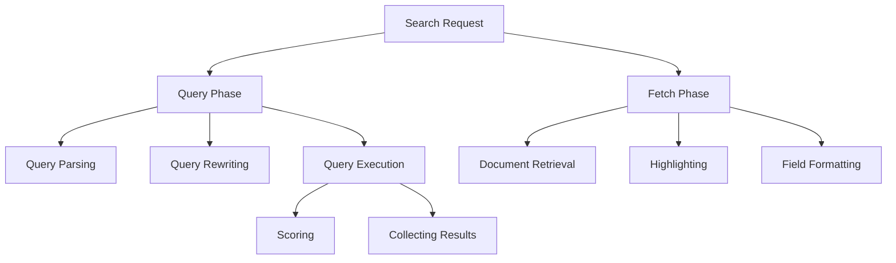
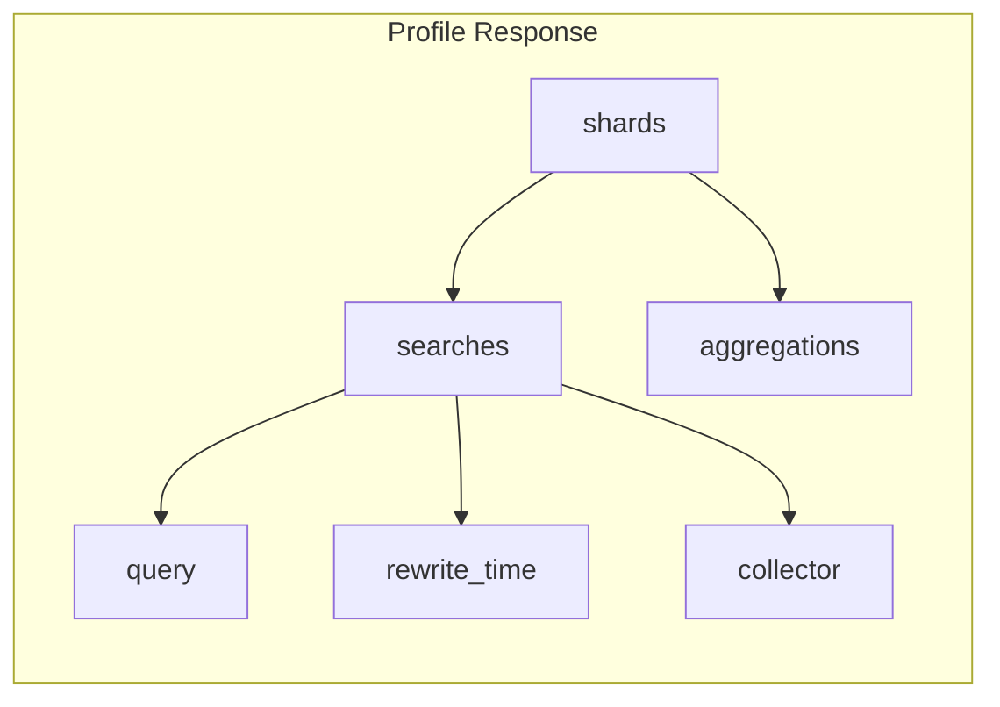
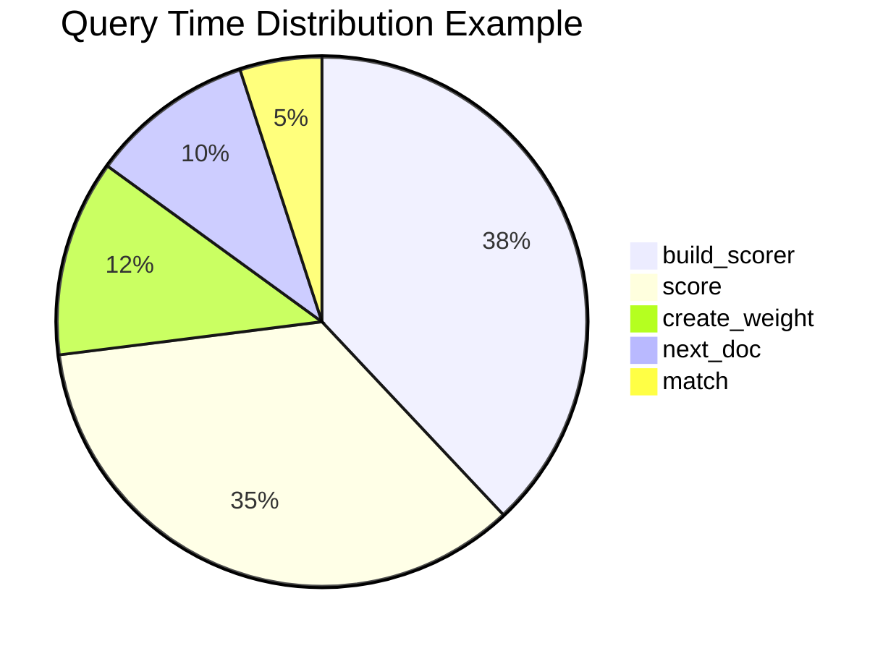
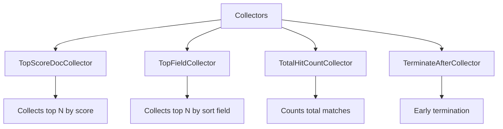
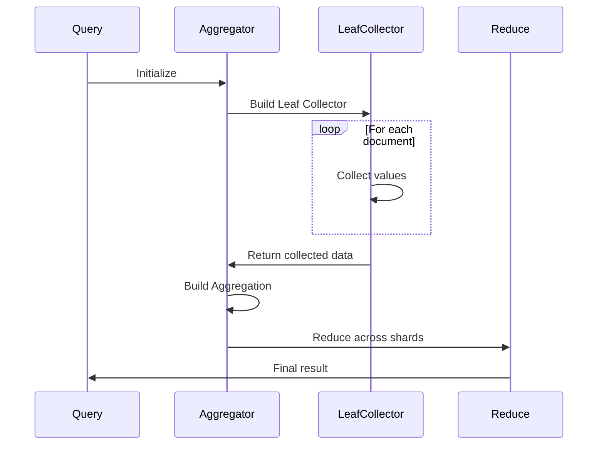
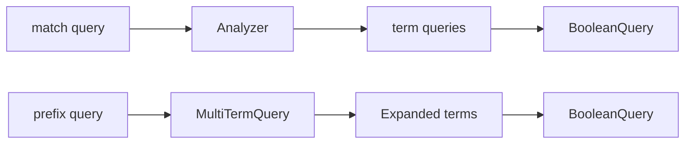
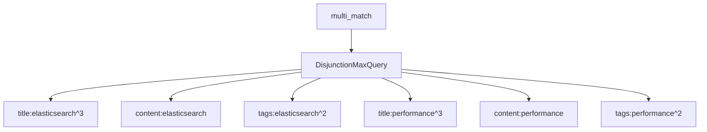
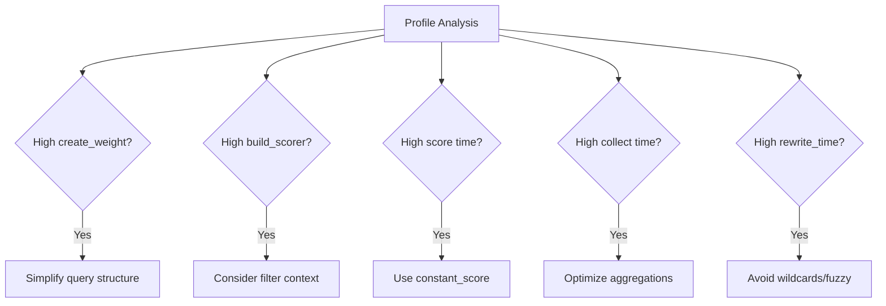
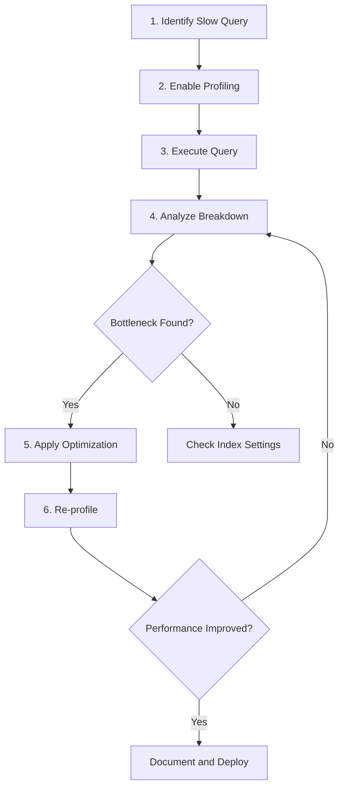
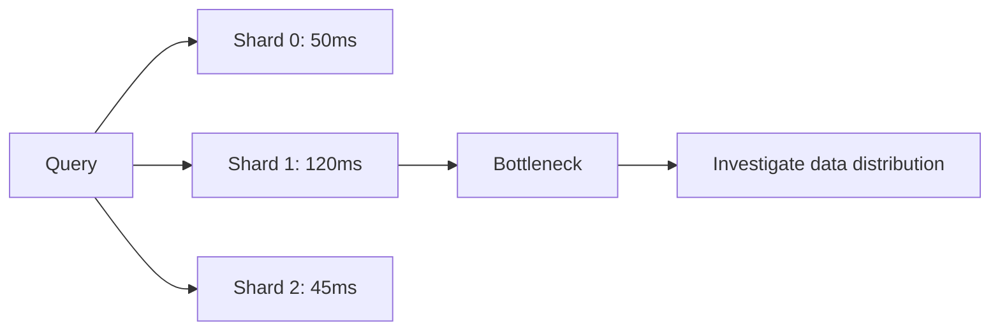

# How to Create Elasticsearch Query Profiling

Author: [nawazdhandala](https://github.com/nawazdhandala)

Tags: Elasticsearch, Query Profiling, Performance, Debugging

Description: Learn to implement Elasticsearch query profiling for performance analysis with timing breakdowns, query rewriting, and optimization insights.

---

Query performance is critical when working with Elasticsearch at scale. Slow queries can bottleneck your application and degrade user experience. Elasticsearch provides a powerful Profile API that gives you deep insights into how queries execute, where time is spent, and what optimizations you can make. This guide covers everything you need to know about Elasticsearch query profiling for effective performance analysis.

## Understanding the Profile API

The Profile API provides detailed timing information about the execution of search requests. It breaks down the query execution into components, showing you exactly where time is spent during the search process.



## Enabling Query Profiling

To enable profiling, add the `profile` parameter to your search request:

```json
GET /my-index/_search
{
  "profile": true,
  "query": {
    "bool": {
      "must": [
        { "match": { "title": "elasticsearch" } },
        { "range": { "date": { "gte": "2024-01-01" } } }
      ],
      "filter": [
        { "term": { "status": "published" } }
      ]
    }
  }
}
```

The response includes a `profile` object containing detailed execution information for each shard involved in the query.

## Anatomy of Profile Response

The profile response contains several key sections that help you understand query execution:



### Basic Profile Response Structure

```json
{
  "profile": {
    "shards": [
      {
        "id": "[node_id][index_name][shard_number]",
        "searches": [
          {
            "query": [...],
            "rewrite_time": 12345,
            "collector": [...]
          }
        ],
        "aggregations": [...]
      }
    ]
  }
}
```

## Query Timing Analysis

Each query in the profile output includes detailed timing information. Here is an example of analyzing a bool query:

```json
{
  "type": "BooleanQuery",
  "description": "+title:elasticsearch +date:[1704067200000 TO 9223372036854775807] #status:published",
  "time_in_nanos": 2847293,
  "breakdown": {
    "set_min_competitive_score_count": 0,
    "match_count": 1547,
    "shallow_advance_count": 0,
    "set_min_competitive_score": 0,
    "next_doc": 98273,
    "match": 38291,
    "next_doc_count": 2893,
    "score_count": 1547,
    "compute_max_score_count": 0,
    "compute_max_score": 0,
    "advance": 12847,
    "advance_count": 15,
    "score": 847291,
    "build_scorer_count": 8,
    "create_weight": 127364,
    "shallow_advance": 0,
    "create_weight_count": 1,
    "build_scorer": 382910
  }
}
```

### Understanding Breakdown Metrics

The breakdown section contains timing for specific operations:

| Metric | Description |
|--------|-------------|
| `create_weight` | Time to create the Weight object for scoring |
| `build_scorer` | Time to build the Scorer for iterating matches |
| `next_doc` | Time spent advancing to the next matching document |
| `advance` | Time for advancing the iterator to a specific document |
| `match` | Time for two-phase iteration confirmation |
| `score` | Time calculating the relevance score for documents |



## Collector Breakdown Analysis

Collectors are responsible for gathering the top scoring documents. Understanding collector performance is essential for optimizing result retrieval:

```json
{
  "collector": [
    {
      "name": "SimpleTopScoreDocCollector",
      "reason": "search_top_hits",
      "time_in_nanos": 847291,
      "children": [
        {
          "name": "LeafCollector",
          "reason": "search_leaf_collector",
          "time_in_nanos": 723847
        }
      ]
    }
  ]
}
```

### Common Collector Types



## Aggregation Profiling

Aggregations can be profiled separately from queries. Here is how to analyze aggregation performance:

```json
GET /logs/_search
{
  "profile": true,
  "size": 0,
  "aggs": {
    "status_codes": {
      "terms": {
        "field": "status_code",
        "size": 10
      },
      "aggs": {
        "avg_response_time": {
          "avg": {
            "field": "response_time"
          }
        }
      }
    }
  }
}
```

### Aggregation Profile Response

```json
{
  "profile": {
    "shards": [
      {
        "aggregations": [
          {
            "type": "GlobalOrdinalsStringTermsAggregator",
            "description": "status_codes",
            "time_in_nanos": 1823947,
            "breakdown": {
              "reduce": 0,
              "build_aggregation": 92847,
              "build_aggregation_count": 1,
              "initialize": 12847,
              "initialize_count": 1,
              "collect": 1582947,
              "collect_count": 28473,
              "reduce_count": 0,
              "build_leaf_collector": 82736,
              "build_leaf_collector_count": 5
            },
            "children": [
              {
                "type": "AvgAggregator",
                "description": "avg_response_time",
                "time_in_nanos": 382947,
                "breakdown": {
                  "reduce": 0,
                  "build_aggregation": 8273,
                  "build_aggregation_count": 10,
                  "initialize": 2847,
                  "initialize_count": 1,
                  "collect": 283746,
                  "collect_count": 28473,
                  "reduce_count": 0,
                  "build_leaf_collector": 38274,
                  "build_leaf_collector_count": 5
                }
              }
            ]
          }
        ]
      }
    ]
  }
}
```

### Aggregation Timing Breakdown

| Metric | Description |
|--------|-------------|
| `initialize` | Time to set up the aggregator |
| `collect` | Time spent collecting document values |
| `build_aggregation` | Time to build final aggregation result |
| `build_leaf_collector` | Time to create leaf-level collectors |
| `reduce` | Time for cross-shard reduction |



## Query Rewrite Analysis

The `rewrite_time` metric shows how long Elasticsearch spent rewriting the query into a more efficient form:

```json
{
  "searches": [
    {
      "query": [...],
      "rewrite_time": 28473,
      "collector": [...]
    }
  ]
}
```

Query rewriting transforms high-level queries into lower-level Lucene queries:



High rewrite times often indicate:
- Wildcard queries expanding to many terms
- Fuzzy queries with high edit distances
- Prefix queries on high-cardinality fields

## Practical Profiling Examples

### Example 1: Identifying Slow Nested Queries

```json
GET /products/_search
{
  "profile": true,
  "query": {
    "nested": {
      "path": "reviews",
      "query": {
        "bool": {
          "must": [
            { "range": { "reviews.rating": { "gte": 4 } } },
            { "match": { "reviews.text": "excellent quality" } }
          ]
        }
      }
    }
  }
}
```

Nested queries can be expensive. The profile output helps identify if the nested join is the bottleneck:

```json
{
  "type": "ToParentBlockJoinQuery",
  "description": "ToParentBlockJoinQuery (reviews.rating:[4 TO 2147483647] +reviews.text:excellent +reviews.text:quality)",
  "time_in_nanos": 5827364,
  "breakdown": {
    "score": 2847362,
    "build_scorer": 1827364,
    "next_doc": 827364,
    "advance": 182736,
    "match": 0,
    "create_weight": 142538
  }
}
```

### Example 2: Analyzing Multi-Match Queries

```json
GET /articles/_search
{
  "profile": true,
  "query": {
    "multi_match": {
      "query": "elasticsearch performance tuning",
      "fields": ["title^3", "content", "tags^2"],
      "type": "best_fields"
    }
  }
}
```

The profile reveals how multi-match expands across fields:



### Example 3: Profiling with Sorting

```json
GET /logs/_search
{
  "profile": true,
  "query": {
    "range": {
      "timestamp": {
        "gte": "now-1h"
      }
    }
  },
  "sort": [
    { "timestamp": "desc" },
    { "_score": "desc" }
  ],
  "size": 100
}
```

When sorting is involved, watch for `TopFieldCollector` in the collector breakdown:

```json
{
  "collector": [
    {
      "name": "TopFieldCollector",
      "reason": "search_sort",
      "time_in_nanos": 1827364,
      "children": [...]
    }
  ]
}
```

## Performance Optimization Strategies

Based on profile analysis, here are common optimization patterns:



### 1. Use Filter Context for Non-Scoring Queries

Before optimization:
```json
{
  "query": {
    "bool": {
      "must": [
        { "term": { "status": "active" } },
        { "match": { "title": "elasticsearch" } }
      ]
    }
  }
}
```

After optimization:
```json
{
  "query": {
    "bool": {
      "must": [
        { "match": { "title": "elasticsearch" } }
      ],
      "filter": [
        { "term": { "status": "active" } }
      ]
    }
  }
}
```

### 2. Limit Aggregation Cardinality

```json
{
  "aggs": {
    "top_terms": {
      "terms": {
        "field": "category",
        "size": 10,
        "shard_size": 25,
        "execution_hint": "map"
      }
    }
  }
}
```

### 3. Use Index Sorting for Range Queries

Configure index sorting during index creation:
```json
PUT /time-series-index
{
  "settings": {
    "index": {
      "sort.field": "timestamp",
      "sort.order": "desc"
    }
  },
  "mappings": {
    "properties": {
      "timestamp": { "type": "date" }
    }
  }
}
```

## Creating a Profiling Workflow

Implement a systematic approach to query profiling:



### Automated Profiling Script

Here is a Python script to automate profile collection:

```python
from elasticsearch import Elasticsearch
import json

def profile_query(es_client, index, query_body):
    """Execute a query with profiling and return analysis."""

    query_body["profile"] = True
    response = es_client.search(index=index, body=query_body)

    profile_data = response.get("profile", {})
    analysis = {
        "total_shards": len(profile_data.get("shards", [])),
        "shard_timings": []
    }

    for shard in profile_data.get("shards", []):
        shard_info = {
            "id": shard["id"],
            "queries": [],
            "aggregations": []
        }

        for search in shard.get("searches", []):
            for query in search.get("query", []):
                shard_info["queries"].append({
                    "type": query["type"],
                    "time_ms": query["time_in_nanos"] / 1_000_000,
                    "breakdown": query["breakdown"]
                })
            shard_info["rewrite_time_ms"] = search.get("rewrite_time", 0) / 1_000_000

        for agg in shard.get("aggregations", []):
            shard_info["aggregations"].append({
                "type": agg["type"],
                "description": agg["description"],
                "time_ms": agg["time_in_nanos"] / 1_000_000
            })

        analysis["shard_timings"].append(shard_info)

    return analysis

# Usage
es = Elasticsearch(["http://localhost:9200"])
query = {
    "query": {
        "match": { "title": "elasticsearch" }
    }
}

result = profile_query(es, "my-index", query)
print(json.dumps(result, indent=2))
```

## Common Profiling Pitfalls

### 1. Profiling in Production

Profiling adds overhead to queries. Use it strategically:
- Profile in staging environments when possible
- Sample a small percentage of production queries
- Disable profiling for regular traffic

### 2. Interpreting Cached Results

Subsequent runs may show different timings due to caching:
- Field data cache
- Query cache
- Request cache

Clear caches for accurate benchmarking:
```json
POST /my-index/_cache/clear
```

### 3. Single Shard vs Multi-Shard Analysis

Profile output is per-shard. For multi-shard indices, analyze the slowest shard:



## Conclusion

Elasticsearch query profiling is an essential tool for understanding and optimizing search performance. By analyzing the Profile API output, you can identify exactly where time is spent during query execution and make informed optimization decisions.

Key takeaways:
- Always profile before optimizing - measure, do not guess
- Focus on the breakdown metrics that consume the most time
- Use filter context for non-scoring queries
- Monitor aggregation collect times for large datasets
- Consider index-level optimizations like sorting and mappings
- Build automated profiling into your development workflow

With systematic profiling and the strategies outlined in this guide, you can ensure your Elasticsearch queries perform optimally at any scale.

## Further Reading

- [Elasticsearch Profile API Documentation](https://www.elastic.co/guide/en/elasticsearch/reference/current/search-profile.html)
- [Lucene Query Execution](https://lucene.apache.org/)
- [Elasticsearch Performance Tuning Guide](https://www.elastic.co/guide/en/elasticsearch/reference/current/tune-for-search-speed.html)
