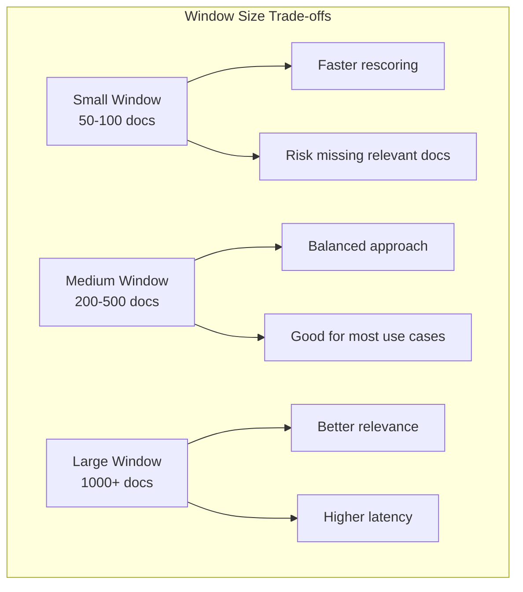
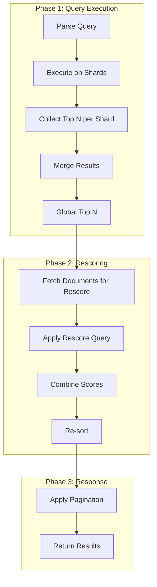

# How to Implement Elasticsearch Rescoring

Author: [nawazdhandala](https://github.com/nawazdhandala)

Tags: Elasticsearch, Search, Relevance, Performance

Description: A practical guide to improving search relevance with Elasticsearch rescoring by applying expensive scoring algorithms only to top results.

---

Search relevance is hard. You want fast queries that return thousands of results in milliseconds, but you also want the best documents at the top. Rescoring lets you have both: run a fast query first, then apply a more expensive scoring function to just the top N results.

This guide covers how rescoring works, when to use it, and how to implement different rescoring strategies in production.

---

## What is Rescoring?

Rescoring is a two-phase ranking approach:

1. **Phase 1 (Query)**: Run a fast query to retrieve the top N documents
2. **Phase 2 (Rescore)**: Apply an expensive scoring function only to those N documents

The result: better relevance without killing query performance.


Why not just use the expensive query directly? Because scoring every document in the index with a complex function is slow. Rescoring limits the expensive computation to a small window of candidates.

---

## The Rescore Query Structure

Every rescore request has three parts:

| Component | Purpose |
|-----------|---------|
| `window_size` | How many top documents to rescore |
| `query` | The secondary query used for rescoring |
| `query_weight` / `rescore_query_weight` | How to combine original and rescore scores |
| `score_mode` | How to merge scores: multiply, avg, max, min, total |

Basic structure:

```json
{
  "query": {
    "match": { "content": "search engine optimization" }
  },
  "rescore": {
    "window_size": 100,
    "query": {
      "rescore_query": {
        "match_phrase": {
          "content": {
            "query": "search engine optimization",
            "slop": 2
          }
        }
      },
      "query_weight": 0.7,
      "rescore_query_weight": 1.2
    }
  }
}
```

---

## Window Size: The Key Trade-off

The `window_size` parameter controls how many documents get rescored. This is the critical tuning knob.



Guidelines for choosing window size:

| Scenario | Recommended Window | Reasoning |
|----------|-------------------|-----------|
| Autocomplete / typeahead | 50-100 | Speed matters most |
| Product search | 200-400 | Balance relevance and latency |
| Document search | 300-500 | Users expect high relevance |
| Legal / research search | 500-1000 | Recall is critical |

If your first-phase query is good enough to surface relevant documents in the top N, rescoring will improve ordering. If relevant documents rank below your window size, rescoring cannot help.

---

## Query Rescoring

The most common use case: boost exact phrase matches or proximity matches.

### Phrase Rescoring

```json
{
  "query": {
    "match": {
      "title": "kubernetes deployment strategies"
    }
  },
  "rescore": {
    "window_size": 200,
    "query": {
      "rescore_query": {
        "match_phrase": {
          "title": {
            "query": "kubernetes deployment strategies",
            "slop": 0
          }
        }
      },
      "query_weight": 1.0,
      "rescore_query_weight": 2.0
    }
  }
}
```

This query:
1. Finds all documents matching any of the terms
2. Rescores the top 200, boosting those with exact phrase matches

### Proximity Rescoring with Slop

Allow some distance between terms:

```json
{
  "query": {
    "bool": {
      "should": [
        { "match": { "content": "distributed tracing" } },
        { "match": { "content": "observability" } }
      ]
    }
  },
  "rescore": {
    "window_size": 300,
    "query": {
      "rescore_query": {
        "match_phrase": {
          "content": {
            "query": "distributed tracing",
            "slop": 3
          }
        }
      },
      "query_weight": 1.0,
      "rescore_query_weight": 1.5
    }
  }
}
```

The `slop` parameter allows up to 3 positions between terms. "distributed systems tracing" would still match.

---

## Function Score Rescoring

For more complex scoring, use `function_score` in the rescore query:

```json
{
  "query": {
    "match": { "content": "incident management" }
  },
  "rescore": {
    "window_size": 150,
    "query": {
      "rescore_query": {
        "function_score": {
          "query": { "match_all": {} },
          "functions": [
            {
              "field_value_factor": {
                "field": "popularity_score",
                "factor": 1.2,
                "modifier": "sqrt",
                "missing": 1
              }
            },
            {
              "gauss": {
                "published_date": {
                  "origin": "now",
                  "scale": "30d",
                  "decay": 0.5
                }
              }
            }
          ],
          "score_mode": "multiply",
          "boost_mode": "multiply"
        }
      },
      "query_weight": 0.8,
      "rescore_query_weight": 1.0
    }
  }
}
```

This rescoring query:
1. Boosts documents by popularity (square root of the score)
2. Applies time decay favoring recent documents
3. Multiplies both factors together

---

## Multiple Rescores (Chained)

You can chain multiple rescore phases. Each phase operates on the output of the previous one:

```json
{
  "query": {
    "match": { "content": "log aggregation" }
  },
  "rescore": [
    {
      "window_size": 500,
      "query": {
        "rescore_query": {
          "match_phrase": {
            "content": {
              "query": "log aggregation",
              "slop": 2
            }
          }
        },
        "query_weight": 1.0,
        "rescore_query_weight": 1.5
      }
    },
    {
      "window_size": 100,
      "query": {
        "rescore_query": {
          "function_score": {
            "query": { "match_all": {} },
            "field_value_factor": {
              "field": "view_count",
              "modifier": "log1p"
            }
          }
        },
        "query_weight": 1.0,
        "rescore_query_weight": 0.5
      }
    }
  ]
}
```


Order matters. Put broader rescores first (larger window), then narrower ones.

---

## Score Modes Explained

The `score_mode` parameter controls how original and rescore scores combine:

| Mode | Formula | Use Case |
|------|---------|----------|
| `total` | original + rescore | Add bonus points for phrase matches |
| `multiply` | original * rescore | Amplify differences |
| `avg` | (original + rescore) / 2 | Balanced blending |
| `max` | max(original, rescore) | Take the better score |
| `min` | min(original, rescore) | Conservative scoring |

Example with explicit score mode:

```json
{
  "query": {
    "match": { "title": "api monitoring" }
  },
  "rescore": {
    "window_size": 200,
    "query": {
      "score_mode": "multiply",
      "rescore_query": {
        "match_phrase": {
          "title": "api monitoring"
        }
      },
      "query_weight": 1.0,
      "rescore_query_weight": 2.0
    }
  }
}
```

---

## Practical Example: E-commerce Product Search

A real-world product search with rescoring:

```json
{
  "query": {
    "bool": {
      "must": [
        {
          "multi_match": {
            "query": "wireless headphones",
            "fields": ["name^3", "description", "brand^2"],
            "type": "best_fields"
          }
        }
      ],
      "filter": [
        { "term": { "in_stock": true } },
        { "range": { "price": { "gte": 50, "lte": 300 } } }
      ]
    }
  },
  "rescore": [
    {
      "window_size": 200,
      "query": {
        "rescore_query": {
          "match_phrase": {
            "name": {
              "query": "wireless headphones",
              "slop": 1
            }
          }
        },
        "query_weight": 1.0,
        "rescore_query_weight": 2.5
      }
    },
    {
      "window_size": 50,
      "query": {
        "rescore_query": {
          "function_score": {
            "query": { "match_all": {} },
            "functions": [
              {
                "filter": { "range": { "rating": { "gte": 4.5 } } },
                "weight": 1.5
              },
              {
                "field_value_factor": {
                  "field": "sales_rank",
                  "modifier": "reciprocal",
                  "missing": 1000
                }
              }
            ],
            "score_mode": "multiply"
          }
        },
        "query_weight": 1.0,
        "rescore_query_weight": 0.8
      }
    }
  ]
}
```

This query:
1. Searches across name, description, and brand
2. Filters to in-stock items within price range
3. First rescore: boosts exact phrase matches in name
4. Second rescore: favors highly-rated items and best sellers

---

## Performance Considerations

Rescoring adds latency. Here is how to keep it in check:

### Measure Before Optimizing

```json
GET /my_index/_search
{
  "profile": true,
  "query": { ... },
  "rescore": { ... }
}
```

The profile output shows time spent in each phase.

### Recommendations

| Optimization | Impact |
|--------------|--------|
| Reduce window_size | Direct latency reduction |
| Simplify rescore query | Fewer operations per document |
| Use filters in main query | Smaller candidate set |
| Cache main query results | Speeds up repeated rescores |
| Avoid script_score in rescore | Scripts are slow |

### When Rescoring Hurts More Than Helps

Skip rescoring if:
- Your main query already produces good ordering
- Window size would need to be > 50% of results
- Rescore query is nearly as complex as main query
- Latency budget is very tight (< 50ms)

---

## Rescoring Pipeline Flow



Important: rescoring happens after shard-level results are merged. The coordinator node performs rescoring on the global top N.

---

## Common Patterns

### Pattern 1: Phrase Boost

Boost documents where query terms appear as a phrase:

```json
{
  "rescore": {
    "window_size": 100,
    "query": {
      "rescore_query": {
        "match_phrase": { "content": "exact phrase" }
      },
      "rescore_query_weight": 2.0
    }
  }
}
```

### Pattern 2: Recency Boost

Favor recent documents:

```json
{
  "rescore": {
    "window_size": 100,
    "query": {
      "rescore_query": {
        "function_score": {
          "gauss": {
            "timestamp": {
              "origin": "now",
              "scale": "7d"
            }
          }
        }
      }
    }
  }
}
```

### Pattern 3: Personalization

Boost based on user preferences (requires pre-computed scores):

```json
{
  "rescore": {
    "window_size": 50,
    "query": {
      "rescore_query": {
        "function_score": {
          "script_score": {
            "script": {
              "source": "doc['user_affinity_scores'].get(params.user_id, 1)",
              "params": { "user_id": "user_123" }
            }
          }
        }
      }
    }
  }
}
```

---

## Debugging Rescore Queries

Use the `explain` parameter to see how scores are computed:

```json
GET /my_index/_search
{
  "explain": true,
  "query": {
    "match": { "content": "monitoring" }
  },
  "rescore": {
    "window_size": 10,
    "query": {
      "rescore_query": {
        "match_phrase": { "content": "monitoring" }
      },
      "query_weight": 1.0,
      "rescore_query_weight": 2.0
    }
  }
}
```

The explanation shows:
- Original query score
- Rescore query score
- How they were combined

---

## Summary

| Aspect | Recommendation |
|--------|----------------|
| When to use | Expensive scoring needed but latency matters |
| Window size | Start with 100-200, tune based on recall needs |
| Multiple rescores | Use for layered relevance (phrase, then popularity) |
| Score mode | `total` for additive boosts, `multiply` for amplification |
| Debugging | Use `explain: true` to verify score combination |

Rescoring is a practical way to improve search relevance without sacrificing performance. Start with phrase rescoring on your most important field, measure the impact, then add complexity as needed.

---

**Related Reading:**

- [Elasticsearch Query DSL Documentation](https://www.elastic.co/guide/en/elasticsearch/reference/current/query-dsl.html)
- [How to reduce noise in OpenTelemetry](https://oneuptime.com/blog/post/2025-08-25-how-to-reduce-noise-in-opentelemetry/view)
- [Traces and Spans in OpenTelemetry](https://oneuptime.com/blog/post/2025-08-27-traces-and-spans-in-opentelemetry/view)
