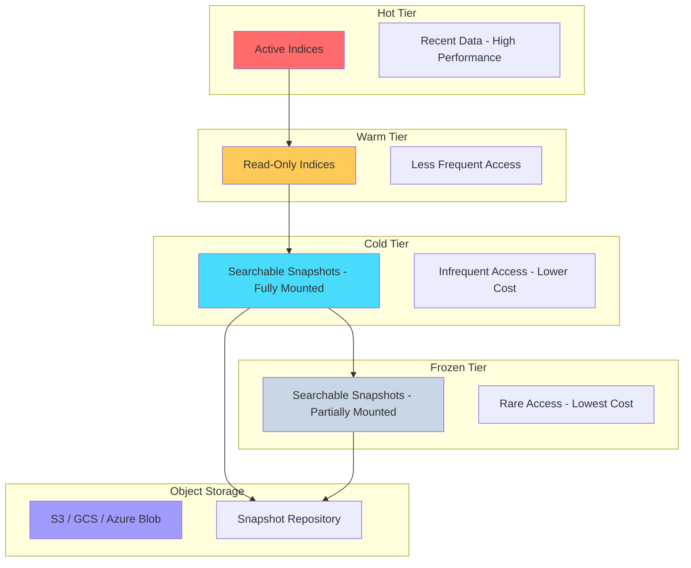
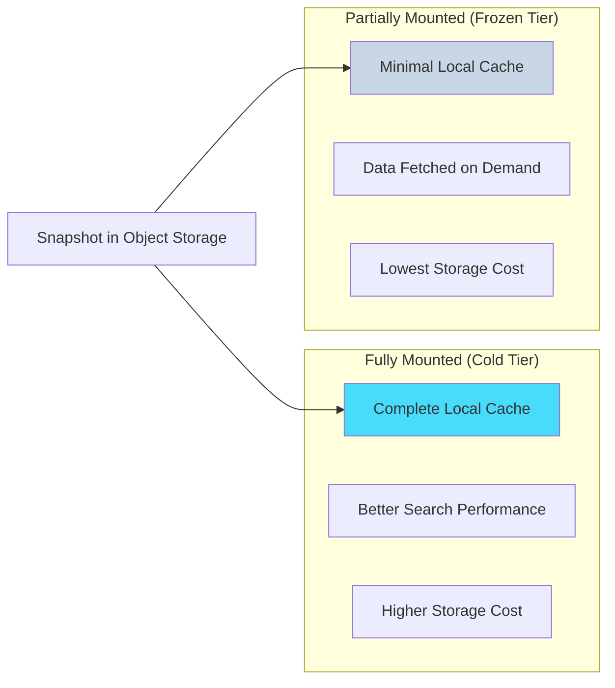
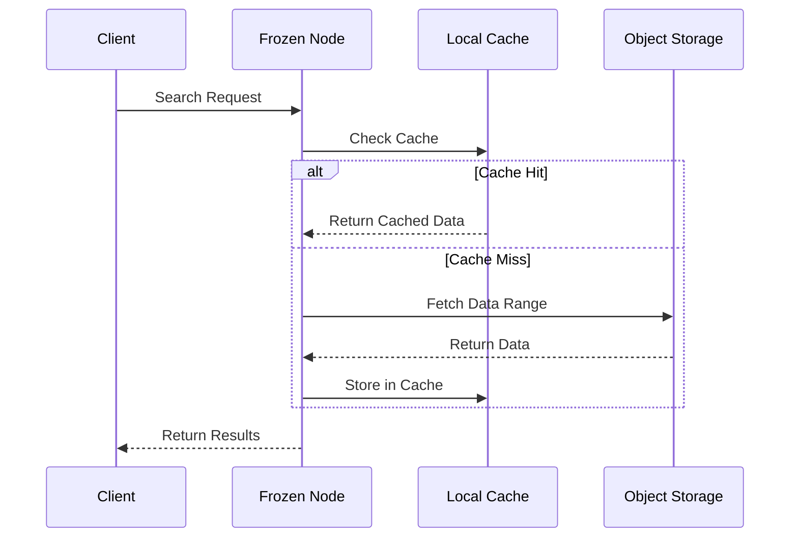
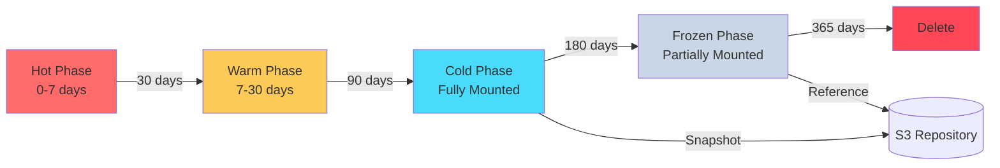
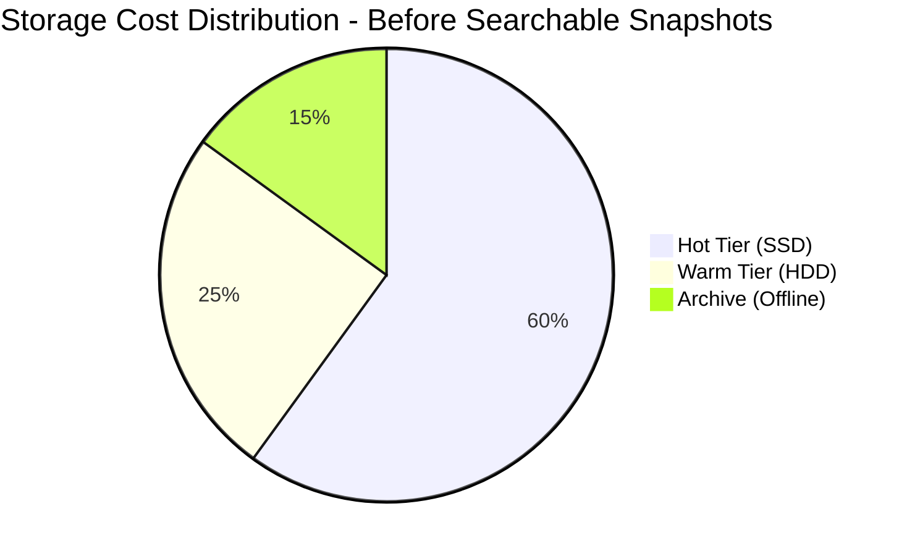
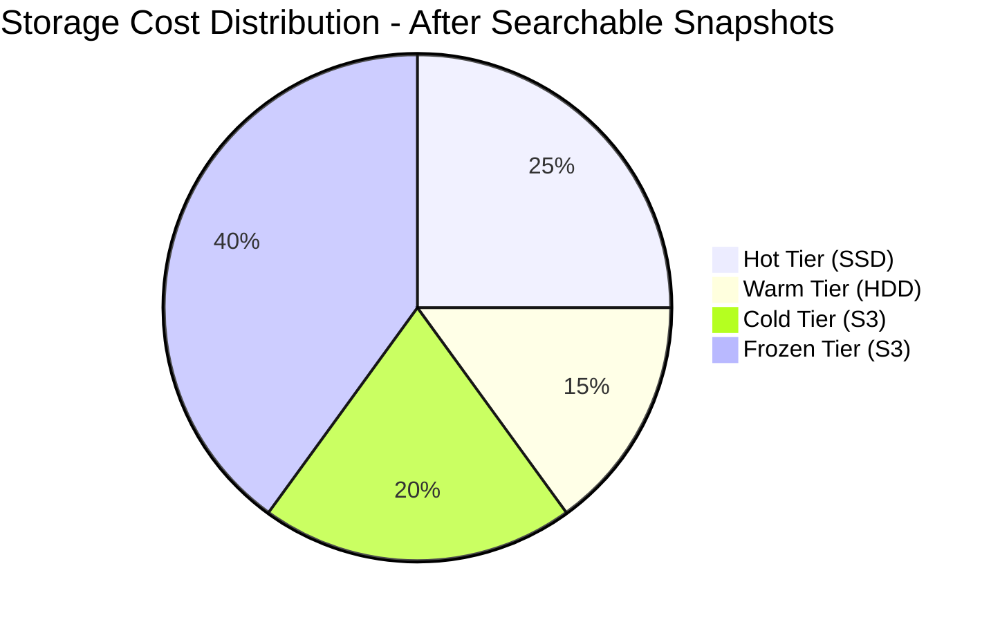

# How to Create Elasticsearch Searchable Snapshots

Author: [nawazdhandala](https://github.com/nawazdhandala)

Tags: Elasticsearch, Searchable Snapshots, Tiered Storage, Cost Optimization

Description: Learn to implement Elasticsearch searchable snapshots for cost-effective cold storage with mounted indices and search capability.

---

## Introduction

Elasticsearch searchable snapshots revolutionize how you manage data lifecycle by allowing you to store indices in cost-effective object storage while maintaining search capability. This feature is essential for implementing tiered storage architectures where you want to balance performance, cost, and data retention requirements.

Traditional approaches required you to either keep data on expensive hot nodes or restore entire snapshots when you needed historical data. Searchable snapshots eliminate this trade-off by letting you search snapshot data directly without full restoration.

## Understanding Tiered Storage Architecture

Before diving into implementation, let us understand how searchable snapshots fit into the Elasticsearch tiered storage model.



## Prerequisites

Before implementing searchable snapshots, ensure you have:

- Elasticsearch 7.10 or later (8.x recommended for best features)
- A valid license (Platinum or Enterprise for full functionality)
- Object storage bucket (AWS S3, Google Cloud Storage, or Azure Blob Storage)
- Appropriate IAM permissions for your storage backend

## Step 1: Configure the Snapshot Repository

The first step is to set up a snapshot repository pointing to your object storage. This repository will store your snapshots and serve as the source for searchable snapshot mounts.

### AWS S3 Repository Configuration

First, install the repository-s3 plugin on all nodes:

```bash
# Install the S3 repository plugin
bin/elasticsearch-plugin install repository-s3

# Add credentials to the Elasticsearch keystore
bin/elasticsearch-keystore add s3.client.default.access_key
bin/elasticsearch-keystore add s3.client.default.secret_key
```

Then create the repository using the Elasticsearch API:

```json
PUT _snapshot/my-s3-repository
{
  "type": "s3",
  "settings": {
    "bucket": "my-elasticsearch-snapshots",
    "region": "us-east-1",
    "base_path": "snapshots",
    "max_restore_bytes_per_sec": "1gb",
    "max_snapshot_bytes_per_sec": "500mb",
    "server_side_encryption": true
  }
}
```

### Google Cloud Storage Repository Configuration

```json
PUT _snapshot/my-gcs-repository
{
  "type": "gcs",
  "settings": {
    "bucket": "my-elasticsearch-snapshots",
    "base_path": "snapshots",
    "chunk_size": "100mb"
  }
}
```

### Azure Blob Storage Repository Configuration

```json
PUT _snapshot/my-azure-repository
{
  "type": "azure",
  "settings": {
    "container": "elasticsearch-snapshots",
    "base_path": "snapshots",
    "chunk_size": "64mb"
  }
}
```

### Verify Repository Configuration

Always verify your repository is working correctly:

```json
POST _snapshot/my-s3-repository/_verify
```

A successful response confirms all nodes can access the repository:

```json
{
  "nodes": {
    "node-1": { "name": "es-node-01" },
    "node-2": { "name": "es-node-02" },
    "node-3": { "name": "es-node-03" }
  }
}
```

## Step 2: Create Snapshots

Before mounting searchable snapshots, you need actual snapshots in your repository.

### Create a Manual Snapshot

```json
PUT _snapshot/my-s3-repository/snapshot-2026-01-30
{
  "indices": "logs-2025*",
  "ignore_unavailable": true,
  "include_global_state": false,
  "metadata": {
    "taken_by": "admin",
    "purpose": "monthly-archive"
  }
}
```

### Monitor Snapshot Progress

```json
GET _snapshot/my-s3-repository/snapshot-2026-01-30/_status
```

## Step 3: Mount Searchable Snapshots

Elasticsearch offers two mounting strategies, each suited for different use cases.



### Fully Mounted Index (Cold Tier)

Fully mounted indices cache all data locally, providing better search performance at slightly higher storage costs. Use this for data that is accessed infrequently but requires reasonable response times.

```json
POST _snapshot/my-s3-repository/snapshot-2026-01-30/_mount?wait_for_completion=true
{
  "index": "logs-2025-06",
  "renamed_index": "logs-2025-06-searchable",
  "index_settings": {
    "index.number_of_replicas": 0,
    "index.routing.allocation.include._tier_preference": "data_cold"
  }
}
```

### Partially Mounted Index (Frozen Tier)

Partially mounted indices keep only essential metadata locally and fetch data from object storage on demand. This is the most cost-effective option for rarely accessed data.

```json
POST _snapshot/my-s3-repository/snapshot-2026-01-30/_mount?wait_for_completion=true&storage=shared_cache
{
  "index": "logs-2025-01",
  "renamed_index": "logs-2025-01-frozen",
  "index_settings": {
    "index.routing.allocation.include._tier_preference": "data_frozen"
  }
}
```

### Verify Mounted Indices

```json
GET logs-2025-06-searchable/_settings?filter_path=**.store.type

# Response
{
  "logs-2025-06-searchable": {
    "settings": {
      "index": {
        "store": {
          "type": "snapshot"
        }
      }
    }
  }
}
```

## Step 4: Configure Frozen Tier Nodes

For partially mounted snapshots, you need dedicated frozen tier nodes with shared cache configuration.

### elasticsearch.yml Configuration

```yaml
# Node role configuration for frozen tier
node.roles: [ data_frozen ]

# Shared cache configuration
xpack.searchable.snapshot.shared_cache.size: 90%
xpack.searchable.snapshot.shared_cache.size.max_headroom: 100GB

# Cache recovery settings
xpack.searchable.snapshot.shared_cache.recovery_range_size: 128kb
```

### Understanding Cache Behavior



## Step 5: Integrate with Index Lifecycle Management (ILM)

ILM automates the transition of indices through storage tiers. Here is a comprehensive policy that leverages searchable snapshots.

### Create an ILM Policy

```json
PUT _ilm/policy/logs-lifecycle-policy
{
  "policy": {
    "phases": {
      "hot": {
        "min_age": "0ms",
        "actions": {
          "rollover": {
            "max_primary_shard_size": "50gb",
            "max_age": "7d"
          },
          "set_priority": {
            "priority": 100
          }
        }
      },
      "warm": {
        "min_age": "30d",
        "actions": {
          "shrink": {
            "number_of_shards": 1
          },
          "forcemerge": {
            "max_num_segments": 1
          },
          "set_priority": {
            "priority": 50
          },
          "allocate": {
            "require": {
              "_tier_preference": "data_warm"
            }
          }
        }
      },
      "cold": {
        "min_age": "90d",
        "actions": {
          "searchable_snapshot": {
            "snapshot_repository": "my-s3-repository",
            "force_merge_index": true
          },
          "set_priority": {
            "priority": 0
          }
        }
      },
      "frozen": {
        "min_age": "180d",
        "actions": {
          "searchable_snapshot": {
            "snapshot_repository": "my-s3-repository"
          }
        }
      },
      "delete": {
        "min_age": "365d",
        "actions": {
          "delete": {}
        }
      }
    }
  }
}
```

### ILM Lifecycle Visualization



### Apply Policy to Index Template

```json
PUT _index_template/logs-template
{
  "index_patterns": ["logs-*"],
  "template": {
    "settings": {
      "number_of_shards": 3,
      "number_of_replicas": 1,
      "index.lifecycle.name": "logs-lifecycle-policy",
      "index.lifecycle.rollover_alias": "logs"
    }
  }
}
```

## Step 6: Querying Searchable Snapshots

Searchable snapshots support the full Query DSL. However, there are considerations for optimal performance.

### Basic Search Query

```json
GET logs-2025-06-searchable/_search
{
  "query": {
    "bool": {
      "must": [
        { "match": { "message": "error" } }
      ],
      "filter": [
        { "range": { "@timestamp": { "gte": "2025-06-01", "lt": "2025-07-01" } } }
      ]
    }
  },
  "size": 100
}
```

### Async Search for Frozen Indices

Frozen tier queries can take longer due to data fetching from object storage. Use async search for better handling:

```json
POST logs-2025-01-frozen/_async_search
{
  "query": {
    "bool": {
      "must": [
        { "match": { "level": "ERROR" } }
      ],
      "filter": [
        { "term": { "service.name": "payment-gateway" } }
      ]
    }
  },
  "aggs": {
    "errors_over_time": {
      "date_histogram": {
        "field": "@timestamp",
        "calendar_interval": "day"
      }
    }
  },
  "wait_for_completion_timeout": "5s",
  "keep_alive": "5m"
}
```

### Check Async Search Status

```json
GET _async_search/FmRldE8zREVEUzA2ZVpUeGs2ejJFUFEaMkZ5QTVrSTZTaHp3WlppekxETGNkXzk0Ng==
```

## Performance Considerations

### Query Optimization Tips

1. **Use Time-Based Filters**: Always include timestamp ranges to minimize data fetched from object storage.

2. **Prefer Filters Over Queries**: Filters are cached and avoid scoring overhead.

3. **Limit Result Size**: Request only the fields you need using source filtering.

```json
GET logs-2025-*-frozen/_search
{
  "_source": ["@timestamp", "message", "level"],
  "query": {
    "bool": {
      "filter": [
        { "range": { "@timestamp": { "gte": "now-7d" } } },
        { "term": { "level": "ERROR" } }
      ]
    }
  },
  "size": 50
}
```

### Performance Comparison

```mermaid
graph TB
    subgraph "Response Time Comparison"
        A[Hot Tier: 10-50ms]
        B[Warm Tier: 50-200ms]
        C[Cold Tier - Fully Mounted: 100-500ms]
        D[Frozen Tier - Partially Mounted: 500ms-5s]
    end

    subgraph "Storage Cost Comparison"
        E[Hot: $$$$$]
        F[Warm: $$$$]
        G[Cold: $$]
        H[Frozen: $]
    end

    A --- E
    B --- F
    C --- G
    D --- H
```

### Cache Warming

For predictable query patterns, consider pre-warming the cache:

```json
POST logs-2025-01-frozen/_search
{
  "query": {
    "match_all": {}
  },
  "size": 0,
  "track_total_hits": true
}
```

## Monitoring and Troubleshooting

### Monitor Searchable Snapshot Stats

```json
GET _searchable_snapshots/stats

# Response includes cache utilization and fetch statistics
{
  "total": 1500,
  "total_hit_count": 1200,
  "hit_rate": 0.8,
  "evictions": 50,
  "eviction_rate": 0.03
}
```

### Check Index Recovery Status

```json
GET logs-2025-06-searchable/_recovery?active_only=true
```

### Common Issues and Solutions

| Issue | Cause | Solution |
|-------|-------|----------|
| Slow queries on frozen tier | Cold cache | Implement cache warming for frequently accessed data |
| Mount failures | Repository access | Verify repository connectivity and permissions |
| High eviction rate | Insufficient cache | Increase shared cache size or reduce mounted indices |
| ILM stuck in cold phase | Missing snapshot | Ensure snapshots complete before phase transition |

## Cost Optimization Strategies





### Cost Savings Calculation

Consider a cluster with 10TB of data:

| Tier | Storage Type | Cost/GB/Month | Data | Monthly Cost |
|------|-------------|---------------|------|--------------|
| Hot | Local SSD | $0.25 | 1TB | $250 |
| Warm | Local HDD | $0.10 | 2TB | $200 |
| Cold | S3 Standard | $0.023 | 3TB | $69 |
| Frozen | S3 Standard | $0.023 | 4TB | $92 |

**Total: ~$611/month vs ~$2,500/month with all data on hot tier**

## Best Practices Summary

1. **Plan Your Tiers**: Define clear criteria for when data moves between tiers based on access patterns and business requirements.

2. **Right-Size Cache**: Monitor cache hit rates and adjust `xpack.searchable.snapshot.shared_cache.size` accordingly.

3. **Use ILM Automation**: Avoid manual snapshot mounting - let ILM handle the lifecycle automatically.

4. **Implement Async Search**: Always use async search for frozen tier queries to handle longer response times gracefully.

5. **Monitor Repository Health**: Set up alerts for snapshot failures and repository connectivity issues.

6. **Test Recovery Procedures**: Regularly verify you can restore from searchable snapshots in disaster recovery scenarios.

## Conclusion

Elasticsearch searchable snapshots provide a powerful mechanism for implementing cost-effective tiered storage while maintaining search capability across your entire data lifecycle. By combining snapshot repositories, strategic mounting options, and ILM automation, you can significantly reduce storage costs without sacrificing the ability to query historical data.

The key to success lies in understanding your data access patterns and choosing the appropriate tier for each dataset. Hot data stays on fast local storage, while older data gradually moves to more cost-effective object storage - all while remaining fully searchable.

Start by implementing searchable snapshots for your oldest indices and gradually expand as you gain confidence in the system. With proper monitoring and optimization, you can achieve 60-80% reduction in storage costs while maintaining comprehensive search capabilities across your entire data estate.

## References

- [Elasticsearch Searchable Snapshots Documentation](https://www.elastic.co/guide/en/elasticsearch/reference/current/searchable-snapshots.html)
- [Index Lifecycle Management](https://www.elastic.co/guide/en/elasticsearch/reference/current/index-lifecycle-management.html)
- [Data Tiers](https://www.elastic.co/guide/en/elasticsearch/reference/current/data-tiers.html)
- [Snapshot and Restore](https://www.elastic.co/guide/en/elasticsearch/reference/current/snapshot-restore.html)
