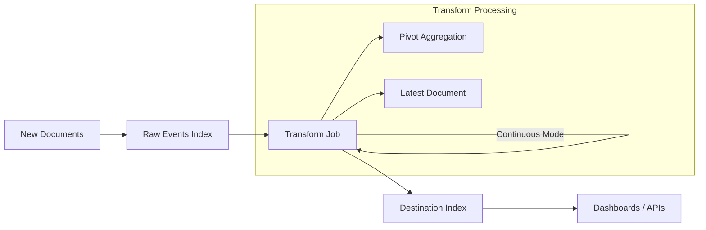
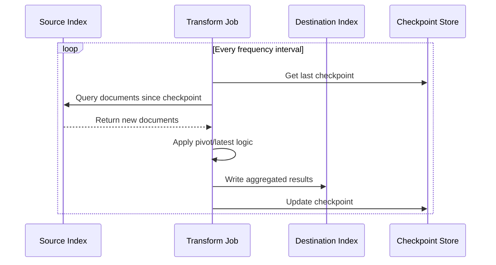
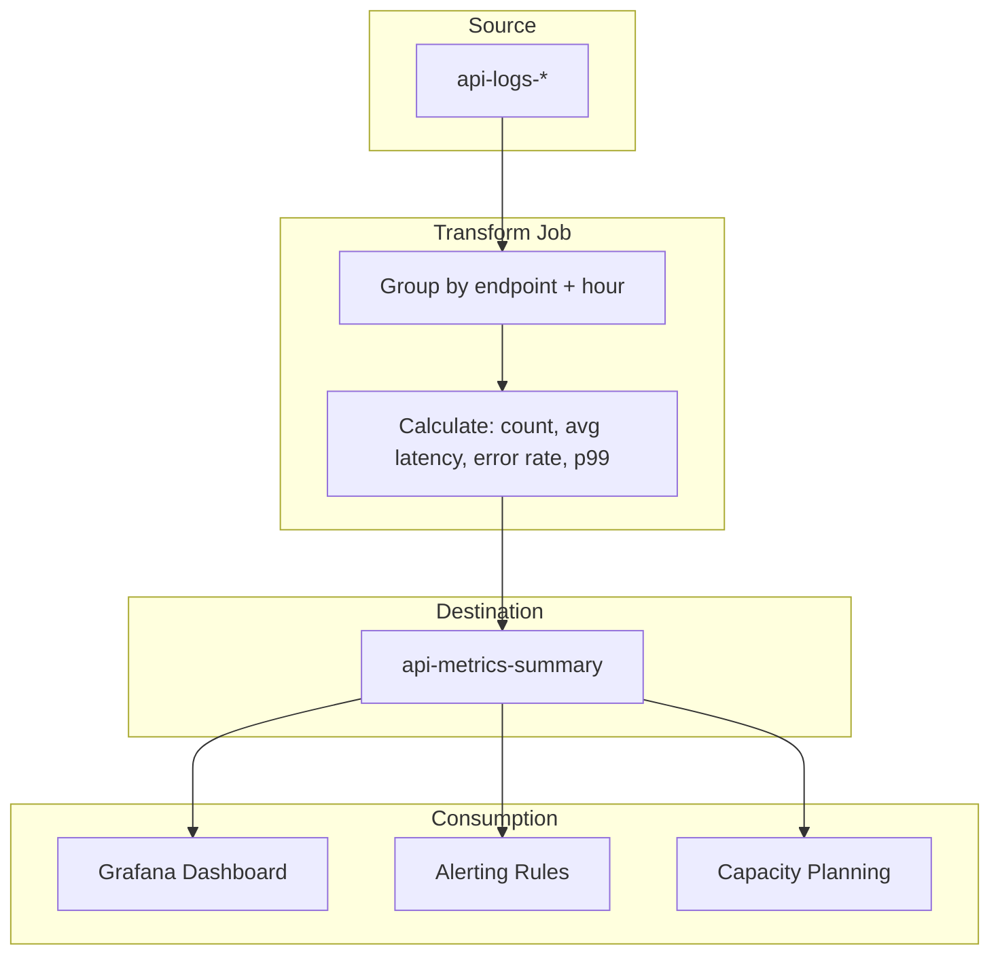

# How to Build Elasticsearch Transform Jobs

Author: [nawazdhandala](https://github.com/nawazdhandala)

Tags: Elasticsearch, Transform, ETL, Analytics

Description: A practical guide to building Elasticsearch transform jobs for aggregating, summarizing, and restructuring data at scale.

---

Elasticsearch stores raw event data well. But when you need to summarize millions of documents into actionable analytics, querying raw indices every time becomes slow and expensive. Transform jobs solve this by precomputing aggregations and storing them in destination indices.

This guide walks through creating pivot transforms, latest transforms, and running them in continuous mode for real-time analytics pipelines.

---

## What are Elasticsearch Transforms?

Transforms take source indices and produce summarized destination indices. Think of them as materialized views that continuously update as new data arrives.

| Transform Type | Use Case | Output |
|----------------|----------|--------|
| Pivot | Aggregate data by groups (sum, avg, count) | One document per unique group |
| Latest | Get most recent document per entity | One document per entity with latest values |

---

## Transform Pipeline Architecture



---

## Creating a Pivot Transform

Pivot transforms aggregate documents using group-by fields and apply metrics like sum, average, or cardinality.

### Example: Summarize Web Traffic by Country and Hour

Source index `web-logs` has documents like:

```json
{
  "@timestamp": "2026-01-30T10:15:00Z",
  "country": "US",
  "bytes": 4521,
  "response_code": 200,
  "user_agent": "Mozilla/5.0"
}
```

Create a transform that groups by country and hour:

```json
PUT _transform/web-traffic-summary
{
  "source": {
    "index": ["web-logs-*"]
  },
  "dest": {
    "index": "web-traffic-summary"
  },
  "pivot": {
    "group_by": {
      "country": {
        "terms": {
          "field": "country"
        }
      },
      "hour": {
        "date_histogram": {
          "field": "@timestamp",
          "calendar_interval": "1h"
        }
      }
    },
    "aggregations": {
      "total_bytes": {
        "sum": {
          "field": "bytes"
        }
      },
      "request_count": {
        "value_count": {
          "field": "country"
        }
      },
      "avg_bytes": {
        "avg": {
          "field": "bytes"
        }
      },
      "error_count": {
        "filter": {
          "range": {
            "response_code": {
              "gte": 400
            }
          }
        }
      },
      "unique_users": {
        "cardinality": {
          "field": "user_agent"
        }
      }
    }
  },
  "description": "Hourly web traffic summary by country",
  "frequency": "5m",
  "sync": {
    "time": {
      "field": "@timestamp",
      "delay": "1m"
    }
  }
}
```

### Output Document Structure

Each document in `web-traffic-summary` looks like:

```json
{
  "country": "US",
  "hour": "2026-01-30T10:00:00.000Z",
  "total_bytes": 15234567,
  "request_count": 42531,
  "avg_bytes": 358.2,
  "error_count": 127,
  "unique_users": 8923
}
```

---

## Creating a Latest Transform

Latest transforms retrieve the most recent document for each entity. Useful for tracking current state (last login, latest sensor reading, current inventory level).

### Example: Track Latest User Activity

Source index `user-activity` contains:

```json
{
  "@timestamp": "2026-01-30T14:22:00Z",
  "user_id": "user_123",
  "action": "page_view",
  "page": "/dashboard",
  "session_id": "sess_abc"
}
```

Create a transform to get the latest activity per user:

```json
PUT _transform/latest-user-activity
{
  "source": {
    "index": ["user-activity-*"]
  },
  "dest": {
    "index": "latest-user-activity"
  },
  "latest": {
    "unique_key": ["user_id"],
    "sort": "@timestamp"
  },
  "description": "Most recent activity per user",
  "frequency": "1m",
  "sync": {
    "time": {
      "field": "@timestamp",
      "delay": "30s"
    }
  }
}
```

### Output Document

One document per `user_id` with all fields from the latest source document:

```json
{
  "user_id": "user_123",
  "@timestamp": "2026-01-30T14:22:00Z",
  "action": "page_view",
  "page": "/dashboard",
  "session_id": "sess_abc"
}
```

---

## Continuous Mode vs Batch Mode

Transforms run in two modes:

| Mode | Behavior | Use Case |
|------|----------|----------|
| Batch | Runs once, processes all existing data | Backfilling historical data |
| Continuous | Keeps running, processes new documents | Real-time analytics |

### Enabling Continuous Mode

The `sync` configuration enables continuous mode:

```json
{
  "sync": {
    "time": {
      "field": "@timestamp",
      "delay": "1m"
    }
  },
  "frequency": "5m"
}
```

- `field`: The timestamp field to track for new documents
- `delay`: Wait time before processing (handles late-arriving data)
- `frequency`: How often the transform checks for new data

---

## Continuous Transform Data Flow



---

## Starting and Managing Transforms

### Start a Transform

```json
POST _transform/web-traffic-summary/_start
```

### Stop a Transform

```json
POST _transform/web-traffic-summary/_stop
```

### Check Transform Status

```json
GET _transform/web-traffic-summary/_stats
```

Response includes processing stats:

```json
{
  "transforms": [
    {
      "id": "web-traffic-summary",
      "state": "started",
      "stats": {
        "pages_processed": 1542,
        "documents_processed": 2847263,
        "documents_indexed": 8934,
        "trigger_count": 312,
        "index_time_in_ms": 4521,
        "search_time_in_ms": 28934
      },
      "checkpointing": {
        "last": {
          "checkpoint": 312,
          "timestamp_millis": 1706619600000
        }
      }
    }
  ]
}
```

### Preview Transform Output

Test your transform before creating it:

```json
POST _transform/_preview
{
  "source": {
    "index": ["web-logs-*"]
  },
  "pivot": {
    "group_by": {
      "country": { "terms": { "field": "country" } }
    },
    "aggregations": {
      "request_count": { "value_count": { "field": "country" } }
    }
  }
}
```

---

## Advanced Pivot Aggregations

### Nested Aggregations

Compute percentiles and extended stats:

```json
{
  "pivot": {
    "group_by": {
      "service": { "terms": { "field": "service.name" } }
    },
    "aggregations": {
      "latency_percentiles": {
        "percentiles": {
          "field": "duration_ms",
          "percents": [50, 90, 95, 99]
        }
      },
      "latency_stats": {
        "extended_stats": {
          "field": "duration_ms"
        }
      }
    }
  }
}
```

### Scripted Metrics

Calculate custom metrics with Painless scripts:

```json
{
  "aggregations": {
    "error_rate": {
      "bucket_script": {
        "buckets_path": {
          "errors": "error_count",
          "total": "request_count"
        },
        "script": "params.errors / params.total * 100"
      }
    }
  }
}
```

### Multiple Group-By Fields

Group by multiple dimensions:

```json
{
  "group_by": {
    "service": { "terms": { "field": "service.name" } },
    "environment": { "terms": { "field": "environment" } },
    "status_code": { "terms": { "field": "http.status_code" } },
    "hour": {
      "date_histogram": {
        "field": "@timestamp",
        "fixed_interval": "1h"
      }
    }
  }
}
```

---

## Filtering Source Data

Apply query filters to process only relevant documents:

```json
PUT _transform/production-errors
{
  "source": {
    "index": ["app-logs-*"],
    "query": {
      "bool": {
        "must": [
          { "term": { "environment": "production" } },
          { "range": { "log_level": { "gte": "ERROR" } } }
        ],
        "must_not": [
          { "term": { "service.name": "health-check" } }
        ]
      }
    }
  },
  "dest": {
    "index": "production-error-summary"
  },
  "pivot": {
    "group_by": {
      "service": { "terms": { "field": "service.name" } },
      "error_type": { "terms": { "field": "error.type" } }
    },
    "aggregations": {
      "count": { "value_count": { "field": "service.name" } },
      "first_seen": { "min": { "field": "@timestamp" } },
      "last_seen": { "max": { "field": "@timestamp" } }
    }
  },
  "frequency": "1m",
  "sync": {
    "time": {
      "field": "@timestamp",
      "delay": "30s"
    }
  }
}
```

---

## Destination Index Configuration

### Set Index Mappings

Create the destination index with proper mappings before starting the transform:

```json
PUT production-error-summary
{
  "settings": {
    "number_of_shards": 1,
    "number_of_replicas": 1
  },
  "mappings": {
    "properties": {
      "service": { "type": "keyword" },
      "error_type": { "type": "keyword" },
      "count": { "type": "long" },
      "first_seen": { "type": "date" },
      "last_seen": { "type": "date" }
    }
  }
}
```

### Index Lifecycle Management

Apply ILM policies to manage destination index retention:

```json
PUT _ilm/policy/transform-rollover
{
  "policy": {
    "phases": {
      "hot": {
        "actions": {
          "rollover": {
            "max_size": "10gb",
            "max_age": "7d"
          }
        }
      },
      "delete": {
        "min_age": "30d",
        "actions": {
          "delete": {}
        }
      }
    }
  }
}
```

---

## Performance Tuning

### Frequency and Delay Settings

| Setting | Low Value | High Value |
|---------|-----------|------------|
| frequency | More CPU usage, fresher data | Less CPU usage, stale data |
| delay | Miss late data | Higher latency to destination |

Recommendations:

- For real-time dashboards: `frequency: 1m`, `delay: 30s`
- For daily reports: `frequency: 1h`, `delay: 5m`
- For high-volume indices: `frequency: 5m`, `delay: 2m`

### Optimize Group-By Cardinality

High cardinality group-by fields create many output documents. Limit cardinality where possible:

```json
{
  "group_by": {
    "country": {
      "terms": {
        "field": "country",
        "missing_bucket": true
      }
    }
  }
}
```

### Resource Limits

Set `max_page_search_size` to control memory usage:

```json
PUT _transform/web-traffic-summary
{
  "settings": {
    "max_page_search_size": 500
  }
}
```

---

## Monitoring Transforms

### Health Check Query

```json
GET _transform/_stats?allow_no_match=true
```

### Common Issues

| Symptom | Cause | Fix |
|---------|-------|-----|
| Transform stuck | Source index mapping changed | Recreate transform with updated config |
| High search time | Large page size or complex aggregations | Reduce `max_page_search_size` |
| Documents missing | Late-arriving data | Increase `delay` setting |
| Checkpoint not advancing | No new documents matching query | Verify source index is receiving data |

### Alerting on Transform Health

Query transform stats and alert when state is not `started` or when `documents_processed` stops increasing.

---

## Full Transform Pipeline Example

Here is a complete example that tracks API metrics per endpoint:



### Complete Transform Definition

```json
PUT _transform/api-metrics-summary
{
  "source": {
    "index": ["api-logs-*"],
    "query": {
      "bool": {
        "filter": [
          { "exists": { "field": "http.request.path" } }
        ]
      }
    }
  },
  "dest": {
    "index": "api-metrics-summary",
    "pipeline": "add-timestamp"
  },
  "pivot": {
    "group_by": {
      "endpoint": {
        "terms": {
          "field": "http.request.path"
        }
      },
      "method": {
        "terms": {
          "field": "http.request.method"
        }
      },
      "hour": {
        "date_histogram": {
          "field": "@timestamp",
          "fixed_interval": "1h"
        }
      }
    },
    "aggregations": {
      "request_count": {
        "value_count": {
          "field": "http.request.path"
        }
      },
      "avg_latency_ms": {
        "avg": {
          "field": "http.response.latency_ms"
        }
      },
      "p99_latency_ms": {
        "percentiles": {
          "field": "http.response.latency_ms",
          "percents": [99]
        }
      },
      "error_count": {
        "filter": {
          "range": {
            "http.response.status_code": {
              "gte": 500
            }
          }
        }
      },
      "success_count": {
        "filter": {
          "range": {
            "http.response.status_code": {
              "lt": 400
            }
          }
        }
      }
    }
  },
  "description": "Hourly API metrics by endpoint",
  "frequency": "5m",
  "sync": {
    "time": {
      "field": "@timestamp",
      "delay": "1m"
    }
  },
  "settings": {
    "max_page_search_size": 1000
  }
}
```

### Start and Verify

```bash
# Start the transform
curl -X POST "localhost:9200/_transform/api-metrics-summary/_start"

# Check status after a few minutes
curl -X GET "localhost:9200/_transform/api-metrics-summary/_stats?pretty"

# Query the destination index
curl -X GET "localhost:9200/api-metrics-summary/_search?pretty" -H 'Content-Type: application/json' -d'
{
  "size": 5,
  "sort": [{ "hour": "desc" }]
}'
```

---

## Updating a Transform

Transforms cannot be modified while running. To update:

1. Stop the transform
2. Delete and recreate with new configuration
3. The new transform resumes from where it left off (if checkpoints are compatible)

```json
POST _transform/api-metrics-summary/_stop

DELETE _transform/api-metrics-summary

PUT _transform/api-metrics-summary
{
  // Updated configuration
}

POST _transform/api-metrics-summary/_start
```

For breaking changes (like new group-by fields), you may need to delete the destination index and reprocess from scratch.

---

## Key Takeaways

| Principle | Application |
|-----------|-------------|
| Precompute expensive aggregations | Use pivot transforms for dashboards and reports |
| Track entity state | Use latest transforms for current status queries |
| Handle late data | Configure appropriate delay settings |
| Monitor continuously | Check transform stats and checkpoint progress |
| Right-size resources | Tune frequency and page size for your workload |

Transforms turn Elasticsearch from a search engine into an analytics engine. Design your transforms around the questions you need to answer, not the data you happen to have.

---

**Related Reading:**

- [Elasticsearch Documentation: Transforms](https://www.elastic.co/guide/en/elasticsearch/reference/current/transforms.html)
- [How to Reduce Noise in OpenTelemetry](/blog/post/2025-08-25-how-to-reduce-noise-in-opentelemetry)
- [What are Traces and Spans in OpenTelemetry](/blog/post/2025-08-27-traces-and-spans-in-opentelemetry)
