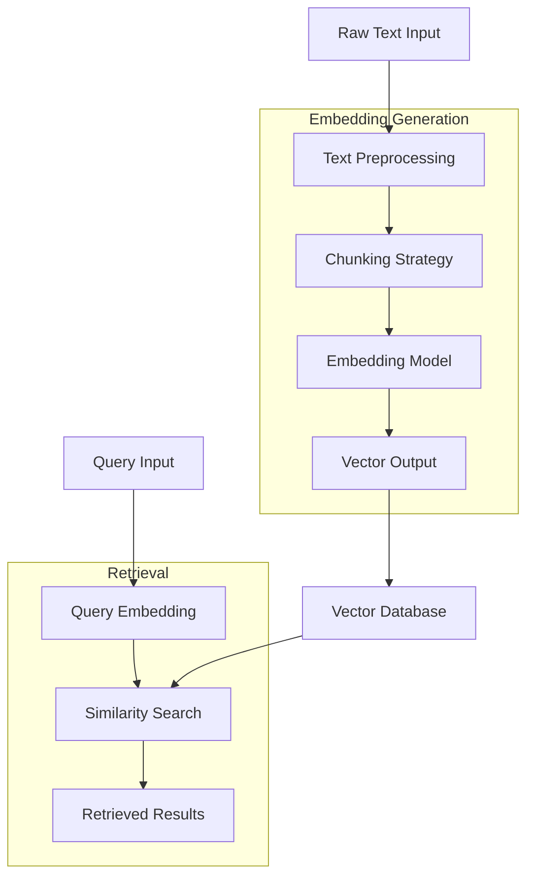
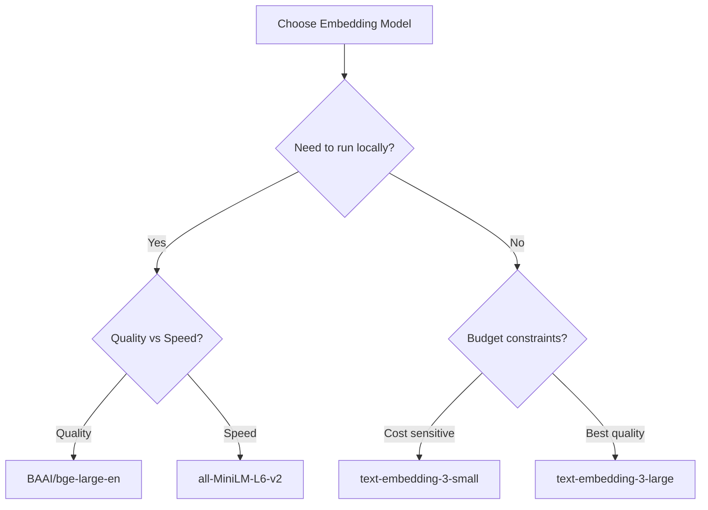
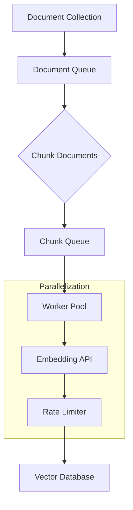
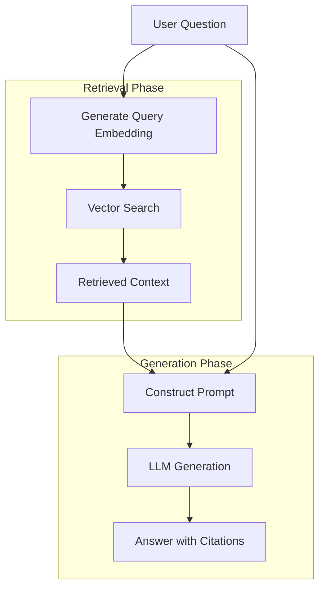

# How to Build Embedding Generation

Author: [nawazdhandala](https://github.com/nawazdhandala)

Tags: RAG, Embeddings, AI, NLP

Description: A practical guide to building embedding generation pipelines for semantic search, RAG applications, and AI-powered features using Python and TypeScript.

---

> Embeddings transform text into numerical vectors that capture semantic meaning, enabling machines to understand similarity between concepts rather than just matching keywords.

Text embeddings are the foundation of modern AI applications. From semantic search to retrieval-augmented generation (RAG), recommendation systems to duplicate detection, embeddings power the intelligence behind these features. This guide walks through building embedding generation systems from scratch, covering architecture decisions, implementation patterns, and production considerations.

---

## Table of Contents

1. What Are Embeddings?
2. Embedding Architecture Overview
3. Choosing an Embedding Model
4. Building the Embedding Pipeline
5. Python Implementation
6. TypeScript/Node.js Implementation
7. Batch Processing for Scale
8. Vector Storage Options
9. Building a Semantic Search System
10. RAG Integration
11. Performance Optimization
12. Production Considerations
13. Common Pitfalls
14. Putting It All Together

---

## 1. What Are Embeddings?

An embedding is a dense numerical representation of data (text, images, audio) in a continuous vector space. Similar items cluster together in this space, enabling:

| Use Case | How Embeddings Help |
|----------|---------------------|
| Semantic Search | Find documents by meaning, not just keywords |
| RAG (Retrieval Augmented Generation) | Retrieve relevant context for LLM prompts |
| Deduplication | Detect near-duplicate content |
| Classification | Group similar items together |
| Recommendations | Find related content based on similarity |
| Anomaly Detection | Identify outliers in your data |

Simple analogy: If words were cities, embeddings would be their GPS coordinates. "Paris" and "France" would be close together, while "Paris" and "banana" would be far apart.

---

## 2. Embedding Architecture Overview

Here is a typical embedding generation pipeline:



Key components:

| Component | Purpose |
|-----------|---------|
| Text Preprocessing | Clean, normalize, and prepare text |
| Chunking | Split long documents into processable segments |
| Embedding Model | Convert text chunks to vectors |
| Vector Database | Store and index embeddings for fast retrieval |
| Similarity Search | Find nearest neighbors in vector space |

---

## 3. Choosing an Embedding Model

Embedding models vary in quality, speed, and dimension size:

| Model | Dimensions | Context Length | Best For |
|-------|-----------|----------------|----------|
| OpenAI text-embedding-3-small | 1536 | 8191 tokens | General purpose, cost effective |
| OpenAI text-embedding-3-large | 3072 | 8191 tokens | Highest quality, more expensive |
| Cohere embed-english-v3.0 | 1024 | 512 tokens | English text, good balance |
| sentence-transformers/all-MiniLM-L6-v2 | 384 | 256 tokens | Open source, fast, runs locally |
| BAAI/bge-large-en-v1.5 | 1024 | 512 tokens | Open source, high quality |

Decision framework:



---

## 4. Building the Embedding Pipeline

A robust embedding pipeline handles these concerns:

1. **Input Validation**: Ensure text is not empty or too long
2. **Preprocessing**: Clean and normalize text
3. **Chunking**: Split documents intelligently
4. **Batching**: Process multiple texts efficiently
5. **Error Handling**: Retry on failures, handle rate limits
6. **Caching**: Avoid recomputing identical embeddings

Chunking strategies matter significantly for retrieval quality:

| Strategy | Description | When to Use |
|----------|-------------|-------------|
| Fixed Size | Split by character/token count | Simple documents, logs |
| Sentence | Split on sentence boundaries | Articles, documentation |
| Paragraph | Split on paragraph breaks | Structured content |
| Semantic | Split on topic changes | Long-form content |
| Recursive | Try larger chunks, fall back to smaller | General purpose |

---

## 5. Python Implementation

Here is a complete Python implementation using OpenAI and a local model option.

### Core Embedding Class

This class provides a unified interface for generating embeddings with support for both OpenAI API and local models:

```python
# embedding_generator.py
import os
import hashlib
import json
from typing import List, Optional, Union
from dataclasses import dataclass
import numpy as np

@dataclass
class EmbeddingResult:
    """Container for embedding output with metadata."""
    text: str
    embedding: List[float]
    model: str
    token_count: int

    def to_dict(self) -> dict:
        return {
            "text": self.text,
            "embedding": self.embedding,
            "model": self.model,
            "token_count": self.token_count
        }


class EmbeddingGenerator:
    """
    Unified embedding generator supporting multiple backends.
    Handles batching, caching, and error recovery.
    """

    def __init__(
        self,
        model: str = "text-embedding-3-small",
        api_key: Optional[str] = None,
        cache_dir: Optional[str] = None,
        max_retries: int = 3
    ):
        self.model = model
        self.api_key = api_key or os.getenv("OPENAI_API_KEY")
        self.cache_dir = cache_dir
        self.max_retries = max_retries
        self._client = None
        self._local_model = None

    @property
    def client(self):
        """Lazy initialization of OpenAI client."""
        if self._client is None:
            from openai import OpenAI
            self._client = OpenAI(api_key=self.api_key)
        return self._client

    @property
    def local_model(self):
        """Lazy initialization of local sentence transformer."""
        if self._local_model is None:
            from sentence_transformers import SentenceTransformer
            self._local_model = SentenceTransformer(self.model)
        return self._local_model

    def _cache_key(self, text: str) -> str:
        """Generate a unique cache key for text."""
        content = f"{self.model}:{text}"
        return hashlib.sha256(content.encode()).hexdigest()

    def _get_cached(self, text: str) -> Optional[List[float]]:
        """Retrieve embedding from cache if available."""
        if not self.cache_dir:
            return None

        cache_path = os.path.join(
            self.cache_dir,
            f"{self._cache_key(text)}.json"
        )

        if os.path.exists(cache_path):
            with open(cache_path, "r") as f:
                return json.load(f)["embedding"]
        return None

    def _save_cache(self, text: str, embedding: List[float]) -> None:
        """Save embedding to cache."""
        if not self.cache_dir:
            return

        os.makedirs(self.cache_dir, exist_ok=True)
        cache_path = os.path.join(
            self.cache_dir,
            f"{self._cache_key(text)}.json"
        )

        with open(cache_path, "w") as f:
            json.dump({"text": text, "embedding": embedding}, f)

    def generate(self, text: str) -> EmbeddingResult:
        """
        Generate embedding for a single text.
        Checks cache first, falls back to API/model.
        """
        # Check cache first
        cached = self._get_cached(text)
        if cached:
            return EmbeddingResult(
                text=text,
                embedding=cached,
                model=self.model,
                token_count=0  # Unknown for cached
            )

        # Generate based on model type
        if self.model.startswith("text-embedding"):
            result = self._generate_openai(text)
        else:
            result = self._generate_local(text)

        # Cache the result
        self._save_cache(text, result.embedding)
        return result

    def _generate_openai(self, text: str) -> EmbeddingResult:
        """Generate embedding using OpenAI API."""
        import time

        for attempt in range(self.max_retries):
            try:
                response = self.client.embeddings.create(
                    model=self.model,
                    input=text,
                    encoding_format="float"
                )

                return EmbeddingResult(
                    text=text,
                    embedding=response.data[0].embedding,
                    model=self.model,
                    token_count=response.usage.total_tokens
                )

            except Exception as e:
                if attempt == self.max_retries - 1:
                    raise
                # Exponential backoff
                time.sleep(2 ** attempt)

    def _generate_local(self, text: str) -> EmbeddingResult:
        """Generate embedding using local model."""
        embedding = self.local_model.encode(text)

        return EmbeddingResult(
            text=text,
            embedding=embedding.tolist(),
            model=self.model,
            token_count=len(text.split())  # Approximate
        )

    def generate_batch(
        self,
        texts: List[str],
        batch_size: int = 100
    ) -> List[EmbeddingResult]:
        """
        Generate embeddings for multiple texts efficiently.
        Batches requests to reduce API calls.
        """
        results = []
        uncached_texts = []
        uncached_indices = []

        # Check cache for all texts first
        for i, text in enumerate(texts):
            cached = self._get_cached(text)
            if cached:
                results.append(EmbeddingResult(
                    text=text,
                    embedding=cached,
                    model=self.model,
                    token_count=0
                ))
            else:
                results.append(None)  # Placeholder
                uncached_texts.append(text)
                uncached_indices.append(i)

        # Batch process uncached texts
        for i in range(0, len(uncached_texts), batch_size):
            batch = uncached_texts[i:i + batch_size]
            batch_results = self._generate_batch_internal(batch)

            for j, result in enumerate(batch_results):
                idx = uncached_indices[i + j]
                results[idx] = result
                self._save_cache(result.text, result.embedding)

        return results

    def _generate_batch_internal(
        self,
        texts: List[str]
    ) -> List[EmbeddingResult]:
        """Internal batch generation for uncached texts."""
        if self.model.startswith("text-embedding"):
            response = self.client.embeddings.create(
                model=self.model,
                input=texts,
                encoding_format="float"
            )

            return [
                EmbeddingResult(
                    text=texts[i],
                    embedding=data.embedding,
                    model=self.model,
                    token_count=response.usage.total_tokens // len(texts)
                )
                for i, data in enumerate(response.data)
            ]
        else:
            embeddings = self.local_model.encode(texts)
            return [
                EmbeddingResult(
                    text=text,
                    embedding=emb.tolist(),
                    model=self.model,
                    token_count=len(text.split())
                )
                for text, emb in zip(texts, embeddings)
            ]
```

### Text Chunking Utilities

Smart chunking is critical for retrieval quality. This module provides multiple strategies:

```python
# chunking.py
from typing import List, Callable
import re

def chunk_by_tokens(
    text: str,
    chunk_size: int = 512,
    overlap: int = 50
) -> List[str]:
    """
    Split text into chunks by approximate token count.
    Uses whitespace splitting as a proxy for tokens.
    """
    words = text.split()
    chunks = []

    for i in range(0, len(words), chunk_size - overlap):
        chunk = " ".join(words[i:i + chunk_size])
        if chunk.strip():
            chunks.append(chunk)

    return chunks


def chunk_by_sentences(
    text: str,
    max_sentences: int = 5,
    overlap_sentences: int = 1
) -> List[str]:
    """
    Split text by sentence boundaries.
    Better preserves semantic coherence.
    """
    # Simple sentence splitting pattern
    sentence_pattern = r'(?<=[.!?])\s+'
    sentences = re.split(sentence_pattern, text)
    sentences = [s.strip() for s in sentences if s.strip()]

    chunks = []
    for i in range(0, len(sentences), max_sentences - overlap_sentences):
        chunk = " ".join(sentences[i:i + max_sentences])
        if chunk:
            chunks.append(chunk)

    return chunks


def chunk_by_paragraphs(
    text: str,
    max_paragraphs: int = 3
) -> List[str]:
    """
    Split text by paragraph breaks.
    Ideal for structured documents.
    """
    paragraphs = re.split(r'\n\s*\n', text)
    paragraphs = [p.strip() for p in paragraphs if p.strip()]

    chunks = []
    for i in range(0, len(paragraphs), max_paragraphs):
        chunk = "\n\n".join(paragraphs[i:i + max_paragraphs])
        if chunk:
            chunks.append(chunk)

    return chunks


def recursive_chunk(
    text: str,
    max_chunk_size: int = 1000,
    separators: List[str] = None
) -> List[str]:
    """
    Recursively split text using progressively smaller separators.
    Tries to keep semantic units together.
    """
    if separators is None:
        separators = ["\n\n", "\n", ". ", " "]

    def split_text(text: str, sep_idx: int) -> List[str]:
        if len(text) <= max_chunk_size:
            return [text] if text.strip() else []

        if sep_idx >= len(separators):
            # Force split at max size
            return [
                text[i:i + max_chunk_size]
                for i in range(0, len(text), max_chunk_size)
            ]

        separator = separators[sep_idx]
        parts = text.split(separator)

        chunks = []
        current_chunk = ""

        for part in parts:
            potential = current_chunk + separator + part if current_chunk else part

            if len(potential) <= max_chunk_size:
                current_chunk = potential
            else:
                if current_chunk:
                    chunks.extend(split_text(current_chunk, sep_idx + 1))
                current_chunk = part

        if current_chunk:
            chunks.extend(split_text(current_chunk, sep_idx + 1))

        return chunks

    return split_text(text, 0)
```

### Usage Example

Here is how to use the embedding generator with chunking:

```python
# example_usage.py
from embedding_generator import EmbeddingGenerator
from chunking import recursive_chunk

# Initialize generator with caching
generator = EmbeddingGenerator(
    model="text-embedding-3-small",
    cache_dir="./embedding_cache"
)

# Example document
document = """
Machine learning is a subset of artificial intelligence that enables
systems to learn and improve from experience without being explicitly
programmed. It focuses on developing algorithms that can access data
and use it to learn for themselves.

The process begins with observations or data, such as examples, direct
experience, or instruction. The goal is to allow computers to learn
automatically without human intervention and adjust actions accordingly.

Deep learning is a subset of machine learning that uses neural networks
with many layers. These deep neural networks attempt to simulate the
behavior of the human brain in processing data and creating patterns
for decision making.
"""

# Chunk the document
chunks = recursive_chunk(document, max_chunk_size=500)
print(f"Created {len(chunks)} chunks")

# Generate embeddings for all chunks
results = generator.generate_batch(chunks)

# Display results
for i, result in enumerate(results):
    print(f"\nChunk {i + 1}:")
    print(f"  Text: {result.text[:100]}...")
    print(f"  Embedding dimensions: {len(result.embedding)}")
    print(f"  Token count: {result.token_count}")
```

---

## 6. TypeScript/Node.js Implementation

Here is the equivalent implementation in TypeScript for Node.js applications.

### Core Embedding Class

This TypeScript class mirrors the Python implementation with full type safety:

```typescript
// embedding-generator.ts
import OpenAI from 'openai';
import * as fs from 'fs';
import * as path from 'path';
import * as crypto from 'crypto';

export interface EmbeddingResult {
  text: string;
  embedding: number[];
  model: string;
  tokenCount: number;
}

export interface EmbeddingGeneratorConfig {
  model?: string;
  apiKey?: string;
  cacheDir?: string;
  maxRetries?: number;
}

export class EmbeddingGenerator {
  private model: string;
  private apiKey: string;
  private cacheDir: string | null;
  private maxRetries: number;
  private client: OpenAI | null = null;

  constructor(config: EmbeddingGeneratorConfig = {}) {
    this.model = config.model || 'text-embedding-3-small';
    this.apiKey = config.apiKey || process.env.OPENAI_API_KEY || '';
    this.cacheDir = config.cacheDir || null;
    this.maxRetries = config.maxRetries || 3;
  }

  /**
   * Get or create OpenAI client (lazy initialization)
   */
  private getClient(): OpenAI {
    if (!this.client) {
      this.client = new OpenAI({ apiKey: this.apiKey });
    }
    return this.client;
  }

  /**
   * Generate cache key from text content
   */
  private getCacheKey(text: string): string {
    const content = `${this.model}:${text}`;
    return crypto.createHash('sha256').update(content).digest('hex');
  }

  /**
   * Check cache for existing embedding
   */
  private getCached(text: string): number[] | null {
    if (!this.cacheDir) return null;

    const cachePath = path.join(
      this.cacheDir,
      `${this.getCacheKey(text)}.json`
    );

    if (fs.existsSync(cachePath)) {
      const data = JSON.parse(fs.readFileSync(cachePath, 'utf-8'));
      return data.embedding;
    }
    return null;
  }

  /**
   * Save embedding to cache
   */
  private saveCache(text: string, embedding: number[]): void {
    if (!this.cacheDir) return;

    if (!fs.existsSync(this.cacheDir)) {
      fs.mkdirSync(this.cacheDir, { recursive: true });
    }

    const cachePath = path.join(
      this.cacheDir,
      `${this.getCacheKey(text)}.json`
    );

    fs.writeFileSync(
      cachePath,
      JSON.stringify({ text, embedding })
    );
  }

  /**
   * Sleep utility for retry backoff
   */
  private sleep(ms: number): Promise<void> {
    return new Promise(resolve => setTimeout(resolve, ms));
  }

  /**
   * Generate embedding for single text
   */
  async generate(text: string): Promise<EmbeddingResult> {
    // Check cache first
    const cached = this.getCached(text);
    if (cached) {
      return {
        text,
        embedding: cached,
        model: this.model,
        tokenCount: 0
      };
    }

    // Generate with retries
    let lastError: Error | null = null;

    for (let attempt = 0; attempt < this.maxRetries; attempt++) {
      try {
        const response = await this.getClient().embeddings.create({
          model: this.model,
          input: text,
          encoding_format: 'float'
        });

        const result: EmbeddingResult = {
          text,
          embedding: response.data[0].embedding,
          model: this.model,
          tokenCount: response.usage.total_tokens
        };

        // Cache successful result
        this.saveCache(text, result.embedding);
        return result;

      } catch (error) {
        lastError = error as Error;
        if (attempt < this.maxRetries - 1) {
          await this.sleep(Math.pow(2, attempt) * 1000);
        }
      }
    }

    throw lastError;
  }

  /**
   * Generate embeddings for multiple texts efficiently
   */
  async generateBatch(
    texts: string[],
    batchSize: number = 100
  ): Promise<EmbeddingResult[]> {
    const results: (EmbeddingResult | null)[] = new Array(texts.length);
    const uncachedTexts: string[] = [];
    const uncachedIndices: number[] = [];

    // Check cache for all texts
    for (let i = 0; i < texts.length; i++) {
      const cached = this.getCached(texts[i]);
      if (cached) {
        results[i] = {
          text: texts[i],
          embedding: cached,
          model: this.model,
          tokenCount: 0
        };
      } else {
        results[i] = null;
        uncachedTexts.push(texts[i]);
        uncachedIndices.push(i);
      }
    }

    // Process uncached texts in batches
    for (let i = 0; i < uncachedTexts.length; i += batchSize) {
      const batch = uncachedTexts.slice(i, i + batchSize);

      const response = await this.getClient().embeddings.create({
        model: this.model,
        input: batch,
        encoding_format: 'float'
      });

      for (let j = 0; j < batch.length; j++) {
        const idx = uncachedIndices[i + j];
        const result: EmbeddingResult = {
          text: batch[j],
          embedding: response.data[j].embedding,
          model: this.model,
          tokenCount: Math.floor(response.usage.total_tokens / batch.length)
        };

        results[idx] = result;
        this.saveCache(result.text, result.embedding);
      }
    }

    return results as EmbeddingResult[];
  }
}
```

### Chunking Utilities in TypeScript

TypeScript equivalents of the chunking functions:

```typescript
// chunking.ts

/**
 * Split text into chunks by approximate token count
 */
export function chunkByTokens(
  text: string,
  chunkSize: number = 512,
  overlap: number = 50
): string[] {
  const words = text.split(/\s+/);
  const chunks: string[] = [];

  for (let i = 0; i < words.length; i += chunkSize - overlap) {
    const chunk = words.slice(i, i + chunkSize).join(' ');
    if (chunk.trim()) {
      chunks.push(chunk);
    }
  }

  return chunks;
}

/**
 * Split text by sentence boundaries
 */
export function chunkBySentences(
  text: string,
  maxSentences: number = 5,
  overlapSentences: number = 1
): string[] {
  const sentencePattern = /(?<=[.!?])\s+/;
  const sentences = text
    .split(sentencePattern)
    .map(s => s.trim())
    .filter(s => s.length > 0);

  const chunks: string[] = [];

  for (let i = 0; i < sentences.length; i += maxSentences - overlapSentences) {
    const chunk = sentences.slice(i, i + maxSentences).join(' ');
    if (chunk) {
      chunks.push(chunk);
    }
  }

  return chunks;
}

/**
 * Recursively split text using progressively smaller separators
 */
export function recursiveChunk(
  text: string,
  maxChunkSize: number = 1000,
  separators: string[] = ['\n\n', '\n', '. ', ' ']
): string[] {
  function splitText(text: string, sepIdx: number): string[] {
    if (text.length <= maxChunkSize) {
      return text.trim() ? [text] : [];
    }

    if (sepIdx >= separators.length) {
      // Force split at max size
      const chunks: string[] = [];
      for (let i = 0; i < text.length; i += maxChunkSize) {
        chunks.push(text.slice(i, i + maxChunkSize));
      }
      return chunks;
    }

    const separator = separators[sepIdx];
    const parts = text.split(separator);
    const chunks: string[] = [];
    let currentChunk = '';

    for (const part of parts) {
      const potential = currentChunk
        ? currentChunk + separator + part
        : part;

      if (potential.length <= maxChunkSize) {
        currentChunk = potential;
      } else {
        if (currentChunk) {
          chunks.push(...splitText(currentChunk, sepIdx + 1));
        }
        currentChunk = part;
      }
    }

    if (currentChunk) {
      chunks.push(...splitText(currentChunk, sepIdx + 1));
    }

    return chunks;
  }

  return splitText(text, 0);
}
```

### Express API Example

Here is a complete Express server that exposes embedding generation as an API:

```typescript
// server.ts
import express from 'express';
import { EmbeddingGenerator, EmbeddingResult } from './embedding-generator';
import { recursiveChunk } from './chunking';

const app = express();
app.use(express.json({ limit: '10mb' }));

// Initialize generator
const generator = new EmbeddingGenerator({
  model: 'text-embedding-3-small',
  cacheDir: './embedding_cache'
});

interface EmbedRequest {
  text: string;
  chunkSize?: number;
}

interface EmbedBatchRequest {
  texts: string[];
}

/**
 * Generate embeddings for a single document
 * Automatically chunks if text is too long
 */
app.post('/embed', async (req, res) => {
  try {
    const { text, chunkSize = 1000 }: EmbedRequest = req.body;

    if (!text) {
      return res.status(400).json({ error: 'Text is required' });
    }

    // Chunk the text if needed
    const chunks = recursiveChunk(text, chunkSize);

    // Generate embeddings
    const results = await generator.generateBatch(chunks);

    res.json({
      success: true,
      chunks: results.map(r => ({
        text: r.text,
        embedding: r.embedding,
        tokenCount: r.tokenCount
      })),
      totalChunks: results.length
    });
  } catch (error) {
    console.error('Embedding error:', error);
    res.status(500).json({ error: 'Failed to generate embeddings' });
  }
});

/**
 * Generate embeddings for multiple texts
 */
app.post('/embed/batch', async (req, res) => {
  try {
    const { texts }: EmbedBatchRequest = req.body;

    if (!texts || !Array.isArray(texts)) {
      return res.status(400).json({ error: 'Texts array is required' });
    }

    const results = await generator.generateBatch(texts);

    res.json({
      success: true,
      embeddings: results.map(r => ({
        text: r.text,
        embedding: r.embedding,
        tokenCount: r.tokenCount
      }))
    });
  } catch (error) {
    console.error('Batch embedding error:', error);
    res.status(500).json({ error: 'Failed to generate embeddings' });
  }
});

const PORT = process.env.PORT || 3000;
app.listen(PORT, () => {
  console.log(`Embedding server running on port ${PORT}`);
});
```

---

## 7. Batch Processing for Scale

For large document collections, you need efficient batch processing.



### Python Async Batch Processor

This processor handles large document collections efficiently with rate limiting:

```python
# batch_processor.py
import asyncio
from typing import List, Dict, Any
from dataclasses import dataclass
import aiohttp
import time

@dataclass
class ProcessingStats:
    total_documents: int
    total_chunks: int
    total_tokens: int
    processing_time_seconds: float
    errors: int


class AsyncBatchProcessor:
    """
    High-throughput async batch processor for embedding generation.
    Handles rate limiting, retries, and progress tracking.
    """

    def __init__(
        self,
        api_key: str,
        model: str = "text-embedding-3-small",
        max_concurrent: int = 10,
        requests_per_minute: int = 3000
    ):
        self.api_key = api_key
        self.model = model
        self.max_concurrent = max_concurrent
        self.requests_per_minute = requests_per_minute
        self.semaphore = asyncio.Semaphore(max_concurrent)
        self.request_times: List[float] = []

    async def _rate_limit(self):
        """Enforce rate limiting across concurrent requests."""
        now = time.time()
        minute_ago = now - 60

        # Clean old request times
        self.request_times = [t for t in self.request_times if t > minute_ago]

        if len(self.request_times) >= self.requests_per_minute:
            # Wait until we can make another request
            sleep_time = self.request_times[0] - minute_ago + 0.1
            await asyncio.sleep(sleep_time)

        self.request_times.append(time.time())

    async def _embed_batch(
        self,
        session: aiohttp.ClientSession,
        texts: List[str]
    ) -> List[Dict[str, Any]]:
        """Generate embeddings for a batch of texts."""
        async with self.semaphore:
            await self._rate_limit()

            async with session.post(
                "https://api.openai.com/v1/embeddings",
                headers={
                    "Authorization": f"Bearer {self.api_key}",
                    "Content-Type": "application/json"
                },
                json={
                    "model": self.model,
                    "input": texts,
                    "encoding_format": "float"
                }
            ) as response:
                if response.status != 200:
                    text = await response.text()
                    raise Exception(f"API error: {response.status} - {text}")

                data = await response.json()
                return [
                    {
                        "text": texts[i],
                        "embedding": item["embedding"],
                        "index": item["index"]
                    }
                    for i, item in enumerate(data["data"])
                ]

    async def process_documents(
        self,
        documents: List[Dict[str, Any]],
        chunk_fn,
        batch_size: int = 100,
        on_progress = None
    ) -> tuple[List[Dict[str, Any]], ProcessingStats]:
        """
        Process a collection of documents.

        Args:
            documents: List of documents with 'id' and 'content' keys
            chunk_fn: Function to chunk document content
            batch_size: Number of chunks per API request
            on_progress: Optional callback(processed, total)

        Returns:
            Tuple of (results, stats)
        """
        start_time = time.time()
        all_chunks = []

        # Chunk all documents
        for doc in documents:
            chunks = chunk_fn(doc["content"])
            for i, chunk in enumerate(chunks):
                all_chunks.append({
                    "doc_id": doc["id"],
                    "chunk_index": i,
                    "text": chunk
                })

        # Process in batches
        results = []
        errors = 0
        total_tokens = 0

        async with aiohttp.ClientSession() as session:
            tasks = []

            for i in range(0, len(all_chunks), batch_size):
                batch = all_chunks[i:i + batch_size]
                texts = [c["text"] for c in batch]
                tasks.append(self._embed_batch(session, texts))

            processed = 0
            for future in asyncio.as_completed(tasks):
                try:
                    batch_results = await future
                    results.extend(batch_results)
                    processed += len(batch_results)

                    if on_progress:
                        on_progress(processed, len(all_chunks))

                except Exception as e:
                    print(f"Batch error: {e}")
                    errors += 1

        # Merge results back with chunk metadata
        embedding_map = {r["text"]: r["embedding"] for r in results}
        final_results = []

        for chunk in all_chunks:
            if chunk["text"] in embedding_map:
                final_results.append({
                    "doc_id": chunk["doc_id"],
                    "chunk_index": chunk["chunk_index"],
                    "text": chunk["text"],
                    "embedding": embedding_map[chunk["text"]]
                })

        stats = ProcessingStats(
            total_documents=len(documents),
            total_chunks=len(all_chunks),
            total_tokens=total_tokens,
            processing_time_seconds=time.time() - start_time,
            errors=errors
        )

        return final_results, stats
```

---

## 8. Vector Storage Options

After generating embeddings, you need to store them for retrieval.

| Database | Type | Best For | Pros | Cons |
|----------|------|----------|------|------|
| Pinecone | Managed | Production, scale | Fully managed, fast | Cost at scale |
| Weaviate | Self-hosted/Managed | Hybrid search | GraphQL, multimodal | Complex setup |
| Qdrant | Self-hosted/Managed | High performance | Rust-based, fast | Newer ecosystem |
| pgvector | PostgreSQL extension | Existing Postgres users | Familiar SQL | Scale limits |
| ChromaDB | Embedded | Prototyping | Simple API | Not for production scale |
| FAISS | Library | Local search | Facebook-backed, fast | No persistence built-in |

### pgvector Example

Here is how to use pgvector with the embeddings we generated:

```python
# vector_store.py
import psycopg2
from psycopg2.extras import execute_values
from typing import List, Tuple
import numpy as np

class PgVectorStore:
    """
    Vector storage using PostgreSQL with pgvector extension.
    Good for applications already using Postgres.
    """

    def __init__(self, connection_string: str):
        self.conn = psycopg2.connect(connection_string)
        self._setup_tables()

    def _setup_tables(self):
        """Create necessary tables and indexes."""
        with self.conn.cursor() as cur:
            # Enable pgvector extension
            cur.execute("CREATE EXTENSION IF NOT EXISTS vector")

            # Create embeddings table
            cur.execute("""
                CREATE TABLE IF NOT EXISTS embeddings (
                    id SERIAL PRIMARY KEY,
                    doc_id TEXT NOT NULL,
                    chunk_index INTEGER NOT NULL,
                    content TEXT NOT NULL,
                    embedding vector(1536),
                    metadata JSONB DEFAULT '{}',
                    created_at TIMESTAMP DEFAULT CURRENT_TIMESTAMP
                )
            """)

            # Create index for fast similarity search
            cur.execute("""
                CREATE INDEX IF NOT EXISTS embeddings_vector_idx
                ON embeddings
                USING ivfflat (embedding vector_cosine_ops)
                WITH (lists = 100)
            """)

            self.conn.commit()

    def insert(
        self,
        doc_id: str,
        chunk_index: int,
        content: str,
        embedding: List[float],
        metadata: dict = None
    ):
        """Insert a single embedding."""
        with self.conn.cursor() as cur:
            cur.execute(
                """
                INSERT INTO embeddings (doc_id, chunk_index, content, embedding, metadata)
                VALUES (%s, %s, %s, %s, %s)
                """,
                (doc_id, chunk_index, content, embedding, metadata or {})
            )
            self.conn.commit()

    def insert_batch(self, records: List[dict]):
        """Insert multiple embeddings efficiently."""
        with self.conn.cursor() as cur:
            values = [
                (
                    r["doc_id"],
                    r["chunk_index"],
                    r["content"],
                    r["embedding"],
                    r.get("metadata", {})
                )
                for r in records
            ]

            execute_values(
                cur,
                """
                INSERT INTO embeddings (doc_id, chunk_index, content, embedding, metadata)
                VALUES %s
                """,
                values,
                template="(%s, %s, %s, %s, %s)"
            )
            self.conn.commit()

    def search(
        self,
        query_embedding: List[float],
        limit: int = 10,
        threshold: float = 0.7
    ) -> List[dict]:
        """
        Find similar embeddings using cosine similarity.

        Args:
            query_embedding: The query vector
            limit: Maximum results to return
            threshold: Minimum similarity score (0-1)

        Returns:
            List of matching documents with similarity scores
        """
        with self.conn.cursor() as cur:
            cur.execute(
                """
                SELECT
                    doc_id,
                    chunk_index,
                    content,
                    metadata,
                    1 - (embedding <=> %s) as similarity
                FROM embeddings
                WHERE 1 - (embedding <=> %s) > %s
                ORDER BY embedding <=> %s
                LIMIT %s
                """,
                (query_embedding, query_embedding, threshold, query_embedding, limit)
            )

            results = []
            for row in cur.fetchall():
                results.append({
                    "doc_id": row[0],
                    "chunk_index": row[1],
                    "content": row[2],
                    "metadata": row[3],
                    "similarity": row[4]
                })

            return results
```

---

## 9. Building a Semantic Search System

Putting it all together into a complete semantic search system.


### Complete Search Service

This service combines all components into a production-ready system:

```python
# search_service.py
from typing import List, Optional
from dataclasses import dataclass
from embedding_generator import EmbeddingGenerator
from chunking import recursive_chunk
from vector_store import PgVectorStore

@dataclass
class SearchResult:
    doc_id: str
    content: str
    similarity: float
    metadata: dict


class SemanticSearchService:
    """
    Complete semantic search service combining:
    - Document ingestion with chunking
    - Embedding generation
    - Vector storage and retrieval
    - Optional reranking
    """

    def __init__(
        self,
        embedding_model: str = "text-embedding-3-small",
        db_connection: str = "postgresql://localhost/vectors",
        cache_dir: str = "./embedding_cache"
    ):
        self.generator = EmbeddingGenerator(
            model=embedding_model,
            cache_dir=cache_dir
        )
        self.store = PgVectorStore(db_connection)

    def ingest_document(
        self,
        doc_id: str,
        content: str,
        metadata: dict = None,
        chunk_size: int = 1000
    ) -> int:
        """
        Ingest a document into the search index.

        Args:
            doc_id: Unique identifier for the document
            content: Document text content
            metadata: Optional metadata to store
            chunk_size: Maximum chunk size in characters

        Returns:
            Number of chunks created
        """
        # Chunk the document
        chunks = recursive_chunk(content, max_chunk_size=chunk_size)

        # Generate embeddings
        results = self.generator.generate_batch(chunks)

        # Store in vector database
        records = [
            {
                "doc_id": doc_id,
                "chunk_index": i,
                "content": result.text,
                "embedding": result.embedding,
                "metadata": metadata or {}
            }
            for i, result in enumerate(results)
        ]

        self.store.insert_batch(records)
        return len(records)

    def search(
        self,
        query: str,
        limit: int = 10,
        threshold: float = 0.7,
        rerank: bool = False
    ) -> List[SearchResult]:
        """
        Search for documents similar to the query.

        Args:
            query: Search query text
            limit: Maximum results to return
            threshold: Minimum similarity score
            rerank: Whether to apply reranking

        Returns:
            List of search results ordered by relevance
        """
        # Generate query embedding
        query_result = self.generator.generate(query)

        # Search vector store
        raw_results = self.store.search(
            query_embedding=query_result.embedding,
            limit=limit * 2 if rerank else limit,  # Get more for reranking
            threshold=threshold
        )

        # Optionally rerank results
        if rerank and raw_results:
            raw_results = self._rerank(query, raw_results, limit)

        return [
            SearchResult(
                doc_id=r["doc_id"],
                content=r["content"],
                similarity=r["similarity"],
                metadata=r["metadata"]
            )
            for r in raw_results[:limit]
        ]

    def _rerank(
        self,
        query: str,
        results: List[dict],
        limit: int
    ) -> List[dict]:
        """
        Rerank results using cross-encoder or other method.
        Simple BM25-style reranking shown here.
        """
        query_terms = set(query.lower().split())

        for result in results:
            content_terms = set(result["content"].lower().split())
            overlap = len(query_terms & content_terms)
            # Combine semantic similarity with term overlap
            result["score"] = result["similarity"] * 0.7 + (overlap / len(query_terms)) * 0.3

        results.sort(key=lambda x: x["score"], reverse=True)
        return results[:limit]


# Usage example
if __name__ == "__main__":
    service = SemanticSearchService()

    # Ingest some documents
    documents = [
        {
            "id": "doc1",
            "content": "Machine learning enables computers to learn from data...",
            "metadata": {"source": "ml_intro.pdf"}
        },
        {
            "id": "doc2",
            "content": "Neural networks are computing systems inspired by biological neural networks...",
            "metadata": {"source": "nn_guide.pdf"}
        }
    ]

    for doc in documents:
        chunks = service.ingest_document(
            doc_id=doc["id"],
            content=doc["content"],
            metadata=doc["metadata"]
        )
        print(f"Ingested {doc['id']} with {chunks} chunks")

    # Search
    results = service.search("How do computers learn?", limit=5)

    for result in results:
        print(f"\nDoc: {result.doc_id}")
        print(f"Score: {result.similarity:.3f}")
        print(f"Content: {result.content[:200]}...")
```

---

## 10. RAG Integration

Embeddings power Retrieval Augmented Generation (RAG) systems.



### RAG Pipeline Implementation

This class implements a complete RAG pipeline with citation tracking:

```python
# rag_pipeline.py
from typing import List, Optional
from dataclasses import dataclass
from openai import OpenAI
from search_service import SemanticSearchService, SearchResult

@dataclass
class RAGResponse:
    answer: str
    sources: List[SearchResult]
    model: str
    tokens_used: int


class RAGPipeline:
    """
    Retrieval Augmented Generation pipeline.
    Combines semantic search with LLM generation.
    """

    def __init__(
        self,
        search_service: SemanticSearchService,
        llm_model: str = "gpt-4o",
        api_key: Optional[str] = None
    ):
        self.search = search_service
        self.llm_model = llm_model
        self.client = OpenAI(api_key=api_key)

    def query(
        self,
        question: str,
        num_contexts: int = 5,
        max_tokens: int = 1000
    ) -> RAGResponse:
        """
        Answer a question using retrieved context.

        Args:
            question: User's question
            num_contexts: Number of context chunks to retrieve
            max_tokens: Maximum tokens in response

        Returns:
            RAGResponse with answer and sources
        """
        # Retrieve relevant context
        contexts = self.search.search(
            query=question,
            limit=num_contexts,
            threshold=0.6,
            rerank=True
        )

        if not contexts:
            return RAGResponse(
                answer="I could not find relevant information to answer your question.",
                sources=[],
                model=self.llm_model,
                tokens_used=0
            )

        # Build context string
        context_text = "\n\n".join([
            f"[Source {i+1}]: {ctx.content}"
            for i, ctx in enumerate(contexts)
        ])

        # Construct prompt
        system_prompt = """You are a helpful assistant that answers questions based on the provided context.
Always cite your sources using [Source N] notation.
If the context does not contain enough information, say so honestly.
Do not make up information not present in the context."""

        user_prompt = f"""Context:
{context_text}

Question: {question}

Please answer the question based on the context provided above. Cite sources using [Source N] notation."""

        # Generate response
        response = self.client.chat.completions.create(
            model=self.llm_model,
            messages=[
                {"role": "system", "content": system_prompt},
                {"role": "user", "content": user_prompt}
            ],
            max_tokens=max_tokens,
            temperature=0.7
        )

        return RAGResponse(
            answer=response.choices[0].message.content,
            sources=contexts,
            model=self.llm_model,
            tokens_used=response.usage.total_tokens
        )


# Usage example
if __name__ == "__main__":
    # Initialize services
    search_service = SemanticSearchService()
    rag = RAGPipeline(search_service)

    # Ask a question
    response = rag.query("What is the difference between machine learning and deep learning?")

    print("Answer:")
    print(response.answer)
    print("\nSources used:")
    for source in response.sources:
        print(f"  - {source.doc_id}: {source.content[:100]}...")
```

---

## 11. Performance Optimization

Key optimizations for production embedding systems:

| Optimization | Impact | Implementation |
|--------------|--------|----------------|
| Batching | 10x throughput | Group requests, reduce API calls |
| Caching | Avoid recomputation | Hash-based file or Redis cache |
| Async processing | Better concurrency | asyncio/aiohttp in Python |
| Dimensionality reduction | Faster search | PCA or model-native reduction |
| Quantization | Smaller storage | int8 instead of float32 |

### Embedding Compression

Reduce storage and search costs with dimensionality reduction:

```python
# compression.py
import numpy as np
from typing import List, Tuple
from sklearn.decomposition import PCA
from sklearn.preprocessing import normalize

class EmbeddingCompressor:
    """
    Compress embeddings while preserving similarity relationships.
    Useful for reducing storage costs and speeding up search.
    """

    def __init__(self, target_dims: int = 256):
        self.target_dims = target_dims
        self.pca = None
        self.fitted = False

    def fit(self, embeddings: List[List[float]]) -> None:
        """
        Fit the compressor on a sample of embeddings.
        Call this once with representative data.
        """
        X = np.array(embeddings)
        X = normalize(X)  # L2 normalize first

        self.pca = PCA(n_components=self.target_dims)
        self.pca.fit(X)
        self.fitted = True

        # Report variance retained
        variance_retained = sum(self.pca.explained_variance_ratio_)
        print(f"Compression: {X.shape[1]} -> {self.target_dims} dims")
        print(f"Variance retained: {variance_retained:.2%}")

    def compress(self, embedding: List[float]) -> List[float]:
        """Compress a single embedding."""
        if not self.fitted:
            raise ValueError("Compressor not fitted. Call fit() first.")

        X = np.array([embedding])
        X = normalize(X)
        compressed = self.pca.transform(X)
        return compressed[0].tolist()

    def compress_batch(self, embeddings: List[List[float]]) -> List[List[float]]:
        """Compress multiple embeddings efficiently."""
        if not self.fitted:
            raise ValueError("Compressor not fitted. Call fit() first.")

        X = np.array(embeddings)
        X = normalize(X)
        compressed = self.pca.transform(X)
        return compressed.tolist()


def quantize_embedding(
    embedding: List[float],
    bits: int = 8
) -> Tuple[List[int], float, float]:
    """
    Quantize embedding to lower precision.
    Returns quantized values plus scale factors for reconstruction.
    """
    arr = np.array(embedding)
    min_val = arr.min()
    max_val = arr.max()

    # Scale to 0-255 range for 8-bit
    scale = (2 ** bits - 1) / (max_val - min_val + 1e-8)
    quantized = ((arr - min_val) * scale).astype(np.uint8)

    return quantized.tolist(), float(min_val), float(scale)


def dequantize_embedding(
    quantized: List[int],
    min_val: float,
    scale: float
) -> List[float]:
    """Reconstruct embedding from quantized representation."""
    arr = np.array(quantized)
    return ((arr / scale) + min_val).tolist()
```

---

## 12. Production Considerations

When deploying embedding systems to production:

### Monitoring and Observability

Track these metrics for embedding health:

```python
# metrics.py
from dataclasses import dataclass, field
from typing import Dict, List
import time
from collections import defaultdict

@dataclass
class EmbeddingMetrics:
    """Track embedding system health metrics."""

    request_count: int = 0
    error_count: int = 0
    total_tokens: int = 0
    latencies: List[float] = field(default_factory=list)
    cache_hits: int = 0
    cache_misses: int = 0

    def record_request(
        self,
        latency_ms: float,
        tokens: int,
        cached: bool,
        error: bool = False
    ):
        self.request_count += 1
        self.latencies.append(latency_ms)
        self.total_tokens += tokens

        if cached:
            self.cache_hits += 1
        else:
            self.cache_misses += 1

        if error:
            self.error_count += 1

    def summary(self) -> Dict:
        if not self.latencies:
            return {}

        sorted_latencies = sorted(self.latencies)

        return {
            "total_requests": self.request_count,
            "error_rate": self.error_count / max(self.request_count, 1),
            "cache_hit_rate": self.cache_hits / max(self.cache_hits + self.cache_misses, 1),
            "total_tokens": self.total_tokens,
            "latency_p50_ms": sorted_latencies[len(sorted_latencies) // 2],
            "latency_p95_ms": sorted_latencies[int(len(sorted_latencies) * 0.95)],
            "latency_p99_ms": sorted_latencies[int(len(sorted_latencies) * 0.99)]
        }
```

### Error Handling Patterns

Robust error handling for embedding generation:

```python
# error_handling.py
import time
from typing import Callable, TypeVar, Optional
from functools import wraps
import logging

T = TypeVar('T')
logger = logging.getLogger(__name__)

class EmbeddingError(Exception):
    """Base exception for embedding operations."""
    pass

class RateLimitError(EmbeddingError):
    """API rate limit exceeded."""
    def __init__(self, retry_after: Optional[float] = None):
        self.retry_after = retry_after
        super().__init__(f"Rate limit exceeded. Retry after: {retry_after}s")

class TokenLimitError(EmbeddingError):
    """Input exceeds model token limit."""
    pass

def with_retry(
    max_retries: int = 3,
    base_delay: float = 1.0,
    max_delay: float = 60.0,
    exponential: bool = True
) -> Callable:
    """
    Decorator for retrying failed embedding operations.
    Uses exponential backoff by default.
    """
    def decorator(func: Callable[..., T]) -> Callable[..., T]:
        @wraps(func)
        def wrapper(*args, **kwargs) -> T:
            last_exception = None

            for attempt in range(max_retries):
                try:
                    return func(*args, **kwargs)

                except RateLimitError as e:
                    last_exception = e
                    delay = e.retry_after or base_delay * (2 ** attempt if exponential else 1)
                    delay = min(delay, max_delay)

                    logger.warning(
                        f"Rate limited on attempt {attempt + 1}/{max_retries}. "
                        f"Waiting {delay:.1f}s"
                    )
                    time.sleep(delay)

                except TokenLimitError:
                    # Do not retry token limit errors
                    raise

                except Exception as e:
                    last_exception = e
                    delay = base_delay * (2 ** attempt if exponential else 1)
                    delay = min(delay, max_delay)

                    logger.warning(
                        f"Error on attempt {attempt + 1}/{max_retries}: {e}. "
                        f"Retrying in {delay:.1f}s"
                    )
                    time.sleep(delay)

            raise last_exception

        return wrapper
    return decorator
```

---

## 13. Common Pitfalls

Avoid these mistakes when building embedding systems:

| Pitfall | Problem | Solution |
|---------|---------|----------|
| No chunking strategy | Context lost, poor retrieval | Use semantic-aware chunking |
| Ignoring token limits | API errors, truncation | Pre-validate and split |
| Not normalizing | Inconsistent similarity scores | L2 normalize embeddings |
| Wrong similarity metric | Poor search quality | Match metric to model (cosine for most) |
| No caching | Wasted API costs | Cache by content hash |
| Batch size too large | Memory issues, timeouts | Start small, tune up |
| Mixing models | Incompatible vector spaces | Use same model for query and docs |
| No monitoring | Silent failures | Track latency, errors, costs |

### Input Validation

Always validate input before embedding:

```python
# validation.py
import tiktoken
from typing import Tuple

def validate_input(
    text: str,
    model: str = "text-embedding-3-small",
    max_tokens: int = 8191
) -> Tuple[bool, str]:
    """
    Validate input text before embedding.

    Returns:
        Tuple of (is_valid, error_message)
    """
    if not text:
        return False, "Text cannot be empty"

    if not text.strip():
        return False, "Text cannot be whitespace only"

    # Check token count
    try:
        encoding = tiktoken.encoding_for_model(model)
        tokens = encoding.encode(text)

        if len(tokens) > max_tokens:
            return False, f"Text has {len(tokens)} tokens, max is {max_tokens}"

    except Exception:
        # Fall back to rough estimate
        estimated_tokens = len(text) // 4
        if estimated_tokens > max_tokens:
            return False, f"Text likely exceeds token limit"

    return True, ""
```

---

## 14. Putting It All Together

Here is a complete example showing the full pipeline from document to search results.

### Complete Working Example

This script demonstrates the entire embedding workflow:

```python
# complete_example.py
"""
Complete embedding generation and search example.
Run with: python complete_example.py
"""

import os
from embedding_generator import EmbeddingGenerator
from chunking import recursive_chunk
from typing import List, Dict
import numpy as np

def cosine_similarity(a: List[float], b: List[float]) -> float:
    """Calculate cosine similarity between two vectors."""
    a = np.array(a)
    b = np.array(b)
    return np.dot(a, b) / (np.linalg.norm(a) * np.linalg.norm(b))


def main():
    # Sample documents about AI topics
    documents = [
        {
            "id": "ml_basics",
            "title": "Machine Learning Fundamentals",
            "content": """
                Machine learning is a method of data analysis that automates
                analytical model building. It is a branch of artificial intelligence
                based on the idea that systems can learn from data, identify patterns
                and make decisions with minimal human intervention.

                The process of learning begins with observations or data, such as
                examples, direct experience, or instruction, in order to look for
                patterns in data and make better decisions in the future.
            """
        },
        {
            "id": "deep_learning",
            "title": "Deep Learning Overview",
            "content": """
                Deep learning is part of a broader family of machine learning
                methods based on artificial neural networks with representation
                learning. Learning can be supervised, semi-supervised or unsupervised.

                Deep learning architectures such as deep neural networks, recurrent
                neural networks, convolutional neural networks and transformers have
                been applied to fields including computer vision, speech recognition,
                natural language processing, and recommendation systems.
            """
        },
        {
            "id": "embeddings",
            "title": "Understanding Embeddings",
            "content": """
                Word embeddings are a type of word representation that allows words
                with similar meaning to have a similar representation. They are a
                distributed representation for text that is perhaps one of the key
                breakthroughs for the impressive performance of deep learning methods
                on challenging natural language processing problems.

                Embeddings capture semantic relationships between words. For example,
                the vector for 'king' minus 'man' plus 'woman' results in a vector
                close to 'queen'.
            """
        }
    ]

    # Initialize embedding generator
    # For local testing without API, use a local model
    generator = EmbeddingGenerator(
        model="text-embedding-3-small",
        cache_dir="./demo_cache"
    )

    print("Step 1: Processing documents")
    print("-" * 50)

    # Process each document
    all_chunks = []

    for doc in documents:
        # Chunk the document
        chunks = recursive_chunk(doc["content"], max_chunk_size=500)

        print(f"\nDocument: {doc['title']}")
        print(f"  Chunks created: {len(chunks)}")

        # Generate embeddings for chunks
        results = generator.generate_batch(chunks)

        for i, result in enumerate(results):
            all_chunks.append({
                "doc_id": doc["id"],
                "doc_title": doc["title"],
                "chunk_index": i,
                "text": result.text,
                "embedding": result.embedding
            })
            print(f"  Chunk {i + 1}: {len(result.embedding)} dimensions")

    print(f"\nTotal chunks indexed: {len(all_chunks)}")

    # Demonstrate search
    print("\n" + "=" * 50)
    print("Step 2: Semantic Search Demo")
    print("=" * 50)

    queries = [
        "How do neural networks learn?",
        "What are word vectors?",
        "Explain supervised learning"
    ]

    for query in queries:
        print(f"\nQuery: '{query}'")
        print("-" * 40)

        # Generate query embedding
        query_result = generator.generate(query)

        # Calculate similarity with all chunks
        scores = []
        for chunk in all_chunks:
            similarity = cosine_similarity(
                query_result.embedding,
                chunk["embedding"]
            )
            scores.append({
                "doc_title": chunk["doc_title"],
                "text": chunk["text"][:100] + "...",
                "similarity": similarity
            })

        # Sort by similarity
        scores.sort(key=lambda x: x["similarity"], reverse=True)

        # Show top 3 results
        print("Top matches:")
        for i, result in enumerate(scores[:3]):
            print(f"  {i + 1}. [{result['similarity']:.3f}] {result['doc_title']}")
            print(f"     {result['text']}")

    print("\n" + "=" * 50)
    print("Demo complete!")
    print("=" * 50)


if __name__ == "__main__":
    main()
```

---

## Summary

Building an embedding generation system involves several key components:

| Component | Key Considerations |
|-----------|-------------------|
| Model Selection | Balance quality, cost, and latency |
| Chunking | Preserve semantic coherence |
| Batching | Maximize throughput, respect limits |
| Storage | Choose based on scale and query patterns |
| Search | Match similarity metric to model |
| RAG Integration | Construct prompts with retrieved context |

The pipeline from raw text to useful AI applications follows this pattern:

1. **Preprocess**: Clean and normalize input text
2. **Chunk**: Split into semantically meaningful segments
3. **Embed**: Generate vector representations
4. **Store**: Index in vector database
5. **Search**: Retrieve by semantic similarity
6. **Generate**: Use retrieved context for LLM responses

Start simple with a managed embedding API and basic vector store. Optimize with caching, batching, and compression as you scale. Monitor costs and quality to find the right tradeoffs for your use case.

---

*Building AI-powered features? Start with embeddings as your foundation. They unlock semantic understanding that transforms keyword matching into intelligent retrieval.*

---

### Related Reading

- [How to reduce noise in OpenTelemetry?](https://oneuptime.com/blog/post/2025-08-25-how-to-reduce-noise-in-opentelemetry/view)
- [What are Traces and Spans in OpenTelemetry](https://oneuptime.com/blog/post/2025-08-27-traces-and-spans-in-opentelemetry/view)
- [How to Structure Logs Properly in OpenTelemetry](https://oneuptime.com/blog/post/2025-08-28-how-to-structure-logs-properly-in-opentelemetry/view)
