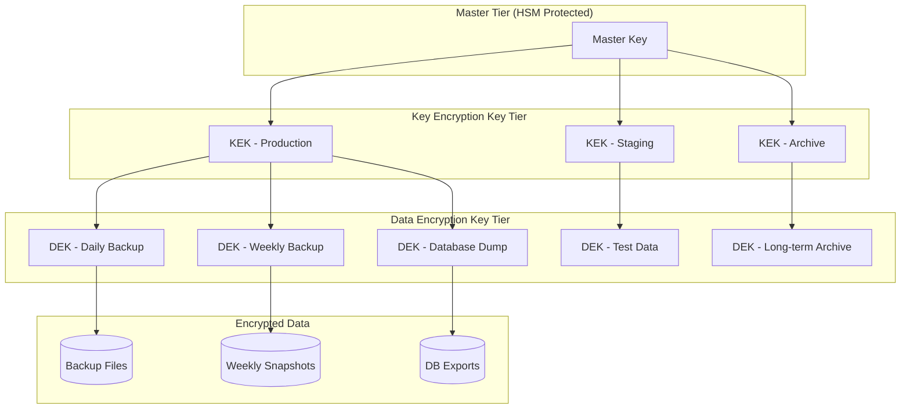
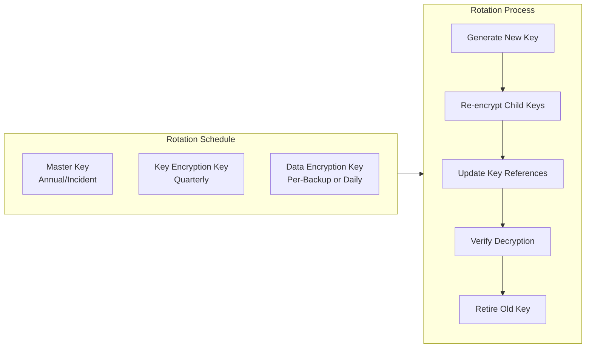
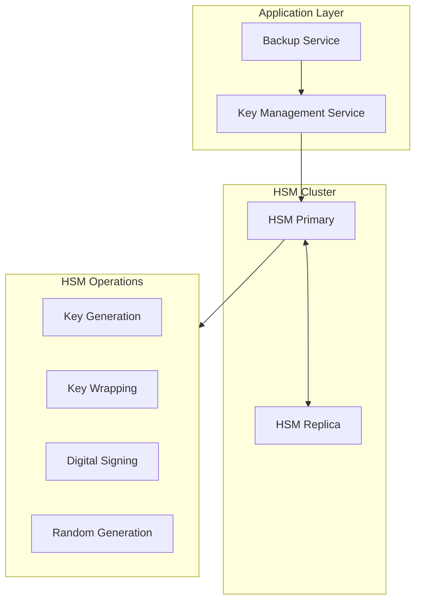
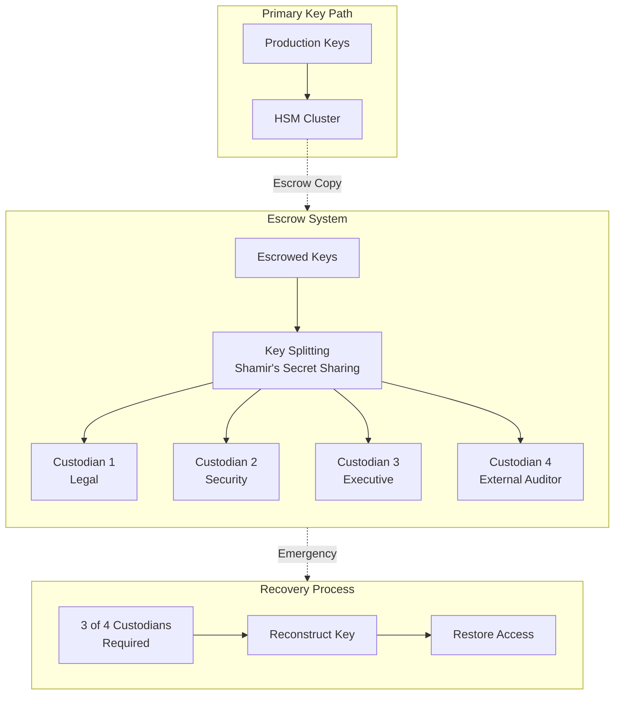
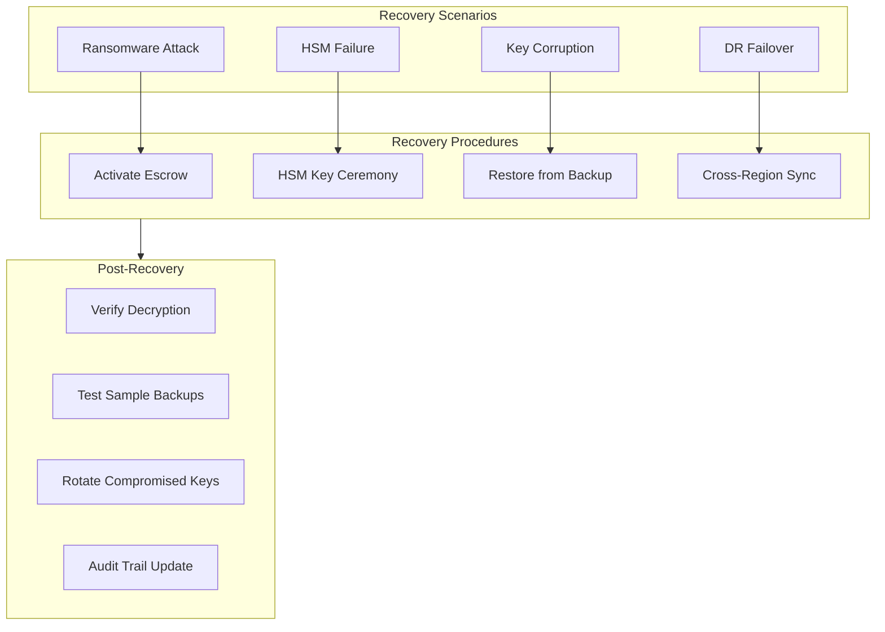

# How to Build Encryption Key Management Details

Author: [nawazdhandala](https://github.com/nawazdhandala)

Tags: Security, Encryption, Key Management, Compliance

Description: Learn detailed encryption key management practices for backup security.

---

Encryption without proper key management is like locking your front door and leaving the key under the mat. Your backup data is only as secure as the keys protecting it. This guide covers the architecture and implementation details you need to build a robust encryption key management system.

## Why Key Management Matters for Backups

Backups contain your most sensitive data - customer records, financial information, credentials, and intellectual property. Poor key management leads to:

- **Data breaches** when keys are stored alongside encrypted data
- **Data loss** when keys are lost or corrupted without recovery options
- **Compliance failures** when audit trails are missing or incomplete
- **Operational chaos** when key rotation disrupts backup and restore processes

A well-designed key management system protects against all these scenarios while keeping your operations smooth.

---

## Key Hierarchy Design

A proper key hierarchy separates concerns and limits blast radius when any single key is compromised.



### The Three-Tier Model

**Tier 1: Master Key (MK)**
- Stored only in Hardware Security Modules (HSMs)
- Never exported in plaintext
- Used exclusively to encrypt/decrypt Key Encryption Keys
- Rotated annually or after security incidents

**Tier 2: Key Encryption Keys (KEKs)**
- Encrypted by the Master Key
- Segregated by environment (production, staging, DR)
- Used to encrypt/decrypt Data Encryption Keys
- Rotated quarterly

**Tier 3: Data Encryption Keys (DEKs)**
- Encrypted by KEKs
- One DEK per backup job or data classification
- Used to encrypt actual backup data
- Rotated with each backup or on a schedule

### Implementation Example

Here is a Python implementation of a three-tier key hierarchy:

```python
from cryptography.hazmat.primitives.ciphers.aead import AESGCM
from cryptography.hazmat.primitives import hashes
from cryptography.hazmat.primitives.kdf.hkdf import HKDF
import os
import json
import base64
from datetime import datetime, timezone
from typing import Optional

class KeyHierarchy:
    """
    Three-tier key hierarchy for backup encryption.
    In production, the master key operations would use HSM APIs.
    """

    def __init__(self, hsm_client=None):
        self.hsm_client = hsm_client
        self.kek_cache = {}
        self.dek_cache = {}

    def derive_kek(self, master_key_id: str, environment: str) -> bytes:
        """
        Derive a Key Encryption Key for a specific environment.
        Uses HKDF for deterministic derivation from master key.
        """
        cache_key = f"{master_key_id}:{environment}"
        if cache_key in self.kek_cache:
            return self.kek_cache[cache_key]

        # In production: self.hsm_client.get_master_key(master_key_id)
        # For demonstration, using a derived key
        master_key = self._get_master_key(master_key_id)

        hkdf = HKDF(
            algorithm=hashes.SHA256(),
            length=32,
            salt=environment.encode(),
            info=b"kek-derivation",
        )
        kek = hkdf.derive(master_key)
        self.kek_cache[cache_key] = kek
        return kek

    def generate_dek(self) -> bytes:
        """Generate a new Data Encryption Key."""
        return AESGCM.generate_key(bit_length=256)

    def wrap_dek(self, dek: bytes, kek: bytes) -> dict:
        """
        Wrap (encrypt) a DEK with a KEK.
        Returns wrapped key with metadata.
        """
        aesgcm = AESGCM(kek)
        nonce = os.urandom(12)
        wrapped = aesgcm.encrypt(nonce, dek, None)

        return {
            "wrapped_key": base64.b64encode(wrapped).decode(),
            "nonce": base64.b64encode(nonce).decode(),
            "algorithm": "AES-256-GCM",
            "wrapped_at": datetime.now(timezone.utc).isoformat(),
        }

    def unwrap_dek(self, wrapped_data: dict, kek: bytes) -> bytes:
        """Unwrap (decrypt) a DEK using a KEK."""
        aesgcm = AESGCM(kek)
        wrapped = base64.b64decode(wrapped_data["wrapped_key"])
        nonce = base64.b64decode(wrapped_data["nonce"])
        return aesgcm.decrypt(nonce, wrapped, None)

    def _get_master_key(self, key_id: str) -> bytes:
        """
        Retrieve master key from HSM.
        This is a placeholder - real implementation uses HSM APIs.
        """
        if self.hsm_client:
            return self.hsm_client.get_key(key_id)
        # Never do this in production - master keys must be in HSM
        raise RuntimeError("HSM client required for master key operations")


class BackupEncryptor:
    """Encrypts backup data using the key hierarchy."""

    def __init__(self, key_hierarchy: KeyHierarchy):
        self.key_hierarchy = key_hierarchy

    def encrypt_backup(
        self,
        data: bytes,
        master_key_id: str,
        environment: str,
        backup_id: str
    ) -> dict:
        """
        Encrypt backup data with a fresh DEK.
        Returns encrypted data and wrapped DEK.
        """
        # Get KEK for this environment
        kek = self.key_hierarchy.derive_kek(master_key_id, environment)

        # Generate fresh DEK for this backup
        dek = self.key_hierarchy.generate_dek()

        # Encrypt the backup data
        aesgcm = AESGCM(dek)
        nonce = os.urandom(12)
        ciphertext = aesgcm.encrypt(nonce, data, backup_id.encode())

        # Wrap the DEK for storage
        wrapped_dek = self.key_hierarchy.wrap_dek(dek, kek)

        return {
            "backup_id": backup_id,
            "environment": environment,
            "master_key_id": master_key_id,
            "ciphertext": base64.b64encode(ciphertext).decode(),
            "nonce": base64.b64encode(nonce).decode(),
            "wrapped_dek": wrapped_dek,
            "encrypted_at": datetime.now(timezone.utc).isoformat(),
        }

    def decrypt_backup(self, encrypted_backup: dict) -> bytes:
        """Decrypt a backup using stored key metadata."""
        # Retrieve KEK
        kek = self.key_hierarchy.derive_kek(
            encrypted_backup["master_key_id"],
            encrypted_backup["environment"]
        )

        # Unwrap the DEK
        dek = self.key_hierarchy.unwrap_dek(
            encrypted_backup["wrapped_dek"],
            kek
        )

        # Decrypt the backup data
        aesgcm = AESGCM(dek)
        ciphertext = base64.b64decode(encrypted_backup["ciphertext"])
        nonce = base64.b64decode(encrypted_backup["nonce"])

        return aesgcm.decrypt(
            nonce,
            ciphertext,
            encrypted_backup["backup_id"].encode()
        )
```

---

## Key Rotation Strategies

Key rotation limits the damage from key compromise and satisfies compliance requirements. Different keys rotate at different frequencies.



### Implementing Key Rotation

```python
from dataclasses import dataclass
from datetime import datetime, timedelta, timezone
from enum import Enum
from typing import List
import uuid

class KeyState(Enum):
    ACTIVE = "active"           # Currently used for encryption
    DECRYPT_ONLY = "decrypt"    # Can decrypt but not encrypt
    RETIRED = "retired"         # Scheduled for deletion
    DESTROYED = "destroyed"     # Cryptographically erased

@dataclass
class KeyMetadata:
    key_id: str
    key_type: str  # master, kek, dek
    state: KeyState
    created_at: datetime
    rotated_at: Optional[datetime]
    expires_at: Optional[datetime]
    parent_key_id: Optional[str]
    environment: Optional[str]

class KeyRotationManager:
    """Manages key lifecycle and rotation."""

    ROTATION_POLICIES = {
        "master": timedelta(days=365),
        "kek": timedelta(days=90),
        "dek": timedelta(days=1),
    }

    RETIREMENT_GRACE = {
        "master": timedelta(days=90),   # Keep for 90 days after rotation
        "kek": timedelta(days=30),
        "dek": timedelta(days=7),
    }

    def __init__(self, key_store, key_hierarchy: KeyHierarchy):
        self.key_store = key_store
        self.key_hierarchy = key_hierarchy

    def check_rotation_needed(self, key_metadata: KeyMetadata) -> bool:
        """Check if a key needs rotation based on policy."""
        if key_metadata.state != KeyState.ACTIVE:
            return False

        policy = self.ROTATION_POLICIES.get(key_metadata.key_type)
        if not policy:
            return False

        age = datetime.now(timezone.utc) - key_metadata.created_at
        return age >= policy

    def rotate_kek(
        self,
        old_kek_id: str,
        master_key_id: str,
        environment: str
    ) -> str:
        """
        Rotate a Key Encryption Key.
        Re-wraps all DEKs encrypted by this KEK.
        """
        # Generate new KEK
        new_kek_id = f"kek-{environment}-{uuid.uuid4().hex[:8]}"
        new_kek = self.key_hierarchy.derive_kek(master_key_id, environment)

        # Get old KEK for re-wrapping
        old_kek_metadata = self.key_store.get_metadata(old_kek_id)
        old_kek = self._retrieve_kek(old_kek_id)

        # Find all DEKs encrypted by old KEK
        deks_to_rewrap = self.key_store.find_keys_by_parent(old_kek_id)

        # Re-wrap each DEK with new KEK
        for dek_metadata in deks_to_rewrap:
            wrapped_dek = self.key_store.get_wrapped_key(dek_metadata.key_id)

            # Unwrap with old KEK
            dek = self.key_hierarchy.unwrap_dek(wrapped_dek, old_kek)

            # Re-wrap with new KEK
            new_wrapped = self.key_hierarchy.wrap_dek(dek, new_kek)

            # Update storage
            self.key_store.update_wrapped_key(
                dek_metadata.key_id,
                new_wrapped,
                new_parent_id=new_kek_id
            )

        # Mark old KEK as decrypt-only
        self.key_store.update_state(old_kek_id, KeyState.DECRYPT_ONLY)

        # Schedule old KEK for retirement
        retirement_date = (
            datetime.now(timezone.utc) +
            self.RETIREMENT_GRACE["kek"]
        )
        self.key_store.schedule_retirement(old_kek_id, retirement_date)

        # Store new KEK metadata
        self.key_store.store_metadata(KeyMetadata(
            key_id=new_kek_id,
            key_type="kek",
            state=KeyState.ACTIVE,
            created_at=datetime.now(timezone.utc),
            rotated_at=None,
            expires_at=None,
            parent_key_id=master_key_id,
            environment=environment,
        ))

        return new_kek_id

    def emergency_rotation(
        self,
        compromised_key_id: str,
        reason: str
    ) -> dict:
        """
        Emergency key rotation after suspected compromise.
        Immediately invalidates the key and re-encrypts all dependent data.
        """
        metadata = self.key_store.get_metadata(compromised_key_id)

        # Immediately revoke the compromised key
        self.key_store.update_state(compromised_key_id, KeyState.DESTROYED)

        # Log the incident
        incident_id = self._log_security_incident(
            key_id=compromised_key_id,
            reason=reason,
            timestamp=datetime.now(timezone.utc)
        )

        # Rotate based on key type
        if metadata.key_type == "master":
            # This is critical - may require HSM ceremony
            return self._emergency_master_rotation(metadata, incident_id)
        elif metadata.key_type == "kek":
            # Re-encrypt all DEKs under this KEK
            return self._emergency_kek_rotation(metadata, incident_id)
        else:
            # DEK compromise - re-encrypt affected backups
            return self._emergency_dek_rotation(metadata, incident_id)

    def _log_security_incident(self, key_id: str, reason: str, timestamp: datetime) -> str:
        """Log security incident for audit trail."""
        incident_id = f"INC-{uuid.uuid4().hex[:8]}"
        # In production: write to secure audit log
        print(f"SECURITY INCIDENT {incident_id}: Key {key_id} compromised - {reason}")
        return incident_id

    def _retrieve_kek(self, kek_id: str) -> bytes:
        """Retrieve KEK from secure storage."""
        # Implementation depends on your key storage backend
        pass

    def _emergency_master_rotation(self, metadata: KeyMetadata, incident_id: str) -> dict:
        """Handle emergency master key rotation."""
        # This typically requires manual HSM ceremony
        return {
            "status": "requires_hsm_ceremony",
            "incident_id": incident_id,
            "action_required": "Contact HSM administrators for master key rotation"
        }

    def _emergency_kek_rotation(self, metadata: KeyMetadata, incident_id: str) -> dict:
        """Handle emergency KEK rotation."""
        new_kek_id = self.rotate_kek(
            metadata.key_id,
            metadata.parent_key_id,
            metadata.environment
        )
        return {
            "status": "completed",
            "incident_id": incident_id,
            "new_key_id": new_kek_id
        }

    def _emergency_dek_rotation(self, metadata: KeyMetadata, incident_id: str) -> dict:
        """Handle emergency DEK rotation - requires backup re-encryption."""
        return {
            "status": "requires_reencryption",
            "incident_id": incident_id,
            "action_required": f"Re-encrypt all backups using DEK {metadata.key_id}"
        }
```

---

## HSM Integration

Hardware Security Modules provide tamper-resistant key storage and cryptographic operations. Your master keys should never exist outside an HSM.



### HSM Integration Patterns

```python
from abc import ABC, abstractmethod
from typing import Optional
import hashlib

class HSMClient(ABC):
    """Abstract HSM client interface."""

    @abstractmethod
    def generate_key(
        self,
        key_id: str,
        key_type: str,
        extractable: bool = False
    ) -> dict:
        """Generate a new key in the HSM."""
        pass

    @abstractmethod
    def wrap_key(
        self,
        wrapping_key_id: str,
        key_to_wrap: bytes
    ) -> bytes:
        """Wrap an external key using an HSM-resident key."""
        pass

    @abstractmethod
    def unwrap_key(
        self,
        wrapping_key_id: str,
        wrapped_key: bytes
    ) -> bytes:
        """Unwrap a key using an HSM-resident key."""
        pass

    @abstractmethod
    def encrypt(
        self,
        key_id: str,
        plaintext: bytes,
        aad: Optional[bytes] = None
    ) -> dict:
        """Encrypt data using an HSM-resident key."""
        pass

    @abstractmethod
    def decrypt(
        self,
        key_id: str,
        ciphertext: bytes,
        iv: bytes,
        aad: Optional[bytes] = None
    ) -> bytes:
        """Decrypt data using an HSM-resident key."""
        pass


class AWSCloudHSMClient(HSMClient):
    """AWS CloudHSM integration."""

    def __init__(self, cluster_id: str, hsm_user: str, hsm_password: str):
        self.cluster_id = cluster_id
        # In production: establish PKCS#11 session
        self._session = self._connect(hsm_user, hsm_password)

    def _connect(self, user: str, password: str):
        """Establish HSM session via PKCS#11."""
        # Actual implementation uses pkcs11 library
        # import pkcs11
        # lib = pkcs11.lib('/opt/cloudhsm/lib/libcloudhsm_pkcs11.so')
        # token = lib.get_token(token_label='hsm_cluster')
        # return token.open(user_pin=f'{user}:{password}')
        pass

    def generate_key(
        self,
        key_id: str,
        key_type: str,
        extractable: bool = False
    ) -> dict:
        """Generate AES-256 key in CloudHSM."""
        # session.generate_key(
        #     pkcs11.KeyType.AES,
        #     256,
        #     label=key_id,
        #     extractable=extractable,
        #     sensitive=True
        # )
        return {
            "key_id": key_id,
            "key_type": key_type,
            "hsm_resident": True,
            "extractable": extractable
        }

    def wrap_key(self, wrapping_key_id: str, key_to_wrap: bytes) -> bytes:
        """Wrap external key using HSM master key."""
        # wrapping_key = session.get_key(label=wrapping_key_id)
        # return wrapping_key.wrap_key(key_to_wrap)
        pass

    def unwrap_key(self, wrapping_key_id: str, wrapped_key: bytes) -> bytes:
        """Unwrap key using HSM master key."""
        # wrapping_key = session.get_key(label=wrapping_key_id)
        # return wrapping_key.unwrap_key(wrapped_key)
        pass

    def encrypt(
        self,
        key_id: str,
        plaintext: bytes,
        aad: Optional[bytes] = None
    ) -> dict:
        """Encrypt using HSM-resident key."""
        # key = session.get_key(label=key_id)
        # iv, ciphertext = key.encrypt(plaintext, mechanism=AES_GCM)
        # return {"ciphertext": ciphertext, "iv": iv}
        pass

    def decrypt(
        self,
        key_id: str,
        ciphertext: bytes,
        iv: bytes,
        aad: Optional[bytes] = None
    ) -> bytes:
        """Decrypt using HSM-resident key."""
        # key = session.get_key(label=key_id)
        # return key.decrypt(ciphertext, iv=iv, mechanism=AES_GCM)
        pass


class HashiCorpVaultClient(HSMClient):
    """HashiCorp Vault Transit secrets engine integration."""

    def __init__(self, vault_addr: str, vault_token: str, transit_mount: str = "transit"):
        self.vault_addr = vault_addr
        self.transit_mount = transit_mount
        self.headers = {"X-Vault-Token": vault_token}

    def generate_key(
        self,
        key_id: str,
        key_type: str,
        extractable: bool = False
    ) -> dict:
        """Create a new encryption key in Vault Transit."""
        import requests

        response = requests.post(
            f"{self.vault_addr}/v1/{self.transit_mount}/keys/{key_id}",
            headers=self.headers,
            json={
                "type": "aes256-gcm96",
                "exportable": extractable,
                "allow_plaintext_backup": False,
            }
        )
        response.raise_for_status()

        return {
            "key_id": key_id,
            "key_type": key_type,
            "vault_path": f"{self.transit_mount}/keys/{key_id}"
        }

    def wrap_key(self, wrapping_key_id: str, key_to_wrap: bytes) -> bytes:
        """Wrap key using Vault Transit."""
        import requests

        response = requests.post(
            f"{self.vault_addr}/v1/{self.transit_mount}/encrypt/{wrapping_key_id}",
            headers=self.headers,
            json={
                "plaintext": base64.b64encode(key_to_wrap).decode()
            }
        )
        response.raise_for_status()

        return response.json()["data"]["ciphertext"].encode()

    def unwrap_key(self, wrapping_key_id: str, wrapped_key: bytes) -> bytes:
        """Unwrap key using Vault Transit."""
        import requests

        response = requests.post(
            f"{self.vault_addr}/v1/{self.transit_mount}/decrypt/{wrapping_key_id}",
            headers=self.headers,
            json={
                "ciphertext": wrapped_key.decode()
            }
        )
        response.raise_for_status()

        return base64.b64decode(response.json()["data"]["plaintext"])

    def encrypt(
        self,
        key_id: str,
        plaintext: bytes,
        aad: Optional[bytes] = None
    ) -> dict:
        """Encrypt data using Vault Transit."""
        import requests

        response = requests.post(
            f"{self.vault_addr}/v1/{self.transit_mount}/encrypt/{key_id}",
            headers=self.headers,
            json={
                "plaintext": base64.b64encode(plaintext).decode(),
                "context": base64.b64encode(aad).decode() if aad else None
            }
        )
        response.raise_for_status()

        return {
            "ciphertext": response.json()["data"]["ciphertext"],
            "key_version": response.json()["data"].get("key_version", 1)
        }

    def decrypt(
        self,
        key_id: str,
        ciphertext: bytes,
        iv: bytes = None,  # Not used in Vault - ciphertext is self-describing
        aad: Optional[bytes] = None
    ) -> bytes:
        """Decrypt data using Vault Transit."""
        import requests

        response = requests.post(
            f"{self.vault_addr}/v1/{self.transit_mount}/decrypt/{key_id}",
            headers=self.headers,
            json={
                "ciphertext": ciphertext.decode() if isinstance(ciphertext, bytes) else ciphertext,
                "context": base64.b64encode(aad).decode() if aad else None
            }
        )
        response.raise_for_status()

        return base64.b64decode(response.json()["data"]["plaintext"])
```

---

## Key Escrow Considerations

Key escrow provides a recovery path when primary key access fails. Design carefully - escrow introduces additional attack surface.



### Implementing Key Escrow with Shamir's Secret Sharing

```python
from typing import List, Tuple
import secrets
import hashlib

class ShamirSecretSharing:
    """
    Shamir's Secret Sharing implementation for key escrow.
    Splits a secret into n shares where k shares can reconstruct it.
    """

    # Using a prime field for security
    PRIME = 2**256 - 189  # Large prime for 256-bit secrets

    def __init__(self, threshold: int, total_shares: int):
        """
        Initialize with threshold (k) and total shares (n).
        k shares required to reconstruct the secret.
        """
        if threshold > total_shares:
            raise ValueError("Threshold cannot exceed total shares")
        if threshold < 2:
            raise ValueError("Threshold must be at least 2")

        self.threshold = threshold
        self.total_shares = total_shares

    def split_secret(self, secret: bytes) -> List[Tuple[int, int]]:
        """
        Split a secret into shares.
        Returns list of (x, y) points on the polynomial.
        """
        secret_int = int.from_bytes(secret, 'big')

        if secret_int >= self.PRIME:
            raise ValueError("Secret too large for field")

        # Generate random polynomial coefficients
        # f(x) = secret + a1*x + a2*x^2 + ... + a(k-1)*x^(k-1)
        coefficients = [secret_int]
        for _ in range(self.threshold - 1):
            coefficients.append(secrets.randbelow(self.PRIME))

        # Evaluate polynomial at n points
        shares = []
        for x in range(1, self.total_shares + 1):
            y = self._evaluate_polynomial(coefficients, x)
            shares.append((x, y))

        return shares

    def reconstruct_secret(self, shares: List[Tuple[int, int]]) -> bytes:
        """
        Reconstruct secret from k shares using Lagrange interpolation.
        """
        if len(shares) < self.threshold:
            raise ValueError(
                f"Need at least {self.threshold} shares, got {len(shares)}"
            )

        # Use only threshold number of shares
        shares = shares[:self.threshold]

        # Lagrange interpolation to find f(0) = secret
        secret = 0
        for i, (xi, yi) in enumerate(shares):
            numerator = 1
            denominator = 1

            for j, (xj, _) in enumerate(shares):
                if i != j:
                    numerator = (numerator * (-xj)) % self.PRIME
                    denominator = (denominator * (xi - xj)) % self.PRIME

            # Modular inverse of denominator
            lagrange_coef = (
                numerator * pow(denominator, -1, self.PRIME)
            ) % self.PRIME

            secret = (secret + yi * lagrange_coef) % self.PRIME

        # Convert back to bytes
        byte_length = (secret.bit_length() + 7) // 8
        return secret.to_bytes(max(byte_length, 32), 'big')

    def _evaluate_polynomial(self, coefficients: List[int], x: int) -> int:
        """Evaluate polynomial at point x using Horner's method."""
        result = 0
        for coef in reversed(coefficients):
            result = (result * x + coef) % self.PRIME
        return result


class KeyEscrowManager:
    """Manages key escrow with secure distribution to custodians."""

    def __init__(
        self,
        threshold: int,
        total_custodians: int,
        custodian_registry: dict
    ):
        self.sss = ShamirSecretSharing(threshold, total_custodians)
        self.custodian_registry = custodian_registry
        self.escrow_log = []

    def escrow_key(
        self,
        key_id: str,
        key_material: bytes,
        reason: str
    ) -> dict:
        """
        Create escrow shares for a key and distribute to custodians.
        """
        # Split the key
        shares = self.sss.split_secret(key_material)

        # Create verification hash (custodians can verify without seeing full key)
        key_hash = hashlib.sha256(key_material).hexdigest()

        # Prepare share packages for each custodian
        share_packages = []
        for (x, y), (custodian_id, custodian_info) in zip(
            shares, self.custodian_registry.items()
        ):
            package = {
                "key_id": key_id,
                "share_index": x,
                "share_value": y,  # In production: encrypt with custodian's public key
                "verification_hash": key_hash,
                "custodian_id": custodian_id,
                "created_at": datetime.now(timezone.utc).isoformat(),
            }
            share_packages.append(package)

            # Distribute to custodian (encrypted channel)
            self._deliver_share(custodian_info, package)

        # Log the escrow event
        escrow_record = {
            "key_id": key_id,
            "reason": reason,
            "threshold": self.sss.threshold,
            "total_shares": self.sss.total_shares,
            "verification_hash": key_hash,
            "escrowed_at": datetime.now(timezone.utc).isoformat(),
            "custodians": list(self.custodian_registry.keys()),
        }
        self.escrow_log.append(escrow_record)

        return escrow_record

    def recover_key(
        self,
        key_id: str,
        provided_shares: List[dict],
        recovery_reason: str
    ) -> bytes:
        """
        Recover an escrowed key using custodian shares.
        Requires threshold number of valid shares.
        """
        # Validate we have enough shares
        if len(provided_shares) < self.sss.threshold:
            raise ValueError(
                f"Need {self.sss.threshold} shares, got {len(provided_shares)}"
            )

        # Verify all shares are for the same key
        key_ids = set(s["key_id"] for s in provided_shares)
        if len(key_ids) != 1 or key_id not in key_ids:
            raise ValueError("Share key_id mismatch")

        # Convert to (x, y) tuples
        shares = [(s["share_index"], s["share_value"]) for s in provided_shares]

        # Reconstruct the key
        key_material = self.sss.reconstruct_secret(shares)

        # Verify against stored hash
        expected_hash = provided_shares[0]["verification_hash"]
        actual_hash = hashlib.sha256(key_material).hexdigest()

        if actual_hash != expected_hash:
            raise ValueError("Reconstructed key verification failed")

        # Log the recovery
        self._log_recovery(key_id, recovery_reason, provided_shares)

        return key_material

    def _deliver_share(self, custodian_info: dict, package: dict):
        """Securely deliver share to custodian."""
        # In production: encrypt with custodian's PGP key,
        # send via secure channel, require acknowledgment
        pass

    def _log_recovery(
        self,
        key_id: str,
        reason: str,
        shares: List[dict]
    ):
        """Log key recovery event for audit."""
        record = {
            "event": "key_recovery",
            "key_id": key_id,
            "reason": reason,
            "custodians_participating": [s["custodian_id"] for s in shares],
            "recovered_at": datetime.now(timezone.utc).isoformat(),
        }
        self.escrow_log.append(record)
```

---

## Recovery Key Management

When disaster strikes, you need a tested path to restore encrypted backups. Recovery procedures should be documented, drilled, and audited.



### Recovery Key Implementation

```python
from dataclasses import dataclass, field
from enum import Enum

class RecoveryType(Enum):
    HSM_FAILURE = "hsm_failure"
    KEY_CORRUPTION = "key_corruption"
    RANSOMWARE = "ransomware"
    DR_FAILOVER = "dr_failover"
    ROUTINE_TEST = "routine_test"

@dataclass
class RecoveryProcedure:
    """Documents a key recovery procedure."""

    recovery_type: RecoveryType
    steps: List[str]
    required_approvals: int
    approvers: List[str]
    max_time_hours: int
    runbook_url: str

@dataclass
class RecoveryAttempt:
    """Records a recovery attempt for audit."""

    attempt_id: str
    recovery_type: RecoveryType
    initiated_by: str
    initiated_at: datetime
    approvals: List[dict] = field(default_factory=list)
    status: str = "pending"
    completed_at: Optional[datetime] = None
    notes: str = ""


class RecoveryKeyManager:
    """Manages backup encryption key recovery procedures."""

    PROCEDURES = {
        RecoveryType.HSM_FAILURE: RecoveryProcedure(
            recovery_type=RecoveryType.HSM_FAILURE,
            steps=[
                "1. Activate standby HSM cluster",
                "2. Restore HSM backup to standby",
                "3. Verify master key availability",
                "4. Update key management service endpoints",
                "5. Test encryption/decryption operations",
                "6. Notify stakeholders of recovery",
            ],
            required_approvals=2,
            approvers=["security-team", "infrastructure-team"],
            max_time_hours=4,
            runbook_url="https://runbooks.internal/hsm-recovery",
        ),
        RecoveryType.KEY_CORRUPTION: RecoveryProcedure(
            recovery_type=RecoveryType.KEY_CORRUPTION,
            steps=[
                "1. Identify corrupted key scope",
                "2. Restore key from secure backup",
                "3. Re-wrap affected child keys",
                "4. Verify backup decryption",
                "5. Update key metadata",
                "6. Investigate corruption cause",
            ],
            required_approvals=2,
            approvers=["security-team", "backup-team"],
            max_time_hours=2,
            runbook_url="https://runbooks.internal/key-corruption",
        ),
        RecoveryType.RANSOMWARE: RecoveryProcedure(
            recovery_type=RecoveryType.RANSOMWARE,
            steps=[
                "1. Isolate affected systems",
                "2. Activate escrow recovery process",
                "3. Verify escrow key integrity",
                "4. Restore from air-gapped backups",
                "5. Decrypt using recovered keys",
                "6. Rotate all potentially exposed keys",
                "7. Conduct forensic investigation",
            ],
            required_approvals=3,
            approvers=["ciso", "security-team", "legal"],
            max_time_hours=24,
            runbook_url="https://runbooks.internal/ransomware-recovery",
        ),
        RecoveryType.DR_FAILOVER: RecoveryProcedure(
            recovery_type=RecoveryType.DR_FAILOVER,
            steps=[
                "1. Verify DR site HSM availability",
                "2. Confirm key replication status",
                "3. Switch key management endpoints",
                "4. Test backup decryption at DR site",
                "5. Update DNS/routing",
                "6. Monitor for issues",
            ],
            required_approvals=1,
            approvers=["on-call-engineer"],
            max_time_hours=1,
            runbook_url="https://runbooks.internal/dr-failover",
        ),
    }

    def __init__(
        self,
        key_hierarchy: KeyHierarchy,
        escrow_manager: KeyEscrowManager,
        notification_service
    ):
        self.key_hierarchy = key_hierarchy
        self.escrow_manager = escrow_manager
        self.notification_service = notification_service
        self.active_recoveries = {}
        self.recovery_history = []

    def initiate_recovery(
        self,
        recovery_type: RecoveryType,
        initiated_by: str,
        reason: str
    ) -> RecoveryAttempt:
        """Start a key recovery process."""
        procedure = self.PROCEDURES[recovery_type]

        attempt = RecoveryAttempt(
            attempt_id=f"REC-{uuid.uuid4().hex[:8]}",
            recovery_type=recovery_type,
            initiated_by=initiated_by,
            initiated_at=datetime.now(timezone.utc),
        )

        # Store active recovery
        self.active_recoveries[attempt.attempt_id] = {
            "attempt": attempt,
            "procedure": procedure,
            "approvals_received": [],
        }

        # Request approvals
        for approver in procedure.approvers:
            self.notification_service.request_approval(
                approver=approver,
                recovery_id=attempt.attempt_id,
                recovery_type=recovery_type.value,
                reason=reason,
                max_time=procedure.max_time_hours,
            )

        return attempt

    def approve_recovery(
        self,
        attempt_id: str,
        approver: str,
        approved: bool,
        notes: str = ""
    ) -> bool:
        """Record an approval for recovery."""
        if attempt_id not in self.active_recoveries:
            raise ValueError(f"Recovery {attempt_id} not found")

        recovery = self.active_recoveries[attempt_id]
        procedure = recovery["procedure"]

        # Verify approver is authorized
        if approver not in procedure.approvers:
            raise PermissionError(f"{approver} not authorized to approve")

        # Record approval
        recovery["approvals_received"].append({
            "approver": approver,
            "approved": approved,
            "timestamp": datetime.now(timezone.utc).isoformat(),
            "notes": notes,
        })

        recovery["attempt"].approvals = recovery["approvals_received"]

        # Check if we have enough approvals
        approved_count = sum(
            1 for a in recovery["approvals_received"] if a["approved"]
        )

        return approved_count >= procedure.required_approvals

    def execute_recovery(
        self,
        attempt_id: str,
        executor: str
    ) -> dict:
        """Execute approved recovery procedure."""
        if attempt_id not in self.active_recoveries:
            raise ValueError(f"Recovery {attempt_id} not found")

        recovery = self.active_recoveries[attempt_id]
        procedure = recovery["procedure"]

        # Verify approvals
        approved_count = sum(
            1 for a in recovery["approvals_received"] if a["approved"]
        )
        if approved_count < procedure.required_approvals:
            raise PermissionError(
                f"Need {procedure.required_approvals} approvals, "
                f"have {approved_count}"
            )

        # Execute based on recovery type
        result = self._execute_procedure(
            recovery["attempt"].recovery_type,
            executor
        )

        # Update attempt status
        recovery["attempt"].status = "completed" if result["success"] else "failed"
        recovery["attempt"].completed_at = datetime.now(timezone.utc)
        recovery["attempt"].notes = result.get("notes", "")

        # Move to history
        self.recovery_history.append(recovery["attempt"])
        del self.active_recoveries[attempt_id]

        return result

    def _execute_procedure(
        self,
        recovery_type: RecoveryType,
        executor: str
    ) -> dict:
        """Execute specific recovery procedure."""
        if recovery_type == RecoveryType.RANSOMWARE:
            return self._execute_ransomware_recovery(executor)
        elif recovery_type == RecoveryType.HSM_FAILURE:
            return self._execute_hsm_recovery(executor)
        elif recovery_type == RecoveryType.KEY_CORRUPTION:
            return self._execute_corruption_recovery(executor)
        elif recovery_type == RecoveryType.DR_FAILOVER:
            return self._execute_dr_failover(executor)
        else:
            raise ValueError(f"Unknown recovery type: {recovery_type}")

    def _execute_ransomware_recovery(self, executor: str) -> dict:
        """Execute ransomware recovery using escrow."""
        # This would trigger escrow key recovery
        return {
            "success": True,
            "notes": "Escrow recovery initiated - awaiting custodian shares"
        }

    def _execute_hsm_recovery(self, executor: str) -> dict:
        """Execute HSM failover."""
        return {
            "success": True,
            "notes": "Standby HSM activated"
        }

    def _execute_corruption_recovery(self, executor: str) -> dict:
        """Execute key corruption recovery."""
        return {
            "success": True,
            "notes": "Key restored from backup"
        }

    def _execute_dr_failover(self, executor: str) -> dict:
        """Execute DR failover."""
        return {
            "success": True,
            "notes": "DR site key management active"
        }

    def test_recovery(self, recovery_type: RecoveryType) -> dict:
        """
        Perform routine recovery test without affecting production.
        Critical for ensuring recovery procedures work when needed.
        """
        test_id = f"TEST-{uuid.uuid4().hex[:8]}"

        # Create test key and backup
        test_key = os.urandom(32)
        test_data = b"Recovery test data - " + datetime.now(timezone.utc).isoformat().encode()

        # Encrypt test data
        aesgcm = AESGCM(test_key)
        nonce = os.urandom(12)
        ciphertext = aesgcm.encrypt(nonce, test_data, None)

        # Escrow the test key
        escrow_result = self.escrow_manager.escrow_key(
            key_id=f"test-key-{test_id}",
            key_material=test_key,
            reason=f"Recovery test {recovery_type.value}"
        )

        # Simulate recovery based on type
        # In a real test, you would go through the full procedure

        return {
            "test_id": test_id,
            "recovery_type": recovery_type.value,
            "escrow_created": True,
            "test_encryption": True,
            "status": "Test framework ready - execute full procedure in DR environment",
            "timestamp": datetime.now(timezone.utc).isoformat(),
        }
```

---

## Compliance Requirements

Different compliance frameworks have specific requirements for encryption key management.

### Compliance Matrix

| Requirement | PCI DSS | HIPAA | SOC 2 | GDPR |
|-------------|---------|-------|-------|------|
| Key separation by environment | Required | Recommended | Required | Recommended |
| HSM for master keys | Required | Recommended | Varies | Recommended |
| Key rotation | Annual minimum | Risk-based | Annual review | Risk-based |
| Key escrow | Required | Required | Recommended | Required |
| Audit logging | All operations | All access | All changes | All processing |
| Access controls | Dual control | Role-based | Least privilege | Purpose limitation |
| Key destruction | Cryptographic erase | Documented | Verifiable | Demonstrated |

### Compliance Audit Logger

```python
from dataclasses import dataclass
from enum import Enum
import json

class AuditEventType(Enum):
    KEY_GENERATED = "key_generated"
    KEY_ACCESSED = "key_accessed"
    KEY_ROTATED = "key_rotated"
    KEY_DESTROYED = "key_destroyed"
    KEY_ESCROWED = "key_escrowed"
    KEY_RECOVERED = "key_recovered"
    ENCRYPTION_PERFORMED = "encryption_performed"
    DECRYPTION_PERFORMED = "decryption_performed"
    ACCESS_DENIED = "access_denied"
    POLICY_VIOLATION = "policy_violation"

@dataclass
class AuditEvent:
    """Immutable audit event for compliance logging."""

    event_id: str
    event_type: AuditEventType
    timestamp: datetime
    actor: str
    actor_ip: str
    key_id: str
    resource_type: str
    action: str
    outcome: str
    details: dict
    compliance_tags: List[str]


class ComplianceAuditLogger:
    """
    Audit logger designed for compliance requirements.
    Ensures immutable, tamper-evident logging of all key operations.
    """

    def __init__(self, log_sink, compliance_frameworks: List[str]):
        """
        Initialize with a log sink (file, SIEM, cloud logging).
        compliance_frameworks: ['pci_dss', 'hipaa', 'soc2', 'gdpr']
        """
        self.log_sink = log_sink
        self.compliance_frameworks = compliance_frameworks
        self.event_sequence = 0

    def log_key_operation(
        self,
        event_type: AuditEventType,
        actor: str,
        actor_ip: str,
        key_id: str,
        outcome: str,
        details: dict
    ) -> str:
        """Log a key management operation."""
        self.event_sequence += 1

        event = AuditEvent(
            event_id=f"EVT-{self.event_sequence:010d}-{uuid.uuid4().hex[:8]}",
            event_type=event_type,
            timestamp=datetime.now(timezone.utc),
            actor=actor,
            actor_ip=actor_ip,
            key_id=key_id,
            resource_type="encryption_key",
            action=event_type.value,
            outcome=outcome,
            details=self._sanitize_details(details),
            compliance_tags=self._get_compliance_tags(event_type),
        )

        # Create tamper-evident record
        record = self._create_audit_record(event)

        # Write to sink
        self.log_sink.write(record)

        return event.event_id

    def _sanitize_details(self, details: dict) -> dict:
        """Remove sensitive data from audit details."""
        sanitized = {}
        sensitive_fields = [
            'key_material', 'password', 'secret',
            'plaintext', 'wrapped_key'
        ]

        for key, value in details.items():
            if key.lower() in sensitive_fields:
                sanitized[key] = "[REDACTED]"
            elif isinstance(value, bytes):
                sanitized[key] = f"[BYTES:{len(value)}]"
            else:
                sanitized[key] = value

        return sanitized

    def _get_compliance_tags(self, event_type: AuditEventType) -> List[str]:
        """Map event types to compliance framework controls."""
        tag_mapping = {
            AuditEventType.KEY_GENERATED: [
                "pci_dss:3.5.2", "soc2:CC6.1", "hipaa:164.312(a)(2)(iv)"
            ],
            AuditEventType.KEY_ACCESSED: [
                "pci_dss:3.5.3", "soc2:CC6.1", "gdpr:art32"
            ],
            AuditEventType.KEY_ROTATED: [
                "pci_dss:3.6.4", "soc2:CC6.1", "hipaa:164.312(a)(2)(iv)"
            ],
            AuditEventType.KEY_DESTROYED: [
                "pci_dss:3.6.5", "soc2:CC6.5", "gdpr:art17"
            ],
            AuditEventType.DECRYPTION_PERFORMED: [
                "pci_dss:3.5.1", "hipaa:164.312(a)(1)", "gdpr:art32"
            ],
        }

        all_tags = tag_mapping.get(event_type, [])
        return [t for t in all_tags if t.split(':')[0] in self.compliance_frameworks]

    def _create_audit_record(self, event: AuditEvent) -> dict:
        """Create tamper-evident audit record."""
        record = {
            "event_id": event.event_id,
            "event_type": event.event_type.value,
            "timestamp": event.timestamp.isoformat(),
            "actor": event.actor,
            "actor_ip": event.actor_ip,
            "key_id": event.key_id,
            "resource_type": event.resource_type,
            "action": event.action,
            "outcome": event.outcome,
            "details": event.details,
            "compliance_tags": event.compliance_tags,
        }

        # Add integrity hash
        record_json = json.dumps(record, sort_keys=True)
        record["integrity_hash"] = hashlib.sha256(
            record_json.encode()
        ).hexdigest()

        return record

    def generate_compliance_report(
        self,
        framework: str,
        start_date: datetime,
        end_date: datetime
    ) -> dict:
        """Generate compliance report for auditors."""
        # Query logs for the period
        events = self.log_sink.query(
            start_date=start_date,
            end_date=end_date,
            compliance_framework=framework
        )

        report = {
            "framework": framework,
            "period": {
                "start": start_date.isoformat(),
                "end": end_date.isoformat(),
            },
            "generated_at": datetime.now(timezone.utc).isoformat(),
            "summary": {
                "total_events": len(events),
                "key_generations": 0,
                "key_rotations": 0,
                "key_destructions": 0,
                "access_denials": 0,
                "policy_violations": 0,
            },
            "events_by_type": {},
            "events_by_key": {},
            "compliance_controls": {},
        }

        for event in events:
            event_type = event["event_type"]

            # Update summary
            if event_type == "key_generated":
                report["summary"]["key_generations"] += 1
            elif event_type == "key_rotated":
                report["summary"]["key_rotations"] += 1
            elif event_type == "key_destroyed":
                report["summary"]["key_destructions"] += 1
            elif event_type == "access_denied":
                report["summary"]["access_denials"] += 1
            elif event_type == "policy_violation":
                report["summary"]["policy_violations"] += 1

            # Group by type
            if event_type not in report["events_by_type"]:
                report["events_by_type"][event_type] = []
            report["events_by_type"][event_type].append(event["event_id"])

            # Group by key
            key_id = event["key_id"]
            if key_id not in report["events_by_key"]:
                report["events_by_key"][key_id] = []
            report["events_by_key"][key_id].append(event["event_id"])

            # Map to compliance controls
            for tag in event.get("compliance_tags", []):
                if tag.startswith(framework):
                    control = tag.split(":")[1]
                    if control not in report["compliance_controls"]:
                        report["compliance_controls"][control] = {
                            "evidence_count": 0,
                            "event_ids": []
                        }
                    report["compliance_controls"][control]["evidence_count"] += 1
                    report["compliance_controls"][control]["event_ids"].append(
                        event["event_id"]
                    )

        return report
```

---

## Security Checklist

Use this checklist to validate your encryption key management implementation:

### Key Hierarchy
- [ ] Master keys stored exclusively in HSM
- [ ] Key Encryption Keys separated by environment
- [ ] Data Encryption Keys unique per backup job
- [ ] No keys stored in source code or configuration files
- [ ] Key metadata stored separately from encrypted data

### Key Rotation
- [ ] Automated rotation schedules configured
- [ ] Master key rotation procedure documented and tested
- [ ] KEK rotation re-wraps all child DEKs
- [ ] Emergency rotation procedure documented
- [ ] Old keys retained for decryption during grace period

### HSM Integration
- [ ] HSM cluster with high availability
- [ ] HSM backup and recovery tested
- [ ] PKCS#11 or cloud KMS integration validated
- [ ] HSM audit logging enabled
- [ ] HSM access restricted to authorized services

### Key Escrow
- [ ] Shamir's Secret Sharing with appropriate threshold
- [ ] Custodians from different organizational units
- [ ] Escrow shares stored in separate secure locations
- [ ] Annual escrow recovery drill completed
- [ ] Custodian list reviewed quarterly

### Recovery
- [ ] Recovery procedures documented in runbooks
- [ ] Recovery tested quarterly in DR environment
- [ ] Approval workflow for recovery operations
- [ ] Recovery audit trail maintained
- [ ] Post-recovery key rotation enforced

### Compliance
- [ ] Audit logging for all key operations
- [ ] Tamper-evident log storage
- [ ] Compliance report generation automated
- [ ] Annual compliance audit completed
- [ ] Access controls reviewed quarterly

---

## Summary

Encryption key management is the foundation of backup security. A well-designed system includes:

1. **Layered key hierarchy** that limits blast radius and enables granular rotation
2. **HSM integration** that keeps master keys tamper-resistant
3. **Automated rotation** that maintains security without operational burden
4. **Escrow procedures** that enable recovery without single points of failure
5. **Comprehensive audit logging** that satisfies compliance requirements

Start with the fundamentals - hierarchy and HSM - then layer in rotation, escrow, and compliance features. Test your recovery procedures regularly. Your backups are only as secure as your weakest key management practice.
