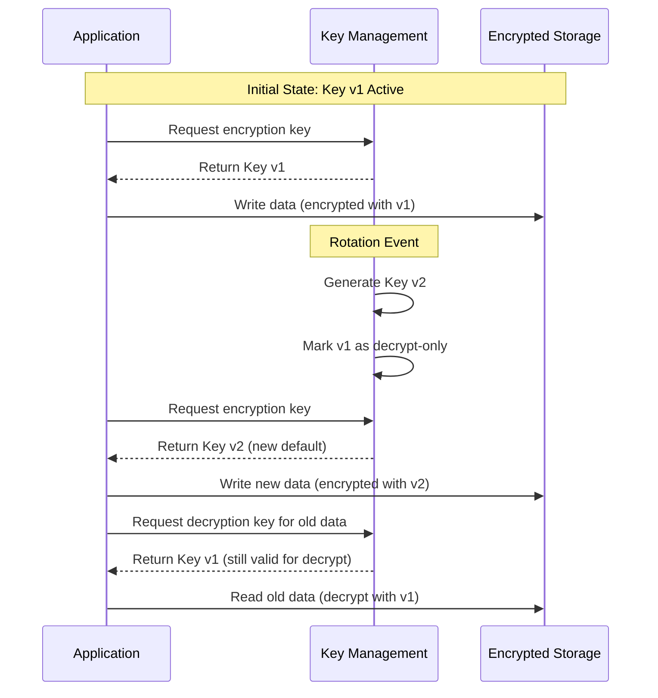
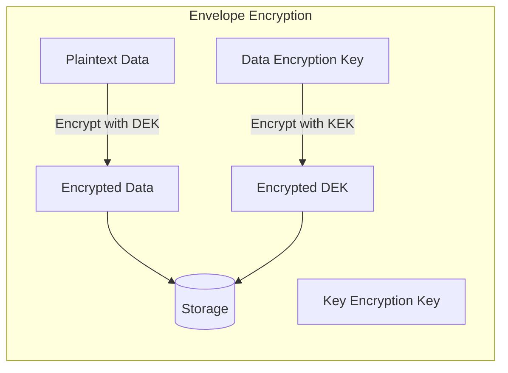
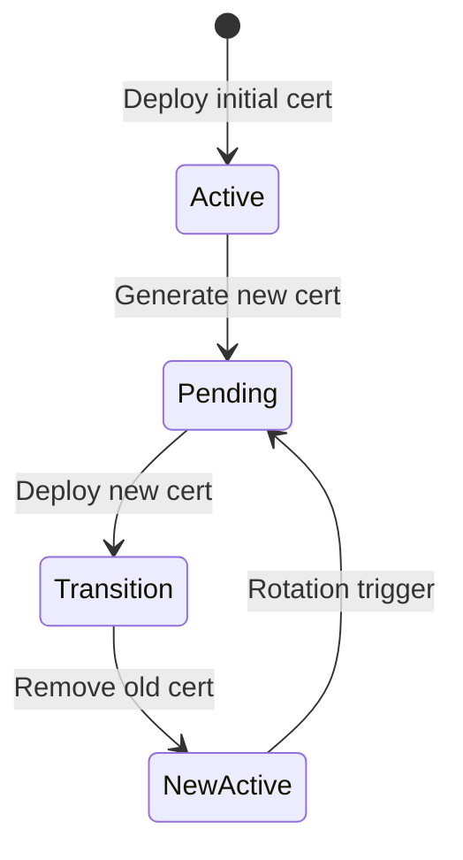

# How to Create Encryption Key Rotation

Author: [nawazdhandala](https://github.com/nawazdhandala)

Tags: Security, Encryption, Key Rotation, KMS

Description: Learn to create encryption key rotation for data-at-rest and transit encryption.

---

Encryption keys are like passwords for your data. Leaving the same key in place forever is risky. If an attacker compromises a key, they gain access to everything encrypted with it. Key rotation limits that blast radius by regularly replacing keys with fresh ones.

This guide walks through implementing key rotation for both data-at-rest and data-in-transit encryption, with practical examples you can adapt to your infrastructure.

## Why Key Rotation Matters

Key rotation provides several security benefits:

- **Limits exposure window** - A compromised key only decrypts data from a specific time period
- **Meets compliance requirements** - PCI-DSS, HIPAA, and SOC2 require periodic key rotation
- **Reduces key wear** - Cryptographic keys used extensively become more vulnerable to analysis
- **Enables recovery from potential breaches** - Even if you suspect a compromise, rotation contains the damage

The diagram below shows how key rotation works over time.



## Key Rotation Strategies

There are two main approaches to key rotation.

### Envelope Encryption

Envelope encryption separates the data encryption key (DEK) from the key encryption key (KEK). You encrypt data with the DEK, then encrypt the DEK with the KEK. Rotation only requires re-encrypting the DEK, not all your data.



### Full Re-encryption

Full re-encryption decrypts all data with the old key and re-encrypts with the new key. This approach is simpler but requires downtime and significant compute resources for large datasets.

## Building a Key Rotation System

Let's build a practical key rotation system in Node.js. The implementation handles key versioning, automatic rotation, and backward compatibility for decryption.

### Key Manager Class

This class manages the lifecycle of encryption keys including generation, rotation, and version tracking.

```javascript
// key-manager.js
const crypto = require('crypto');
const fs = require('fs').promises;

class KeyManager {
  constructor(keyStorePath) {
    this.keyStorePath = keyStorePath;
    this.keys = new Map();
    this.currentKeyVersion = 0;
  }

  // Load existing keys from secure storage
  async initialize() {
    try {
      const data = await fs.readFile(this.keyStorePath, 'utf8');
      const keyData = JSON.parse(data);

      for (const [version, keyInfo] of Object.entries(keyData.keys)) {
        this.keys.set(parseInt(version), {
          key: Buffer.from(keyInfo.key, 'hex'),
          createdAt: new Date(keyInfo.createdAt),
          status: keyInfo.status // 'active', 'decrypt-only', 'retired'
        });
      }
      this.currentKeyVersion = keyData.currentVersion;
    } catch (err) {
      // No existing keys, start fresh
      await this.generateNewKey();
    }
  }

  // Generate a new encryption key and make it the current version
  async generateNewKey() {
    const newVersion = this.currentKeyVersion + 1;
    const newKey = crypto.randomBytes(32); // 256-bit key for AES-256

    // Mark previous key as decrypt-only
    if (this.keys.has(this.currentKeyVersion)) {
      const oldKey = this.keys.get(this.currentKeyVersion);
      oldKey.status = 'decrypt-only';
    }

    this.keys.set(newVersion, {
      key: newKey,
      createdAt: new Date(),
      status: 'active'
    });

    this.currentKeyVersion = newVersion;
    await this.persistKeys();

    return newVersion;
  }

  // Get the current active key for encryption
  getCurrentKey() {
    const keyInfo = this.keys.get(this.currentKeyVersion);
    return {
      version: this.currentKeyVersion,
      key: keyInfo.key
    };
  }

  // Get a specific key version for decryption
  getKey(version) {
    const keyInfo = this.keys.get(version);
    if (!keyInfo) {
      throw new Error(`Key version ${version} not found`);
    }
    if (keyInfo.status === 'retired') {
      throw new Error(`Key version ${version} has been retired`);
    }
    return keyInfo.key;
  }

  // Save keys to secure storage
  async persistKeys() {
    const keyData = {
      currentVersion: this.currentKeyVersion,
      keys: {}
    };

    for (const [version, info] of this.keys) {
      keyData.keys[version] = {
        key: info.key.toString('hex'),
        createdAt: info.createdAt.toISOString(),
        status: info.status
      };
    }

    await fs.writeFile(
      this.keyStorePath,
      JSON.stringify(keyData, null, 2),
      { mode: 0o600 } // Restrict file permissions
    );
  }
}

module.exports = KeyManager;
```

### Encryption Service

The encryption service uses the key manager to encrypt and decrypt data. It stores the key version alongside the ciphertext so decryption can retrieve the correct key.

```javascript
// encryption-service.js
const crypto = require('crypto');

class EncryptionService {
  constructor(keyManager) {
    this.keyManager = keyManager;
    this.algorithm = 'aes-256-gcm';
  }

  // Encrypt data with the current key version
  encrypt(plaintext) {
    const { version, key } = this.keyManager.getCurrentKey();
    const iv = crypto.randomBytes(16);
    const cipher = crypto.createCipheriv(this.algorithm, key, iv);

    let encrypted = cipher.update(plaintext, 'utf8', 'hex');
    encrypted += cipher.final('hex');
    const authTag = cipher.getAuthTag();

    // Return version, IV, auth tag, and ciphertext together
    return {
      keyVersion: version,
      iv: iv.toString('hex'),
      authTag: authTag.toString('hex'),
      ciphertext: encrypted
    };
  }

  // Decrypt data using the key version stored with the ciphertext
  decrypt(encryptedData) {
    const { keyVersion, iv, authTag, ciphertext } = encryptedData;
    const key = this.keyManager.getKey(keyVersion);

    const decipher = crypto.createDecipheriv(
      this.algorithm,
      key,
      Buffer.from(iv, 'hex')
    );
    decipher.setAuthTag(Buffer.from(authTag, 'hex'));

    let decrypted = decipher.update(ciphertext, 'hex', 'utf8');
    decrypted += decipher.final('utf8');

    return decrypted;
  }

  // Re-encrypt data with the current key version
  reEncrypt(encryptedData) {
    const plaintext = this.decrypt(encryptedData);
    return this.encrypt(plaintext);
  }
}

module.exports = EncryptionService;
```

### Automated Key Rotation

Set up a scheduler to rotate keys automatically based on your security policy. The example below rotates keys every 90 days.

```javascript
// rotation-scheduler.js
const cron = require('node-cron');

class RotationScheduler {
  constructor(keyManager, encryptionService, dataStore) {
    this.keyManager = keyManager;
    this.encryptionService = encryptionService;
    this.dataStore = dataStore;
  }

  // Schedule automatic key rotation
  startScheduledRotation(cronExpression = '0 0 1 */3 *') {
    // Default: First day of every third month at midnight
    cron.schedule(cronExpression, async () => {
      console.log('Starting scheduled key rotation');
      await this.rotateKeys();
    });
  }

  async rotateKeys() {
    try {
      // Generate new key
      const newVersion = await this.keyManager.generateNewKey();
      console.log(`Generated new key version: ${newVersion}`);

      // Optionally re-encrypt existing data with new key
      await this.reEncryptExistingData();

      // Retire very old keys (keep last 3 versions for decryption)
      await this.retireOldKeys(3);

      console.log('Key rotation completed successfully');
    } catch (err) {
      console.error('Key rotation failed:', err);
      // Alert your monitoring system
    }
  }

  async reEncryptExistingData() {
    const currentVersion = this.keyManager.currentKeyVersion;
    const records = await this.dataStore.getAllEncryptedRecords();

    for (const record of records) {
      if (record.encryptedData.keyVersion < currentVersion) {
        const reEncrypted = this.encryptionService.reEncrypt(
          record.encryptedData
        );
        await this.dataStore.updateRecord(record.id, reEncrypted);
      }
    }
  }

  async retireOldKeys(keepVersions) {
    const minVersion = this.keyManager.currentKeyVersion - keepVersions;
    for (const [version, keyInfo] of this.keyManager.keys) {
      if (version < minVersion && keyInfo.status !== 'retired') {
        keyInfo.status = 'retired';
      }
    }
    await this.keyManager.persistKeys();
  }
}

module.exports = RotationScheduler;
```

## Using Cloud KMS for Key Rotation

Cloud providers offer managed key rotation that handles much of the complexity. Here's how to configure automatic rotation with AWS KMS.

### AWS KMS Configuration

AWS KMS supports automatic annual rotation. You can also trigger rotation manually for more frequent schedules.

```javascript
// aws-kms-rotation.js
const { KMSClient, CreateKeyCommand, EnableKeyRotationCommand,
        EncryptCommand, DecryptCommand } = require('@aws-sdk/client-kms');

class AWSKMSService {
  constructor(region) {
    this.client = new KMSClient({ region });
    this.keyId = null;
  }

  // Create a new KMS key with automatic rotation enabled
  async createKeyWithRotation() {
    const createResponse = await this.client.send(new CreateKeyCommand({
      Description: 'Application encryption key with auto-rotation',
      KeyUsage: 'ENCRYPT_DECRYPT',
      Origin: 'AWS_KMS'
    }));

    this.keyId = createResponse.KeyMetadata.KeyId;

    // Enable automatic annual rotation
    await this.client.send(new EnableKeyRotationCommand({
      KeyId: this.keyId
    }));

    return this.keyId;
  }

  // Encrypt using KMS - AWS handles key versioning automatically
  async encrypt(plaintext) {
    const response = await this.client.send(new EncryptCommand({
      KeyId: this.keyId,
      Plaintext: Buffer.from(plaintext)
    }));

    return response.CiphertextBlob;
  }

  // Decrypt using KMS - AWS uses the correct key version automatically
  async decrypt(ciphertext) {
    const response = await this.client.send(new DecryptCommand({
      CiphertextBlob: ciphertext
    }));

    return Buffer.from(response.Plaintext).toString();
  }
}

module.exports = AWSKMSService;
```

## TLS Certificate Rotation

Key rotation also applies to TLS certificates for data-in-transit encryption. The process involves generating new certificates, deploying them alongside existing ones, then removing old certificates after a grace period.



### Automated Certificate Rotation Script

This script handles certificate rotation for services running behind a load balancer.

```bash
#!/bin/bash
# cert-rotation.sh

CERT_DIR="/etc/ssl/app"
BACKUP_DIR="/etc/ssl/app/backup"
DOMAIN="api.example.com"

# Create backup of current certificates
backup_current_certs() {
    timestamp=$(date +%Y%m%d_%H%M%S)
    mkdir -p "$BACKUP_DIR/$timestamp"
    cp "$CERT_DIR/server.crt" "$BACKUP_DIR/$timestamp/"
    cp "$CERT_DIR/server.key" "$BACKUP_DIR/$timestamp/"
    echo "Backed up certificates to $BACKUP_DIR/$timestamp"
}

# Generate new certificate using certbot
generate_new_cert() {
    certbot certonly \
        --dns-cloudflare \
        --dns-cloudflare-credentials /root/.cloudflare/credentials \
        -d "$DOMAIN" \
        --cert-path "$CERT_DIR/server.crt" \
        --key-path "$CERT_DIR/server.key" \
        --non-interactive
}

# Reload service to pick up new certificates
reload_service() {
    systemctl reload nginx
    # Or for Kubernetes: kubectl rollout restart deployment/api
}

# Verify new certificate is valid
verify_cert() {
    openssl x509 -in "$CERT_DIR/server.crt" -noout -dates
    if [ $? -eq 0 ]; then
        echo "Certificate verification passed"
        return 0
    else
        echo "Certificate verification failed"
        return 1
    fi
}

# Main rotation process
main() {
    echo "Starting certificate rotation for $DOMAIN"

    backup_current_certs

    if generate_new_cert; then
        if verify_cert; then
            reload_service
            echo "Certificate rotation completed successfully"
        else
            echo "Reverting to backup"
            cp "$BACKUP_DIR/$(ls -t $BACKUP_DIR | head -1)/"* "$CERT_DIR/"
            exit 1
        fi
    else
        echo "Certificate generation failed"
        exit 1
    fi
}

main "$@"
```

## Best Practices

Follow these guidelines to implement key rotation effectively:

- **Never delete old keys immediately** - Keep them available for decryption until all data is re-encrypted
- **Log rotation events** - Maintain an audit trail of when keys were rotated and by whom
- **Test rotation in staging** - Verify your rotation process works before running it in production
- **Monitor decryption failures** - Sudden spikes may indicate rotation issues
- **Automate everything** - Manual rotation is error-prone and often forgotten
- **Use hardware security modules (HSMs)** - For high-security environments, store keys in HSMs
- **Separate key access from data access** - Different teams should control keys versus encrypted data

## Rotation Frequency Guidelines

| Data Classification | Rotation Frequency | Re-encryption |
|---------------------|-------------------|---------------|
| Public | Annual | Not required |
| Internal | Quarterly | On rotation |
| Confidential | Monthly | Weekly batch |
| Restricted/PCI | Weekly | Daily batch |

---

Key rotation is a fundamental security practice that limits the damage from key compromise. Start with envelope encryption to minimize re-encryption overhead, automate your rotation schedule, and always maintain backward compatibility for decryption. Your future self dealing with a security audit will thank you.
