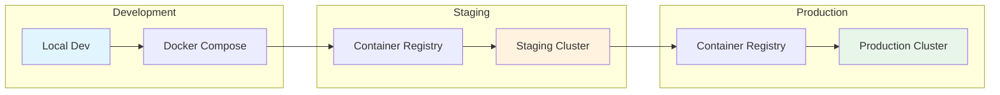
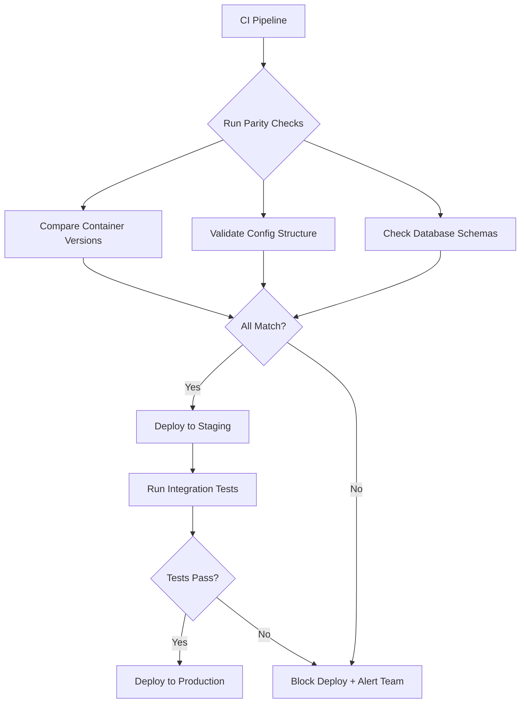

# How to Implement Environment Parity

Author: [nawazdhandala](https://github.com/nawazdhandala)

Tags: DevOps, Environments, Blue-Green, Consistency

Description: Learn to implement environment parity for consistent staging and production environments.

---

Environment parity is a core principle of the twelve-factor app methodology. It means keeping your development, staging, and production environments as similar as possible. When environments drift apart, you end up with the classic problem: "It works on my machine." This post walks through practical strategies to achieve and maintain environment parity across your infrastructure.

## Why Environment Parity Matters

When staging and production environments differ, bugs slip through testing. A configuration that works in staging might fail in production due to subtle differences in OS versions, library versions, or infrastructure setup. Environment parity eliminates these surprises by ensuring that code behaves the same way across all stages of the deployment pipeline.

The following diagram illustrates a typical deployment flow with environment parity.



## Step 1: Containerize Everything

Containers provide the foundation for environment parity. By packaging your application with its dependencies, you ensure the same runtime environment everywhere.

Here is a Dockerfile that creates a consistent Node.js application environment.

```dockerfile
# Use a specific version tag, never 'latest'
FROM node:20.11.0-alpine3.19

# Set working directory
WORKDIR /app

# Copy package files first for better layer caching
COPY package*.json ./

# Install dependencies with exact versions from lockfile
RUN npm ci --only=production

# Copy application code
COPY . .

# Run as non-root user for security
USER node

# Expose the application port
EXPOSE 3000

# Start the application
CMD ["node", "server.js"]
```

Notice the specific version tags. Using `node:latest` or `node:20` can lead to different base images across environments. Always pin to exact versions.

## Step 2: Use Infrastructure as Code

Infrastructure as Code (IaC) tools let you define your infrastructure in version-controlled files. This ensures staging and production use identical configurations.

The following Terraform configuration creates consistent infrastructure across environments.

```hcl
# variables.tf - Define environment-specific variables
variable "environment" {
  description = "The deployment environment"
  type        = string
}

variable "instance_count" {
  description = "Number of instances to deploy"
  type        = number
}

# main.tf - Infrastructure definition
resource "aws_instance" "app_server" {
  count         = var.instance_count
  ami           = "ami-0c55b159cbfafe1f0"  # Pin to specific AMI
  instance_type = "t3.medium"

  tags = {
    Name        = "app-server-${var.environment}-${count.index}"
    Environment = var.environment
    ManagedBy   = "terraform"
  }
}

# Use the same module for both environments
module "database" {
  source = "./modules/database"

  environment     = var.environment
  engine_version  = "14.9"  # Pin database version
  instance_class  = "db.t3.medium"
}
```

Create separate variable files for each environment while keeping the infrastructure code identical.

```hcl
# staging.tfvars
environment    = "staging"
instance_count = 2

# production.tfvars
environment    = "production"
instance_count = 4
```

## Step 3: Manage Configuration with Environment Variables

Configuration should live outside your codebase. Use environment variables to inject configuration at runtime, keeping the application code identical across environments.

This example shows how to load configuration in a Node.js application.

```javascript
// config.js - Load configuration from environment variables
const config = {
  // Database configuration
  database: {
    host: process.env.DB_HOST,
    port: parseInt(process.env.DB_PORT, 10) || 5432,
    name: process.env.DB_NAME,
    user: process.env.DB_USER,
    password: process.env.DB_PASSWORD,
  },

  // Redis configuration
  redis: {
    url: process.env.REDIS_URL,
  },

  // Application settings
  app: {
    port: parseInt(process.env.PORT, 10) || 3000,
    logLevel: process.env.LOG_LEVEL || 'info',
  },
};

// Validate required configuration
const requiredVars = ['DB_HOST', 'DB_NAME', 'DB_USER', 'DB_PASSWORD'];
const missing = requiredVars.filter(v => !process.env[v]);

if (missing.length > 0) {
  throw new Error(`Missing required environment variables: ${missing.join(', ')}`);
}

module.exports = config;
```

## Step 4: Implement Database Schema Migrations

Database schema differences cause many environment parity issues. Use migration tools to ensure all environments have identical schemas.

Here is a migration setup using Knex.js.

```javascript
// migrations/20260130_create_users_table.js
exports.up = function(knex) {
  return knex.schema.createTable('users', (table) => {
    // Use consistent column types across all environments
    table.uuid('id').primary().defaultTo(knex.raw('gen_random_uuid()'));
    table.string('email', 255).notNullable().unique();
    table.string('name', 255).notNullable();
    table.timestamp('created_at').defaultTo(knex.fn.now());
    table.timestamp('updated_at').defaultTo(knex.fn.now());

    // Add indexes for performance
    table.index('email');
  });
};

exports.down = function(knex) {
  return knex.schema.dropTable('users');
};
```

Run migrations as part of your deployment process to keep schemas synchronized.

```bash
#!/bin/bash
# deploy.sh - Run migrations before starting the application

set -e  # Exit on any error

echo "Running database migrations..."
npx knex migrate:latest

echo "Starting application..."
node server.js
```

## Step 5: Synchronize External Services

External services like message queues and caches should match across environments. Use Docker Compose to replicate production services locally.

```yaml
# docker-compose.yml - Local development environment
version: '3.8'

services:
  app:
    build: .
    ports:
      - "3000:3000"
    environment:
      - DB_HOST=postgres
      - DB_PORT=5432
      - DB_NAME=myapp
      - DB_USER=postgres
      - DB_PASSWORD=localpassword
      - REDIS_URL=redis://redis:6379
    depends_on:
      - postgres
      - redis

  postgres:
    image: postgres:14.9-alpine  # Match production version
    environment:
      - POSTGRES_DB=myapp
      - POSTGRES_USER=postgres
      - POSTGRES_PASSWORD=localpassword
    volumes:
      - postgres_data:/var/lib/postgresql/data

  redis:
    image: redis:7.2.3-alpine  # Match production version
    volumes:
      - redis_data:/data

volumes:
  postgres_data:
  redis_data:
```

## Step 6: Automate Environment Validation

Create automated checks that compare environments and alert on drift.



This script compares database schemas between environments.

```bash
#!/bin/bash
# validate-parity.sh - Compare database schemas between environments

STAGING_SCHEMA=$(pg_dump -h staging-db.example.com -U app -s myapp)
PROD_SCHEMA=$(pg_dump -h prod-db.example.com -U app -s myapp)

# Compare schemas, ignoring comments and whitespace
STAGING_NORMALIZED=$(echo "$STAGING_SCHEMA" | grep -v "^--" | tr -s ' ')
PROD_NORMALIZED=$(echo "$PROD_SCHEMA" | grep -v "^--" | tr -s ' ')

if [ "$STAGING_NORMALIZED" != "$PROD_NORMALIZED" ]; then
  echo "ERROR: Schema drift detected between staging and production"
  diff <(echo "$STAGING_NORMALIZED") <(echo "$PROD_NORMALIZED")
  exit 1
fi

echo "SUCCESS: Schemas match"
```

## Common Pitfalls to Avoid

Several mistakes frequently undermine environment parity efforts.

**Using different service versions**: When staging runs PostgreSQL 14 while production runs PostgreSQL 13, you will encounter compatibility issues. Always match versions exactly.

**Manual configuration changes**: Any change made directly in production without going through your IaC creates drift. Treat infrastructure as immutable and always deploy through your pipeline.

**Ignoring local development**: Developers often skip setting up proper local environments. Invest in making local setup easy with Docker Compose and clear documentation.

**Skipping integration tests**: Unit tests alone cannot catch environment-specific bugs. Run integration tests in staging with production-like data.

## Conclusion

Environment parity requires discipline and the right tooling. Start with containers to ensure runtime consistency, use Infrastructure as Code to manage your cloud resources, and automate validation to catch drift early. The investment pays off through fewer production incidents, faster debugging, and more confidence in your deployments.

Remember that perfect parity is not always achievable or necessary. Focus on the components that matter most: application runtime, database versions, and external service configurations. These are where most environment-related bugs originate.
