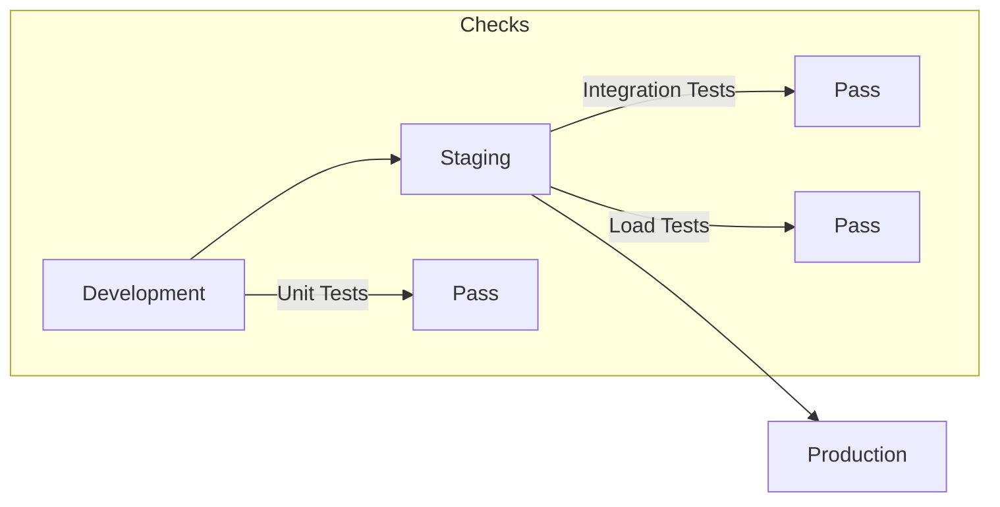
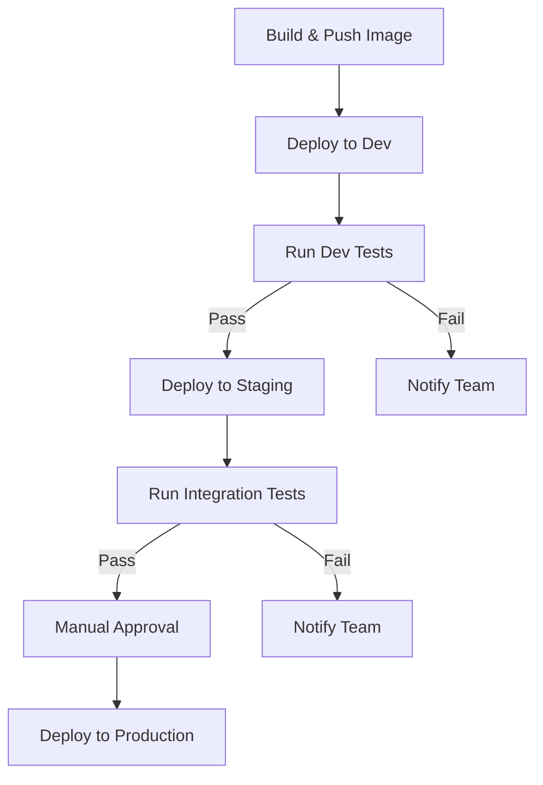
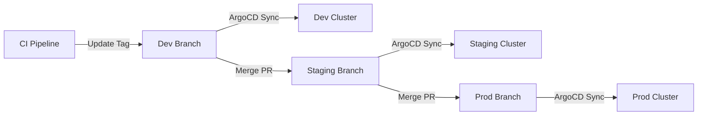

# How to Implement Environment Promotion

Author: [nawazdhandala](https://github.com/nawazdhandala)

Tags: DevOps, Promotion, Environments, GitOps

Description: Learn to implement environment promotion from dev to staging to production.

---

Environment promotion is the process of moving code changes through a series of environments before they reach production. Each environment acts as a gate, catching issues before they affect real users. This guide walks you through implementing a robust promotion strategy using GitOps principles.

## Why Environment Promotion Matters

Deploying directly to production is asking for trouble. Environment promotion gives you multiple checkpoints to catch bugs, performance regressions, and configuration errors. A typical pipeline looks like this:



Each environment serves a specific purpose:

- **Development**: Where developers test their changes locally or in a shared dev cluster
- **Staging**: A production mirror for integration testing and QA sign-off
- **Production**: The live environment serving real users

## Setting Up Your Repository Structure

The foundation of environment promotion is a clean repository structure. Using Kustomize overlays, you can maintain environment-specific configurations while sharing a common base.

```
app/
├── base/
│   ├── kustomization.yaml
│   ├── deployment.yaml
│   ├── service.yaml
│   └── configmap.yaml
└── overlays/
    ├── dev/
    │   ├── kustomization.yaml
    │   └── patches/
    │       └── replicas.yaml
    ├── staging/
    │   ├── kustomization.yaml
    │   └── patches/
    │       └── replicas.yaml
    └── production/
        ├── kustomization.yaml
        └── patches/
            └── replicas.yaml
```

The base directory contains your core Kubernetes manifests. Each overlay customizes the base for its target environment.

Here is the base kustomization file that references all shared resources:

```yaml
# base/kustomization.yaml
apiVersion: kustomize.config.k8s.io/v1beta1
kind: Kustomization
resources:
  - deployment.yaml
  - service.yaml
  - configmap.yaml
```

The base deployment defines the application without environment-specific values:

```yaml
# base/deployment.yaml
apiVersion: apps/v1
kind: Deployment
metadata:
  name: myapp
spec:
  replicas: 1
  selector:
    matchLabels:
      app: myapp
  template:
    metadata:
      labels:
        app: myapp
    spec:
      containers:
        - name: myapp
          image: myapp:latest  # Tag will be overridden per environment
          ports:
            - containerPort: 8080
          env:
            - name: LOG_LEVEL
              value: "info"
```

Each environment overlay patches the base with environment-specific settings:

```yaml
# overlays/production/kustomization.yaml
apiVersion: kustomize.config.k8s.io/v1beta1
kind: Kustomization
namespace: production
resources:
  - ../../base
patches:
  - path: patches/replicas.yaml
images:
  - name: myapp
    newTag: v1.2.3  # Pinned version for production
```

The replica patch scales up for production traffic:

```yaml
# overlays/production/patches/replicas.yaml
apiVersion: apps/v1
kind: Deployment
metadata:
  name: myapp
spec:
  replicas: 5  # Higher replica count for production load
```

## Implementing the Promotion Pipeline

A promotion pipeline automates the flow of changes through environments. The key principle is that the same artifact moves through each stage.



Here is a GitHub Actions workflow that implements this flow:

```yaml
# .github/workflows/promote.yaml
name: Environment Promotion

on:
  push:
    branches: [main]

env:
  IMAGE_NAME: ghcr.io/${{ github.repository }}

jobs:
  build:
    runs-on: ubuntu-latest
    outputs:
      image_tag: ${{ steps.meta.outputs.version }}
    steps:
      - uses: actions/checkout@v4

      # Generate a unique tag based on commit SHA
      - name: Docker meta
        id: meta
        uses: docker/metadata-action@v5
        with:
          images: ${{ env.IMAGE_NAME }}
          tags: type=sha,prefix=

      - name: Build and push
        uses: docker/build-push-action@v5
        with:
          push: true
          tags: ${{ steps.meta.outputs.tags }}

  deploy-dev:
    needs: build
    runs-on: ubuntu-latest
    environment: development
    steps:
      - uses: actions/checkout@v4

      # Update the image tag in the dev overlay
      - name: Update dev manifest
        run: |
          cd overlays/dev
          kustomize edit set image myapp=${{ env.IMAGE_NAME }}:${{ needs.build.outputs.image_tag }}

      - name: Deploy to dev
        run: |
          kubectl apply -k overlays/dev
          kubectl rollout status deployment/myapp -n dev --timeout=5m

  deploy-staging:
    needs: [build, deploy-dev]
    runs-on: ubuntu-latest
    environment: staging
    steps:
      - uses: actions/checkout@v4

      - name: Update staging manifest
        run: |
          cd overlays/staging
          kustomize edit set image myapp=${{ env.IMAGE_NAME }}:${{ needs.build.outputs.image_tag }}

      - name: Deploy to staging
        run: |
          kubectl apply -k overlays/staging
          kubectl rollout status deployment/myapp -n staging --timeout=5m

      # Run integration tests against staging
      - name: Run integration tests
        run: |
          ./scripts/integration-tests.sh staging

  deploy-production:
    needs: [build, deploy-staging]
    runs-on: ubuntu-latest
    environment: production  # Requires manual approval in GitHub
    steps:
      - uses: actions/checkout@v4

      - name: Update production manifest
        run: |
          cd overlays/production
          kustomize edit set image myapp=${{ env.IMAGE_NAME }}:${{ needs.build.outputs.image_tag }}

      - name: Deploy to production
        run: |
          kubectl apply -k overlays/production
          kubectl rollout status deployment/myapp -n production --timeout=10m
```

## GitOps Promotion with ArgoCD

For teams using ArgoCD, environment promotion becomes a Git operation. Instead of applying manifests directly, you update the image tag in Git and let ArgoCD sync the change.



Define an ApplicationSet to manage all environments from a single template:

```yaml
# argocd/applicationset.yaml
apiVersion: argoproj.io/v1alpha1
kind: ApplicationSet
metadata:
  name: myapp
  namespace: argocd
spec:
  generators:
    - list:
        elements:
          - env: dev
            branch: main
            autoSync: true
          - env: staging
            branch: release/staging
            autoSync: true
          - env: production
            branch: release/production
            autoSync: false  # Manual sync for production
  template:
    metadata:
      name: 'myapp-{{ env }}'
    spec:
      project: default
      source:
        repoURL: https://github.com/myorg/myapp.git
        targetRevision: '{{ branch }}'
        path: 'overlays/{{ env }}'
      destination:
        server: https://kubernetes.default.svc
        namespace: '{{ env }}'
      syncPolicy:
        automated:
          prune: '{{ autoSync }}'
          selfHeal: '{{ autoSync }}'
```

To promote a change, create a pull request that updates the image tag in the target environment:

```bash
# Promote from staging to production
git checkout release/production
git merge release/staging
git push origin release/production
```

## Rollback Strategies

Things go wrong. When they do, you need fast rollback options. Kubernetes keeps a history of deployments that you can revert to instantly.

Roll back to the previous version with a single command:

```bash
# Immediately revert to the last known good state
kubectl rollout undo deployment/myapp -n production
```

Check the rollout history to see available revisions:

```bash
# List all available revisions with their change causes
kubectl rollout history deployment/myapp -n production
```

Roll back to a specific revision if needed:

```bash
# Revert to revision 5 specifically
kubectl rollout undo deployment/myapp -n production --to-revision=5
```

For GitOps workflows, rollback means reverting the Git commit:

```bash
# Find the commit that broke production
git log --oneline overlays/production/

# Revert the bad change
git revert <bad-commit-sha>
git push origin release/production
```

## Environment Configuration Management

Each environment needs different configuration values. Use ConfigMaps and Secrets with Kustomize to manage these differences safely.

Create a base ConfigMap with default values:

```yaml
# base/configmap.yaml
apiVersion: v1
kind: ConfigMap
metadata:
  name: myapp-config
data:
  DATABASE_POOL_SIZE: "5"
  CACHE_TTL: "300"
  FEATURE_FLAGS: "false"
```

Override values per environment using Kustomize patches:

```yaml
# overlays/production/patches/configmap.yaml
apiVersion: v1
kind: ConfigMap
metadata:
  name: myapp-config
data:
  DATABASE_POOL_SIZE: "50"  # Higher pool for production load
  CACHE_TTL: "3600"         # Longer cache for production
  FEATURE_FLAGS: "true"     # Enable features after testing
```

For secrets, use External Secrets Operator or Sealed Secrets to keep credentials out of Git:

```yaml
# overlays/production/external-secret.yaml
apiVersion: external-secrets.io/v1beta1
kind: ExternalSecret
metadata:
  name: myapp-secrets
spec:
  refreshInterval: 1h
  secretStoreRef:
    name: vault
    kind: ClusterSecretStore
  target:
    name: myapp-secrets
  data:
    - secretKey: DATABASE_URL
      remoteRef:
        key: production/myapp
        property: database_url
```

## Validation Gates

Add validation gates between environments to catch issues early. These checks run automatically before promotion proceeds.

A simple validation script that runs after each deployment:

```bash
#!/bin/bash
# scripts/validate-deployment.sh

ENVIRONMENT=$1
NAMESPACE=$ENVIRONMENT

echo "Validating deployment in $ENVIRONMENT..."

# Check all pods are running
READY=$(kubectl get deployment myapp -n $NAMESPACE -o jsonpath='{.status.readyReplicas}')
DESIRED=$(kubectl get deployment myapp -n $NAMESPACE -o jsonpath='{.spec.replicas}')

if [ "$READY" != "$DESIRED" ]; then
    echo "ERROR: Only $READY/$DESIRED pods ready"
    exit 1
fi

# Check endpoint health
HEALTH_URL="https://myapp.$ENVIRONMENT.example.com/health"
HTTP_CODE=$(curl -s -o /dev/null -w "%{http_code}" $HEALTH_URL)

if [ "$HTTP_CODE" != "200" ]; then
    echo "ERROR: Health check failed with HTTP $HTTP_CODE"
    exit 1
fi

echo "Validation passed for $ENVIRONMENT"
```

## Monitoring Promotions

Track promotions across environments with proper observability. Add annotations to deployments so you can correlate changes with metrics.

```yaml
# base/deployment.yaml
metadata:
  annotations:
    prometheus.io/scrape: "true"
    app.kubernetes.io/version: "v1.2.3"
    deployment.kubernetes.io/revision: "1"
```

Query your monitoring system for deployment events:

```promql
# Alert on deployment failures
increase(kube_deployment_status_observed_generation{namespace="production"}[5m]) > 0
and
kube_deployment_status_replicas_available < kube_deployment_spec_replicas
```

---

Environment promotion is not just about moving code through stages. It is about building confidence that your changes work before they reach users. Start simple with dev and production, then add staging when your team and product grow. The goal is fast, safe deployments that let you ship multiple times per day without fear.
